

  

<h3 align="center">Universidad Peruana de Ciencias Aplicadas</h3>

<h3 align="center">Carrera de Ingeniería de Software</h3>

 

<strong>1ACC0238</strong> 
<strong>Aplicaciones para Dispositivos Móviles</strong>

<h2 align="center">Informe de Trabajo Final</h2>

<strong>Equipo</strong> 
Innovify

<strong>Proyecto</strong> 
SkillSwap

<h3 align="center">Integrantes</h3>

| Código | Apellidos y nombres |
| :--- | :--- |
| U201924127 | Alberca Saavedra, Víctor Manuel |
| U20231C792 | Becerra Ninahuanca, Luis Angel |
| U201724692 | Komatsu Dueñas, David |
| U20241D958 | Lopez Montalvo, Kevin Edu |
| U202423711 | Sulca Sanchez, Piero Angel |

<strong>Período 202620</strong>

Septiembre 2026

---

## Registro de Versiones del Informe

| Versión | Fecha | Autor | Descripción de modificación |
| :--- | :--- | :--- | :--- |
| **v.01.Avn1** | 10/09/2026 | Alberca Saavedra, Víctor Manuel Becerra Ninahuanca, Luis Angel Lopez Montalvo, Kevin Edu Komatsu Dueñas, David Piero Sulca Sánchez | Se agregaron los siguientes tópicos:  **Student Outcome** **Objetivos SMART**  **Capítulo I: Presentación** 1.1. Startup Profile 1.1.1. Descripción de la Startup 1.1.2. Perfiles de integrantes del equipo 1.2. Solution Profile 1.2.1. Antecedentes y problemática 1.2.2. Lean UX Process 1.2.2.1. Lean UX Problem Statements 1.2.2.2. Lean UX Assumptions 1.2.2.3. Lean UX Hypothesis Statements 1.2.2.4. Lean UX Canvas 1.3. Segmentos objetivo  **Capítulo II: Requirements Development and Software Solution Design** 2.1. Competidores 2.1.1. Análisis competitivo 2.1.2. Estrategias y tácticas frente a competidores 2.2. Entrevistas 2.2.1. Diseño de entrevistas 2.2.2. Registro de entrevistas 2.2.3. Análisis de entrevistas 2.3. Needfinding 2.3.1. User Personas 2.3.2. User Task Matrix 2.3.3. User Journey Mapping 2.3.4. Empathy Mapping 2.3.5. Big Picture EventStorming 2.3.6. Ubiquitous Language 2.4. Requirements specification 2.4.1. User Stories 2.4.2. Impact Mapping 2.4.3. Product Backlog 2.5. Strategic-Level Domain-Driven Design 2.5.1. EventStorming 2.5.1.1. Candidate Context Discovery 2.5.1.2. Domain Message Flows Modeling 2.5.1.3. Bounded Context Canvases 2.5.2. Context Mapping 2.5.3. Software Architecture 2.5.3.1. Software Architecture Context Level Diagrams 2.5.3.2. Software Architecture Container Level Diagrams 2.5.3.3. Software Architecture Deployment Diagrams 2.6. Tactical-Level Domain-Driven Design (los 7 Bounded Contexts: Identity & Access, Credential Verification, Learning Path Engine, Assessment & Peer Review, Reputation, Recognition & Incentives, Moderation & Disputes) 2.6.x.1. Domain Layer 2.6.x.2. Interface Layer 2.6.x.3. Application Layer 2.6.x.4. Infrastructure Layer 2.6.x.5. Bounded Context Software Architecture Component Level Diagrams 2.6.x.6. Bounded Context Software Architecture Code Level Diagrams 2.6.x.6.1. Bounded Context Domain Layer Class Diagrams 2.6.x.6.2. Bounded Context Database Design Diagram  **Conclusiones** **Bibliografía** |

---

## Project Report Collaboration Insights

En esta sección se indica el URL del repositorio utilizado para la elaboración colaborativa del Informe de Trabajo Final, así como las evidencias de participación de cada integrante del equipo durante el desarrollo de la entrega AV1.

**URL del repositorio del Project Report (GitHub):**
[ https://github.com/orgs/Aplicaciones-Moviles-SkillSwap/repositories ]( https://github.com/orgs/Aplicaciones-Moviles-SkillSwap/repositories )

### AV1

Durante el desarrollo de la entrega AV1, el equipo distribuyó la elaboración del informe asignando capítulos y secciones específicas a cada integrante según sus áreas de responsabilidad. Cada miembro realizó sus aportes directamente en el repositorio de GitHub mediante commits en ramas individuales, siguiendo la convención de Conventional Commits y GitFlow, integrando los cambios mediante Pull Requests hacia la rama `develop`. Todos los integrantes participaron activamente en la redacción de secciones del informe en formato Markdown, asegurando coherencia y calidad en el contenido entregado.

A continuación, se presentan las capturas de los analíticos de colaboración del repositorio del informe:

**Figura 1**

*Gráfico de contribuciones al repositorio del Project Report durante AV1*

  

*Nota.* Se evidencia la participación de todos los integrantes del equipo mediante commits realizados en el período correspondiente. Elaboración propia.

**Figura 2**

*Historial de commits en el repositorio del Project Report*

  

*Nota.* Se evidencian los aportes individuales de cada integrante con sus respectivos mensajes bajo la convención Conventional Commits. Elaboración propia.

---

## Student Outcome

El curso contribuye al cumplimiento del Student Outcome ABET:
**ABET EAC - Student Outcome 7:** La capacidad de adquirir y aplicar nuevos conocimientos según sea necesario, utilizando estrategias de aprendizaje apropiadas.

En el siguiente cuadro se describe las acciones realizadas y enunciados de conclusiones por parte del grupo, que permiten sustentar el haber alcanzado el logro del ABET – EAC - Student Outcome 7.

| Criterio específico | Acciones realizadas | Conclusiones |
| :--- | :--- | :--- |
| **Actualiza conceptos y conocimientos necesarios para su desarrollo profesional y en especial para su proyecto en soluciones de software.** | **Alberca Saavedra, Víctor Manuel (AV1):** Lideré la investigación de la tecnología externa (ML Kit, SDK de reconocimiento de texto) a integrar en el proyecto móvil, evaluando sus requisitos técnicos y adaptándolos a la arquitectura móvil nativa. Participé en el diseño estratégico de los Bounded Contexts, incluyendo su rediseño tras el pivote del modelo de negocio.  **Becerra Ninahuanca, Luis Angel (AV1):** Investigué patrones de diseño UI/UX específicos para aplicaciones móviles multiplataforma y colaboré en el análisis competitivo y el diseño de entrevistas enfocadas en la experiencia de movilidad de los estudiantes.  **Lopez Montalvo, Kevin Edu (AV1):** Documenté el proceso Lean UX y apliqué el aprendizaje sobre persistencia de datos locales en dispositivos para el diseño de los requisitos, estructurando las User Stories bajo un enfoque Mobile-First.  **Komatsu Dueñas, David (AV1):** Evalué diferentes estrategias de integración de servicios RESTful y modelé el flujo de mensajes entre los Bounded Contexts aplicando Domain Storytelling adaptado al consumo de APIs desde aplicaciones móviles.  **Sulca Sánchez, Piero Angel (AV1):** Estudié los fundamentos del diseño estratégico con Domain-Driven Design a partir del material del curso y de las plantillas de la comunidad ddd-crew, y los apliqué para elaborar el EventStorming de SkillSwap en sus diez pasos, el Candidate Context Discovery, los Domain Message Flows y los Bounded Context Canvases, modelados en Excalidraw. Para sustentar el problema del Capítulo I, investigué datos estadísticos sobre la brecha entre la certificación y el dominio práctico, los verifiqué en sus fuentes originales y los cité en formato APA 7. | (AV1) El equipo reconoce la necesidad del aprendizaje permanente al investigar e integrar de manera autónoma tecnologías no vistas en clase, como SDKs externos de reconocimiento de texto y persistencia local en dispositivos, aplicando conceptos de Domain-Driven Design al entorno móvil. |
| **Reconoce la necesidad del aprendizaje permanente para el desempeño profesional y el desarrollo de proyectos en soluciones de software.** | **Alberca Saavedra, Víctor Manuel (AV1):** Al enfrentar el pivote del modelo de negocio a mitad de ciclo, tuve que reevaluar y rediseñar desde cero la estrategia de Bounded Contexts que ya había avanzado, reconociendo que el conocimiento adquirido durante la investigación previa (SUNEDU, matching por embeddings) no era aplicable al nuevo alcance del curso y debía sustituirse por soluciones más simples y viables.  **Becerra Ninahuanca, Luis Angel (AV1):** Reconocí la necesidad de actualizar el análisis competitivo y las preguntas de entrevista previamente diseñadas, dado que el modelo de negocio original ya no reflejaba la propuesta de valor vigente del proyecto.  **Lopez Montalvo, Kevin Edu (AV1):** Identifiqué la necesidad de revisar y reestructurar la documentación de Lean UX ya elaborada para que reflejara el nuevo enfoque del proyecto, en lugar de darla por completa.  **Komatsu Dueñas, David (AV1):** Reconocí que los flujos de integración entre Bounded Contexts modelados inicialmente debían replantearse por completo tras el cambio de alcance, en vez de simplemente ajustar el software ya diseñado.  **Sulca Sánchez, Piero Angel (AV1):** Al alinear el Capítulo I con el modelo de negocio vigente, reconocí que partes ya redactadas del informe, como el segmento del Coordinador, el canje de SkillCredits y el enfoque en la deserción académica, respondían a un modelo anterior y debían reformularse en lugar de darse por terminadas. Durante el EventStorming, los puntos críticos identificados me llevaron a revisar decisiones del dominio, como la calificación por criterios y el segundo revisor, antes de trasladarlas al diseño, entendiendo que el modelo se refina de forma iterativa. | (AV1) El equipo reconoce que el aprendizaje permanente no se limita a adquirir tecnologías nuevas, sino también a la capacidad de soltar y reformular conocimiento previamente validado cuando el contexto del proyecto cambia, como ocurrió tras el pivote del modelo de negocio de tutorías a verificación de habilidades. |

## Objetivos SMART

*   **Alberca Saavedra Víctor Manuel:** Completar un curso de especialización en arquitecturas móviles (Kotlin/Swift) para diciembre de 2026, logrando aplicar al menos 3 patrones de diseño avanzados en proyectos personales.
*   **Becerra Ninahuanca Luis Angel:** Obtener una certificación en integración de servicios Cloud para aplicaciones móviles en los próximos 6 meses, mejorando la seguridad y reduciendo la latencia en el consumo de APIs.
*   **Lopez Montalvo Kevin Edu:** Dominar herramientas de testing automatizado para aplicaciones multiplataforma (ej. Appium) antes de culminar la carrera, logrando automatizar el 80% de los flujos críticos de la aplicación.
*   **Komatsu Dueñas, David:** Desarrollar habilidades de liderazgo técnico gestionando al menos 2 proyectos de software open source orientados a móviles en GitHub durante el próximo año, implementando GitFlow y CI/CD de forma efectiva.
*   **Sulca Sánchez, Piero:** Dominar el desarrollo de aplicaciones móviles multiplataforma con Flutter antes de marzo de 2027, logrando publicar al menos una aplicación funcional en Google Play Store con cobertura de pruebas automatizadas superior al 70%.

---

# Capítulo I: Presentación

## 1.1. Startup Profile

### 1.1.1. Descripción de la Startup

Innovify es una startup tecnológica del sector educativo que desarrolla soluciones orientadas a la validación de habilidades. Su producto, SkillSwap, es una plataforma móvil dirigida principalmente a estudiantes universitarios y jóvenes profesionales que necesitan complementar sus credenciales con una demostración de que pueden aplicar las habilidades declaradas. La propuesta busca reducir la brecha entre completar una actividad formativa y demostrar el dominio práctico de los conocimientos adquiridos.

SkillSwap organiza la experiencia a partir del objetivo declarado por el Estudiante y lo relaciona con una taxonomía de habilidades para proponer una ruta de certificación, compuesta por nodos que se evalúan mediante un *quiz* o un miniproyecto; toda ruta incluye un mínimo de nodos con entrega práctica. El Estudiante puede incorporar certificados externos, cuyos datos se extraen mediante reconocimiento óptico de caracteres con ML Kit para facilitar su registro y análisis de riesgo documental. Esta extracción no demuestra por sí misma el dominio de la habilidad: la comprobación se realiza mediante esas evaluaciones aplicadas, cuya generación puede ser asistida por inteligencia artificial. Cuando la evaluación automática no resulta suficiente, el caso se asigna a un Verificador habilitado, quien califica el entregable criterio por criterio con una rúbrica estructurada; la aprobación se calcula a partir de esos puntajes y, si no se alcanza, el Estudiante recibe los criterios que no cumplió para corregir su entrega. Al completar la ruta, el Estudiante presenta una demostración final asíncrona que también califica un Verificador habilitado, de modo que ninguna certificación se emite sin que una persona haya evaluado su trabajo. La certificación queda respaldada por el historial de evaluaciones y revisiones realizadas en la plataforma.

Para revisar casos de otros usuarios, el Estudiante debe completar previamente su propia ruta de certificación y aprobar un examen de ingreso relacionado con la habilidad que desea verificar. Una vez habilitado, puede participar como Verificador y recibir SkillCredits por cada intervención validada. Los SkillCredits constituyen unidades de reconocimiento no monetarias asociadas a su participación y experiencia como Verificador; no pueden comprarse ni canjearse, y se acumulan como reputación: al alcanzar ciertos umbrales, el Verificador obtiene rangos visibles en su perfil profesional.

Innovify plantea para SkillSwap un modelo de negocio B2C basado en una suscripción mensual pagada por los Estudiantes. Esta suscripción brinda acceso a las rutas de certificación, las evaluaciones y la supervisión del proceso de validación. No existen pagos directos ni comisiones entre Estudiantes y Verificadores. Además, la plataforma incorpora una capa de moderación interna, responsable de monitorear la confiabilidad de las revisiones, gestionar situaciones que requieran reevaluación y consultar métricas generales sobre la actividad del ecosistema.

La asignación de casos se realiza automáticamente considerando la habilidad requerida, el historial y la disponibilidad de los Verificadores. Asimismo, SkillSwap incorpora mecanismos de confianza como la verificación del correo electrónico, el historial auditable de las evaluaciones y la habilitación de Verificadores a partir de las certificaciones obtenidas dentro de la plataforma. Estos mecanismos buscan reducir la dependencia de declaraciones no comprobadas y favorecer un proceso de validación consistente.

### Visión

Ser una plataforma de referencia en la validación práctica de habilidades, reconocida por ofrecer a estudiantes universitarios y jóvenes profesionales un proceso confiable, trazable y sostenible de certificación y verificación entre pares.

### Misión

Facilitar que estudiantes universitarios y jóvenes profesionales demuestren el dominio práctico de sus habilidades mediante rutas de certificación, evaluaciones aplicadas apoyadas por tecnología y revisiones estructuradas entre pares. Innovify reconoce la contribución de los Verificadores mediante SkillCredits y mantiene mecanismos de moderación para supervisar la confiabilidad y el seguimiento del proceso de validación.

### 1.1.2. Perfiles de integrantes del equipo

| Foto | Integrante | Carrera | Descripción |
| :---: | :--- | :--- | :--- |
|  | **Alberca Saavedra, Víctor Manuel** (U201924127) | Ingeniería de Software | Aporta conocimientos sólidos en arquitectura de software, backend y bases de datos. Lidera la investigación e integración del SDK de reconocimiento de texto (ML Kit) y la adaptación de los Bounded Contexts al entorno móvil. |
|  | **Becerra Ninahuanca, Luis Angel** (U20231C792) | Ingeniería de Software | Especialista en lógica de negocio, integración de servicios e interfaces limpias. Investiga patrones de diseño UI/UX propios de aplicaciones móviles nativas/multiplataforma y lidera el análisis competitivo enfocado en apps del mismo rubro. |
|  | **Lopez Montalvo, Kevin Edu** (U20241D958) | Ingeniería de Software | Aporta conocimientos en diseño móvil, UX/UI y metodologías ágiles. Documenta el proceso Lean UX y estructura las User Stories bajo un enfoque Mobile-First. |
|  | **Komatsu Dueñas, David** (U201724692) | Ingeniería de Software | Enfocado en investigación tecnológica, análisis de datos y control de calidad. Lidera el modelado de flujos de mensajes entre Bounded Contexts y el diseño de diagramas de arquitectura. |
|  | **Sulca Sanchez, Piero Angel** (U202423711) | Ingeniería de Software | Cuenta con experiencia en desarrollo web y trabajo en equipos pequeños. Se especializa en frontend y muestra interés por el diseño creativo de interfaces, especialmente en experiencias 3D, animaciones y productos digitales diferenciados. Aporta conocimientos en levantamiento de requerimientos, diseño de interfaces, desarrollo web con React y TypeScript, y diseño de bases de datos, además de organización y colaboración en equipo. |

 

---

## 1.2. Solution Profile

### 1.2.1. Antecedentes y problemática

En el mercado laboral peruano existe una brecha entre las habilidades requeridas por las organizaciones y las que encuentran entre los postulantes. La Encuesta de Habilidades al Trabajo 2017-2018 señala que el 47% de las empresas con vacantes tuvo dificultades para cubrirlas y que el 76% de las vacantes difíciles de cubrir se relacionó con la falta de habilidades de los candidatos (Novella et al., 2019). Estas cifras establecen el contexto de una brecha de habilidades que exige mecanismos más claros para demostrar las capacidades de los postulantes.

Paralelamente, el aprendizaje en línea y la obtención de credenciales digitales continúan expandiéndose. Coursera registra 1,7 millones de estudiantes peruanos en su plataforma y reporta un crecimiento interanual del 33% en las inscripciones a Certificados Profesionales en el país (Coursera, 2025). Un certificado de finalización acredita que una persona completó una actividad conforme a los criterios de su emisor; sin embargo, considerado de manera aislada, no necesariamente ofrece una demostración suficiente y verificable de cómo aplica la habilidad en un contexto práctico. En este sentido, los enfoques de contratación basados en habilidades proponen complementar las calificaciones y credenciales con mecanismos que permitan identificar y demostrar competencias específicas (Organisation for Economic Co-operation and Development [OECD], 2024).

A partir de este contexto, el problema identificado es la dificultad que enfrentan los Estudiantes para complementar sus certificados con un proceso que evalúe la aplicación práctica de las habilidades declaradas. La dispersión de certificados, proyectos y resultados agrava el seguimiento, pero no constituye la causa principal: el vacío central es la falta de una comprobación directa del desempeño y de criterios claros para determinar el dominio. Sin esa evaluación, el propio Estudiante puede desconocer qué aspectos necesita reforzar hasta enfrentarse a una tarea aplicada. Asimismo, los Verificadores necesitan un entorno estructurado para revisar entregables y registrar sus contribuciones, mientras que la plataforma requiere mecanismos para supervisar la confiabilidad de esas decisiones.

Esta situación dificulta que los Estudiantes reconozcan sus brechas antes de aplicar una habilidad y respalden sus credenciales con pruebas de desempeño comparables. También impide que terceros comprendan el proceso seguido para determinar el dominio. La oportunidad consiste, por tanto, en complementar la formación existente con un proceso de validación que articule credenciales, evaluaciones aplicadas, revisiones humanas y decisiones documentadas.

El contexto tecnológico favorece el planteamiento de una solución móvil: el 95,4% de los hogares peruanos cuenta con telefonía móvil, mientras que el 37,8% dispone de una computadora; además, el 89,0% de los usuarios de internet accede al servicio mediante un teléfono celular (Instituto Nacional de Estadística e Informática [INEI], 2025). Estas cifras respaldan la elección del canal móvil para acercar el proceso de validación a los segmentos objetivo.

Para analizar los antecedentes y delimitar la problemática, se aplica la técnica de las **5W y 2H**: *What*, *Why*, *Who*, *When*, *Where*, *How* y *How much*. Esta técnica permite identificar el problema, sus causas, los actores involucrados, las circunstancias en las que se manifiesta, su alcance y sus principales efectos.

#### What (¿Qué? / ¿Cuál?)
* **¿Cuál es el problema?** Los Estudiantes que obtienen certificados de finalización no siempre cuentan con un proceso complementario que les permita comprobar, mediante una tarea aplicada y un resultado verificable, que pueden utilizar las habilidades declaradas.
* **¿Qué alternativas existen actualmente?** Las plataformas de educación en línea permiten adquirir conocimientos y obtener credenciales; los portafolios permiten exhibir proyectos; y las redes profesionales permiten comunicar logros. En las alternativas analizadas, estos mecanismos no se articulan en un mismo proceso que relacione una credencial externa con una evaluación práctica, una eventual revisión por un par habilitado y la supervisión de la confiabilidad de la decisión.
* **¿Qué efectos produce el problema?** El Estudiante puede desconocer qué aspectos necesita reforzar hasta enfrentarse a una tarea real y debe complementar su credencial con demostraciones preparadas bajo criterios diversos. Por ello, un tercero no siempre puede reconstruir cómo se determinó el dominio de la habilidad. A su vez, la labor del Verificador puede quedar sin un registro que respalde su experiencia y la plataforma puede carecer de indicadores para supervisar la calidad de las decisiones.

#### Why (¿Por qué?)
* **¿Por qué ocurre el problema?** Una credencial de finalización registra el cumplimiento de los criterios definidos por su emisor. Cuando estos criterios se limitan a completar contenidos o aprobar una evaluación estandarizada centrada en reconocer o recordar información, no se observa el desempeño de la persona ante una tarea aplicada a un caso real. Por ello, relacionar mejor los documentos existentes no resuelve por sí solo la insuficiencia: es necesario comprobar la aplicación de la habilidad mediante criterios explícitos y dejar constancia de la decisión.

#### Who (¿Quién?)
* **¿Quiénes son los principales afectados?** Los Estudiantes universitarios y jóvenes profesionales que necesitan demostrar las habilidades adquiridas mediante cursos, certificaciones, proyectos o aprendizaje autónomo.
* **¿Qué otros actores están involucrados?** También intervienen los Verificadores con experiencia suficiente para revisar los entregables de sus pares, cuya calidad debe ser supervisada para sostener la confiabilidad del proceso.

#### When (¿Cuándo?)
* **¿Cuándo se manifiesta el problema?** Se hace visible después de obtener una credencial, al postular a prácticas o empleos y cuando el Estudiante necesita demostrar la aplicación de una habilidad ante una tarea o proyecto concreto.
* **¿Cuándo vuelve a presentarse?** Puede repetirse cada vez que el Estudiante incorpora una nueva habilidad o presenta una credencial ante un contexto que exige evidencia adicional de aplicación práctica.

#### Where (¿Dónde?)
* **¿En qué ámbitos se manifiesta?** En la educación universitaria, las plataformas de aprendizaje en línea, los procesos de formación autónoma y las etapas de incorporación al mercado laboral.
* **¿Dónde se produce la desconexión?** En la transición entre el espacio que emite la credencial y el contexto donde el Estudiante debe demostrar que puede aplicar la habilidad adquirida.

#### How (¿Cómo?)
* **¿Cómo se manifiesta actualmente?** El Estudiante puede presentar el certificado, sus proyectos y los resultados de evaluaciones previas, pero estos elementos no siempre comparten criterios ni permiten reconstruir mediante un registro verificable cómo se comprobó el dominio. En consecuencia, cada receptor debe interpretarlos por separado y el Estudiante carece de retroalimentación precisa sobre los aspectos que necesita reforzar.
* **¿Cómo puede abordarse?** Mediante una experiencia móvil que relacione las credenciales con pruebas aplicadas a la habilidad y, cuando sea necesario, con revisiones realizadas por Verificadores habilitados mediante rúbricas estructuradas y sujetas a una moderación posterior.

#### How much (¿Cuánto?)
* **¿Qué magnitud tiene la brecha de habilidades en el Perú?** El 47% de las empresas con vacantes tuvo dificultades para cubrirlas y el 76% de las vacantes difíciles de cubrir se relacionó con la falta de habilidades de los candidatos (Novella et al., 2019). Estas cifras dimensionan la necesidad de hacer visibles y comprobables las capacidades de los postulantes.
* **¿Qué alcance tiene el aprendizaje en línea entre usuarios peruanos?** En Coursera se registran 1,7 millones de estudiantes peruanos, equivalentes al 7% de la fuerza laboral del país, y un crecimiento interanual del 33% en las inscripciones a Certificados Profesionales (Coursera, 2025).
* **¿Qué alcance tiene la inadecuación ocupacional?** Rivas Cossio (2023) reporta una tasa de inadecuación ocupacional del 68,6% entre los jóvenes profesionales analizados en Lima Metropolitana, lo que evidencia dificultades de correspondencia entre formación y empleo dentro de esa población.
* **¿Qué importancia tiene la brecha para las organizaciones?** A nivel global, el 63% de los empleadores identifica las brechas de habilidades como una de las principales barreras para transformar sus negocios durante el periodo 2025-2030 (World Economic Forum, 2025).

#### Objetivo de la solución

Desarrollar una plataforma móvil que permita a Estudiantes universitarios y jóvenes profesionales complementar sus certificados con pruebas aplicadas, revisiones calificadas mediante rúbrica y una demostración final, todas provistas de un registro auditable, para demostrar el dominio práctico de sus habilidades. Asimismo, la solución organizará el proceso mediante rutas de certificación, reconocerá la participación de los Verificadores y ofrecerá mecanismos de calificación y reporte que permitan moderar el desempeño de los Verificadores.

#### Restricciones del alcance

* SkillSwap complementa la formación obtenida en universidades, plataformas educativas y otros medios; no reemplaza esas fuentes ni imparte cursos o tutorías.
* La plataforma evalúa entregables dentro de su propio proceso, pero no garantiza la contratación laboral del Estudiante ni sustituye los procedimientos de selección de las organizaciones.
* La extracción de datos mediante OCR facilita el registro y el análisis de riesgo documental, pero no equivale a una comprobación oficial ante la entidad emisora; las integraciones con registros externos quedan fuera del alcance implementado.
* La confiabilidad de la revisión entre pares depende de la disponibilidad de Verificadores previamente habilitados para cada habilidad.
* La inteligencia artificial generativa se utiliza como apoyo para producir contenido evaluativo, pero los resultados del proceso deben mantenerse sujetos a las reglas de validación y supervisión de la plataforma.
* El desarrollo se limita a las funcionalidades e integraciones seleccionadas para el periodo académico.

---
### 1.2.2. Lean UX Process

#### 1.2.2.1. Lean UX Problem Statements

El estado actual de la formación en línea y la certificación de habilidades en el Perú se ha enfocado principalmente en facilitar que estudiantes universitarios y jóvenes profesionales completen actividades formativas y obtengan credenciales emitidas por distintas instituciones y plataformas. La expansión de este flujo se refleja en el crecimiento de las inscripciones a Certificados Profesionales entre los usuarios peruanos de Coursera (Coursera, 2025), mientras que las dificultades para encontrar las habilidades requeridas en los postulantes evidencian una brecha persistente en el mercado laboral peruano (Novella et al., 2019). Esta situación afecta a los actores del proyecto de la siguiente manera:

* **Personas que quieren aprender — Estudiante:** necesita comprobar cómo aplica la habilidad adquirida, identificar los aspectos que debe reforzar y respaldar sus certificados mediante resultados verificables.
* **Personas que validan el conocimiento — Verificador:** necesita criterios estructurados para revisar los entregables de otros Estudiantes y un registro que reconozca la experiencia adquirida mediante esas revisiones.

Lo que los productos y servicios analizados no logran resolver de manera integrada es la validación práctica complementaria de una credencial previamente obtenida. Un certificado de finalización informa que una persona cumplió los criterios de su emisor, pero no necesariamente muestra cómo se desempeña ante un caso concreto. Las alternativas analizadas atienden por separado el aprendizaje, la presentación de proyectos o la comunicación de logros; la brecha consiste en articular la credencial con una prueba aplicada, una eventual revisión humana estructurada y la supervisión de la confiabilidad de la decisión. Esta necesidad es coherente con los enfoques basados en habilidades, que proponen complementar las calificaciones y credenciales con demostraciones de competencias específicas (OECD, 2024).

Nuestro producto abordará esta brecha mediante una experiencia móvil en la que el Estudiante definirá un objetivo y seguirá una ruta de certificación relacionada con las habilidades requeridas, que incluirá un mínimo de nodos con entrega práctica. El reconocimiento óptico de caracteres facilitará el registro y análisis documental de los certificados, mientras que la inteligencia artificial generativa apoyará la creación de evaluaciones adaptadas a cada habilidad. Cuando la evaluación automática no resulte suficiente, el caso se asignará a un Verificador habilitado que calificará el entregable criterio por criterio con una rúbrica estructurada, y si no alcanza el umbral de aprobación el Estudiante recibirá los criterios que no cumplió. Al completar la ruta, una demostración final asíncrona, también calificada por un Verificador, garantizará que ninguna certificación se emita sin revisión humana. A su vez, el Estudiante podrá calificar la revisión recibida y reportar la decisión que considere incorrecta, de modo que el desempeño de cada Verificador quede a la vista y las revisiones deficientes se detecten a tiempo.

Nuestro foco inicial serán las personas que quieren aprender: Estudiantes universitarios y jóvenes profesionales de 18 a 30 años de Lima Metropolitana que utilizan recursos de formación en línea y necesitan presentar demostraciones prácticas con un registro verificable al incorporarse al mercado laboral.

Sabremos que tendremos éxito cuando, durante la validación del producto, al menos el 70% de los Estudiantes que registre un certificado complete la evaluación práctica asociada, al menos el 85% de los casos escalados sea resuelto por un Verificador en un plazo máximo de 48 horas y menos del 3% de las decisiones emitidas por los Verificadores sea posteriormente revertido en la moderación.

#### 1.2.2.2. Lean UX Assumptions

##### Business Assumptions

* Creemos que existe un mercado de Estudiantes universitarios y jóvenes profesionales dispuesto a pagar una suscripción por complementar sus credenciales con un proceso de validación práctica.
* Creemos que la suscripción mensual de los Estudiantes puede sostener el modelo B2C como única fuente de ingresos, sin comisiones entre usuarios ni venta de SkillCredits.
* Creemos que el reconocimiento obtenido mediante SkillCredits y un historial de revisiones será suficiente para atraer y mantener Verificadores activos sin ofrecerles una retribución monetaria directa.
* Creemos que la evaluación automática resolverá una proporción suficiente de intentos para mantener sostenible la carga de revisión humana conforme aumente el número de Estudiantes.
* Creemos que el equipo cuenta con las capacidades técnicas para integrar extracción de datos mediante OCR e inteligencia artificial generativa dentro de una aplicación móvil.
* Creemos que los Estudiantes elegirán SkillSwap frente a alternativas centradas únicamente en formación, exhibición de credenciales o portafolios, porque integra evaluación aplicada, revisión por Verificadores habilitados y moderación de la calidad de esas revisiones en un mismo proceso.

##### Business Outcome Assumptions

* Creemos que la adopción será sostenible cuando la tasa de renovación mensual de la suscripción se mantenga por encima del 80%.
* Creemos que el modelo será rentable cuando el valor del ciclo de vida del Estudiante (LTV) supere el costo de adquisición de clientes (CAC) en una relación de 3 a 1.
* Creemos que la incorporación de credenciales será fluida cuando al menos el 85% de los Estudiantes que inicie la carga de un certificado complete el registro sin abandonarlo.
* Creemos que el proceso generará participación cuando al menos el 70% de los Estudiantes que registre un certificado complete la evaluación práctica asociada.
* Creemos que la operación será escalable cuando menos del 30% de los intentos de evaluación requiera la intervención de un Verificador.
* Creemos que la atención será oportuna cuando al menos el 85% de los casos escalados sea resuelto por un Verificador en un plazo máximo de 48 horas.
* Creemos que el sistema de reconocimiento será sostenible cuando al menos el 60% de los Verificadores habilitados resuelva un caso durante cada mes de actividad.
* Creemos que la calidad del proceso será confiable cuando menos del 3% de las decisiones emitidas por Verificadores sea revertida en la moderación.
* Creemos que la supervisión será oportuna cuando al menos el 90% de los reportes recibidos sea atendido en un plazo máximo de 72 horas.

##### User Assumptions

* Creemos que el usuario principal es un Estudiante universitario o joven profesional de 18 a 30 años de Lima Metropolitana que utiliza recursos de formación en línea y necesita demostrar la aplicación práctica de sus habilidades.
* Creemos que el Verificador es un Estudiante avanzado o joven profesional que ya demostró una habilidad y está dispuesto a revisar entregables de otros usuarios a cambio de reconocimiento profesional.
* Creemos que la confiabilidad del proceso exige moderar el desempeño de los Verificadores, de modo que las revisiones deficientes se detecten y se corrijan antes de afectar la credibilidad de las certificaciones emitidas.
* Creemos que un Estudiante puede convertirse en Verificador para una habilidad específica sin abandonar su participación como aprendiz en otras rutas.

##### User Outcome and Benefit Assumptions

* Creemos que el Estudiante obtiene valor cuando una ruta le muestra qué habilidades debe demostrar para alcanzar el objetivo declarado.
* Creemos que el Estudiante reduce esfuerzo y errores cuando puede incorporar un certificado sin transcribir manualmente todos sus datos.
* Creemos que el Estudiante obtiene valor cuando una evaluación aplicada le permite comprobar su desempeño e identificar los aspectos que debe reforzar.
* Creemos que el Estudiante confía más en una revisión cuando el Verificador ha demostrado previamente la misma habilidad y ha aprobado un examen de ingreso.
* Creemos que el futuro Verificador obtiene valor cuando puede acreditar formalmente que está habilitado para revisar una habilidad específica.
* Creemos que el Estudiante obtiene valor cuando recibe una revisión pertinente y oportuna si la evaluación automática no resulta suficiente.
* Creemos que el Estudiante obtiene valor cuando puede calificar la revisión recibida y reportar la decisión que considere incorrecta, y ve reflejado ese desempeño en el perfil del Verificador.
* Creemos que el Verificador obtiene valor al construir una reputación comprobable mediante SkillCredits y un historial de casos resueltos.

##### Feature Assumptions

* Creemos que una ruta de certificación estructurada a partir del objetivo del Estudiante y de una taxonomía de habilidades ordenará las capacidades que debe demostrar.
* Creemos que la extracción mediante OCR recuperará los campos requeridos en al menos el 90% de los certificados cargados, reducirá el esfuerzo de registro y producirá un historial documental auditable.
* Creemos que los *quizzes* y miniproyectos adaptados a cada habilidad, con contenido evaluativo apoyado por inteligencia artificial generativa, permitirán observar el desempeño del Estudiante.
* Creemos que exigir al futuro Verificador completar su propia ruta y aprobar un examen de ingreso permitirá habilitarlo únicamente para las habilidades que haya demostrado.
* Creemos que la asignación automática basada en la habilidad requerida, el historial y la disponibilidad reducirá el tiempo necesario para obtener una revisión pertinente.
* Creemos que los SkillCredits y el historial de casos resueltos mantendrán activo al Verificador sin necesidad de un pago directo.
* Creemos que permitir al Estudiante calificar la revisión recibida y reportar la decisión que considere incorrecta hará visible el desempeño de cada Verificador dentro de la aplicación y sostendrá la calidad de las revisiones.

#### 1.2.2.3. Lean UX Hypothesis Statements

**Hipótesis 1: Ruta estructurada por objetivo y taxonomía de habilidades**

Creemos que alcanzaremos una tasa de renovación mensual superior al 80% 
si los Estudiantes universitarios y jóvenes profesionales de 18 a 30 años 
logran reconocer qué habilidades deben demostrar para alcanzar su objetivo 
mediante una ruta de certificación estructurada a partir del objetivo declarado y de una taxonomía de habilidades.

**Hipótesis 2: Registro asistido del certificado mediante OCR**

Creemos que lograremos que al menos el 85% de los Estudiantes que inicie la carga de un certificado complete el registro sin abandonarlo 
si los Estudiantes que incorporan una credencial externa 
logran reducir el esfuerzo y los errores asociados con el registro manual 
mediante la extracción de datos del certificado con OCR.

**Hipótesis 3: Evaluación aplicada a la habilidad**

Creemos que lograremos que menos del 30% de los intentos de evaluación requiera la intervención de un Verificador 
si los Estudiantes que necesitan demostrar una habilidad 
logran comprobar su desempeño e identificar los aspectos que deben reforzar 
mediante *quizzes* y miniproyectos adaptados a la habilidad, con contenido evaluativo apoyado por inteligencia artificial generativa.

**Hipótesis 4: Habilitación del Verificador**

Creemos que lograremos que menos del 3% de las decisiones de los Verificadores sea revertida en la moderación 
si los Estudiantes que aspiran a actuar como Verificadores 
logran acreditar formalmente que están preparados para revisar una habilidad específica 
mediante la exigencia de que el futuro Verificador complete su propia ruta y apruebe un examen de ingreso.

**Hipótesis 5: Asignación automática de Verificador**

Creemos que lograremos que al menos el 85% de los casos escalados sea resuelto en un plazo máximo de 48 horas 
si los Estudiantes cuya evaluación automática no resulte suficiente 
logran recibir una revisión pertinente y oportuna 
mediante la asignación automática basada en la habilidad requerida, el historial y la disponibilidad de los Verificadores.

**Hipótesis 6: SkillCredits e historial de revisiones**

Creemos que lograremos que al menos el 60% de los Verificadores habilitados resuelva un caso durante cada mes de actividad sin recibir un pago directo 
si los Verificadores 
logran construir una reputación comprobable por sus contribuciones 
mediante SkillCredits y un historial de casos resueltos.

**Hipótesis 7: Calificación y reporte de la revisión**

Creemos que lograremos que al menos el 90% de los reportes recibidos sea atendido en un plazo máximo de 72 horas 
si los Estudiantes que reciben una revisión 
logran calificarla y reportar la decisión que consideren incorrecta 
mediante un sistema de calificación y reporte reflejado en el perfil del Verificador.

#### 1.2.2.4. Lean UX Canvas

**Figura 3**

*Lean UX Canvas (v2)*

  

*Nota.* En esta figura se presenta el Lean UX Canvas elaborado por el equipo, donde se relacionan el problema de negocio, los resultados comerciales esperados, los segmentos de usuarios, los beneficios que estos obtienen, las soluciones propuestas, las hipótesis formuladas y los experimentos definidos para validarlas. Elaboración propia.

---

## 1.3. Segmentos objetivo

### 1. Segmento: Personas que quieren aprender

Este segmento reúne a las personas que siguen una ruta de certificación en la plataforma y necesitan demostrar la aplicación práctica de las habilidades declaradas.

**Estudiante (aprendizaje y demostración de la habilidad)**

El foco inicial comprende a Estudiantes universitarios y jóvenes profesionales de 18 a 30 años de Lima Metropolitana que utilizan recursos de formación en línea. Este rango constituye una delimitación estratégica del proyecto y no pretende representar la edad de todas las personas que estudian mediante plataformas digitales. El segmento busca complementar sus credenciales con pruebas aplicadas, reconocer los aspectos que necesita reforzar y comunicar sus capacidades al incorporarse al mercado laboral.

La disposición a pagar una **suscripción mensual** por este proceso constituye un supuesto comercial que deberá validarse. La propuesta plantea ofrecer rutas relacionadas con el objetivo del Estudiante, *quizzes* o miniproyectos adaptados a cada habilidad y una revisión puntual cuando la evaluación automática no resulte suficiente.

Como referencia sobre el alcance de la formación digital, Coursera reporta 1,7 millones de usuarios registrados en el Perú, equivalentes al 7% de la fuerza laboral del país. Dentro de esa plataforma, los usuarios peruanos presentan una mediana de edad de 33 años, el 37% estudia desde un dispositivo móvil y las inscripciones a Certificados Profesionales crecieron 33% en un año (Coursera, 2025). Estas cifras corresponden al conjunto de usuarios peruanos de Coursera y permiten dimensionar un mercado relacionado, pero no representan de manera exacta el segmento de 18 a 30 años definido por el proyecto.

Asimismo, Rivas Cossio (2023) reporta una tasa de inadecuación ocupacional del 68,6% entre los jóvenes profesionales analizados en Lima Metropolitana. El indicador evidencia dificultades de correspondencia entre formación y empleo en la población estudiada, sin reducir el fenómeno únicamente a trabajar en un campo distinto del estudiado.

### 2. Segmento: Personas que validan el conocimiento

Este segmento agrupa a las personas que sostienen la confiabilidad de las habilidades verificadas dentro de la plataforma: estudiantes que ya certificaron una habilidad y revisan casos puntuales de otros, y perfiles académicos que supervisan que ese proceso de verificación se mantenga riguroso. A diferencia del segmento de aprendizaje, aquí el problema compartido no es "cómo demuestro lo que sé" sino "cómo garantizo que lo que otro demuestra es real" — hoy no existe una forma confiable de comprobar que alguien realmente domina una habilidad que dice tener, y quienes están en posición de validarlo (por experiencia propia o por rol institucional) tampoco cuentan con las herramientas para hacerlo de forma estructurada.

Para comenzar a verificar, la persona primero deberá completar su propia *ruta de certificaciones*, en la cual tendrá que demostrar —mediante certificados validados y evaluaciones aprobadas por la IA— que posee los conocimientos necesarios sobre la habilidad que desea verificar en otros. Una vez habilitada, podrá participar en la *revisión de casos de verificación puntuales*, evaluando el proyecto o portafolio que el estudiante presenta como evidencia frente a una rúbrica estructurada. Por cada caso revisado y resuelto, obtiene *SkillCredits*, un sistema de reconocimiento interno de la plataforma —no monetario y no adquirible— que representa su experiencia y participación, y que también sirve para *demostrar profesionalmente su experiencia* (ej. publicación en LinkedIn).

Junto con esta labor de revisión caso por caso, el segmento también necesita visibilidad y control a nivel de sistema: garantizar que las decisiones tomadas por los Verificadores sean confiables, resolver disputas cuando un certificado resulta sospechoso o un estudiante apela una decisión, y acceder a métricas agregadas de la plataforma —qué habilidades tienen mayor demanda, qué certificaciones son más frecuentes, qué áreas presentan mayor tasa de fallo— que solo tienen valor si el propio proceso de verificación detrás es confiable. Si se detecta que un estudiante no ha demostrado correctamente una habilidad, o existe una apelación sobre la decisión de un Verificador, este segmento puede resolver el caso y habilitar una reevaluación, protegiendo la integridad de todo lo que un estudiante certifica en la plataforma.

En conjunto, este segmento es el que sostiene la credibilidad del ecosistema completo: unos la sostienen caso por caso, otros a nivel de sistema, pero ambos comparten el mismo objetivo — que una habilidad verificada en SkillSwap realmente signifique algo.

---

# Capítulo II: Requirements Development and Software Solution Design
 
## 2.1. Competidores

Innovify opera en el ecosistema de plataformas de validación práctica de habilidades y credenciales verificables entre pares. SkillSwap no enseña contenido — valida que el estudiante realmente domina lo que aprendió en cualquier plataforma externa, mediante evaluaciones generadas por IA, revisión de Verificadores certificados y emisión de credenciales verificables. A continuación se identifican los principales competidores directos e indirectos:

**Credly (Competidor Directo)**
Credly es la plataforma de credenciales digitales verificables más grande del mundo, usada por más de 3,500 organizaciones incluyendo IBM, Google y universidades de prestigio. Emite badges digitales que el profesional puede compartir en LinkedIn como evidencia verificable de sus habilidades. Su diferencia con SkillSwap es que Credly solo emite la credencial — no evalúa si el dominio es real. La institución o empresa que usa Credly decide quién recibe el badge sin ninguna evaluación práctica ni revisión humana entre pares. SkillSwap cierra ese vacío exigiendo demostración práctica real antes de emitir cualquier credencial.

**Accredible (Competidor Directo)**
Accredible es una plataforma de credenciales digitales con más de 170 millones de credenciales emitidas y respaldo de blockchain para verificación. Ofrece rutas de aprendizaje visuales (pathways) y badges verificables exportables a LinkedIn. Su diferencia con SkillSwap es que Accredible también emite credenciales sin validar el dominio práctico — la credencial refleja que el usuario completó un programa, no que demostró la habilidad en un caso real. Además, no tiene Verificadores entre pares ni supervisión institucional del proceso de revisión.

**HackerRank (Competidor Directo)**
HackerRank es la plataforma de evaluaciones técnicas prácticas más utilizada por empresas como Google, Amazon, IBM y Goldman Sachs para evaluar candidatos. Ofrece Skills Certification Tests que validan el dominio de un lenguaje o tecnología específica mediante retos de código reales. Su diferencia con SkillSwap es que HackerRank está diseñado para procesos de selección empresarial — evalúa candidatos para empresas externas, no construye una ruta de certificación personalizada por IA ni conecta al estudiante con un Verificador par cuando la evaluación automática no basta. Además, sus certificaciones solo cubren habilidades técnicas de programación, sin validación de otras áreas.

**Kritik (Competidor Indirecto)**
Kritik es una plataforma de evaluación entre pares con rúbrica estructurada usada dentro de instituciones educativas. Los estudiantes envían un trabajo, lo evalúan entre sí con criterios definidos y reciben retroalimentación anónima. Su diferencia con SkillSwap es que Kritik opera dentro del entorno académico formal — es una herramienta de evaluación en clase, no una plataforma de validación de habilidades para el mercado laboral. No verifica que quien evalúa domine lo que está revisando, no emite credenciales exportables a LinkedIn y no tiene un Coordinador institucional que garantice la confiabilidad del proceso.

---

### 2.1.1. Análisis competitivo

| Criterio de Análisis | **Innovify / SkillSwap** | **Credly** | **Accredible** | **HackerRank** |
| :--- | :--- | :--- | :--- | :--- |
| **Overview** | Plataforma móvil que valida mediante evaluaciones prácticas generadas por IA y revisión de Verificadores certificados que el estudiante realmente domina una habilidad, y emite una credencial verificable respaldada por ese historial de evaluaciones y revisiones. | Plataforma de credenciales digitales verificables. Las instituciones o empresas emiten badges a sus usuarios tras completar programas. Badge exportable a LinkedIn. | Plataforma de credenciales digitales con blockchain. Emite badges y certificados verificables con rutas de aprendizaje visuales. Exportable a LinkedIn. | Plataforma de evaluaciones técnicas prácticas para selección empresarial. Evalúa a candidatos con retos de código reales y emite certificaciones técnicas verificables. |
| **¿Evalúa el dominio práctico?** | Sí. Quiz/miniproyecto generado por IA por cada paso de la ruta + revisión de Verificador certificado si falla + video de demostración final al completar la ruta. | No. La credencial refleja que completó un programa, no que demostró la habilidad en un caso real. | No. La credencial refleja que completó un pathway, sin evaluación práctica real ni revisión humana. | Sí, pero solo para habilidades técnicas de programación. Evaluación automática sin revisión humana entre pares. |
| **¿Quién revisa?** | Verificador: estudiante que ya certificó esa habilidad y superó un examen de ingreso. | Nadie. La institución decide quién recibe el badge sin evaluación práctica. | Nadie. La plataforma emite la credencial automáticamente al completar el programa. | Sistema automático. Sin revisión humana entre pares. |
| **¿Credencial verificable exportable a LinkedIn?** | Sí. SkillCredits respaldados por historial real de evaluaciones y revisiones. | Sí. Badge digital con metadata de habilidades. | Sí. Badge con verificación blockchain. | Sí. Certificación técnica verificable. |
| **Supervisión institucional** | Coordinador (profesor) que resuelve disputas, revisa certificados sospechosos y accede a métricas agregadas del proceso. | No tiene. | No tiene. | No tiene. |
| **Ruta de aprendizaje personalizada** | Sí. Generada por IA según la meta profesional declarada por el estudiante. | No. Solo emite la credencial al finalizar un programa externo. | Parcialmente. Pathways visuales predefinidos, no personalizados por IA. | No. Evalúa habilidades puntuales sin ruta estructurada hacia una meta profesional. |
| **Mercado objetivo** | Estudiantes universitarios y jóvenes profesionales (18-35 años) que quieren demostrar dominio práctico real ante el mercado laboral. | Instituciones educativas, empresas y asociaciones que quieren emitir credenciales verificables a sus usuarios. | Instituciones educativas y proveedores de formación que quieren emitir credenciales digitales con respaldo blockchain. | Empresas que quieren evaluar candidatos técnicos para procesos de selección. |
| **Modelo de negocio** | Suscripción mensual B2C del estudiante (Google Play Billing). SkillCredits no monetarios para Verificadores. | B2B. Las organizaciones pagan por emitir badges a sus usuarios. | B2B. Las organizaciones pagan por emitir credenciales a sus usuarios. | B2B. Las empresas pagan por evaluar candidatos. |
| **Fortalezas (SWOT)** | Evaluación práctica real respaldada por revisión humana certificada. SkillCredits como diferencial único para Verificadores. Supervisión institucional que garantiza la integridad del proceso. Ruta personalizada por IA. | Reconocimiento global del badge. Más de 3,500 organizaciones emisoras. Integración nativa con LinkedIn. | Blockchain como respaldo de autenticidad. 170M+ credenciales emitidas. Rutas de aprendizaje visuales. | Evaluaciones técnicas rigurosas y reconocidas por grandes empresas. Comunidad activa de desarrolladores. |
| **Debilidades (SWOT)** | Requiere masa crítica inicial de Verificadores certificados. Sin contenido propio. | No valida que el dominio sea real — cualquier institución puede emitir un badge sin evaluación práctica. | No valida el dominio práctico. La credencial solo refleja que completó un programa. | Solo cubre habilidades técnicas de programación. Sin revisión humana entre pares. Orientado a empresas, no a estudiantes. |
| **Oportunidades (SWOT)** | Posicionarse como el estándar de validación práctica entre pares en Latinoamérica. | Añadir una capa de evaluación práctica real antes de emitir el badge. | Incorporar revisión humana entre pares para respaldar la credencial con dominio real. | Expandirse a habilidades no técnicas con revisión entre pares. |
| **Amenazas (SWOT)** | Credly o Accredible podrían añadir una capa de evaluación práctica. HackerRank podría expandirse a habilidades no técnicas. | Plataformas que validen el dominio real antes de emitir la credencial. | Competidores con validación práctica real que hagan que el badge de Accredible pierda valor. | Plataformas que combinen evaluación técnica con revisión humana entre pares. |

*(Tabla 3. Análisis competitivo Landscape — Elaboración propia. Nota: SkillSwap es la única propuesta que combina evaluación práctica por IA, revisión de Verificadores certificados, supervisión institucional y credencial verificable en un mismo proceso.)*

---

### 2.1.2. Estrategias y tácticas frente a competidores

A continuación se presentan las estrategias y tácticas que Innovify implementa para diferenciarse frente a competidores en el ecosistema de validación de habilidades y credenciales verificables.

#### Estrategias

* **Validación real como diferencial central:** Credly y Accredible emiten credenciales sin validar el dominio práctico. HackerRank valida pero solo habilidades técnicas y sin revisión humana entre pares. SkillSwap es la única propuesta que exige demostración práctica real mediante quiz o miniproyecto generado por IA, con revisión de un Verificador certificado cuando la evaluación automática no basta. Eso hace que la credencial de SkillSwap diga algo que las otras no pueden decir: que el dominio fue verificado por alguien que también lo demostró.

* **Examen de ingreso como garantía de calidad:** Ningún competidor verifica que quien revisa realmente sepa lo que evalúa. SkillSwap elimina ese riesgo exigiendo que todo Verificador certifique su propia ruta y supere un examen de ingreso antes de poder revisar casos de otros. Eso crea un ecosistema de calidad garantizada que ningún competidor puede replicar sin cambiar radicalmente su modelo.

* **SkillCredits como incentivo único para el Verificador:** Ninguno de los competidores identificados ofrece un mecanismo de reconocimiento profesional verificable para quien revisa el trabajo de otros. Los SkillCredits son exportables a LinkedIn y acreditan experiencia de revisión técnica real — una credencial de liderazgo que los empleadores valoran y que actualmente no existe en el mercado.

* **Supervisión institucional como capa de confianza:** Credly, Accredible y HackerRank no tienen un Coordinador que resuelva disputas, revise certificados sospechosos ni acceda a métricas reales del proceso. Esa capa de supervisión hace que las credenciales de SkillSwap sean confiables no solo para el estudiante y el Verificador, sino también para empleadores e instituciones académicas.

#### Tácticas

* **Programa de Verificadores Fundadores:** Los primeros 100 Verificadores certificados reciben un badge exclusivo y mayor acumulación de SkillCredits por caso resuelto, para construir la masa crítica inicial que hace funcionar la plataforma.

* **Campaña "Ya aprendiste, ahora demuéstralo":** Dirigida a estudiantes que ya tienen certificados de otras plataformas pero sienten que no tienen peso real ante empleadores. El mensaje es claro: SkillSwap no te pide que vuelvas a aprender — te pide que demuestres lo que ya sabes.

* **Alianzas con universidades para el rol de Coordinador:** Acercarse a docentes de universidades peruanas para que adopten el rol de Coordinador dentro de SkillSwap, dándole respaldo institucional real al proceso y generando confianza en empleadores sobre la credibilidad de las credenciales emitidas.

* **Ruta de demostración gratuita:** Ofrecer la validación de una habilidad específica de forma gratuita para que los estudiantes experimenten el modelo completo antes de pagar la suscripción, reduciendo la barrera de entrada y diferenciándose de Credly y Accredible que requieren que la institución pague por emitir credenciales.
---
 
## 2.2. Entrevistas
 
### 2.2.1. Diseño de entrevistas
 
**Segmento objetivo #1: Personas que quieren aprender (Estudiantes)**
 
1. Para empezar, cuéntame sobre ti: ¿qué estudias o en qué trabajas, cuántos años tienes y en qué etapa de tu vida profesional te encuentras?
2. ¿Cómo describirías tu relación actual con el aprendizaje de nuevas habilidades? ¿Aprendes de forma autodidacta, con cursos online o de otra manera?
3. ¿Has tomado cursos online y obtenido certificados? Si es así, ¿cómo te has sentido con esos certificados al momento de buscar trabajo o prácticas?
4. Cuéntame de alguna vez que sentiste que tenías un certificado pero en realidad no dominabas del todo la habilidad. ¿Cómo fue esa situación?
5. Cuando te estancas en un tema específico que estás aprendiendo, ¿qué haces? ¿A quién o qué recurres para resolver ese bloqueo?
6. ¿Alguna vez has sentido inseguridad al aplicar algo que "aprendiste" en un curso cuando lo necesitabas en la práctica real? ¿Puedes contarme sobre eso?
7. Si existiera una plataforma que, además de darte un certificado, te exigiera demostrar que realmente dominas la habilidad mediante un quiz o un miniproyecto evaluado por un Verificador certificado, ¿cómo te parecería ese modelo?
8. ¿Qué tan dispuesto estarías a pagar una suscripción mensual por acceso a una ruta de aprendizaje personalizada por IA, con evaluaciones prácticas y la posibilidad de conectarte con un Verificador cuando te bloqueas?
9. ¿Qué necesitarías ver en el perfil de un Verificador para confiar en que realmente sabe lo que evalúa?
10. ¿Qué opinas de un sistema donde el Verificador también tuvo que demostrar su dominio antes de poder revisar a otros en la plataforma? ¿Eso te generaría más confianza?
11. Si al completar una ruta de certificación pudieras obtener una credencial verificable que muestra exactamente qué habilidades demostraste (no solo que tomaste un curso), ¿crees que eso tendría más peso ante un empleador?
12. ¿Qué herramientas digitales usas actualmente para aprender? ¿Qué es lo que más te frustra de ellas?
13. Imagina que puedes subir un certificado externo (de Coursera, por ejemplo) y la plataforma te genera un miniproyecto para validar que realmente adquiriste esa habilidad. ¿Eso te parecería valioso o innecesario?
14. ¿Preferirías recibir una revisión de un Verificador que sea experto exactamente en el sub-tema donde fallaste, en vez de tener que repasar todo el curso desde cero?

**Segmento objetivo #2: Personas que validan el conocimiento**

1. Para comenzar, cuéntame sobre ti: ¿qué estudias, en qué trabajas, o cuál es tu rol dentro de una institución universitaria? ¿En qué áreas tienes dominio sólido o qué responsabilidades tienes relacionadas con el aprendizaje de otros?
2. ¿Has ayudado, evaluado o supervisado de forma informal el aprendizaje de otras personas? ¿Cómo fue esa experiencia y qué te motivó a hacerlo?
3. ¿Cuáles son las principales frustraciones que has tenido al intentar validar que alguien realmente domina lo que dice saber?
4. ¿Estarías dispuesto a demostrar previamente, mediante tu propia ruta de certificación, que realmente dominas la habilidad antes de poder revisar a otros en la plataforma? ¿Qué te parecería ese modelo?
5. Si por cada caso resuelto acumularas SkillCredits que certifican tu nivel y puedes exhibirlos en LinkedIn como credencial verificable, ¿eso te motivaría más que recibir una compensación económica directa?
6. ¿Qué tan importante es para ti que la persona que revisas o superviosas haya demostrado un nivel mínimo previo de conocimiento? ¿Por qué?
7. ¿Qué herramientas usas actualmente cuando validas o supervisas el aprendizaje de alguien a distancia? ¿Qué limitaciones encuentras?
8. ¿Te molestaría que la plataforma te asigne automáticamente el caso más adecuado para ti según tu especialidad y el error específico detectado, en vez de elegir tú directamente a quién ayudar?
9. ¿Qué información necesitarías saber sobre el caso antes de revisarlo, para hacer tu evaluación más efectiva?
10. Si la plataforma te informara exactamente en qué pregunta o concepto falló la persona en su evaluación automática, ¿eso te ayudaría a revisar el caso de forma más quirúrgica y efectiva?
11. ¿Cómo te sentirías respecto a recibir un reconocimiento (SkillCredits) por cada caso resuelto y validado, en vez de un pago económico directo?
12. ¿Qué debería tener sí o sí una plataforma para que la consideres profesional y confiable para ejercer este rol?
13. Si pudieras exhibir en tu perfil de LinkedIn una credencial que dice "Verificador certificado en [habilidad], con X casos resueltos", ¿crees que eso tendría valor real para tu carrera profesional?
14. Más allá de resolver casos puntuales, ¿qué características o políticas debería tener una herramienta de este tipo para que confíes en que el proceso de verificación en general es riguroso, no solo caso por caso?
15. ¿Cuál es tu principal preocupación respecto a la legitimidad de certificados obtenidos en plataformas externas (Coursera, Udemy, etc.)?
16. Si detectaras que un certificado presentado por un estudiante es sospechoso o que la decisión de otro Verificador amerita revisión, ¿qué dificultades anticipas para resolver ese tipo de disputa dentro de tu día a día?
17. ¿Qué riesgos te preocuparían más en un sistema donde estudiantes de otras instituciones revisan o son revisados por otros usuarios de la plataforma?
18. Actualmente, ¿qué tan simple o complejo es verificar si un certificado o una decisión de revisión previa es legítima?
19. Imaginemos que le damos acceso a un panel de supervisión. Para que tu labor de validación fuera eficiente y segura, ¿qué funciones serían indispensables? (ej. historial de casos resueltos, indicadores de confiabilidad, historial de disputas, un solo clic para resolver, etc.).
20. Más allá de resolver casos y disputas puntuales, ¿qué otro tipo de información o control te gustaría tener para asegurar que la validación de conocimientos en la plataforma es, en conjunto, rigurosa y confiable?

---
 
### 2.2.2. Registro de entrevistas
 
#### Segmento objetivo #1: Personas que quieren aprender
 
Somos el equipo Innovify de la UPC y estamos desarrollando SkillSwap, una plataforma que valida habilidades prácticas mediante rutas de aprendizaje generadas por IA y revisión de casos por Verificadores certificados. Para este segmento entrevistamos a estudiantes universitarios y egresados recientes que buscan aprender y demostrar competencias reales ante el mercado laboral, con el objetivo de identificar sus principales frustraciones, hábitos de aprendizaje y percepción sobre un sistema de validación supervisado por pares certificados.
 
**Entrevista 1**
* **Nombres:** Mireya
* **Apellidos:** Perales Rodríguez
* **Edad:** 21 años
* **Distrito:** San Miguel

  
   
  <em>Figura 1. Entrevista 1: Personas que quieren aprender | Innovify. Nota: En esta figura se aprecia la primera entrevista al segmento de personas que quieren aprender.</em>

**URL:** https://www.youtube.com/watch?v=TdVTVb2Cj1s **Inicio:** 0:00 **Duración:** 6:28 minutos
 
**Resumen descriptivo:**
En esta entrevista, Mireya estudia Ingeniería de Gestión Empresarial en la UPC y se encuentra en quinto ciclo. Recientemente consiguió sus primeras prácticas profesionales en el área de gestión en una empresa de consumo masivo. Describe su proceso de preparación como bastante autodidacta y de prueba y error: actualizó su CV múltiples veces usando plantillas de Canva, comparó con los de compañeras que ya habían practicado, y se preparó para entrevistas viendo videos de YouTube. Sin embargo, reconoce que siempre sintió que le faltaba alguien que le dijera si lo estaba haciendo bien.
 
Cuando tuvo la suerte de que una prima con experiencia laboral le revisara el CV por WhatsApp, notó la diferencia inmediatamente: le señaló que estaba incluyendo información poco relevante y que debía resaltar resultados concretos. Mireya destaca que avanzó rápido con esa ayuda, pero reconoce que fue suerte que su prima tuviera tiempo esa semana. Su mayor dificultad es no saber a quién más pedirle ese tipo de orientación, ya que sus compañeros de clase están en la misma situación que ella.
 
Respecto al uso de herramientas digitales, usa Canva para el diseño del CV, ChatGPT para redactar mejor sus experiencias y LinkedIn para buscar ofertas y contactar reclutadores, aunque casi nunca recibe respuesta. Considera que la IA funciona bien como primer filtro antes de llegar a una persona, pero no reemplaza la orientación personalizada.
 
Sobre el perfil del Verificador, Mireya es muy clara: prioriza que tenga experiencia real en su área — en qué empresa trabajó, cuánto tiempo lleva en el rubro y si estudió algo similar a su carrera — por encima de la cantidad de reseñas. Respecto al modelo de Innovify, valora especialmente la posibilidad de que la plataforma asigne automáticamente un mentor con conocimiento específico de su carrera, porque considera que buscar ayuda por su cuenta es lento y no siempre aplica a su situación. Está dispuesta a dar una donación voluntaria por la sesión si esta es realmente útil. Finalmente, prefiere que la videollamada esté integrada dentro de la misma plataforma, porque los links externos de Zoom se pierden en el chat y reducen el compromiso de ambas partes.
 
**Entrevista 2**
* **Nombres:** Mathias
* **Apellidos:** Véliz
* **Edad:** 24 años
* **Distrito:** Cayma, Arequipa

  
   
  <em>Figura 2. Entrevista 2: Personas que quieren aprender | Innovify. Nota: En esta figura se aprecia la segunda entrevista al segmento de personas que quieren aprender.</em>

**URL:** https://www.youtube.com/watch?v=xt02A76wXNQ **Inicio:** 0:00 **Duración:** 7:58 minutos
 
**Resumen descriptivo:**
Mathias es egresado de Administración de la Universidad Nacional de San Agustín de Arequipa y lleva ocho meses buscando empleo en marketing digital. Cuenta con tres certificados de Google Digital Garage, uno de HubSpot y un curso de Meta Ads completado en Udemy, pero en todas las entrevistas en las que ha participado le dicen que "le falta experiencia práctica". Describe esa situación como profundamente frustrante: siente que invirtió tiempo y dinero en aprender pero no puede demostrarlo de forma creíble ante nadie.
 
Cuando se estanca aprendiendo un tema nuevo, Mathias recurre a foros como Reddit y grupos de Facebook de marketing digital, aunque reconoce que los consejos que recibe son muy genéricos y a menudo no aplican a su situación específica. Ha intentado contactar a profesionales en LinkedIn pero rara vez recibe respuesta.
 
Respecto al modelo de Innovify, Mathias lo ve como la solución directa a su problema principal: no quiere más teoría ni más certificados estándar, quiere que alguien con experiencia real confirme que lo que sabe es suficiente. Le parece especialmente valioso el sistema de quizzes y miniproyectos evaluados por Verificadores certificados, porque eso le daría una credencial con peso real ante empleadores. Mathias está dispuesto a pagar una suscripción mensual y considera que el modelo de examen de ingreso para Verificadores es un diferencial clave que lo haría confiar en la plataforma.
 
**Entrevista 3**
* **Nombres:** Carlos
* **Apellidos:** Rojas Valverde
* **Edad:** 19 años
* **Distrito:** Miraflores

  
   
  <em>Figura 3. Entrevista 3: Personas que quieren aprender | Innovify. Nota: En esta figura se aprecia la tercera entrevista al segmento de personas que quieren aprender.</em>

**URL:** https://www.youtube.com/watch?v=wcjn0ionQ-8 **Inicio:** 0:00 **Duración:** 6:53 minutos
 
**Resumen descriptivo:**
Carlos estudia Diseño Gráfico en Toulouse Lautrec y se encuentra en tercer ciclo. Aprendió Figma de manera autodidacta viendo tutoriales en YouTube y practicando por su cuenta, y siente que tiene un nivel intermedio-avanzado en la herramienta. Sin embargo, cuando busca trabajos freelance o postula a prácticas, no tiene ninguna credencial formal que avale ese conocimiento — los cursos gratuitos de YouTube no emiten certificados y los certificados de plataformas pagadas son genéricos.
 
Su mayor frustración es no tener una ruta clara: no sabe exactamente qué debería aprender primero, en qué orden, y cómo saber cuándo ya domina suficientemente una habilidad para poder cobrar por ella. Usa Figma, Adobe Illustrator y Photoshop de forma cotidiana, pero se siente inseguro cuando tiene que describir su nivel de dominio a un cliente o empleador potencial.
 
Respecto al modelo de Innovify, Carlos valora especialmente la idea de la ruta de aprendizaje generada por IA: quiere que alguien le diga exactamente qué aprender, en qué orden, y cómo demostrar que lo dominó. Le parece muy útil la posibilidad de subir un certificado externo y que la plataforma le genere un miniproyecto para validarlo, porque eso le daría credibilidad real a lo que ya aprendió por su cuenta. Carlos está dispuesto a hacer quizzes y miniproyectos si al final obtiene una credencial verificable con peso ante clientes y empleadores. Lo que más valora del perfil del Verificador es que tenga proyectos reales en su portafolio, no solo títulos o años de experiencia.
 
---
 
#### Segmento objetivo #2: Personas que validan el conocimiento

**Entrevista 1**
* **Nombres:** Rodrigo
* **Apellidos:** Castillo Vega
* **Edad:** 26 años
* **Distrito:** San Isidro

  
   
  <em>Figura 4. Entrevista 1: Segmento Personas que validan el conocimiento | Innovify. Nota: En esta figura se aprecia la primera entrevista al segmento de personas que validan el conocimiento.</em>

* **URL:** [Completar con URL de Microsoft Stream]
* **Inicio:** 0:00
* **Duración:** [Completar]

**Resumen descriptivo:**
Rodrigo estudia Ingeniería de Software en la PUCP y está en séptimo ciclo. Domina React, Node.js, PostgreSQL y arquitectura de microservicios, conocimientos que desarrolló combinando su formación universitaria con proyectos freelance y contribuciones a repositorios open source. Ha ayudado informalmente a varios compañeros de ciclos menores a resolver dudas puntuales de programación, pero siempre de forma desorganizada — por WhatsApp, sin estructura, sin que la persona llegue con un nivel mínimo establecido.

Su principal frustración al ayudar a otros es que llegan sin los fundamentos necesarios para aprovechar la revisión, lo que hace que pierda tiempo explicando conceptos básicos que debería dar por sabidos. También le molesta la falta de reconocimiento formal: dedica tiempo de calidad a revisar el trabajo de otros pero nadie lo sabe ni puede verificarlo.

Respecto al modelo de Innovify, Rodrigo está muy de acuerdo con que quien valida deba haber certificado previamente su propia ruta, porque considera que es la única forma de garantizar que quien revisa realmente sabe. Le parece especialmente atractivo el sistema de SkillCredits, porque le permitiría demostrar en LinkedIn no solo que sabe programar sino que sabe evaluar a otros. Le parece eficiente que la plataforma le informe exactamente en qué pregunta o concepto falló el estudiante en su evaluación automática antes de asignarle el caso, porque eso le permite emitir una revisión quirúrgica en vez de repasar todo el proyecto desde cero.

**Entrevista 2**
* **Nombres:** Lucía
* **Apellidos:** Vargas Flores
* **Edad:** 28 años
* **Distrito:** Surco

  
   
  <em>Figura 5. Entrevista 2: Segmento Personas que validan el conocimiento | Innovify. Nota: En esta figura se aprecia la segunda entrevista al segmento de personas que validan el conocimiento.</em>

* **URL:** [Completar con URL de Microsoft Stream]
* **Inicio:** 0:00
* **Duración:** [Completar]

**Resumen descriptivo:**
Lucía es egresada de Contabilidad de la Universidad de Lima y trabaja hace dos años en una firma de auditoría. Domina Excel avanzado, Power BI y análisis financiero, habilidades que desarrolló en su trabajo y que sabe que son muy demandadas en el mercado. Ha ayudado informalmente a compañeros universitarios con estas herramientas, pero el modelo le resulta poco profesional y difícil de gestionar: tiene que coordinar por WhatsApp, no hay estructura, y las personas a veces no vienen preparadas.

Lo que más valora de Innovify es la posibilidad de que su participación sea reconocida de forma estructurada y profesional, sin tener que gestionar ella misma la logística. Sin embargo, lo que más la motiva es el sistema de SkillCredits: considera que demostrar que sabe evaluar Excel avanzado y Power BI a otros, con resultados verificables, es una credencial de liderazgo y comunicación que le abre puertas en su carrera profesional.

Está de acuerdo con que quien valida demuestre primero su propio dominio antes de revisar a otros, aunque reconoce que inicialmente puede parecer una barrera alta. Considera que esa barrera es precisamente lo que garantiza que los estudiantes reciban una revisión de calidad real.

**Entrevista 3**
* **Nombres:** Sebastián
* **Apellidos:** Mora Chávez
* **Edad:** 23 años
* **Distrito:** Barranco

  
   
  <em>Figura 6. Entrevista 3: Segmento Personas que validan el conocimiento | Innovify. Nota: En esta figura se aprecia la tercera entrevista al segmento de personas que validan el conocimiento.</em>

* **URL:** [Completar con URL de Microsoft Stream]
* **Inicio:** 0:00
* **Duración:** [Completar]

**Resumen descriptivo:**
Sebastián es egresado de Comunicaciones de la UPC y trabaja como freelance en marketing de contenidos. Domina SEO técnico, copywriting y estrategia de redes sociales, habilidades que desarrolló en proyectos reales con clientes. Intentó enseñar en Preply pero lo abandonó porque la plataforma permite que cualquiera enseñe sin verificación, lo que deteriora la calidad percibida de todos los que ofrecen ayuda ahí.

Su principal motivación no es el dinero sino construir reputación profesional verificable. Sebastián entiende que en el mundo del marketing digital, el portafolio y las credenciales son todo, y actualmente no tiene ninguna forma de acreditar que sabe evaluar el trabajo de otros con criterio.

Respecto al modelo de Innovify, valora especialmente que la plataforma exija que quien valida haya certificado su propia ruta antes de revisar a otros, porque eso eleva la calidad del ecosistema completo y hace que pertenecer a él sea una credencial en sí misma. Le parece muy atractivo el sistema de SkillCredits y su integración con LinkedIn. También valora la asignación automática de casos, porque prefiere que le lleguen estudiantes cuyo vacío específico coincide con su área de mayor dominio, en vez de recibir cualquier solicitud genérica de marketing.

**Entrevista 4**
* **Nombres:** Armando
* **Apellidos:** Novoa
* **Edad:** 49 años
* **Distrito:** San Miguel

  
   
  <em>Figura 7. YouTube: Entrevista 4 Segmento Personas que validan el conocimiento | Innovify. Nota: En esta figura se aprecia la cuarta persona entrevistada del segmento de personas que validan el conocimiento.</em>

* **URL:** [https://youtu.be/YDpJ_S8Ik2g](https://youtu.be/YDpJ_S8Ik2g)
* **Inicio:** 0:00
* **Duración:** 13 minutos con 54 segundos

**Resumen descriptivo:**
Esta entrevista fue realizada a un docente de Cálculo 2 de la Universidad Peruana de Ciencias Aplicadas (UPC). De acuerdo con lo conversado, el profesor considera que la propuesta es una muy buena idea y la percibe como fundamental para el desarrollo profesional de los estudiantes. Destaca la importancia de que los alumnos puedan validar sus conocimientos y demostrar habilidades reales, incluso frente a estudiantes de otras universidades, con el fin de adaptarse a un mercado laboral cada vez más exigente.

Asimismo, mostró cautela en sus declaraciones para no vulnerar su contrato con la universidad, pero enfatizó que las plataformas tecnológicas tienen un gran potencial siempre que se utilicen bajo un marco de ética y respeto a las normas institucionales. Señaló que la educación en valores debe prevalecer sobre la simple restricción del uso de la tecnología.

Finalmente, evidenció interés en la funcionalidad operativa de la propuesta, sugiriendo que la validación y el acceso a la información se gestionen por niveles académicos, con el objetivo de asegurar que el contenido sea adecuado y pertinente para cada etapa del estudiante.

**Entrevista 5**
* **Nombres:** Jesús
* **Apellidos:** Hernández
* **Edad:** 29 años
* **Distrito:** Cercado de Lima

  
   
  <em>Figura 8. YouTube: Entrevista 5 Segmento Personas que validan el conocimiento | Innovify. Nota: En esta figura se aprecia la quinta persona entrevistada del segmento de personas que validan el conocimiento.</em>

* **URL Parte 1:** [https://youtu.be/oRoAbwVAjxI](https://youtu.be/oRoAbwVAjxI) | **Inicio:** 0:00 | **Duración:** 10m 12s
* **URL Parte 2:** [https://youtu.be/tWd_sJHLAak](https://youtu.be/tWd_sJHLAak) | **Inicio:** 0:00 | **Duración:** 11m 50s

**Resumen descriptivo:**
Jesús Hernández, jefe de prácticas, señala que los principales desafíos de los alumnos son la gestión del tiempo, el acceso a información confiable y la dificultad en el trabajo en equipo. Sobre una plataforma interuniversitaria de validación de habilidades, considera esencial la verificación de alumnos, políticas claras de integridad académica y un sistema de trazabilidad. Destacó que la universidad se preocupa por evitar plagio, fraude académico y certificados falsos. Advirtió que la implementación de una plataforma con validación manual podría generar carga laboral y costos, sugiriendo procesos automatizados como reconocimiento facial. Propuso que el panel de supervisión permita buscar y resolver casos fácilmente, acceder al historial de un revisor y monitorear la confiabilidad de sus decisiones para asegurar una participación segura.

**Entrevista 6**
* **Nombres:** Raúl
* **Apellidos:** Pardo
* **Edad:** 34 años
* **Distrito:** San Borja

  
   
  <em>Figura 9. YouTube: Entrevista 6 Segmento Personas que validan el conocimiento | Innovify. Nota: En esta figura se aprecia la sexta persona entrevistada del segmento de personas que validan el conocimiento.</em>

* **URL:** [https://youtu.be/cP_YiYr2VD8](https://youtu.be/cP_YiYr2VD8)
* **Inicio:** 0:00
* **Duración:** 10 minutos con 40 segundos

**Resumen descriptivo:**
El profesor Raúl Pardo, docente en la Universidad de Lima, considera una muy buena idea y parte fundamental del desarrollo académico que los estudiantes validen mutuamente sus conocimientos. Destacó que las herramientas tecnológicas son productivas para este fin siempre que se les dé un buen uso, priorizando el aprendizaje sobre ventajas deshonestas. También mostró cierta preocupación por la carga que representa para un revisor validar casos constantemente, ya que siente que podría impactar negativamente en su propio tiempo y productividad, especialmente en estudiantes con muchas responsabilidades académicas.
 
---
 
### 2.2.3. Análisis de entrevistas

#### Segmento objetivo #1: Personas que quieren aprender

**1. Características objetivas**
* **Edad:** Estudiantes universitarios o egresados recientes, generalmente entre 19 y 24 años (100%).
* **Carrera:** Diversas carreras universitarias (Ingeniería de Sistemas, Administración, Diseño Gráfico) (100%).
* **Etapa:** Desde tercer ciclo hasta egresados recientes buscando su primera práctica o empleo (100%).
* **Experiencia con plataformas:**
  * Uso de plataformas de cursos online (Coursera, Udemy, YouTube) (100%).
  * Uso de herramientas de IA como ChatGPT para resolver dudas (100%).
  * Poca o nula experiencia con validación práctica supervisada por pares certificados (100%).

**2. Características subjetivas**
* **Frustración con los certificados actuales:**
  * Sienten que los certificados online no reflejan su dominio práctico real (100%).
  * Han enfrentado situaciones donde no pudieron aplicar lo que "aprendieron" en entrevistas técnicas o proyectos reales (100%).
  * No saben con certeza si están aprendiendo bien o solo memorizando (66%).
* **Dificultades para conseguir ayuda específica:**
  * No saben a quién recurrir cuando se bloquean en un sub-tema específico (100%).
  * Los recursos actuales (foros, ChatGPT) dan respuestas genéricas que no aplican a su situación exacta (66%).
  * Sus pares están en la misma situación y no pueden darles orientación de nivel superior (33%).
* **Valoración del modelo de validación práctica:**
  * Están dispuestos a pagar una suscripción mensual si garantiza evaluaciones prácticas y Verificadores certificados (100%).
  * Prefieren una credencial que muestre qué habilidades demostraron sobre un certificado estándar (100%).
  * Valoran el modelo de examen de ingreso para Verificadores como garantía de calidad (100%).
* **Preferencias sobre el Verificador:**
  * Priorizan que el Verificador tenga experiencia real en su área (proyectos, empresas) sobre la cantidad de casos resueltos (100%).
  * Prefieren una revisión enfocada en el sub-tema donde fallaron, no repetir el curso completo (100%).
  * Valoran ver portafolio de proyectos reales del Verificador antes de que les sea asignado (66%).

&nbsp;

| Característica | % Entrevistados | Fuente / Frase de entrevista |
| :--- | :--- | :--- |
| Frustración por brecha certificado vs. dominio real | 100% | "Tenía el certificado pero en la entrevista técnica me bloqueé." |
| Disposición a pagar suscripción mensual | 100% | "Pagaría si eso me garantiza Verificadores reales y evaluaciones prácticas." |
| Preferencia por credencial verificable sobre certificado estándar | 100% | "Eso tendría más peso ante un empleador que un PDF de Coursera." |
| Valoración del examen de ingreso para Verificadores | 100% | "Eso me daría confianza de que realmente sabe lo que evalúa." |
| Preferencia por revisión quirúrgica (sub-tema específico) | 100% | "No quiero repasar todo el curso, solo donde fallé." |
| Uso de ChatGPT como apoyo de aprendizaje | 100% | "Lo uso para resolver dudas, pero no sé si la respuesta está bien." |
| Prioriza experiencia real del Verificador sobre cantidad de casos | 100% | "Prefiero que haya trabajado en mi área aunque tenga menos casos resueltos." |
| Necesidad de ruta estructurada de aprendizaje | 66% | "Quiero que alguien me diga qué aprender, en qué orden." |
| Inseguridad al aplicar lo aprendido en práctica real | 66% | "Aprendí Python pero no sé si lo que hago está bien o funciona de casualidad." |

*(Tabla 4. Principales hallazgos de entrevistas a personas que quieren aprender - Elaboración propia.)*

---

#### Segmento objetivo #2: Personas que validan el conocimiento

**1. Características objetivas**
* **Perfil:** El segmento agrupa dos tipos de persona dentro de un mismo rol de validación: estudiantes avanzados o egresados recientes que revisan casos puntuales de otros (Rodrigo, Lucía, Sebastián — 23 a 28 años), y profesionales académicos que supervisan la integridad del proceso (Armando, Jesús, Raúl — 29 a 53 años, docentes, coordinadores o jefes de práctica en universidades).
* **Experiencia previa:** El 100% tiene experiencia relacionada con validar, ayudar o supervisar el aprendizaje de otros de forma informal o institucional, aunque sin herramientas estructuradas para hacerlo.
* **Relación con tecnología:** Todos usan herramientas digitales de forma habitual (WhatsApp, Zoom, Drive, sistemas de control académico), pero ninguno cuenta con una plataforma dedicada a validar conocimiento de forma rigurosa.

**2. Características subjetivas**
* **Motivaciones para validar:**
  * Reconocimiento profesional verificable (SkillCredits en LinkedIn) como incentivo principal para quienes revisan casos puntuales (100%).
  * Garantizar la integridad académica y la calidad del ecosistema como motivación principal para quienes supervisan a nivel de sistema (100%).
  * El dinero es secundario frente al reconocimiento y la confiabilidad, en ambos tipos de perfil (100%).
* **Frustraciones con el modelo actual:**
  * Falta de estructura y reconocimiento formal al validar o ayudar a otros de forma informal (100%).
  * Recibir personas o casos sin el nivel mínimo necesario, haciendo la revisión ineficiente (66% — Rodrigo, Sebastián).
  * Preocupación por el fraude, la suplantación y los certificados falsos (100% — Armando, Jesús, Raúl).
  * Carga operativa de procesos de validación manual sin automatización (67% — Jesús, Raúl).
* **Valoración del modelo de Innovify:**
  * De acuerdo con que quien valida certifique previamente su propia ruta como garantía de calidad (100%).
  * Valoran recibir información precisa sobre el error específico antes de asignarles el caso (100% — Rodrigo, Lucía, Sebastián).
  * Consideran esencial la verificación de identidad, políticas claras y trazabilidad de las decisiones (100% — Armando, Jesús, Raúl).
  * Valoran un panel que permita resolver casos y disputas de forma centralizada, con historial de confiabilidad visible (100%).

| Característica | % Entrevistados | Fuente / Frase de entrevista |
| :--- | :--- | :--- |
| Motivación principal: reconocimiento profesional (SkillCredits) | 50% (3/6) | "Lo que más me atrae es poder demostrar en LinkedIn que sé enseñar, no solo que sé hacer." |
| Motivación económica como secundaria | 50% (3/6) | "Las comisiones están bien, pero no es mi principal motivación." |
| Acuerdo con la certificación previa exigida a quien valida | 50% (3/6) | "Eso es lo que le da valor al ecosistema, que no cualquiera puede entrar." |
| Frustración por personas/casos sin nivel mínimo | 33% (2/6) | "Pierdo tiempo explicando fundamentos que deberían ya saber." |
| Valoración de información previa sobre el error detectado | 50% (3/6) | "Si sé en qué falló puedo preparar algo quirúrgico, no repasar todo." |
| Preocupación por fraude, plagio o suplantación | 50% (3/6) | "La universidad se preocupa por evitar plagio, fraude académico y certificados falsos." |
| Validación de identidad como requisito crítico | 50% (3/6) | "Es esencial la verificación de alumnos y un sistema de trazabilidad." |
| Necesidad de automatizar la validación manual | 33% (2/6) | "La implementación con validación manual podría generar carga laboral y costos." |
| Preferencia por panel centralizado de resolución de casos/disputas | 100% (6/6) | "El panel debería permitir buscar y resolver casos fácilmente, con historial de confiabilidad." |
| Interés en supervisar proyectos avanzados o casos de mayor complejidad | 33% (2/6) | "Me interesaría supervisar proyectos finales, no solo revisiones puntuales." |

*(Tabla 5. Principales hallazgos de entrevistas al segmento de personas que validan el conocimiento - Elaboración propia. Nota: La tabla sintetiza las motivaciones, frustraciones y necesidades expresadas por las 6 personas entrevistadas en este segmento. Las citas se conservan tal como fueron registradas durante la entrevista original.)*

---
 
## 2.3. Needfinding
 
Para el proceso de needfinding se realizaron entrevistas a los dos segmentos principales de usuarios identificados: personas que quieren aprender (Estudiantes) y personas que validan el conocimiento (Verificador y Coordinador). El objetivo principal fue indagar en las motivaciones, frustraciones y necesidades de todos los perfiles en relación con la validación práctica de habilidades y el reconocimiento profesional.
 
### 2.3.1. User Personas
 
Los User Personas fueron construidos a partir de los patrones identificados en las entrevistas realizadas a los segmentos objetivo. Cada arquetipo refleja las características demográficas, motivaciones, frustraciones y objetivos más representativos de su segmento, sirviendo como referencia central para las decisiones de diseño y desarrollo de la plataforma. Dado que el Segmento 2 agrupa dos niveles —Verificador y Coordinador—, se presenta una ficha de persona para cada uno.
 
**Segmento 1 — Personas que quieren aprender**
 

  
   
  <em>Figura 7. User Persona - Personas que quieren aprender - Elaboración propia.</em>

El arquetipo de Valeria Ramos representa al segmento de estudiantes: estudiante universitaria de 22 años, con certificados online que no puede convertir en evidencia creíble de dominio práctico ante el mercado laboral. Sus objetivos son demostrar habilidades reales ante empleadores, seguir una ruta de aprendizaje estructurada por IA y recibir una revisión puntual de un Verificador cuando la evaluación automática no logra confirmar su dominio. Sus principales frustraciones son la brecha entre el certificado y el dominio real, no saber si está aprendiendo correctamente, y la dificultad de encontrar una forma confiable de validar sus conocimientos en áreas específicas.
 
**Segmento 2 — Personas que validan el conocimiento**

  
   
  <em>Figura 8. User Persona - Personas que validan el conocimiento - Elaboración propia.</em>

El arquetipo de Rodrigo Castillo representa al segmento de personas que validan el conocimiento: estudiante avanzado de Ingeniería de Software, 26 años, con dominio técnico sólido y experiencia informal ayudando a otros sin reconocimiento formal. Este perfil condensa dos dimensiones que en la práctica conviven en el mismo segmento — la revisión de casos puntuales, propia de un Verificador entre pares, y la necesidad de supervisión y control a nivel de sistema que en las entrevistas expresaron los perfiles académicos entrevistados (docentes y jefes de práctica). Sus objetivos son construir una reputación profesional verificable mediante SkillCredits, obtener casos que encajen con su especialidad mediante la asignación automática de la plataforma, y garantizar que el proceso de verificación completo —no solo su propia revisión— sea riguroso y confiable, resolviendo disputas o certificados sospechosos cuando corresponda. Sus principales frustraciones son la falta de estructura en los modelos informales de validación, recibir casos fuera de su área de dominio, la preocupación por el fraude y los certificados falsos, y la carga operativa de un proceso de verificación que hoy carece de herramientas automatizadas.
  

**En conjunto**, los arquetipos de usuario presentados permiten comprender de manera clara las necesidades, motivaciones y desafíos de los dos segmentos objetivo de Innovify. El perfil del Estudiante orienta el diseño hacia rutas de aprendizaje estructuradas, evaluaciones prácticas generadas por IA y acceso a una revisión puntual cuando se produce un bloqueo específico. El perfil de Rodrigo, en el segmento que valida el conocimiento, establece los lineamientos necesarios tanto para un sistema de reconocimiento profesional verificable y una asignación automática de casos, como para las herramientas de supervisión, resolución de disputas y monitoreo de confiabilidad que garantizan la integridad del ecosistema completo. En conjunto, estos arquetipos permiten alinear el desarrollo con usuarios reales, asegurando una solución centrada en la experiencia, la eficiencia operativa y el equilibrio entre aprendizaje y verificación.
 
---
 
### 2.3.2. User Task Matrix
 
En el User Task Matrix se consideran los dos segmentos objetivo evaluando sus tareas clave según frecuencia e importancia. Los estudiantes priorizan buscar recursos de aprendizaje, validar su nivel real y obtener una revisión puntual cuando se bloquean. Los Verificadores priorizan mantener su dominio técnico actualizado y construir su reputación profesional, mientras que los Coordinadores priorizan garantizar la integridad académica y supervisar la calidad del proceso de verificación.
 
#### Segmento objetivo #1: Personas que quieren aprender
 
 
| Tasks | Mireya Frecuencia | Mireya Importancia | Mathias Frecuencia | Mathias Importancia | Carlos Frecuencia | Carlos Importancia |
| :--- | :--- | :--- | :--- | :--- | :--- | :--- |
| Buscar recursos de aprendizaje en internet | Muy alta | Alta | Muy alta | Alta | Muy alta | Alta |
| Tomar cursos online y obtener certificados | Alta | Alta | Alta | Muy alta | Media | Alta |
| Aplicar lo aprendido en proyectos o ejercicios prácticos | Media | Muy alta | Media | Muy alta | Alta | Muy alta |
| Validar sus conocimientos mediante evaluaciones prácticas | Media | Muy alta | Alta | Muy alta | Media | Alta |
| Prepararse para entrevistas técnicas o portfolios | Media | Muy alta | Alta | Muy alta | Media | Alta |
| Identificar exactamente en qué sub-tema está fallando | Baja | Muy alta | Baja | Muy alta | Baja | Alta |
| Validar que lo que aprendió es suficiente para el mercado | Media | Muy alta | Alta | Muy alta | Media | Muy alta |
 
*(Tabla 7. Tareas y prioridades de las personas que quieren aprender - Elaboración propia.)*
 
#### Segmento objetivo #2: Personas que validan el conocimiento

| Tasks | Rodrigo Frec. | Rodrigo Imp. | Lucía Frec. | Lucía Imp. | Sebastián Frec. | Sebastián Imp. | Armando Frec. | Armando Imp. | Jesús Frec. | Jesús Imp. | Raúl Frec. | Raúl Imp. |
| :--- | :--- | :--- | :--- | :--- | :--- | :--- | :--- | :--- | :--- | :--- | :--- | :--- |
| Mantener y actualizar el dominio técnico o académico propio | Muy alta | Muy alta | Alta | Muy alta | Muy alta | Muy alta | Media | Alta | Media | Alta | Media | Alta |
| Revisar o evaluar el caso/trabajo de otra persona | Media | Alta | Baja | Alta | Media | Alta | Media | Muy alta | Alta | Muy alta | Media | Alta |
| Construir reputación profesional o institucional verificable | Baja | Muy alta | Media | Muy alta | Alta | Muy alta | Baja | Media | Baja | Media | Baja | Media |
| Obtener reconocimiento (SkillCredits) por la participación | Baja | Alta | Alta | Muy alta | Media | Alta | N/A | N/A | N/A | N/A | N/A | N/A |
| Identificar el vacío específico antes de revisar el caso | Baja | Muy alta | Baja | Alta | Baja | Alta | Baja | Alta | Media | Alta | Baja | Media |
| Verificar la legitimidad de certificados o evidencias | Baja | Media | Baja | Media | Baja | Media | Alta | Muy alta | Alta | Muy alta | Media | Alta |
| Resolver disputas o casos escalados | N/A | N/A | N/A | N/A | N/A | N/A | Media | Alta | Media | Alta | Alta | Alta |
| Acceder a métricas o historial agregado del proceso | Baja | Media | Baja | Media | Baja | Media | Media | Alta | Alta | Alta | Alta | Muy alta |
| Gestionar logística/herramientas para ejercer el rol a distancia | Media | Media | Media | Alta | Media | Media | Media | Alta | Alta | Alta | Alta | Alta |

*(Tabla 5. Tareas y prioridades del segmento de personas que validan el conocimiento - Elaboración propia. Nota: N/A indica que la tarea no aplica de forma directa al perfil de esa persona entrevistada, reflejando que el segmento agrupa dos dimensiones distintas del rol de validación.)*

---

### Conclusión

Las tareas más frecuentes e importantes son:

* **Estudiantes:** Buscar recursos de aprendizaje y aplicar lo aprendido en proyectos prácticos son las más frecuentes. Identificar exactamente en qué sub-tema están fallando y validar que lo aprendido es suficiente para el mercado son las más importantes aunque poco frecuentes, porque actualmente no tienen herramientas para hacerlo.
* **Personas que validan el conocimiento:** Mantener el dominio propio y revisar el caso de otra persona son las tareas más transversales al segmento completo. Resolver disputas y verificar la legitimidad de certificados destacan como las de mayor importancia para quienes supervisan el sistema, mientras que construir reputación y obtener SkillCredits destacan para quienes revisan casos puntuales — ambas dimensiones conviven dentro del mismo segmento sin ser excluyentes entre sí.

Todos los segmentos coinciden en el uso intensivo de herramientas digitales y en la necesidad de conexión con personas de nivel verificado, aunque cada perfil dentro del segundo segmento lo aplica desde un ángulo distinto de la misma labor de validación.
 
---
 
### 2.3.3. User Journey Mapping
 
En esta sección se presentan los User Journey Maps As-Is de cada User Persona, mostrando el recorrido completo (end-to-end) de los usuarios en la situación actual, sin intervención de la solución de Innovify, lo que incluye procesos, puntos de dolor y oportunidades.

* **Segmento 1: Personas que quieren aprender.** Inicia con la decisión de aprender una habilidad específica, continúa con la búsqueda y toma de cursos online, la obtención de un certificado que no puede convertir en evidencia práctica, el bloqueo en sub-temas específicos sin saber a quién recurrir, y culmina con la frustración de no poder demostrar el dominio real ante empleadores o clientes.

* **Segmento 2: Personas que validan el conocimiento.** Comienza con la motivación de compartir el dominio propio y garantizar la integridad del aprendizaje ajeno, pero enfrenta la falta de estructura en los modelos informales de revisión, la dificultad para llegar a personas con nivel mínimo adecuado y la ausencia de reconocimiento formal por esa labor, en el caso de quien revisa casos puntuales; y la sobrecarga operativa, el riesgo de fraude o certificados falsos, y la dificultad de medir el impacto real de sus esfuerzos, en el caso de quien supervisa el sistema completo. Ambas dimensiones conviven en un mismo recorrido: se comparte la falta de herramientas tecnológicas que automaticen y den estructura a la validación del conocimiento.

#### Segmento #1: Personas que quieren aprender
 

  
   
  <em>Figura 10. User Journey Mapping – Personas que quieren aprender - Elaboración propia. Nota: En esta figura se aprecia el Journey Mapping del primer segmento del nuevo proyecto Innovify.</em>

En esta figura se observa el recorrido de Valeria a través de cinco etapas críticas: decisión de aprender, búsqueda de recursos, obtención del certificado, bloqueo en la práctica real y búsqueda de validación. El diagrama detalla la curva emocional del arquetipo, identificando puntos de dolor como la incertidumbre sobre si está aprendiendo correctamente, la frustración al no poder demostrar el dominio en situaciones reales y la dificultad para encontrar una forma confiable de validar exactamente el sub-tema donde se bloqueó.
 
#### Segmento #2: Personas que validan el conocimiento

  
   
  <em>Figura 10. User Journey Mapping – Personas que validan el conocimiento - Elaboración propia. Nota: En esta figura se aprecia el Journey Mapping del segundo segmento del nuevo proyecto Innovify.</em>

 

En esta figura se visualiza la experiencia del segmento que valida el conocimiento, combinando ambas dimensiones que lo conforman. El mapa describe el proceso desde la motivación inicial de compartir el dominio propio o garantizar la calidad académica, pasando por la gestión informal y desorganizada de esa labor —ya sea revisando casos de forma no estructurada o validando manualmente certificados e integridad académica—, la frustración por recibir personas o casos sin nivel mínimo, el riesgo constante de fraude y certificados falsos, hasta la ausencia total de reconocimiento formal, herramientas automatizadas o un panel único que centralice la resolución de casos y disputas.

 

**Entonces**, los mapas de experiencia presentados permiten comprender de manera integral cómo interactúan los distintos actores con el ecosistema de aprendizaje y validación de habilidades en la situación actual. Desde la perspectiva del estudiante, el recorrido está marcado por una inversión constante de tiempo y dinero en certificaciones que no generan evidencia creíble de competencia práctica, con bloqueos específicos que no tiene cómo resolver de forma dirigida. Desde el segmento que valida el conocimiento, la experiencia actual combina la desorganización de la revisión informal entre pares con la sobrecarga operativa de la supervisión académica manual, sin que exista hoy ningún mecanismo tecnológico que integre ambas dimensiones de la validación en un solo proceso confiable. En conjunto, estas perspectivas permiten diseñar una experiencia equilibrada, eficiente y segura para todos los participantes del ecosistema.

---
 
### 2.3.4. Empathy Mapping
 
Para profundizar en el entendimiento de los usuarios finales y diseñar una solución que responda a sus necesidades reales, se desarrollaron mapas de empatía para cada segmento identificado. Esta herramienta permite visualizar el entorno, las percepciones y las motivaciones de los actores clave, facilitando la identificación de puntos críticos y oportunidades de valor dentro del ecosistema de Innovify.
 
#### Segmento #1: Personas que quieren aprender
 

  
   
  <em>Figura 13. Empathy Mapping - Personas que quieren aprender - Elaboración propia. Nota: En esta figura se aprecia el Empathy Mapping del primer segmento del nuevo proyecto Innovify.</em>

Se observa el mapa de empatía de Valeria, arquetipo que representa al segmento de estudiantes. El diagrama detalla su necesidad de demostrar habilidades prácticas reales ante un mercado laboral que exige competencias verificables, no solo certificados. Sus principales puntos de dolor son la ansiedad por no saber si lo que aprendió es suficiente, la frustración de tener certificados que nadie toma en serio y la incapacidad de identificar exactamente en qué sub-tema está fallando para pedir una revisión específica. Sus ganancias esperadas son una credencial verificable con peso real ante empleadores y acceso a un Verificador que resuelva exactamente el bloqueo que tiene, sin tener que repasar todo el curso desde cero.
 
#### Segmento #2: Personas que validan el conocimiento

  
   
  <em>Figura 12. Empathy Mapping - Personas que validan el conocimiento - Elaboración propia. Nota: En esta figura se aprecia el Empathy Mapping del segundo segmento del nuevo proyecto Innovify.</em>

 

En esta figura se detalla el mapa de empatía del segmento que valida el conocimiento, integrando las dos dimensiones que lo conforman: la revisión de casos puntuales entre pares y la supervisión de la integridad del sistema. El análisis subraya el deseo compartido de convertir el dominio propio —técnico o institucional— en un proceso de validación confiable y reconocido. Sus principales puntos de dolor son la falta de un mecanismo formal que acredite la capacidad de quien revisa, la desorganización de los modelos informales actuales, la frustración de recibir personas o casos sin nivel mínimo, y la preocupación constante por el fraude, los certificados falsos y la carga operativa de un proceso sin herramientas automatizadas. Sus ganancias esperadas son pertenecer a un ecosistema riguroso que eleve su estatus profesional o institucional, acumular reconocimiento verificable (SkillCredits o historial de confiabilidad, según el rol), y contar con un panel centralizado que facilite tanto la revisión de casos puntuales como la resolución de disputas y el monitoreo general del sistema.

 

**Entonces**, los mapas de empatía permiten profundizar en las necesidades emocionales, motivaciones y dificultades de los dos segmentos objetivo de Innovify. En el caso del estudiante, se evidencia una motivación fuerte orientada a la empleabilidad y al reconocimiento real de sus capacidades, enfrentando frustraciones relacionadas con la superficialidad del modelo de certificación actual y la dificultad de encontrar una validación específica cuando se bloquea. En el segmento que valida el conocimiento, la motivación combina el reconocimiento profesional de quien revisa casos puntuales con la responsabilidad institucional de quien supervisa la integridad del sistema, compartiendo ambos una fuerte preocupación por el fraude, la falta de estructura y la ausencia de herramientas tecnológicas que optimicen y centralicen el proceso de validación. En conjunto, estos mapas evidencian la importancia de diseñar una plataforma equilibrada que atienda tanto aspectos funcionales como emocionales, asegurando confianza, eficiencia y valor para todos los usuarios del ecosistema.

### 2.3.5. As-Is Scenario Mapping

En esta sección se presentan los As-Is Scenario Maps elaborados con la herramienta Miro para cada segmento objetivo, describiendo el recorrido actual del usuario sin la intervención de la solución de Innovify. El objetivo es identificar los puntos de dolor y las oportunidades de mejora en el flujo actual de cada actor.

**Segmento #1: Personas que quieren aprender**

  
   
  <em>Figura 16. As-Is Scenario Mapping – Personas que quieren aprender - Elaboración propia. Nota: Elaborado con la herramienta Miro.</em>

En el mapa se observa que Valeria comienza identificando una habilidad que quiere dominar, pero sin saber por dónde empezar elige un curso de forma intuitiva. Obtiene el certificado sintiéndose lista, pero cuando intenta aplicarlo en una entrevista real se bloquea y descubre que el certificado no refleja su dominio práctico. Al buscar ayuda solo encuentra respuestas genéricas en foros o ChatGPT que no resuelven su bloqueo específico. El principal punto de dolor es la brecha entre tener el certificado y poder demostrarlo en la práctica real.

&nbsp;

**Segmento #2: Personas que validan el conocimiento**

  
   
  <em>Figura 17. As-Is Scenario Mapping – Personas que validan el conocimiento - Elaboración propia. Nota: Elaborado con la herramienta Miro.</em>

En el mapa se observa que Carlos quiere ayudar a otros con su habilidad pero no encuentra un modelo profesional que lo respalde. Coordina por WhatsApp con personas que llegan sin el nivel mínimo, hace la revisión por Zoom sin ninguna rúbrica ni criterio estructurado, y al terminar no tiene ninguna evidencia formal de lo que hizo. El principal punto de dolor es la ausencia de reconocimiento y estructura: dedica tiempo de calidad a revisar el trabajo de otros pero nadie puede verificarlo.

---

## 2.4. Requirements specification

To-Be Scenario Mapping

En esta sección se presentan los To-Be Scenario Maps elaborados con la herramienta Miro para cada segmento objetivo, describiendo el recorrido ideal del usuario con la solución de Innovify implementada. El objetivo es evidenciar cómo la plataforma transforma cada punto de dolor del As-Is en una experiencia fluida, confiable y motivadora.

**Segmento #1: Personas que quieren aprender**

  
   
  <em>Figura 18. To-Be Scenario Mapping – Personas que quieren aprender - Elaboración propia. Nota: Elaborado con la herramienta Miro.</em>

En el mapa se observa que con Innovify, Valeria se registra con su correo institucional y la IA le genera una ruta de aprendizaje clara desde el inicio. Sube sus certificados, rinde evaluaciones prácticas personalizadas y cuando falla una, un Verificador que ya sabe exactamente en qué punto se bloqueó la revisa de forma quirúrgica. Al completar la ruta obtiene una credencial verificable que muestra exactamente qué habilidades demostró, no solo que tomó un curso, con peso real ante cualquier empleador.

&nbsp;

**Segmento #2: Personas que validan el conocimiento**

  
   
  <em>Figura 19. To-Be Scenario Mapping – Personas que validan el conocimiento - Elaboración propia. Nota: Elaborado con la herramienta Miro.</em>

En el mapa se observa que con Innovify, Carlos primero certifica su propia ruta y supera el examen de ingreso, lo que garantiza que quien revisa realmente sabe. Recibe casos asignados automáticamente con información precisa del punto donde falló el estudiante, los revisa frente a una rúbrica estructurada y acumula SkillCredits verificables por cada caso resuelto. Estos SkillCredits los exporta a LinkedIn como credencial profesional, transformando su labor de revisión en reconocimiento real y verificable.

---

### 2.4.1. User Stories

En esta sección se especifican los requisitos funcionales y técnicos de SkillSwap, aplicación móvil nativa y multiplataforma, mediante User Stories agrupadas en Epics. Las historias se redactaron a partir de los hallazgos de las entrevistas, los User Personas, el User Task Matrix y los Journey Maps de los dos segmentos objetivo: **personas que quieren aprender (Estudiantes)** y **personas que validan el conocimiento (Verificadores y Coordinadores)**, además de los visitantes de la Landing Page. En total se definen **55 historias**: 45 User Stories orientadas a los usuarios finales y 10 Technical Stories, redactadas con el rol *Developer*, que describen los servicios RESTful que consume la aplicación móvil.

#### Epics

| Epic ID | Título | Descripción |
| :--- | :--- | :--- |
| EP01 | Gestión de cuenta institucional y suscripción | Como usuario, quiero registrarme con mi correo institucional, acceder de forma segura y gestionar mi suscripción, para formar parte de un ecosistema de estudiantes reales y acceder a los beneficios de la plataforma. |
| EP02 | Ruta de aprendizaje personalizada | Como estudiante, quiero declarar en lenguaje natural la habilidad que deseo dominar y obtener una ruta de certificaciones generada por IA, para avanzar de forma estructurada sin conocer de antemano los nombres exactos de los cursos. |
| EP03 | Validación de certificados | Como estudiante, quiero subir mis certificados y que la plataforma extraiga, verifique y relacione su contenido con mi ruta, para que cada certificado cuente como evidencia confiable de una habilidad. |
| EP04 | Evaluaciones prácticas generadas por IA | Como estudiante, quiero demostrar cada habilidad certificada mediante quizzes y miniproyectos generados por IA, para comprobar que realmente la domino y conocer con precisión el sub-tema en el que fallo. |
| EP05 | Verificación de casos por pares | Como estudiante o Verificador, quiero que los intentos no aprobados se escalen a un Verificador habilitado que los revise frente a una rúbrica, para resolver cada caso de forma justa, rápida y trazable. |
| EP06 | Demostración final supervisada | Como estudiante, quiero demostrar el dominio integral de mi ruta completada mediante un proyecto avanzado o examen supervisado por video, para obtener una validación final con mayor rigor. |
| EP07 | SkillCredits y reconocimiento profesional | Como Verificador, quiero acumular, consultar, canjear y exhibir mis SkillCredits, para que mi labor de verificación se convierta en una credencial profesional verificable. |
| EP08 | Supervisión y calidad del Coordinador | Como Coordinador, quiero resolver disputas, habilitar reevaluaciones, controlar la actividad y confiabilidad de los Verificadores y consultar métricas de la plataforma, para garantizar la integridad de todo el proceso de verificación. |
| EP09 | Landing Page | Como visitante, quiero conocer la propuesta de valor, los planes y la forma de participar en SkillSwap desde un sitio web público, para decidir si descargo la aplicación y me registro. |

*(Tabla 11. Epics del proyecto - Elaboración propia.)*

#### User Stories y Technical Stories

<table>
  <tr><th>Story ID</th><th>User</th><th>Priority</th><th>Epic</th></tr>
  <tr><td>US01</td><td>Estudiante</td><td>Alta</td><td>EP01</td></tr>
  <tr><th>Title</th><td colspan="3">Registro con correo institucional</td></tr>
  <tr><th colspan="4">Description</th></tr>
  <tr><td colspan="4">Como estudiante, quiero registrarme con mi correo institucional, para acceder a la plataforma como un usuario universitario verificado.</td></tr>
  <tr><th colspan="4">Acceptance Criteria</th></tr>
  <tr><td colspan="4"><strong>Escenario 1: Registro con dominio institucional válido</strong> <strong>Dado que</strong> el estudiante no tiene una cuenta registrada <strong>Cuando</strong> envía su nombre de usuario, contraseña y un correo con dominio .edu.pe <strong>Entonces</strong> el sistema crea la cuenta con el rol Student <strong>Y</strong> envía un correo de verificación a la dirección registrada  <strong>Escenario 2: Registro con dominio no institucional</strong> <strong>Dado que</strong> el estudiante no tiene una cuenta registrada <strong>Cuando</strong> envía un correo cuyo dominio no pertenece a una institución educativa (.edu.pe) <strong>Entonces</strong> el sistema rechaza el registro <strong>Y</strong> informa que solo se aceptan correos institucionales  <strong>Escenario 3: Registro con correo ya utilizado</strong> <strong>Dado que</strong> existe una cuenta asociada a un correo institucional <strong>Cuando</strong> otro registro se envía con ese mismo correo <strong>Entonces</strong> el sistema rechaza el registro <strong>Y</strong> informa que el correo ya se encuentra en uso</td></tr>
</table>

<table>
  <tr><th>Story ID</th><th>User</th><th>Priority</th><th>Epic</th></tr>
  <tr><td>US02</td><td>Estudiante</td><td>Alta</td><td>EP01</td></tr>
  <tr><th>Title</th><td colspan="3">Inicio de sesión</td></tr>
  <tr><th colspan="4">Description</th></tr>
  <tr><td colspan="4">Como estudiante, quiero iniciar sesión con mis credenciales, para acceder a mi ruta, mis certificados y mis evaluaciones.</td></tr>
  <tr><th colspan="4">Acceptance Criteria</th></tr>
  <tr><td colspan="4"><strong>Escenario 1: Inicio de sesión con credenciales válidas</strong> <strong>Dado que</strong> el estudiante tiene una cuenta verificada <strong>Cuando</strong> envía su nombre de usuario y contraseña correctos <strong>Entonces</strong> el sistema autentica al estudiante <strong>Y</strong> le otorga acceso a los recursos asociados a su rol  <strong>Escenario 2: Inicio de sesión con credenciales inválidas</strong> <strong>Dado que</strong> el estudiante tiene una cuenta registrada <strong>Cuando</strong> envía una contraseña incorrecta <strong>Entonces</strong> el sistema deniega el acceso <strong>Y</strong> no revela si el error corresponde al usuario o a la contraseña  <strong>Escenario 3: Inicio de sesión con cuenta no verificada</strong> <strong>Dado que</strong> el estudiante no ha confirmado su correo institucional <strong>Cuando</strong> intenta iniciar sesión <strong>Entonces</strong> el sistema deniega el acceso <strong>Y</strong> reenvía el correo de verificación</td></tr>
</table>

<table>
  <tr><th>Story ID</th><th>User</th><th>Priority</th><th>Epic</th></tr>
  <tr><td>US03</td><td>Estudiante</td><td>Media</td><td>EP01</td></tr>
  <tr><th>Title</th><td colspan="3">Acceso mediante biometría del dispositivo</td></tr>
  <tr><th colspan="4">Description</th></tr>
  <tr><td colspan="4">Como estudiante, quiero iniciar sesión con la huella o el reconocimiento facial de mi dispositivo, para acceder de forma rápida y segura sin escribir mi contraseña.</td></tr>
  <tr><th colspan="4">Acceptance Criteria</th></tr>
  <tr><td colspan="4"><strong>Escenario 1: Activación del acceso biométrico</strong> <strong>Dado que</strong> el estudiante tiene una sesión activa <strong>Y</strong> su dispositivo cuenta con un sensor biométrico configurado <strong>Cuando</strong> habilita el acceso biométrico <strong>Entonces</strong> la aplicación almacena de forma segura en el dispositivo la credencial asociada  <strong>Escenario 2: Acceso biométrico exitoso</strong> <strong>Dado que</strong> el estudiante tiene el acceso biométrico habilitado <strong>Cuando</strong> el sensor del dispositivo valida su identidad <strong>Entonces</strong> la aplicación inicia la sesión sin solicitar la contraseña  <strong>Escenario 3: Dispositivo sin biometría disponible</strong> <strong>Dado que</strong> el dispositivo no cuenta con un sensor biométrico configurado <strong>Cuando</strong> el estudiante intenta habilitar el acceso biométrico <strong>Entonces</strong> la aplicación mantiene el inicio de sesión mediante contraseña <strong>Y</strong> comunica que la funcionalidad no está disponible en el dispositivo</td></tr>
</table>

<table>
  <tr><th>Story ID</th><th>User</th><th>Priority</th><th>Epic</th></tr>
  <tr><td>US04</td><td>Estudiante</td><td>Media</td><td>EP01</td></tr>
  <tr><th>Title</th><td colspan="3">Configuración del perfil de intereses</td></tr>
  <tr><th colspan="4">Description</th></tr>
  <tr><td colspan="4">Como estudiante, quiero registrar mi descripción y mis temas de interés en mi perfil, para que la plataforma personalice mis rutas y el emparejamiento con Verificadores.</td></tr>
  <tr><th colspan="4">Acceptance Criteria</th></tr>
  <tr><td colspan="4"><strong>Escenario 1: Registro de temas de interés</strong> <strong>Dado que</strong> el estudiante tiene una sesión activa <strong>Cuando</strong> registra uno o más temas de interés y una descripción <strong>Entonces</strong> el sistema guarda la información en su perfil <strong>Y</strong> la incorpora al vector de habilidades del estudiante  <strong>Escenario 2: Actualización de intereses</strong> <strong>Dado que</strong> el estudiante ya registró temas de interés <strong>Cuando</strong> modifica sus temas de interés <strong>Entonces</strong> el sistema reemplaza los temas anteriores <strong>Y</strong> recalcula su vector de habilidades</td></tr>
</table>

<table>
  <tr><th>Story ID</th><th>User</th><th>Priority</th><th>Epic</th></tr>
  <tr><td>US05</td><td>Estudiante</td><td>Alta</td><td>EP01</td></tr>
  <tr><th>Title</th><td colspan="3">Suscripción al plan mensual</td></tr>
  <tr><th colspan="4">Description</th></tr>
  <tr><td colspan="4">Como estudiante, quiero suscribirme al plan mensual desde la aplicación mediante Google Play, para acceder a las rutas de certificación, las evaluaciones y la verificación de mis casos.</td></tr>
  <tr><th colspan="4">Acceptance Criteria</th></tr>
  <tr><td colspan="4"><strong>Escenario 1: Suscripción exitosa</strong> <strong>Dado que</strong> el estudiante tiene una cuenta verificada sin suscripción activa <strong>Cuando</strong> confirma la compra del plan mensual mediante Google Play Billing <strong>Entonces</strong> el sistema valida la compra con Google Play <strong>Y</strong> activa su suscripción con la fecha de vencimiento del periodo  <strong>Escenario 2: Pago rechazado</strong> <strong>Dado que</strong> el estudiante no tiene una suscripción activa <strong>Cuando</strong> Google Play Billing rechaza o cancela la transacción <strong>Entonces</strong> el sistema no activa la suscripción <strong>Y</strong> informa el motivo del rechazo  <strong>Escenario 3: Renovación automática</strong> <strong>Dado que</strong> el estudiante tiene una suscripción activa <strong>Cuando</strong> Google Play renueva la suscripción al finalizar el periodo <strong>Entonces</strong> el sistema extiende la fecha de vencimiento por un nuevo periodo  <strong>Escenario 4: Cancelación de la suscripción</strong> <strong>Dado que</strong> el estudiante cancela su suscripción desde Google Play <strong>Cuando</strong> finaliza el periodo ya pagado <strong>Entonces</strong> el sistema restringe la generación de nuevas evaluaciones <strong>Y</strong> conserva su ruta, certificados e historial</td></tr>
</table>

<table>
  <tr><th>Story ID</th><th>User</th><th>Priority</th><th>Epic</th></tr>
  <tr><td>US06</td><td>Estudiante</td><td>Alta</td><td>EP02</td></tr>
  <tr><th>Title</th><td colspan="3">Declaración de la meta en lenguaje natural</td></tr>
  <tr><th colspan="4">Description</th></tr>
  <tr><td colspan="4">Como estudiante, quiero describir con mis propias palabras la habilidad que deseo aprender, para que la IA la relacione con la taxonomía de habilidades sin que yo conozca el nombre exacto de cada certificación.</td></tr>
  <tr><th colspan="4">Acceptance Criteria</th></tr>
  <tr><td colspan="4"><strong>Escenario 1: Meta interpretada correctamente</strong> <strong>Dado que</strong> el estudiante tiene una suscripción activa <strong>Cuando</strong> declara la meta "quiero aprender a construir APIs REST con autenticación JWT" <strong>Entonces</strong> el sistema identifica las habilidades correspondientes de la taxonomía mediante búsqueda semántica <strong>Y</strong> genera una ruta de aprendizaje asociada a esa meta  <strong>Escenario 2: Meta sin correspondencia en la taxonomía</strong> <strong>Dado que</strong> el estudiante tiene una suscripción activa <strong>Cuando</strong> declara una meta que no supera el umbral mínimo de similitud con ninguna habilidad de la taxonomía <strong>Entonces</strong> el sistema no genera la ruta <strong>Y</strong> solicita al estudiante precisar su meta</td></tr>
</table>

<table>
  <tr><th>Story ID</th><th>User</th><th>Priority</th><th>Epic</th></tr>
  <tr><td>US07</td><td>Estudiante</td><td>Media</td><td>EP02</td></tr>
  <tr><th>Title</th><td colspan="3">Confirmación de la habilidad interpretada</td></tr>
  <tr><th colspan="4">Description</th></tr>
  <tr><td colspan="4">Como estudiante, quiero confirmar la habilidad que la IA interpretó de mi meta cuando existen varias opciones posibles, para que mi ruta no se construya sobre una interpretación incorrecta.</td></tr>
  <tr><th colspan="4">Acceptance Criteria</th></tr>
  <tr><td colspan="4"><strong>Escenario 1: Meta ambigua</strong> <strong>Dado que</strong> la meta declarada por el estudiante coincide con más de una habilidad con similitud cercana <strong>Cuando</strong> el sistema procesa la meta <strong>Entonces</strong> el sistema presenta las habilidades candidatas ordenadas por similitud <strong>Y</strong> espera la confirmación del estudiante antes de generar la ruta  <strong>Escenario 2: Confirmación de la habilidad</strong> <strong>Dado que</strong> el sistema presentó habilidades candidatas <strong>Cuando</strong> el estudiante confirma una de ellas <strong>Entonces</strong> el sistema genera la ruta a partir de la habilidad confirmada</td></tr>
</table>

<table>
  <tr><th>Story ID</th><th>User</th><th>Priority</th><th>Epic</th></tr>
  <tr><td>US08</td><td>Estudiante</td><td>Alta</td><td>EP02</td></tr>
  <tr><th>Title</th><td colspan="3">Consulta de la ruta de aprendizaje</td></tr>
  <tr><th colspan="4">Description</th></tr>
  <tr><td colspan="4">Como estudiante, quiero consultar mi ruta de aprendizaje con el estado de cada certificación, para saber qué he completado y cuál es mi siguiente paso.</td></tr>
  <tr><th colspan="4">Acceptance Criteria</th></tr>
  <tr><td colspan="4"><strong>Escenario 1: Consulta de ruta activa</strong> <strong>Dado que</strong> el estudiante tiene una ruta activa <strong>Cuando</strong> consulta su ruta <strong>Entonces</strong> el sistema retorna los nodos en su orden de prerrequisitos <strong>Y</strong> cada nodo indica su estado: bloqueado, disponible o completado  <strong>Escenario 2: Desbloqueo del siguiente nodo</strong> <strong>Dado que</strong> el estudiante completa un nodo de su ruta <strong>Cuando</strong> el sistema registra la aprobación del nodo <strong>Entonces</strong> el siguiente nodo de la secuencia cambia su estado a disponible  <strong>Escenario 3: Ruta completada</strong> <strong>Dado que</strong> el estudiante completa el último nodo pendiente <strong>Cuando</strong> el sistema registra la aprobación del nodo <strong>Entonces</strong> la ruta cambia su estado a completada <strong>Y</strong> el estudiante queda habilitado para la demostración final</td></tr>
</table>

<table>
  <tr><th>Story ID</th><th>User</th><th>Priority</th><th>Epic</th></tr>
  <tr><td>US09</td><td>Estudiante</td><td>Alta</td><td>EP02</td></tr>
  <tr><th>Title</th><td colspan="3">Reconocimiento de habilidades ya certificadas</td></tr>
  <tr><th colspan="4">Description</th></tr>
  <tr><td colspan="4">Como estudiante, quiero que la ruta considere los certificados que ya tengo validados, para no repetir certificaciones de habilidades que ya demostré.</td></tr>
  <tr><th colspan="4">Acceptance Criteria</th></tr>
  <tr><td colspan="4"><strong>Escenario 1: Generación de ruta con certificados previos</strong> <strong>Dado que</strong> el estudiante posee un certificado validado que cubre una habilidad requerida por su meta <strong>Cuando</strong> el sistema genera la ruta <strong>Entonces</strong> el nodo de esa habilidad se registra como completado <strong>Y</strong> se vincula al certificado validado  <strong>Escenario 2: Recalculo tras un nuevo certificado</strong> <strong>Dado que</strong> el estudiante tiene una ruta activa <strong>Cuando</strong> valida un nuevo certificado que cubre un nodo pendiente <strong>Entonces</strong> el sistema recalcula los nodos pendientes de la ruta <strong>Y</strong> conserva sin cambios los nodos ya completados</td></tr>
</table>

<table>
  <tr><th>Story ID</th><th>User</th><th>Priority</th><th>Epic</th></tr>
  <tr><td>US10</td><td>Estudiante</td><td>Media</td><td>EP02</td></tr>
  <tr><th>Title</th><td colspan="3">Consulta de la ruta sin conexión</td></tr>
  <tr><th colspan="4">Description</th></tr>
  <tr><td colspan="4">Como estudiante, quiero consultar mi ruta de aprendizaje aunque no tenga conexión a internet, para revisar mi avance en cualquier momento.</td></tr>
  <tr><th colspan="4">Acceptance Criteria</th></tr>
  <tr><td colspan="4"><strong>Escenario 1: Almacenamiento local de la ruta</strong> <strong>Dado que</strong> el estudiante consulta su ruta con conexión a internet <strong>Cuando</strong> el sistema retorna la ruta <strong>Entonces</strong> la aplicación guarda una copia en la base de datos local del dispositivo  <strong>Escenario 2: Consulta sin conexión</strong> <strong>Dado que</strong> el estudiante tiene una copia local de su ruta <strong>Y</strong> el dispositivo no tiene conexión a internet <strong>Cuando</strong> consulta su ruta <strong>Entonces</strong> la aplicación retorna la copia local <strong>Y</strong> indica la fecha de su última sincronización  <strong>Escenario 3: Sincronización al recuperar conexión</strong> <strong>Dado que</strong> el dispositivo recupera la conexión a internet <strong>Cuando</strong> el estudiante consulta su ruta <strong>Entonces</strong> la aplicación actualiza la copia local con la versión del servidor</td></tr>
</table>

<table>
  <tr><th>Story ID</th><th>User</th><th>Priority</th><th>Epic</th></tr>
  <tr><td>US11</td><td>Estudiante</td><td>Alta</td><td>EP03</td></tr>
  <tr><th>Title</th><td colspan="3">Captura del certificado con la cámara</td></tr>
  <tr><th colspan="4">Description</th></tr>
  <tr><td colspan="4">Como estudiante, quiero capturar mi certificado físico o impreso con la cámara del dispositivo, para registrarlo sin necesidad de escanearlo previamente.</td></tr>
  <tr><th colspan="4">Acceptance Criteria</th></tr>
  <tr><td colspan="4"><strong>Escenario 1: Captura con permiso concedido</strong> <strong>Dado que</strong> el estudiante concedió el permiso de cámara a la aplicación <strong>Cuando</strong> captura la imagen de su certificado <strong>Entonces</strong> la aplicación registra la imagen como documento del certificado <strong>Y</strong> inicia la extracción de sus datos  <strong>Escenario 2: Permiso de cámara denegado</strong> <strong>Dado que</strong> el estudiante denegó el permiso de cámara <strong>Cuando</strong> intenta capturar un certificado <strong>Entonces</strong> la aplicación no accede a la cámara <strong>Y</strong> ofrece registrar el certificado desde un archivo del dispositivo  <strong>Escenario 3: Imagen ilegible</strong> <strong>Dado que</strong> el estudiante captura una imagen borrosa o incompleta <strong>Cuando</strong> la extracción no reconoce texto suficiente <strong>Entonces</strong> la aplicación rechaza la imagen <strong>Y</strong> solicita una nueva captura</td></tr>
</table>

<table>
  <tr><th>Story ID</th><th>User</th><th>Priority</th><th>Epic</th></tr>
  <tr><td>US12</td><td>Estudiante</td><td>Alta</td><td>EP03</td></tr>
  <tr><th>Title</th><td colspan="3">Carga del certificado desde un archivo</td></tr>
  <tr><th colspan="4">Description</th></tr>
  <tr><td colspan="4">Como estudiante, quiero subir mi certificado en formato PDF o imagen desde mi dispositivo, para validar certificados que obtuve en plataformas digitales.</td></tr>
  <tr><th colspan="4">Acceptance Criteria</th></tr>
  <tr><td colspan="4"><strong>Escenario 1: Carga de formato válido</strong> <strong>Dado que</strong> el estudiante tiene una sesión activa <strong>Cuando</strong> sube un archivo PDF, JPG o PNG de hasta 10 MB <strong>Entonces</strong> el sistema almacena el archivo en el almacenamiento en la nube <strong>Y</strong> registra el certificado en estado pendiente de verificación  <strong>Escenario 2: Formato o tamaño no permitido</strong> <strong>Dado que</strong> el estudiante tiene una sesión activa <strong>Cuando</strong> sube un archivo con un formato no permitido o mayor a 10 MB <strong>Entonces</strong> el sistema rechaza el archivo <strong>Y</strong> informa los formatos y el tamaño aceptados</td></tr>
</table>

<table>
  <tr><th>Story ID</th><th>User</th><th>Priority</th><th>Epic</th></tr>
  <tr><td>US13</td><td>Estudiante</td><td>Alta</td><td>EP03</td></tr>
  <tr><th>Title</th><td colspan="3">Extracción automática de datos del certificado</td></tr>
  <tr><th colspan="4">Description</th></tr>
  <tr><td colspan="4">Como estudiante, quiero que la aplicación extraiga automáticamente los datos de mi certificado, para no transcribir manualmente el curso, la institución y la fecha.</td></tr>
  <tr><th colspan="4">Acceptance Criteria</th></tr>
  <tr><td colspan="4"><strong>Escenario 1: Extracción completa</strong> <strong>Dado que</strong> el estudiante registró la imagen de un certificado <strong>Cuando</strong> el reconocimiento de texto on-device procesa la imagen <strong>Entonces</strong> el sistema obtiene el titular, la institución, el curso y la fecha de emisión <strong>Y</strong> conserva el texto completo extraído para auditoría  <strong>Escenario 2: Extracción parcial</strong> <strong>Dado que</strong> el reconocimiento de texto no identifica uno o más campos obligatorios <strong>Cuando</strong> finaliza la extracción <strong>Entonces</strong> el sistema solicita al estudiante completar los campos faltantes <strong>Y</strong> marca dichos campos como ingresados manualmente  <strong>Escenario 3: Titular distinto al usuario</strong> <strong>Dado que</strong> el titular extraído no coincide con el nombre registrado del estudiante <strong>Cuando</strong> el sistema evalúa el riesgo del certificado <strong>Entonces</strong> el certificado se registra con estado sospechoso <strong>Y</strong> se escala al Coordinador</td></tr>
</table>

<table>
  <tr><th>Story ID</th><th>User</th><th>Priority</th><th>Epic</th></tr>
  <tr><td>US14</td><td>Estudiante</td><td>Alta</td><td>EP03</td></tr>
  <tr><th>Title</th><td colspan="3">Detección de certificados duplicados</td></tr>
  <tr><th colspan="4">Description</th></tr>
  <tr><td colspan="4">Como estudiante, quiero que la plataforma detecte certificados duplicados, para que ningún usuario obtenga una validación con un documento ya utilizado.</td></tr>
  <tr><th colspan="4">Acceptance Criteria</th></tr>
  <tr><td colspan="4"><strong>Escenario 1: Certificado original</strong> <strong>Dado que</strong> el hash del archivo no coincide con ningún certificado registrado <strong>Cuando</strong> el estudiante registra el certificado <strong>Entonces</strong> el sistema continúa con la evaluación de riesgo del certificado  <strong>Escenario 2: Certificado duplicado del mismo usuario</strong> <strong>Dado que</strong> el estudiante ya registró un archivo con el mismo hash <strong>Cuando</strong> intenta registrarlo nuevamente <strong>Entonces</strong> el sistema rechaza el registro <strong>Y</strong> referencia el certificado existente  <strong>Escenario 3: Certificado registrado por otro usuario</strong> <strong>Dado que</strong> otro usuario ya registró un archivo con el mismo hash <strong>Cuando</strong> el estudiante registra el certificado <strong>Entonces</strong> el sistema asigna el estado sospechoso al certificado <strong>Y</strong> escala el caso al Coordinador</td></tr>
</table>

<table>
  <tr><th>Story ID</th><th>User</th><th>Priority</th><th>Epic</th></tr>
  <tr><td>US15</td><td>Estudiante</td><td>Alta</td><td>EP03</td></tr>
  <tr><th>Title</th><td colspan="3">Correspondencia del certificado con la habilidad</td></tr>
  <tr><th colspan="4">Description</th></tr>
  <tr><td colspan="4">Como estudiante, quiero que la IA confirme que mi certificado realmente cubre la habilidad del nodo al que lo asocio, para que mi avance refleje lo que efectivamente estudié.</td></tr>
  <tr><th colspan="4">Acceptance Criteria</th></tr>
  <tr><td colspan="4"><strong>Escenario 1: Certificado que cubre la habilidad</strong> <strong>Dado que</strong> el estudiante asocia un certificado verificado a un nodo de su ruta <strong>Cuando</strong> la IA compara el contenido extraído con la habilidad del nodo <strong>Y</strong> la similitud supera el umbral definido <strong>Entonces</strong> el sistema vincula el certificado al nodo <strong>Y</strong> habilita la evaluación práctica del nodo  <strong>Escenario 2: Certificado que no cubre la habilidad</strong> <strong>Dado que</strong> el estudiante asocia un certificado verificado a un nodo de su ruta <strong>Cuando</strong> la similitud entre el contenido extraído y la habilidad no supera el umbral definido <strong>Entonces</strong> el sistema no vincula el certificado al nodo <strong>Y</strong> sugiere los nodos de la ruta con los que el certificado sí guarda correspondencia</td></tr>
</table>

<table>
  <tr><th>Story ID</th><th>User</th><th>Priority</th><th>Epic</th></tr>
  <tr><td>US16</td><td>Estudiante</td><td>Media</td><td>EP03</td></tr>
  <tr><th>Title</th><td colspan="3">Consulta del estado de verificación</td></tr>
  <tr><th colspan="4">Description</th></tr>
  <tr><td colspan="4">Como estudiante, quiero conocer el estado de verificación de cada certificado que subí y recibir una notificación cuando se resuelva, para saber si ya cuenta como evidencia en mi ruta.</td></tr>
  <tr><th colspan="4">Acceptance Criteria</th></tr>
  <tr><td colspan="4"><strong>Escenario 1: Consulta de certificados</strong> <strong>Dado que</strong> el estudiante registró uno o más certificados <strong>Cuando</strong> consulta sus certificados <strong>Entonces</strong> el sistema retorna cada certificado con su estado: pendiente, verificado, sospechoso o rechazado  <strong>Escenario 2: Notificación de resolución</strong> <strong>Dado que</strong> el estudiante concedió el permiso de notificaciones <strong>Cuando</strong> uno de sus certificados alcanza el estado verificado o rechazado <strong>Entonces</strong> el sistema envía una notificación push al dispositivo del estudiante mediante Firebase Cloud Messaging <strong>Y</strong> la notificación incluye el motivo cuando el estado es rechazado  <strong>Escenario 3: Permiso de notificaciones denegado</strong> <strong>Dado que</strong> el estudiante denegó el permiso de notificaciones <strong>Cuando</strong> uno de sus certificados alcanza un estado definitivo <strong>Entonces</strong> el sistema no envía la notificación push <strong>Y</strong> el nuevo estado queda disponible en la consulta de sus certificados</td></tr>
</table>

<table>
  <tr><th>Story ID</th><th>User</th><th>Priority</th><th>Epic</th></tr>
  <tr><td>US17</td><td>Estudiante</td><td>Alta</td><td>EP04</td></tr>
  <tr><th>Title</th><td colspan="3">Generación del quiz de un nodo</td></tr>
  <tr><th colspan="4">Description</th></tr>
  <tr><td colspan="4">Como estudiante, quiero que la IA genere un quiz basado en la habilidad de mi certificado, para demostrar que adquirí el conocimiento y no solo el documento.</td></tr>
  <tr><th colspan="4">Acceptance Criteria</th></tr>
  <tr><td colspan="4"><strong>Escenario 1: Generación de quiz</strong> <strong>Dado que</strong> el estudiante tiene un nodo disponible con un certificado vinculado <strong>Cuando</strong> solicita su evaluación práctica <strong>Entonces</strong> el sistema genera un quiz sobre los sub-temas de la habilidad del nodo <strong>Y</strong> asocia el quiz al nodo  <strong>Escenario 2: Nodo bloqueado</strong> <strong>Dado que</strong> el nodo del estudiante se encuentra bloqueado <strong>Cuando</strong> solicita su evaluación práctica <strong>Entonces</strong> el sistema rechaza la solicitud <strong>Y</strong> indica el nodo prerrequisito pendiente  <strong>Escenario 3: Nuevo intento con preguntas distintas</strong> <strong>Dado que</strong> el estudiante ya rindió el quiz de un nodo <strong>Cuando</strong> se le habilita un nuevo intento <strong>Entonces</strong> el sistema genera un quiz con preguntas distintas a las del intento anterior</td></tr>
</table>

<table>
  <tr><th>Story ID</th><th>User</th><th>Priority</th><th>Epic</th></tr>
  <tr><td>US18</td><td>Estudiante</td><td>Alta</td><td>EP04</td></tr>
  <tr><th>Title</th><td colspan="3">Resolución del quiz con calificación en el servidor</td></tr>
  <tr><th colspan="4">Description</th></tr>
  <tr><td colspan="4">Como estudiante, quiero rendir el quiz y conocer mi resultado de inmediato, para saber si demostré la habilidad del nodo.</td></tr>
  <tr><th colspan="4">Acceptance Criteria</th></tr>
  <tr><td colspan="4"><strong>Escenario 1: Quiz aprobado</strong> <strong>Dado que</strong> el estudiante rinde el quiz de un nodo <strong>Cuando</strong> envía sus respuestas <strong>Y</strong> el puntaje calculado en el servidor alcanza el umbral de aprobación <strong>Entonces</strong> el sistema registra el intento como aprobado <strong>Y</strong> marca el nodo como completado  <strong>Escenario 2: Quiz no aprobado</strong> <strong>Dado que</strong> el estudiante rinde el quiz de un nodo <strong>Cuando</strong> el puntaje calculado no alcanza el umbral de aprobación <strong>Entonces</strong> el sistema registra el intento como no aprobado <strong>Y</strong> abre un caso de verificación asociado al intento  <strong>Escenario 3: Tiempo límite excedido</strong> <strong>Dado que</strong> el quiz tiene un tiempo límite definido <strong>Cuando</strong> el tiempo límite finaliza antes del envío <strong>Entonces</strong> el sistema califica únicamente las respuestas registradas hasta ese momento</td></tr>
</table>

<table>
  <tr><th>Story ID</th><th>User</th><th>Priority</th><th>Epic</th></tr>
  <tr><td>US19</td><td>Estudiante</td><td>Alta</td><td>EP04</td></tr>
  <tr><th>Title</th><td colspan="3">Entrega de un miniproyecto</td></tr>
  <tr><th colspan="4">Description</th></tr>
  <tr><td colspan="4">Como estudiante, quiero desarrollar y entregar un miniproyecto generado para mi nodo, para demostrar la habilidad de forma práctica y no solo teórica.</td></tr>
  <tr><th colspan="4">Acceptance Criteria</th></tr>
  <tr><td colspan="4"><strong>Escenario 1: Generación del enunciado</strong> <strong>Dado que</strong> el estudiante tiene un nodo disponible cuya habilidad admite evaluación práctica <strong>Cuando</strong> solicita un miniproyecto <strong>Entonces</strong> el sistema genera un enunciado con su rúbrica de evaluación  <strong>Escenario 2: Entrega dentro del plazo</strong> <strong>Dado que</strong> el estudiante tiene un miniproyecto asignado <strong>Cuando</strong> entrega su repositorio o archivos dentro del plazo definido <strong>Entonces</strong> el sistema registra la entrega <strong>Y</strong> ejecuta la evaluación preliminar de la IA según la rúbrica  <strong>Escenario 3: Evaluación preliminar insuficiente</strong> <strong>Dado que</strong> la evaluación preliminar de la IA no alcanza el puntaje mínimo de la rúbrica o su nivel de confianza es bajo <strong>Cuando</strong> finaliza la evaluación <strong>Entonces</strong> el sistema abre un caso de verificación para la revisión de un Verificador</td></tr>
</table>

<table>
  <tr><th>Story ID</th><th>User</th><th>Priority</th><th>Epic</th></tr>
  <tr><td>US20</td><td>Estudiante</td><td>Alta</td><td>EP04</td></tr>
  <tr><th>Title</th><td colspan="3">Identificación del sub-tema débil</td></tr>
  <tr><th colspan="4">Description</th></tr>
  <tr><td colspan="4">Como estudiante, quiero saber exactamente en qué sub-tema fallé, para reforzar solo esa parte en lugar de repetir todo el certificado.</td></tr>
  <tr><th colspan="4">Acceptance Criteria</th></tr>
  <tr><td colspan="4"><strong>Escenario 1: Diagnóstico tras un intento no aprobado</strong> <strong>Dado que</strong> el estudiante obtiene un intento no aprobado <strong>Cuando</strong> el sistema analiza los errores por sub-tema <strong>Entonces</strong> el sistema identifica los sub-temas con menor desempeño <strong>Y</strong> recomienda recursos específicos para cada uno  <strong>Escenario 2: Intento aprobado con errores puntuales</strong> <strong>Dado que</strong> el estudiante aprueba un intento con errores concentrados en un sub-tema <strong>Cuando</strong> el sistema registra el resultado <strong>Entonces</strong> el sistema informa el sub-tema a reforzar sin bloquear su avance</td></tr>
</table>

<table>
  <tr><th>Story ID</th><th>User</th><th>Priority</th><th>Epic</th></tr>
  <tr><td>US21</td><td>Estudiante</td><td>Media</td><td>EP04</td></tr>
  <tr><th>Title</th><td colspan="3">Conservación del avance ante pérdida de conexión</td></tr>
  <tr><th colspan="4">Description</th></tr>
  <tr><td colspan="4">Como estudiante, quiero que mis respuestas se conserven si pierdo la conexión durante un quiz, para no perder mi avance.</td></tr>
  <tr><th colspan="4">Acceptance Criteria</th></tr>
  <tr><td colspan="4"><strong>Escenario 1: Pérdida de conexión durante el quiz</strong> <strong>Dado que</strong> el estudiante rinde un quiz <strong>Cuando</strong> el dispositivo pierde la conexión a internet <strong>Entonces</strong> la aplicación almacena localmente las respuestas registradas  <strong>Escenario 2: Envío al recuperar la conexión</strong> <strong>Dado que</strong> existen respuestas almacenadas localmente de un quiz en curso <strong>Cuando</strong> el dispositivo recupera la conexión antes del tiempo límite <strong>Entonces</strong> la aplicación sincroniza las respuestas con el servidor <strong>Y</strong> elimina la copia local tras la confirmación</td></tr>
</table>

<table>
  <tr><th>Story ID</th><th>User</th><th>Priority</th><th>Epic</th></tr>
  <tr><td>US22</td><td>Estudiante</td><td>Alta</td><td>EP05</td></tr>
  <tr><th>Title</th><td colspan="3">Habilitación como Verificador mediante examen de ingreso</td></tr>
  <tr><th colspan="4">Description</th></tr>
  <tr><td colspan="4">Como estudiante, quiero rendir el examen de ingreso de una habilidad cuya ruta completé, para habilitarme como Verificador y revisar casos de otros estudiantes.</td></tr>
  <tr><th colspan="4">Acceptance Criteria</th></tr>
  <tr><td colspan="4"><strong>Escenario 1: Examen aprobado</strong> <strong>Dado que</strong> el estudiante completó su ruta de certificación de una habilidad <strong>Cuando</strong> aprueba el examen de ingreso de dicha habilidad <strong>Entonces</strong> el sistema crea o actualiza su perfil de Verificador <strong>Y</strong> lo habilita para revisar casos de esa habilidad  <strong>Escenario 2: Ruta incompleta</strong> <strong>Dado que</strong> el estudiante no completó la ruta de una habilidad <strong>Cuando</strong> solicita rendir el examen de ingreso de esa habilidad <strong>Entonces</strong> el sistema rechaza la solicitud <strong>Y</strong> indica los nodos pendientes  <strong>Escenario 3: Examen no aprobado</strong> <strong>Dado que</strong> el estudiante no aprueba el examen de ingreso <strong>Cuando</strong> el sistema registra el resultado <strong>Entonces</strong> el sistema no lo habilita como Verificador <strong>Y</strong> define la fecha a partir de la cual puede volver a rendirlo</td></tr>
</table>

<table>
  <tr><th>Story ID</th><th>User</th><th>Priority</th><th>Epic</th></tr>
  <tr><td>US23</td><td>Verificador</td><td>Media</td><td>EP05</td></tr>
  <tr><th>Title</th><td colspan="3">Gestión de disponibilidad</td></tr>
  <tr><th colspan="4">Description</th></tr>
  <tr><td colspan="4">Como Verificador, quiero indicar si estoy disponible para recibir casos, para que solo se me asignen revisiones cuando puedo atenderlas.</td></tr>
  <tr><th colspan="4">Acceptance Criteria</th></tr>
  <tr><td colspan="4"><strong>Escenario 1: Activación de disponibilidad</strong> <strong>Dado que</strong> el Verificador está habilitado y no disponible <strong>Cuando</strong> activa su disponibilidad <strong>Entonces</strong> el sistema lo incluye en el proceso de asignación de casos  <strong>Escenario 2: Desactivación de disponibilidad</strong> <strong>Dado que</strong> el Verificador está disponible <strong>Cuando</strong> desactiva su disponibilidad <strong>Entonces</strong> el sistema deja de asignarle nuevos casos <strong>Y</strong> mantiene los casos que ya tiene asignados</td></tr>
</table>

<table>
  <tr><th>Story ID</th><th>User</th><th>Priority</th><th>Epic</th></tr>
  <tr><td>US24</td><td>Verificador</td><td>Alta</td><td>EP05</td></tr>
  <tr><th>Title</th><td colspan="3">Asignación automática de casos por afinidad</td></tr>
  <tr><th colspan="4">Description</th></tr>
  <tr><td colspan="4">Como Verificador, quiero recibir automáticamente casos que coincidan con mi especialidad, para revisar solo trabajos de habilidades que domino.</td></tr>
  <tr><th colspan="4">Acceptance Criteria</th></tr>
  <tr><td colspan="4"><strong>Escenario 1: Asignación del mejor candidato</strong> <strong>Dado que</strong> se abre un caso de verificación de una habilidad <strong>Y</strong> existen Verificadores disponibles habilitados en esa habilidad <strong>Cuando</strong> el sistema de recomendación evalúa la similitud de perfiles y el historial de casos similares <strong>Entonces</strong> el sistema asigna el caso al Verificador con mayor puntaje de afinidad <strong>Y</strong> le envía una notificación push mediante Firebase Cloud Messaging  <strong>Escenario 2: Exclusión por conflicto</strong> <strong>Dado que</strong> el Verificador con mayor afinidad es el mismo estudiante del caso <strong>Cuando</strong> el sistema asigna el caso <strong>Entonces</strong> el sistema excluye a ese Verificador <strong>Y</strong> asigna el caso al siguiente candidato  <strong>Escenario 3: Sin Verificadores disponibles</strong> <strong>Dado que</strong> no existen Verificadores disponibles para la habilidad del caso <strong>Cuando</strong> el sistema intenta asignar el caso <strong>Entonces</strong> el caso permanece en cola <strong>Y</strong> se reintenta la asignación cuando un Verificador habilitado activa su disponibilidad  <strong>Escenario 4: Permiso de notificaciones denegado</strong> <strong>Dado que</strong> el Verificador denegó el permiso de notificaciones <strong>Cuando</strong> el sistema le asigna un caso <strong>Entonces</strong> el caso queda registrado en su listado de casos asignados <strong>Y</strong> el plazo de resolución inicia desde el momento de la asignación</td></tr>
</table>

<table>
  <tr><th>Story ID</th><th>User</th><th>Priority</th><th>Epic</th></tr>
  <tr><td>US25</td><td>Verificador</td><td>Alta</td><td>EP05</td></tr>
  <tr><th>Title</th><td colspan="3">Revisión del caso con rúbrica</td></tr>
  <tr><th colspan="4">Description</th></tr>
  <tr><td colspan="4">Como Verificador, quiero evaluar el trabajo del estudiante frente a una rúbrica estructurada, para emitir una decisión objetiva y justificada.</td></tr>
  <tr><th colspan="4">Acceptance Criteria</th></tr>
  <tr><td colspan="4"><strong>Escenario 1: Caso aprobado</strong> <strong>Dado que</strong> el Verificador tiene un caso asignado <strong>Cuando</strong> registra la calificación de todos los criterios de la rúbrica con resultado aprobatorio <strong>Entonces</strong> el sistema resuelve el caso como aprobado <strong>Y</strong> marca como completado el nodo del estudiante  <strong>Escenario 2: Caso rechazado</strong> <strong>Dado que</strong> el Verificador tiene un caso asignado <strong>Cuando</strong> registra una decisión desaprobatoria junto con sus observaciones <strong>Entonces</strong> el sistema resuelve el caso como rechazado <strong>Y</strong> comunica las observaciones al estudiante  <strong>Escenario 3: Rúbrica incompleta</strong> <strong>Dado que</strong> el Verificador tiene un caso asignado <strong>Cuando</strong> registra una decisión sin calificar todos los criterios de la rúbrica <strong>Entonces</strong> el sistema no resuelve el caso <strong>Y</strong> indica los criterios pendientes</td></tr>
</table>

<table>
  <tr><th>Story ID</th><th>User</th><th>Priority</th><th>Epic</th></tr>
  <tr><td>US26</td><td>Estudiante</td><td>Media</td><td>EP05</td></tr>
  <tr><th>Title</th><td colspan="3">Aporte de evidencia adicional</td></tr>
  <tr><th colspan="4">Description</th></tr>
  <tr><td colspan="4">Como estudiante, quiero adjuntar evidencia adicional a mi caso de verificación, para respaldar mejor el dominio de la habilidad.</td></tr>
  <tr><th colspan="4">Acceptance Criteria</th></tr>
  <tr><td colspan="4"><strong>Escenario 1: Evidencia en caso abierto</strong> <strong>Dado que</strong> el estudiante tiene un caso de verificación abierto <strong>Cuando</strong> adjunta un enlace a su repositorio o un archivo de su portafolio <strong>Entonces</strong> el sistema asocia la evidencia al caso <strong>Y</strong> la pone a disposición del Verificador asignado  <strong>Escenario 2: Caso ya resuelto</strong> <strong>Dado que</strong> el caso de verificación del estudiante ya fue resuelto <strong>Cuando</strong> intenta adjuntar evidencia <strong>Entonces</strong> el sistema rechaza la evidencia</td></tr>
</table>

<table>
  <tr><th>Story ID</th><th>User</th><th>Priority</th><th>Epic</th></tr>
  <tr><td>US27</td><td>Estudiante</td><td>Media</td><td>EP05</td></tr>
  <tr><th>Title</th><td colspan="3">Apelación de la decisión del Verificador</td></tr>
  <tr><th colspan="4">Description</th></tr>
  <tr><td colspan="4">Como estudiante, quiero apelar la decisión de un Verificador que considero injusta, para que un Coordinador revise mi caso.</td></tr>
  <tr><th colspan="4">Acceptance Criteria</th></tr>
  <tr><td colspan="4"><strong>Escenario 1: Apelación dentro del plazo</strong> <strong>Dado que</strong> el caso del estudiante fue resuelto como rechazado hace menos de 7 días <strong>Cuando</strong> registra una apelación con su justificación <strong>Entonces</strong> el sistema crea una disputa de tipo apelación <strong>Y</strong> la remite al Coordinador  <strong>Escenario 2: Apelación fuera del plazo</strong> <strong>Dado que</strong> el caso del estudiante fue resuelto hace más de 7 días <strong>Cuando</strong> intenta registrar una apelación <strong>Entonces</strong> el sistema rechaza la apelación <strong>Y</strong> informa el plazo vigente  <strong>Escenario 3: Apelación duplicada</strong> <strong>Dado que</strong> el estudiante ya registró una apelación para un caso <strong>Cuando</strong> intenta registrar otra sobre el mismo caso <strong>Entonces</strong> el sistema rechaza la nueva apelación</td></tr>
</table>

<table>
  <tr><th>Story ID</th><th>User</th><th>Priority</th><th>Epic</th></tr>
  <tr><td>US28</td><td>Estudiante</td><td>Baja</td><td>EP06</td></tr>
  <tr><th>Title</th><td colspan="3">Programación de la demostración final</td></tr>
  <tr><th colspan="4">Description</th></tr>
  <tr><td colspan="4">Como estudiante, quiero programar mi demostración final en un horario disponible de un Verificador, para validar el dominio integral de mi ruta completada.</td></tr>
  <tr><th colspan="4">Acceptance Criteria</th></tr>
  <tr><td colspan="4"><strong>Escenario 1: Programación con ruta completada</strong> <strong>Dado que</strong> el estudiante completó su ruta <strong>Cuando</strong> elige la modalidad (proyecto avanzado o examen supervisado) y un horario disponible <strong>Entonces</strong> el sistema registra la demostración <strong>Y</strong> asigna a un Verificador habilitado en la habilidad de la ruta  <strong>Escenario 2: Ruta no completada</strong> <strong>Dado que</strong> el estudiante tiene nodos pendientes en su ruta <strong>Cuando</strong> solicita programar la demostración final <strong>Entonces</strong> el sistema rechaza la solicitud</td></tr>
</table>

<table>
  <tr><th>Story ID</th><th>User</th><th>Priority</th><th>Epic</th></tr>
  <tr><td>US29</td><td>Estudiante</td><td>Baja</td><td>EP06</td></tr>
  <tr><th>Title</th><td colspan="3">Demostración final por video</td></tr>
  <tr><th colspan="4">Description</th></tr>
  <tr><td colspan="4">Como estudiante, quiero grabar y subir un video de mi demostración final dentro de la aplicación, para que el Verificador constate que la demostración es genuina.</td></tr>
  <tr><th colspan="4">Acceptance Criteria</th></tr>
  <tr><td colspan="4"><strong>Escenario 1: Grabación del video</strong> <strong>Dado que</strong> el estudiante completó todos los nodos de su ruta de aprendizaje <strong>Y</strong> concedió los permisos de cámara y micrófono <strong>Cuando</strong> graba el video de su demostración final desde la aplicación <strong>Entonces</strong> el sistema permite adjuntarlo como evidencia del caso de verificación  <strong>Escenario 2: Permisos no concedidos</strong> <strong>Dado que</strong> el estudiante no concedió los permisos de cámara o micrófono <strong>Cuando</strong> intenta grabar el video de demostración <strong>Entonces</strong> la aplicación no inicia la grabación <strong>Y</strong> solicita los permisos requeridos  <strong>Escenario 3: Registro del resultado</strong> <strong>Dado que</strong> el video de la demostración fue subido correctamente <strong>Cuando</strong> el Verificador revisa el video y registra su evaluación según la rúbrica <strong>Entonces</strong> el sistema registra el resultado de la demostración final en el perfil del estudiante</td></tr>
</table>

<table>
  <tr><th>Story ID</th><th>User</th><th>Priority</th><th>Epic</th></tr>
  <tr><td>US30</td><td>Verificador</td><td>Alta</td><td>EP07</td></tr>
  <tr><th>Title</th><td colspan="3">Acreditación de SkillCredits por caso resuelto</td></tr>
  <tr><th colspan="4">Description</th></tr>
  <tr><td colspan="4">Como Verificador, quiero recibir SkillCredits por cada caso que resuelvo, para que mi labor de verificación sea reconocida.</td></tr>
  <tr><th colspan="4">Acceptance Criteria</th></tr>
  <tr><td colspan="4"><strong>Escenario 1: Acreditación tras la resolución</strong> <strong>Dado que</strong> el Verificador resuelve un caso de verificación <strong>Cuando</strong> el sistema registra la resolución <strong>Entonces</strong> el sistema acredita en su billetera los SkillCredits correspondientes <strong>Y</strong> registra una transacción de tipo ganado  <strong>Escenario 2: Decisión revertida</strong> <strong>Dado que</strong> el Coordinador revierte la decisión de un Verificador tras una disputa <strong>Cuando</strong> el sistema registra la reversión <strong>Entonces</strong> el sistema no acredita SkillCredits adicionales por ese caso <strong>Y</strong> reduce la confiabilidad del Verificador</td></tr>
</table>

<table>
  <tr><th>Story ID</th><th>User</th><th>Priority</th><th>Epic</th></tr>
  <tr><td>US31</td><td>Verificador</td><td>Media</td><td>EP07</td></tr>
  <tr><th>Title</th><td colspan="3">Consulta de billetera e historial</td></tr>
  <tr><th colspan="4">Description</th></tr>
  <tr><td colspan="4">Como Verificador, quiero consultar mi saldo de SkillCredits y el historial de movimientos, para conocer cuántos créditos gané y en qué los utilicé.</td></tr>
  <tr><th colspan="4">Acceptance Criteria</th></tr>
  <tr><td colspan="4"><strong>Escenario 1: Consulta de saldo</strong> <strong>Dado que</strong> el Verificador tiene una billetera <strong>Cuando</strong> consulta su billetera <strong>Entonces</strong> el sistema retorna el saldo actual de SkillCredits  <strong>Escenario 2: Consulta de historial</strong> <strong>Dado que</strong> el Verificador registra movimientos en su billetera <strong>Cuando</strong> consulta su historial <strong>Entonces</strong> el sistema retorna los movimientos ordenados del más reciente al más antiguo <strong>Y</strong> cada movimiento indica su tipo, cantidad y fecha</td></tr>
</table>

<table>
  <tr><th>Story ID</th><th>User</th><th>Priority</th><th>Epic</th></tr>
  <tr><td>US32</td><td>Verificador</td><td>Media</td><td>EP07</td></tr>
  <tr><th>Title</th><td colspan="3">Canje de SkillCredits en la tienda</td></tr>
  <tr><th colspan="4">Description</th></tr>
  <tr><td colspan="4">Como Verificador, quiero canjear mis SkillCredits por beneficios de la tienda, para aprovechar el reconocimiento que acumulé.</td></tr>
  <tr><th colspan="4">Acceptance Criteria</th></tr>
  <tr><td colspan="4"><strong>Escenario 1: Canje con saldo suficiente</strong> <strong>Dado que</strong> el Verificador tiene un saldo mayor o igual al costo de un beneficio <strong>Cuando</strong> solicita el canje de ese beneficio <strong>Entonces</strong> el sistema descuenta el costo de su saldo <strong>Y</strong> registra una transacción de tipo canjeado  <strong>Escenario 2: Canje con saldo insuficiente</strong> <strong>Dado que</strong> el Verificador tiene un saldo menor al costo de un beneficio <strong>Cuando</strong> solicita el canje de ese beneficio <strong>Entonces</strong> el sistema rechaza el canje <strong>Y</strong> mantiene su saldo sin cambios</td></tr>
</table>

<table>
  <tr><th>Story ID</th><th>User</th><th>Priority</th><th>Epic</th></tr>
  <tr><td>US33</td><td>Verificador</td><td>Media</td><td>EP07</td></tr>
  <tr><th>Title</th><td colspan="3">Compartir logros en LinkedIn</td></tr>
  <tr><th colspan="4">Description</th></tr>
  <tr><td colspan="4">Como Verificador, quiero compartir mis SkillCredits y habilidades verificadas en LinkedIn u otras redes profesionales, para exhibir mi experiencia como una credencial verificable.</td></tr>
  <tr><th colspan="4">Acceptance Criteria</th></tr>
  <tr><td colspan="4"><strong>Escenario 1: Generación de la credencial</strong> <strong>Dado que</strong> el Verificador tiene al menos una habilidad verificada <strong>Cuando</strong> solicita compartir su logro <strong>Entonces</strong> el sistema genera una credencial con un enlace público de verificación  <strong>Escenario 2: Compartir mediante el sistema del dispositivo</strong> <strong>Dado que</strong> el Verificador generó una credencial <strong>Cuando</strong> la comparte <strong>Entonces</strong> la aplicación envía el enlace de la credencial mediante el mecanismo nativo de compartir de Android hacia la aplicación de LinkedIn u otra aplicación instalada  <strong>Escenario 3: Validación pública de la credencial</strong> <strong>Dado que</strong> un tercero accede al enlace público de una credencial <strong>Cuando</strong> consulta su autenticidad <strong>Entonces</strong> el sistema retorna el titular, la habilidad, los SkillCredits y la fecha de emisión <strong>Y</strong> no expone datos personales adicionales</td></tr>
</table>

<table>
  <tr><th>Story ID</th><th>User</th><th>Priority</th><th>Epic</th></tr>
  <tr><td>US34</td><td>Coordinador</td><td>Alta</td><td>EP08</td></tr>
  <tr><th>Title</th><td colspan="3">Consulta de disputas pendientes</td></tr>
  <tr><th colspan="4">Description</th></tr>
  <tr><td colspan="4">Como Coordinador, quiero consultar las disputas pendientes con su evidencia, para priorizar y resolver los casos que requieren mi decisión.</td></tr>
  <tr><th colspan="4">Acceptance Criteria</th></tr>
  <tr><td colspan="4"><strong>Escenario 1: Listado de disputas pendientes</strong> <strong>Dado que</strong> existen disputas en estado pendiente <strong>Cuando</strong> el Coordinador consulta las disputas <strong>Entonces</strong> el sistema retorna las disputas pendientes ordenadas por antigüedad <strong>Y</strong> cada una indica su origen: certificado sospechoso, apelación o reporte de usuario  <strong>Escenario 2: Consulta de evidencia</strong> <strong>Dado que</strong> el Coordinador consulta una disputa <strong>Cuando</strong> solicita su evidencia <strong>Entonces</strong> el sistema retorna los datos extraídos y la evaluación de riesgo del certificado, o la rúbrica y la evidencia del caso, según el origen</td></tr>
</table>

<table>
  <tr><th>Story ID</th><th>User</th><th>Priority</th><th>Epic</th></tr>
  <tr><td>US35</td><td>Coordinador</td><td>Alta</td><td>EP08</td></tr>
  <tr><th>Title</th><td colspan="3">Resolución de certificados sospechosos</td></tr>
  <tr><th colspan="4">Description</th></tr>
  <tr><td colspan="4">Como Coordinador, quiero decidir sobre los certificados marcados como sospechosos, para evitar que documentos fraudulentos se validen en la plataforma.</td></tr>
  <tr><th colspan="4">Acceptance Criteria</th></tr>
  <tr><td colspan="4"><strong>Escenario 1: Certificado legítimo</strong> <strong>Dado que</strong> el Coordinador revisa un certificado sospechoso <strong>Cuando</strong> lo resuelve como legítimo <strong>Entonces</strong> el certificado cambia a estado verificado <strong>Y</strong> se vincula a la ruta del estudiante  <strong>Escenario 2: Certificado fraudulento</strong> <strong>Dado que</strong> el Coordinador revisa un certificado sospechoso <strong>Cuando</strong> lo resuelve como fraudulento <strong>Entonces</strong> el certificado cambia a estado rechazado <strong>Y</strong> el sistema registra una sanción sobre la cuenta del estudiante  <strong>Escenario 3: Resolución sin observaciones</strong> <strong>Dado que</strong> el Coordinador resuelve una disputa <strong>Cuando</strong> no registra observaciones <strong>Entonces</strong> el sistema no aplica la resolución <strong>Y</strong> exige el registro de observaciones</td></tr>
</table>

<table>
  <tr><th>Story ID</th><th>User</th><th>Priority</th><th>Epic</th></tr>
  <tr><td>US36</td><td>Coordinador</td><td>Alta</td><td>EP08</td></tr>
  <tr><th>Title</th><td colspan="3">Resolución de apelaciones</td></tr>
  <tr><th colspan="4">Description</th></tr>
  <tr><td colspan="4">Como Coordinador, quiero resolver las apelaciones de los estudiantes sobre decisiones de Verificadores, para corregir decisiones incorrectas y mantener la confianza en el proceso.</td></tr>
  <tr><th colspan="4">Acceptance Criteria</th></tr>
  <tr><td colspan="4"><strong>Escenario 1: Decisión confirmada</strong> <strong>Dado que</strong> el Coordinador revisa una apelación <strong>Cuando</strong> confirma la decisión del Verificador <strong>Entonces</strong> la disputa se resuelve sin cambios sobre el caso original  <strong>Escenario 2: Decisión revertida</strong> <strong>Dado que</strong> el Coordinador revisa una apelación <strong>Cuando</strong> revierte la decisión del Verificador <strong>Entonces</strong> el caso original cambia a aprobado <strong>Y</strong> el sistema registra la reversión en la confiabilidad del Verificador</td></tr>
</table>

<table>
  <tr><th>Story ID</th><th>User</th><th>Priority</th><th>Epic</th></tr>
  <tr><td>US37</td><td>Coordinador</td><td>Alta</td><td>EP08</td></tr>
  <tr><th>Title</th><td colspan="3">Habilitación de reevaluación o nuevo intento</td></tr>
  <tr><th colspan="4">Description</th></tr>
  <tr><td colspan="4">Como Coordinador, quiero habilitar una reevaluación o un nuevo intento a un estudiante, para que vuelva a demostrar su habilidad cuando existan dudas sobre un resultado.</td></tr>
  <tr><th colspan="4">Acceptance Criteria</th></tr>
  <tr><td colspan="4"><strong>Escenario 1: Habilitación de nuevo intento</strong> <strong>Dado que</strong> un estudiante agotó los intentos de un nodo <strong>Cuando</strong> el Coordinador habilita un nuevo intento con su justificación <strong>Entonces</strong> el sistema habilita una nueva evaluación en ese nodo <strong>Y</strong> registra la justificación del Coordinador  <strong>Escenario 2: Reevaluación de un resultado aprobado</strong> <strong>Dado que</strong> el Coordinador identifica dudas sobre un intento aprobado <strong>Cuando</strong> ordena una reevaluación <strong>Entonces</strong> el nodo del estudiante vuelve a estado disponible <strong>Y</strong> el sistema genera una nueva evaluación</td></tr>
</table>

<table>
  <tr><th>Story ID</th><th>User</th><th>Priority</th><th>Epic</th></tr>
  <tr><td>US38</td><td>Coordinador</td><td>Media</td><td>EP08</td></tr>
  <tr><th>Title</th><td colspan="3">Exigencia de nuevo examen al Verificador</td></tr>
  <tr><th colspan="4">Description</th></tr>
  <tr><td colspan="4">Como Coordinador, quiero exigir que un Verificador con baja confiabilidad vuelva a rendir su examen de ingreso, para asegurar la calidad de sus revisiones.</td></tr>
  <tr><th colspan="4">Acceptance Criteria</th></tr>
  <tr><td colspan="4"><strong>Escenario 1: Exigencia de nuevo examen</strong> <strong>Dado que</strong> un Verificador tiene una confiabilidad menor al umbral definido <strong>Cuando</strong> el Coordinador exige un nuevo examen de ingreso <strong>Entonces</strong> el sistema suspende su habilitación en la habilidad <strong>Y</strong> reasigna sus casos abiertos a otros Verificadores  <strong>Escenario 2: Rehabilitación tras aprobar</strong> <strong>Dado que</strong> un Verificador tiene la habilitación suspendida por exigencia de nuevo examen <strong>Cuando</strong> aprueba el examen de ingreso <strong>Entonces</strong> el sistema restablece su habilitación en la habilidad</td></tr>
</table>

<table>
  <tr><th>Story ID</th><th>User</th><th>Priority</th><th>Epic</th></tr>
  <tr><td>US39</td><td>Coordinador</td><td>Media</td><td>EP08</td></tr>
  <tr><th>Title</th><td colspan="3">Definición del plazo de actividad de los Verificadores</td></tr>
  <tr><th colspan="4">Description</th></tr>
  <tr><td colspan="4">Como Coordinador, quiero definir el plazo máximo para resolver un caso asignado, para que los estudiantes no esperen indefinidamente una revisión.</td></tr>
  <tr><th colspan="4">Acceptance Criteria</th></tr>
  <tr><td colspan="4"><strong>Escenario 1: Definición del plazo</strong> <strong>Dado que</strong> el Coordinador tiene una sesión activa <strong>Cuando</strong> define un plazo de resolución de 48 horas <strong>Entonces</strong> el sistema aplica ese plazo a los casos asignados a partir de ese momento  <strong>Escenario 2: Caso vencido</strong> <strong>Dado que</strong> un Verificador no resuelve un caso dentro del plazo definido <strong>Cuando</strong> el plazo vence <strong>Entonces</strong> el sistema reasigna el caso a otro Verificador disponible <strong>Y</strong> registra el incumplimiento en la confiabilidad del Verificador original</td></tr>
</table>

<table>
  <tr><th>Story ID</th><th>User</th><th>Priority</th><th>Epic</th></tr>
  <tr><td>US40</td><td>Coordinador</td><td>Media</td><td>EP08</td></tr>
  <tr><th>Title</th><td colspan="3">Consulta de métricas de la plataforma</td></tr>
  <tr><th colspan="4">Description</th></tr>
  <tr><td colspan="4">Como Coordinador, quiero consultar métricas agregadas de estudiantes y Verificadores, para tomar decisiones informadas sobre la calidad y la demanda de habilidades.</td></tr>
  <tr><th colspan="4">Acceptance Criteria</th></tr>
  <tr><td colspan="4"><strong>Escenario 1: Métricas de demanda</strong> <strong>Dado que</strong> existen rutas registradas en la plataforma <strong>Cuando</strong> el Coordinador consulta las métricas de demanda <strong>Entonces</strong> el sistema retorna las habilidades más solicitadas y las certificaciones más frecuentes en el periodo seleccionado  <strong>Escenario 2: Métricas de dificultad</strong> <strong>Dado que</strong> existen intentos de evaluación registrados <strong>Cuando</strong> el Coordinador consulta las métricas de dificultad <strong>Entonces</strong> el sistema retorna las habilidades y sub-temas con mayor tasa de desaprobación  <strong>Escenario 3: Métricas de Verificadores</strong> <strong>Dado que</strong> existen casos resueltos <strong>Cuando</strong> el Coordinador consulta el desempeño de los Verificadores <strong>Entonces</strong> el sistema retorna los Verificadores ordenados por confiabilidad <strong>Y</strong> el tiempo promedio de resolución de cada uno</td></tr>
</table>

<table>
  <tr><th>Story ID</th><th>User</th><th>Priority</th><th>Epic</th></tr>
  <tr><td>US41</td><td>Visitante</td><td>Alta</td><td>EP09</td></tr>
  <tr><th>Title</th><td colspan="3">Propuesta de valor para estudiantes</td></tr>
  <tr><th colspan="4">Description</th></tr>
  <tr><td colspan="4">Como visitante, quiero conocer cómo SkillSwap me ayuda a demostrar mis habilidades más allá de un certificado, para decidir si la plataforma responde a mi necesidad.</td></tr>
  <tr><th colspan="4">Acceptance Criteria</th></tr>
  <tr><td colspan="4"><strong>Escenario 1: Acceso a la propuesta de valor</strong> <strong>Dado que</strong> el visitante accede a la landing page <strong>Cuando</strong> consulta la información dirigida a estudiantes <strong>Entonces</strong> el sitio presenta la propuesta de valor: rutas generadas por IA, validación de certificados, evaluaciones prácticas y verificación por pares  <strong>Escenario 2: Explicación del proceso</strong> <strong>Dado que</strong> el visitante consulta la información dirigida a estudiantes <strong>Cuando</strong> revisa el funcionamiento de la plataforma <strong>Entonces</strong> el sitio describe en orden los pasos: declarar la meta, subir certificados, rendir evaluaciones y obtener la validación final</td></tr>
</table>

<table>
  <tr><th>Story ID</th><th>User</th><th>Priority</th><th>Epic</th></tr>
  <tr><td>US42</td><td>Visitante</td><td>Media</td><td>EP09</td></tr>
  <tr><th>Title</th><td colspan="3">Información para futuros Verificadores</td></tr>
  <tr><th colspan="4">Description</th></tr>
  <tr><td colspan="4">Como visitante, quiero conocer los requisitos y beneficios de ser Verificador, para saber cómo participar y qué reconocimiento puedo obtener.</td></tr>
  <tr><th colspan="4">Acceptance Criteria</th></tr>
  <tr><td colspan="4"><strong>Escenario 1: Requisitos para ser Verificador</strong> <strong>Dado que</strong> el visitante accede a la landing page <strong>Cuando</strong> consulta la información dirigida a Verificadores <strong>Entonces</strong> el sitio presenta los requisitos de habilitación: completar la ruta de certificación y aprobar el examen de ingreso  <strong>Escenario 2: Beneficios del Verificador</strong> <strong>Dado que</strong> el visitante consulta la información dirigida a Verificadores <strong>Cuando</strong> revisa los beneficios <strong>Entonces</strong> el sitio explica qué son los SkillCredits, cómo se obtienen y cómo se comparten como credencial verificable</td></tr>
</table>

<table>
  <tr><th>Story ID</th><th>User</th><th>Priority</th><th>Epic</th></tr>
  <tr><td>US43</td><td>Visitante</td><td>Alta</td><td>EP09</td></tr>
  <tr><th>Title</th><td colspan="3">Consulta de planes y precios</td></tr>
  <tr><th colspan="4">Description</th></tr>
  <tr><td colspan="4">Como visitante, quiero conocer el precio y los beneficios del plan mensual, para evaluar si la suscripción se ajusta a mi presupuesto.</td></tr>
  <tr><th colspan="4">Acceptance Criteria</th></tr>
  <tr><td colspan="4"><strong>Escenario 1: Consulta del plan mensual</strong> <strong>Dado que</strong> el visitante accede a la landing page <strong>Cuando</strong> consulta los planes <strong>Entonces</strong> el sitio presenta el precio mensual en soles y los beneficios incluidos en la suscripción  <strong>Escenario 2: Condiciones de la suscripción</strong> <strong>Dado que</strong> el visitante consulta los planes <strong>Cuando</strong> revisa las condiciones <strong>Entonces</strong> el sitio informa que la suscripción se gestiona mediante Google Play y puede cancelarse en cualquier momento</td></tr>
</table>

<table>
  <tr><th>Story ID</th><th>User</th><th>Priority</th><th>Epic</th></tr>
  <tr><td>US44</td><td>Visitante</td><td>Alta</td><td>EP09</td></tr>
  <tr><th>Title</th><td colspan="3">Descarga de la aplicación</td></tr>
  <tr><th colspan="4">Description</th></tr>
  <tr><td colspan="4">Como visitante, quiero acceder a la descarga de la aplicación desde la landing page, para instalarla en mi dispositivo sin buscarla manualmente.</td></tr>
  <tr><th colspan="4">Acceptance Criteria</th></tr>
  <tr><td colspan="4"><strong>Escenario 1: Redirección a la tienda</strong> <strong>Dado que</strong> el visitante accede a la landing page desde cualquier dispositivo <strong>Cuando</strong> solicita descargar la aplicación <strong>Entonces</strong> el sitio lo redirige a la ficha de SkillSwap en Google Play  <strong>Escenario 2: Requisito de correo institucional</strong> <strong>Dado que</strong> el visitante solicita descargar la aplicación <strong>Cuando</strong> el sitio presenta la información de registro <strong>Entonces</strong> el sitio informa que el registro requiere un correo institucional con dominio .edu.pe</td></tr>
</table>

<table>
  <tr><th>Story ID</th><th>User</th><th>Priority</th><th>Epic</th></tr>
  <tr><td>US45</td><td>Visitante</td><td>Media</td><td>EP09</td></tr>
  <tr><th>Title</th><td colspan="3">Consulta de preguntas frecuentes</td></tr>
  <tr><th colspan="4">Description</th></tr>
  <tr><td colspan="4">Como visitante, quiero consultar las preguntas frecuentes sobre la plataforma, para resolver mis dudas antes de registrarme.</td></tr>
  <tr><th colspan="4">Acceptance Criteria</th></tr>
  <tr><td colspan="4"><strong>Escenario 1: Consulta de preguntas frecuentes</strong> <strong>Dado que</strong> el visitante accede a la landing page <strong>Cuando</strong> consulta las preguntas frecuentes <strong>Entonces</strong> el sitio presenta respuestas sobre la validación de certificados, el rol del Verificador, los SkillCredits y la suscripción  <strong>Escenario 2: Sitio adaptable</strong> <strong>Dado que</strong> el visitante accede a la landing page desde un dispositivo móvil <strong>Cuando</strong> el sitio se carga <strong>Entonces</strong> el contenido se adapta al tamaño del dispositivo y permanece legible sin desplazamiento horizontal</td></tr>
</table>

<table>
  <tr><th>Story ID</th><th>User</th><th>Priority</th><th>Epic</th></tr>
  <tr><td>TS01</td><td>Developer</td><td>Alta</td><td>EP01</td></tr>
  <tr><th>Title</th><td colspan="3">Endpoint de registro de usuarios</td></tr>
  <tr><th colspan="4">Description</th></tr>
  <tr><td colspan="4">Como developer, quiero implementar el endpoint POST /api/v1/authentication/sign-up, para que la aplicación móvil registre usuarios validando el dominio institucional del correo.</td></tr>
  <tr><th colspan="4">Acceptance Criteria</th></tr>
  <tr><td colspan="4"><strong>Escenario 1: Registro exitoso</strong> <strong>Dado que</strong> el endpoint POST /api/v1/authentication/sign-up está disponible <strong>Cuando</strong> se envía un request con username, email institucional y password válidos <strong>Entonces</strong> el response tiene el código 201 Created <strong>Y</strong> el body contiene el UserResource con id, username, email, role e isVerified  <strong>Escenario 2: Dominio no institucional</strong> <strong>Dado que</strong> el endpoint POST /api/v1/authentication/sign-up está disponible <strong>Cuando</strong> se envía un request con un email cuyo dominio no es .edu.pe <strong>Entonces</strong> el response tiene el código 400 Bad Request <strong>Y</strong> el body contiene el mensaje de error de dominio no permitido  <strong>Escenario 3: Email o username existente</strong> <strong>Dado que</strong> ya existe un usuario con el mismo email o username <strong>Cuando</strong> se envía el request de registro <strong>Entonces</strong> el response tiene el código 409 Conflict</td></tr>
</table>

<table>
  <tr><th>Story ID</th><th>User</th><th>Priority</th><th>Epic</th></tr>
  <tr><td>TS02</td><td>Developer</td><td>Alta</td><td>EP01</td></tr>
  <tr><th>Title</th><td colspan="3">Endpoint de autenticación con JWT</td></tr>
  <tr><th colspan="4">Description</th></tr>
  <tr><td colspan="4">Como developer, quiero implementar el endpoint POST /api/v1/authentication/sign-in, para que la aplicación móvil obtenga un token JWT con el cual consumir los servicios protegidos.</td></tr>
  <tr><th colspan="4">Acceptance Criteria</th></tr>
  <tr><td colspan="4"><strong>Escenario 1: Credenciales válidas</strong> <strong>Dado que</strong> el endpoint POST /api/v1/authentication/sign-in está disponible <strong>Cuando</strong> se envía un request con username y password válidos <strong>Entonces</strong> el response tiene el código 200 OK <strong>Y</strong> el body contiene el AuthenticatedUserResource con el token JWT  <strong>Escenario 2: Credenciales inválidas</strong> <strong>Dado que</strong> el endpoint POST /api/v1/authentication/sign-in está disponible <strong>Cuando</strong> se envía un request con credenciales incorrectas <strong>Entonces</strong> el response tiene el código 401 Unauthorized  <strong>Escenario 3: Token ausente en un recurso protegido</strong> <strong>Dado que</strong> un endpoint requiere autenticación <strong>Cuando</strong> se envía un request sin el header Authorization <strong>Entonces</strong> el response tiene el código 401 Unauthorized</td></tr>
</table>

<table>
  <tr><th>Story ID</th><th>User</th><th>Priority</th><th>Epic</th></tr>
  <tr><td>TS03</td><td>Developer</td><td>Alta</td><td>EP03</td></tr>
  <tr><th>Title</th><td colspan="3">Endpoint de registro de certificados</td></tr>
  <tr><th colspan="4">Description</th></tr>
  <tr><td colspan="4">Como developer, quiero implementar el endpoint POST /api/v1/certificates, para registrar los certificados con los datos extraídos on-device y disparar su evaluación de riesgo.</td></tr>
  <tr><th colspan="4">Acceptance Criteria</th></tr>
  <tr><td colspan="4"><strong>Escenario 1: Registro de certificado</strong> <strong>Dado que</strong> el endpoint POST /api/v1/certificates está disponible <strong>Cuando</strong> se envía un UploadCertificateResource válido con los datos extraídos, el fileHash y la storageReference <strong>Entonces</strong> el response tiene el código 201 Created <strong>Y</strong> el body contiene el certificado con su status y riskAssessment  <strong>Escenario 2: Hash duplicado del mismo propietario</strong> <strong>Dado que</strong> el propietario ya registró un certificado con el mismo fileHash <strong>Cuando</strong> se envía el request <strong>Entonces</strong> el response tiene el código 409 Conflict  <strong>Escenario 3: Campos obligatorios ausentes</strong> <strong>Dado que</strong> el endpoint POST /api/v1/certificates está disponible <strong>Cuando</strong> se envía un request sin holderName, institutionName o courseName <strong>Entonces</strong> el response tiene el código 400 Bad Request</td></tr>
</table>

<table>
  <tr><th>Story ID</th><th>User</th><th>Priority</th><th>Epic</th></tr>
  <tr><td>TS04</td><td>Developer</td><td>Media</td><td>EP03</td></tr>
  <tr><th>Title</th><td colspan="3">Endpoints de consulta de certificados</td></tr>
  <tr><th colspan="4">Description</th></tr>
  <tr><td colspan="4">Como developer, quiero implementar los endpoints GET /api/v1/certificates/{id} y GET /api/v1/certificates?ownerId={ownerId}, para que la aplicación móvil consulte el estado de los certificados.</td></tr>
  <tr><th colspan="4">Acceptance Criteria</th></tr>
  <tr><td colspan="4"><strong>Escenario 1: Consulta por id existente</strong> <strong>Dado que</strong> existe un certificado con el id solicitado <strong>Cuando</strong> se envía un request GET /api/v1/certificates/{id} <strong>Entonces</strong> el response tiene el código 200 OK <strong>Y</strong> el body contiene el detalle y el status del certificado  <strong>Escenario 2: Consulta por id inexistente</strong> <strong>Dado que</strong> no existe un certificado con el id solicitado <strong>Cuando</strong> se envía un request GET /api/v1/certificates/{id} <strong>Entonces</strong> el response tiene el código 404 Not Found  <strong>Escenario 3: Listado por propietario</strong> <strong>Dado que</strong> un estudiante registró certificados <strong>Cuando</strong> se envía un request GET /api/v1/certificates?ownerId={ownerId} <strong>Entonces</strong> el response tiene el código 200 OK <strong>Y</strong> el body contiene únicamente los certificados de ese propietario</td></tr>
</table>

<table>
  <tr><th>Story ID</th><th>User</th><th>Priority</th><th>Epic</th></tr>
  <tr><td>TS05</td><td>Developer</td><td>Alta</td><td>EP02</td></tr>
  <tr><th>Title</th><td colspan="3">Endpoints de generación y consulta de rutas</td></tr>
  <tr><th colspan="4">Description</th></tr>
  <tr><td colspan="4">Como developer, quiero implementar los endpoints POST /api/v1/learning-paths y GET /api/v1/learning-paths/{studentId}, para generar la ruta a partir de la meta declarada y consultarla con el estado de sus nodos.</td></tr>
  <tr><th colspan="4">Acceptance Criteria</th></tr>
  <tr><td colspan="4"><strong>Escenario 1: Generación de ruta</strong> <strong>Dado que</strong> el endpoint POST /api/v1/learning-paths está disponible <strong>Cuando</strong> se envía un DeclareGoalResource con una meta interpretable <strong>Entonces</strong> el response tiene el código 201 Created <strong>Y</strong> el body contiene la ruta con sus nodos ordenados y sus estados  <strong>Escenario 2: Meta no interpretable</strong> <strong>Dado que</strong> el endpoint POST /api/v1/learning-paths está disponible <strong>Cuando</strong> se envía una meta sin correspondencia en la taxonomía de habilidades <strong>Entonces</strong> el response tiene el código 422 Unprocessable Entity  <strong>Escenario 3: Consulta de ruta inexistente</strong> <strong>Dado que</strong> el estudiante no tiene una ruta activa <strong>Cuando</strong> se envía un request GET /api/v1/learning-paths/{studentId} <strong>Entonces</strong> el response tiene el código 404 Not Found</td></tr>
</table>

<table>
  <tr><th>Story ID</th><th>User</th><th>Priority</th><th>Epic</th></tr>
  <tr><td>TS06</td><td>Developer</td><td>Alta</td><td>EP04</td></tr>
  <tr><th>Title</th><td colspan="3">Endpoint de generación de evaluaciones</td></tr>
  <tr><th colspan="4">Description</th></tr>
  <tr><td colspan="4">Como developer, quiero implementar el endpoint POST /api/v1/path-nodes/{nodeId}/assessment-blueprint, para generar mediante IA la evaluación correspondiente a un nodo disponible.</td></tr>
  <tr><th colspan="4">Acceptance Criteria</th></tr>
  <tr><td colspan="4"><strong>Escenario 1: Nodo disponible</strong> <strong>Dado que</strong> el nodo {nodeId} tiene estado available <strong>Cuando</strong> se envía el request POST /api/v1/path-nodes/{nodeId}/assessment-blueprint <strong>Entonces</strong> el response tiene el código 201 Created <strong>Y</strong> el body contiene el blueprint con sus preguntas sin exponer las respuestas correctas  <strong>Escenario 2: Nodo bloqueado</strong> <strong>Dado que</strong> el nodo {nodeId} tiene estado locked <strong>Cuando</strong> se envía el request <strong>Entonces</strong> el response tiene el código 409 Conflict  <strong>Escenario 3: Servicio de IA no disponible</strong> <strong>Dado que</strong> el servicio de generación de IA no responde <strong>Cuando</strong> se envía el request <strong>Entonces</strong> el response tiene el código 503 Service Unavailable <strong>Y</strong> el nodo mantiene su estado sin cambios</td></tr>
</table>

<table>
  <tr><th>Story ID</th><th>User</th><th>Priority</th><th>Epic</th></tr>
  <tr><td>TS07</td><td>Developer</td><td>Alta</td><td>EP04</td></tr>
  <tr><th>Title</th><td colspan="3">Endpoints de registro de intentos</td></tr>
  <tr><th colspan="4">Description</th></tr>
  <tr><td colspan="4">Como developer, quiero implementar los endpoints POST /api/v1/assessment-attempts y GET /api/v1/assessment-attempts/{id}, para calificar los intentos en el servidor y abrir un caso de verificación cuando no se aprueban.</td></tr>
  <tr><th colspan="4">Acceptance Criteria</th></tr>
  <tr><td colspan="4"><strong>Escenario 1: Intento aprobado</strong> <strong>Dado que</strong> el endpoint POST /api/v1/assessment-attempts está disponible <strong>Cuando</strong> se envía un SubmitAssessmentAttemptResource cuyas respuestas alcanzan el umbral <strong>Entonces</strong> el response tiene el código 201 Created <strong>Y</strong> el body contiene el score y passed con valor true  <strong>Escenario 2: Intento no aprobado</strong> <strong>Dado que</strong> el endpoint POST /api/v1/assessment-attempts está disponible <strong>Cuando</strong> se envía un request cuyas respuestas no alcanzan el umbral <strong>Entonces</strong> el response tiene el código 201 Created <strong>Y</strong> el body contiene passed con valor false y el id del VerificationCase abierto  <strong>Escenario 3: Blueprint inexistente</strong> <strong>Dado que</strong> el blueprintId enviado no existe <strong>Cuando</strong> se envía el request <strong>Entonces</strong> el response tiene el código 404 Not Found</td></tr>
</table>

<table>
  <tr><th>Story ID</th><th>User</th><th>Priority</th><th>Epic</th></tr>
  <tr><td>TS08</td><td>Developer</td><td>Alta</td><td>EP05</td></tr>
  <tr><th>Title</th><td colspan="3">Endpoints de gestión de casos de verificación</td></tr>
  <tr><th colspan="4">Description</th></tr>
  <tr><td colspan="4">Como developer, quiero implementar los endpoints de VerificationCaseController y VerifierProfileController, para que los Verificadores consulten sus casos, gestionen su disponibilidad y registren sus decisiones.</td></tr>
  <tr><th colspan="4">Acceptance Criteria</th></tr>
  <tr><td colspan="4"><strong>Escenario 1: Listado de casos asignados</strong> <strong>Dado que</strong> un Verificador tiene casos asignados <strong>Cuando</strong> se envía un request GET /api/v1/verification-cases?verifierId={id} <strong>Entonces</strong> el response tiene el código 200 OK <strong>Y</strong> el body contiene únicamente los casos asignados a ese Verificador  <strong>Escenario 2: Registro de decisión</strong> <strong>Dado que</strong> un caso está asignado al Verificador autenticado <strong>Cuando</strong> se envía un request PATCH /api/v1/verification-cases/{id}/decision con un ResolveCaseResource completo <strong>Entonces</strong> el response tiene el código 200 OK <strong>Y</strong> el caso cambia a estado resuelto  <strong>Escenario 3: Decisión de un Verificador no asignado</strong> <strong>Dado que</strong> un caso no está asignado al Verificador autenticado <strong>Cuando</strong> se envía el request PATCH /api/v1/verification-cases/{id}/decision <strong>Entonces</strong> el response tiene el código 403 Forbidden  <strong>Escenario 4: Actualización de disponibilidad</strong> <strong>Dado que</strong> existe un perfil de Verificador <strong>Cuando</strong> se envía un request PATCH /api/v1/verifier-profiles/{id}/availability <strong>Entonces</strong> el response tiene el código 200 OK <strong>Y</strong> el body contiene el valor actualizado de available</td></tr>
</table>

<table>
  <tr><th>Story ID</th><th>User</th><th>Priority</th><th>Epic</th></tr>
  <tr><td>TS09</td><td>Developer</td><td>Media</td><td>EP07</td></tr>
  <tr><th>Title</th><td colspan="3">Endpoints de billetera y canje de SkillCredits</td></tr>
  <tr><th colspan="4">Description</th></tr>
  <tr><td colspan="4">Como developer, quiero implementar los endpoints de WalletController y CreditTransactionController, para consultar saldos, historial de movimientos y registrar canjes de SkillCredits.</td></tr>
  <tr><th colspan="4">Acceptance Criteria</th></tr>
  <tr><td colspan="4"><strong>Escenario 1: Consulta de saldo</strong> <strong>Dado que</strong> el usuario tiene una billetera <strong>Cuando</strong> se envía un request GET /api/v1/wallets/{userId} <strong>Entonces</strong> el response tiene el código 200 OK <strong>Y</strong> el body contiene el balance actual  <strong>Escenario 2: Canje con saldo suficiente</strong> <strong>Dado que</strong> el saldo del usuario cubre el costo del beneficio <strong>Cuando</strong> se envía un request POST /api/v1/credit-transactions/redeem <strong>Entonces</strong> el response tiene el código 201 Created <strong>Y</strong> el body contiene la transacción de tipo REDEEMED  <strong>Escenario 3: Canje con saldo insuficiente</strong> <strong>Dado que</strong> el saldo del usuario no cubre el costo del beneficio <strong>Cuando</strong> se envía un request POST /api/v1/credit-transactions/redeem <strong>Entonces</strong> el response tiene el código 422 Unprocessable Entity <strong>Y</strong> el balance permanece sin cambios</td></tr>
</table>

<table>
  <tr><th>Story ID</th><th>User</th><th>Priority</th><th>Epic</th></tr>
  <tr><td>TS10</td><td>Developer</td><td>Alta</td><td>EP08</td></tr>
  <tr><th>Title</th><td colspan="3">Endpoints de gestión de disputas</td></tr>
  <tr><th colspan="4">Description</th></tr>
  <tr><td colspan="4">Como developer, quiero implementar los endpoints de DisputeController, para registrar reportes de usuarios y permitir que el Coordinador consulte y resuelva las disputas pendientes.</td></tr>
  <tr><th colspan="4">Acceptance Criteria</th></tr>
  <tr><td colspan="4"><strong>Escenario 1: Registro de reporte</strong> <strong>Dado que</strong> el endpoint POST /api/v1/disputes/reports está disponible <strong>Cuando</strong> se envía un CreateUserReportResource válido <strong>Entonces</strong> el response tiene el código 201 Created <strong>Y</strong> la disputa se registra con sourceType USER_REPORT y status PENDING  <strong>Escenario 2: Listado de pendientes por un Coordinador</strong> <strong>Dado que</strong> el usuario autenticado tiene el rol Coordinator <strong>Cuando</strong> se envía un request GET /api/v1/disputes?status=pending <strong>Entonces</strong> el response tiene el código 200 OK <strong>Y</strong> el body contiene únicamente disputas en estado PENDING  <strong>Escenario 3: Acceso sin rol de Coordinador</strong> <strong>Dado que</strong> el usuario autenticado tiene el rol Student <strong>Cuando</strong> se envía un request PATCH /api/v1/disputes/{disputeId}/resolve <strong>Entonces</strong> el response tiene el código 403 Forbidden  <strong>Escenario 4: Resolución incoherente</strong> <strong>Dado que</strong> el outcome enviado no es coherente con el sourceType de la disputa <strong>Cuando</strong> se envía el request PATCH /api/v1/disputes/{disputeId}/resolve <strong>Entonces</strong> el response tiene el código 400 Bad Request <strong>Y</strong> la disputa permanece en estado PENDING</td></tr>
</table>

*(Tabla 12. User Stories del proyecto - Elaboración propia.)*

### 2.4.2. Impact Mapping

El Impact Mapping de SkillSwap se elaboró en UXPressia con el objetivo de conectar los objetivos del negocio con los cambios de comportamiento que se esperan de los usuarios y con las funcionalidades que la aplicación debe ofrecer para provocarlos. Se definieron cuatro **Business Goals** bajo los criterios SMART, cuyas métricas se derivan de las hipótesis planteadas en la sección 1.2.2.3. Como **Actors** se emplearon los User Personas identificados en la sección 2.3.1 —Valeria Ramos (Estudiante), Carlos Mendoza (Verificador) y Jorge Ríos (Coordinador)—, respondiendo a la pregunta *¿quiénes nos ayudarán a lograr la meta?*. La columna **Impacts** describe cómo se espera que cada persona cambie su comportamiento, la columna **Deliverables** responde a *¿qué puede hacer la plataforma para provocar esos impactos?*, y la columna **User Stories** reúne las historias de la sección 2.4.1 que permiten construir cada deliverable.

**Business Goal 1: Adopción y suscripción**

*Alcanzar 2,000 estudiantes universitarios con suscripción mensual activa en los primeros 6 meses desde el lanzamiento de la aplicación.*

Esta meta asegura el ingreso recurrente principal del modelo de negocio. Para lograrla se necesita que Valeria Ramos se registre con su correo institucional y se suscriba al plan mensual, y que declare su meta de aprendizaje y siga la ruta que la IA le propone. Para provocar estos comportamientos, la plataforma ofrece el registro con validación de dominio `.edu.pe`, la suscripción mediante Google Play Billing, el intérprete de metas en lenguaje natural y la ruta de aprendizaje personalizada (US01, US05, US06 y US08).

**Figura 20**

*Impact Map - Business Goal 1: Adopción y suscripción*

  

*Nota.* Elaboración propia.

**Business Goal 2: Validación práctica de habilidades**

*Lograr que el 70 % de los estudiantes que suben un certificado rindan su evaluación práctica y que menos del 30 % de los intentos requiera la intervención de un Verificador, durante los primeros 6 meses de operación.*

Esta meta mide la propuesta de valor central de SkillSwap: que el certificado se complemente con una demostración práctica y que la IA resuelva la mayoría de los casos sin intervención humana. Se espera que Valeria suba sus certificados como evidencia, rinda voluntariamente la evaluación práctica de cada uno, refuerce solo el sub-tema en el que falla y, al completar su ruta, demuestre su dominio integral. Los deliverables asociados son la extracción automática de datos con ML Kit, la validación de correspondencia entre certificado y habilidad, los quizzes generados por IA con calificación inmediata, el diagnóstico del sub-tema débil y la demostración final supervisada por un verificador (US13, US15, US17, US18, US20 y US29).

**Figura 21**

*Impact Map - Business Goal 2: Validación práctica de habilidades*

  

*Nota.* Elaboración propia.

**Business Goal 3: Red de Verificadores**

*Contar con 150 Verificadores habilitados que resuelvan el 85 % de los casos escalados en menos de 48 horas, dentro de los primeros 8 meses desde el lanzamiento.*

La capacidad de la plataforma para resolver los casos que la IA no puede cerrar depende de contar con suficientes Verificadores activos. Para ello se necesita que Carlos Mendoza se habilite aprobando el examen de ingreso, resuelva a tiempo los casos que se le asignan y se mantenga activo gracias al reconocimiento profesional. La plataforma lo impulsa mediante el examen de ingreso por habilidad, la asignación automática de casos por afinidad, la rúbrica estructurada de evaluación, la acreditación de SkillCredits y la credencial verificable para compartir en LinkedIn (US22, US24, US25, US30 y US33).

**Figura 22**

*Impact Map - Business Goal 3: Red de Verificadores*

  

*Nota.* Elaboración propia.

**Business Goal 4: Calidad y confianza del proceso**

*Mantener la tasa de disputas y reevaluaciones por debajo del 5 % del total de evaluaciones realizadas y resolver el 90 % de las disputas en menos de 72 horas, durante el primer año de operación.*

Esta meta protege la credibilidad de todo lo que se certifica en la plataforma. Involucra a dos actores: Jorge Ríos, de quien se espera que resuelva a tiempo las disputas pendientes y controle la calidad de las evaluaciones y de los Verificadores; y Valeria, de quien se espera que confíe en el proceso y apele solo cuando lo considere necesario. Los deliverables correspondientes son el panel de disputas con evidencia, la resolución de apelaciones, la habilitación de reevaluaciones, el nuevo examen obligatorio para Verificadores con baja confiabilidad y la apelación con plazo definido (US34, US36, US37, US38 y US27).

**Figura 23**

*Impact Map - Business Goal 4: Calidad y confianza del proceso*

  

*Nota.* Elaboración propia.

En conjunto, los cuatro Impact Maps muestran cómo cada funcionalidad de la aplicación contribuye a un objetivo de negocio medible: los dos primeros se centran en el Estudiante como fuente de ingresos y como beneficiario de la validación práctica, mientras que los dos últimos aseguran que el segmento que valida el conocimiento —Verificadores y Coordinadores— sostenga la capacidad y la confiabilidad del proceso.

### 2.4.3. Product Backlog

El Product Backlog de SkillSwap reúne las 55 historias definidas en la sección 2.4.1, ordenadas según el valor que aportan al negocio y estimadas en Story Points con la escala de Fibonacci (1, 2, 3, 5 y 8), donde el valor refleja la complejidad, el esfuerzo y la incertidumbre relativa de cada historia.

La estimación total del Product Backlog asciende a **204 Story Points**.

| # Orden | User Story Id | Título | Story Points (1 / 2 / 3 / 5 / 8) | Sprint |
| :---: | :---: | :--- | :---: | :---: |
| 1 | US41 | Propuesta de valor para estudiantes | 2 | |
| 2 | US43 | Consulta de planes y precios | 2 | |
| 3 | US44 | Descarga de la aplicación | 1 | |
| 4 | US42 | Información para futuros Verificadores | 2 | |
| 5 | US45 | Consulta de preguntas frecuentes | 1 | |
| 6 | TS05 | Endpoints de generación y consulta de rutas | 5 | |
| 7 | US06 | Declaración de la meta en lenguaje natural | 8 | |
| 8 | US08 | Consulta de la ruta de aprendizaje | 3 | |
| 9 | TS03 | Endpoint de registro de certificados | 5 | |
| 10 | US12 | Carga del certificado desde un archivo | 3 | |
| 11 | US11 | Captura del certificado con la cámara | 3 | |
| 12 | US13 | Extracción automática de datos del certificado | 8 | |
| 13 | US15 | Correspondencia del certificado con la habilidad | 5 | |
| 14 | TS06 | Endpoint de generación de evaluaciones | 5 | |
| 15 | US17 | Generación del quiz de un nodo | 5 | |
| 16 | TS07 | Endpoints de registro de intentos | 3 | |
| 17 | US18 | Resolución del quiz con calificación en el servidor | 3 | |
| 18 | US20 | Identificación del sub-tema débil | 5 | |
| 19 | US05 | Suscripción al plan mensual | 5 | |
| 20 | US09 | Reconocimiento de habilidades ya certificadas | 3 | |
| 21 | US14 | Detección de certificados duplicados | 3 | |
| 22 | TS04 | Endpoints de consulta de certificados | 2 | |
| 23 | US16 | Consulta del estado de verificación | 3 | |
| 24 | TS08 | Endpoints de gestión de casos de verificación | 5 | |
| 25 | US24 | Asignación automática de casos por afinidad | 8 | |
| 26 | US25 | Revisión del caso con rúbrica | 5 | |
| 27 | US22 | Habilitación como Verificador mediante examen de ingreso | 5 | |
| 28 | US23 | Gestión de disponibilidad | 2 | |
| 29 | US26 | Aporte de evidencia adicional | 2 | |
| 30 | TS01 | Endpoint de registro de usuarios | 3 | |
| 31 | US01 | Registro con correo institucional | 3 | |
| 32 | TS02 | Endpoint de autenticación con JWT | 2 | |
| 33 | US02 | Inicio de sesión | 2 | |
| 34 | US19 | Entrega de un miniproyecto | 8 | |
| 35 | TS10 | Endpoints de gestión de disputas | 5 | |
| 36 | US34 | Consulta de disputas pendientes | 3 | |
| 37 | US35 | Resolución de certificados sospechosos | 3 | |
| 38 | US27 | Apelación de la decisión del Verificador | 3 | |
| 39 | US36 | Resolución de apelaciones | 3 | |
| 40 | US37 | Habilitación de reevaluación o nuevo intento | 3 | |
| 41 | TS09 | Endpoints de billetera y canje de SkillCredits | 3 | |
| 42 | US30 | Acreditación de SkillCredits por caso resuelto | 3 | |
| 43 | US31 | Consulta de billetera e historial | 2 | |
| 44 | US33 | Compartir logros en LinkedIn | 3 | |
| 45 | US38 | Exigencia de nuevo examen al Verificador | 3 | |
| 46 | US39 | Definición del plazo de actividad de los Verificadores | 3 | |
| 47 | US40 | Consulta de métricas de la plataforma | 5 | |
| 48 | US32 | Canje de SkillCredits en la tienda | 3 | |
| 49 | US04 | Configuración del perfil de intereses | 2 | |
| 50 | US07 | Confirmación de la habilidad interpretada | 3 | |
| 51 | US10 | Consulta de la ruta sin conexión | 5 | |
| 52 | US21 | Conservación del avance ante pérdida de conexión | 5 | |
| 53 | US03 | Acceso mediante biometría del dispositivo | 3 | |
| 54 | US28 | Programación de la demostración final | 3 | |
| 55 | US29 | Demostración final por video | 8 | |

*(Tabla 13. Product Backlog - Elaboración propia.)*

## 2.5. Strategic-Level Domain-Driven Design

### 2.5.1. EventStorming

El EventStorming se desarrolló siguiendo los diez pasos propuestos en el material del curso, a partir del modelo de negocio descrito en el Capítulo I. El objetivo fue identificar los eventos del dominio de SkillSwap, ordenarlos en el tiempo, reconocer los puntos críticos del proceso y agrupar los agregados resultantes en bounded contexts candidatos.

**Paso 1. Unstructured Exploration**

En este primer paso se realizó una lluvia de ideas de los eventos de dominio relevantes para SkillSwap, redactados en tiempo pasado porque describen hechos que ya ocurrieron en el negocio. Se identificaron 64 eventos, que abarcan el registro y la suscripción del Estudiante, la generación de la ruta de certificación, el registro de certificados, la evaluación mediante quizzes y entregables prácticos, la revisión por parte de los Verificadores, la demostración final, la emisión de la certificación, la moderación de decisiones y la habilitación de nuevos Verificadores. En esta etapa los eventos se presentan sin orden, ya que el propósito es explorar el dominio antes de estructurarlo.

**Figura 24**

*EventStorming, paso 1: Unstructured Exploration*

  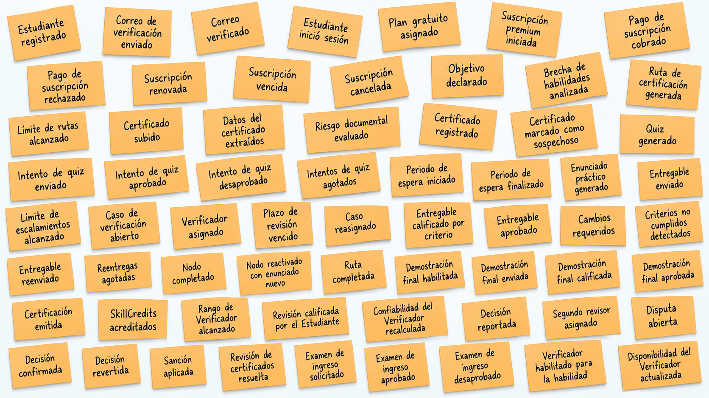

*Nota.* Eventos de dominio de SkillSwap identificados durante la exploración inicial, presentados sin orden cronológico. Elaboración propia.

**Paso 2. Timelines**

En el segundo paso, los eventos identificados se ordenaron en el tiempo. Por la cantidad de eventos, la línea de tiempo se organizó en carriles, uno por actor o ciclo de vida (Suscripción, Estudiante, Verificador y Moderación), y se dividió en tres fases del proceso. En cada carril, la fila superior muestra el camino exitoso y debajo se ubican los escenarios alternativos que se desprenden de cada evento.

No se modelaron caminos separados para el plan gratuito y el premium, porque los eventos son los mismos en ambos: lo que cambia son los límites de rutas y de escalamientos, que aparecen como ramas, y la duración de las esperas y los plazos de revisión. Mantener un solo camino deja a la vista que ningún plan ofrece más oportunidades de aprobar.

La primera fase abarca el registro, la suscripción y el registro de certificados. Cuando el Estudiante verifica su correo, se le asigna el plan gratuito, que puede evolucionar a una suscripción premium con su propio ciclo de cobro, renovación, rechazo del pago o cancelación. Luego declara su objetivo, recibe su ruta de certificación y sube sus certificados; si el riesgo documental resulta alto, el certificado se marca como sospechoso y su revisión pasa a Moderación.

**Figura 25**

*EventStorming, paso 2: Timelines (registro, suscripción y certificados)*

  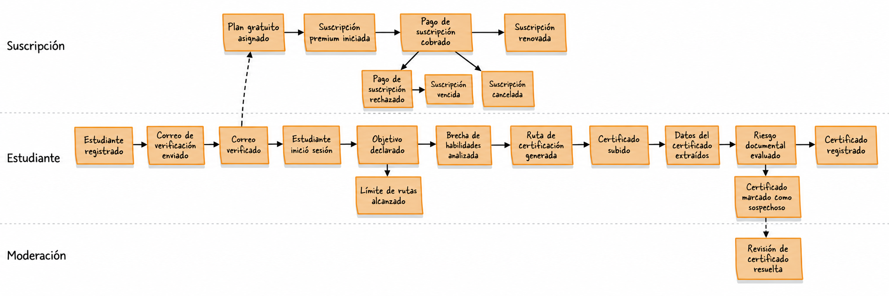

*Nota.* Línea de tiempo en carriles del registro, la suscripción y el registro de certificados. Las líneas punteadas indican el traspaso entre carriles. Elaboración propia.

La segunda fase corresponde a la evaluación de los nodos de la ruta. En los nodos de quiz, un intento desaprobado permite volver a intentarlo con preguntas nuevas hasta agotar los tres intentos, tras lo cual comienza un periodo de espera. En los nodos prácticos, el entregable enviado abre un caso de verificación que toma un Verificador en su propio carril; si el plazo de revisión vence, el caso se reasigna. La calificación que el Verificador registra por criterio es la que determina si el entregable se aprueba o si requiere cambios, en cuyo caso el Estudiante recibe los criterios no cumplidos y puede reenviar su entrega. Por cada revisión, el Verificador recibe SkillCredits, apruebe o rechace, y su confiabilidad se recalcula. Si el Estudiante reporta una decisión, se abre una disputa que resuelve Moderación; cuando la decisión se revierte, se aplica una sanción y la confiabilidad del Verificador vuelve a calcularse.

**Figura 26**

*EventStorming, paso 2: Timelines (evaluación de los nodos)*

  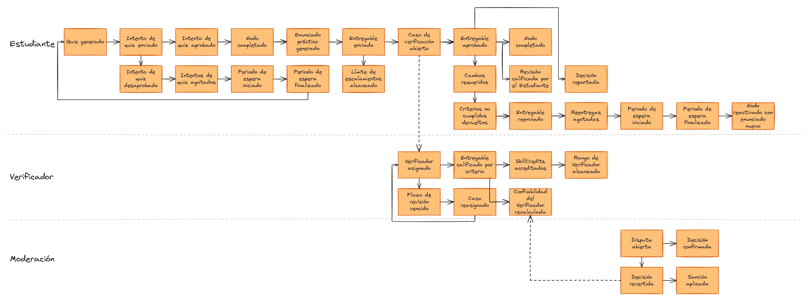

*Nota.* Línea de tiempo en carriles de la evaluación de los nodos de quiz y de los nodos prácticos. Elaboración propia.

La tercera fase cubre la demostración final, la certificación y la habilitación de nuevos Verificadores. Al completar la ruta, el Estudiante envía su demostración final, que califica un Verificador; esa calificación determina si la demostración se aprueba y se emite la certificación, o si se devuelven los criterios no cumplidos. Si el Estudiante reporta la calificación, se asigna un segundo revisor. La certificación emitida es, además, el requisito para que el Estudiante solicite el examen de ingreso y, al aprobarlo, quede habilitado como Verificador para esa habilidad.

**Figura 27**

*EventStorming, paso 2: Timelines (demostración final, certificación y nuevo Verificador)*

  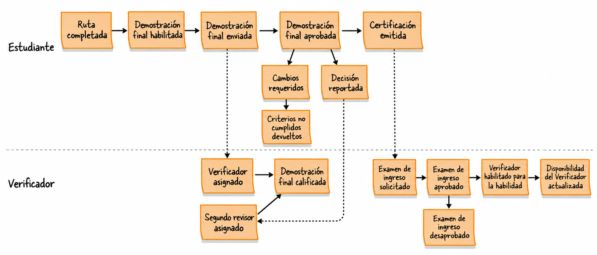

*Nota.* Línea de tiempo en carriles de la demostración final, la emisión de la certificación y la habilitación de un Verificador. Elaboración propia.

**Paso 3. Pain Points**

En el tercer paso se revisó la línea de tiempo para identificar los puntos críticos del proceso: dudas, reglas que aún no están definidas y riesgos que el equipo debe resolver antes de implementar. Cada punto crítico se registró como un rombo rosado unido al evento en el que aparece. Se identificaron 15 puntos críticos, repartidos en las mismas tres fases del paso anterior.

En la fase de registro, suscripción y certificados, las dudas se concentran en la generación de la ruta y en la lectura de los certificados: cuántos nodos prácticos debe incluir como mínimo una ruta, qué ocurre si el OCR no logra leer un certificado y si un certificado marcado como sospechoso bloquea el avance del Estudiante mientras Moderación lo revisa. En la suscripción, queda por definir si existe un periodo de gracia cuando falla el cobro.

**Figura 28**

*EventStorming, paso 3: Pain Points (registro, suscripción y certificados)*

  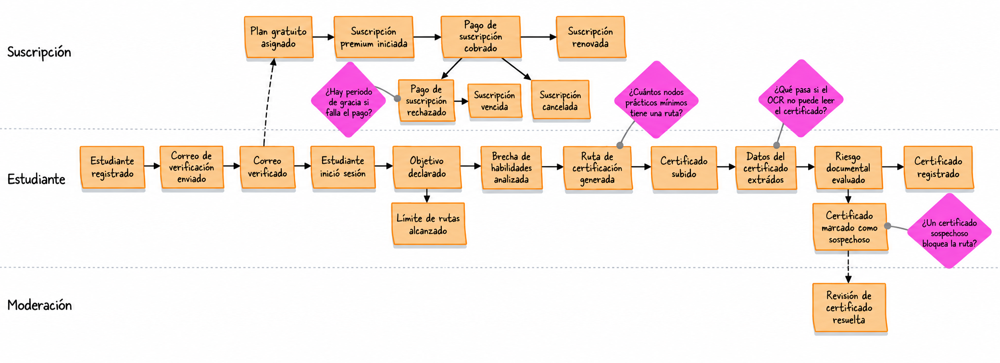

*Nota.* Puntos críticos, representados como rombos rosados, identificados sobre la línea de tiempo del registro, la suscripción y el registro de certificados. Elaboración propia.

En la fase de evaluación de los nodos aparece el mayor número de puntos críticos. En los quizzes, preocupa cómo controlar la calidad de las preguntas generadas por la inteligencia artificial, si se requiere un certificado para rendir un nodo y cuánto dura el periodo de espera en cada plan. En la revisión humana, quedan abiertas la situación del Estudiante del plan gratuito que alcanza su límite de escalamientos, el tratamiento de un Verificador que deja vencer varios plazos, los umbrales de cada rango de Verificador y el destino de los casos que tenía asignados un Verificador sancionado.

**Figura 29**

*EventStorming, paso 3: Pain Points (evaluación de los nodos)*

  

*Nota.* Puntos críticos, representados como rombos rosados, identificados sobre la línea de tiempo de la evaluación de los nodos de quiz y de los nodos prácticos. Elaboración propia.

En la fase de demostración final, certificación y nuevo Verificador, los puntos críticos se relacionan con la disponibilidad y la imparcialidad de la revisión: qué ocurre si no hay Verificadores habilitados para la habilidad, quién define los criterios y el umbral de aprobación de la rúbrica y si un Verificador puede revisar a alguien que conoce. Estas tres dudas aplican también a la revisión de los nodos prácticos, pero se ubicaron en esta fase para no recargar la figura anterior. Por último, queda por definir quién diseña el examen de ingreso para Verificadores y cuándo puede repetirse.

**Figura 30**

*EventStorming, paso 3: Pain Points (demostración final, certificación y nuevo Verificador)*

  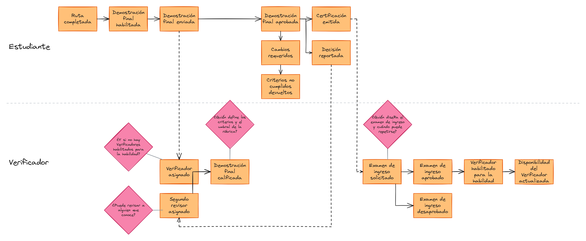

*Nota.* Puntos críticos, representados como rombos rosados, identificados sobre la línea de tiempo de la demostración final, la emisión de la certificación y la habilitación de un Verificador. Elaboración propia.

**Paso 4. Pivotal Points**

En el cuarto paso se identificaron los eventos pivotales, es decir, aquellos después de los cuales el proceso entra en una fase distinta. Cada uno se marcó con una línea vertical ubicada inmediatamente después del evento, en su carril. Se identificaron seis eventos pivotales.

En la fase de registro, suscripción y certificados hay dos. El primero es "Correo verificado": a partir de ese momento el usuario deja de ser anónimo y puede operar en la plataforma. El segundo es "Ruta de certificación generada", que cierra el diagnóstico del objetivo y da inicio al recorrido de aprendizaje.

**Figura 31**

*EventStorming, paso 4: Pivotal Points (registro, suscripción y certificados)*

  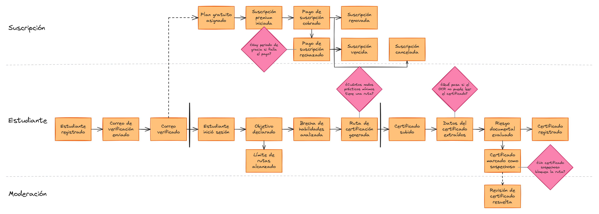

*Nota.* Las líneas verticales marcan los eventos pivotales que separan el registro, el diagnóstico del objetivo y el inicio del recorrido de aprendizaje. Elaboración propia.

En la fase de evaluación de los nodos, el evento pivotal es "Caso de verificación abierto". Hasta ese punto la evaluación es automática, porque los quizzes se corrigen solos; desde ese punto interviene un Verificador. Este cambio se repite en cada nodo práctico de la ruta.

**Figura 32**

*EventStorming, paso 4: Pivotal Points (evaluación de los nodos)*

  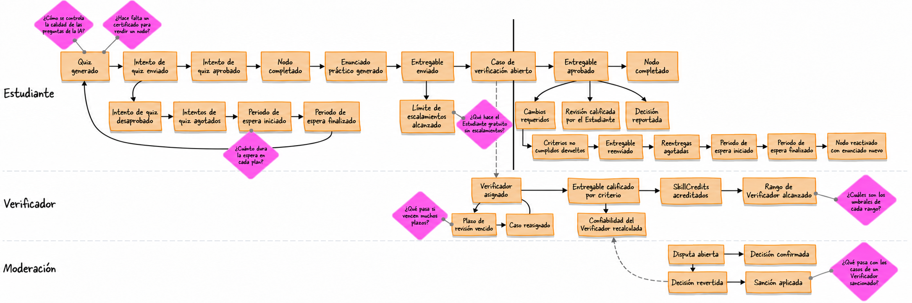

*Nota.* La línea vertical marca el paso de la evaluación automática a la revisión humana en los nodos prácticos. Elaboración propia.

En la fase de demostración final, certificación y nuevo Verificador hay tres eventos pivotales. "Ruta completada" cierra la evaluación de los nodos y habilita la demostración final. "Certificación emitida" cierra el recorrido del Estudiante, porque la habilidad queda certificada. Por último, "Verificador habilitado para la habilidad" marca el cambio de rol: desde ese momento, el Estudiante puede revisar el trabajo de otros.

**Figura 33**

*EventStorming, paso 4: Pivotal Points (demostración final, certificación y nuevo Verificador)*

  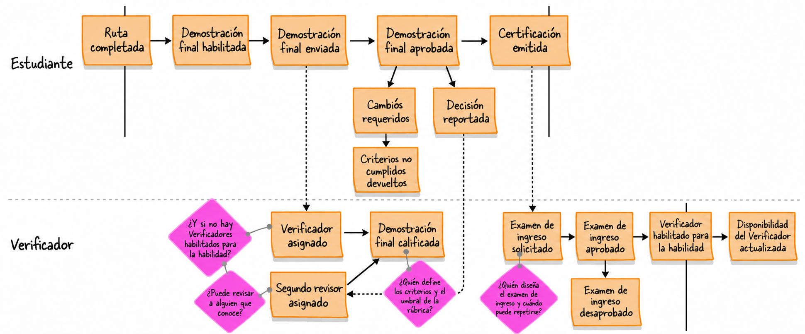

*Nota.* Las líneas verticales marcan el inicio de la demostración final, la emisión de la certificación y la habilitación del Estudiante como Verificador. Elaboración propia.

**Paso 5. Commands**

En el quinto paso se identificaron los comandos, es decir, las decisiones que producen cada evento. Cada comando se registró en un post-it azul a la izquierda del evento que dispara, con el actor que lo ejecuta en un post-it amarillo encima. En este paso solo se incluyen los comandos que ejecuta una persona; los que ejecuta el sistema se incorporan en el paso siguiente, junto con las políticas. El modelo tiene dos actores, el Estudiante y el Verificador. Moderación no aparece como actor, porque opera desde un panel externo a la aplicación.

En la fase de registro, suscripción y certificados, todos los comandos los ejecuta el Estudiante: registrarse, verificar su correo, iniciar sesión, declarar su objetivo y subir certificados, además de iniciar o cancelar la suscripción premium. La suscripción vencida y la suscripción cancelada son desenlaces independientes: la primera se produce cuando falla el cobro y la segunda, cuando el Estudiante lo decide.

**Figura 34**

*EventStorming, paso 5: Commands (registro, suscripción y certificados)*

  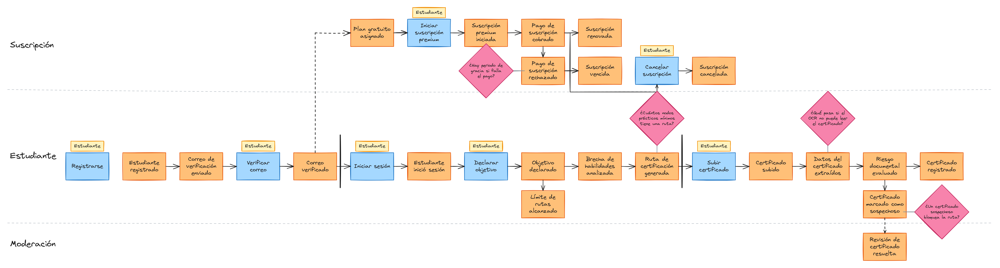

*Nota.* Comandos, en azul, y actores, en amarillo, del registro, la suscripción y el registro de certificados. Elaboración propia.

En la evaluación de los nodos, el Estudiante envía los intentos de quiz, los entregables y sus reenvíos, y puede calificar la revisión recibida o reportar la decisión. El único comando del Verificador en esta fase es calificar el entregable: el Verificador no decide si el entregable se aprueba, sino que registra la calificación de cada criterio de la rúbrica.

**Figura 35**

*EventStorming, paso 5: Commands (evaluación de los nodos)*

  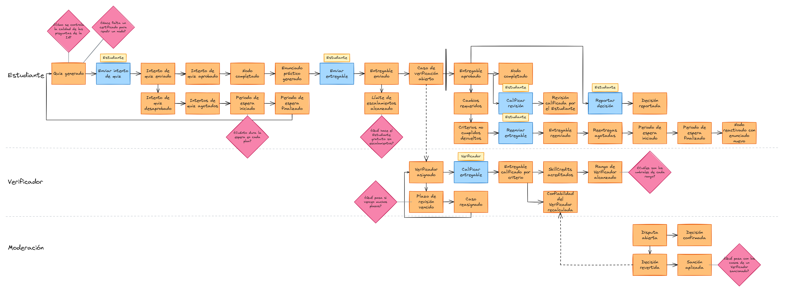

*Nota.* Comandos, en azul, y actores, en amarillo, de la evaluación de los nodos de quiz y de los nodos prácticos. Elaboración propia.

En la fase final, el Estudiante envía la demostración final y puede reportar su calificación, y el Verificador la califica con la rúbrica. Los comandos para solicitar y rendir el examen de ingreso los ejecuta el Estudiante, aunque aparecen en el carril del Verificador, porque todavía no está habilitado como tal. Una vez habilitado, el Verificador actualiza su disponibilidad.

**Figura 36**

*EventStorming, paso 5: Commands (demostración final, certificación y nuevo Verificador)*

  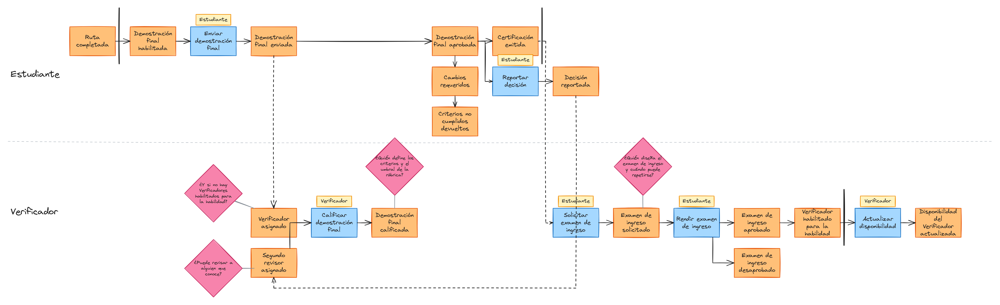

*Nota.* Comandos, en azul, y actores, en amarillo, de la demostración final, la emisión de la certificación y la habilitación de un Verificador. Elaboración propia.

**Paso 6. Policies**

En el sexto paso se agregaron las políticas, que representan las reacciones automáticas del sistema: cuando ocurre un evento, el sistema ejecuta un comando sin que intervenga una persona. Cada política se registró en un post-it morado sobre el comando que ejecuta. Con este paso aparecen en el tablero los comandos del sistema, que completan la cadena entre los eventos.

En la primera fase, las políticas envían el correo de verificación cuando el Estudiante se registra, asignan el plan gratuito cuando verifica su correo y generan la ruta de certificación cuando declara un objetivo. Cada certificado subido pasa por una cadena automática: se extraen sus datos, se evalúa el riesgo documental y, según el resultado, se registra o se escala a Moderación. En la suscripción, el cobro se ejecuta al inicio de cada periodo mensual y, si el pago se rechaza, la suscripción vence.

**Figura 37**

*EventStorming, paso 6: Policies (registro, suscripción y certificados)*

  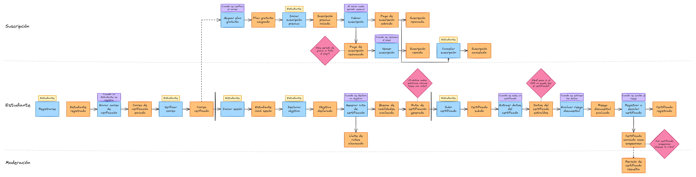

*Nota.* Políticas, en morado, y comandos del sistema del registro, la suscripción y el registro de certificados. Elaboración propia.

En la evaluación se concentran las reglas de negocio del modelo. El quiz se genera con preguntas nuevas al iniciar el nodo o al terminar el periodo de espera, y al agotar los intentos comienza la espera. Al enviar un entregable se abre un caso, siempre que el plan tenga escalamientos disponibles; al abrir el caso se asigna un Verificador y, si vence el plazo, el caso se reasigna. La política central es el cálculo de la aprobación: cuando el Verificador califica el entregable, el sistema calcula el resultado contra el umbral de la rúbrica y, si no lo alcanza, devuelve los criterios no cumplidos. Cada calificación acredita SkillCredits al Verificador, apruebe o rechace, y recalcula su confiabilidad; cuando el total de SkillCredits cruza un umbral, se otorga el rango correspondiente.

**Figura 38**

*EventStorming, paso 6: Policies (evaluación de los nodos)*

  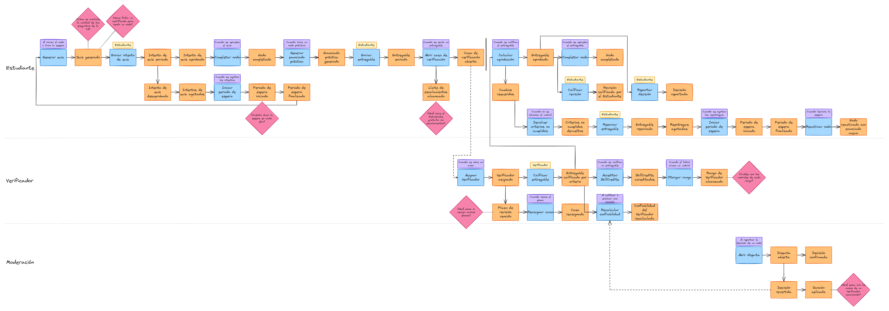

*Nota.* Políticas, en morado, y comandos del sistema de la evaluación de los nodos. Elaboración propia.

En la fase final, completar todos los nodos completa la ruta y habilita la demostración final. La aprobación de la demostración también la calcula el sistema a partir de la calificación del Verificador y, cuando se aprueba, se emite la certificación. Si el Estudiante reporta la calificación, se asigna un segundo revisor. Por último, aprobar el examen de ingreso habilita al Verificador para esa habilidad.

**Figura 39**

*EventStorming, paso 6: Policies (demostración final, certificación y nuevo Verificador)*

  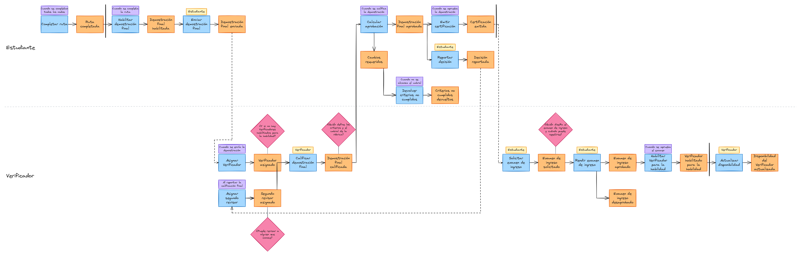

*Nota.* Políticas, en morado, y comandos del sistema de la demostración final, la emisión de la certificación y la habilitación de un Verificador. Elaboración propia.

**Paso 7. Read Models**

En el séptimo paso se identificaron los read models, es decir, la información que cada actor consulta antes de ejecutar un comando. Cada read model se registró en un post-it verde junto al comando que apoya.

En la primera fase, el Estudiante consulta su plan y sus límites antes de declarar un objetivo o de pasar a premium, el estado de sus certificados antes de subir uno nuevo y el estado de su suscripción antes de cancelarla.

**Figura 40**

*EventStorming, paso 7: Read Models (registro, suscripción y certificados)*

  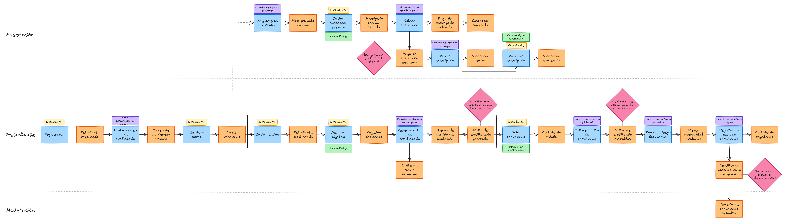

*Nota.* Read models, en verde, que consulta el Estudiante durante el registro, la suscripción y el registro de certificados. Elaboración propia.

En la evaluación, el Estudiante consulta el quiz, el enunciado práctico con su rúbrica y los criterios no cumplidos antes de reenviar un entregable o de reportar una decisión. Antes de calificar una revisión, consulta el perfil público del Verificador. El Verificador, por su parte, trabaja sobre su cola de casos con plazos y sobre el formulario de la rúbrica.

**Figura 41**

*EventStorming, paso 7: Read Models (evaluación de los nodos)*

  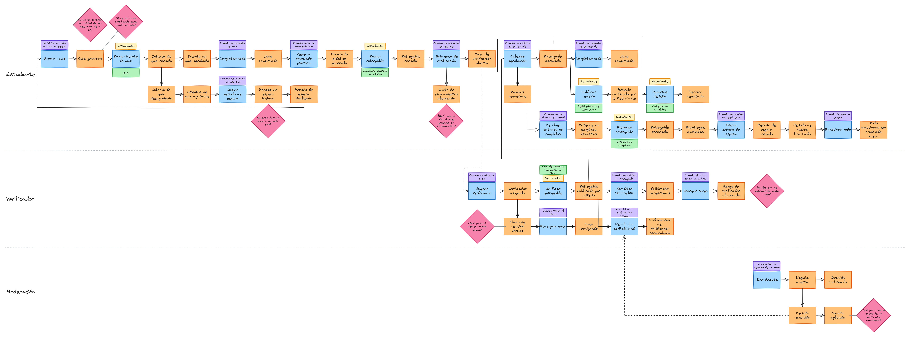

*Nota.* Read models, en verde, que consultan el Estudiante y el Verificador durante la evaluación de los nodos. Elaboración propia.

En la fase final, el Estudiante consulta el enunciado y la rúbrica de la demostración antes de enviarla, y su elegibilidad antes de solicitar el examen de ingreso. El Verificador califica la demostración sobre el formulario de la rúbrica.

**Figura 42**

*EventStorming, paso 7: Read Models (demostración final, certificación y nuevo Verificador)*

  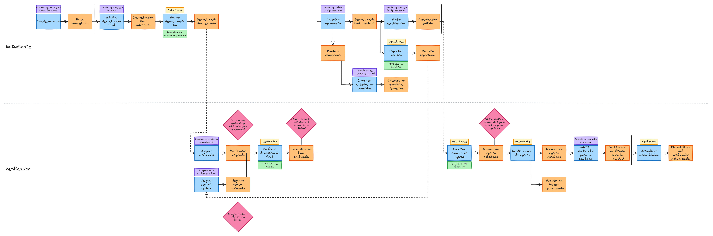

*Nota.* Read models, en verde, de la demostración final y la solicitud del examen de ingreso. Elaboración propia.

**Paso 8. External Systems**

En el octavo paso se incorporaron los sistemas externos, representados con post-its rojos. Algunos reciben órdenes del sistema, otros son notificados cuando ocurre un evento y uno de ellos, el panel de moderación, ejecuta comandos sobre el sistema.

En la primera fase intervienen el servicio de correo, que envía la verificación; el LLM, que genera la ruta de certificación; Cloudinary, que almacena los certificados; ML Kit, que extrae sus datos mediante OCR en el dispositivo, y la pasarela de pago, que ejecuta el cobro de la suscripción. Como pasarela se consideró Culqi o Mercado Pago, porque Stripe no opera en Perú. El panel de moderación aparece como el sistema que resuelve la revisión de un certificado sospechoso.

**Figura 43**

*EventStorming, paso 8: External Systems (registro, suscripción y certificados)*

  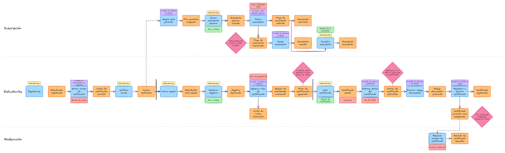

*Nota.* Sistemas externos, en rojo, que intervienen en el registro, la suscripción y el registro de certificados. Elaboración propia.

En la evaluación, el LLM genera las preguntas de cada intento, los enunciados prácticos y el enunciado nuevo cuando un nodo se reactiva. Cloudinary almacena los entregables y el servicio de correo notifica los criterios no cumplidos. El panel de moderación, externo a la aplicación, ejecuta la resolución de disputas y la aplicación de sanciones, apoyándose en una vista de reportes, disputas y confiabilidad.

**Figura 44**

*EventStorming, paso 8: External Systems (evaluación de los nodos)*

  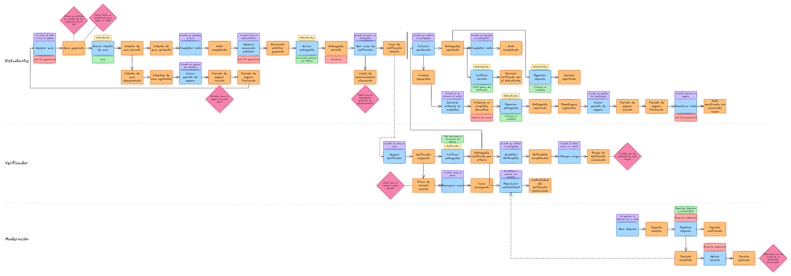

*Nota.* Sistemas externos, en rojo, que intervienen en la evaluación de los nodos y en la moderación. Elaboración propia.

En la fase final, Cloudinary almacena la demostración final y el servicio de correo notifica tanto los criterios no cumplidos como la emisión de la certificación.

**Figura 45**

*EventStorming, paso 8: External Systems (demostración final, certificación y nuevo Verificador)*

  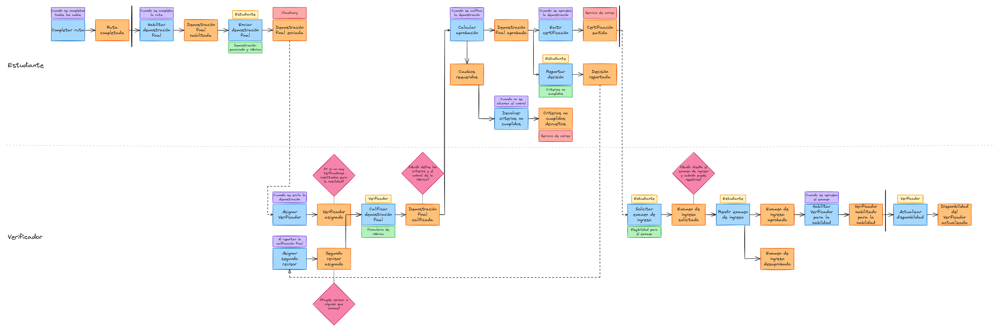

*Nota.* Sistemas externos, en rojo, que intervienen en la demostración final y la emisión de la certificación. Elaboración propia.

**Paso 9. Aggregates**

En el noveno paso, los comandos y los eventos se agruparon en agregados, es decir, en los objetos del dominio que reciben los comandos, protegen las reglas de negocio y producen los eventos. Se identificaron 12 agregados. En la figura, cada agregado aparece como un post-it alto de color amarillo pálido, con los comandos que recibe a la izquierda, los eventos que produce a la derecha y su regla principal debajo.

Los agregados con más responsabilidad son VerificationCase, que concentra la revisión humana de los entregables y de la demostración final, incluidas la asignación, el plazo, el cálculo de la aprobación y las reentregas, y LearningPath, que gestiona la ruta y el avance de sus nodos. Certificate se mantiene separado de la ruta, porque registrar un certificado no completa ningún nodo, y SkillCertification se modeló como un agregado propio, porque solo puede emitirse con la ruta completada y la demostración final aprobada. Wallet refleja que los SkillCredits solo se ganan revisando y que no se compran ni se canjean.

**Figura 46**

*EventStorming, paso 9: Aggregates*

  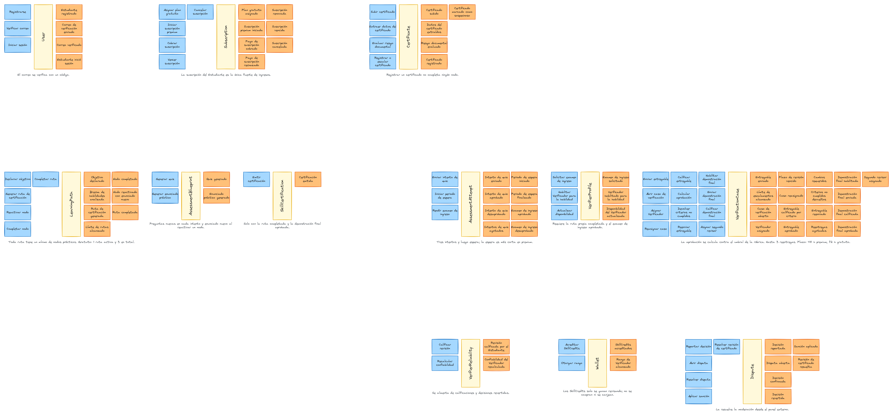

*Nota.* Agregados de SkillSwap, en amarillo pálido, con los comandos que reciben, los eventos que producen y la regla principal de cada uno. Elaboración propia.

**Paso 10. Bounded Contexts**

En el último paso, los agregados se agruparon en bounded contexts candidatos, según la cercanía de su funcionalidad y las políticas que los conectan. Se obtuvieron ocho contextos. Dos se consideran core, porque contienen la propuesta de valor de SkillSwap: Learning Path Engine, que convierte el objetivo del Estudiante en una ruta de certificación, y Assessment & Peer Review, que verifica el dominio de cada habilidad mediante la revisión con rúbrica. Credential Verification, Reputation, Recognition & Incentives y Moderation & Disputes son contextos de soporte, mientras que Identity & Access y Subscription & Billing son genéricos.

Las flechas moradas representan las políticas que conectan los contextos, y las flechas punteadas, las consultas. Assessment & Peer Review es el contexto con más relaciones: consulta a Subscription & Billing los escalamientos, la espera y el plazo que corresponden al plan, y notifica a Learning Path Engine, Reputation y Recognition & Incentives cada vez que se califica o se aprueba una entrega. Moderation & Disputes recibe los certificados sospechosos y, cuando revierte una decisión, notifica a Reputation y a Assessment & Peer Review.

**Figura 47**

*EventStorming, paso 10: Bounded Contexts*

  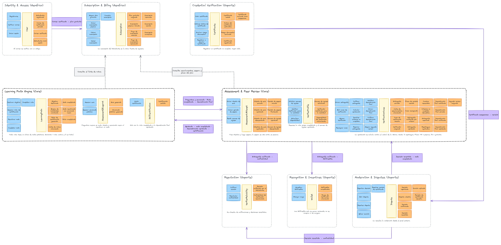

*Nota.* Bounded contexts candidatos de SkillSwap, delimitados con línea punteada. Los contextos core tienen borde grueso; las flechas moradas representan políticas y las punteadas, consultas. Elaboración propia.

#### 2.5.1.1. Candidate Context Discovery

A partir del EventStorming, se realizó el descubrimiento de contextos candidatos para identificar los bounded contexts de SkillSwap. El proceso se desarrolló en tres iteraciones sobre una versión simplificada de la línea de tiempo, que conserva los eventos que mejor representan cada parte del proceso. En cada iteración se aplicó una de las técnicas propuestas: start-with-simple y look-for-pivotal-events para una primera división del dominio, un refinamiento del borrador según el lenguaje y las reglas de cada parte, y start-with-value para clasificar los contextos resultantes según su valor para el negocio.

**Iteración 1. Start-with-simple y look-for-pivotal-events**

En la primera iteración, la línea de tiempo se descompuso en pasos secuenciales, usando como límites los seis eventos pivotales identificados en el paso 4 del EventStorming: correo verificado, ruta de certificación generada, caso de verificación abierto, ruta completada, certificación emitida y Verificador habilitado para la habilidad. Así se obtuvieron siete fases, desde el registro hasta la revisión como Verificador, y a cada una se le asignó un contexto en borrador. Dentro de la fase de recorrido se separaron los certificados de la evaluación, porque registrar un certificado no completa ningún nodo de la ruta.

En esta iteración también se observó que algunos eventos no pertenecen a una sola fase. El cobro y el vencimiento de la suscripción, los SkillCredits, la confiabilidad del Verificador y las disputas aparecen en distintos momentos del proceso, por lo que se registraron aparte como candidatos a contextos transversales.

**Figura 48**

*Candidate Context Discovery, iteración 1: fases delimitadas por los eventos pivotales*

  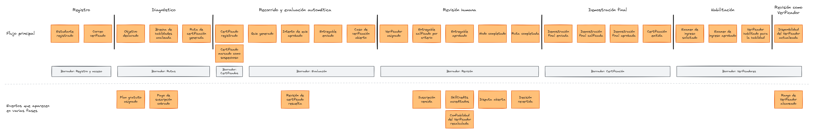

*Nota.* Línea de tiempo simplificada, dividida en fases por los eventos pivotales. Debajo de cada fase figura el contexto en borrador, y en la parte inferior, los eventos que aparecen en varias fases. Elaboración propia.

**Iteración 2. Refinamiento de los contextos candidatos**

En la segunda iteración, cada evento se ubicó en el carril del contexto candidato al que pertenece, manteniendo su posición en el tiempo. Los borradores se ajustaron según dos criterios: que los eventos de un mismo contexto compartan el lenguaje y las reglas de negocio, y que el contexto pueda evolucionar sin arrastrar a los demás.

Con este criterio, los borradores de evaluación, revisión y Verificadores se unieron en Assessment & Peer Review, porque comparten el mismo lenguaje de casos, rúbricas, criterios e intentos, y porque el examen de ingreso del Verificador es también una evaluación. El borrador de certificación se integró a Learning Path Engine, porque la certificación es el resultado de completar la ruta; en ese mismo contexto quedó la generación del quiz, ya que el blueprint de evaluación se define junto con cada nodo. Los eventos transversales dieron lugar a cuatro contextos propios: Subscription & Billing, Reputation, Recognition & Incentives y Moderation & Disputes. La figura muestra que el flujo principal avanza entre Learning Path Engine y Assessment & Peer Review, mientras que los demás contextos intervienen en momentos puntuales.

**Figura 49**

*Candidate Context Discovery, iteración 2: línea de tiempo por contexto candidato*

  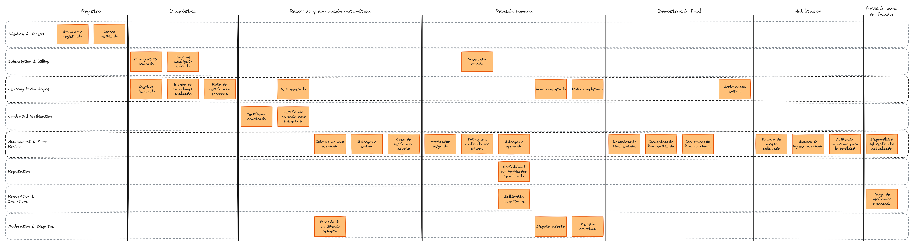

*Nota.* Cada carril corresponde a un contexto candidato y cada evento conserva su posición en el tiempo. Las líneas verticales son los eventos pivotales; los carriles con borde grueso corresponden a los contextos core. Elaboración propia.

**Iteración 3. Start-with-value**

En la tercera iteración, los contextos candidatos se clasificaron según su aporte a la propuesta de valor de SkillSwap, que es demostrar que el Estudiante domina una habilidad y no solo que tiene un certificado. Se consideraron core Learning Path Engine y Assessment & Peer Review, porque sin la ruta y sin la verificación con rúbrica la plataforma no tendría una propuesta diferenciada. Credential Verification, Reputation, Recognition & Incentives y Moderation & Disputes se clasificaron como contextos de soporte, porque son específicos del negocio, pero existen para sostener a los contextos core. Identity & Access y Subscription & Billing se clasificaron como genéricos, porque resuelven necesidades comunes a cualquier aplicación y pueden apoyarse en soluciones existentes.

**Figura 50**

*Candidate Context Discovery, iteración 3: clasificación de los contextos por valor*

  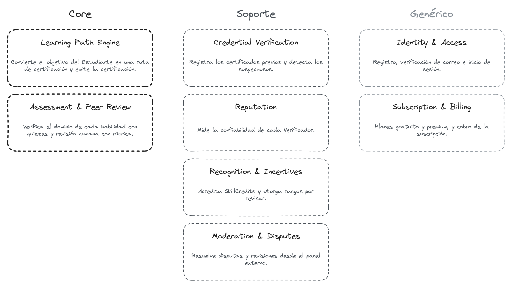

*Nota.* Contextos candidatos clasificados según su aporte a la propuesta de valor, con la responsabilidad principal de cada uno. Elaboración propia.

El resultado del proceso son ocho contextos candidatos, que se resumen en la tabla siguiente y que se desarrollan en las secciones 2.5.1.2 y 2.5.1.3.

| Contexto candidato | Tipo | Responsabilidad | Eventos representativos |
|---|---|---|---|
| Learning Path Engine | Core | Convertir el objetivo del Estudiante en una ruta de certificación, seguir el avance de sus nodos y emitir la certificación | Ruta de certificación generada, Nodo completado, Ruta completada, Certificación emitida |
| Assessment & Peer Review | Core | Verificar el dominio de cada habilidad con quizzes, entregables y la demostración final revisados con rúbrica, y habilitar a los Verificadores | Caso de verificación abierto, Entregable calificado por criterio, Demostración final aprobada, Verificador habilitado para la habilidad |
| Credential Verification | Soporte | Registrar los certificados previos del Estudiante y detectar los sospechosos | Certificado registrado, Certificado marcado como sospechoso |
| Reputation | Soporte | Medir la confiabilidad de cada Verificador | Revisión calificada por el Estudiante, Confiabilidad del Verificador recalculada |
| Recognition & Incentives | Soporte | Acreditar SkillCredits por cada revisión y otorgar rangos | SkillCredits acreditados, Rango de Verificador alcanzado |
| Moderation & Disputes | Soporte | Resolver disputas y revisiones de certificados desde el panel externo | Disputa abierta, Decisión revertida, Revisión de certificado resuelta |
| Identity & Access | Genérico | Registrar al usuario, verificar su correo y autenticarlo | Estudiante registrado, Correo verificado |
| Subscription & Billing | Genérico | Gestionar los planes gratuito y premium y el cobro de la suscripción | Plan gratuito asignado, Pago de suscripción cobrado, Suscripción vencida |

#### 2.5.1.2. Domain Message Flows Modeling

Una vez identificados los contextos candidatos, se modeló cómo colaboran entre sí para resolver los escenarios principales del negocio. Para ello se elaboraron diagramas de Domain Message Flow, una técnica de visualización basada en Domain Storytelling que muestra, para un escenario concreto, los mensajes que intercambian los actores, los bounded contexts y los sistemas externos.

Los diagramas siguen la notación de mensaje y contenido combinados. Los actores se representan con una figura de persona, los bounded contexts con una elipse morada y los sistemas externos con un engranaje. Cada mensaje es una tarjeta de color según su tipo: azul para los comandos, naranja para los eventos y verde para las consultas. La tarjeta indica el nombre del mensaje y sus datos más importantes, y el número en la parte superior, que también aparece sobre la flecha correspondiente, señala el orden en que ocurre dentro del escenario. Las flechas punteadas van del emisor al receptor.

Se modelaron seis escenarios, elegidos para que cada bounded context participe en al menos uno de ellos.

El primer escenario muestra cómo colaboran Identity & Access y Subscription & Billing. El Estudiante se registra desde la aplicación, Identity & Access solicita al servicio de correo el envío del código de verificación y, cuando el Estudiante verifica su correo, publica el evento Correo verificado, al que Subscription & Billing reacciona asignando el plan gratuito. Si el Estudiante decide pasar al plan premium, Subscription & Billing ordena el cobro a la pasarela de pago, que responde con el evento Pago de suscripción cobrado.

**Figura 51**

*Domain Message Flow: Registro del Estudiante y paso al plan premium*

  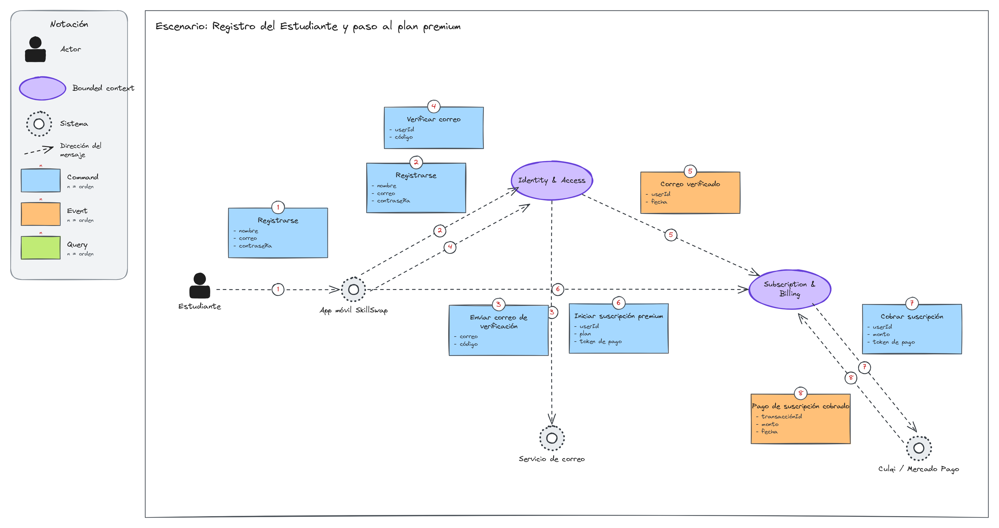

*Nota.* Mensajes intercambiados entre actores, bounded contexts y sistemas externos en el escenario de registro del Estudiante y paso al plan premium. Los números indican el orden de los mensajes. Elaboración propia.

En el segundo escenario, el Estudiante declara su objetivo y Learning Path Engine consulta a Subscription & Billing si el plan le permite abrir una nueva ruta. Con esa respuesta, solicita al LLM la generación de la ruta, indicando el objetivo, la brecha de habilidades y el mínimo de nodos prácticos, y finalmente publica el evento Ruta de certificación generada, con los nodos y el tipo de cada uno.

**Figura 52**

*Domain Message Flow: Declaración del objetivo y generación de la ruta*

  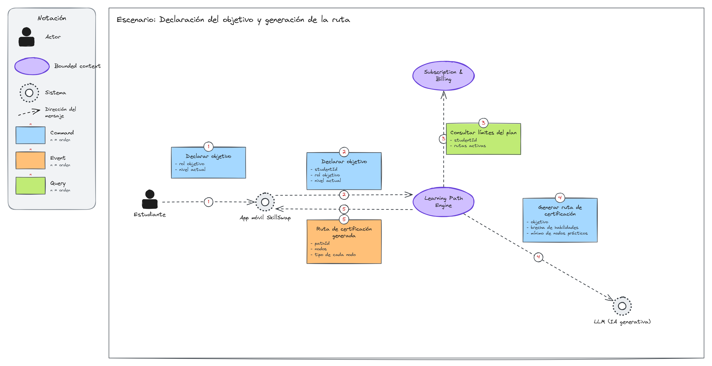

*Nota.* Mensajes intercambiados entre actores, bounded contexts y sistemas externos en el escenario de declaración del objetivo y generación de la ruta. Los números indican el orden de los mensajes. Elaboración propia.

El tercer escenario corresponde al flujo central de SkillSwap. El entregable del Estudiante se almacena en Cloudinary y se envía a Assessment & Peer Review, que consulta a Subscription & Billing los escalamientos disponibles y el plazo de revisión según el plan. Tras la asignación, el Verificador califica cada criterio de la rúbrica. Cuando el sistema calcula que el entregable se aprueba, Assessment & Peer Review publica el evento Entregable aprobado, que Learning Path Engine usa para completar el nodo, y el evento Entregable calificado por criterio, que Recognition & Incentives usa para acreditar SkillCredits y Reputation para recalcular la confiabilidad del Verificador.

**Figura 53**

*Domain Message Flow: Revisión de un entregable práctico aprobado*

  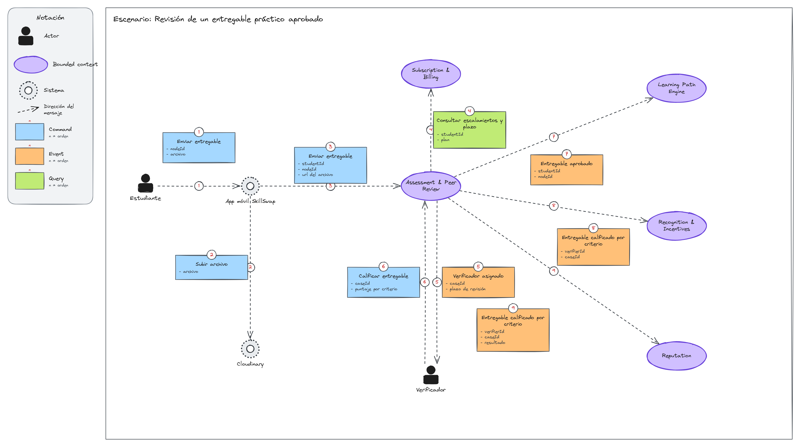

*Nota.* Mensajes intercambiados entre actores, bounded contexts y sistemas externos en el escenario de revisión de un entregable práctico aprobado. Los números indican el orden de los mensajes. Elaboración propia.

El cuarto escenario muestra la moderación. El Estudiante reporta la decisión de un Verificador y Moderation & Disputes abre la disputa. El panel de moderación, externo a la aplicación, consulta las disputas abiertas y ejecuta la resolución. Cuando la decisión se revierte, Moderation & Disputes publica el evento Decisión revertida, que Reputation usa para recalcular la confiabilidad del Verificador y Assessment & Peer Review para aprobar el entregable, lo que a su vez completa el nodo en Learning Path Engine.

**Figura 54**

*Domain Message Flow: Reporte de una decisión revertida por Moderación*

  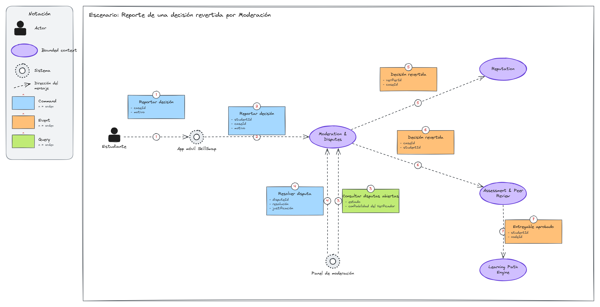

*Nota.* Mensajes intercambiados entre actores, bounded contexts y sistemas externos en el escenario de reporte de una decisión revertida por Moderación. Los números indican el orden de los mensajes. Elaboración propia.

En el quinto escenario, Learning Path Engine publica el evento Ruta completada, que habilita la demostración final en Assessment & Peer Review. El Estudiante envía su demostración, el Verificador la califica con la rúbrica y, cuando se aprueba, Assessment & Peer Review publica el evento Demostración final aprobada. Learning Path Engine emite entonces la certificación, notifica al Estudiante por correo y publica el evento Certificación emitida.

**Figura 55**

*Domain Message Flow: Demostración final y emisión de la certificación*

  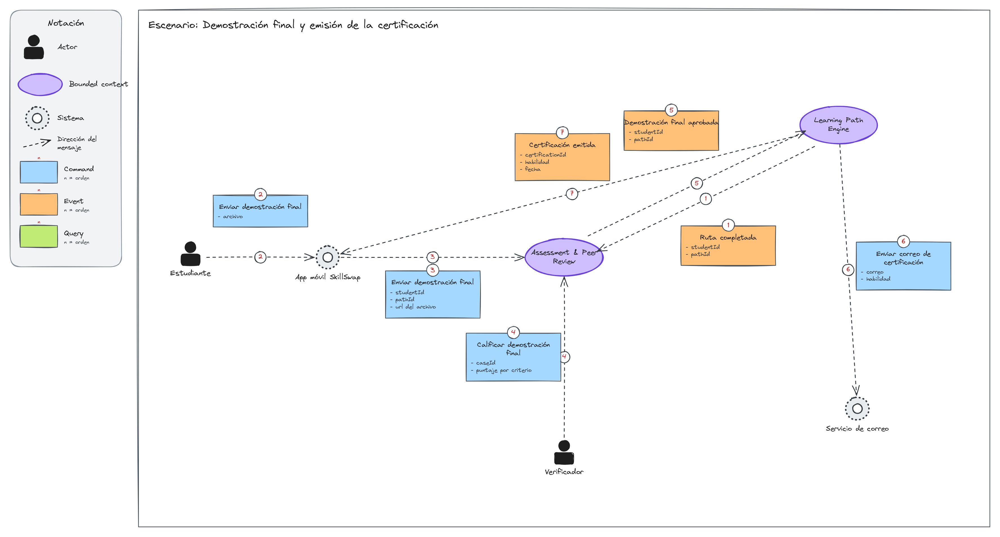

*Nota.* Mensajes intercambiados entre actores, bounded contexts y sistemas externos en el escenario de demostración final y emisión de la certificación. Los números indican el orden de los mensajes. Elaboración propia.

El último escenario muestra el registro de un certificado. La aplicación extrae sus datos en el dispositivo con ML Kit y los envía a Credential Verification, que evalúa el riesgo documental. Si el riesgo es alto, publica el evento Certificado marcado como sospechoso, que Moderation & Disputes recibe para su revisión. Cuando el panel de moderación resuelve el caso, Moderation & Disputes devuelve el resultado a Credential Verification mediante el evento Revisión de certificado resuelta.

**Figura 56**

*Domain Message Flow: Registro de un certificado sospechoso*

  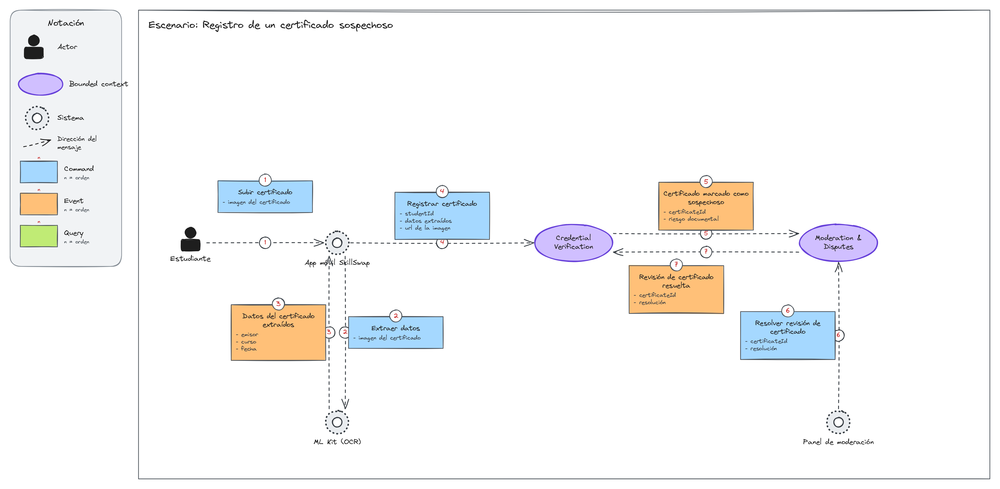

*Nota.* Mensajes intercambiados entre actores, bounded contexts y sistemas externos en el escenario de registro de un certificado sospechoso. Los números indican el orden de los mensajes. Elaboración propia.

#### 2.5.1.3. Bounded Context Canvases

Con los contextos candidatos y sus flujos de mensajes definidos, se elaboró un Bounded Context Canvas para cada uno, usando la versión 5 de la plantilla de ddd-crew. Los contextos se trabajaron en orden de importancia, empezando por los core, y cada canvas se construyó de forma iterativa con los siguientes pasos:

1. **Context Overview Definition:** definir el nombre, el propósito y la clasificación estratégica del contexto (tipo de dominio, modelo de negocio, evolución y rol).
2. **Business Rules Distillation & Ubiquitous Language Capture:** extraer las reglas de negocio del EventStorming y registrar los términos propios del contexto.
3. **Capability Analysis:** identificar qué capacidades ofrece el contexto a partir de los comandos y consultas que recibe.
4. **Capability Layering:** cuando aplica, ordenar esas capacidades en capas según su nivel.
5. **Dependencies Capture:** registrar los mensajes de entrada y de salida y los colaboradores con los que se intercambian, a partir de los Domain Message Flows.
6. **Design Critique:** revisar el diseño, registrar los supuestos, las métricas para validarlo y las preguntas abiertas, y evaluar alternativas.

En los canvas, los comandos se muestran en azul, los eventos en amarillo y las consultas en verde, como en la plantilla original. Las preguntas abiertas recogen los puntos críticos identificados en el paso 3 del EventStorming.

Se trabajó primero Assessment & Peer Review, por ser el contexto que materializa la propuesta de valor. En la definición general se estableció su propósito, verificar el dominio de cada habilidad, y se clasificó como core, custom built y de ejecución. Al destilar las reglas se concluyó que el Verificador no aprueba ni rechaza, sino que califica cada criterio, y que la aprobación la calcula el sistema contra el umbral de la rúbrica; también se fijaron los límites de intentos, reentregas y plazos. En el análisis de capacidades se identificaron tres grupos, que corresponden a sus capas: la evaluación automática de los quizzes, la revisión humana de los entregables y de la demostración final, y la habilitación de nuevos Verificadores mediante el examen de ingreso. En la captura de dependencias se observó que recibe los blueprints de Learning Path Engine, consulta a Subscription & Billing los límites del plan y notifica sus resultados a Learning Path Engine, Reputation y Recognition & Incentives. En la crítica del diseño se evaluó separar la habilitación de Verificadores en un contexto propio; se descartó en esta etapa porque comparte el lenguaje de casos, rúbricas e intentos, aunque queda como candidata a separarse si crece.

**Figura 57**

*Bounded Context Canvas: Assessment & Peer Review*

  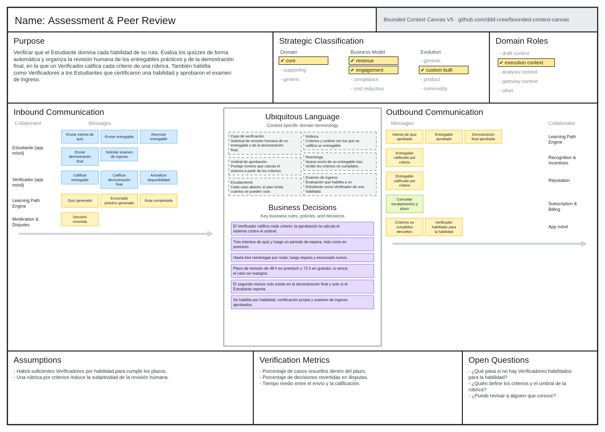

*Nota.* Bounded Context Canvas del contexto Assessment & Peer Review, elaborado con la plantilla v5 de ddd-crew. Elaboración propia.

Learning Path Engine es el segundo contexto core. Su propósito es convertir el objetivo del Estudiante en una ruta de certificación y seguir su avance hasta emitir la certificación. Entre sus reglas destacan el mínimo de nodos prácticos por ruta, el límite de rutas del plan gratuito y la condición para emitir la certificación. Sus capacidades se organizan en dos capas: la generación de la ruta y de los blueprints de evaluación, que delega en el LLM, y el seguimiento del avance hasta la certificación. En las dependencias se identificó una relación en ambos sentidos con Assessment & Peer Review, que se resuelve con eventos: Learning Path Engine publica los blueprints y la ruta completada, y reacciona a los nodos y demostraciones aprobados. En la crítica se evaluó trasladar la generación de blueprints a Assessment & Peer Review; se mantuvo aquí porque el blueprint se define junto con cada nodo de la ruta.

**Figura 58**

*Bounded Context Canvas: Learning Path Engine*

  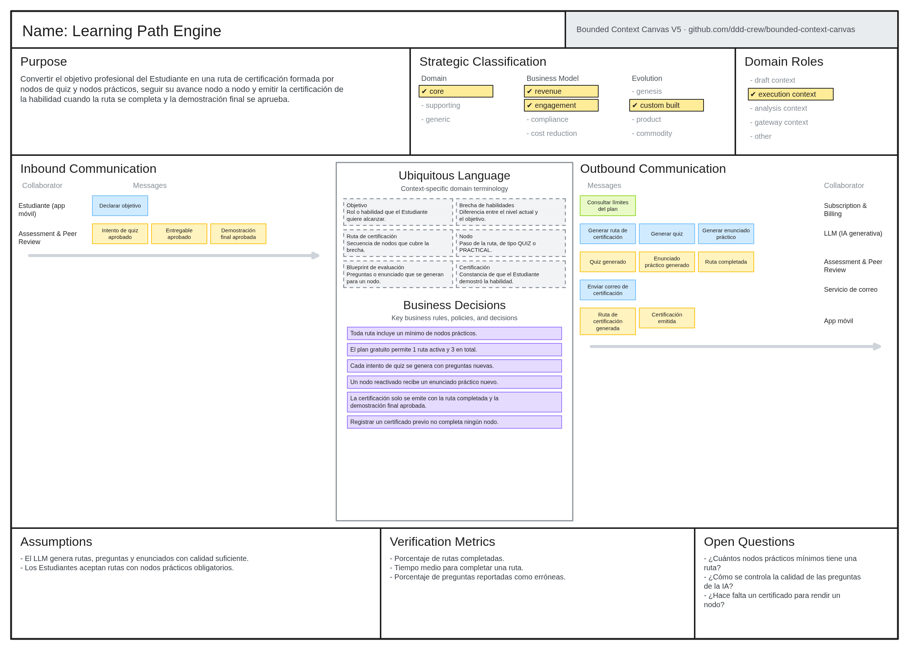

*Nota.* Bounded Context Canvas del contexto Learning Path Engine, elaborado con la plantilla v5 de ddd-crew. Elaboración propia.

Credential Verification se clasificó como un contexto de soporte orientado al cumplimiento, porque protege la confianza en el perfil del Estudiante. Su regla central es que registrar un certificado no completa ningún nodo, de modo que el certificado previo complementa el perfil, pero no reemplaza la demostración. Su capacidad principal es el registro con evaluación del riesgo documental, apoyada en ML Kit para la extracción en el dispositivo y en Cloudinary para el almacenamiento. Su única dependencia de dominio es Moderation & Disputes, que revisa los certificados sospechosos. En la crítica quedó abierta la pregunta de si un certificado sospechoso debe bloquear la ruta.

**Figura 59**

*Bounded Context Canvas: Credential Verification*

  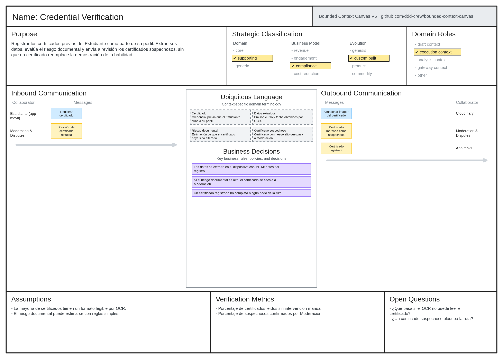

*Nota.* Bounded Context Canvas del contexto Credential Verification, elaborado con la plantilla v5 de ddd-crew. Elaboración propia.

Reputation es un contexto de análisis: no ejecuta el proceso principal, sino que interpreta sus resultados para medir la confiabilidad de cada Verificador. Se alimenta de tres fuentes: la calificación que el Estudiante da a la revisión, las calificaciones registradas en Assessment & Peer Review y las decisiones revertidas por Moderation & Disputes. Su resultado vuelve a Assessment & Peer Review, que lo usa como parte del historial para asignar casos. En la crítica se discutió unirlo con Recognition & Incentives; se mantuvieron separados porque la confiabilidad mide la calidad de las revisiones, mientras que los SkillCredits premian su cantidad.

**Figura 60**

*Bounded Context Canvas: Reputation*

  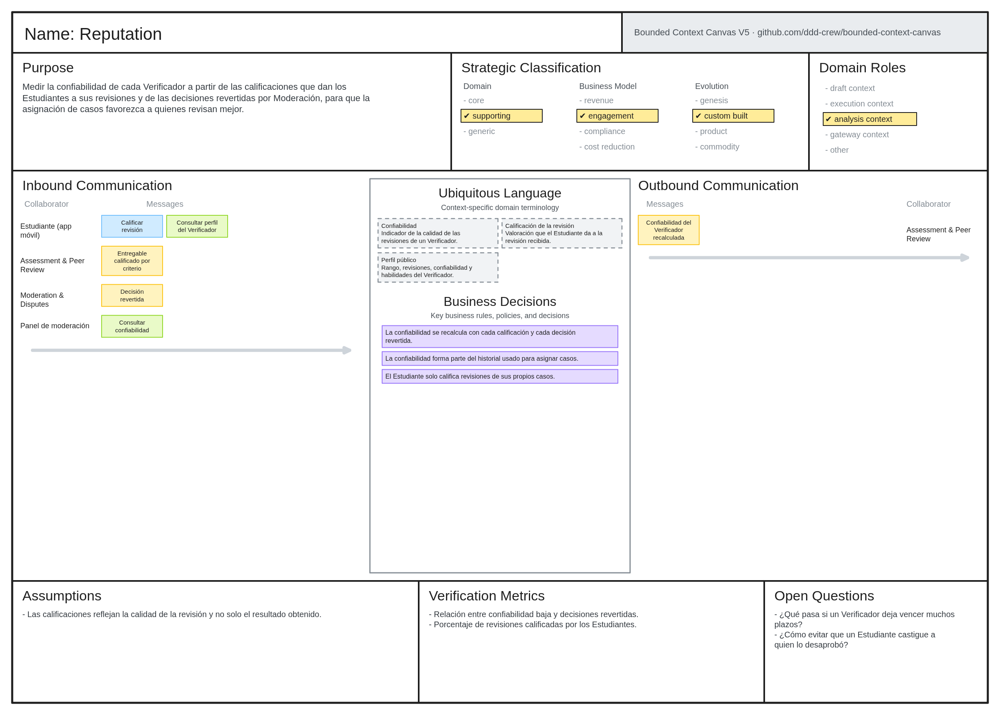

*Nota.* Bounded Context Canvas del contexto Reputation, elaborado con la plantilla v5 de ddd-crew. Elaboración propia.

Recognition & Incentives reconoce el trabajo de los Verificadores. Sus reglas reflejan decisiones del modelo de negocio: los SkillCredits se ganan por cada revisión, apruebe o rechace, para no incentivar decisiones en un sentido, y no se compran ni se canjean, porque funcionan como reputación visible. Su capacidad es acreditar SkillCredits y otorgar rangos por umbral, y depende únicamente de los eventos de Assessment & Peer Review. La definición de los umbrales de cada rango queda como pregunta abierta.

**Figura 61**

*Bounded Context Canvas: Recognition & Incentives*

  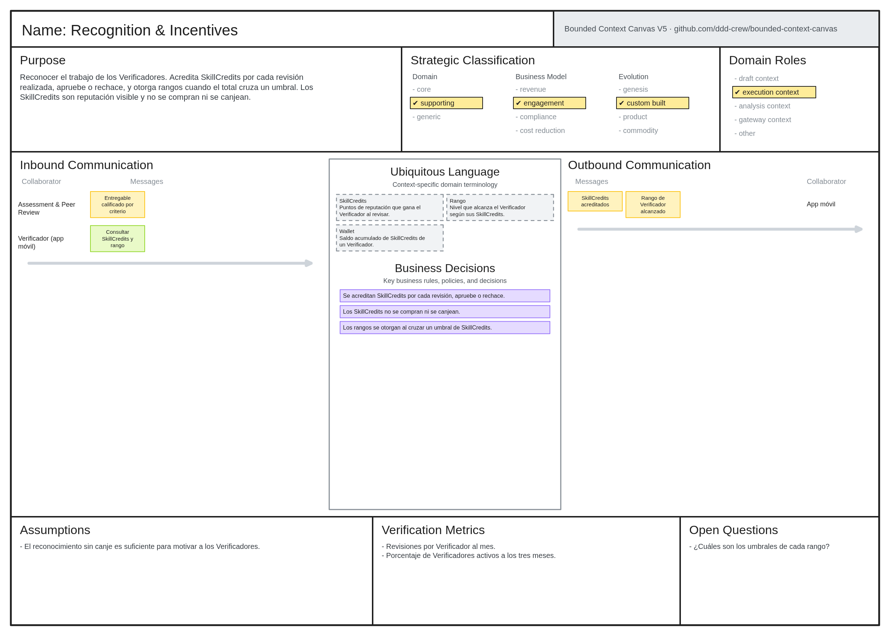

*Nota.* Bounded Context Canvas del contexto Recognition & Incentives, elaborado con la plantilla v5 de ddd-crew. Elaboración propia.

Moderation & Disputes resuelve las disputas y las revisiones de certificados. Una decisión de diseño importante es que la moderación no es un actor de la aplicación: el equipo interno opera desde un panel externo que consume los comandos de este contexto. Sus capacidades son resolver disputas, aplicar sanciones y resolver revisiones de certificados, y sus resultados se comunican con eventos a Reputation, Assessment & Peer Review y Credential Verification. En la crítica quedó pendiente definir qué ocurre con los casos asignados a un Verificador sancionado.

**Figura 62**

*Bounded Context Canvas: Moderation & Disputes*

  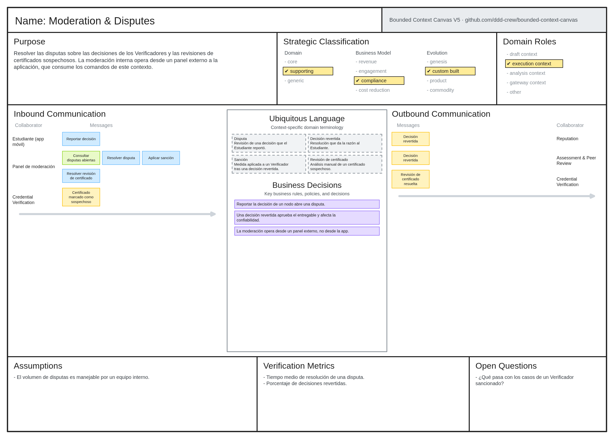

*Nota.* Bounded Context Canvas del contexto Moderation & Disputes, elaborado con la plantilla v5 de ddd-crew. Elaboración propia.

Subscription & Billing se clasificó como genérico, porque la gestión de planes y cobros es común a muchas aplicaciones y se apoya en una pasarela de pago existente, Culqi o Mercado Pago. Su regla principal refleja el modelo de negocio: ningún plan compra la aprobación, ya que la cantidad de intentos es igual en ambos, y el plan premium solo reduce las esperas y los plazos y amplía las rutas y los escalamientos. En las dependencias se observa que es un contexto muy consultado: Learning Path Engine y Assessment & Peer Review le preguntan por los límites del plan antes de actuar.

**Figura 63**

*Bounded Context Canvas: Subscription & Billing*

  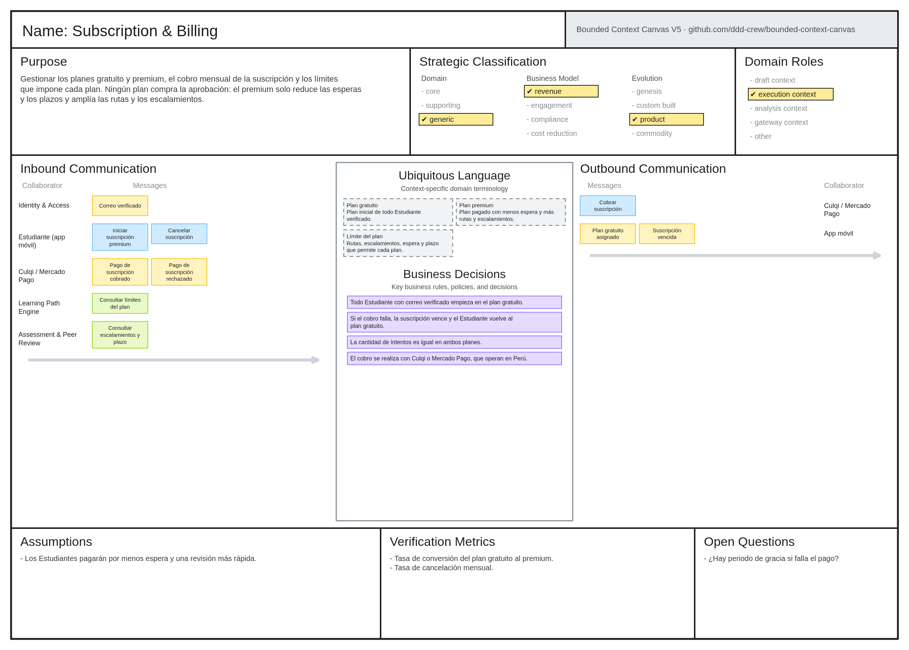

*Nota.* Bounded Context Canvas del contexto Subscription & Billing, elaborado con la plantilla v5 de ddd-crew. Elaboración propia.

Por último, Identity & Access se clasificó como genérico, commodity y de tipo gateway, porque es la puerta de entrada a la aplicación. Registra a los usuarios, verifica su correo con un código, sin exigir un dominio institucional, y los autentica. Un Verificador sigue siendo el mismo usuario que se registró como Estudiante, por lo que no existe un registro separado. Su dependencia principal es Subscription & Billing, que reacciona al correo verificado asignando el plan gratuito.

**Figura 64**

*Bounded Context Canvas: Identity & Access*

  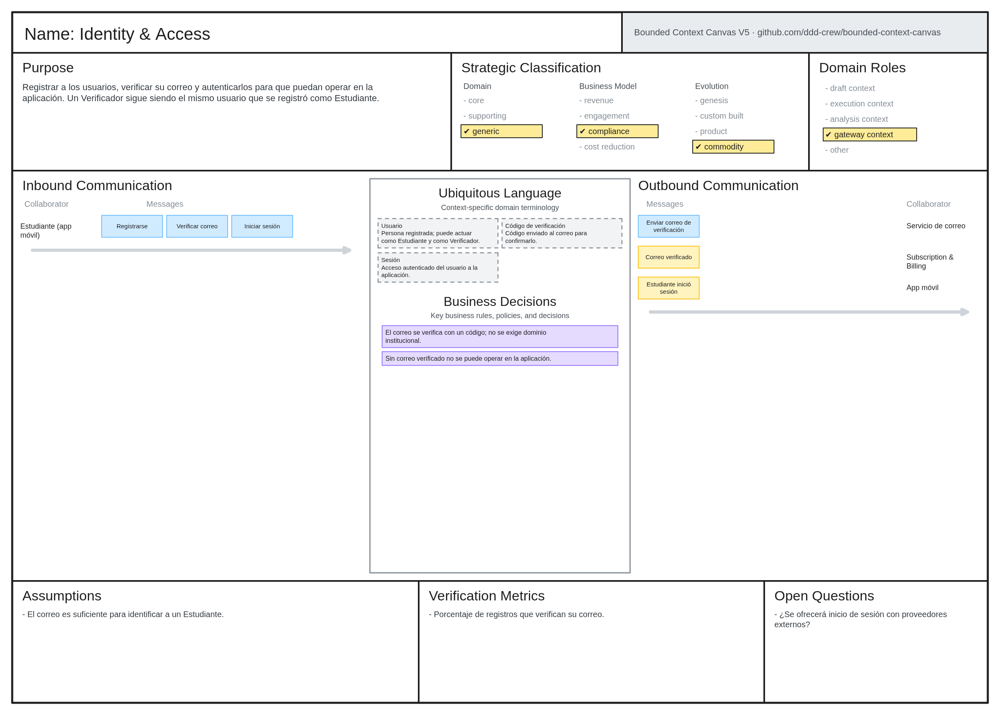

*Nota.* Bounded Context Canvas del contexto Identity & Access, elaborado con la plantilla v5 de ddd-crew. Elaboración propia.

### 2.5.2. Context Mapping

El Context Mapping de SkillSwap evidencia las relaciones estructurales entre los ocho Bounded Contexts que conforman la solución, aplicando los patrones de relación establecidos en Domain-Driven Design para gestionar las dependencias entre equipos y modelos de dominio, bajo el nuevo enfoque de la plataforma centrado en la verificación de habilidades mediante Inteligencia Artificial.

**Identity & Access** actúa como **Upstream** de todo el sistema bajo el patrón **Conformist**: su agregado `User` expone únicamente `userId` y `role` como datos públicos, y el resto de los Bounded Contexts (Credential Verification, Learning Path Engine, Assessment & Peer Review, Reputation, Recognition & Incentives, Subscription & Billing y Moderation & Disputes) se conforman a ese modelo sin negociar cambios, referenciando el identificador de usuario como un dato externo dentro de su propio esquema de persistencia. Es dentro de este Bounded Context que se distingue el perfil de `Student` del perfil de `Verificador` (vinculado a un Student que ya completó su propia ruta de certificación), sin que ello implique un rol adicional a nivel de autenticación.

**Credential Verification** mantiene una relación **Customer/Supplier** hacia **Learning Path Engine**: únicamente un certificado ya validado (extraído y verificado como legítimo) puede ser consumido como evidencia de una habilidad dentro del cálculo de brechas, por lo que Learning Path Engine actúa como Downstream, consumiendo el modelo de `Certificate` validado sin poder alterar las reglas de extracción o de detección de fraude definidas en el Upstream.

**Learning Path Engine**, como núcleo de negocio (Core Domain) de la plataforma, es **Supplier** de **Assessment & Peer Review** bajo el patrón **Customer/Supplier**: cada `PathNode` de la ruta generada define la especificación de la evaluación (habilidad a demostrar, nivel de exigencia) que Assessment & Peer Review debe ejecutar como Downstream, sin negociar el contenido de dicha especificación.

**Assessment & Peer Review**, como ejecutor del flujo de evaluación y revisión humana, es **Supplier** de **Reputation** (la resolución de un `VerificationCase` —aprobado o rechazado, y quién lo revisó— dispara el recálculo de la confiabilidad del Verificador y del Employability Score del estudiante) y de **Recognition & Incentives** (la resolución de un caso por parte de un Verificador dispara la acreditación de SkillCredits), ambas bajo el patrón **Customer/Supplier**.

**Subscription & Billing** opera de forma independiente al resto de los Bounded Contexts de negocio, sin ninguna relación Customer/Supplier hacia Recognition & Incentives: gestiona únicamente el acceso recurrente del Estudiante a la plataforma mediante la suscripción mensual, sin intervenir en el balance ni la acreditación de SkillCredits, que permanecen como un sistema de reconocimiento estrictamente no monetario y no adquirible. Este Bounded Context mantiene una relación de **Anticorruption Layer (ACL)** hacia el servicio externo de terceros **Stripe**, aislando el modelo de dominio interno `Subscription` de los contratos, eventos (webhooks) y formatos propios de la API de pagos.

**Moderation & Disputes** se relaciona como **Customer/Supplier** hacia **Identity & Access** (emite órdenes de sanción sobre la cuenta de un usuario que presentó certificados fraudulentos o incurrió en una falta) y hacia **Reputation** (ajusta la reputación del usuario tras una disputa resuelta). Adicionalmente, mantiene una relación de **Anticorruption Layer (ACL)** hacia **Assessment & Peer Review**: en lugar de depender directamente del modelo interno de `VerificationCase`, Moderation & Disputes traduce la información recibida a su propio modelo simplificado de "caso en disputa", evitando acoplarse a cambios futuros en la lógica interna de asignación y revisión de Verificadores.

Finalmente, **Credential Verification** mantiene una relación de **Anticorruption Layer (ACL)** hacia el servicio externo de terceros **ML Kit** (Text Recognition / Entity Extraction de Firebase, utilizado on-device para la extracción de datos del certificado), aislando el modelo de dominio interno `Certificate` de los contratos y formatos de respuesta propios del SDK externo.

**Figura 65**

*Context Mapping de SkillSwap*

  

*Nota.* Se muestran las relaciones Conformist, Customer/Supplier y Anticorruption Layer entre los ocho Bounded Contexts (Identity & Access, Credential Verification, Learning Path Engine, Assessment & Peer Review, Reputation, Recognition & Incentives, Subscription & Billing y Moderation & Disputes) y los sistemas externos ML Kit y Stripe. Elaboración propia.

### 2.5.3. Software Architecture

**Software Architecture Context Level Diagram:**
Muestra la interacción de los dos actores (Estudiante, Verificador) con el sistema central de SkillSwap y los servicios externos de terceros (extracción de datos de certificados vía ML Kit, procesamiento de pagos vía Stripe, almacenamiento de evidencias y servicio de notificaciones).

**Software Architecture Container Level Diagram:**
Detalla la estructura de contenedores:
1. **Mobile Application (Native/Cross-Platform):** La interfaz principal para los dos actores, desarrollada con soporte de almacenamiento local, acceso a hardware (cámara para captura de certificados, biometría) y consumo del backend RESTful.
2. **Landing Page:** Sitio web estático para la presentación del modelo de negocio, accesible por ambos actores.
3. **API / RESTful Web Services:** El backend desarrollado internamente que expone los endpoints y orquesta la lógica de negocio de los ocho Bounded Contexts.
4. **Database:** Repositorio central de información, compartido por los ocho Bounded Contexts.

**Software Architecture Deployment Diagram:**
Muestra cómo la aplicación móvil se despliega en los dispositivos físicos de los usuarios (Android), el Landing Page en un servicio de hosting estático, y el backend junto con la base de datos en infraestructura Cloud.

#### 2.5.3.1. Software Architecture Context Level Diagrams

El diagrama de contexto (Context Diagram) bajo el enfoque C4 Model presenta al sistema SkillSwap como una caja central única, mostrando sus interacciones de alto nivel con los actores principales y los sistemas externos de terceros, sin exponer aún detalles de implementación.

El sistema es utilizado por dos actores principales: el **Estudiante**, quien sube sus certificados, demuestra sus habilidades a través de las evaluaciones generadas por la plataforma y accede a la plataforma mediante una suscripción mensual; y el **Verificador** (un perfil vinculado a un Estudiante que ya completó su propia ruta de certificación), quien revisa los casos que la IA no puede resolver con suficiente confianza, y supervisa la calidad e integridad del proceso de verificación, resolviendo disputas y consultando métricas agregadas del ecosistema. Ambos actores interactúan con el sistema a través de la **aplicación móvil nativa (Android) y cross-platform (Flutter)**, así como del Landing Page.

A nivel de sistemas externos, SkillSwap se integra con: **ML Kit** (Firebase), utilizado on-device para la extracción de datos de los certificados subidos por el Estudiante (institución, curso, fecha) — esta es la tecnología que satisface el requisito de aprendizaje autónomo del curso; **Stripe**, utilizado para el procesamiento del cobro recurrente de la suscripción mensual; un **servicio de almacenamiento en la nube** para las imágenes de certificados y evidencias adjuntas a un caso de revisión; y un **servicio de correo electrónico** para el envío de notificaciones institucionales (validación de dominio `.edu.pe`, resultado de una evaluación, apertura o resolución de un caso de verificación).

  
   
  <em>Figura XX. C4 Model: Context Diagram - Elaboración propia. Nota: Diagrama de contexto que muestra el sistema SkillSwap en el centro y sus interacciones directas con los dos actores principales (Estudiante, Verificador) a través de la aplicación móvil nativa, la aplicación cross-platform y el Landing Page, así como con los sistemas externos de terceros (ML Kit, Stripe, almacenamiento en la nube y servicio de correo electrónico).</em>

#### 2.5.3.2. Software Architecture Container Level Diagrams

El diagrama de contenedores (Container Diagram) descompone el sistema SkillSwap en los bloques de alto nivel que lo conforman, mostrando las principales decisiones tecnológicas y cómo se comunican entre sí. A diferencia del Context Diagram, aquí se detalla la estructura interna del sistema como un conjunto de aplicaciones y almacenes de datos desplegables de forma independiente.

Los contenedores identificados son los siguientes:

- **Landing Page (Sitio Web Estático):** Presenta el modelo de negocio de SkillSwap al público general, implementado con HTML5, CSS3 y JavaScript.
- **Android Native Application:** Aplicación móvil nativa dirigida a los dos actores (Estudiante, Verificador), desarrollada en Kotlin con Jetpack Compose, que consume los Web Services RESTful del backend.
- **Cross-Platform Application (Flutter):** Aplicación móvil dirigida a Android, que replica las funcionalidades core para ambos actores, desarrollada en Flutter con Dart, consumiendo igualmente los Web Services RESTful expuestos por el backend.
- **API / RESTful Web Services:** Backend desarrollado bajo arquitectura RESTful en C# / ASP.NET Core, actuando como Published Language único para los tres clientes (Landing Page, Android Native App y Flutter App). Este contenedor expone los endpoints del dominio y orquesta la lógica de negocio de los ocho Bounded Contexts (Identity & Access, Credential Verification, Learning Path Engine, Assessment & Peer Review, Reputation, Wallet & Incentives, Subscription & Billing y Moderation & Disputes); el detalle interno de cada Bounded Context se desarrolla en su propio Component Diagram (ver 2.6.x.5).
- **Database:** Repositorio central de persistencia (instancia única de MySQL), donde cada Bounded Context mantiene sus propias tablas siguiendo los principios de Domain-Driven Design.

Es importante resaltar que tanto la aplicación Android nativa como la aplicación Flutter cross-platform consumen el **mismo contrato de API RESTful** documentado con OpenAPI/Swagger, sin requerir endpoints adicionales ni lógica de backend duplicada, evidenciando así el desacoplamiento entre la capa de presentación y la capa de dominio/aplicación del sistema.

  
   
  <em>Figura XX. C4 Model: Container Diagram - Elaboración propia. Nota: Diagrama de contenedores que muestra el Landing Page, la Aplicación Android Nativa, la Aplicación Cross-Platform (Flutter), el backend de API/RESTful Web Services y la Base de Datos, junto con sus interacciones y los sistemas externos ML Kit, Stripe y el servicio de almacenamiento en la nube. Los ocho Bounded Contexts se detallan a nivel de Component Diagram, no en este nivel de contenedor.</em>

#### 2.5.3.3. Software Architecture Deployment Diagrams

El Deployment Diagram bajo el enfoque C4 Model muestra la distribución física de los contenedores de SkillSwap sobre la infraestructura de hardware y los entornos de ejecución, evidenciando cómo se despliega la solución en un ambiente real.

- **Dispositivos móviles de usuario final:** Los dispositivos Android de Estudiantes y Verificadores alojan localmente la Aplicación Android Nativa (Kotlin/Jetpack Compose) y la Aplicación Cross-Platform (Flutter, dirigida a Android), instaladas mediante distribución interna vía **Firebase App Distribution** durante el ciclo de pruebas, y descargables desde el dispositivo físico para la sustentación del curso. En estos dispositivos se ejecuta además **ML Kit** de forma on-device para la extracción de datos de los certificados, sin requerir una llamada a un servicio en la nube para dicho procesamiento.
- **Hosting estático:** Aloja el Landing Page, servido de forma estática desde un proveedor de hosting (Firebase Hosting / Vercel), de acceso público.
- **Servidor de aplicación (Cloud):** Aloja el backend de Web Services RESTful (C# / ASP.NET Core), desplegado en **Render**, donde se ejecuta la lógica de negocio de los ocho Bounded Contexts a través de un único API Gateway, y se exponen los endpoints documentados con OpenAPI/Swagger, consumidos indistintamente por los tres clientes (Landing Page, Android Native App, Flutter App).
- **Servidor de base de datos (Cloud):** Aloja una única instancia administrada de MySQL desplegada en **Render**, compartida por los ocho Bounded Contexts, comunicándose con el servidor de aplicación mediante una conexión segura.
- **Servicios externos en la nube:** Servicio de almacenamiento (Cloudinary) para las imágenes de certificados y evidencias adjuntas a un caso de verificación, servicio de correo electrónico para el envío de notificaciones (validación institucional, resultados de evaluación, estado de un caso de revisión), y **Stripe** para el procesamiento del cobro recurrente de la suscripción mensual.

Cada uno de estos nodos se comunica mediante protocolos HTTPS, garantizando la seguridad en la transmisión de datos entre los dispositivos cliente (móviles y navegador) y los servidores desplegados en la nube.

**Figura 68**

*C4 Model: Deployment Diagram*

  

*Nota.* Diagrama de despliegue que muestra la distribución física de la solución, incluyendo los dispositivos móviles de usuario final (Android/Flutter) con distribución vía Firebase App Distribution y ejecución on-device de ML Kit, el hosting estático del Landing Page, el servidor de aplicación en Render, la instancia única de MySQL en Render y los servicios externos de almacenamiento en la nube y Stripe. Elaborado en PlantUML. Elaboración propia.

## 2.6. Tactical-Level Domain-Driven Design

### 2.6.1. Bounded Context: Identity & Access

#### 2.6.1.1. Domain Layer

La capa de dominio de Identity & Access encapsula la lógica de negocio central para la gestión de identidades y seguridad, asegurando que las reglas de autenticación, autorización y verificación institucional sean independientes de las tecnologías externas.

**1. Aggregate Root: User**

Descripción: El agregado `User` actúa como la raíz del modelo y centraliza la información de la cuenta, garantizando que el registro y las credenciales se validen estrictamente antes de persistirse.

Atributos

| Atributo | Tipo | Descripción |
|---|---|---|
| id | int | Identificador único del usuario (autogenerado). |
| username | Username (VO) | Identificador de texto único utilizado para acceder al sistema. |
| email | Email (VO) | Correo electrónico validado contra el dominio institucional `.edu.pe`. |
| passwordHash | PasswordHash (VO) | Representación segura de la contraseña tras pasar por un algoritmo de encriptación. |
| role | Role (VO) | Rol de la cuenta: `Student` o `Coordinator`. |
| isVerified | boolean | Indica si la cuenta ha completado la validación institucional. |
| bio | string | Descripción libre del perfil del usuario. |
| deviceToken | DeviceToken (VO) | Identificador del dispositivo móvil, reservado para una futura integración de notificaciones — pendiente de definir el proveedor/tecnología específica. |

Métodos

- `User(username, email, password, role)` (Constructor): Inicializa las propiedades del usuario y valida que el correo pertenezca al dominio institucional antes de crear la instancia.
- `verify()`: Cambia `isVerified` a `true` una vez confirmada la validación institucional.
- `registerDeviceToken(String token)`: Asocia o actualiza el `deviceToken` del dispositivo móvil desde el cual el usuario inició sesión.

**2. Value Object: Email**

Descripción: Representa un correo electrónico validado, garantizando que solo se acepten direcciones pertenecientes a un dominio institucional autorizado.

Atributos

| Atributo | Tipo | Descripción |
|---|---|---|
| value | string | Dirección de correo electrónico completa. |

Métodos

- `Email(String value)` (Constructor): Valida el formato del correo y que su dominio corresponda a `.edu.pe`, lanzando una excepción de dominio en caso contrario.

**3. Value Object: Role**

Descripción: Enumeración que restringe los valores válidos para el rol de una cuenta.

Atributos

| Atributo | Tipo | Descripción |
|---|---|---|
| value | enum | Valor del rol: `Student` o `Coordinator`. Nota: el perfil de Verificador no es un valor de este enum — es un perfil adicional (`VerifierProfile`) que un usuario `Student` puede adquirir una vez completada su propia ruta de certificación, gestionado en el Bounded Context Assessment & Peer Review. |

**4. Value Object: PasswordHash**

Descripción: Encapsula la representación cifrada de la contraseña, evitando que el valor en texto plano circule fuera de la capa de infraestructura.

Atributos

| Atributo | Tipo | Descripción |
|---|---|---|
| value | string | Cadena cifrada (hash) de la contraseña. |

**5. Value Object: DeviceToken**

Descripción: Identificador opaco del dispositivo móvil del usuario, reservado como punto de extensión para una futura funcionalidad de notificaciones.

Atributos

| Atributo | Tipo | Descripción |
|---|---|---|
| value | string | Token del dispositivo, nulo hasta que se defina la tecnología de notificación a integrar. |

**6. Domain Service: PasswordHasher**

Descripción: Define el contrato para el cifrado y verificación de contraseñas, desacoplando el dominio del algoritmo criptográfico concreto.

Métodos

- `hashPassword(String plainPassword)`: Recibe la contraseña en texto plano y la transforma en un hash mediante un algoritmo criptográfico para su almacenamiento seguro.
- `verifyPassword(String plainPassword, PasswordHash hash)`: Compara una contraseña en texto claro contra un hash almacenado para verificar si coinciden.

**7. Domain Service: EmailDomainValidator**

Descripción: Define el contrato para validar que un correo electrónico pertenezca a un dominio institucional autorizado antes de crear o actualizar un `User`.

Métodos

- `isInstitutionalDomain(Email email)`: Retorna verdadero si el dominio del correo corresponde a `.edu.pe`.

**8. Repository: UserRepository**

Descripción: Interfaz para la persistencia y recuperación de datos del agregado `User`, sin exponer detalles de la tecnología de almacenamiento subyacente.

Métodos

- `findByUsername(String username)`: Recupera un usuario por su nombre de usuario único.
- `findByEmail(Email email)`: Recupera un usuario por su correo electrónico.
- `existsByEmail(Email email)`: Verifica la unicidad de un correo antes del registro.
- `save(User user)`: Persiste un usuario nuevo o actualizado.

En la Domain Layer de SkillSwap, específicamente dentro del Bounded Context de Identity & Access, se ha definido la gestión de identidades bajo un modelo de Domain-Driven Design (DDD). La clase `User` actúa como el Agregado raíz que centraliza la información de la cuenta y su asociación con el rol correspondiente (Student o Coordinator), garantizando que el acceso y las credenciales se validen estrictamente a través de servicios de dominio como `PasswordHasher` y `EmailDomainValidator`. Finalmente, la recuperación y persistencia de estas identidades se gestiona mediante el repositorio `UserRepository`.

#### 2.6.1.2. Interface Layer

En la Interface Layer de SkillSwap, específicamente para el contexto de Identity & Access, se definen los puntos de entrada para la comunicación externa. Esta capa utiliza controladores REST, recursos (DTOs) y ensambladores para desacoplar el modelo de dominio de las representaciones externas, facilitando el registro y la autenticación de los usuarios desde los clientes móviles.

**Resources**

| Nombre | Descripción |
|---|---|
| SignUpResource | DTO que encapsula los datos de entrada (username, email, password) para el registro de una nueva cuenta. |
| SignInResource | DTO que contiene las credenciales necesarias (username, password) para validar el acceso al sistema. |
| UserResource | DTO de salida que representa la información pública del usuario (id, username, email, role, isVerified) tras una consulta exitosa. |
| AuthenticatedUserResource | Recurso que devuelve el token JWT generado y la información básica del usuario tras un inicio de sesión correcto. |

**Controllers**

| Nombre | Método HTTP | Ruta / Resource | Descripción |
|---|---|---|---|
| AuthenticationController | POST | `/api/v1/authentication/sign-up` (SignUpResource) | Expone el endpoint para crear una nueva cuenta, validando previamente el dominio institucional del correo. |
| AuthenticationController | POST | `/api/v1/authentication/sign-in` (SignInResource) | Gestiona la autenticación, verificando las credenciales y devolviendo el token de acceso JWT. |

**Transformers / Assemblers**

| Nombre | Descripción |
|---|---|
| UserResourceFromEntityAssembler | Convierte la entidad de dominio `User` en un `UserResource` para su envío a través de la API. |
| SignUpCommandFromResourceAssembler | Transforma los datos recibidos en `SignUpResource` en un `SignUpCommand` procesable por la capa de aplicación. |
| SignInCommandFromResourceAssembler | Convierte el `SignInResource` en el `SignInCommand` correspondiente para la validación de credenciales. |

Los controladores presentados no contienen reglas de negocio: delegan el procesamiento a la capa de dominio y de aplicación, actuando como una interfaz uniforme entre los clientes móviles (Android Nativo, Flutter) y la lógica de autenticación del sistema.

#### 2.6.1.3. Application Layer

En la Application Layer de SkillSwap, para el contexto de Identity & Access, los handlers son los encargados de procesar los comandos, orquestando la lógica necesaria para cumplir con los casos de uso de registro y autenticación, actuando como mediadores entre la Interface Layer y el Domain Layer.

**Handlers**

| Nombre | Descripción | Resumen de Lógica |
|---|---|---|
| SignUpCommandHandler | Procesa la creación de nuevas cuentas de usuario. | Valida que el email pertenezca al dominio institucional y no esté en uso, cifra la contraseña mediante `PasswordHasher`, instancia el agregado `User` y lo persiste a través de `UserRepository`. |
| SignInCommandHandler | Gestiona el proceso de inicio de sesión y autenticación. | Busca al usuario por `username`, verifica la contraseña comparándola con el hash almacenado mediante `PasswordHasher`, y genera un token JWT para la sesión autenticada. |

**Internal DTOs**

| Nombre | Descripción |
|---|---|
| UserDto | Objeto que transporta la información pública y operativa del usuario, incluyendo su rol e indicador de verificación. |
| AuthenticationDto | DTO especializado que encapsula la información básica del usuario junto con el token JWT tras una autenticación exitosa. |

En la Application Layer de Identity & Access, los handlers orquestan el flujo de autenticación asegurando que cada registro sea validado contra el dominio institucional antes de persistirse, y que el inicio de sesión solo emita un token JWT cuando las credenciales sean correctas.

#### 2.6.1.4. Infrastructure Layer

En la Infrastructure Layer de SkillSwap, para el contexto de Identity & Access, se implementan los detalles técnicos y las integraciones necesarias para la persistencia y la seguridad de las identidades.

**Persistence (Repository Implementation)**

| Nombre | Descripción | Tecnologías / Herramientas |
|---|---|---|
| UserRepositoryAdapter | Implementación concreta de `UserRepository` que realiza las operaciones CRUD sobre la tabla `users`. | ORM del stack backend, instancia MySQL desplegada en Render. |

**Security Services Implementation**

| Nombre | Descripción | Resumen de Implementación |
|---|---|---|
| BCryptPasswordHasher | Implementación técnica de `PasswordHasher` encargada de proteger las contraseñas de los usuarios. | Utiliza el algoritmo BCrypt para generar hashes seguros y validar contraseñas durante el acceso. |
| JwtTokenGenerator | Servicio responsable de la generación de tokens de seguridad para sesiones autenticadas. | Implementa la generación de tokens JWT, codificando el `userId` y el `role` para la autorización de peticiones en los clientes móviles (Android Nativo, Flutter). |

Estos componentes aseguran que la lógica de negocio de Identity & Access se ejecute sobre una infraestructura robusta, con el campo `deviceToken` del agregado `User` quedando reservado como punto de extensión hasta definir la tecnología concreta de notificaciones a integrar.

#### 2.6.1.5. Bounded Context Software Architecture Component Level Diagrams

**Figura 69**

*C4 Model: Component Diagram del Bounded Context Identity & Access*

  

*Nota.* Se detalla la segregación entre el Controller, los Command/Query Services y los adaptadores de Persistencia y Seguridad (JWT), evidenciando las relaciones con los demás Bounded Contexts: la creación de la wallet inicial de SkillCredits en Recognition & Incentives al registrarse, la consulta de estado de sanción hacia Moderation & Disputes, y las solicitudes entrantes de Assessment & Peer Review (lista de Verificadores disponibles), Reputation (actualización de confiabilidad/Employability Score), Moderation & Disputes (datos de la cuenta reportada y actualización tras sanción) y Recognition & Incentives (confirmación de biometría antes de canjear SkillCredits). Elaboración propia.

#### 2.6.1.6. Bounded Context Software Architecture Code Level Diagrams

##### 2.6.1.6.1. Bounded Context Domain Layer Class Diagrams

**Figura 70**

*Diagrama de Clases UML del Domain Layer de Identity & Access*

  

*Nota.* Recorte del diagrama de clases general correspondiente a este Bounded Context. Elaboración propia.

El modelado de clases de Identity & Access pertenece al agregado raíz `User`, junto con sus Value Objects `Username`, `Email`, `PasswordHash` y `DeviceToken`, y la enumeración `Role`, debido a que estos elementos concentran de forma exclusiva la información de cuenta, credenciales y estado de verificación institucional de cada usuario de la plataforma. Se destaca el Value Object `DeviceToken`, incorporado sobre el agregado `User` como punto de extensión para una futura integración de notificaciones push en los clientes móviles nativo y cross-platform.

##### 2.6.1.6.2. Bounded Context Database Design Diagram

**Figura 71**

*Diagrama de Base de Datos del Bounded Context Identity & Access*

  

*Nota.* Recorte del diagrama relacional general correspondiente a este Bounded Context. Elaboración propia.

El modelado de base de datos de Identity & Access pertenece a la tabla `users`, debido a que es la única tabla que persiste el agregado raíz `User` junto con sus Value Objects embebidos (`username`, `email`, `password_hash`, `role`, `device_token`), sin requerir tablas adicionales — a diferencia de otros Bounded Contexts del proyecto, `User` no compone ninguna entidad hija ni colección propia, por lo que un único registro por usuario es suficiente para representar el agregado completo. Se destaca el campo `device_token`, incorporado sobre la tabla `users` para el soporte de una futura integración de notificaciones push en los clientes móviles.

---

### 2.6.2. Bounded Context: Credential Verification

#### 2.6.2.1. Domain Layer

La capa de dominio de Credential Verification encapsula la lógica de negocio para el registro, extracción de datos y evaluación de riesgo de los certificados subidos por el Estudiante, manteniendo el modelo desacoplado de la tecnología concreta de OCR y de los mecanismos de verificación externos de cada emisor.

**1. Aggregate Root: Certificate**

Descripción: El agregado `Certificate` centraliza el documento subido por el Estudiante, los datos extraídos mediante OCR, y el estado de verificación resultante de la evaluación de riesgo. No conoce ni depende de la lógica específica de ningún emisor externo (SUNEDU, Coursera, etc.), dejando esa integración como un punto de extensión documentado pero fuera del alcance implementado del curso.

Atributos

| Atributo | Tipo | Descripción |
|---|---|---|
| id | int | Identificador único del certificado (autogenerado). |
| ownerId | int | Referencia al `User` (Estudiante) propietario del certificado, definido en Identity & Access. |
| holderName | string | Nombre del titular extraído del documento. |
| institutionName | string | Institución o emisor del certificado. |
| courseName | string | Nombre del curso, programa o certificación. |
| issueDate | date | Fecha de emisión del certificado. |
| durationHours | int (nullable) | Carga horaria, si el documento la incluye. |
| certificateNumber | string (nullable) | Número o código del certificado, si aparece. |
| verificationCode | string (nullable) | Código específico de validación, si aparece. |
| verificationUrl | string (nullable) | URL de verificación oficial, si aparece. |
| qrPayload | string (nullable) | Contenido decodificado del código QR, si existe. |
| ocrText | string | Texto completo extraído por OCR, conservado para auditoría y reprocesamiento. |
| fileHash | string | Hash criptográfico del archivo original, usado para detección de duplicados. |
| storageReference | string | Referencia al archivo almacenado en el servicio de almacenamiento en la nube. |
| status | VerificationStatus (VO) | Estado actual del certificado dentro del flujo de verificación. |
| verificationMethod | VerificationMethod (VO) | Mecanismo mediante el cual se intentó verificar el certificado. |
| riskAssessment | RiskAssessment (VO) | Resultado de la evaluación de riesgo aplicada al certificado. |
| createdAt | datetime | Fecha de registro del certificado en la plataforma. |
| verifiedAt | datetime (nullable) | Fecha en la que el certificado alcanzó un estado definitivo (`VERIFIED` o `REJECTED`). |

Métodos

- `Certificate(ownerId, fileHash, storageReference)` (Constructor): Registra el documento subido con estado inicial `PENDING`, antes de que se ejecute la extracción OCR.
- `applyExtractedData(holderName, institutionName, courseName, issueDate, durationHours, certificateNumber, verificationCode, verificationUrl, qrPayload, ocrText)`: Completa el agregado con los datos obtenidos por el servicio de extracción, una vez procesado el documento.
- `assessRisk(RiskAssessment riskAssessment)`: Asigna el resultado de la evaluación de riesgo y transiciona el estado del certificado: a `SUSPICIOUS` si el nivel es `HIGH_RISK`, o a `UNVERIFIED` si es `LOW_RISK` o `REVIEW` (a la espera de que el nivel `REVIEW` sea tratado manualmente en una futura iteración).
- `resolveDispute(boolean isAuthentic)`: Aplica la decisión del Coordinador tras la escalación a Moderation & Disputes, transicionando el certificado a `VERIFIED` o `REJECTED` y registrando `verifiedAt`.

**2. Value Object: RiskAssessment**

Descripción: Encapsula el resultado explicable (basado en reglas) de la evaluación de riesgo de un certificado, evitando que la lógica de scoring viva dispersa dentro del agregado.

Atributos

| Atributo | Tipo | Descripción |
|---|---|---|
| score | int | Puntaje acumulado según las reglas de riesgo aplicadas. |
| level | enum | Nivel derivado del score: `LOW_RISK` (0–19), `REVIEW` (20–49), `HIGH_RISK` (50+). |

Métodos

- `RiskAssessment(int score)` (Constructor): Calcula automáticamente el `level` correspondiente a partir del score recibido.

**3. Value Object: VerificationStatus**

Descripción: Enumeración que restringe los estados válidos del ciclo de vida de un certificado.

Atributos

| Atributo | Tipo | Descripción |
|---|---|---|
| value | enum | `PENDING`, `UNVERIFIED`, `SUSPICIOUS`, `VERIFIED`, `REJECTED`. |

**4. Value Object: VerificationMethod**

Descripción: Enumeración que documenta los mecanismos de verificación contemplados en el diseño. Para el alcance implementado en el curso solo se ejecutan `OCR_ONLY` y `MANUAL`; `QR`, `ISSUER_URL` y `OFFICIAL_REGISTRY` quedan documentados como extensión futura, sin lógica de integración activa.

Atributos

| Atributo | Tipo | Descripción |
|---|---|---|
| value | enum | `OCR_ONLY`, `QR`, `ISSUER_URL`, `OFFICIAL_REGISTRY`, `MANUAL`. |

**5. Domain Service: CertificateExtractionService**

Descripción: Define el contrato para extraer los datos estructurados de un documento de certificado, desacoplando el dominio de la tecnología concreta de OCR (ML Kit).

Métodos

- `extract(byte[] rawDocument)`: Recibe el documento crudo y retorna los campos extraídos (holderName, institutionName, courseName, issueDate, durationHours, certificateNumber, verificationCode, verificationUrl, qrPayload, ocrText) junto con el texto completo reconocido.

**6. Domain Service: CertificateRiskScorer**

Descripción: Define el contrato para calcular el `RiskAssessment` de un certificado a partir de un conjunto explicable de reglas, sin depender de fuentes de verificación externas.

Métodos

- `calculateRisk(boolean duplicateCertificateNumber, boolean duplicateVerificationCode, boolean duplicateFileHash, boolean ocrInconsistencies)`: Aplica las reglas de riesgo (+30 número de certificado duplicado, +30 código de verificación duplicado, +15 inconsistencias detectadas por OCR, +10 archivo idéntico a otro certificado) y retorna el `RiskAssessment` resultante.

**7. Repository: CertificateRepository**

Descripción: Interfaz para la persistencia y recuperación de datos del agregado `Certificate`, incluyendo las consultas necesarias para la detección de duplicados.

Métodos

- `findById(int id)`: Recupera un certificado por su identificador.
- `findByOwnerId(int ownerId)`: Recupera todos los certificados subidos por un Estudiante.
- `existsByCertificateNumber(String certificateNumber)`: Verifica si un número de certificado ya fue registrado por otro usuario.
- `existsByVerificationCode(String verificationCode)`: Verifica si un código de verificación ya fue registrado.
- `existsByFileHash(String fileHash)`: Verifica si el archivo ya fue registrado previamente.
- `save(Certificate certificate)`: Persiste un certificado nuevo o actualizado.

En la Domain Layer de SkillSwap, dentro del Bounded Context de Credential Verification, la clase `Certificate` actúa como Agregado raíz que centraliza el documento subido y su estado de verificación, apoyándose en los servicios de dominio `CertificateExtractionService` para la extracción de datos y `CertificateRiskScorer` para la evaluación explicable de riesgo. La separación conceptual entre "qué certificado presentó el usuario" (`Certificate`), "qué mecanismo se usó para intentar verificarlo" (`VerificationMethod`) y "qué señales de riesgo se detectaron" (`RiskAssessment`) permite incorporar en el futuro nuevos verificadores oficiales sin modificar el agregado principal.

#### 2.6.2.2. Interface Layer

En la Interface Layer de SkillSwap, para el contexto de Credential Verification, se definen los puntos de entrada REST que permiten al Estudiante subir certificados y consultar su estado de verificación desde los clientes móviles.

**Resources**

| Nombre | Descripción |
|---|---|
| UploadCertificateResource | DTO que encapsula el archivo del certificado (imagen/PDF) y el identificador del propietario para su registro inicial. |
| CertificateResource | DTO de salida que representa un certificado con sus datos extraídos, estado de verificación y nivel de riesgo. |
| CertificateListResource | Colección de `CertificateResource` correspondiente a los certificados de un Estudiante. |

**Controllers**

| Nombre | Método HTTP | Ruta / Resource | Descripción |
|---|---|---|---|
| CertificateController | POST | `/api/v1/certificates` (UploadCertificateResource) | Registra un nuevo certificado y dispara su procesamiento (extracción OCR y evaluación de riesgo). |
| CertificateController | GET | `/api/v1/certificates/{id}` | Consulta el detalle y estado actual de un certificado específico. |
| CertificateController | GET | `/api/v1/certificates?ownerId={ownerId}` | Lista los certificados subidos por un Estudiante. |

**Transformers / Assemblers**

| Nombre | Descripción |
|---|---|
| CertificateResourceFromEntityAssembler | Convierte la entidad de dominio `Certificate` en un `CertificateResource` para su envío a través de la API. |
| UploadCertificateCommandFromResourceAssembler | Transforma los datos recibidos en `UploadCertificateResource` en un `UploadCertificateCommand` procesable por la capa de aplicación. |

Los controladores no contienen reglas de negocio: delegan el procesamiento de extracción y evaluación de riesgo a la capa de aplicación, actuando como interfaz uniforme entre los clientes móviles (Android Nativo, Flutter) y la lógica de verificación de certificados.

#### 2.6.2.3. Application Layer

En la Application Layer de SkillSwap, para el contexto de Credential Verification, los handlers orquestan el flujo completo desde la subida del documento hasta la determinación del estado de verificación, coordinando el servicio de extracción, el repositorio y el motor de riesgo.

**Handlers**

| Nombre | Descripción | Resumen de Lógica |
|---|---|---|
| UploadCertificateCommandHandler | Procesa la subida de un nuevo certificado. | Almacena el archivo mediante el servicio de infraestructura de almacenamiento, calcula el `fileHash`, invoca `CertificateExtractionService` para obtener los datos del documento, consulta `CertificateRepository` para detectar duplicados (número de certificado, código de verificación, hash de archivo), invoca `CertificateRiskScorer` con dichos resultados, aplica `assessRisk` sobre el agregado y lo persiste. Si el estado resultante es `SUSPICIOUS`, notifica al Bounded Context Moderation & Disputes para su escalación. |
| ResolveCertificateDisputeCommandHandler | Aplica la resolución de un certificado escalado. | Recibido el resultado de la revisión del Coordinador desde Moderation & Disputes, invoca `resolveDispute` sobre el agregado y lo persiste con su estado definitivo (`VERIFIED` o `REJECTED`). |

**Internal DTOs**

| Nombre | Descripción |
|---|---|
| CertificateDto | Objeto que transporta los datos extraídos y el estado operativo del certificado entre capas. |
| RiskAssessmentDto | DTO que transporta el score y nivel de riesgo calculado, previo a su persistencia como Value Object. |

En la Application Layer de Credential Verification, `UploadCertificateCommandHandler` asegura que ningún certificado quede sin una evaluación de riesgo antes de estar disponible como evidencia de habilidad para Learning Path Engine, y que todo certificado clasificado como `SUSPICIOUS` sea escalado a Moderation & Disputes en lugar de resolverse dentro del propio Bounded Context.

#### 2.6.2.4. Infrastructure Layer

En la Infrastructure Layer de SkillSwap, para el contexto de Credential Verification, se implementan los adaptadores técnicos para la persistencia, la extracción OCR y el almacenamiento de archivos.

**Persistence (Repository Implementation)**

| Nombre | Descripción | Tecnologías / Herramientas |
|---|---|---|
| CertificateRepositoryAdapter | Implementación concreta de `CertificateRepository` que realiza las operaciones CRUD sobre la tabla `certificates`. | ORM del stack backend, instancia MySQL desplegada en Render. |

**OCR & Storage Services Implementation**

| Nombre | Descripción | Resumen de Implementación |
|---|---|---|
| MlKitCertificateExtractor | Implementación técnica de `CertificateExtractionService`. | Ejecuta el reconocimiento de texto (Text Recognition) y, cuando aplica, la decodificación de código QR (Barcode Scanning) de ML Kit, de forma on-device sobre el documento capturado desde la cámara del dispositivo. |
| CloudinaryStorageAdapter | Servicio responsable de almacenar el archivo original del certificado. | Sube la imagen/PDF a Cloudinary y retorna la referencia (`storageReference`) persistida en el agregado. |

Estos componentes aseguran que la lógica de negocio de Credential Verification permanezca independiente de ML Kit y de Cloudinary, de modo que ambos puedan sustituirse en el futuro sin modificar el Domain Layer ni la Application Layer.

#### 2.6.2.5. Bounded Context Software Architecture Component Level Diagrams

**Figura 72**

*C4 Model: Component Diagram del Bounded Context Credential Verification*

  

*Nota.* Se detalla la segregación entre el Controller, el Command/Query Service y los adaptadores de Persistencia, extracción OCR (ML Kit on-device) y almacenamiento de archivos (Cloudinary), evidenciando la escalación de certificados en estado SUSPICIOUS hacia Moderation & Disputes y la solicitud entrante de certificados verificados desde Learning Path Engine. Elaboración propia.

##### 2.6.2.6.1. Bounded Context Domain Layer Class Diagrams

**Figura 73**

*Diagrama de Clases UML del Domain Layer de Credential Verification*

  

*Nota.* Recorte del diagrama de clases general correspondiente a este Bounded Context. Elaboración propia.

El modelado de clases de Credential Verification pertenece al agregado raíz `Certificate`, junto con el Value Object `RiskAssessment` (y su enumeración asociada `RiskLevel`) y las enumeraciones `VerificationStatus` y `VerificationMethod`, debido a que estos elementos concentran de forma exclusiva el documento subido por el Estudiante, los datos extraídos mediante OCR, y el resultado explicable de la evaluación de riesgo — sin depender de la lógica específica de ningún emisor externo (SUNEDU, Coursera, etc.), la cual queda fuera del alcance implementado del curso y documentada únicamente a nivel de `VerificationMethod`.

##### 2.6.2.6.2. Bounded Context Database Design Diagram

**Figura 74**

*Diagrama de Base de Datos del Bounded Context Credential Verification*

  

*Nota.* Recorte del diagrama relacional general correspondiente a este Bounded Context. Elaboración propia.

El modelado de base de datos de Credential Verification pertenece a la tabla `certificates`, debido a que es la única tabla que persiste el agregado raíz `Certificate` junto con los datos extraídos por OCR, el hash del archivo y el resultado de la evaluación de riesgo — al igual que en Identity & Access, no existe ninguna entidad hija ni colección propia dentro de este agregado, por lo que un único registro por certificado es suficiente. Se destacan los campos `ocr_text`, `qr_payload`, `file_hash` y `storage_reference`, incorporados para el soporte de la captura desde cámara y el procesamiento on-device mediante ML Kit, feature de aprendizaje autónomo del proyecto.

---

### 2.6.3. Bounded Context: Learning Path Engine

#### 2.6.3.1. Domain Layer

La capa de dominio de Learning Path Engine concentra el núcleo de negocio de SkillSwap: interpretar la meta declarada por el Estudiante, comparar sus habilidades ya verificadas contra los requisitos de dicha meta, generar la ruta de aprendizaje personalizada, y producir dinámicamente la evaluación correspondiente a cada nodo de la ruta.

**1. Aggregate Root: LearningPath**

Descripción: El agregado `LearningPath` representa la ruta de aprendizaje personalizada de un Estudiante, compuesta por una secuencia ordenada de nodos (`PathNode`) que deben completarse progresivamente hacia la `CareerGoal` declarada.

Atributos

| Atributo | Tipo | Descripción |
|---|---|---|
| id | int | Identificador único de la ruta (autogenerado). |
| studentId | int | Usuario con rol `Student`, propietario de la ruta. |
| careerGoal | CareerGoal (VO) | Meta profesional/habilidad declarada por el estudiante. |
| nodes | List\<PathNode\> | Secuencia ordenada de nodos que componen la ruta. |
| status | PathStatus (VO) | Estado general de la ruta: `active` o `completed`. |
| createdAt | timestamp | Fecha de generación de la ruta. |
| updatedAt | timestamp | Fecha de la última recalculación de la ruta. |

Métodos

- `LearningPath(studentId, careerGoal, nodes)` (Constructor): Crea la ruta en estado `active` a partir del resultado de `LearningPathBuilder`.
- `recalculate(SkillGap updatedGap)`: Regenera la secuencia de nodos pendientes cuando el estudiante certifica una nueva habilidad (por ejemplo, al aprobar un `Certificate` en Credential Verification), sin alterar los nodos ya completados.
- `completeNode(int nodeId)`: Marca un `PathNode` como `completed` y, si era el último nodo pendiente, transiciona la ruta completa a `completed`.

**2. Entity: PathNode**

Descripción: Representa un paso individual dentro de la ruta, correspondiente a una habilidad específica que el estudiante debe demostrar.

Atributos

| Atributo | Tipo | Descripción |
|---|---|---|
| id | int | Identificador único del nodo. |
| skillTag | string | Habilidad asociada al nodo, referenciada contra la taxonomía interna de skills. |
| order | int | Posición del nodo dentro de la secuencia de la ruta. |
| status | NodeStatus (VO) | Estado del nodo: `locked`, `available`, `completed`. |
| linkedCertificateId | int (nullable) | Referencia al `Certificate` (Credential Verification) que ya satisface este nodo, si existía previamente. |
| assessmentBlueprintId | int (nullable) | Referencia al `AssessmentBlueprint` generado para demostrar este nodo, una vez solicitado. |

**3. Value Object: CareerGoal**

Descripción: Encapsula la meta declarada por el estudiante en texto libre junto con su traducción a la taxonomía interna de habilidades.

Atributos

| Atributo | Tipo | Descripción |
|---|---|---|
| rawText | string | Texto libre ingresado por el estudiante (ej. "quiero aprender APIs REST con autenticación JWT"). |
| mappedSkillTags | List\<String\> | Habilidades de la taxonomía interna resueltas a partir del texto libre. |

Métodos

- `CareerGoal(String rawText, List<String> mappedSkillTags)` (Constructor): Valida que exista al menos un `skillTag` resuelto; en caso contrario, lanza una excepción de dominio indicando que la meta no pudo interpretarse.

**4. Value Object: SkillGap**

Descripción: Representa la diferencia entre las habilidades ya verificadas del estudiante y las requeridas por su `CareerGoal`.

Atributos

| Atributo | Tipo | Descripción |
|---|---|---|
| verifiedSkillTags | List\<String\> | Habilidades que el estudiante ya demostró (vía certificado validado o nodo previamente completado). |
| missingSkillTags | List\<String\> | Habilidades pendientes de demostrar para alcanzar la `CareerGoal`. |

**5. Aggregate Root: AssessmentBlueprint**

Descripción: El agregado `AssessmentBlueprint` representa la especificación de la evaluación generada dinámicamente por IA para demostrar la habilidad de un `PathNode` específico. Es consumido como Downstream por Assessment & Peer Review para ejecutar el intento del estudiante y calificarlo, sin que dicho Bounded Context conozca cómo se generó el contenido.

Atributos

| Atributo | Tipo | Descripción |
|---|---|---|
| id | int | Identificador único del blueprint. |
| pathNodeId | int | Nodo de la ruta al que corresponde esta evaluación. |
| skillTag | string | Habilidad evaluada. |
| questions | List\<Question\> | Preguntas generadas dinámicamente por IA. |
| generatedAt | timestamp | Fecha de generación del blueprint. |

Métodos

- `AssessmentBlueprint(pathNodeId, skillTag, questions)` (Constructor): Registra el resultado producido por `QuestionGenerationService` para un nodo específico.

**6. Entity: Question**

Atributos

| Atributo | Tipo | Descripción |
|---|---|---|
| questionString | string | Enunciado de la pregunta generada. |
| answers | List\<String\> | Lista de 4 posibles respuestas. |
| correctAnswer | int | Índice (0 a 3) de la respuesta correcta. |

**7. Domain Service: SkillGapAnalyzer**

Descripción: Define el contrato para calcular el `SkillGap` de un estudiante comparando sus habilidades verificadas contra los requisitos de su `CareerGoal`.

Métodos

- `analyze(CareerGoal goal, List<String> verifiedSkillTags)`: Retorna el `SkillGap` resultante.

**8. Domain Service: LearningPathBuilder**

Descripción: Define el contrato para construir la secuencia ordenada de `PathNode` a partir de un `SkillGap`, respetando las dependencias/prerequisitos entre habilidades de la taxonomía interna.

Métodos

- `buildPath(SkillGap gap)`: Retorna la lista ordenada de `PathNode` en estado `locked`/`available` según sus dependencias.

**9. Domain Service: QuestionGenerationService**

Descripción: Define el contrato para generar dinámicamente las preguntas de un `AssessmentBlueprint` a partir de una habilidad declarada, desacoplando el dominio del proveedor concreto de IA generativa.

Métodos

- `generateQuestions(String skillTag)`: Retorna una lista de `Question` generadas para evaluar la habilidad indicada.

**10. Repository: LearningPathRepository, AssessmentBlueprintRepository**

Métodos

- `findByStudentId(int studentId)`, `save(LearningPath path)` (LearningPathRepository).
- `findByPathNodeId(int pathNodeId)`, `save(AssessmentBlueprint blueprint)` (AssessmentBlueprintRepository).

En la Domain Layer de SkillSwap, dentro del Bounded Context de Learning Path Engine, el agregado `LearningPath` centraliza la ruta personalizada del estudiante apoyándose en `SkillGapAnalyzer` y `LearningPathBuilder` para su construcción y recálculo, mientras que `AssessmentBlueprint` encapsula la generación de contenido evaluativo mediante `QuestionGenerationService`, manteniendo la separación entre "qué ruta necesita el estudiante" y "qué evaluación demuestra cada paso de esa ruta".

#### 2.6.3.2. Interface Layer

**Resources**

| Nombre | Descripción |
|---|---|
| DeclareGoalResource | DTO de entrada con el texto libre de la meta declarada por el estudiante. |
| LearningPathResource | DTO de salida que representa la ruta completa con sus nodos y estados. |
| PathNodeResource | DTO de salida que representa un nodo individual de la ruta. |
| AssessmentBlueprintResource | DTO de salida que representa las preguntas generadas para un nodo, sin exponer `correctAnswer`. |

**Controllers**

| Nombre | Método HTTP | Ruta / Resource | Descripción |
|---|---|---|---|
| LearningPathController | POST | `/api/v1/learning-paths` (DeclareGoalResource) | Recibe la meta del estudiante, genera el `SkillGap` inicial y construye la ruta. |
| LearningPathController | GET | `/api/v1/learning-paths/{studentId}` | Retorna la ruta activa del estudiante con el estado de cada nodo. |
| AssessmentBlueprintController | POST | `/api/v1/path-nodes/{nodeId}/assessment-blueprint` | Solicita la generación de la evaluación correspondiente a un nodo `available`. |

**Transformers / Assemblers**

| Nombre | Descripción |
|---|---|
| LearningPathResourceFromEntityAssembler | Convierte `LearningPath` en `LearningPathResource`. |
| AssessmentBlueprintResourceFromEntityAssembler | Convierte `AssessmentBlueprint` en `AssessmentBlueprintResource`, omitiendo `correctAnswer` de cada pregunta. |
| DeclareGoalCommandFromResourceAssembler | Transforma `DeclareGoalResource` en `DeclareGoalCommand`. |

#### 2.6.3.3. Application Layer

**Handlers**

| Nombre | Descripción | Resumen de Lógica |
|---|---|---|
| DeclareGoalCommandHandler | Procesa la declaración inicial de la meta del estudiante. | Interpreta el texto libre contra la taxonomía interna de skills, consulta a Credential Verification las habilidades ya respaldadas por certificados válidos, invoca `SkillGapAnalyzer` y `LearningPathBuilder`, instancia `LearningPath` y lo persiste. |
| RecalculatePathCommandHandler | Procesa la actualización de la ruta tras un evento de certificado verificado. | Recibe el evento desde Credential Verification, recalcula el `SkillGap` y ejecuta `recalculate()` sobre el `LearningPath` correspondiente. |
| GenerateAssessmentBlueprintCommandHandler | Procesa la solicitud de evaluación para un nodo. | Invoca `QuestionGenerationService` con el `skillTag` del nodo, instancia `AssessmentBlueprint` y lo persiste, dejándolo disponible para que Assessment & Peer Review lo consuma. |
| GetLearningPathQueryHandler | Recupera la ruta activa de un estudiante. | Consulta `LearningPathRepository.findByStudentId()`. |

**Internal DTOs**

| Nombre | Descripción |
|---|---|
| LearningPathDto | Objeto que transporta la ruta y sus nodos entre capas. |
| AssessmentBlueprintDto | Objeto que transporta el blueprint generado, incluyendo `correctAnswer` únicamente hacia Assessment & Peer Review (nunca hacia el cliente). |

#### 2.6.3.4. Infrastructure Layer

**Persistence (Repository Implementation)**

| Nombre | Descripción | Tecnologías / Herramientas |
|---|---|---|
| LearningPathRepositoryAdapter | Implementación concreta de `LearningPathRepository` sobre las tablas `learning_paths` y `path_nodes`. | ORM del stack backend, instancia MySQL desplegada en Render. |
| AssessmentBlueprintRepositoryAdapter | Implementación concreta de `AssessmentBlueprintRepository` sobre la tabla `assessment_blueprints`. | ORM del stack backend. La lista de preguntas se persiste mediante un converter JSON, siguiendo el mismo criterio que ya aplicaron en el `Quiz` del proyecto base. |

**AI Services Implementation**

| Nombre | Descripción | Resumen de Implementación |
|---|---|---|
| SkillTaxonomyMatcher | Implementación técnica de la resolución de `CareerGoal.mappedSkillTags`. | Compara el texto libre recibido contra un catálogo interno de skills mediante coincidencia de palabras clave, sin depender de un motor de embeddings/vector search externo. |
| LlmQuestionGenerator | Implementación técnica de `QuestionGenerationService`. | Invoca una API de IA generativa (LLM) con un prompt estructurado por `skillTag`, solicitando un formato de respuesta JSON con las preguntas, alternativas y respuesta correcta, para su conversión directa en objetos `Question`. |

Estos componentes garantizan que el algoritmo de matching de habilidades y el proveedor de IA generativa puedan sustituirse en el futuro (por ejemplo, migrando a un motor de embeddings) sin modificar el Domain Layer ni la Application Layer.

#### 2.6.3.5. Bounded Context Software Architecture Component Level Diagrams

**Figura 75**

*C4 Model: Component Diagram del Bounded Context Learning Path Engine*

  

*Nota.* Se detalla la segregación entre los Controllers de `LearningPath` y `AssessmentBlueprint`, el Command/Query Service, el componente interno `SkillTaxonomy Matcher` y el adaptador de generación de preguntas mediante una API de IA generativa (LLM), evidenciando la solicitud de certificados verificados hacia Credential Verification, la notificación entrante de certificados verificados desde ese mismo Bounded Context, y las solicitudes entrantes de Assessment & Peer Review (blueprint del nodo y notificación de nodo demostrado). Elaboración propia.

##### 2.6.3.6.1. Bounded Context Domain Layer Class Diagrams

**Figura 76**

*Diagrama de Clases UML del Domain Layer de Learning Path Engine*

  

*Nota.* Recorte del diagrama de clases general correspondiente a este Bounded Context. Elaboración propia.

El modelado de clases de Learning Path Engine pertenece a los agregados raíz `LearningPath` y `AssessmentBlueprint`, junto con la entidad `PathNode`, los Value Objects `CareerGoal` y `SkillGap`, y la entidad `Question` embebida en `AssessmentBlueprint`, debido a que estos elementos concentran de forma exclusiva el business core de la plataforma: la interpretación de la meta del estudiante, el cálculo de la brecha de habilidad, la secuencia de nodos de la ruta personalizada y el contenido evaluativo generado dinámicamente por IA para cada nodo.

##### 2.6.3.6.2. Bounded Context Database Design Diagram

**Figura 77**

*Diagrama de Base de Datos del Bounded Context Learning Path Engine*

  

*Nota.* Recorte del diagrama relacional general correspondiente a este Bounded Context. Elaboración propia.

El modelado de base de datos de Learning Path Engine pertenece a las tablas `learning_paths`, `path_nodes` y `assessment_blueprints`, debido a que estas tres tablas persisten de forma normalizada la ruta de aprendizaje del estudiante (`learning_paths`), cada paso individual de dicha ruta con su estado de avance (`path_nodes`), y la evaluación generada dinámicamente por IA para demostrar la habilidad de un nodo específico (`assessment_blueprints`) — una relación uno a muchos en ambos casos, ya que una ruta se compone de varios nodos y cada nodo puede requerir su propio blueprint de evaluación.

---

### 2.6.4. Bounded Context: Assessment & Peer Review

#### 2.6.4.1. Domain Layer

La capa de dominio de Assessment & Peer Review concentra las reglas de negocio de la ejecución de la evaluación generada por la IA, y la asignación y resolución de un Verificador cuando dicha evaluación no es aprobada, sin depender de ninguna sesión de comunicación en tiempo real entre los participantes.

**1. Aggregate Root: AssessmentAttempt**

Descripción: El agregado `AssessmentAttempt` representa el intento de un Estudiante al resolver el `AssessmentBlueprint` de un nodo de su ruta, calculando el puntaje de forma centralizada en el servidor para evitar manipulación desde el cliente.

Atributos

| Atributo | Tipo | Descripción |
|---|---|---|
| id | int | Identificador único del intento (autogenerado). |
| blueprintId | int | Referencia al `AssessmentBlueprint` (Learning Path Engine) resuelto. |
| studentId | int | Usuario `Student` que resuelve la evaluación. |
| selectedAnswers | List\<Integer\> | Índices seleccionados por el estudiante para cada pregunta. |
| score | Score (VO) | Puntaje obtenido. |
| passed | boolean | Indica si el puntaje alcanzó el umbral de aprobación automática. |
| completedAt | timestamp | Fecha y hora de finalización del intento. |

Métodos

- `AssessmentAttempt(blueprintId, studentId, selectedAnswers, blueprintQuestions)` (Constructor): Calcula el `score` comparando `selectedAnswers` contra `correctAnswer` de cada pregunta del blueprint (recibido desde Learning Path Engine), y determina `passed` según el umbral de aprobación definido para la habilidad.

**2. Value Object: Score**

Atributos

| Atributo | Tipo | Descripción |
|---|---|---|
| value | int | Puntaje obtenido. |
| total | int | Puntaje máximo posible. |

**3. Aggregate Root: VerifierProfile**

Descripción: El agregado `VerifierProfile` representa la elegibilidad de un usuario `Student` (que ya completó su propia ruta para una habilidad) para revisar casos de otros estudiantes en esa misma habilidad.

Atributos

| Atributo | Tipo | Descripción |
|---|---|---|
| id | int | Identificador único del perfil de Verificador (autogenerado). |
| verifierUserId | int | Referencia al usuario `Student` (Identity & Access) que posee este perfil. |
| skillTags | List\<String\> | Habilidades que el Verificador está habilitado para revisar. |
| available | boolean | Indica si el Verificador puede recibir nuevos casos asignados. |
| verified | boolean | Indica si el perfil se mantiene habilitado (puede ser revocado por Moderation & Disputes). |
| rating | double | Confiabilidad promedio, sincronizada desde Reputation. |
| reviewCount | int | Cantidad de casos resueltos, sincronizado desde Reputation. |

Métodos

- `VerifierProfile(verifierUserId, skillTags)` (Constructor): Crea el perfil en estado `available` y `verified`, habilitado apenas el estudiante certifica la primera habilidad que le permite revisar casos de otros.
- `updateAvailability(boolean available)`: Actualiza si el Verificador puede recibir nuevos casos.
- `addSkillTag(String skill)`: Amplía las habilidades que el Verificador puede revisar, al certificar una nueva habilidad en su propia ruta.
- `updateReputation(double rating, int reviewCount)`: Sincroniza la confiabilidad y el conteo de revisiones desde Reputation.

**4. Aggregate Root: VerificationCase**

Descripción: El agregado `VerificationCase` representa el caso abierto cuando un `AssessmentAttempt` no alcanza el umbral de aprobación, gobernando su asignación a un Verificador disponible y la resolución con rúbrica estructurada.

Atributos

| Atributo | Tipo | Descripción |
|---|---|---|
| id | int | Identificador único del caso (autogenerado). |
| studentId | int | Estudiante cuyo intento generó el caso. |
| verifierId | int (nullable) | Verificador asignado, nulo hasta la asignación. |
| pathNodeId | int | Nodo de la ruta (Learning Path Engine) al que corresponde el caso. |
| skillTag | string | Habilidad en evaluación. |
| status | CaseStatus (VO) | Estado actual del caso. |
| decision | ReviewDecision (VO, nullable) | Resultado de la revisión, nulo hasta resolverse. |
| rubricNotes | string (nullable) | Observaciones del Verificador siguiendo la rúbrica estructurada. |
| evidenceUrl | string (nullable) | Evidencia adicional (portafolio/proyecto) que el estudiante puede adjuntar para sustentar su caso. |
| openedAt | timestamp | Fecha de apertura del caso. |
| resolvedAt | timestamp (nullable) | Fecha de resolución del caso. |

Métodos

- `VerificationCase(studentId, pathNodeId, skillTag)` (Constructor): Crea el caso en estado `PENDING`, inmediatamente después de un `AssessmentAttempt` fallido.
- `assignVerifier(int verifierId)`: Asigna un Verificador disponible y transiciona el estado a `ASSIGNED`.
- `attachEvidence(String url)`: Registra evidencia adicional aportada por el estudiante antes o durante la revisión.
- `startReview()`: Transiciona el estado a `UNDER_REVIEW` cuando el Verificador inicia la evaluación del caso.
- `resolve(ReviewDecision decision, String rubricNotes)`: Registra la decisión final, transiciona el estado a `RESOLVED` y registra `resolvedAt`.

**5. Value Object: CaseStatus**

Atributos

| Atributo | Tipo | Descripción |
|---|---|---|
| value | enum | `PENDING`, `ASSIGNED`, `UNDER_REVIEW`, `RESOLVED`. |

**6. Value Object: ReviewDecision**

Atributos

| Atributo | Tipo | Descripción |
|---|---|---|
| value | enum | `APPROVED`, `REJECTED`. |

**7. Domain Service: VerifierMatcher**

Descripción: Encapsula el algoritmo de asignación de un Verificador disponible a un `VerificationCase`, reemplazando la búsqueda dirigida por el usuario que existía en el modelo de tutorías.

Métodos

- `findAvailableVerifier(String skillTag, List<VerifierProfile> candidates)`: Retorna el `VerifierProfile` disponible con la habilidad requerida y menor carga de casos asignados (`reviewCount`), o nulo si no hay ninguno disponible.

**8. Repository: AssessmentAttemptRepository, VerifierProfileRepository, VerificationCaseRepository**

Métodos

- `findById(int id)`, `save(AssessmentAttempt attempt)` (AssessmentAttemptRepository).
- `findAvailableBySkillTag(String skillTag)`, `findById(int id)`, `save(VerifierProfile profile)` (VerifierProfileRepository).
- `findById(int id)`, `findByVerifierId(int verifierId)`, `save(VerificationCase verificationCase)` (VerificationCaseRepository).

En la Domain Layer de SkillSwap, dentro del Bounded Context de Assessment & Peer Review, `AssessmentAttempt` centraliza el cálculo del puntaje sobre el blueprint generado por Learning Path Engine, mientras que `VerificationCase` gobierna el flujo de escalamiento hacia un humano cuando dicho intento no es aprobado, apoyándose en `VerifierMatcher` para la asignación algorítmica de un `VerifierProfile` disponible, sin recurrir a ninguna sesión de comunicación en tiempo real.

#### 2.6.4.2. Interface Layer

**Resources**

| Nombre | Descripción |
|---|---|
| SubmitAssessmentAttemptResource | DTO de entrada con las respuestas seleccionadas por el estudiante. |
| AssessmentAttemptResource | DTO de salida con el resultado del intento (score, total, passed). |
| VerificationCaseResource | DTO de salida que representa un caso con su estado, decisión y notas de rúbrica. |
| ResolveCaseResource | DTO de entrada con la decisión y las notas del Verificador. |
| AttachEvidenceResource | DTO de entrada con la URL de evidencia adjunta por el estudiante. |
| VerifierAvailabilityResource | DTO de entrada para actualizar la disponibilidad del Verificador. |

**Controllers**

| Nombre | Método HTTP | Ruta / Resource | Descripción |
|---|---|---|---|
| AssessmentAttemptController | POST | `/api/v1/assessment-attempts` (SubmitAssessmentAttemptResource) | Registra el intento, calcula el puntaje y, si no aprueba, dispara la apertura de un `VerificationCase`. |
| AssessmentAttemptController | GET | `/api/v1/assessment-attempts/{id}` | Retorna el resultado de un intento específico. |
| VerificationCaseController | GET | `/api/v1/verification-cases/{id}` | Retorna el detalle de un caso. |
| VerificationCaseController | GET | `/api/v1/verification-cases?verifierId={id}` | Lista los casos asignados a un Verificador. |
| VerificationCaseController | PATCH | `/api/v1/verification-cases/{id}/evidence` (AttachEvidenceResource) | Registra evidencia adicional aportada por el estudiante. |
| VerificationCaseController | PATCH | `/api/v1/verification-cases/{id}/decision` (ResolveCaseResource) | Registra la decisión del Verificador y resuelve el caso. |
| VerifierProfileController | PATCH | `/api/v1/verifier-profiles/{id}/availability` (VerifierAvailabilityResource) | Actualiza la disponibilidad del Verificador para recibir nuevos casos. |

**Transformers / Assemblers**

| Nombre | Descripción |
|---|---|
| AssessmentAttemptResourceFromEntityAssembler | Convierte `AssessmentAttempt` en `AssessmentAttemptResource`. |
| VerificationCaseResourceFromEntityAssembler | Convierte `VerificationCase` en `VerificationCaseResource`. |
| SubmitAssessmentAttemptCommandFromResourceAssembler | Transforma `SubmitAssessmentAttemptResource` en `SubmitAssessmentAttemptCommand`. |
| ResolveCaseCommandFromResourceAssembler | Transforma `ResolveCaseResource` en `ResolveCaseCommand`. |

#### 2.6.4.3. Application Layer

**Handlers**

| Nombre | Descripción | Resumen de Lógica |
|---|---|---|
| SubmitAssessmentAttemptCommandHandler | Procesa el envío de respuestas del estudiante. | Solicita a Learning Path Engine (vía Context Facade) el `AssessmentBlueprint` con `correctAnswer` incluido, instancia `AssessmentAttempt` (que calcula el resultado internamente) y lo persiste. Si `passed` es verdadero, notifica a Learning Path Engine para completar el nodo y a Reputation para actualizar el Employability Score del estudiante. Si es falso, delega en `OpenVerificationCaseCommandHandler`. |
| OpenVerificationCaseCommandHandler | Abre y asigna un nuevo caso tras un intento fallido. | Instancia `VerificationCase`, invoca `VerifierMatcher.findAvailableVerifier()` sobre los perfiles disponibles para el `skillTag`, ejecuta `assignVerifier()` y persiste el caso. |
| AttachEvidenceCommandHandler | Procesa la evidencia adicional del estudiante. | Recupera el `VerificationCase`, invoca `attachEvidence()` y lo persiste. |
| ResolveVerificationCaseCommandHandler | Procesa la decisión del Verificador. | Recupera el caso, invoca `resolve()`. Notifica siempre a Reputation para actualizar la confiabilidad del Verificador y a Recognition & Incentives para acreditar SkillCredits por la revisión realizada, con independencia del resultado. Adicionalmente, si la decisión es `APPROVED`, notifica a Learning Path Engine para completar el nodo. |
| UpdateVerifierAvailabilityCommandHandler | Procesa el cambio de disponibilidad de un Verificador. | Recupera el `VerifierProfile`, invoca `updateAvailability()` y lo persiste. |
| GetVerificationCaseQueryHandler / GetAssessmentAttemptQueryHandler / ListCasesByVerifierQueryHandler | Recuperan el detalle o listado solicitado. | Consultan el repositorio correspondiente. |

**Internal DTOs**

| Nombre | Descripción |
|---|---|
| AssessmentAttemptDto | Objeto que transporta el resultado de un intento entre capas. |
| VerificationCaseDto | Objeto que transporta el estado y decisión de un caso entre capas. |

En la Application Layer de Assessment & Peer Review, `SubmitAssessmentAttemptCommandHandler` asegura que un estudiante nunca avance de nodo sin una evaluación real (automática o por Verificador), y `ResolveVerificationCaseCommandHandler` centraliza el único punto donde la aprobación de un caso dispara los tres eventos hacia Learning Path Engine, Reputation y Recognition & Incentives.

#### 2.6.4.4. Infrastructure Layer

**Persistence (Repository Implementation)**

| Nombre | Descripción | Tecnologías / Herramientas |
|---|---|---|
| AssessmentAttemptRepositoryAdapter | Implementación concreta de `AssessmentAttemptRepository` sobre la tabla `assessment_attempts`. | ORM del stack backend, instancia MySQL desplegada en Render. |
| VerifierProfileRepositoryAdapter | Implementación concreta de `VerifierProfileRepository` sobre la tabla `verifier_profiles`. | ORM del stack backend, instancia MySQL desplegada en Render. |
| VerificationCaseRepositoryAdapter | Implementación concreta de `VerificationCaseRepository` sobre la tabla `verification_cases`. | ORM del stack backend, instancia MySQL desplegada en Render. |

**Integration Services**

| Nombre | Descripción | Resumen de Implementación |
|---|---|---|
| CloudinaryEvidenceAdapter | Gestiona el almacenamiento del archivo de evidencia opcional adjuntado por el estudiante. | Reutiliza el mismo servicio Cloudinary ya integrado en Credential Verification, evitando duplicar la integración técnica. |

Estos componentes garantizan que ni la asignación de Verificador ni la calificación del intento dependan de infraestructura de comunicación en tiempo real, reduciendo la superficie técnica del Bounded Context frente al Workspace del modelo de tutorías original.

#### 2.6.4.5. Bounded Context Software Architecture Component Level Diagrams

**Figura 78**

*C4 Model: Component Diagram del Bounded Context Assessment & Peer Review*

  

*Nota.* Se detalla la segregación entre los Controllers de `AssessmentAttempt`, `VerificationCase` y `VerifierProfile`, el Command/Query Service, el componente interno `VerifierMatcher` y el adaptador de almacenamiento de evidencia (Cloudinary), evidenciando la solicitud del blueprint hacia Learning Path Engine, las notificaciones hacia Reputation y Recognition & Incentives, la consulta de datos de usuario hacia Identity & Access, y la consulta entrante desde Moderation & Disputes sobre un caso escalado. Elaboración propia.

##### 2.6.4.6.1. Bounded Context Domain Layer Class Diagrams

**Figura 79**

*Diagrama de Clases UML del Domain Layer de Assessment & Peer Review*

  

*Nota.* Recorte del diagrama de clases general correspondiente a este Bounded Context. Elaboración propia.

El modelado de clases de Assessment & Peer Review pertenece a los agregados raíz `AssessmentAttempt`, `VerifierProfile` y `VerificationCase`, junto con el Value Object `Score`, debido a que estos elementos concentran de forma exclusiva la ejecución del intento del estudiante sobre la evaluación generada por la IA, la elegibilidad de un Estudiante como Verificador de otros, y el flujo de escalamiento hacia revisión humana cuando dicho intento no es aprobado — sin depender de ninguna sesión de comunicación en tiempo real, a diferencia del modelo de tutorías original.

##### 2.6.4.6.2. Bounded Context Database Design Diagram

**Figura 80**

*Diagrama de Base de Datos del Bounded Context Assessment & Peer Review*

  

*Nota.* Recorte del diagrama relacional general correspondiente a este Bounded Context. Elaboración propia.

El modelado de base de datos de Assessment & Peer Review pertenece a las tablas `assessment_attempts`, `verifier_profiles` y `verification_cases`, debido a que estas tres tablas persisten de forma independiente los tres agregados raíz del Bounded Context: el intento y resultado de una evaluación (`assessment_attempts`), la elegibilidad y disponibilidad de un Verificador (`verifier_profiles`), y el caso abierto cuando un intento no es aprobado, incluyendo su asignación y resolución con rúbrica estructurada (`verification_cases`). Se destaca el campo `evidence_url` en `verification_cases`, que reemplaza por completo la infraestructura de chat en tiempo real del modelo de tutorías original.

---

### 2.6.5. Bounded Context: Reputation

#### 2.6.5.1. Domain Layer

La capa de dominio de Reputation concentra las reglas de negocio relacionadas con la confiabilidad del Verificador y el nivel de empleabilidad demostrado del Estudiante, calculadas ambas a partir de eventos internos del sistema — sin que ningún usuario califique directamente a otro, a diferencia del modelo de tutorías original.

**1. Aggregate Root: VerifierReliability**

Descripción: El agregado `VerifierReliability` representa la confiabilidad acumulada de un Verificador, calculada de forma explicable a partir de los casos que resolvió, las veces que su decisión fue revertida por Moderation & Disputes, y las sanciones aplicadas sobre su cuenta.

Atributos

| Atributo | Tipo | Descripción |
|---|---|---|
| id | int | Identificador único del registro de confiabilidad (autogenerado). |
| verifierUserId | int | Referencia al usuario `Student` (Identity & Access) con perfil de Verificador. |
| resolvedCasesCount | int | Cantidad total de `VerificationCase` resueltos por el Verificador. |
| overturnedDecisionsCount | int | Cantidad de decisiones revertidas por Moderation & Disputes tras una disputa. |
| sanctionsCount | int | Cantidad de sanciones aplicadas sobre la cuenta del Verificador. |
| score | ReliabilityScore (VO) | Puntaje de confiabilidad vigente. |
| updatedAt | timestamp | Fecha del último recálculo. |

Métodos

- `VerifierReliability(verifierUserId)` (Constructor): Inicializa los contadores en cero y el `score` en el valor base máximo.
- `recordResolution()`: Incrementa `resolvedCasesCount` y recalcula el `score` mediante `VerifierReliabilityCalculator`.
- `recordOverturn()`: Incrementa `overturnedDecisionsCount` y recalcula el `score`, aplicando la penalización correspondiente.
- `applySanction()`: Incrementa `sanctionsCount` y recalcula el `score`, aplicando la penalización más severa del modelo.

**2. Aggregate Root: StudentEmployabilityScore**

Descripción: El agregado `StudentEmployabilityScore` representa el nivel de empleabilidad demostrado de un Estudiante, calculado a partir de la cantidad de habilidades que ha logrado certificar (ya sea por aprobación automática de la IA o por revisión de un Verificador).

Atributos

| Atributo | Tipo | Descripción |
|---|---|---|
| id | int | Identificador único del registro (autogenerado). |
| studentId | int | Referencia al usuario `Student` (Identity & Access). |
| verifiedSkillsCount | int | Cantidad de habilidades certificadas hasta el momento. |
| score | EmployabilityScore (VO) | Puntaje de empleabilidad vigente. |
| updatedAt | timestamp | Fecha del último recálculo. |

Métodos

- `StudentEmployabilityScore(studentId)` (Constructor): Inicializa `verifiedSkillsCount` en cero y el `score` correspondiente.
- `recordSkillVerified()`: Incrementa `verifiedSkillsCount` y recalcula el `score` mediante `EmployabilityScoreCalculator`.

**3. Value Object: ReliabilityScore**

Atributos

| Atributo | Tipo | Descripción |
|---|---|---|
| value | int | Puntaje de confiabilidad, en el rango de 0 a 100. |

**4. Value Object: EmployabilityScore**

Atributos

| Atributo | Tipo | Descripción |
|---|---|---|
| value | int | Puntaje de empleabilidad, proporcional a la cantidad de habilidades certificadas. |

**5. Domain Service: VerifierReliabilityCalculator**

Descripción: Calcula el `ReliabilityScore` de un Verificador mediante un conjunto explicable de reglas, evitando una fórmula opaca difícil de sustentar.

Métodos

- `calculate(int resolvedCasesCount, int overturnedDecisionsCount, int sanctionsCount)`: Retorna el `ReliabilityScore` resultante, partiendo de un puntaje base de 100 y descontando 15 puntos por cada decisión revertida y 25 puntos por cada sanción, sin bajar de 0.

**6. Domain Service: EmployabilityScoreCalculator**

Descripción: Calcula el `EmployabilityScore` de un Estudiante a partir de la cantidad de habilidades certificadas.

Métodos

- `calculate(int verifiedSkillsCount)`: Retorna el `EmployabilityScore` resultante, proporcional a `verifiedSkillsCount`.

**7. Repository: VerifierReliabilityRepository, StudentEmployabilityScoreRepository**

Métodos

- `findByVerifierUserId(int verifierUserId)`, `save(VerifierReliability reliability)` (VerifierReliabilityRepository).
- `findByStudentId(int studentId)`, `save(StudentEmployabilityScore score)` (StudentEmployabilityScoreRepository).

En la Domain Layer de SkillSwap, dentro del Bounded Context de Reputation, `VerifierReliability` y `StudentEmployabilityScore` centralizan el recálculo explicable de sus respectivos puntajes mediante `VerifierReliabilityCalculator` y `EmployabilityScoreCalculator`, apoyándose exclusivamente en eventos internos generados por Assessment & Peer Review y Moderation & Disputes, sin exponer ningún endpoint donde un usuario califique directamente a otro.

#### 2.6.5.2. Interface Layer

**Resources**

| Nombre | Descripción |
|---|---|
| VerifierReliabilityResource | DTO de salida con el puntaje de confiabilidad y los contadores de un Verificador. |
| StudentEmployabilityResource | DTO de salida con el puntaje de empleabilidad y la cantidad de habilidades certificadas de un Estudiante. |

**Controllers**

| Nombre | Método HTTP | Ruta / Resource | Descripción |
|---|---|---|---|
| VerifierReliabilityController | GET | `/api/v1/verifier-reliability/{verifierUserId}` | Retorna el puntaje de confiabilidad vigente de un Verificador. |
| StudentEmployabilityController | GET | `/api/v1/student-employability/{studentId}` | Retorna el puntaje de empleabilidad vigente de un Estudiante. |

**Transformers / Assemblers**

| Nombre | Descripción |
|---|---|
| VerifierReliabilityResourceFromEntityAssembler | Convierte `VerifierReliability` en `VerifierReliabilityResource`. |
| StudentEmployabilityResourceFromEntityAssembler | Convierte `StudentEmployabilityScore` en `StudentEmployabilityResource`. |

A diferencia del BC de tutorías original, Reputation no expone ningún endpoint de creación consumido directamente por el cliente: ambos agregados se actualizan exclusivamente mediante los eventos descritos en la Application Layer.

#### 2.6.5.3. Application Layer

**Handlers**

| Nombre | Descripción | Resumen de Lógica |
|---|---|---|
| RecordCaseResolutionEventHandler | Procesa la resolución de un `VerificationCase` por un Verificador. | Recibe el evento desde Assessment & Peer Review, invoca `recordResolution()` sobre el `VerifierReliability` del Verificador; si la decisión fue `APPROVED`, invoca además `recordSkillVerified()` sobre el `StudentEmployabilityScore` del Estudiante. |
| RecordAutomaticApprovalEventHandler | Procesa la aprobación automática de un `AssessmentAttempt` sin intervención de un Verificador. | Recibe el evento desde Assessment & Peer Review, invoca `recordSkillVerified()` sobre el `StudentEmployabilityScore` del Estudiante. |
| RecordDisputeOverturnEventHandler | Procesa la reversión de una decisión de un Verificador. | Recibe el evento desde Moderation & Disputes, invoca `recordOverturn()` sobre el `VerifierReliability` correspondiente. |
| RecordSanctionEventHandler | Procesa una sanción aplicada sobre una cuenta. | Recibe el evento desde Moderation & Disputes; si la cuenta sancionada posee un `VerifierReliability`, invoca `applySanction()`. |
| GetVerifierReliabilityQueryHandler / GetStudentEmployabilityQueryHandler | Recuperan el puntaje vigente solicitado. | Consultan el repositorio correspondiente. |

**Internal DTOs**

| Nombre | Descripción |
|---|---|
| VerifierReliabilityDto | Objeto que transporta el puntaje de confiabilidad entre capas. |
| StudentEmployabilityDto | Objeto que transporta el puntaje de empleabilidad entre capas. |

En la Application Layer de Reputation, los cuatro event handlers aseguran que tanto la confiabilidad del Verificador como la empleabilidad del Estudiante permanezcan sincronizadas con cada evento relevante ocurrido en Assessment & Peer Review y Moderation & Disputes, sin que Reputation dependa de una acción explícita del usuario final.

#### 2.6.5.4. Infrastructure Layer

**Persistence (Repository Implementation)**

| Nombre | Descripción | Tecnologías / Herramientas |
|---|---|---|
| VerifierReliabilityRepositoryAdapter | Implementación concreta de `VerifierReliabilityRepository` sobre la tabla `verifier_reliabilities`. | ORM del stack backend, instancia MySQL desplegada en Render. |
| StudentEmployabilityScoreRepositoryAdapter | Implementación concreta de `StudentEmployabilityScoreRepository` sobre la tabla `student_employability_scores`. | ORM del stack backend, instancia MySQL desplegada en Render. |

**Integration Services**

| Nombre | Descripción | Resumen de Implementación |
|---|---|---|
| VerifierProfileNotifierAdapter | Comunica el `ReliabilityScore` actualizado hacia el Bounded Context Assessment & Peer Review. | Consumo HTTP interno hacia el endpoint de actualización de `VerifierProfile.rating` / `reviewCount` en Assessment & Peer Review, tras cada recálculo de `VerifierReliability`. |

Este adaptador permite que Assessment & Peer Review mantenga sincronizado el `rating` y `reviewCount` de cada `VerifierProfile` con el puntaje calculado en Reputation, sin acoplar directamente el modelo de persistencia de ambos Bounded Contexts.

#### 2.6.5.5. Bounded Context Software Architecture Component Level Diagrams

**Figura 81**

*C4 Model: Component Diagram del Bounded Context Reputation*

  

*Nota.* Se detalla la segregación entre los Controllers de solo lectura (`VerifierReliability`, `StudentEmployability`), el Command/Query Service y el adaptador de sincronización hacia Assessment & Peer Review, evidenciando que toda escritura ocurre exclusivamente mediante eventos entrantes de Assessment & Peer Review (resolución de caso/aprobación automática) y de Moderation & Disputes (reversión de decisión/sanción aplicada), sin ningún endpoint de creación consumido directamente por el cliente. Elaboración propia.

##### 2.6.5.6.1. Bounded Context Domain Layer Class Diagrams

**Figura 82**

*Diagrama de Clases UML del Domain Layer de Reputation*

  

*Nota.* Recorte del diagrama de clases general correspondiente a este Bounded Context. Elaboración propia.

El modelado de clases de Reputation pertenece a los agregados raíz `VerifierReliability` y `StudentEmployabilityScore`, junto con los Value Objects `ReliabilityScore` y `EmployabilityScore`, debido a que estos elementos concentran de forma exclusiva el recálculo explicable de la confiabilidad de un Verificador y del nivel de empleabilidad demostrado de un Estudiante, calculados ambos a partir de eventos internos del sistema — sin que ningún usuario califique directamente a otro, a diferencia del modelo de tutorías original.

##### 2.6.5.6.2. Bounded Context Database Design Diagram

**Figura 83**

*Diagrama de Base de Datos del Bounded Context Reputation*

  

*Nota.* Recorte del diagrama relacional general correspondiente a este Bounded Context. Elaboración propia.

El modelado de base de datos de Reputation pertenece a las tablas `verifier_reliabilities` y `student_employability_scores`, debido a que estas dos tablas persisten de forma independiente los dos agregados raíz del Bounded Context, cada uno con su propio puntaje y contadores recalculados por evento — sin una tabla intermedia de reseñas o calificaciones directas, ya que ese concepto no existe en el nuevo modelo.

---

### 2.6.6. Bounded Context: Recognition & Incentives

#### 2.6.6.1. Domain Layer

La capa de dominio de Recognition & Incentives concentra las reglas de negocio de la billetera de SkillCredits — créditos internos no monetarios — que un Verificador acumula al resolver casos de verificación, y que cualquier usuario puede canjear por beneficios dentro de la plataforma. A diferencia del modelo de tutorías original, no existe transferencia de dinero real entre usuarios ni comisión de plataforma.

**1. Aggregate Root: Wallet**

Descripción: El agregado `Wallet` representa la billetera de SkillCredits de un usuario, manteniendo su saldo disponible.

Atributos

| Atributo | Tipo | Descripción |
|---|---|---|
| id | int | Identificador único de la billetera (autogenerado). |
| walletOwnerId | int | Usuario propietario de la billetera (único). |
| balance | int | Saldo actual disponible, en SkillCredits. |

Métodos

- `Wallet(walletOwnerId)` (Constructor): Crea la billetera con saldo inicial en cero, invocada al momento del registro del usuario en Identity & Access.
- `credit(Credits amount)`: Incrementa el saldo tras la acreditación de créditos ganados.
- `debit(Credits amount)`: Disminuye el saldo, validando que exista saldo suficiente antes del canje.

**2. Entity: CreditTransaction**

Descripción: Representa un movimiento realizado sobre una billetera, ya sea la acreditación de créditos ganados o el canje de créditos por un beneficio.

Atributos

| Atributo | Tipo | Descripción |
|---|---|---|
| id | int | Identificador único de la transacción. |
| walletId | int | Billetera involucrada en el movimiento. |
| amount | Credits (VO) | Cantidad de créditos del movimiento. |
| type | TransactionType (VO) | Tipo de movimiento: `EARNED` o `REDEEMED`. |
| description | string | Descripción del movimiento (ej. "Caso de verificación resuelto", "Canje: certificado de contribución"). |
| createdAt | timestamp | Fecha y hora de la transacción. |

Métodos

- `CreditTransaction(walletId, amount, type, description)` (Constructor): Valida que el monto sea positivo antes de crear el registro.

**3. Value Object: Credits**

Atributos

| Atributo | Tipo | Descripción |
|---|---|---|
| value | int | Cantidad de SkillCredits del movimiento, validada como no negativa. |

Métodos

- `Credits(int value)` (Constructor): Valida que el valor no sea negativo, lanzando una excepción de dominio en caso contrario.

**4. Value Object: TransactionType**

Atributos

| Atributo | Tipo | Descripción |
|---|---|---|
| value | enum | `EARNED` (créditos ganados por resolver un caso) o `REDEEMED` (créditos canjeados por un beneficio). |

**5. Value Object: RedemptionItem**

Descripción: Enumeración de los beneficios que un usuario puede canjear con sus SkillCredits.

Atributos

| Atributo | Tipo | Descripción |
|---|---|---|
| value | enum | `ADVANCED_PATH_UNLOCK` (desbloqueo de un nodo avanzado de la ruta), `CONTRIBUTION_CERTIFICATE` (certificado de contribución exportable, ej. para LinkedIn). |

**6. Domain Service: RedemptionPricing**

Descripción: Define el costo en SkillCredits de cada `RedemptionItem`, desacoplando el precio de canje del agregado `Wallet`.

Métodos

- `calculateCost(RedemptionItem item)`: Retorna la cantidad de `Credits` requerida para canjear el beneficio indicado.

**7. Repository: WalletRepository, CreditTransactionRepository**

Métodos

- `findByOwnerId(int userId)`, `save(Wallet wallet)` (WalletRepository).
- `save(CreditTransaction transaction)`, `findByWalletId(int walletId)` (CreditTransactionRepository).

En la Domain Layer de SkillSwap, dentro del Bounded Context de Recognition & Incentives, el agregado `Wallet` gestiona el saldo de SkillCredits de cada usuario, mientras que la entidad `CreditTransaction` registra cada movimiento validado por el Value Object `Credits`. El costo de cada beneficio canjeable se delega al Domain Service `RedemptionPricing`, manteniendo esta regla de negocio desacoplada del agregado — sin que exista, en ningún punto del dominio, un concepto de moneda real ni de comisión de plataforma.

#### 2.6.6.2. Interface Layer

**Resources**

| Nombre | Descripción |
|---|---|
| WalletResource | DTO de salida que representa el saldo actual de SkillCredits de una billetera. |
| CreditTransactionResource | DTO de salida que representa un movimiento (amount, type, description, createdAt). |
| RedeemResource | DTO de entrada con el `RedemptionItem` que el usuario desea canjear. |

**Controllers**

| Nombre | Método HTTP | Ruta / Resource | Descripción |
|---|---|---|---|
| WalletController | GET | `/api/v1/wallets/{userId}` | Retorna el saldo actual de SkillCredits de un usuario. |
| WalletController | GET | `/api/v1/wallets/{userId}/transactions` | Retorna el historial de movimientos de la billetera. |
| CreditTransactionController | POST | `/api/v1/credit-transactions/redeem` (RedeemResource) | Registra el canje de un `RedemptionItem`, descontando el costo correspondiente del saldo. |

**Transformers / Assemblers**

| Nombre | Descripción |
|---|---|
| WalletResourceFromEntityAssembler | Convierte `Wallet` en `WalletResource`. |
| CreditTransactionResourceFromEntityAssembler | Convierte `CreditTransaction` en `CreditTransactionResource`. |
| RedeemCommandFromResourceAssembler | Transforma `RedeemResource` en `RedeemCommand`. |

Del lado del cliente móvil, el endpoint de canje (`redeem`) requiere que el usuario complete la verificación mediante la API biométrica nativa del dispositivo (`BiometricPrompt` en Android, `local_auth` en Flutter) antes de que la aplicación invoque el endpoint; si el dispositivo no cuenta con lector de huella o no tiene huellas registradas, el propio sistema operativo ofrece automáticamente el PIN, patrón o contraseña del dispositivo como mecanismo alternativo de confirmación. A diferencia del modelo original, no existe endpoint de creación de billetera consumido por el cliente: `Wallet` se crea automáticamente al registrarse el usuario en Identity & Access.

#### 2.6.6.3. Application Layer

**Handlers**

| Nombre | Descripción | Resumen de Lógica |
|---|---|---|
| CreateWalletCommandHandler | Procesa la creación de la billetera inicial. | Recibe el evento desde Identity & Access tras el registro de un nuevo usuario, instancia `Wallet` con saldo en cero y lo persiste. |
| CreditVerifierCommandHandler | Procesa la acreditación de créditos ganados. | Recibe el evento desde Assessment & Peer Review tras la resolución de un `VerificationCase`, sea `APPROVED` o `REJECTED`, ejecuta `credit()` sobre el `Wallet` del Verificador y registra la `CreditTransaction` de tipo `EARNED`. |
| RedeemCommandHandler | Procesa el canje de un beneficio. | Calcula el costo mediante `RedemptionPricing`, valida saldo suficiente, ejecuta `debit()` sobre el `Wallet` y registra la `CreditTransaction` de tipo `REDEEMED`. |
| GetWalletBalanceQueryHandler / GetWalletTransactionsQueryHandler | Recuperan el saldo o historial solicitado. | Consultan el repositorio correspondiente. |

**Internal DTOs**

| Nombre | Descripción |
|---|---|
| WalletDto | Objeto que transporta el saldo operativo de una billetera entre capas. |
| CreditTransactionDto | Objeto que transporta el detalle de un movimiento entre capas. |

En la Application Layer de Recognition & Incentives, `CreditVerifierCommandHandler` es el único punto donde se acreditan créditos, y depende exclusivamente de un evento de Assessment & Peer Review — nunca de una acción directa de otro usuario, eliminando así el flujo de donación P2P y su comisión asociada que existían en el modelo de tutorías.

#### 2.6.6.4. Infrastructure Layer

**Persistence (Repository Implementation)**

| Nombre | Descripción | Tecnologías / Herramientas |
|---|---|---|
| WalletRepositoryAdapter | Implementación concreta de `WalletRepository` sobre la tabla `wallets`. | ORM del stack backend, instancia MySQL desplegada en Render. |
| CreditTransactionRepositoryAdapter | Implementación concreta de `CreditTransactionRepository` sobre la tabla `credit_transactions`. | ORM del stack backend, instancia MySQL desplegada en Render. |

Este Bounded Context no incluye integraciones con pasarelas de pago externas ni siquiera como trabajo futuro: al ser SkillCredits un mecanismo puramente interno y no monetario, no existe punto de extensión hacia Stripe u otro proveedor equivalente, a diferencia de Credential Verification, donde sí se documentaron mecanismos de verificación oficial pendientes de integración.

#### 2.6.6.5. Bounded Context Software Architecture Component Level Diagrams

**Figura 84**

*C4 Model: Component Diagram del Bounded Context Recognition & Incentives*

  

*Nota.* Se detalla la segregación entre los Controllers de `Wallet` y `CreditTransaction`, el Command/Query Service y el Repository, evidenciando la creación de la billetera inicial solicitada por Identity & Access al registrarse, la acreditación de SkillCredits notificada por Assessment & Peer Review tras un caso aprobado, y la confirmación de biometría consultada hacia Identity & Access antes de un canje — sin ninguna integración con pasarelas de pago externas. Elaboración propia.

##### 2.6.6.6.1. Bounded Context Domain Layer Class Diagrams

**Figura 85**

*Diagrama de Clases UML del Domain Layer de Recognition & Incentives*

  

*Nota.* Recorte del diagrama de clases general correspondiente a este Bounded Context. Elaboración propia.

El modelado de clases de Recognition & Incentives pertenece al agregado raíz `Wallet`, junto con la entidad `CreditTransaction` y el Value Object `Credits`, debido a que estos elementos concentran de forma exclusiva el saldo de SkillCredits de cada usuario y el historial de movimientos — créditos ganados al resolver un caso de verificación, o canjeados por un beneficio — sin que exista, en ningún punto del dominio, un concepto de moneda real ni de comisión de plataforma.

##### 2.6.6.6.2. Bounded Context Database Design Diagram

**Figura 86**

*Diagrama de Base de Datos del Bounded Context Recognition & Incentives*

  

*Nota.* Recorte del diagrama relacional general correspondiente a este Bounded Context. Elaboración propia.

El modelado de base de datos de Recognition & Incentives pertenece a las tablas `wallets` y `credit_transactions`, debido a que la primera persiste el saldo vigente de SkillCredits de cada usuario y la segunda registra, en una relación uno a muchos, cada movimiento asociado a dicha billetera — sin ninguna tabla de credenciales de tarjeta ni de integración con una pasarela de pago externa, a diferencia del modelo de tutorías original.

---

### 2.6.7. Bounded Context: Moderation & Disputes

#### 2.6.7.1. Domain Layer

La capa de dominio de Moderation & Disputes concentra las reglas de negocio de la escalación final ante el Coordinador. A diferencia del modelo de tutorías original —donde solo existía un tipo de denuncia asociada a una sesión de chat—, este Bounded Context ahora generaliza **tres orígenes distintos de escalación**: un certificado marcado como `SUSPICIOUS` por Credential Verification, una apelación de un Estudiante sobre la decisión de un Verificador, y un reporte directo de mal comportamiento entre usuarios.

**1. Aggregate Root: Dispute**

Descripción: El agregado `Dispute` representa cualquier caso que requiere la decisión final del Coordinador, gobernando su ciclo de vida sin importar si fue originado por el sistema (escalación automática) o por un usuario (reporte o apelación).

Atributos

| Atributo | Tipo | Descripción |
|---|---|---|
| id | int | Identificador único del caso (autogenerado). |
| sourceType | DisputeSourceType (VO) | Origen de la escalación: `CERTIFICATE_REVIEW`, `VERIFIER_DECISION_APPEAL` o `USER_REPORT`. |
| sourceReferenceId | int | Identificador del `Certificate` o `VerificationCase` referenciado, según el `sourceType`. |
| raisedByUserId | int (nullable) | Usuario que originó el caso; nulo cuando la escalación es automática (`CERTIFICATE_REVIEW`). |
| respondentUserId | int (nullable) | Usuario cuya conducta, certificado o decisión está siendo cuestionada. |
| reason | string | Motivo detallado del caso. |
| status | DisputeStatus (VO) | Estado actual: `PENDING` o `RESOLVED`. |
| outcome | DisputeOutcome (VO, nullable) | Resultado de la resolución, nulo hasta que el Coordinador decide. |
| coordinatorNotes | string (nullable) | Observaciones del Coordinador al resolver. |
| raisedAt | timestamp | Fecha de apertura del caso. |
| resolvedAt | timestamp (nullable) | Fecha de resolución del caso. |

Métodos

- `Dispute(sourceType, sourceReferenceId, raisedByUserId, respondentUserId, reason)` (Constructor): Crea el caso en estado `PENDING`.
- `resolve(DisputeOutcome outcome, String coordinatorNotes)`: Valida mediante `DisputeResolutionValidator` que el `outcome` sea coherente con el `sourceType` del caso, transiciona el estado a `RESOLVED` y registra `resolvedAt`.

**2. Entity: Sanction**

Descripción: Representa la sanción aplicada a un usuario como resultado de un `Dispute` resuelto con `outcome = SANCTIONED`.

Atributos

| Atributo | Tipo | Descripción |
|---|---|---|
| id | int | Identificador único de la sanción. |
| disputeId | int | Caso que originó la sanción. |
| sanctionedUserId | int | Usuario sancionado. |
| type | SanctionType (VO) | Tipo de sanción: `WARNING`, `SUSPENSION` o `BAN`. |
| description | string | Motivo detallado de la sanción. |
| durationDays | int (nullable) | Duración de la sanción en días, si aplica. |

**3. Value Object: DisputeSourceType**

Atributos

| Atributo | Tipo | Descripción |
|---|---|---|
| value | enum | `CERTIFICATE_REVIEW`, `VERIFIER_DECISION_APPEAL`, `USER_REPORT`. |

**4. Value Object: DisputeStatus**

Atributos

| Atributo | Tipo | Descripción |
|---|---|---|
| value | enum | `PENDING`, `RESOLVED`. |

**5. Value Object: DisputeOutcome**

Atributos

| Atributo | Tipo | Descripción |
|---|---|---|
| value | enum | `UPHELD` (se confirma la decisión/certificado original), `OVERTURNED` (se revierte la decisión del Verificador), `DISMISSED` (el reporte no amerita sanción), `SANCTIONED` (el reporte amerita sanción). |

**6. Value Object: SanctionType**

Atributos

| Atributo | Tipo | Descripción |
|---|---|---|
| value | enum | `WARNING`, `SUSPENSION`, `BAN`. |

**7. Domain Service: DisputeResolutionValidator**

Descripción: Valida que un caso solo pueda resolverse estando en estado `PENDING`, y que el `outcome` aplicado sea coherente con su `sourceType` (por ejemplo, un `CERTIFICATE_REVIEW` no puede resolverse con `SANCTIONED`, ya que ese outcome es exclusivo de `USER_REPORT`).

Métodos

- `canResolve(Dispute dispute)`: Retorna verdadero si el caso se encuentra en estado `PENDING`.
- `isValidOutcome(DisputeSourceType sourceType, DisputeOutcome outcome)`: Retorna verdadero si la combinación es coherente según las reglas de negocio.

**8. Repository: DisputeRepository, SanctionRepository**

Métodos

- `findById(int id)`, `findByStatus(DisputeStatus status)`, `save(Dispute dispute)` (DisputeRepository).
- `save(Sanction sanction)`, `findByUserId(int userId)` (SanctionRepository).

En la Domain Layer de SkillSwap, dentro del Bounded Context de Moderation & Disputes, el agregado `Dispute` generaliza los tres orígenes de escalación posibles bajo un único modelo, evitando que Moderation dependa directamente de los modelos internos de `Certificate` o `VerificationCase` — exactamente el rol de Anticorruption Layer que se definió en el Context Mapping. Las transiciones se validan mediante `DisputeResolutionValidator`, y la entidad `Sanction` registra la consecuencia únicamente cuando el origen fue un reporte de usuario.

#### 2.6.7.2. Interface Layer

**Resources**

| Nombre | Descripción |
|---|---|
| DisputeResource | DTO de salida que representa un caso (sourceType, reason, status, outcome). |
| CreateUserReportResource | DTO de entrada para que un usuario reporte una conducta inapropiada. |
| ResolveDisputeResource | DTO de entrada con la decisión del Coordinador (`outcome`, `coordinatorNotes`). |

**Controllers**

| Nombre | Método HTTP | Ruta / Resource | Descripción |
|---|---|---|---|
| DisputeController | POST | `/api/v1/disputes/reports` (CreateUserReportResource) | Registra un nuevo reporte de usuario (`sourceType = USER_REPORT`). Los casos de `CERTIFICATE_REVIEW` y `VERIFIER_DECISION_APPEAL` se crean internamente vía eventos, no por este endpoint. |
| DisputeController | GET | `/api/v1/disputes?status=pending` | Retorna el listado de casos pendientes, consumido por el panel del Coordinador. |
| DisputeController | GET | `/api/v1/disputes/{disputeId}/evidence` | *(Ver Infrastructure Layer)* Retorna la evidencia asociada al caso: datos OCR/riesgo del certificado, o notas de rúbrica/evidencia del `VerificationCase`, según el `sourceType`. |
| DisputeController | PATCH | `/api/v1/disputes/{disputeId}/resolve` (ResolveDisputeResource) | Aplica la resolución del Coordinador sobre un caso. |

**Transformers / Assemblers**

| Nombre | Descripción |
|---|---|
| DisputeResourceFromEntityAssembler | Convierte `Dispute` en `DisputeResource`. |
| CreateUserReportCommandFromResourceAssembler | Transforma `CreateUserReportResource` en `CreateUserReportCommand`. |
| ResolveDisputeCommandFromResourceAssembler | Transforma `ResolveDisputeResource` en `ResolveDisputeCommand`. |

A diferencia del modelo original, ya no existe el endpoint `/api/v1/sessions/{sessionId}/messages` para revisar el historial de chat como evidencia — no hay sesión ni chat en el nuevo modelo. En su lugar, el endpoint de evidencia consulta directamente al Bounded Context de origen (Credential Verification o Assessment & Peer Review) según corresponda.

#### 2.6.7.3. Application Layer

**Handlers**

| Nombre | Descripción | Resumen de Lógica |
|---|---|---|
| CreateUserReportCommandHandler | Procesa un reporte directo de un usuario. | Instancia `Dispute` con `sourceType = USER_REPORT` y lo persiste mediante `DisputeRepository`. |
| EscalateCertificateReviewCommandHandler | Procesa la escalación automática de un certificado `SUSPICIOUS`. | Recibe el evento desde Credential Verification, instancia `Dispute` con `sourceType = CERTIFICATE_REVIEW` (`raisedByUserId = null`) y lo persiste. |
| EscalateVerifierDecisionAppealCommandHandler | Procesa la apelación de un Estudiante sobre una decisión `REJECTED` de un `VerificationCase`. | Instancia `Dispute` con `sourceType = VERIFIER_DECISION_APPEAL` y lo persiste. |
| ResolveDisputeCommandHandler | Procesa la resolución del Coordinador. | Valida con `DisputeResolutionValidator`, invoca `resolve()` sobre el agregado y despacha el efecto correspondiente según `sourceType`: si es `CERTIFICATE_REVIEW`, notifica a Credential Verification (`resolveDispute`); si es `VERIFIER_DECISION_APPEAL` con `outcome = OVERTURNED`, notifica a Reputation (reversión de decisión); si es `USER_REPORT` con `outcome = SANCTIONED`, crea la `Sanction` y notifica a Identity & Access (suspensión de cuenta) y a Reputation (sanción aplicada). |
| GetPendingDisputesQueryHandler | Recupera los casos pendientes para el panel del Coordinador. | Consulta `DisputeRepository.findByStatus(PENDING)`. |
| GetDisputeEvidenceQueryHandler | Recupera la evidencia asociada a un caso. | Según el `sourceType`, consulta a Credential Verification (datos del certificado) o a Assessment & Peer Review (rúbrica/evidencia del caso) mediante los adaptadores de integración. |

**Internal DTOs**

| Nombre | Descripción |
|---|---|
| DisputeDto | Objeto que transporta el detalle operativo de un caso entre capas. |
| DisputeEvidenceDto | Objeto que transporta la evidencia obtenida del Bounded Context de origen. |

En la Application Layer de Moderation & Disputes, `ResolveDisputeCommandHandler` es el único punto donde una decisión del Coordinador se traduce en efectos concretos sobre los demás Bounded Contexts, y lo hace de forma distinta según el origen del caso — evitando que Identity & Access, Reputation, Credential Verification o Assessment & Peer Review necesiten conocer la existencia de `Dispute` como concepto.

#### 2.6.7.4. Infrastructure Layer

**Persistence (Repository Implementation)**

| Nombre | Descripción | Tecnologías / Herramientas |
|---|---|---|
| DisputeRepositoryAdapter | Implementación concreta de `DisputeRepository` sobre la tabla `disputes`. | ORM del stack backend, instancia MySQL desplegada en Render. |
| SanctionRepositoryAdapter | Implementación concreta de `SanctionRepository` sobre la tabla `sanctions`. | ORM del stack backend, instancia MySQL desplegada en Render. |

**Integration Services**

| Nombre | Descripción |
|---|---|
| AccountSuspensionNotifierAdapter | Comunica la orden de sanción hacia Identity & Access para suspender la cuenta del usuario sancionado. |
| ReputationAdjustmentNotifierAdapter | Comunica hacia Reputation la reversión de una decisión de Verificador o la sanción aplicada, consumido por `RecordDisputeOverturnEventHandler` / `RecordSanctionEventHandler`. |
| CertificateQueryClient | Consulta hacia Credential Verification los datos OCR y el `RiskAssessment` del certificado en disputa, y envía la resolución final (`resolveDispute`) una vez decidida. |
| VerificationCaseQueryClient | Consulta hacia Assessment & Peer Review las notas de rúbrica y la evidencia adjuntada del `VerificationCase` apelado, como fuente de evidencia para el Coordinador. |

Estos adaptadores permiten que Moderation & Disputes coordine la resolución entre los cuatro Bounded Contexts afectados (Identity & Access, Reputation, Credential Verification y Assessment & Peer Review) sin duplicar en su propio modelo de persistencia la información de certificados, casos de verificación o cuentas.

#### 2.6.7.5. Bounded Context Software Architecture Component Level Diagrams

**Figura 87**

*C4 Model: Component Diagram del Bounded Context Moderation & Disputes*

  

*Nota.* Se detalla la segregación entre el Controller, el Command/Query Service y los adaptadores de consulta de evidencia hacia Credential Verification y Assessment & Peer Review, evidenciando la escalación automática de certificados en estado SUSPICIOUS, y las notificaciones salientes hacia Identity & Access (suspensión de cuenta) y Reputation (reversión de decisión/sanción aplicada) tras la resolución del Coordinador. Elaboración propia.

##### 2.6.7.6.1. Bounded Context Domain Layer Class Diagrams

**Figura 88**

*Diagrama de Clases UML del Domain Layer de Moderation & Disputes*

  

*Nota.* Recorte del diagrama de clases general correspondiente a este Bounded Context. Elaboración propia.

El modelado de clases de Moderation & Disputes pertenece al agregado raíz `Dispute`, junto con la entidad `Sanction`, debido a que estos elementos generalizan bajo un único modelo los tres orígenes de escalación posibles hacia el Coordinador (certificado sospechoso, apelación de una decisión de Verificador, o reporte directo de usuario), evitando que Moderation dependa directamente de los modelos internos de `Certificate` o `VerificationCase` — el rol de Anticorruption Layer definido en el Context Mapping.

##### 2.6.7.6.2. Bounded Context Database Design Diagram

**Figura 89**

*Diagrama de Base de Datos del Bounded Context Moderation & Disputes*

  

*Nota.* Recorte del diagrama relacional general correspondiente a este Bounded Context. Elaboración propia.

El modelado de base de datos de Moderation & Disputes pertenece a las tablas `disputes` y `sanctions`, debido a que la primera persiste, en un único modelo unificado, cualquier caso que requiera la decisión final del Coordinador —identificado mediante `source_type` y `source_reference_id`—, y la segunda registra, en una relación uno a muchos, la sanción aplicada únicamente cuando el origen del caso fue un reporte de usuario resuelto con el outcome `SANCTIONED`.

---

### 2.6.8. Bounded Context: Subscription & Billing

#### 2.6.8.1. Domain Layer

La capa de dominio de Subscription & Billing concentra las reglas de negocio del cobro recurrente de la suscripción mensual del Estudiante, manteniendo el modelo desacoplado de la pasarela de pago concreta (Stripe) mediante un contrato de dominio propio.

**1. Aggregate Root: Subscription**

Descripción: El agregado `Subscription` representa el acceso recurrente de un Estudiante a la plataforma, gobernando las transiciones de estado de su ciclo de facturación mensual.

Atributos

| Atributo | Tipo | Descripción |
|---|---|---|
| id | int | Identificador único de la suscripción (autogenerado). |
| studentId | int | Referencia al usuario `Student` (Identity & Access) propietario de la suscripción. |
| plan | SubscriptionPlan (VO) | Plan contratado, incluyendo su nombre y precio. |
| status | SubscriptionStatus (VO) | Estado actual del ciclo de facturación. |
| startedAt | timestamp | Fecha de inicio de la suscripción. |
| renewsAt | timestamp | Fecha en la que corresponde el próximo cobro. |
| cancelledAt | timestamp (nullable) | Fecha en la que el Estudiante canceló la suscripción, si aplica. |

Métodos

- `Subscription(studentId, plan)` (Constructor): Crea la suscripción en estado `ACTIVE`, calculando `renewsAt` a partir de la fecha actual y la periodicidad del plan.
- `renew(Date newRenewsAt)`: Confirma el cobro del ciclo actual y actualiza `renewsAt` al siguiente período, manteniendo el estado en `ACTIVE`.
- `cancel()`: Transiciona el estado a `CANCELLED` y registra `cancelledAt`, sin revocar el acceso hasta que finalice el período ya pagado.
- `expire()`: Transiciona el estado a `EXPIRED` cuando un cobro de renovación falla y no se resuelve dentro del período de gracia.

**2. Value Object: SubscriptionPlan**

Descripción: Encapsula el nombre y el precio del plan contratado por el Estudiante.

Atributos

| Atributo | Tipo | Descripción |
|---|---|---|
| name | string | Nombre comercial del plan (ej. "Plan Mensual"). |
| price | Money (VO) | Precio periódico del plan. |

**3. Value Object: Money**

Descripción: Encapsula un monto monetario junto con su moneda, evitando operaciones aritméticas ambiguas entre distintas divisas.

Atributos

| Atributo | Tipo | Descripción |
|---|---|---|
| amount | decimal | Cantidad numérica del monto. |
| currency | string | Código de moneda (ej. `PEN`). |

Métodos

- `Money(decimal amount, String currency)` (Constructor): Valida que el monto no sea negativo.

**4. Value Object: SubscriptionStatus**

Atributos

| Atributo | Tipo | Descripción |
|---|---|---|
| value | enum | `ACTIVE`, `EXPIRED`, `CANCELLED`. |

**5. Domain Service: PaymentGateway**

Descripción: Define el contrato para procesar un cobro contra una pasarela de pago externa, desacoplando el dominio de la tecnología concreta (Stripe) y permitiendo sustituirla o simularla sin modificar el resto del Bounded Context.

Métodos

- `charge(Money amount, String paymentMethodToken)`: Procesa el cobro del monto indicado contra el método de pago del usuario y retorna el resultado de la transacción (éxito/fallo, identificador externo del cargo).

**6. Repository: SubscriptionRepository**

Métodos

- `findByStudentId(int studentId)`: Recupera la suscripción vigente de un Estudiante.
- `save(Subscription subscription)`: Persiste una suscripción nueva o actualizada.

En la Domain Layer de SkillSwap, dentro del Bounded Context de Subscription & Billing, el agregado `Subscription` centraliza el ciclo de vida del cobro recurrente, apoyándose en el Domain Service `PaymentGateway` para desacoplar el dominio del proveedor concreto de pagos, y en el Value Object `Money` para representar montos en moneda real de forma segura.

#### 2.6.8.2. Interface Layer

**Resources**

| Nombre | Descripción |
|---|---|
| CreateSubscriptionResource | DTO de entrada con el plan elegido y el token del método de pago. |
| SubscriptionResource | DTO de salida que representa la suscripción vigente (plan, estado, próxima renovación). |

**Controllers**

| Nombre | Método HTTP | Ruta / Resource | Descripción |
|---|---|---|---|
| SubscriptionController | POST | `/api/v1/subscriptions` (CreateSubscriptionResource) | Crea la suscripción del Estudiante y procesa el primer cobro. |
| SubscriptionController | GET | `/api/v1/subscriptions/{studentId}` | Retorna el estado vigente de la suscripción. |
| SubscriptionController | PATCH | `/api/v1/subscriptions/{id}/cancel` | Cancela la suscripción, efectiva al finalizar el período ya pagado. |

**Transformers / Assemblers**

| Nombre | Descripción |
|---|---|
| SubscriptionResourceFromEntityAssembler | Convierte `Subscription` en `SubscriptionResource`. |
| CreateSubscriptionCommandFromResourceAssembler | Transforma `CreateSubscriptionResource` en `CreateSubscriptionCommand`. |

Los controladores no procesan directamente el token del método de pago: lo delegan sin inspeccionarlo a la capa de aplicación, que a su vez lo pasa al adaptador de infraestructura de Stripe, evitando que datos sensibles de pago circulen por el dominio.

#### 2.6.8.3. Application Layer

**Handlers**

| Nombre | Descripción | Resumen de Lógica |
|---|---|---|
| CreateSubscriptionCommandHandler | Procesa la creación de una nueva suscripción. | Invoca `PaymentGateway.charge()` con el precio del plan; si el cobro es exitoso, instancia `Subscription` en estado `ACTIVE` y la persiste. |
| CancelSubscriptionCommandHandler | Procesa la cancelación de una suscripción. | Recupera la `Subscription`, invoca `cancel()` y la persiste. |
| RenewSubscriptionCommandHandler | Procesa la renovación periódica de una suscripción. | Disparado por el webhook de Stripe al confirmarse el cobro recurrente; invoca `renew()` sobre la `Subscription` correspondiente. |
| GetSubscriptionQueryHandler | Recupera el detalle de la suscripción vigente. | Consulta `SubscriptionRepository.findByStudentId()`. |

**Internal DTOs**

| Nombre | Descripción |
|---|---|
| SubscriptionDto | Objeto que transporta el estado operativo de la suscripción entre capas. |

En la Application Layer de Subscription & Billing, `RenewSubscriptionCommandHandler` asegura que el acceso del Estudiante se mantenga sincronizado con el estado real del cobro recurrente en la pasarela de pago, sin que este Bounded Context intervenga en ningún momento sobre el balance de SkillCredits del usuario.

#### 2.6.8.4. Infrastructure Layer

**Persistence (Repository Implementation)**

| Nombre | Descripción | Tecnologías / Herramientas |
|---|---|---|
| SubscriptionRepositoryAdapter | Implementación concreta de `SubscriptionRepository` sobre la tabla `subscriptions`. | ORM del stack backend, instancia MySQL desplegada en Render. |

**Payment Services Implementation**

| Nombre | Descripción | Resumen de Implementación |
|---|---|---|
| StripePaymentGatewayAdapter | Implementación técnica de `PaymentGateway` mediante la API de Stripe. | Procesa cobros vía Stripe Payment Intents y verifica la firma de los webhooks entrantes para confirmar cobros recurrentes de forma asíncrona. |

*Nota de alcance:* si la integración real con Stripe (incluyendo el manejo de webhooks) no resulta viable dentro de los tiempos del ciclo, el equipo documentará esta limitación de la misma forma en que ya se hizo con los niveles de verificación no implementados en Credential Verification — sustituyendo `StripePaymentGatewayAdapter` por una implementación simulada (`SimulatedPaymentGatewayAdapter`) que respeta el mismo contrato `PaymentGateway`, sin alterar el Domain Layer ni la Application Layer.

#### 2.6.8.5. Bounded Context Software Architecture Component Level Diagrams

**Figura 90**

*C4 Model: Component Diagram del Bounded Context Subscription & Billing*

  

*Nota.* Se detalla la segregación entre el Controller, el Command/Query Service y el adaptador de cobro hacia Stripe, evidenciando el manejo asíncrono de la confirmación de pagos mediante un Webhook Handler. Este Bounded Context opera de forma completamente independiente de Recognition & Incentives. Elaboración propia.

##### 2.6.8.6.1. Bounded Context Domain Layer Class Diagrams

**Figura 91**

*Diagrama de Clases UML del Domain Layer de Subscription & Billing*

  

*Nota.* Recorte del diagrama de clases general correspondiente a este Bounded Context. Elaboración propia.

El modelado de clases de Subscription & Billing pertenece únicamente al agregado raíz `Subscription`, junto con los Value Objects `SubscriptionPlan` y `Money`, debido a que este Bounded Context gestiona exclusivamente el ciclo de vida del cobro recurrente de la mensualidad, desacoplado del proveedor concreto de pagos mediante el Domain Service `PaymentGateway`, definido en el Context Mapping como el límite de Anticorruption Layer hacia Stripe.

##### 2.6.8.6.2. Bounded Context Database Design Diagram

**Figura 92**

*Diagrama de Base de Datos del Bounded Context Subscription & Billing*

  

*Nota.* Recorte del diagrama relacional general correspondiente a este Bounded Context. Elaboración propia.

El modelado de base de datos de Subscription & Billing pertenece a la tabla `subscriptions`, debido a que es la única tabla que persiste el agregado raíz `Subscription`, incluyendo el plan contratado aplanado en columnas simples (`plan_name`, `plan_price`, `plan_currency`) — al igual que en Identity & Access y Credential Verification, no existe ninguna entidad hija ni colección propia, por lo que un único registro por suscripción es suficiente. No se persiste el método de pago ni datos sensibles de tarjeta, delegados por completo a Stripe.

---

A continuación se presenta el diagrama relacional completo de SkillSwap, mostrando la totalidad de las tablas y sus relaciones entre los ocho Bounded Contexts.

**Figura 93**

*Diagrama de Base de Datos completo de SkillSwap*

  

*Nota.* Se muestra la totalidad de las tablas correspondientes a los ocho Bounded Contexts (Identity & Access, Credential Verification, Learning Path Engine, Assessment & Peer Review, Reputation, Recognition & Incentives, Subscription & Billing y Moderation & Disputes), incluyendo el campo device_token sobre la tabla users para el soporte de notificaciones push, los campos file_hash, storage_reference, ocr_text y qr_payload incorporados sobre la tabla certificates para el soporte de la captura desde cámara y la extracción on-device mediante ML Kit, feature de aprendizaje autónomo del proyecto, y la tabla subscriptions incorporada para el soporte del cobro recurrente de la suscripción mensual. Elaborado en dbdiagram.io. Elaboración propia.

En síntesis, el diagrama relacional evidencia una estructura de base de datos coherente, donde una única base de datos MySQL (`skillswap_db`) aloja de forma organizada las tablas de los ocho Bounded Contexts, manteniendo alta cohesión dentro de cada contexto (por ejemplo, `assessment_attempts` y `verification_cases` en Assessment & Peer Review) y bajo acoplamiento entre ellos, referenciándose únicamente a través del identificador de usuario (`users.id`) como dato compartido. La incorporación del campo `device_token` y de los campos de extracción sobre `certificates` demuestra la extensión del modelo de datos original para soportar las funcionalidades propias de los clientes móviles nativo y cross-platform, mientras que la tabla `subscriptions` evidencia el modelo de negocio de acceso recurrente (mensualidad), completamente independiente del sistema interno no monetario de SkillCredits, que solo se gana mediante participación como Verificador y no admite ninguna forma de adquisición directa.

A continuación se presenta el diagrama de clases UML completo de SkillSwap, mostrando la totalidad del modelo de dominio y su segmentación entre los ocho Bounded Contexts.

**Figura 94**

*Diagrama de Clases UML completo de SkillSwap*

  

*Nota.* Se presenta la totalidad del modelo de dominio, evidenciando cómo el modelo global ha sido segmentado en los ocho Bounded Contexts (Identity & Access, Credential Verification, Learning Path Engine, Assessment & Peer Review, Reputation, Recognition & Incentives, Subscription & Billing y Moderation & Disputes), incluyendo el Value Object `DeviceToken` en Identity & Access, los atributos de extracción OCR (`ocrText`, `qrPayload`, `fileHash`) en `Certificate` (Credential Verification), y el agregado `Subscription` (Subscription & Billing) incorporado para el soporte del cobro recurrente de la mensualidad. Elaborado en PlantUML. Elaboración propia.

En síntesis, el diagrama de clases evidencia un modelo de dominio coherente, donde cada Bounded Context mantiene sus propios agregados raíz (`User`, `Certificate`, `LearningPath`, `AssessmentBlueprint`, `AssessmentAttempt`, `VerifierProfile`, `VerificationCase`, `VerifierReliability`, `StudentEmployabilityScore`, `Wallet`, `Subscription`, `Dispute`) heredando de un `AbstractDomainAggregateRoot` compartido, manteniendo alta cohesión dentro de cada contexto y bajo acoplamiento entre ellos, sin referencias directas de clase a clase entre Bounded Contexts distintos — toda referencia cruzada se resuelve mediante un identificador simple (`Long`). La incorporación del Value Object `DeviceToken` en Identity & Access y de los atributos de extracción de `Certificate` en Credential Verification demuestra la extensión del modelo de dominio original para soportar las funcionalidades propias de los clientes móviles nativo y cross-platform, en particular la captura desde cámara y el procesamiento on-device mediante ML Kit que constituye el feature de aprendizaje autónomo del proyecto. Por su parte, el agregado `Subscription` en Subscription & Billing, junto con los Value Objects `SubscriptionPlan` y `Money`, evidencia el desacoplamiento entre el cobro recurrente al Estudiante y el sistema interno no monetario de SkillCredits en Recognition & Incentives, ambos Bounded Contexts operando de forma completamente independiente entre sí y desacoplados del proveedor concreto de pagos (Stripe) mediante el Domain Service `PaymentGateway`.

---

# Conclusiones

**Sobre el pivote del proyecto y lo que aprendimos de él**

Uno de los aprendizajes más grandes del ciclo no vino del código, sino de una decisión de negocio. Nuestra idea original de SkillSwap giraba en torno a tutorías entre estudiantes de distintas universidades, con donaciones voluntarias y comisión de plataforma. Cuando el docente publicó el anexo de temas excluidos y "tutorías en línea" apareció ahí, tuvimos que replantear el core del producto ya iniciado el ciclo, no desde cero. Lo que nos salvó gran parte del trabajo fue haber construido la arquitectura de forma modular desde el principio: de los 7 Bounded Contexts originales, 4 se mantuvieron prácticamente intactos (Identity & Access, Reputation, Payments & Wallet, Moderation & Disputes) y solo tuvimos que rediseñar el core (Discovery, Workspace y Learning & Assessment se fusionaron y se dividieron en los nuevos Credential Verification, Learning Path Engine y Assessment & Peer Review). El aprendizaje concreto: diseñar con límites de contexto bien definidos no solo ayuda a repartir trabajo en equipo, también protege el proyecto cuando el negocio cambia a mitad de camino.

**Sobre decidir conscientemente qué no implementar**

Al diseñar Credential Verification, la propuesta inicial contemplaba verificar certificados contra fuentes oficiales como SUNEDU o Coursera. Nos dimos cuenta a tiempo de que esas integraciones no son viables en un ciclo académico —no existen APIs públicas para eso, y hacerlo por scraping no era una opción seria— así que documentamos esos mecanismos en el modelo (`VerificationMethod`) pero solo implementamos los dos que sí eran alcanzables: extracción OCR on-device y revisión manual por un par. Lo mismo pasó con el matching entre estudiante y Verificador: la idea original hablaba de un sistema de recomendación híbrido con embeddings de habilidades, y terminamos simplificándolo a una asignación por disponibilidad y carga de casos. Aprendimos que reconocer a tiempo la diferencia entre "lo que el producto podría tener" y "lo que el equipo puede sostener en 15 semanas" evita quedar con funcionalidades a medio implementar al final del ciclo.

**Sobre reutilizar investigación real en vez de descartarla**

Cuando tuvimos que reestructurar el segmento de "personas que quieren enseñar", nuestra primera reacción fue pensar que había que volver a grabar entrevistas desde cero. En vez de eso, revisamos las 6 entrevistas ya grabadas (3 de mentores, 3 de coordinadores) y nos dimos cuenta de que los hallazgos reales seguían siendo válidos bajo la nueva propuesta: por ejemplo, más de un entrevistado ya nos había dicho que su motivación principal no era el dinero sino el reconocimiento profesional, lo cual terminó siendo exactamente el fundamento de SkillCredits. Reetiquetar en vez de regrabar nos permitió mantener el rigor de la investigación de campo sin perder semanas de trabajo ya hecho.

**Sobre el proceso Lean UX en contraste con el diseño técnico**

Contrastar el Problem Statement con nuestro propio diseño de arquitectura nos obligó a revisar más de una vez si el texto seguía describiendo el problema o ya se había colado la solución —un error común que el propio docente del ciclo pasado ya nos había advertido. Ese ida y vuelta constante entre Capítulo I y Capítulo II terminó siendo, en la práctica, la forma más efectiva de detectar inconsistencias: cualquier mención a "comisión", "videollamada de enseñanza" o "mentor" en el texto de negocio era una señal inmediata de que ese párrafo todavía no reflejaba el modelo que ya habíamos cerrado en el diseño técnico.

# Bibliografía
* Coursera. (2025). *Global skills report 2025*. [https://www.coursera.org/skills-reports/global](https://www.coursera.org/skills-reports/global)
* Instituto Nacional de Estadística e Informática. (2025). *Estadísticas de las tecnologías de información y comunicación en los hogares: II trimestre 2025* (Informe Técnico N.° 03). [https://www.inei.gob.pe/media/MenuRecursivo/boletines/informetecnico_tics_iit25.pdf](https://www.inei.gob.pe/media/MenuRecursivo/boletines/informetecnico_tics_iit25.pdf)
* Novella, R., Alvarado, A., Rosas, D., & González-Velosa, C. (2019). *Encuesta de habilidades al trabajo (ENHAT) 2017-2018: Causas y consecuencias de la brecha de habilidades en Perú* (Nota Técnica N.° IDB-TN-1652). Banco Interamericano de Desarrollo. [https://proyectos.inei.gob.pe/iinei/srienaho/Descarga/DocumentosMetodologicos/2017-18/6-ENHAT_2017-2018_Caus_y_consec_de_la_brecha_de_habil_en_Peru.pdf](https://proyectos.inei.gob.pe/iinei/srienaho/Descarga/DocumentosMetodologicos/2017-18/6-ENHAT_2017-2018_Caus_y_consec_de_la_brecha_de_habil_en_Peru.pdf)
* Organisation for Economic Co-operation and Development. (2024). *Bridging talent shortages in tech: Skills-first hiring, micro-credentials and inclusive outreach*. OECD Publishing. [https://doi.org/10.1787/f35da44f-en](https://doi.org/10.1787/f35da44f-en)
* Rivas Cossio, R. E. (2023). La inadecuación ocupacional de jóvenes en Perú. *Políticas Públicas, 16*(2), 39–59. [https://doi.org/10.35588/pp.v16i2.6201](https://doi.org/10.35588/pp.v16i2.6201)

* World Economic Forum. (2025). *The future of jobs report 2025*. [https://www.weforum.org/publications/the-future-of-jobs-report-2025/](https://www.weforum.org/publications/the-future-of-jobs-report-2025/)
# Anexos

* **Wireframes (Figma):** [https://www.figma.com/design/l6Z6APfbLoci4YMSaZkILK/Wireframes-camino-feliz?node-id=121-1250&t=91cAQ4Kz2gcFrsPc-1](https://www.figma.com/design/l6Z6APfbLoci4YMSaZkILK/Wireframes-camino-feliz?node-id=121-1250&t=91cAQ4Kz2gcFrsPc-1)

* **Miro:** [https://miro.com/welcomeonboard/K0ozbG1wZXpCVmZ5NTN5NnJnekhrZEZJc3lIdDVqbEtYRWdBY1hhOW5uY1lyYUE3a05hbE9iU3JsNkhFZTVsNExoRXZZNkFvazROOTBSWTYrMVozTEczbHovZEd6MU1XUFNQdEZvWlVKUDBzL3VRTTJFT0p5OXhsaEcrR0dLOEJBS2NFMDFkcUNFSnM0d3FEN050ekl3PT0hdjE=?share_link_id=729861756205 ](https://miro.com/welcomeonboard/K0ozbG1wZXpCVmZ5NTN5NnJnekhrZEZJc3lIdDVqbEtYRWdBY1hhOW5uY1lyYUE3a05hbE9iU3JsNkhFZTVsNExoRXZZNkFvazROOTBSWTYrMVozTEczbHovZEd6MU1XUFNQdEZvWlVKUDBzL3VRTTJFT0p5OXhsaEcrR0dLOEJBS2NFMDFkcUNFSnM0d3FEN050ekl3PT0hdjE=?share_link_id=729861756205 )

* **Enlace del lucidchartd para los bounded context:** [https://lucid.app/lucidspark/5af3ee09-0b57-4a3a-9e9d-a0973c7463ae/edit?viewport_loc=-4867%2C-5483%2C15325%2C7900%2C0_0&invitationId=inv_0faec9a9-417f-47ae-8bde-c6aa100ce397](https://lucid.app/lucidspark/5af3ee09-0b57-4a3a-9e9d-a0973c7463ae/edit?viewport_loc=-4867%2C-5483%2C15325%2C7900%2C0_0&invitationId=inv_0faec9a9-417f-47ae-8bde-c6aa100ce397)

* **Landing Page (GitHub Pages):**
[https://github.com/Aplicaciones-Dispositivos-Moviles](https://github.com/Aplicaciones-Dispositivos-Moviles)

link: [https://aplicaciones-dispositivos-moviles.github.io/SkillSwap-LandingPage/](https://aplicaciones-dispositivos-moviles.github.io/SkillSwap-LandingPage/)

---

### Índice de Tablas

1. Perfiles integrantes de equipo
2. Lean UX Canvas
3. Análisis competitivo Landscape
4. Hallazgos entrevistas estudiantes universitarios
5. Hallazgos estudiantes tutores
6. Hallazgos coordinadores académicos
7. Actividades de aprendizaje y valoración
8. Actividades y motivaciones de estudiantes-tutores
9. Funciones y prioridades de coordinadores académicos
10. Ubiquitous Languages
11. Epics del proyecto
12. User Stories del proyecto
13. Product Backlog
14. Sistemas de búsqueda de la plataforma
15. Configuración del entorno de desarrollo de software
16. Sprint 1
17. Sprint Planning 1
18. Aspect Leaders and Collaborators
19. Sprint Backlog 1
20. Development Evidence for Sprint Review

---

###  Índice de Figuras

Figura 1. *Gráfico de contribuciones al repositorio del Project Report durante AV1* 
Figura 2. *Historial de commits en el repositorio del Project Report* 
Figura 3. *Lean UX Canvas (v2)* 
Figura 4. *Entrevista 1: Personas que quieren aprender* 
Figura 5. *Entrevista 2: Personas que quieren aprender* 
Figura 6. *Entrevista 3: Personas que quieren aprender* 
Figura 7. *Entrevista 1: Segmento Verificador* 
Figura 8. *Entrevista 2: Segmento Verificador* 
Figura 9. *Entrevista 3: Segmento Verificador* 
Figura 10. *User Persona - Personas que quieren aprender* 
Figura 11. *User Persona - Verificador* 
Figura 12. *User Journey Mapping – Personas que quieren aprender* 
Figura 13. *User Journey Mapping – Nivel Verificador* 
Figura 14. *Empathy Mapping - Personas que quieren aprender* 
Figura 15. *Empathy Mapping - Nivel Verificador* 
Figura 16. *As-Is Scenario Mapping – Personas que quieren aprender* 
Figura 17. *As-Is Scenario Mapping – Personas que validan el conocimiento* 
Figura 18. *To-Be Scenario Mapping – Personas que quieren aprender* 
Figura 19. *To-Be Scenario Mapping – Personas que validan el conocimiento* 
Figura 20. *Impact Map - Business Goal 1: Adopción y suscripción* 
Figura 21. *Impact Map - Business Goal 2: Validación práctica de habilidades* 
Figura 22. *Impact Map - Business Goal 3: Red de Verificadores* 
Figura 23. *Impact Map - Business Goal 4: Calidad y confianza del proceso* 
Figura 24. *EventStorming, paso 1: Unstructured Exploration* 
Figura 25. *EventStorming, paso 2: Timelines (registro, suscripción y certificados)* 
Figura 26. *EventStorming, paso 2: Timelines (evaluación de los nodos)* 
Figura 27. *EventStorming, paso 2: Timelines (demostración final, certificación y nuevo Verificador)* 
Figura 28. *EventStorming, paso 3: Pain Points (registro, suscripción y certificados)* 
Figura 29. *EventStorming, paso 3: Pain Points (evaluación de los nodos)* 
Figura 30. *EventStorming, paso 3: Pain Points (demostración final, certificación y nuevo Verificador)* 
Figura 31. *EventStorming, paso 4: Pivotal Points (registro, suscripción y certificados)* 
Figura 32. *EventStorming, paso 4: Pivotal Points (evaluación de los nodos)* 
Figura 33. *EventStorming, paso 4: Pivotal Points (demostración final, certificación y nuevo Verificador)* 
Figura 34. *EventStorming, paso 5: Commands (registro, suscripción y certificados)* 
Figura 35. *EventStorming, paso 5: Commands (evaluación de los nodos)* 
Figura 36. *EventStorming, paso 5: Commands (demostración final, certificación y nuevo Verificador)* 
Figura 37. *EventStorming, paso 6: Policies (registro, suscripción y certificados)* 
Figura 38. *EventStorming, paso 6: Policies (evaluación de los nodos)* 
Figura 39. *EventStorming, paso 6: Policies (demostración final, certificación y nuevo Verificador)* 
Figura 40. *EventStorming, paso 7: Read Models (registro, suscripción y certificados)* 
Figura 41. *EventStorming, paso 7: Read Models (evaluación de los nodos)* 
Figura 42. *EventStorming, paso 7: Read Models (demostración final, certificación y nuevo Verificador)* 
Figura 43. *EventStorming, paso 8: External Systems (registro, suscripción y certificados)* 
Figura 44. *EventStorming, paso 8: External Systems (evaluación de los nodos)* 
Figura 45. *EventStorming, paso 8: External Systems (demostración final, certificación y nuevo Verificador)* 
Figura 46. *EventStorming, paso 9: Aggregates* 
Figura 47. *EventStorming, paso 10: Bounded Contexts* 
Figura 48. *Candidate Context Discovery, iteración 1: fases delimitadas por los eventos pivotales* 
Figura 49. *Candidate Context Discovery, iteración 2: línea de tiempo por contexto candidato* 
Figura 50. *Candidate Context Discovery, iteración 3: clasificación de los contextos por valor* 
Figura 51. *Domain Message Flow: Registro del Estudiante y paso al plan premium* 
Figura 52. *Domain Message Flow: Declaración del objetivo y generación de la ruta* 
Figura 53. *Domain Message Flow: Revisión de un entregable práctico aprobado* 
Figura 54. *Domain Message Flow: Reporte de una decisión revertida por Moderación* 
Figura 55. *Domain Message Flow: Demostración final y emisión de la certificación* 
Figura 56. *Domain Message Flow: Registro de un certificado sospechoso* 
Figura 57. *Bounded Context Canvas: Assessment & Peer Review* 
Figura 58. *Bounded Context Canvas: Learning Path Engine* 
Figura 59. *Bounded Context Canvas: Credential Verification* 
Figura 60. *Bounded Context Canvas: Reputation* 
Figura 61. *Bounded Context Canvas: Recognition & Incentives* 
Figura 62. *Bounded Context Canvas: Moderation & Disputes* 
Figura 63. *Bounded Context Canvas: Subscription & Billing* 
Figura 64. *Bounded Context Canvas: Identity & Access* 
Figura 65. *Context Mapping de SkillSwap* 
Figura 66. *C4 Model: Context Diagram* 
Figura 67. *C4 Model: Container Diagram* 
Figura 68. *C4 Model: Deployment Diagram* 
Figura 69. *C4 Model: Component Diagram del Bounded Context Identity & Access* 
Figura 70. *Diagrama de Clases UML del Domain Layer de Identity & Access* 
Figura 71. *Diagrama de Base de Datos del Bounded Context Identity & Access* 
Figura 72. *C4 Model: Component Diagram del Bounded Context Credential Verification* 
Figura 73. *Diagrama de Clases UML del Domain Layer de Credential Verification* 
Figura 74. *Diagrama de Base de Datos del Bounded Context Credential Verification* 
Figura 75. *C4 Model: Component Diagram del Bounded Context Learning Path Engine* 
Figura 76. *Diagrama de Clases UML del Domain Layer de Learning Path Engine* 
Figura 77. *Diagrama de Base de Datos del Bounded Context Learning Path Engine* 
Figura 78. *C4 Model: Component Diagram del Bounded Context Assessment & Peer Review* 
Figura 79. *Diagrama de Clases UML del Domain Layer de Assessment & Peer Review* 
Figura 80. *Diagrama de Base de Datos del Bounded Context Assessment & Peer Review* 
Figura 81. *C4 Model: Component Diagram del Bounded Context Reputation* 
Figura 82. *Diagrama de Clases UML del Domain Layer de Reputation* 
Figura 83. *Diagrama de Base de Datos del Bounded Context Reputation* 
Figura 84. *C4 Model: Component Diagram del Bounded Context Recognition & Incentives* 
Figura 85. *Diagrama de Clases UML del Domain Layer de Recognition & Incentives* 
Figura 86. *Diagrama de Base de Datos del Bounded Context Recognition & Incentives* 
Figura 87. *C4 Model: Component Diagram del Bounded Context Moderation & Disputes* 
Figura 88. *Diagrama de Clases UML del Domain Layer de Moderation & Disputes* 
Figura 89. *Diagrama de Base de Datos del Bounded Context Moderation & Disputes* 
Figura 90. *C4 Model: Component Diagram del Bounded Context Subscription & Billing* 
Figura 91. *Diagrama de Clases UML del Domain Layer de Subscription & Billing* 
Figura 92. *Diagrama de Base de Datos del Bounded Context Subscription & Billing* 
Figura 93. *Diagrama de Base de Datos completo de SkillSwap* 
Figura 94. *Diagrama de Clases UML completo de SkillSwap* 

## Anexo A. Enlaces de Acceso a la Solución

| Producto | Descripción | Enlace |
| :--- | :--- | :--- |
| **Landing Page** | Sitio web estático de presentación del modelo de negocio Innovify (SkillSwap). | [https://github.com/Aplicaciones-Dispositivos-Moviles/SkillSwap-LandingPage.git](https://github.com/Aplicaciones-Dispositivos-Moviles/SkillSwap-LandingPage.git) |
| **Android Native Application** | Aplicación móvil nativa (Kotlin / Jetpack Compose) donde interactúan Estudiantes, Verificadores y Coordinadores, distribuida vía Firebase App Distribution. | [https://github.com/Aplicaciones-Dispositivos-Moviles/SkillSwap-MobileApp.git](https://github.com/Aplicaciones-Dispositivos-Moviles/SkillSwap-MobileApp.git) |
| **Cross-Platform Application (Flutter)** | Aplicación móvil multiplataforma (Flutter / Dart, dirigida a Android), distribuida vía Firebase App Distribution. | [https://github.com/Aplicaciones-Dispositivos-Moviles/SkillSwap-MobileApp-Flutter.git](https://github.com/Aplicaciones-Dispositivos-Moviles/SkillSwap-MobileApp-Flutter.git) |
| **Backend — Swagger UI** | Documentación interactiva de los Web Services RESTful (ASP.NET Core / C#). | [PENDIENTE] |
| **Backend — Repositorio** | Código fuente de los Web Services RESTful, organizados por los siete Bounded Contexts. | [https://github.com/Aplicaciones-Dispositivos-Moviles/SkillSwap-WebServices.git](https://github.com/Aplicaciones-Dispositivos-Moviles/SkillSwap-WebServices.git) |
| **Base de Datos** | Diagrama de base de datos relacional único, compartido por los siete Bounded Contexts (MySQL administrado en Render). Ver detalle en la sección. | [PENDIENTE] |
| **Video About-the-Team** | Video que resume el proceso de trabajo del equipo a lo largo del ciclo de vida del proyecto. | [PENDIENTE] |
| **Video About-the-Product** | Video promocional dirigido a visitantes de la Landing Page y usuarios de la plataforma. | [PENDIENTE] |

---

## Anexo B. Videos de Exposiciones

| Entrega | Características del video | Enlace del video |
| :--- | :--- | :--- |
| **AV1** | **Nombre del archivo:** upc-pre-202610-1asi0730-12190-Innovify-expo-av1   **Duración:**  |  |
| **AV2** | **Nombre del archivo:** upc-pre-202610-1asi0730-12190-Innovify-expo-av2   **Duración:**  |  |
| **TB2** | **Nombre del archivo:** upc-pre-202610-1asi0730-12190-Innovify-expo-tb2   **Duración:** |  |

---

## Anexo C. Videos de la documentación 

| Sección | Características del video | Sobre el contenido | Integración y entrega |
| :--- | :--- | :--- | :--- |
| **Validation Interviews** | Cantidad de videos: 1  Nomenclatura: upc-pre-202610-1asi0730---validation-sprint-  Formato: .mp4  Duración: En función a cantidad de entrevistas (considerar edición de 3 a 5 minutos por entrevista). | Consolida sesiones y entrevistas de validación en las que usuarios de los segmentos objetivo interactúen con el landing page y con los prototipos de experiencias web y mobile, manifestando sus observaciones. Para cada entrevista se debe incluir títulos con información del entrevistado, el segmento objetivo y la fecha de la entrevista. | |
| **About the Product** | Cantidad de videos: 1  Nomenclatura: upc-pre-202610-1asi0730---aboutthe-product-sprint-  Formato: .mp4  Duración: De 1 a 3 minutos. | Orientación promocional, resumiendo el modelo de negocio, las características y beneficios del producto, incluyendo algunas escenas de interacción con el producto y al menos una opinión por cada segmento objetivo. | **Video de Microsoft Stream:** |
| **About the Team** | Cantidad de videos: 1  Nomenclatura: upc-pre-202610-1asi0730---aboutthe-team-sprint-  Formato: .mp4  Duración: En función al contenido (considerar 5 minutos para la sección de retrospectiva del grupo y 1 minuto por cada testimonio de miembro del equipo). | Video que resume el proceso de trabajo realizado, incluyendo escenas de sesiones de trabajo real del equipo, complementando con narración (voz en off) del proceso. Incluye además el testimonio ante cámara de cada participante describiendo actividades realizadas, logro de outcomes y desarrollo de competencias alcanzados. | **Video de Microsoft Stream:** | |
