

  

<h3 align="center">Universidad Peruana de Ciencias Aplicadas</h3>

<h3 align="center">Carrera de Ingeniería de Software</h3>

 

<strong>1ACC0238</strong> 
<strong>Aplicaciones para Dispositivos Móviles</strong>

<h2 align="center">Informe de Trabajo Final</h2>

<strong>Equipo</strong> 
Innovify

<strong>Proyecto</strong> 
SkillSwap

<h3 align="center">Integrantes</h3>

| Código | Apellidos y nombres |
| :--- | :--- |
| U201924127 | Alberca Saavedra, Víctor Manuel |
| U20231C792 | Becerra Ninahuanca, Luis Angel |
| U20241D958 | Lopez Montalvo, Kevin Edu |
| U201724692 | Komatsu Dueñas, David |

<strong>Período 202620</strong>

Septiembre 2026

---

## Registro de Versiones del Informe

| Versión | Fecha | Autor | Descripción de modificación |
| :--- | :--- | :--- | :--- |
| **v.01.Avn1** | 10/09/2026 | Alberca, V., Becerra, L., Lopez, K., Komatsu, D. | Creación del documento para el curso de Aplicaciones para Dispositivos Móviles (Avance 1). Se incluyeron las secciones de Presentación (Startup Profile, Lean UX), Requirements Development and Software Solution Design, Conclusiones y Bibliografía. Se adaptaron los requerimientos hacia una arquitectura móvil nativa/cross-platform. |

---

## Project Report Collaboration Insights

En esta sección se indica el URL del repositorio utilizado para la elaboración colaborativa del Informe de Trabajo Final, así como las evidencias de participación de cada integrante del equipo durante el desarrollo de la entrega AV1.

**URL del repositorio del Project Report (GitHub):**
[ https://github.com/orgs/Aplicaciones-Moviles-SkillSwap/repositories ]( https://github.com/orgs/Aplicaciones-Moviles-SkillSwap/repositories )

### AV1

Durante el desarrollo de la entrega AV1, el equipo distribuyó la elaboración del informe asignando capítulos y secciones específicas a cada integrante según sus áreas de responsabilidad. Cada miembro realizó sus aportes directamente en el repositorio de GitHub mediante commits en ramas individuales, siguiendo la convención de Conventional Commits y GitFlow. Todos los integrantes participaron activamente en la redacción de secciones del informe en formato Markdown, asegurando coherencia y calidad en el contenido entregado.

*(Nota: Insertar aquí las capturas de los analíticos de colaboración, branches y commits de GitHub correspondientes al avance 1).*

---

## Student Outcome

El curso contribuye al cumplimiento del Student Outcome ABET:
**ABET EAC - Student Outcome 7:** La capacidad de adquirir y aplicar nuevos conocimientos según sea necesario, utilizando estrategias de aprendizaje apropiadas.

| Criterio específico | Acciones realizadas | Conclusiones |
| :--- | :--- | :--- |
| **La capacidad de adquirir y aplicar nuevos conocimientos...** | **Alberca Saavedra Víctor Manuel (AV1):** Lideré la investigación de la tecnología externa (SDK de videollamadas) a integrar en el proyecto móvil, evaluando sus requisitos técnicos y adaptándolos a la arquitectura móvil nativa. Participé en el diseño estratégico de los Bounded Contexts. | El equipo reconoce la necesidad del aprendizaje permanente al investigar e integrar de manera autónoma tecnologías no vistas en clase, como SDKs externos y persistencia local en dispositivos, aplicando conceptos de Domain-Driven Design al entorno móvil. |
| | **Becerra Ninahuanca Luis Angel (AV1):** Investigué patrones de diseño UI/UX específicos para aplicaciones móviles multiplataforma y colaboré en el análisis competitivo y el diseño de entrevistas enfocadas en la experiencia de movilidad de los estudiantes. | El equipo actualiza sus conocimientos sobre buenas prácticas de desarrollo móvil y requerimientos de usuarios para construir soluciones funcionales y pertinentes en dispositivos móviles. |
| | **Lopez Montalvo Kevin Edu (AV1):** Documenté el proceso Lean UX y apliqué el aprendizaje sobre persistencia de datos locales en dispositivos para el diseño de los requisitos, estructurando las User Stories bajo un enfoque Mobile-First. | El equipo aplica estrategias de aprendizaje eficaces para incorporar nuevos requerimientos técnicos a la solución de software, demostrando capacidad de adaptación. |
| | **Komatsu Dueñas, David (AV1):** Evalué diferentes estrategias de integración de servicios RESTful y modelé el flujo de mensajes entre los Bounded Contexts aplicando Domain Storytelling adaptado al consumo de APIs desde aplicaciones móviles. | Se evidencia la capacidad de asimilar nuevos paradigmas de comunicación y arquitectura de software, esenciales para el desarrollo profesional. |

## Objetivos SMART

*   **Alberca Saavedra Víctor Manuel:** Completar un curso de especialización en arquitecturas móviles (Kotlin/Swift) para diciembre de 2026, logrando aplicar al menos 3 patrones de diseño avanzados en proyectos personales.
*   **Becerra Ninahuanca Luis Angel:** Obtener una certificación en integración de servicios Cloud para aplicaciones móviles en los próximos 6 meses, mejorando la seguridad y reduciendo la latencia en el consumo de APIs.
*   **Lopez Montalvo Kevin Edu:** Dominar herramientas de testing automatizado para aplicaciones multiplataforma (ej. Appium) antes de culminar la carrera, logrando automatizar el 80% de los flujos críticos de la aplicación.
*   **Komatsu Dueñas, David:** Desarrollar habilidades de liderazgo técnico gestionando al menos 2 proyectos de software open source orientados a móviles en GitHub durante el próximo año, implementando GitFlow y CI/CD de forma efectiva.

---

# Capítulo I: Introducción

## 1.1. Startup Profile

### 1.1.1. Descripción de la Startup

Innovify es una startup cuyo propósito es reducir la deserción académica conectando a estudiantes universitarios para que aprendan y enseñen habilidades específicas a través de rutas de certificación guiadas. A diferencia de un esquema de tutorías puntuales y desestructuradas, Innovify organiza el aprendizaje en torno a un objetivo declarado por el propio estudiante: al indicar qué habilidad quiere dominar, la plataforma genera una ruta de aprendizaje compuesta por certificaciones que debe cursar y subir para su validación. Por cada certificado subido, el aprendiz puede rendir un quiz o desarrollar un miniproyecto que demuestre la habilidad adquirida y, si detecta que aún tiene vacíos pese a contar con el certificado, puede solicitar una sesión de refuerzo. Al completar toda la ruta, el aprendiz tiene la opción de demostrar su dominio integral mediante un proyecto avanzado o un examen supervisado. Tanto el refuerzo como esta evaluación final se realizan mediante videollamadas integradas en la misma plataforma.

Para poder enseñar, un estudiante debe primero recorrer su propia ruta de certificación y aprobar un examen de ingreso que demuestre que realmente domina la habilidad. Una vez habilitado, el tutor puede brindar sesiones de refuerzo o supervisar exámenes y proyectos avanzados de otros aprendices. Cada intervención validada le otorga SkillCredits, una moneda de reconocimiento que evidencia su nivel de dominio y que puede exhibirse en LinkedIn u otras plataformas profesionales como credencial verificable.

Innovify opera bajo un modelo de negocio B2C: el aprendiz paga una mensualidad que incluye el acceso a la ruta de certificación, los quizzes y miniproyectos, las sesiones de refuerzo y la supervisión de la evaluación final; el tutor, por su parte, recibe una comisión de la plataforma por cada sesión de refuerzo o supervisión que realiza. Un tercer perfil, el coordinador, actúa como garante de calidad del ecosistema: define plazos de actividad para los tutores, monitorea la satisfacción de los aprendices —una satisfacción baja es indicio de una supervisión deficiente— y puede exigir que un tutor vuelva a rendir su examen de certificación. El coordinador también accede a métricas agregadas de toda la plataforma, como los temas de mayor demanda tanto entre aprendices como entre tutores.

El emparejamiento entre aprendices y tutores no es manual: cada usuario cuenta con un perfil construido a partir de su historial (certificados, resultados de quizzes/miniproyectos, ritmo de avance y temas de interés, en el caso del aprendiz; certificados, examen de ingreso, SkillCredits, satisfacción recibida y sub-temas de mayor dominio, en el caso del tutor), representado como un vector de embeddings de habilidades. Un sistema de recomendación híbrido —que combina coincidencia por contenido (habilidad del aprendiz vs. especialidad del tutor) con filtrado colaborativo (qué tutores funcionaron bien con perfiles similares)— sugiere el mejor tutor disponible para cada refuerzo o supervisión. Esta misma información, agregada a nivel de plataforma, alimenta el ranking de temas más demandados que revisa el coordinador.

Todo este ecosistema se mantiene seguro gracias a un proceso de validación automatizada que exige el uso de correos institucionales (.edu.pe, upc.edu.pe, pupc.edu.pe) para garantizar que los usuarios sean estudiantes reales.

### Visión

Ser la plataforma líder en aprendizaje colaborativo y certificación de habilidades entre estudiantes universitarios a nivel nacional, reconocida por conectar de forma confiable el talento académico disperso entre distintas instituciones y por sostener, mediante inteligencia artificial, un ecosistema de enseñanza entre pares riguroso y económicamente sostenible.

### Misión

Facilitar el aprendizaje entre estudiantes universitarios mediante rutas de certificación personalizadas, validación de conocimientos y sesiones de refuerzo o evaluación supervisadas por videollamada. Promovemos la excelencia académica, el desarrollo de habilidades blandas y la recompensa justa al esfuerzo del tutor mediante comisiones y el reconocimiento de sus SkillCredits, dentro de un ecosistema validado institucionalmente por correo universitario y potenciado por el emparejamiento inteligente entre aprendices y tutores.

### 1.1.2. Perfiles de integrantes del equipo

| Foto | Integrante | Carrera | Descripción |
| :---: | :--- | :--- | :--- |
| *(Foto)* | **Alberca Saavedra, Víctor Manuel** (U201924127) | Ingeniería de Software | Aporta conocimientos sólidos en arquitectura de software, backend y bases de datos. Lidera la investigación e integración del SDK de videollamadas (Agora) y la adaptación de los Bounded Contexts al entorno móvil. |
| *(Foto)* | **Becerra Ninahuanca, Luis Angel** (U20231C792) | Ingeniería de Software | Especialista en lógica de negocio, integración de servicios e interfaces limpias. Investiga patrones de diseño UI/UX propios de aplicaciones móviles nativas/multiplataforma y lidera el análisis competitivo enfocado en apps del mismo rubro. |
| *(Foto)* | **Lopez Montalvo, Kevin Edu** (U20241D958) | Ingeniería de Software | Aporta conocimientos en diseño móvil, UX/UI y metodologías ágiles. Documenta el proceso Lean UX y estructura las User Stories bajo un enfoque Mobile-First. |
| *(Foto)* | **Komatsu Dueñas, David** (U201724692) | Ingeniería de Software | Enfocado en investigación tecnológica, análisis de datos y control de calidad. |

 

---

## 1.2. Solution Profile

### 1.2.1. Antecedentes y problemática

En el Perú y en la región, el mercado laboral y académico enfrenta una paradoja: existe un alto volumen de profesionales y estudiantes con múltiples diplomas, pero persiste una brecha significativa en la demostración de habilidades prácticas. Según diversos estudios sobre la empleabilidad y la educación superior, un gran porcentaje de egresados y estudiantes de cursos online (MOOCs) no logran aplicar los conocimientos teóricos en entornos reales.

Diversos análisis asocian este fenómeno a un modelo educativo donde prima la "acumulación de certificados" por encima de la validación real de competencias. A esto se suman factores como la falta de seguimiento personalizado, evaluaciones genéricas que no miden el dominio práctico y la ausencia de mentores calificados que puedan resolver vacíos de conocimiento específicos (Escalante et al., 2023).

Si bien estas causas son multifactoriales, nuestra investigación identifica un problema subyacente y desatendido: **la ilusión del conocimiento y la falta de validación práctica**. Actualmente, el ecosistema educativo funciona de manera aislada. Un estudiante puede obtener un certificado en una plataforma "A", pero no existe un puente formal y riguroso que valide si realmente adquirió esa habilidad, ni un sistema que lo conecte inteligentemente con un experto para cubrir sus deficiencias. Los estudiantes se ven limitados a consumir contenido estático sin demostrar su pericia, mientras que los expertos carecen de un espacio validado para enseñar, monetizar su conocimiento y construir una reputación comprobable.

Esto no solo impacta negativamente en el desarrollo profesional de los estudiantes, sino también en la capacidad productiva del país por la falta de talento verdaderamente calificado, agravando problemas como el subempleo y la ineficiencia en los procesos de reclutamiento.

Para conocer aún más la problemática usaremos la técnica de las **5W y 2H**:

#### What (¿Qué? / ¿Cuál?)
* **¿Cuál es el problema?** El problema es la brecha entre la obtención de un certificado y el dominio real de una habilidad. Muchos estudiantes acumulan diplomas sin adquirir las competencias prácticas necesarias, lo que genera frustración, estancamiento profesional y desconfianza en las credenciales académicas.
* **¿Qué soluciones existen actualmente?** Actualmente existen plataformas de educación online (como Coursera, Udemy o Platzi). Sin embargo, estas se centran en la entrega de contenido y emiten certificados tras evaluaciones básicas, sin una validación rigurosa ni supervisión humana. Con nuestra propuesta de valor buscamos generar un ecosistema impulsado por Inteligencia Artificial que no solo traza rutas de aprendizaje, sino que exige la validación práctica de certificados mediante quizzes, miniproyectos y la supervisión de mentores verificados.
* **¿Cuál es la relación con el usuario?** El usuario es el eje de un ecosistema de tres roles: el estudiante (que aprende y demuestra habilidades), el mentor (que enseña, supervisa y gana comisiones/SkillCredits) y el coordinador (que audita la calidad del proceso). La relación se basa en la confianza, la transparencia y el mérito demostrado.

#### Why (¿Por qué?)
* **¿Cuál es la causa principal del problema?** La causa principal es que los modelos de evaluación actuales son pasivos y estandarizados. Ver un video y aprobar un examen de opción múltiple no garantiza el dominio de una competencia. Además, cuando el estudiante se enfrenta a una duda técnica compleja, no cuenta con un sistema inteligente que identifique su punto débil exacto y lo conecte con el mentor adecuado para un refuerzo específico.

#### Who (¿Quién?)
* **¿Quiénes están involucrados?** Está involucrada la comunidad de aprendizaje continuo: estudiantes universitarios, profesionales en *upskilling/reskilling*, mentores/profesores expertos y coordinadores académicos.
* **¿A quiénes les sucede el problema?** A personas que invierten tiempo en aprender pero sienten inseguridad sobre sus capacidades prácticas reales, así como a expertos que desean enseñar y rentabilizar sus conocimientos pero no encuentran una plataforma que valide su nivel y les otorgue credibilidad (como los SkillCredits) frente a la industria.

#### When (¿Cuándo?)
* **¿Cuándo sucede el problema?** Constantemente, pero se hace evidente en momentos críticos: al intentar aplicar lo aprendido en un proyecto real, al enfrentarse a pruebas técnicas en entrevistas laborales o cuando el estudiante se estanca en un tema avanzado por no haber interiorizado los fundamentos.
* **¿Cuándo el cliente usa el producto?** Cuando un estudiante decide que necesita dominar (no solo estudiar) una habilidad específica; cuando necesita validar un certificado previo; o, en el caso del mentor, cuando dispone de tiempo para supervisar evaluaciones, brindar tutorías y generar ingresos mientras fortalece su perfil profesional.

#### Where (¿Dónde?)
* **¿Dónde está el usuario cuando usa la plataforma?** En cualquier entorno con conexión a internet propicio para el estudio o el trabajo remoto (salas de estudio, bibliotecas, habitaciones o espacios de *coworking*). Todo ocurre en un entorno 100% digital e integrado.
* **¿Dónde surge el problema?** En la desconexión entre la educación teórica tradicional (o el e-learning masivo) y las demandas de habilidades prácticas y comprobables del mundo real.

#### How (¿Cómo?)
* **¿En qué condiciones los clientes usan nuestro producto?** Los estudiantes lo usan con el objetivo claro de certificar sus capacidades mediante retos prácticos y sesiones de refuerzo por videollamada. Los mentores lo utilizan tras haber superado su propia evaluación de ingreso, buscando monetizar su experiencia y obtener credenciales verificables (SkillCredits) para sus redes profesionales.
* **¿Cómo se enteran de la aplicación?** A través de redes sociales, comunidades de aprendizaje, alianzas con instituciones educativas y, fundamentalmente, a través de plataformas como LinkedIn, donde los mentores y estudiantes exhibirán sus insignias y SkillCredits validados por Innovify.

#### How much (¿Cuánto?)
* **¿Cuánto le cuesta este problema a la economía, sociedad o institución del Perú actualmente?** La brecha de habilidades (*skills gap*) cuesta millones al año a las empresas en procesos de reclutamiento fallidos, reentrenamiento de personal y baja productividad, afectando directamente la competitividad del mercado laboral peruano y latinoamericano.
* **¿Cuánto costaría implementar la solución propuesta?**
  * Desarrollo de la plataforma web (Rutas, Dashboards): S/ 20,000 - S/ 38,000
  * Integración de modelos de IA (LLMs para rutas y quizzes, Embeddings para matching): S/ 8,000 - S/ 15,000
  * Integración de videollamadas y pasarela de pagos (Suscripciones/Comisiones): S/ 4,000 - S/ 8,000
  * Diseño UI/UX enfocado en la validación y supervisión: S/ 4,000 - S/ 8,000
  * Arquitectura Cloud (Hosting, base de datos de vectores): S/ 3,000 - S/ 6,000
  * Seguridad, validación de identidades y soporte: S/ 4,000 - S/ 7,000

---
### 1.2.2. Lean UX Process

#### 1.2.2.1. Lean UX Problem Statements
Nuestra plataforma se enfoca en resolver la brecha existente entre la obtención de un certificado académico y la demostración real de una habilidad. En el modelo educativo actual, las plataformas tradicionales (MOOCs, universidades) se centran en la emisión de diplomas tras evaluaciones estandarizadas que no siempre validan la competencia práctica. Buscamos transformar este paradigma pasando de la simple acumulación de certificados a un ecosistema donde el conocimiento se demuestra, se evalúa y se refuerza de manera precisa.

La problemática que abordamos es la "ilusión de conocimiento" y la desconexión entre aprendices y expertos. Muchos estudiantes, tras finalizar un curso, descubren que no pueden aplicar lo aprendido en proyectos reales. Cuando intentan resolver sus dudas, se enfrentan a un aprendizaje solitario o a búsquedas ineficientes, sin un mentor que entienda exactamente cuál es su vacío técnico. Por otro lado, los expertos y profesionales (mentores) carecen de un espacio validado donde puedan demostrar su dominio, enseñar a otros y rentabilizar su experiencia obteniendo credenciales verificables que sirvan para su crecimiento profesional.

Hemos observado que, si bien existe un gran volumen de talento distribuido, este conocimiento no está canalizado eficientemente. El problema central es la inexistencia de un ecosistema inteligente que valide de forma automatizada lo que un estudiante afirma saber, que evalúe sus competencias reales mediante retos prácticos, y que, de ser necesario, lo conecte milimétricamente (mediante Inteligencia Artificial) con el mentor más adecuado para superar sus deficiencias.

A raíz de esta problemática, nuestra propuesta busca responder a la siguiente pregunta: **¿Cómo podríamos crear una plataforma impulsada por Inteligencia Artificial que permita a los estudiantes validar sus habilidades mediante evaluaciones prácticas, conectándolos con mentores certificados para reforzamientos específicos, bajo un modelo sostenible de suscripciones, comisiones y reconocimiento profesional (SkillCredits)?**

#### 1.2.2.2. Lean UX Assumptions
Para abordar de manera efectiva la brecha de habilidades prácticas, es fundamental partir de una serie de supuestos sobre nuestros usuarios y su comportamiento frente a la educación en línea. El éxito de Innovify depende de qué tan acertadas sean estas hipótesis centradas en la validación del conocimiento y nuestro modelo de negocio B2C/B2B2C.

Suponemos que los estudiantes valoran más la seguridad de dominar una habilidad que la simple obtención de un PDF. Creemos que están dispuestos a pagar una suscripción mensual si esto les garantiza acceso a rutas de aprendizaje estructuradas por IA, evaluaciones que midan su nivel real y la disponibilidad de mentores expertos a un clic de distancia para resolver bloqueos específicos.

Asimismo, identificamos que el principal motivador para los mentores, además de la compensación económica (comisiones), es el reconocimiento profesional. Creemos que el sistema de *SkillCredits* servirá como un incentivo poderoso para que superen el examen de ingreso y brinden tutorías de alta calidad, ya que podrán exhibir estos créditos en plataformas como LinkedIn como prueba irrefutable de su *expertise*.

Nuestra propuesta se distinguirá por la automatización y la inteligencia. Asumimos que la intervención de un Coordinador para auditar la calidad, sumado a un sistema de *matching* por IA que cruza los resultados de las evaluaciones del aprendiz con el historial de éxito del mentor, creará un entorno altamente confiable, estructurado y escalable.

##### Assumptions Worksheet

| Pregunta | Respuesta |
| :--- | :--- |
| **¿Quién es el usuario?** | Nuestros usuarios se dividen en tres roles: 1. **El Estudiante (Aprendiz):** Persona que busca aprender y demostrar habilidades reales. Sube certificados, rinde quizzes/miniproyectos y solicita reforzamiento si se estanca. 2. **El Mentor:** Experto validado (que aprobó un examen de ingreso) motivado por enseñar, ganar comisiones y acumular SkillCredits. 3. **El Coordinador:** Perfil administrativo o académico que audita la calidad, evalúa la satisfacción y gestiona reevaluaciones. |
| **¿Dónde encaja nuestro producto en su trabajo o vida?** | Los estudiantes lo usarán como complemento práctico a sus estudios teóricos o universitarios. Los mentores lo usarán en su tiempo libre como fuente de ingresos extra y construcción de marca personal. |
| **¿Qué problemas tiene nuestro producto a resolver?** | • **Falta de validación práctica:** Superado mediante quizzes dinámicos y miniproyectos generados por IA. • **Reforzamiento ineficiente:** Superado mediante el *matching* inteligente que conecta el error exacto del alumno con la especialidad del mentor. • **Falta de credibilidad del mentor:** Superado con los exámenes de ingreso y la acumulación pública de SkillCredits. |
| **¿Cuándo y cómo es nuestro producto usado?** | Se usa al finalizar un curso externo para validar el certificado, durante la preparación para entrevistas técnicas, o cuando un estudiante se queda bloqueado en un tema complejo y necesita ayuda sincrónica. |
| **¿Qué características son importantes?** | • **Rutas Inteligentes y Evaluación:** IA para procesar certificados y generar quizzes. • **Matching Híbrido:** Algoritmo de recomendación para emparejar aprendices y mentores. • **SkillCredits:** Sistema de gamificación y credenciales profesionales. • **Videollamada y Pagos:** Integrados nativamente para sesiones y cobro de suscripciones/comisiones. |
| **¿Cómo debe verse nuestro producto y cómo comportarse?** | Debe percibirse como un entorno riguroso, profesional y meritocrático. No es una simple red de ayuda, es un estándar de validación de habilidades (estilo plataforma de certificación técnica). |

##### Definición de Objetivos

**Business outcomes**
* Reducir la brecha entre la educación teórica y la aplicación práctica de habilidades.
* Lograr un modelo de negocio recurrente y escalable mediante suscripciones (estudiantes) y retención de comisiones (mentores).
* Automatizar el emparejamiento de tutorías y la validación de certificados mediante modelos de Machine Learning (LLMs/Embeddings).
* Consolidar los *SkillCredits* como una credencial reconocida en el mercado laboral.
* Mantener un alto estándar de calidad mediante el monitoreo de los Coordinadores.

**User outcomes**
* (Estudiantes) Demostrar dominio real sobre un tema, eliminando el síndrome del impostor.
* (Estudiantes) Superar bloqueos académicos rápidamente con ayuda focalizada y experta.
* (Mentores) Rentabilizar su conocimiento técnico de forma flexible y segura.
* (Mentores) Construir un portafolio de experiencia docente verificable para potenciar su perfil profesional.

**Features**
* Intérprete de objetivos por IA (NLP) para generar rutas de aprendizaje semánticas.
* Sistema OCR y de validación de certificados con generación automática de evaluaciones (quizzes/rúbricas).
* Algoritmo de recomendación (RecSys híbrido) para el *matching* exacto entre el vacío de conocimiento del aprendiz y la fortaleza del mentor.
* Billetera virtual y sistema de insignias para los *SkillCredits*.
* Dashboard analítico para el Coordinador (termómetro de calidad, satisfacción y demanda de habilidades).
* Integración de videollamadas para reforzamientos y evaluaciones supervisadas.

#### 1.2.2.3. Lean UX Hypothesis Statements

**Hipótesis de Negocio**
* Creemos que al implementar un motor de IA para interpretar los objetivos del usuario y armar rutas personalizadas, resultará en una mayor tasa de conversión inicial; sabremos que esto es cierto cuando el 75% de los usuarios nuevos complete la configuración de su primera ruta de aprendizaje en su primer día.
* Creemos que al operar bajo un modelo de suscripción mensual para aprendices y un sistema de comisiones para mentores, resultará en un ecosistema económicamente sostenible; sabremos que esto es cierto cuando el LTV (Life Time Value) del estudiante supere el costo de adquisición (CAC) en un ratio de 3:1 y logremos un margen operativo positivo en el primer año.
* Finalmente, creemos que el rol del Coordinador como auditor de calidad resultará en un entorno altamente confiable; sabremos que esto es cierto cuando la tasa de disputas o reevaluaciones solicitadas se mantenga por debajo del 5% del total de evaluaciones realizadas.

**Hipótesis de Usuario**
* Creemos que al generar evaluaciones prácticas (quizzes o miniproyectos) basadas en los certificados subidos, los estudiantes percibirán un valor real en la validación; sabremos que esto es cierto cuando el 70% de los estudiantes que suben un certificado decidan rendir la prueba práctica voluntariamente.
* Creemos que al utilizar un *matching* semántico por IA que conecte el patrón de error del estudiante con la especialidad del mentor, resultará en sesiones de refuerzo altamente efectivas; sabremos que esto es cierto cuando el 85% de los estudiantes califique la sesión de refuerzo con 4.5/5 estrellas o más, afirmando haber superado su bloqueo.
* Creemos que al otorgar *SkillCredits* como reconocimiento al desempeño de los mentores, resultará en una fuerte retención de talento enseñante; sabremos que esto es cierto cuando el 60% de los mentores comparta sus logros (SkillCredits) en redes profesionales como LinkedIn, atrayendo a su vez tráfico orgánico a la plataforma.

#### 1.2.2.4. Lean UX Canvas

| LEAN UX CANVAS | |
| :--- | :--- |
| **Título:** Innovify Lean UX Canvas | **Fecha:** 10/09/2026 |
| **Iteración:** 1 | |
| **1. Problema de negocio** El mercado educativo está saturado de certificados que no demuestran competencias reales. Los estudiantes se estancan al no poder aplicar la teoría y no tienen cómo encontrar mentores específicos para sus deficiencias. Los expertos no tienen una forma estandarizada de certificar su experiencia enseñando. | **5. Solución** Una plataforma impulsada por IA que genera rutas de aprendizaje, valida certificados y evalúa mediante retos prácticos. Si el alumno falla, un algoritmo de *matching* lo conecta con el mentor ideal para una videollamada de refuerzo. Los mentores ganan comisiones y *SkillCredits*, todo supervisado por un Coordinador de calidad. |
| **2. Resultados comerciales** Se busca lograr ingresos recurrentes (MRR) mediante suscripciones B2C, asegurar escalabilidad automatizando el *matching* y la evaluación con IA, y posicionar los *SkillCredits* como un estándar de la industria. | **6. Hipótesis** • Creemos que la IA generará rutas más precisas que los flujos manuales estáticos. • Creemos que los alumnos pagarán una suscripción por validar sus conocimientos y tener acceso a mentores. • Creemos que exigir un examen de ingreso a los mentores elevará la calidad percibida de la plataforma. • Creemos que los *SkillCredits* incentivarán a los mentores a mantener calificaciones altas. • Creemos que el algoritmo de recomendación reducirá el tiempo de búsqueda de un tutor y mejorará las tasas de éxito académico. |
| **3. Usuarios y clientes** • **Estudiantes (Aprendices):** Buscan dominar una habilidad, validar certificados y recibir ayuda puntual. • **Mentores:** Expertos que buscan monetizar su conocimiento y ganar prestigio profesional. • **Coordinadores:** Aseguradores de la calidad de la plataforma. | **7. ¿Qué es lo más importante que necesitamos aprender primero?** • ¿Están dispuestos los estudiantes a pagar por "evaluarse y validarse" en lugar de solo consumir contenido? • ¿Los profesionales expertos estarán dispuestos a pasar por un examen de ingreso estricto antes de poder enseñar? • ¿Es técnicamente viable que el LLM extraiga con precisión el temario de un certificado subido en PDF/Imagen? |
| **4. Beneficios del usuario** El estudiante obtiene un dominio comprobable de habilidades y asistencia quirúrgica cuando se bloquea. El mentor obtiene ingresos y credenciales verificables (*SkillCredits*). El sistema garantiza confianza absoluta en las capacidades de sus usuarios. | **8. ¿Cuál es la menor cantidad de trabajo que necesitamos hacer para aprender la siguiente cosa más importante?** • Entrevistas a estudiantes y profesionales para validar la disposición de pago (suscripción) y el interés en los *SkillCredits*. • Desarrollar un MVP de extracción de texto y validación de PDF usando un LLM para probar la viabilidad técnica antes de construir toda la plataforma. |
---
## 1.3. Segmentos objetivo

### Segmento objetivo #1: Personas que quieren aprender (Estudiantes)
Son individuos proactivos, abarcando desde estudiantes universitarios hasta jóvenes profesionales (generalmente entre 18 y 30 años), que buscan aprender y, fundamentalmente, demostrar competencias reales. Enfrentan la frustración de acumular diplomas o certificados teóricos que no reflejan sus verdaderas capacidades prácticas ante el mercado laboral.

Están dispuestos a pagar una **suscripción mensual** para acceder a una plataforma que estructure su aprendizaje mediante rutas generadas por Inteligencia Artificial, valide sus conocimientos con evaluaciones prácticas (quizzes o miniproyectos) y les brinde soporte exacto cuando se estancan. Según diversos reportes sobre empleabilidad y educación continua, un alto porcentaje de estudiantes de cursos online siente inseguridad al aplicar lo aprendido en escenarios reales. Entre las soluciones más valoradas se encuentra la asistencia quirúrgica: poder conectarse por videollamada con un experto que resuelva su vacío de conocimiento específico sin tener que repasar toda la teoría nuevamente.

### Segmento objetivo #2: Personas que quieren enseñar (Mentores)
Son estudiantes avanzados, egresados o profesionales (generalmente entre 20 y 35 años) con un dominio técnico comprobable en áreas específicas. Son proactivos y buscan monetizar su experiencia, pero rechazan los esquemas informales. En su lugar, valoran pertenecer a un ecosistema riguroso donde primero deben demostrar su nivel mediante un **examen de ingreso** y rutas de certificación propias.

Buscan generar ingresos recurrentes mediante **comisiones** por las sesiones de refuerzo y supervisiones que realizan. Sin embargo, su incentivo más poderoso es el reconocimiento profesional: por cada interacción exitosa acumulan **SkillCredits**, una moneda de prestigio que certifica su calidad docente y dominio técnico, ideal para ser exhibida en plataformas profesionales como LinkedIn. Esto les permite desarrollar y demostrar habilidades blandas esenciales, como la comunicación y el liderazgo, altamente demandadas por los empleadores actuales.

### Segmento objetivo #3: Supervisores o Coordinadores
Es personal académico, auditores de calidad o gestores de plataformas digitales, generalmente con experiencia en evaluación educativa o administración de comunidades. Su función central ya no es la simple moderación, sino garantizar la excelencia, calidad y transparencia de todo el ecosistema de Innovify.

Se encargan de auditar las métricas generadas por la plataforma, analizar los índices de satisfacción de los aprendices y evaluar el desempeño de los mentores. Tienen la autoridad para habilitar reevaluaciones si existen dudas sobre el resultado de un estudiante, y definen los periodos de actividad de quienes enseñan. A través de un dashboard avanzado, monitorean las habilidades de mayor demanda para asegurar que la plataforma responda a las necesidades del mercado. Son el pilar fundamental para que Innovify mantenga su legitimidad y sea percibida como un estándar riguroso de validación de habilidades, y no como una simple red de tutorías.

---

# Capítulo II: Requirements Development and Software Solution Design

## 2.1. Competidores

Innovify opera en el ecosistema de plataformas de aprendizaje, certificación y validación de habilidades prácticas. A continuación se identifican los principales competidores directos e indirectos:

**Coursera (Competidor Directo)**
Coursera es una de las plataformas de educación online más grandes del mundo, con más de 100 millones de usuarios registrados. Ofrece cursos, especializaciones y certificados profesionales en alianza con universidades de prestigio y empresas como Google, IBM y Meta. Su modelo se basa en la entrega de contenido estructurado y la emisión de certificados tras evaluaciones estandarizadas de opción múltiple. Sin embargo, no cuenta con un sistema de validación práctica supervisada por expertos humanos, ni con un mecanismo de emparejamiento inteligente entre aprendices y mentores verificados. El certificado emitido no acredita el dominio práctico real de la habilidad.

**LinkedIn Learning (Competidor Directo)**
LinkedIn Learning es la plataforma de aprendizaje corporativo de Microsoft integrada directamente al ecosistema profesional de LinkedIn. Ofrece miles de cursos en tecnología, negocios y habilidades blandas, con certificados que se añaden automáticamente al perfil del usuario. Su ventaja es la visibilidad profesional inmediata, pero su debilidad es que no valida si el usuario realmente aplicó lo aprendido: cualquier persona puede obtener un certificado sin demostrar competencia práctica. No cuenta con mentores humanos verificados ni con evaluaciones diseñadas por expertos en cada dominio.

**Platzi (Competidor Indirecto)**
Platzi es una plataforma latinoamericana de educación tecnológica con fuerte presencia en la región. Ofrece rutas de aprendizaje estructuradas, comunidades activas y certificados reconocidos en el mercado tecnológico. Su diferencial es el enfoque en proyectos prácticos y comunidad, pero su modelo no incluye supervisión humana de los resultados ni un sistema de verificación de identidad de los instructores. La validación del conocimiento queda limitada a proyectos autoevaluados o revisados por pares sin criterio certificado.

---

### 2.1.1. Análisis competitivo

| Criterio de Análisis | **Innovify / SkillSwap** | **Coursera** | **LinkedIn Learning** | **Platzi** |
| :--- | :--- | :--- | :--- | :--- |
| **Overview** | Plataforma de validación de habilidades mediante rutas de certificación personalizadas por IA, quizzes/miniproyectos y sesiones de refuerzo supervisadas por mentores verificados que superaron un examen de ingreso. | Plataforma masiva de cursos online con certificados emitidos por universidades y empresas. Orientada a la entrega de contenido estructurado. | Plataforma de aprendizaje corporativo integrada a LinkedIn. Certificados visibles en el perfil profesional del usuario. | Plataforma latinoamericana de educación tecnológica con rutas de aprendizaje, comunidad activa y proyectos prácticos. |
| **Ventaja competitiva** | **Validación práctica real:** quizzes y miniproyectos generados por IA + supervisión humana certificada. **SkillCredits:** reconocimiento profesional verificable para mentores. **Matching inteligente:** emparejamiento por embeddings de habilidades. | Alianzas con universidades y empresas de primer nivel. Reconocimiento global del certificado. | Integración nativa con LinkedIn. Visibilidad profesional inmediata. Catálogo masivo. | Fuerte comunidad latinoamericana. Proyectos prácticos. Precios accesibles para la región. |
| **Mercado objetivo** | Estudiantes universitarios y jóvenes profesionales (18-35 años) que buscan demostrar habilidades prácticas reales para el mercado laboral. Mentores que buscan monetizar su expertise y construir reputación verificable. | Estudiantes y profesionales que buscan credenciales reconocidas por empresas globales. | Profesionales en entornos corporativos que buscan upskilling continuo financiado por su empresa. | Estudiantes y profesionales latinoamericanos que buscan habilidades tecnológicas a precio accesible. |
| **Estrategias de marketing** | Marketing de comunidad universitaria. Programa de embajadores en campus. LinkedIn como canal de exhibición de SkillCredits. | SEO masivo. Alianzas con empresas (Google, IBM, Meta). Publicidad digital global. | Integración directa con el ecosistema LinkedIn. Ventas B2B a empresas para licencias corporativas. | Marketing de contenidos en redes sociales. Comunidad activa y referidos. Influencers tecnológicos. |
| **Productos & Servicios** | Rutas de aprendizaje por IA, validación de certificados, quizzes/miniproyectos, sesiones de refuerzo por videollamada, matching inteligente aprendiz-mentor, SkillCredits, panel de coordinador. | Cursos, especializaciones, certificados profesionales, grados universitarios online. | Cursos en video, certificados de finalización, rutas de aprendizaje, integración con perfil LinkedIn. | Cursos en video, rutas de aprendizaje, proyectos, comunidad de Discord/Slack, certificados Platzi. |
| **Precios & Costos** | Suscripción mensual B2C para aprendices. Comisiones para mentores por sesión validada. | Suscripción mensual o pago por curso/especialización. Auditoría gratuita sin certificado. | Suscripción mensual individual o licencia corporativa anual. | Suscripción mensual o anual. Plan experto con acceso a todos los cursos. |
| **Canales de distribución** | Móvil (nativa/cross-platform) y web. | Web y móvil. | Web y móvil. | Web y móvil. |
| **Fortalezas (SWOT)** | Validación práctica real supervisada por humanos. Modelo de reconocimiento profesional (SkillCredits). Matching por IA. Examen de ingreso que garantiza calidad del mentor. | Reconocimiento global del certificado. Alianzas con universidades top. Base de usuarios masiva. | Integración nativa con LinkedIn. Alcance corporativo. Catálogo masivo. | Comunidad latinoamericana activa. Proyectos prácticos. Precios competitivos. |
| **Debilidades (SWOT)** | Requiere masa crítica inicial de mentores verificados. Proceso de onboarding más exigente. Dependencia de APIs de IA externas. | No valida el dominio práctico real. Evaluaciones estandarizadas superficiales. Sin supervisión humana. | Certificados sin validación práctica real. No tiene mentores humanos verificados. | Calidad de revisión entre pares sin criterio certificado. Sin supervisión humana especializada. |
| **Oportunidades (SWOT)** | Demanda creciente de habilidades prácticas verificables. Brecha de empleabilidad en Latinoamérica. Empresas que valoran competencias sobre diplomas. | Expandirse a validación práctica. Implementar supervisión humana especializada. | Desarrollar sistema de validación de competencias prácticas. | Incorporar mentores humanos verificados. Expandir validación a habilidades no tecnológicas. |
| **Amenazas (SWOT)** | Competidores con mayor reconocimiento de marca. Resistencia al modelo de examen de ingreso para mentores. Imitación del modelo por plataformas establecidas. | Nuevas plataformas con validación práctica real. Desconfianza en certificados online en general. | Pérdida de relevancia si LinkedIn pierde posición. Empresas que prefieren validación interna. | Competidores con mayor rigor académico. Percepción de certificados sin peso real. |

*(Tabla 3. Análisis competitivo Landscape - Elaboración propia. Nota: Esta tabla presenta una comparación detallada entre Innovify y otras plataformas para consolidar su propuesta única de validación práctica de habilidades.)*

---

### 2.1.2. Estrategias y tácticas frente a competidores

A continuación se presentan las estrategias y tácticas que Innovify puede implementar para destacarse frente a competidores en el ecosistema de certificación y validación de habilidades, capitalizando su modelo único de verificación práctica, su sistema de reconocimiento profesional y el emparejamiento inteligente entre aprendices y mentores.

#### Estrategias

* **Diferenciación por Validación Real:** A diferencia de Coursera, LinkedIn Learning y Platzi, que emiten certificados tras evaluaciones superficiales, Innovify se posiciona como la única plataforma que exige demostración práctica real del conocimiento mediante quizzes generados por IA, miniproyectos evaluados por mentores certificados y sesiones de refuerzo supervisadas. El certificado de Innovify acredita lo que el usuario realmente sabe hacer, no solo que vio un video.

* **Construcción de Confianza mediante el Examen de Ingreso:** Ningún competidor directo verifica que sus instructores realmente dominen lo que enseñan. Innovify elimina ese riesgo exigiendo que todo mentor supere un examen de ingreso riguroso antes de poder supervisar o reforzar a aprendices. Esto crea un ecosistema de calidad garantizada que los diferencia radicalmente.

* **SkillCredits como Diferencial Profesional:** El sistema de SkillCredits crea un incentivo único que ningún competidor ofrece: el mentor construye una reputación verificable y exportable a LinkedIn que demuestra su calidad docente y dominio técnico. Esto atrae a los mejores mentores disponibles, elevando la calidad del ecosistema completo.

* **Matching Inteligente como Ventaja Tecnológica:** El sistema de recomendación híbrido de Innovify, basado en embeddings de habilidades, resuelve el problema que ningún competidor ha abordado: conectar al aprendiz con el mentor más adecuado para su vacío de conocimiento específico, no con cualquier mentor disponible. Esto maximiza la efectividad de cada sesión de refuerzo.

* **Modelo Sostenible B2C/B2B2C:** La combinación de suscripción mensual del aprendiz con comisiones para el mentor crea un ecosistema económicamente sostenible donde todos los actores tienen incentivos alineados, a diferencia de modelos puramente freemium que dependen de publicidad o de modelos corporativos que excluyen al estudiante individual.

#### Tácticas

* **Programa de Mentores Fundadores:** Ofrecer a los primeros 100 mentores verificados condiciones especiales (mayor porcentaje de comisión, badge exclusivo de "Mentor Fundador") para construir la masa crítica inicial de talento verificado que hace funcionar la plataforma.

* **Alianzas con Ferias de Empleabilidad y Career Centers:** Establecer presencia en las ferias de prácticas y empleo de las principales universidades del país, donde los aprendices con SkillCredits y evaluaciones validadas pueden diferenciarse ante los reclutadores.

* **Campaña "Demuestra lo que sabes":** Lanzar una campaña en LinkedIn e Instagram que contraste la situación actual (CV lleno de certificados sin validación real) con la propuesta de Innovify (portafolio de habilidades demostradas y verificadas), apelando directamente al dolor del aprendiz que sabe que sabe pero no puede demostrarlo.

* **Integración con LinkedIn API:** Desarrollar la funcionalidad de exportación de SkillCredits directamente al perfil de LinkedIn como credencial verificable, generando viralidad orgánica cada vez que un mentor publica su logro en su red profesional.

* **Ruta de Demostración Gratuita:** Ofrecer una ruta de certificación gratuita de una habilidad específica (por ejemplo, Python básico o Excel intermedio) que permita a los aprendices experimentar el modelo completo de validación antes de pagar la suscripción, reduciendo la barrera de entrada.

---

## 2.2. Entrevistas

### 2.2.1. Diseño de entrevistas

**Segmento objetivo #1: Personas que quieren aprender (Estudiantes)**

1. Para empezar, cuéntame sobre ti: ¿qué estudias o en qué trabajas, cuántos años tienes y en qué etapa de tu vida profesional te encuentras?
2. ¿Cómo describirías tu relación actual con el aprendizaje de nuevas habilidades? ¿Aprendes de forma autodidacta, con cursos online o de otra manera?
3. ¿Has tomado cursos online y obtenido certificados? Si es así, ¿cómo te has sentido con esos certificados al momento de buscar trabajo o prácticas?
4. Cuéntame de alguna vez que sentiste que tenías un certificado pero en realidad no dominabas del todo la habilidad. ¿Cómo fue esa situación?
5. Cuando te estancas en un tema específico que estás aprendiendo, ¿qué haces? ¿A quién o qué recurres para resolver ese bloqueo?
6. ¿Alguna vez has sentido inseguridad al aplicar algo que "aprendiste" en un curso cuando lo necesitabas en la práctica real? ¿Puedes contarme sobre eso?
7. Si existiera una plataforma que, además de darte un certificado, te exigiera demostrar que realmente dominas la habilidad mediante un quiz o un miniproyecto evaluado por un experto, ¿cómo te parecería ese modelo?
8. ¿Qué tan dispuesto estarías a pagar una suscripción mensual por acceso a una ruta de aprendizaje personalizada por IA, con evaluaciones prácticas y la posibilidad de conectarte por videollamada con un mentor certificado cuando te bloqueas?
9. ¿Qué necesitarías ver en el perfil de un mentor para confiar en que realmente sabe lo que dice enseñar?
10. ¿Qué opinas de un sistema donde el mentor también tuvo que pasar un examen de ingreso para poder enseñar en la plataforma? ¿Eso te generaría más confianza?
11. Si al completar una ruta de certificación pudieras obtener una credencial verificable que muestra exactamente qué habilidades demostraste (no solo que tomaste un curso), ¿crees que eso tendría más peso ante un empleador?
12. ¿Qué herramientas digitales usas actualmente para aprender? ¿Qué es lo que más te frustra de ellas?
13. Imagina que puedes subir un certificado externo (de Coursera, por ejemplo) y la plataforma te genera un quiz o miniproyecto para validar que realmente adquiriste esa habilidad. ¿Eso te parecería valioso o innecesario?
14. ¿Preferirías tener una sesión de refuerzo con un mentor que sea experto exactamente en el sub-tema donde fallaste, en vez de tener que repasar todo el curso desde cero?

**Segmento objetivo #2: Personas que quieren enseñar (Mentores)**

1. Para comenzar, cuéntame sobre ti: ¿qué estudias o en qué trabajas, en qué áreas tienes dominio sólido y cómo llegaste a desarrollarlo?
2. ¿Has enseñado o ayudado a alguien a aprender algo de forma informal? ¿Cómo fue esa experiencia y qué te motivó a hacerlo?
3. ¿Cuáles son las principales frustraciones que has tenido cuando intentas enseñar o ayudar a alguien que no llega con el nivel mínimo necesario?
4. ¿Estarías dispuesto a rendir un examen de ingreso riguroso para demostrar que realmente dominas la habilidad antes de poder enseñarla en una plataforma? ¿Qué te parecería ese modelo?
5. Si por cada sesión de refuerzo exitosa acumularas SkillCredits que certifican tu calidad como mentor y puedes exhibirlos en LinkedIn como credencial verificable, ¿eso te motivaría más que solo recibir una comisión económica?
6. ¿Qué tan importante es para ti que los aprendices que lleguen a tus sesiones hayan demostrado un nivel mínimo previo de conocimiento? ¿Por qué?
7. ¿Qué herramientas usas actualmente cuando enseñas o ayudas a alguien a distancia? ¿Qué limitaciones encuentras?
8. ¿Te molestaría que la plataforma te asigne automáticamente el aprendiz más adecuado para ti según tu especialidad y el error específico del aprendiz, en vez de que el aprendiz te elija directamente?
9. ¿Qué información necesitarías saber sobre el aprendiz antes de la sesión para prepararte mejor y hacer más efectivo el refuerzo?
10. Si la plataforma te informara exactamente en qué pregunta o concepto falló el aprendiz en su evaluación, ¿eso te ayudaría a preparar una sesión más quirúrgica y efectiva?
11. ¿Cómo te sentirías respecto a recibir comisiones por cada sesión de refuerzo o supervisión validada, en vez de un salario fijo?
12. ¿Qué tan dispuesto estarías a supervisar un examen o proyecto avanzado de un aprendiz por videollamada, garantizando que lo que demuestra es realmente suyo?
13. ¿Qué debería tener sí o sí una plataforma para que la consideres profesional y confiable para enseñar?
14. Si pudieras exhibir en tu perfil de LinkedIn una credencial que dice "Mentor certificado en [habilidad] — verificado por Innovify, con X sesiones exitosas", ¿crees que eso tendría valor real para tu carrera profesional?

**Segmento objetivo #3: Coordinador Institucional**

1. Para comenzar, ¿podría describir brevemente su rol en la universidad y sus principales responsabilidades relacionadas con el alumnado?
2. Desde su posición, ¿cuáles considera que son los mayores desafíos que enfrentan los estudiantes para tener éxito académico hoy en día?
3. ¿De qué maneras fomenta actualmente la universidad la colaboración académica entre sus estudiantes?
4. ¿Qué beneficios u oportunidades cree que podría traer para sus estudiantes una plataforma que les permita colaborar con alumnos verificados de otras universidades del país?
5. ¿Qué características o políticas debería tener una herramienta de este tipo para que la universidad se sintiera cómoda apoyándola?
6. ¿Cuál es la principal preocupación de la universidad respecto al uso que los alumnos dan a las herramientas de estudio en línea existentes, como grupos de WhatsApp o repositorios de documentos? (ej. plagio, fraude, seguridad).
7. Nuestra plataforma propone un sistema donde un coordinador de la universidad valida que el usuario es un alumno activo. ¿Qué dificultades operativas o burocráticas anticipa para implementar un proceso así en su día a día?
8. ¿Qué riesgos para la reputación de la universidad o la seguridad de los estudiantes le preocuparían más en un sistema que conecta a sus alumnos con "externos", aunque sean de otras universidades?
9. Actualmente, ¿qué tan simple o complejo es para su equipo verificar el estatus de un alumno (si está matriculado, activo, etc.) para un trámite administrativo común?
10. ¿Utilizan algún software o plataforma específica para la gestión de la identidad y los datos de los estudiantes?
11. Imaginemos que le damos acceso a un "Panel de Coordinador". Para que su labor de validación fuera eficiente y segura, ¿qué funciones serían indispensables? (ej. búsqueda por código/DNI, un solo clic para aprobar, historial de validaciones, etc.).
12. Más allá de solo validar la identidad, ¿qué otro tipo de información o control (anonimizado, por supuesto) le gustaría tener para asegurar que la participación de sus estudiantes es positiva y segura?

---

### 2.2.2. Registro de entrevistas

#### Segmento objetivo #1: Personas que quieren aprender

**Entrevista 1**
* **Nombres:** Andrea
* **Apellidos:** Salinas Quispe
* **Edad:** 21 años
* **Distrito:** San Miguel

  
   
  <em>Figura 1. Entrevista 1: Personas que quieren aprender | Innovify. Nota: En esta figura se aprecia la primera entrevista al segmento de personas que quieren aprender.</em>

* **URL:** [Completar con URL de Microsoft Stream]
* **Inicio:** 0:00
* **Duración:** [Completar]

**Resumen descriptivo:**
En esta entrevista, Andrea estudia Ingeniería de Sistemas en la UPC y se encuentra en quinto ciclo. Describe su relación con el aprendizaje como principalmente autodidacta — ha completado dos cursos de Python en Coursera y uno de SQL en Udemy — pero confiesa que al momento de postular a prácticas sintió que sus certificados no le servían porque no podía demostrar que realmente sabía aplicar lo aprendido. Recuerda específicamente una entrevista técnica donde le pidieron escribir una función en Python desde cero y se bloqueó, pese a tener el certificado. Su método actual cuando se estanca es buscar en Stack Overflow o preguntar a ChatGPT, pero reconoce que muchas veces no sabe si la solución que obtiene es correcta o solo funciona por casualidad.

Respecto al modelo de validación práctica de Innovify, Andrea lo percibe como algo que "hace falta" en el mercado. Le parece coherente que, si va a obtener una credencial, primero tenga que demostrar que puede resolver algo real. Está dispuesta a pagar una suscripción mensual de hasta S/ 50 si eso le garantiza acceso a mentores verificados y evaluaciones que le digan con precisión en qué está fallando. Lo que más le interesa del perfil del mentor es ver en qué empresa trabajó o trabaja y qué proyectos ha hecho, no solo cuántas sesiones ha dado.

Valora especialmente el modelo de examen de ingreso para mentores, porque indica que no cualquiera puede enseñar. Considera que una credencial que muestre exactamente qué habilidades demostró — no solo que tomó un curso — tendría mucho más peso ante un empleador. Finalmente, destaca que la posibilidad de recibir un refuerzo enfocado exactamente en el sub-tema donde falló, en vez de repetir todo el curso, sería lo más eficiente y lo que más le ayudaría en sus tiempos actuales de carga universitaria.

**Entrevista 2**
* **Nombres:** Diego
* **Apellidos:** Huamán Torres
* **Edad:** 24 años
* **Distrito:** Cayma, Arequipa

  
   
  <em>Figura 2. Entrevista 2: Personas que quieren aprender | Innovify. Nota: En esta figura se aprecia la segunda entrevista al segmento de personas que quieren aprender.</em>

* **URL:** [Completar con URL de Microsoft Stream]
* **Inicio:** 0:00
* **Duración:** [Completar]

**Resumen descriptivo:**
Diego es egresado de Administración de la Universidad Nacional de San Agustín de Arequipa y lleva ocho meses buscando empleo en marketing digital. Cuenta con tres certificados de Google Digital Garage, uno de HubSpot y un curso de Meta Ads completado en Udemy, pero en todas las entrevistas en las que ha participado le dicen que "le falta experiencia práctica". Describe esa situación como profundamente frustrante: siente que invirtió tiempo y dinero en aprender pero no puede demostrarlo de forma creíble ante nadie.

Cuando se estanca aprendiendo un tema nuevo, Diego recurre a foros como Reddit y grupos de Facebook de marketing digital, aunque reconoce que los consejos que recibe son muy genéricos y a menudo no aplican a su situación específica. Ha intentado contactar a profesionales en LinkedIn pero rara vez recibe respuesta.

Respecto al modelo de Innovify, Diego lo ve como la solución directa a su problema principal: no quiere más teoría ni más certificados estándar, quiere que alguien con experiencia real confirme que lo que sabe es suficiente. Le parece especialmente valioso el sistema de quizzes y miniproyectos evaluados por mentores certificados, porque eso le daría una credencial con peso real ante empleadores. Está dispuesto a pagar una suscripción mensual y considera que el modelo de examen de ingreso para mentores es un diferencial clave que lo haría confiar en la plataforma. Lo que más le interesa es que el mentor haya trabajado específicamente en su área, no solo que tenga buena reputación general.

**Entrevista 3**
* **Nombres:** Camila
* **Apellidos:** Ríos Mendoza
* **Edad:** 19 años
* **Distrito:** Miraflores

  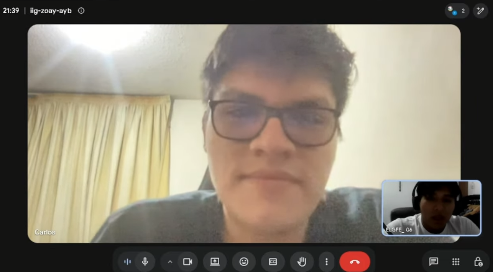
   
  <em>Figura 3. Entrevista 3: Personas que quieren aprender | Innovify. Nota: En esta figura se aprecia la tercera entrevista al segmento de personas que quieren aprender.</em>

* **URL:** [Completar con URL de Microsoft Stream]
* **Inicio:** 0:00
* **Duración:** [Completar]

**Resumen descriptivo:**
Camila estudia Diseño Gráfico en Toulouse Lautrec y se encuentra en tercer ciclo. Aprendió Figma de manera autodidacta viendo tutoriales en YouTube y practicando por su cuenta, y siente que tiene un nivel intermedio-avanzado en la herramienta. Sin embargo, cuando busca trabajos freelance o postula a prácticas, no tiene ninguna credencial formal que avale ese conocimiento — los cursos gratuitos de YouTube no emiten certificados y los certificados de plataformas pagadas son genéricos.

Su mayor frustración es no tener una ruta clara: no sabe exactamente qué debería aprender primero, en qué orden, y cómo saber cuándo ya domina suficientemente una habilidad para poder cobrar por ella. Usa Figma, Adobe Illustrator y Photoshop de forma cotidiana, pero se siente insegura cuando tiene que describir su nivel de dominio a un cliente o empleador potencial.

Respecto al modelo de Innovify, Camila valora especialmente la idea de la ruta de aprendizaje generada por IA: quiere que alguien le diga exactamente qué aprender, en qué orden, y cómo demostrar que lo dominó. Le parece muy útil la posibilidad de subir un certificado externo y que la plataforma le genere un miniproyecto para validarlo, porque eso le daría credibilidad real a lo que ya aprendió por su cuenta. Está dispuesta a hacer quizzes y miniproyectos si al final obtiene una credencial verificable con peso ante clientes y empleadores. Lo que más valora del perfil del mentor es que tenga proyectos reales en su portafolio, no solo títulos o años de experiencia.

---

#### Segmento objetivo #2: Personas que quieren enseñar

**Entrevista 1**
* **Nombres:** Rodrigo
* **Apellidos:** Castillo Vega
* **Edad:** 26 años
* **Distrito:** San Isidro

  
   
  <em>Figura 4. Entrevista 1: Personas que quieren enseñar | Innovify. Nota: En esta figura se aprecia la primera entrevista al segmento de personas que quieren enseñar.</em>

* **URL:** [Completar con URL de Microsoft Stream]
* **Inicio:** 0:00
* **Duración:** [Completar]

**Resumen descriptivo:**
Rodrigo estudia Ingeniería de Software en la PUCP y está en séptimo ciclo. Domina React, Node.js, PostgreSQL y arquitectura de microservicios, conocimientos que desarrolló combinando su formación universitaria con proyectos freelance y contribuciones a repositorios open source. Ha ayudado informalmente a varios compañeros de ciclos menores a entender conceptos de programación, pero siempre de forma desorganizada — por WhatsApp, sin estructura, sin que el aprendiz llegue con un nivel mínimo establecido.

Su principal frustración al enseñar es que los aprendices llegan sin los fundamentos necesarios para aprovechar la sesión, lo que hace que pierda tiempo explicando conceptos básicos que debería dar por sabidos. También le molesta la falta de reconocimiento formal: dedica tiempo de calidad a enseñar pero nadie lo sabe ni puede verificarlo.

Respecto al modelo de Innovify, Rodrigo está muy de acuerdo con el examen de ingreso para mentores, porque considera que es la única forma de garantizar que quien enseña realmente sabe. Le parece especialmente atractivo el sistema de SkillCredits, porque le permitiría demostrar en LinkedIn no solo que sabe programar sino que sabe enseñar a otros — una habilidad que los empleadores valoran y que actualmente no tiene cómo acreditar. Le parece eficiente que la plataforma le informe exactamente en qué pregunta o concepto falló el aprendiz antes de la sesión, porque eso le permite preparar una explicación quirúrgica en vez de repasar todo el tema desde cero.

**Entrevista 2**
* **Nombres:** Lucía
* **Apellidos:** Vargas Flores
* **Edad:** 28 años
* **Distrito:** Surco

  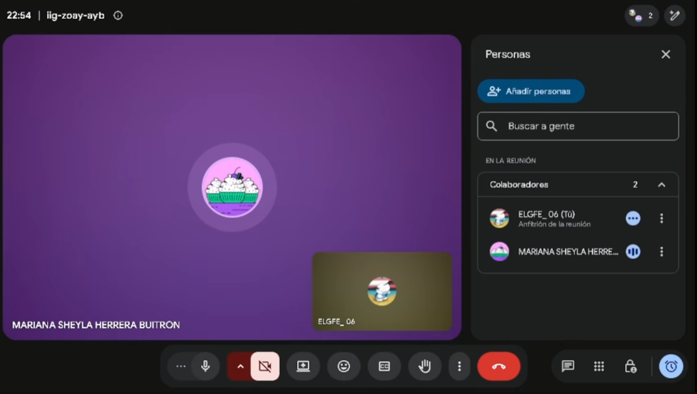
   
  <em>Figura 5. Entrevista 2: Personas que quieren enseñar | Innovify. Nota: En esta figura se aprecia la segunda entrevista al segmento de personas que quieren enseñar.</em>

* **URL:** [Completar con URL de Microsoft Stream]
* **Inicio:** 0:00
* **Duración:** [Completar]

**Resumen descriptivo:**
Lucía es egresada de Contabilidad de la Universidad de Lima y trabaja hace dos años en una firma de auditoría. Domina Excel avanzado, Power BI y análisis financiero, habilidades que desarrolló en su trabajo y que sabe que son muy demandadas en el mercado. Ha dado algunas clases particulares de forma informal a compañeros universitarios, pero el modelo le resulta poco profesional y difícil de gestionar: tiene que coordinar horarios por WhatsApp, no hay estructura, y los aprendices a veces no aparecen o no vienen preparados.

Lo que más valora de Innovify es la posibilidad de generar ingresos adicionales de forma estructurada y profesional, sin tener que gestionar ella misma la logística. El modelo de comisiones por sesión validada le parece justo y transparente. Sin embargo, lo que más la motiva es el sistema de SkillCredits: considera que demostrar que sabe enseñar Excel avanzado y Power BI a otros, con resultados verificables, es una credencial de liderazgo y comunicación que le abre puertas en su carrera profesional más allá de los ingresos extra.

Está de acuerdo con el examen de ingreso para mentores, aunque reconoce que inicialmente puede parecer una barrera alta. Considera que esa barrera es precisamente lo que garantiza que los aprendices reciban ayuda de calidad real.

**Entrevista 3**
* **Nombres:** Sebastián
* **Apellidos:** Mora Chávez
* **Edad:** 23 años
* **Distrito:** Barranco

  
   
  <em>Figura 6. Entrevista 3: Personas que quieren enseñar | Innovify. Nota: En esta figura se aprecia la tercera entrevista al segmento de personas que quieren enseñar.</em>

* **URL:** [Completar con URL de Microsoft Stream]
* **Inicio:** 0:00
* **Duración:** [Completar]

**Resumen descriptivo:**
Sebastián es egresado de Comunicaciones de la UPC y trabaja como freelance en marketing de contenidos. Domina SEO técnico, copywriting y estrategia de redes sociales, habilidades que desarrolló en proyectos reales con clientes. Intentó enseñar en Preply pero lo abandonó porque la plataforma permite que cualquiera enseñe sin verificación, lo que deteriora la calidad percibida de todos los mentores.

Su principal motivación para enseñar no es el dinero sino construir reputación profesional verificable. Sebastián entiende que en el mundo del marketing digital, el portafolio y las credenciales son todo, y actualmente no tiene ninguna forma de acreditar que sabe enseñar lo que sabe hacer.

Respecto al modelo de Innovify, valora especialmente que la plataforma exija el examen de ingreso, porque eso eleva la calidad del ecosistema completo y hace que pertenecer a él sea una credencial en sí misma. Le parece muy atractivo el sistema de SkillCredits y su integración con LinkedIn. También valora el matching inteligente, porque prefiere que le lleguen aprendices cuyo vacío específico coincide con su área de mayor dominio, en vez de recibir cualquier solicitud genérica de marketing.

---

#### Segmento objetivo #3: Coordinador Institucional

**Entrevista 1**
* **Nombres:** Armando
* **Apellidos:** Novoa
* **Edad:** 49 años
* **Distrito:** San Miguel

  
   
  <em>Figura 7. YouTube: Entrevista 1 Segmento Coordinador Institucional | Innovify. Nota: En esta figura se aprecia la primera persona entrevistada de nuestro tercer segmento: coordinador institucional.</em>

* **URL:** [https://youtu.be/YDpJ_S8Ik2g](https://youtu.be/YDpJ_S8Ik2g)
* **Inicio:** 0:00
* **Duración:** 13 minutos con 54 segundos

**Resumen descriptivo:**
Esta entrevista fue realizada a un docente de Cálculo 2 de la Universidad Peruana de Ciencias Aplicadas (UPC). De acuerdo con lo conversado, el profesor considera que la propuesta es una muy buena idea y la percibe como fundamental para el desarrollo profesional de los estudiantes. Destaca la importancia de que los alumnos colaboren e intercambien conocimientos, incluso entre diferentes universidades, con el fin de adaptarse a un mercado laboral cada vez más exigente.

Asimismo, mostró cautela en sus declaraciones para no vulnerar su contrato con la universidad, pero enfatizó que las plataformas tecnológicas tienen un gran potencial siempre que se utilicen bajo un marco de ética y respeto a las normas institucionales. Señaló que la educación en valores debe prevalecer sobre la simple restricción del uso de la tecnología.

Finalmente, evidenció interés en la funcionalidad operativa de la propuesta, sugiriendo que la validación y el acceso a la información se gestionen por niveles académicos, con el objetivo de asegurar que el contenido sea adecuado y pertinente para cada etapa del estudiante.

**Entrevista 2**
* **Nombres:** Jesús
* **Apellidos:** Hernández
* **Edad:** 29 años
* **Distrito:** Cercado de Lima

  
   
  <em>Figura 8. YouTube: Entrevista 2 Segmento Coordinador Institucional | Innovify. Nota: En esta figura se aprecia la segunda persona entrevistada de nuestro tercer segmento: coordinador institucional.</em>

* **URL Parte 1:** [https://youtu.be/oRoAbwVAjxI](https://youtu.be/oRoAbwVAjxI) | **Inicio:** 0:00 | **Duración:** 10m 12s
* **URL Parte 2:** [https://youtu.be/tWd_sJHLAak](https://youtu.be/tWd_sJHLAak) | **Inicio:** 0:00 | **Duración:** 11m 50s

**Resumen descriptivo:**
Jesús Hernández, jefe de prácticas, señala que los principales desafíos de los alumnos son la gestión del tiempo, el acceso a información confiable y la dificultad en el trabajo en equipo. Sobre una plataforma interuniversitaria, considera esencial la verificación de alumnos, políticas claras de integridad académica y un sistema de trazabilidad. Destacó que la universidad se preocupa por evitar plagio, fraude académico y suplantación de identidad. Advirtió que la implementación de una plataforma con validación manual podría generar carga laboral y costos, sugiriendo procesos automatizados como reconocimiento facial. Propuso que el panel del coordinador permita buscar y aprobar alumnos fácilmente, acceder a su historial y monitorear interacciones para asegurar una participación segura.

**Entrevista 3**
* **Nombres:** Raúl
* **Apellidos:** Pardo
* **Edad:** 34 años
* **Distrito:** San Borja

  
   
  <em>Figura 9. YouTube: Entrevista 3 Segmento Coordinador Institucional | Innovify. Nota: En esta figura se aprecia la tercera persona entrevistada de nuestro tercer segmento coordinador institucional.</em>

* **URL:** [https://youtu.be/cP_YiYr2VD8](https://youtu.be/cP_YiYr2VD8)
* **Inicio:** 0:00
* **Duración:** 10 minutos con 40 segundos

**Resumen descriptivo:**
El profesor Raúl Pardo, docente en la Universidad de Lima, considera una muy buena idea y parte fundamental del estudio universitario que los alumnos compartan opiniones y se ayuden mutuamente. Destacó que las herramientas tecnológicas son productivas para la colaboración siempre que se les dé un buen uso, priorizando el aprendizaje sobre ventajas deshonestas. También mostró cierta preocupación por la carga de los alumnos tutores, ya que siente que brindar ayuda constante podría impactar negativamente en su propio tiempo y productividad, especialmente en alumnos con muchas responsabilidades académicas.

---

### 2.2.3. Análisis de entrevistas

#### Segmento objetivo #1: Personas que quieren aprender

**1. Características objetivas**
* **Edad:** Estudiantes universitarios o egresados recientes, generalmente entre 19 y 24 años (100%).
* **Carrera:** Diversas carreras universitarias (Ingeniería de Sistemas, Administración, Diseño Gráfico) (100%).
* **Etapa:** Desde tercer ciclo hasta egresados recientes buscando su primera práctica o empleo (100%).
* **Experiencia con plataformas:**
  * Uso de plataformas de cursos online (Coursera, Udemy, YouTube) (100%).
  * Uso de herramientas de IA como ChatGPT para resolver dudas (100%).
  * Poca o nula experiencia con mentorías estructuradas y verificadas (100%).

**2. Características subjetivas**
* **Frustración con los certificados actuales:**
  * Sienten que los certificados online no reflejan su dominio práctico real (100%).
  * Han enfrentado situaciones donde no pudieron aplicar lo que "aprendieron" en entrevistas técnicas o proyectos reales (100%).
  * No saben con certeza si están aprendiendo bien o solo memorizando (66%).
* **Dificultades para conseguir ayuda específica:**
  * No saben a quién recurrir cuando se bloquean en un sub-tema específico (100%).
  * Los recursos actuales (foros, ChatGPT) dan respuestas genéricas que no aplican a su situación exacta (66%).
  * Sus pares están en la misma situación y no pueden darles orientación de nivel superior (33%).
* **Valoración del modelo de validación práctica:**
  * Están dispuestos a pagar una suscripción mensual si garantiza evaluaciones prácticas y mentores verificados (100%).
  * Prefieren una credencial que muestre qué habilidades demostraron sobre un certificado estándar (100%).
  * Valoran el modelo de examen de ingreso para mentores como garantía de calidad (100%).
* **Preferencias sobre el mentor:**
  * Priorizan que el mentor tenga experiencia real en su área (proyectos, empresas) sobre la cantidad de reseñas (100%).
  * Prefieren una sesión de refuerzo quirúrgica enfocada en el sub-tema donde fallaron, no repetir el curso (100%).
  * Valoran ver portafolio de proyectos reales del mentor antes de contactarlo (66%).

| Característica | % Entrevistados | Fuente / Frase de entrevista |
| :--- | :--- | :--- |
| Frustración por brecha certificado vs. dominio real | 100% | "Tenía el certificado pero en la entrevista técnica me bloqueé." |
| Disposición a pagar suscripción mensual | 100% | "Pagaría si eso me garantiza mentores reales y evaluaciones prácticas." |
| Preferencia por credencial verificable sobre certificado estándar | 100% | "Eso tendría más peso ante un empleador que un PDF de Coursera." |
| Valoración del examen de ingreso para mentores | 100% | "Eso me daría confianza de que realmente sabe lo que enseña." |
| Preferencia por refuerzo quirúrgico (sub-tema específico) | 100% | "No quiero repasar todo el curso, solo donde fallé." |
| Uso de ChatGPT como apoyo de aprendizaje | 100% | "Lo uso para redactar y resolver dudas, pero no sé si está bien." |
| Prioriza experiencia real del mentor sobre reseñas | 100% | "Prefiero que haya trabajado en mi área aunque tenga menos reseñas." |
| Necesidad de ruta estructurada de aprendizaje | 66% | "Quiero que alguien me diga qué aprender, en qué orden." |
| Inseguridad al aplicar lo aprendido en práctica real | 66% | "Aprendí Python pero no sé si lo que hago está bien o funciona de casualidad." |

*(Tabla 4. Principales hallazgos de entrevistas a personas que quieren aprender - Elaboración propia. Nota: La tabla resume los comportamientos, percepciones y preferencias identificadas en las entrevistas al segmento aprendiz.)*

---

#### Segmento objetivo #2: Personas que quieren enseñar

**1. Características objetivas**
* **Edad:** Estudiantes avanzados o egresados recientes, entre 23 y 28 años (100%).
* **Carrera:** Diversas áreas (Ingeniería de Software, Contabilidad, Comunicaciones) (100%).
* **Experiencia:** Todos tienen experiencia enseñando de forma informal (por WhatsApp, grupos de estudio, clases particulares no estructuradas) (100%).
* **Habilidades digitales:** Usan WhatsApp, Zoom y Drive como principales herramientas para enseñar a distancia (100%).

**2. Características subjetivas**
* **Motivaciones para enseñar:**
  * Reconocimiento profesional verificable (SkillCredits en LinkedIn) como incentivo principal (100%).
  * Generar ingresos adicionales de forma estructurada y transparente (100%).
  * Pertenecer a un ecosistema riguroso que eleve su estatus profesional (100%).
* **Frustraciones con el modelo informal actual:**
  * Falta de estructura y reconocimiento formal por la labor docente (100%).
  * Recibir aprendices sin el nivel mínimo necesario, lo que hace las sesiones ineficientes (100%).
  * Dificultad para gestionar logística (horarios, herramientas, pagos) sin una plataforma dedicada (66%).
* **Valoración del modelo de Innovify:**
  * De acuerdo con el examen de ingreso para mentores como garantía de calidad del ecosistema (100%).
  * Valoran recibir información precisa sobre el error específico del aprendiz antes de la sesión (100%).
  * Consideran que el matching inteligente por especialidad es más eficiente que recibir solicitudes genéricas (100%).
* **Perfil de enseñanza:**
  * Adaptan su forma de explicar según el nivel del aprendiz (100%).
  * Prefieren sesiones estructuradas con un objetivo claro y definido de antemano (66%).
  * Valoran la supervisión de proyectos avanzados además de las sesiones de refuerzo (33%).

| Característica | % Entrevistados | Fuente / Frase de entrevista |
| :--- | :--- | :--- |
| Motivación principal: reconocimiento profesional (SkillCredits) | 100% | "Lo que más me atrae es poder demostrar en LinkedIn que sé enseñar, no solo que sé hacer." |
| Experiencia enseñando informalmente | 100% | "He ayudado a compañeros pero todo por WhatsApp, sin estructura ni reconocimiento." |
| Acuerdo con examen de ingreso para mentores | 100% | "Eso es lo que le da valor al ecosistema, que no cualquiera puede entrar." |
| Frustración por aprendices sin nivel mínimo | 100% | "Pierdo tiempo explicando fundamentos que deberían ya saber." |
| Valoración del matching inteligente por especialidad | 100% | "Prefiero que me lleguen los casos que encajan exactamente con lo que domino." |
| Valoración de información previa sobre error del aprendiz | 100% | "Si sé en qué falló puedo preparar algo quirúrgico, no repasar todo." |
| Motivación económica (comisiones) | 100% | "Las comisiones están bien, pero no es mi principal motivación." |
| Frustración por falta de reconocimiento formal | 100% | "Nadie sabe que enseño bien porque no hay forma de demostrarlo." |
| Preferencia por sesiones con objetivo claro definido | 66% | "Quiero saber de qué va la sesión antes de aceptarla." |
| Interés en supervisar proyectos avanzados | 33% | "Me interesaría supervisar proyectos finales, no solo refuerzos puntuales." |

*(Tabla 5. Principales hallazgos de entrevistas a personas que quieren enseñar - Elaboración propia. Nota: La tabla sintetiza las motivaciones, frustraciones y necesidades expresadas por los mentores entrevistados.)*

---

#### Segmento objetivo #3: Coordinador Institucional

**1. Características objetivas**
* **Edad y rol:**
  * Profesionales entre 29 y 53 años (100%).
  * Docentes, coordinadores o jefes de práctica (100%).
* **Ámbito laboral:**
  * Universidades (100%).
* **Responsabilidades:**
  * Supervisión del aprendizaje (100%).
  * Garantizar integridad académica (100%).
  * Evaluación del desempeño (100%).
* **Relación con tecnología:**
  * Uso de herramientas digitales educativas (100%).
  * Sistemas de control académico (100%).

**2. Características subjetivas**
* **Percepción del aprendizaje colaborativo:**
  * Considerado fundamental (100%).
  * Positiva colaboración interuniversitaria (100%).
  * Mejora la preparación profesional (66%).
* **Preocupaciones:**
  * Plagio, fraude y suplantación (100%).
  * Uso indebido de tecnología (100%).
  * Información poco confiable (100%).
  * Riesgo reputacional (66%).
* **Barreras:**
  * Validación de estudiantes (100%).
  * Carga operativa (67%).
  * Costos (67%).
  * Necesidad de automatización (33%).
* **Limitaciones del estudiante:**
  * Falta de tiempo (100%).
  * Mala gestión del tiempo (100%).
  * Problemas de trabajo en equipo (66%).
* **Requisitos de la plataforma:**
  * Verificación de identidad (100%).
  * Validación académica (100%).
  * Políticas claras (100%).
  * Trazabilidad de interacciones (100%).
  * Panel de monitoreo (100%).
* **Condiciones de aceptación:**
  * Enfoque en aprendizaje (100%).
  * Marco ético claro (100%).
  * No afectar rendimiento (66%).
  * No sobrecargar usuarios (66%).

| Característica | % entrevistados | Insight clave |
| :--- | :--- | :--- |
| Aprendizaje colaborativo | 100% | Fundamental |
| Colaboración interuniversitaria | 100% | Positiva si se controla |
| Preocupación por fraude | 100% | Riesgo principal |
| Validación de identidad | 100% | Requisito crítico |
| Uso responsable de tecnología | 100% | Condición base |
| Riesgo reputacional | 66% | Preocupación relevante |
| Problemas de tiempo | 100% | Limita uso |
| Sistema de monitoreo | 100% | Necesario |
| Carga operativa | 67% | Barrera |
| Segmentación académica | 33% | Mejora pertinencia |

*(Tabla 6. Principales hallazgos de coordinadores académicos - Elaboración propia.)*

---

## 2.3. Needfinding

Para el proceso de needfinding se realizaron entrevistas a los dos segmentos principales de usuarios identificados: personas que quieren aprender (Aprendices) y personas que quieren enseñar (Mentores). El objetivo principal fue indagar en las motivaciones, frustraciones y necesidades de ambos perfiles en relación con la validación práctica de habilidades, el reconocimiento profesional y el modelo de emparejamiento inteligente propuesto por Innovify.

A través de este proceso se buscó validar las hipótesis iniciales del proyecto, como la existencia de una brecha real entre la posesión de certificados y el dominio práctico demostrable, y la disposición de ambos segmentos a participar en un ecosistema con mayor rigor y estructura que los modelos informales actuales.

### 2.3.1. User Personas

Los User Personas fueron construidos a partir de los patrones identificados en las entrevistas realizadas a ambos segmentos. Cada arquetipo refleja las características demográficas, motivaciones, frustraciones y objetivos más representativos de su segmento, sirviendo como referencia central para las decisiones de diseño y desarrollo de la plataforma.

**User Persona: Personas que quieren aprender**

  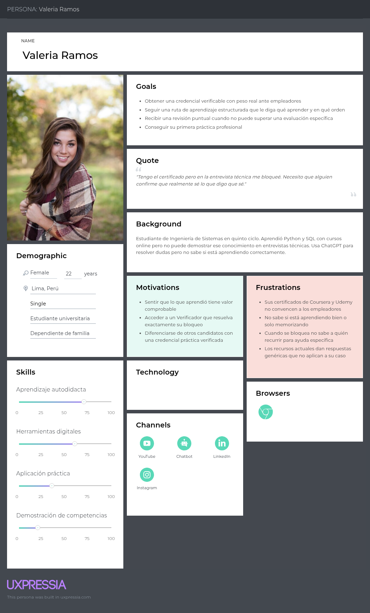
   
  <em>Figura 7. User Persona - Personas que quieren aprender - Elaboración propia.</em>

El arquetipo de Andrea Salinas representa al segmento de aprendices: estudiante universitaria de Ingeniería de Sistemas, 21 años, con certificados online que no puede convertir en evidencia creíble de dominio práctico. Sus objetivos son demostrar habilidades reales ante empleadores, seguir una ruta de aprendizaje estructurada y recibir refuerzo quirúrgico cuando se bloquea. Sus principales frustraciones son la brecha entre el certificado y el dominio real, no saber si está aprendiendo bien y la dificultad de encontrar mentores confiables en áreas específicas.
  

**User Persona: Personas que quieren enseñar**

  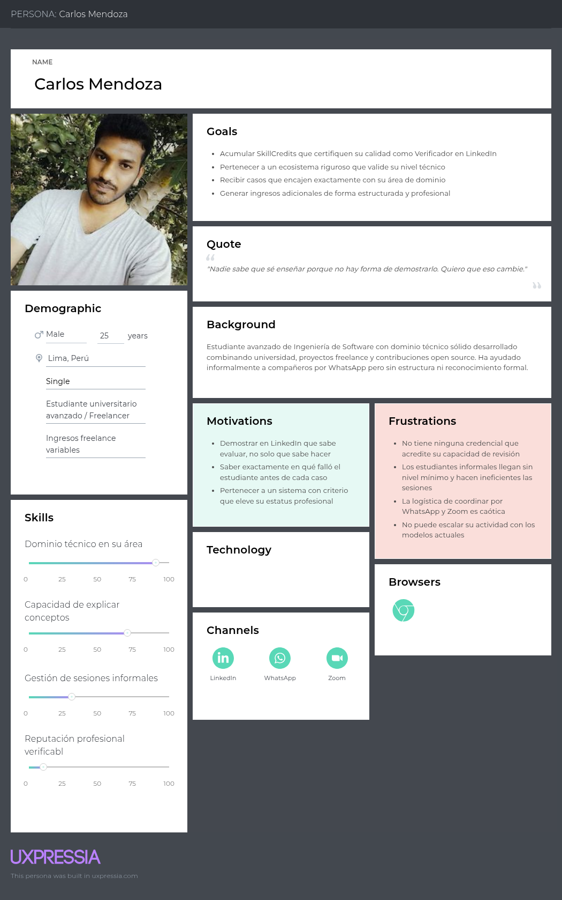
   
  <em>Figura 8. User Persona - Personas que quieren enseñar - Elaboración propia.</em>

El arquetipo de Rodrigo Castillo representa al segmento de mentores: estudiante avanzado de Ingeniería de Software, 26 años, con dominio técnico sólido y experiencia informal de enseñanza sin reconocimiento formal. Sus objetivos son construir una reputación profesional verificable mediante SkillCredits, generar ingresos adicionales de forma estructurada y pertenecer a un ecosistema riguroso que valide su calidad como docente. Sus principales frustraciones son la falta de estructura en los modelos informales, recibir aprendices sin nivel mínimo y no tener credenciales que acrediten su capacidad de enseñar.
  

**User Persona: Coordinador Institucional**

  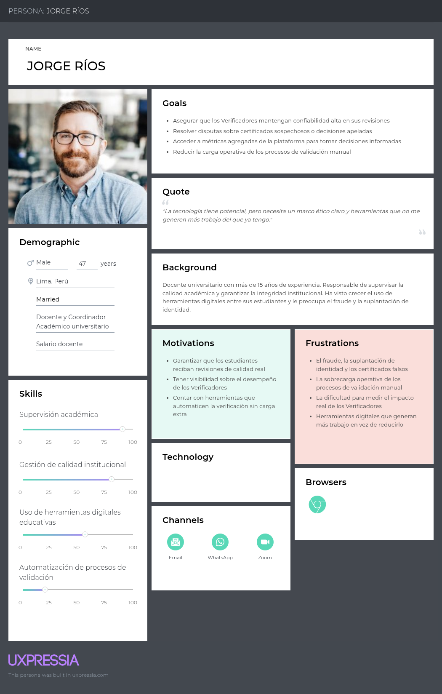
   
  <em>Figura 9. User Persona - Coordinador Institucional - Elaboración propia.</em>

El arquetipo de Renato López representa al segmento de coordinadores institucionales: docente y coordinador académico de 46 años, responsable de supervisar la calidad del aprendizaje y garantizar la integridad institucional. Sus objetivos son asegurar que los mentores cumplan los estándares establecidos, monitorear la satisfacción de los aprendices y acceder a métricas agregadas de la plataforma para tomar decisiones informadas. Sus principales preocupaciones son el fraude, la suplantación de identidad, la carga operativa de los procesos de validación manual y el riesgo reputacional para la institución.
  

**En conjunto**, los arquetipos de usuario presentados permiten comprender de manera clara las necesidades, motivaciones y desafíos de los tres actores principales del ecosistema Innovify. El perfil del aprendiz orienta el diseño hacia rutas de aprendizaje estructuradas, evaluaciones prácticas y acceso a refuerzo quirúrgico cuando se produce un bloqueo específico. El perfil del mentor establece los lineamientos necesarios para un sistema de reconocimiento profesional verificable y un modelo de onboarding riguroso que garantice la calidad del ecosistema. Por otro lado, el perfil del coordinador define los requerimientos para las herramientas de supervisión, verificación de identidad y monitoreo de calidad que garantizan la integridad del sistema. En conjunto, estos arquetipos permiten alinear el desarrollo con usuarios reales y diversos, asegurando una solución centrada en la experiencia, la eficiencia operativa y el equilibrio entre aprendizaje, enseñanza y administración.

---

### 2.3.2. User Task Matrix

En el User Task Matrix se consideran los dos segmentos principales: personas que quieren aprender y personas que quieren enseñar, evaluando sus tareas clave según frecuencia e importancia. Los aprendices priorizan buscar recursos de aprendizaje, validar su nivel real y conseguir refuerzo específico cuando se bloquean. Los mentores priorizan mantener su dominio técnico actualizado, estructurar sesiones efectivas y construir su reputación profesional. Ambos coinciden en el uso de herramientas digitales y en la necesidad de conexión con personas de nivel verificado, aunque con objetivos distintos.

---

#### Segmento objetivo #1: Personas que quieren aprender

| Tasks | Andrea Frecuencia | Andrea Importancia | Diego Frecuencia | Diego Importancia | Camila Frecuencia | Camila Importancia |
| :--- | :--- | :--- | :--- | :--- | :--- | :--- |
| Buscar recursos de aprendizaje en internet | Muy alta | Alta | Muy alta | Alta | Muy alta | Alta |
| Tomar cursos online y obtener certificados | Alta | Alta | Alta | Muy alta | Media | Alta |
| Aplicar lo aprendido en proyectos o ejercicios prácticos | Media | Muy alta | Media | Muy alta | Alta | Muy alta |
| Buscar mentores o personas con experiencia real | Media | Muy alta | Alta | Muy alta | Media | Alta |
| Prepararse para entrevistas técnicas o portfolios | Media | Muy alta | Alta | Muy alta | Media | Alta |
| Identificar exactamente en qué sub-tema está fallando | Baja | Muy alta | Baja | Muy alta | Baja | Alta |
| Validar que lo que aprendió es suficiente para el mercado | Media | Muy alta | Alta | Muy alta | Media | Muy alta |

*(Tabla 4. Tareas y prioridades de las personas que quieren aprender - Elaboración propia.)*

---

#### Segmento objetivo #2: Personas que quieren enseñar

| Tasks | Rodrigo Frecuencia | Rodrigo Importancia | Lucía Frecuencia | Lucía Importancia | Sebastián Frecuencia | Sebastián Importancia |
| :--- | :--- | :--- | :--- | :--- | :--- | :--- |
| Mantener y actualizar el dominio técnico propio | Muy alta | Muy alta | Alta | Muy alta | Muy alta | Muy alta |
| Preparar material o explicaciones para enseñar | Media | Alta | Media | Alta | Media | Alta |
| Enseñar o ayudar a alguien a distancia | Media | Alta | Baja | Alta | Media | Alta |
| Gestionar logística de sesiones (horarios, herramientas) | Media | Media | Media | Alta | Media | Media |
| Construir reputación profesional verificable | Baja | Muy alta | Media | Muy alta | Alta | Muy alta |
| Generar ingresos adicionales por enseñar | Baja | Alta | Alta | Muy alta | Media | Alta |
| Identificar el vacío específico del aprendiz antes de la sesión | Baja | Muy alta | Baja | Alta | Baja | Alta |

*(Tabla 5. Tareas y motivaciones de las personas que quieren enseñar - Elaboración propia.)*

---

#### Segmento objetivo #3: Coordinador Institucional

| Tasks | Armando Frecuencia | Armando Importancia | Jesús Frecuencia | Jesús Importancia | Raúl Frecuencia | Raúl Importancia |
| :--- | :--- | :--- | :--- | :--- | :--- | :--- |
| Guiar a estudiantes en la aplicación práctica de conceptos mediante casos y simulaciones | Muy alta | Muy alta | Muy alta | Muy alta | Alta | Muy alta |
| Enseñar a gestionar el tiempo y organizarse eficientemente | Media | Alta | Muy alta | Alta | Media-Alta | Alta |
| Fomentar el trabajo en equipo y habilidades de comunicación | Media | Alta | Alta | Alta | Alta | Alta |
| Garantizar acceso a información confiable y enseñar a evaluarla críticamente | Media | Muy alta | Alta | Muy alta | Media | Alta |
| Verificar alumnos y asegurar integridad académica en la plataforma | Baja-Media | Alta | Media | Alta | Alta | Alta |
| Implementar herramientas digitales y plazos que faciliten la organización | Media | Alta | Alta | Alta | Alta | Muy alta |

*(Tabla 6. Funciones y prioridades de los coordinadores académicos - Elaboración propia.)*

---

### Conclusión

Las tareas más frecuentes e importantes son:

* **Aprendices:** Buscar recursos de aprendizaje y aplicar lo aprendido en proyectos prácticos son las más frecuentes. Identificar exactamente en qué sub-tema están fallando y validar que lo aprendido es suficiente para el mercado son las más importantes aunque poco frecuentes, porque actualmente no tienen herramientas para hacerlo.
* **Mentores:** Mantener el dominio técnico propio es la tarea más frecuente e importante. Construir reputación profesional verificable es altamente importante pero actualmente poco frecuente porque no existe un mecanismo para hacerlo.
* **Coordinadores:** Guiar mediante casos prácticos y verificar la integridad académica son las tareas más frecuentes e importantes. Todas coinciden en requerir herramientas digitales que reduzcan la carga operativa y automaticen los procesos de validación.

Todos los segmentos coinciden en el uso intensivo de herramientas digitales y en la necesidad de conexión con personas de nivel verificado, aunque cada grupo lo aplica desde roles distintos del mismo ecosistema.

---

### 2.3.3. User Journey Mapping

En esta sección se presentan los User Journey Maps As-Is de cada User Persona, mostrando el recorrido completo (end-to-end) de los usuarios en la situación actual, sin intervención de la solución de Innovify, lo que incluye procesos, puntos de dolor y oportunidades.

* **Segmento 1: Personas que quieren aprender.** Inicia con la decisión de aprender una habilidad específica, continúa con la búsqueda y toma de cursos online, la obtención de un certificado que no puede convertir en evidencia práctica, el bloqueo en sub-temas específicos sin saber a quién recurrir, y culmina con la frustración de no poder demostrar el dominio real ante empleadores o clientes.

* **Segmento 2: Personas que quieren enseñar.** Comienza con la motivación de compartir su dominio técnico y generar ingresos o reconocimiento, pero enfrenta la falta de estructura en los modelos informales, la dificultad para llegar a aprendices con nivel mínimo adecuado, la ausencia de reconocimiento formal por su labor y la imposibilidad de acreditar su capacidad docente de forma verificable.

* **Segmento 3: Coordinadores Institucionales.** Inician su recorrido al identificar la necesidad de mantener la calidad académica y fomentar la colaboración. Continúan con la planeación y preparación de estrategias, pero enfrentan complejidades al anticipar errores operativos. Durante la implementación y coordinación, sufren de sobrecarga operativa y riesgos de plagio o fraude, para finalmente en la etapa de supervisión y evaluación, lidiar con limitaciones operativas y la dificultad de medir el impacto real de sus esfuerzos.

#### Segmento #1: Personas que quieren aprender

  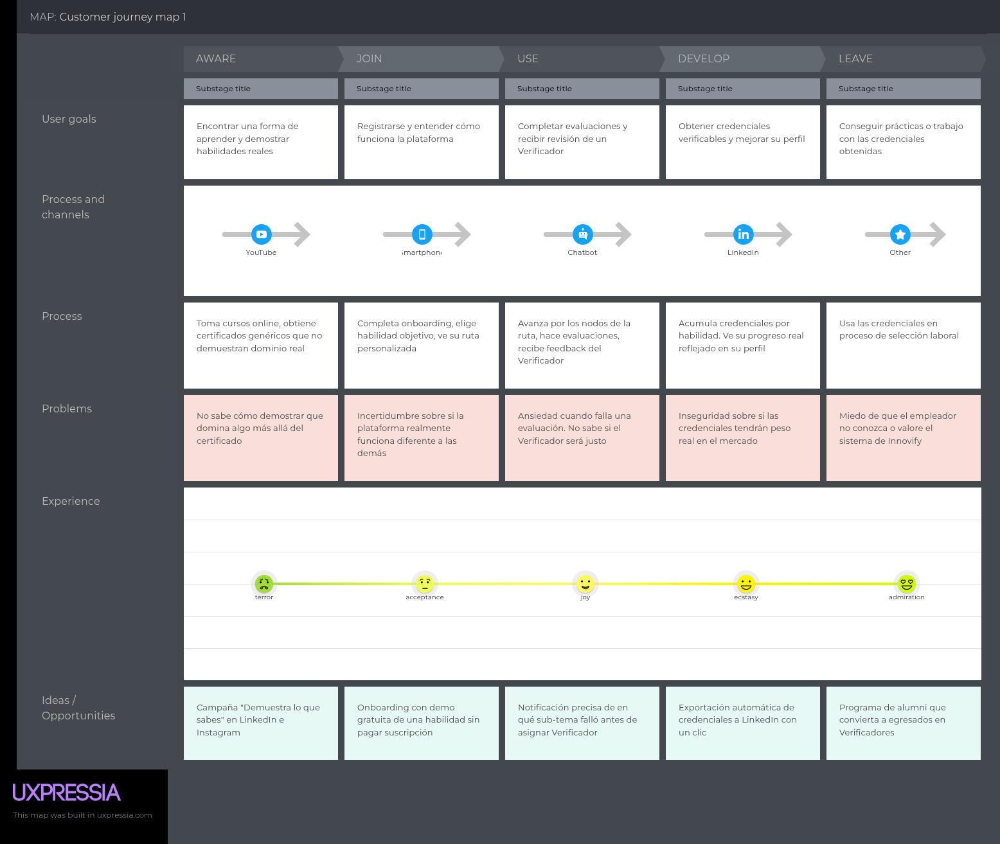
   
  <em>Figura 9. User Journey Mapping – Personas que quieren aprender - Elaboración propia. Nota: En esta figura se aprecia el Journey Mapping del primer segmento del nuevo proyecto Innovify.</em>

 

En esta figura se observa el recorrido del aprendiz a través de cinco etapas críticas: decisión de aprender, búsqueda de recursos, obtención del certificado, bloqueo en la práctica real y búsqueda de ayuda. El diagrama detalla la curva emocional del usuario, identificando puntos de dolor como la incertidumbre sobre si está aprendiendo correctamente, la frustración al no poder demostrar el dominio en situaciones reales y la dificultad para encontrar un mentor que se especialice exactamente en el sub-tema donde se bloqueó.

#### Segmento #2: Personas que quieren enseñar

  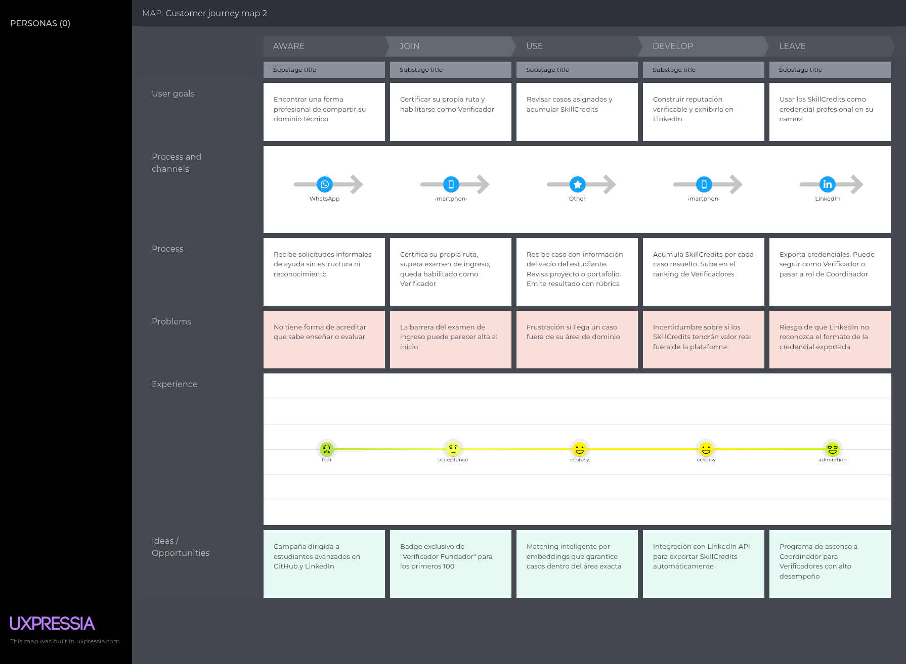
   
  <em>Figura 10. User Journey Mapping – Personas que quieren enseñar - Elaboración propia. Nota: En esta figura se aprecia el Journey Mapping del segundo segmento del nuevo proyecto Innovify.</em>

 

En esta figura se visualiza la experiencia desde la perspectiva del mentor. El mapa describe el proceso desde la motivación inicial de enseñar, pasando por la búsqueda de aprendices a través de canales informales, la gestión desorganizada de las sesiones, la frustración por recibir aprendices sin nivel mínimo, hasta la ausencia total de reconocimiento formal o credencial verificable que acredite su labor docente.

 

#### Segmento #3: Coordinador Institucional

  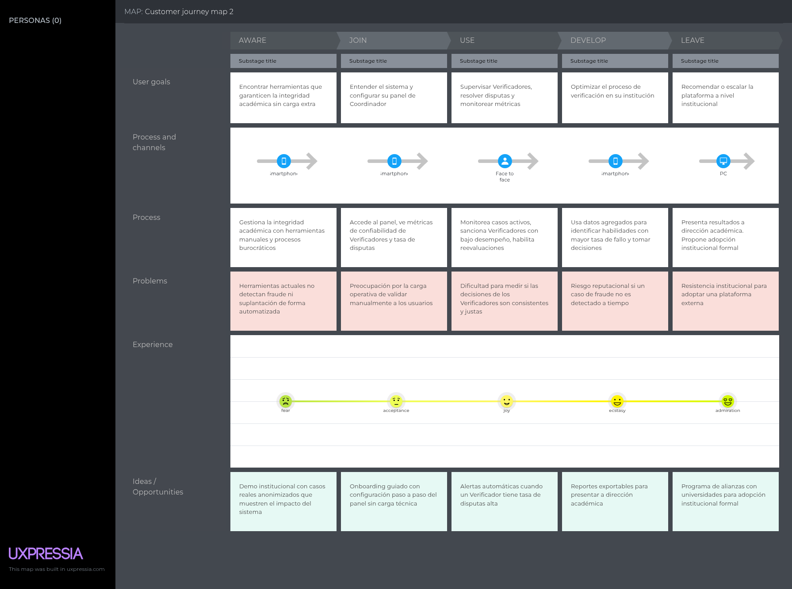
   
  <em>Figura 11. User Journey Mapping - Coordinador Institucional - Elaboración propia. Nota: En esta figura se aprecia el Journey Mapping del tercer segmento del nuevo proyecto Innovify.</em>

 

En esta figura se detalla el flujo de gestión desde el ángulo administrativo y de calidad académica. El mapa abarca la planeación, implementación y supervisión de la plataforma, poniendo énfasis en la mitigación de riesgos operativos como el plagio, el fraude y la suplantación de identidad. Se identifican puntos de dolor como la sobrecarga operativa de los procesos de validación manual, la dificultad para medir el impacto real de los mentores y la ausencia de herramientas tecnológicas que automaticen la verificación de identidad y el monitoreo de interacciones.

 

**Entonces**, los mapas de experiencia presentados permiten comprender de manera integral cómo interactúan los distintos actores con el ecosistema de aprendizaje y validación de habilidades en la situación actual. Desde la perspectiva del aprendiz, el recorrido está marcado por una inversión constante de tiempo y dinero en certificaciones que no generan evidencia creíble de competencia práctica, con bloqueos específicos que no tiene cómo resolver de forma dirigida. Desde el lado del mentor, la experiencia actual es desorganizada, sin estructura y sin ningún mecanismo de reconocimiento formal, lo que desincentiva a los mejores talentos de enseñar de forma sistemática. Finalmente, la visión del coordinador incorpora una capa de control y supervisión orientada a garantizar la calidad académica y la seguridad del sistema, abordando riesgos como el fraude o la suplantación mediante mecanismos de validación y paneles de monitoreo. En conjunto, estas perspectivas permiten diseñar una experiencia equilibrada, eficiente y segura para todos los participantes del ecosistema.

---

### 2.3.4. Empathy Mapping

Para profundizar en el entendimiento de los usuarios finales y diseñar una solución que responda a sus necesidades reales, se desarrollaron mapas de empatía para cada segmento identificado. Esta herramienta permite visualizar el entorno, las percepciones y las motivaciones de los actores clave, facilitando la identificación de puntos críticos y oportunidades de valor dentro del ecosistema de Innovify.

#### Segmento #1: Personas que quieren aprender

  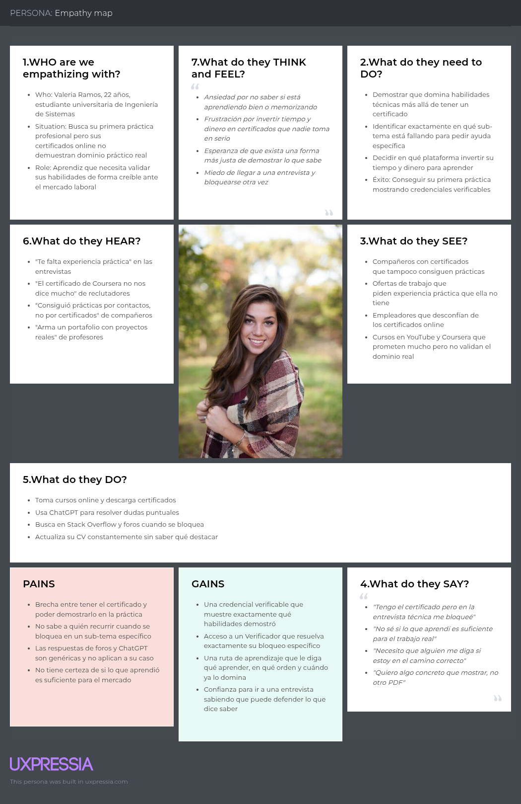
   
  <em>Figura 11. Empathy Mapping - Personas que quieren aprender - Elaboración propia. Nota: En esta figura se aprecia el Empathy Mapping del primer segmento del nuevo proyecto Innovify.</em>

 

Se observa el mapa de empatía de Andrea, estudiante universitaria que representa al segmento de aprendices. El diagrama detalla su necesidad de demostrar habilidades prácticas reales ante un mercado laboral que exige competencias verificables, no solo certificados. Sus principales puntos de dolor son la ansiedad por no saber si lo que aprendió es suficiente, la frustración de tener certificados que nadie toma en serio y la incapacidad de identificar exactamente en qué sub-tema está fallando para pedir ayuda específica. Sus ganancias esperadas son una credencial verificable con peso real ante empleadores y acceso a un mentor que resuelva exactamente el bloqueo que tiene, sin tener que repasar todo el curso desde cero.

#### Segmento #2: Personas que quieren enseñar

  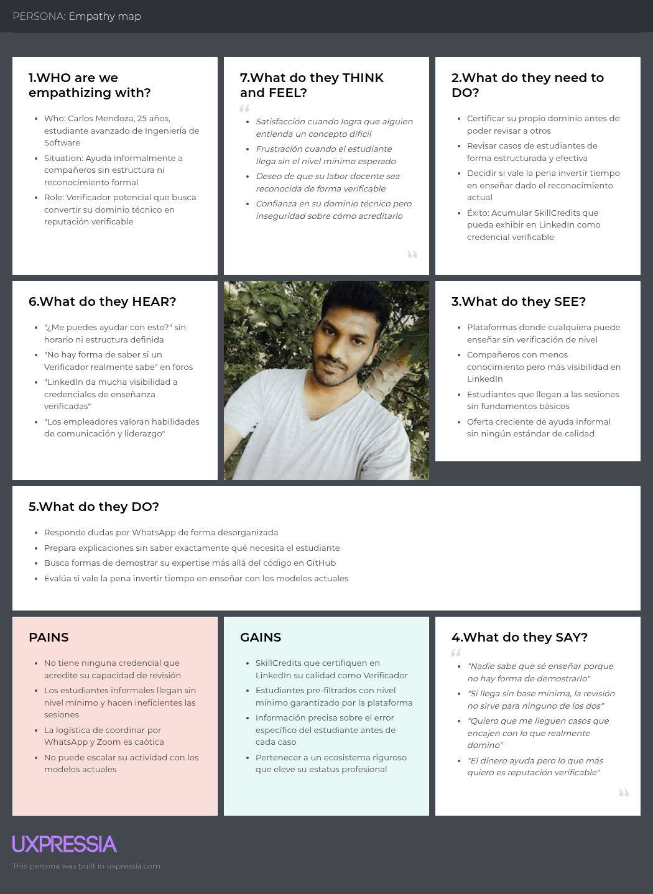
   
  <em>Figura 12. Empathy Mapping - Personas que quieren enseñar - Elaboración propia. Nota: En esta figura se aprecia el Empathy Mapping del segundo segmento del nuevo proyecto Innovify.</em>

 

En esta figura se detalla el mapa de empatía orientado al mentor. El análisis subraya su deseo de convertir su dominio técnico en reconocimiento profesional verificable y en ingresos adicionales estructurados. Sus principales puntos de dolor son la falta de un mecanismo formal que acredite su capacidad docente, la desorganización de los modelos informales actuales y la frustración de recibir aprendices sin nivel mínimo que hace que las sesiones sean ineficientes. Sus ganancias esperadas son pertenecer a un ecosistema riguroso que eleve su estatus profesional, acumular SkillCredits que pueda exhibir en LinkedIn y recibir información precisa sobre el vacío del aprendiz antes de cada sesión para prepararse mejor.

 

#### Segmento #3: Coordinador Institucional

  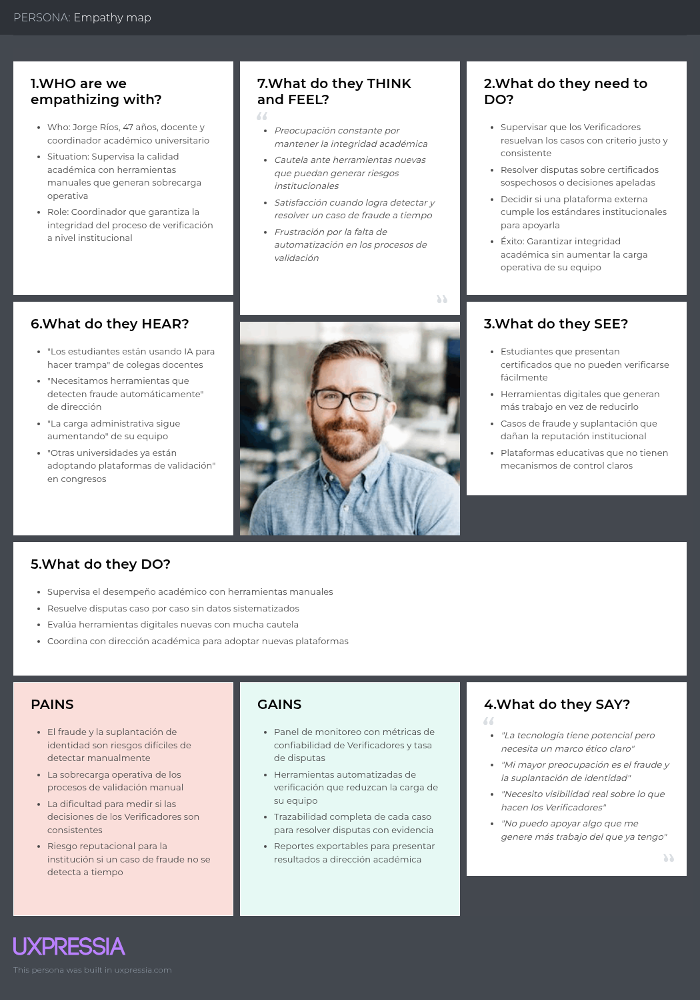
   
  <em>Figura 13. Empathy Mapping - Coordinador Institucional - Elaboración propia. Nota: En esta figura se aprecia el Empathy Mapping del tercer segmento del nuevo proyecto Innovify.</em>

 

En la imagen se presenta la caracterización empática de Renato López, representante del segmento institucional y administrativo. El mapa resalta su preocupación por mantener la calidad académica y la integridad institucional, señalando como riesgos principales el fraude o suplantación de identidad y la sobrecarga operativa de los procesos de validación manual. Sus ganancias esperadas son el acceso a herramientas tecnológicas que agilicen la verificación de participantes, un panel de monitoreo con métricas agregadas de la plataforma y mecanismos automatizados de trazabilidad que reduzcan la carga de trabajo de su equipo.

 

**Entonces**, los mapas de empatía permiten profundizar en las necesidades emocionales, motivaciones y dificultades de los tres actores principales del ecosistema Innovify. En el caso del aprendiz, se evidencia una motivación fuerte orientada a la empleabilidad y al reconocimiento real de sus capacidades, enfrentando frustraciones relacionadas con la superficialidad del modelo de certificación actual y la dificultad de encontrar ayuda específica cuando se bloquea. Por su parte, el perfil del mentor destaca una motivación dual: económica y de reconocimiento profesional, con frustraciones relacionadas con la informalidad y la falta de estructura de los modelos actuales. Finalmente, el perfil institucional del coordinador destaca una fuerte preocupación por la calidad académica y la seguridad del sistema, priorizando la prevención de riesgos como el fraude y la suplantación, y valorando el uso de herramientas tecnológicas que optimicen los procesos de validación y reduzcan la carga operativa. En conjunto, estos mapas evidencian la importancia de diseñar una plataforma equilibrada que atienda tanto aspectos funcionales como emocionales, asegurando confianza, eficiencia y valor para todos los usuarios del ecosistema.

---

## 2.4. Requirements specification

### 2.4.1. User Stories
*(Nota: Adaptar la tabla de User Stories previa para incluir los requisitos del curso: persistencia local, acceso a hardware, consumo de API propia y SDK externo).*

**Ejemplos de User Stories clave para el entorno móvil:**
*   **US_Mobile01 (Permisos de Dispositivo):** *As a user, I want the app to request camera and microphone permissions before joining a session, so that I can securely broadcast my video and audio during the live tutoring.*
*   **US_Mobile02 (Almacenamiento Local):** *As a Learner, I want the app to locally store my search preferences and recent chat history using SQLite/Room/CoreData, so that the app loads faster and I can review messages even with a poor internet connection.*
*   **US_Mobile03 (Consumo SDK Externo):** *As a Tutor, I want to initiate a live video call directly within the app using an integrated third-party SDK (e.g., Agora or Jitsi), so that I don't have to share external links with the learner.*
*   **Spike Story (Investigación):** *Investigate and prototype the integration of the external Video SDK into the native mobile architecture, evaluating performance, battery consumption, and necessary device permissions.*

### 2.4.2. Impact Mapping
*(Nota: Insertar los diagramas de Impact Mapping conectando los Business Goals con los User Personas y las funcionalidades móviles).*

### 2.4.3. Product Backlog
*(Nota: Insertar la tabla del Product Backlog priorizado, estimando los Story Points de las historias adaptadas al desarrollo móvil).*

## 2.5. Strategic-Level Domain-Driven Design

### 2.5.1. EventStorming
*(Nota: Documentar las fases de Candidate Context Discovery y Domain Message Flows Modeling realizadas por el equipo).*

### 2.5.2. Context Mapping

El Context Mapping de SkillSwap evidencia las relaciones estructurales entre los siete Bounded Contexts que conforman la solución, aplicando los patrones de relación establecidos en Domain-Driven Design para gestionar las dependencias entre equipos y modelos de dominio, bajo el nuevo enfoque de la plataforma centrado en la verificación de habilidades mediante Inteligencia Artificial.

**Identity & Access** actúa como **Upstream** de todo el sistema bajo el patrón **Conformist**: su agregado `User` expone únicamente `userId` y `role` como datos públicos, y el resto de los Bounded Contexts (Credential Verification, Learning Path Engine, Assessment & Peer Review, Reputation, Wallet & Incentives y Moderation & Disputes) se conforman a ese modelo sin negociar cambios, referenciando el identificador de usuario como un dato externo dentro de su propio esquema de persistencia. Es dentro de este Bounded Context que se distingue el perfil de `Student` del perfil de `Verificador` (vinculado a un Student que ya completó su propia ruta de certificación), sin que ello implique un rol adicional a nivel de autenticación.

**Credential Verification** mantiene una relación **Customer/Supplier** hacia **Learning Path Engine**: únicamente un certificado ya validado (extraído y verificado como legítimo) puede ser consumido como evidencia de una habilidad dentro del cálculo de brechas, por lo que Learning Path Engine actúa como Downstream, consumiendo el modelo de `Certificate` validado sin poder alterar las reglas de extracción o de detección de fraude definidas en el Upstream.

**Learning Path Engine**, como núcleo de negocio (Core Domain) de la plataforma, es **Supplier** de **Assessment & Peer Review** bajo el patrón **Customer/Supplier**: cada `PathNode` de la ruta generada define la especificación de la evaluación (habilidad a demostrar, nivel de exigencia) que Assessment & Peer Review debe ejecutar como Downstream, sin negociar el contenido de dicha especificación.

**Assessment & Peer Review**, como ejecutor del flujo de evaluación y revisión humana, es **Supplier** de **Reputation** (la resolución de un `VerificationCase` —aprobado o rechazado, y quién lo revisó— dispara el recálculo de la confiabilidad del Verificador y del Employability Score del estudiante) y de **Wallet & Incentives** (la resolución de un caso por parte de un Verificador dispara la acreditación de SkillCredits), ambas bajo el patrón **Customer/Supplier**.

**Moderation & Disputes** se relaciona como **Customer/Supplier** hacia **Identity & Access** (emite órdenes de sanción sobre la cuenta de un usuario que presentó certificados fraudulentos o incurrió en una falta) y hacia **Reputation** (ajusta la reputación del usuario tras una disputa resuelta). Adicionalmente, mantiene una relación de **Anticorruption Layer (ACL)** hacia **Assessment & Peer Review**: en lugar de depender directamente del modelo interno de `VerificationCase`, Moderation & Disputes traduce la información recibida a su propio modelo simplificado de "caso en disputa", evitando acoplarse a cambios futuros en la lógica interna de asignación y revisión de Verificadores.

Finalmente, **Credential Verification** mantiene una relación de **Anticorruption Layer (ACL)** hacia el servicio externo de terceros **ML Kit** (Text Recognition / Entity Extraction de Firebase, utilizado on-device para la extracción de datos del certificado), aislando el modelo de dominio interno `Certificate` de los contratos y formatos de respuesta propios del SDK externo.

  
   
  <em>Figura XX. Context Mapping de SkillSwap - Elaboración propia. Nota: Se muestran las relaciones Conformist, Customer/Supplier y Anticorruption Layer entre los Bounded Contexts Identity & Access, Credential Verification, Learning Path Engine, Assessment & Peer Review, Reputation, Wallet & Incentives y Moderation & Disputes.</em>

### 2.5.3. Software Architecture

**Software Architecture Context Level Diagram:**
Muestra la interacción de los tres actores (Estudiante, Verificador, Profesor/Coordinador) con el sistema central de SkillSwap y los servicios externos de terceros (extracción de datos de certificados vía ML Kit, almacenamiento de evidencias y servicio de notificaciones).

**Software Architecture Container Level Diagram:**
Detalla la estructura de contenedores:
1. **Mobile Application (Native/Cross-Platform):** La interfaz principal para los tres actores, desarrollada con soporte de almacenamiento local, acceso a hardware (cámara para captura de certificados, biometría) y consumo del backend RESTful.
2. **Landing Page:** Sitio web estático para la presentación del modelo de negocio, accesible por los tres actores.
3. **API Gateway / RESTful Web Services:** El backend desarrollado internamente que orquesta la lógica de negocio de los siete Bounded Contexts.
4. **Database:** Repositorio central de información, compartido por los siete Bounded Contexts.

**Software Architecture Deployment Diagram:**
Muestra cómo la aplicación móvil se despliega en los dispositivos físicos de los usuarios (Android), el Landing Page en un servicio de hosting estático, y el backend junto con la base de datos en infraestructura Cloud.

#### 2.5.3.1. Software Architecture Context Level Diagrams

El diagrama de contexto (Context Diagram) bajo el enfoque C4 Model presenta al sistema SkillSwap como una caja central única, mostrando sus interacciones de alto nivel con los actores principales y los sistemas externos de terceros, sin exponer aún detalles de implementación.

El sistema es utilizado por tres actores principales: el **Estudiante**, quien sube sus certificados y demuestra sus habilidades a través de las evaluaciones generadas por la plataforma; el **Verificador** (un perfil vinculado a un Estudiante que ya completó su propia ruta de certificación), quien revisa los casos que la IA no puede resolver con suficiente confianza; y el **Profesor Universitario/Coordinador**, quien supervisa la calidad del proceso de verificación desde la aplicación móvil. Los tres actores interactúan con el sistema a través de la **aplicación móvil nativa (Android) y cross-platform (Flutter)**, así como del Landing Page.

A nivel de sistemas externos, SkillSwap se integra con: **ML Kit** (Firebase), utilizado on-device para la extracción de datos de los certificados subidos por el Estudiante (institución, curso, fecha) — esta es la tecnología que satisface el requisito de aprendizaje autónomo del curso; un **servicio de almacenamiento en la nube** para las imágenes de certificados y evidencias adjuntas a un caso de revisión; y un **servicio de correo electrónico** para el envío de notificaciones institucionales (validación de dominio `.edu.pe`, resultado de una evaluación, apertura o resolución de un caso de verificación).

  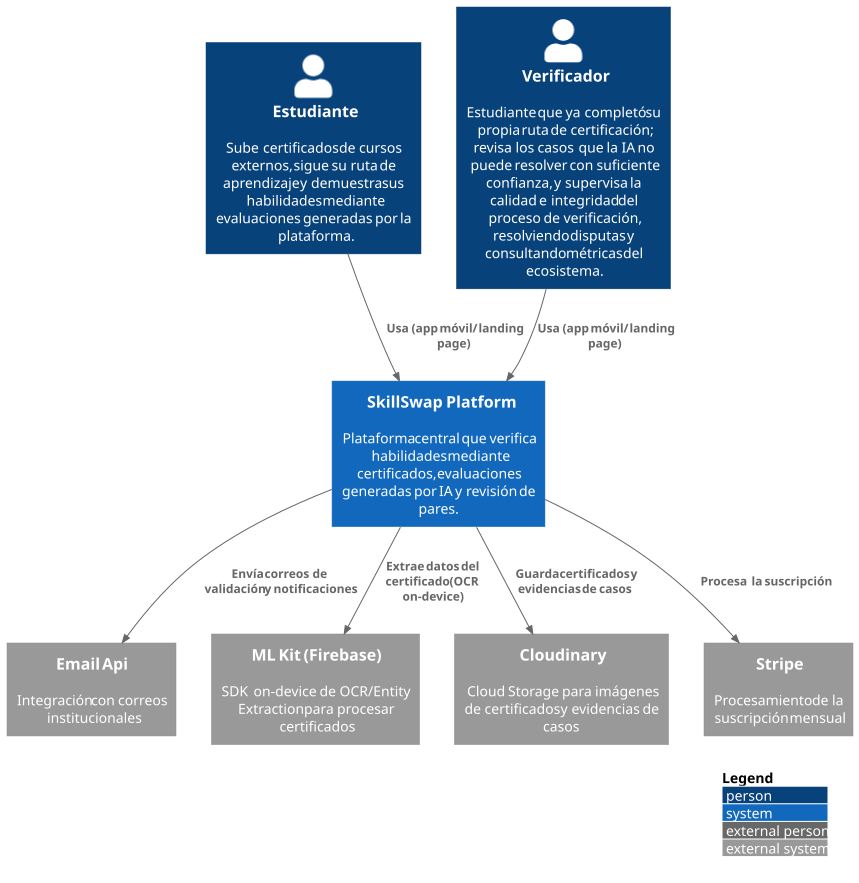
   
  <em>Figura XX. C4 Model: Context Diagram - Elaboración propia. Nota: Diagrama de contexto que muestra el sistema SkillSwap en el centro y sus interacciones directas con los actores principales (Estudiante, Verificador, Profesor/Coordinador) a través de la aplicación móvil nativa, la aplicación cross-platform y el Landing Page, así como con los sistemas externos de terceros (ML Kit, almacenamiento en la nube y servicio de correo electrónico).</em>

#### 2.5.3.2. Software Architecture Container Level Diagrams

El diagrama de contenedores (Container Diagram) descompone el sistema SkillSwap en los bloques de alto nivel que lo conforman, mostrando las principales decisiones tecnológicas y cómo se comunican entre sí. A diferencia del Context Diagram, aquí se detalla la estructura interna del sistema como un conjunto de aplicaciones y almacenes de datos desplegables de forma independiente.

Los contenedores identificados son los siguientes:

- **Landing Page (Sitio Web Estático):** Presenta el modelo de negocio de SkillSwap al público general, implementado con HTML5, CSS3 y JavaScript.
- **Android Native Application:** Aplicación móvil nativa dirigida a los tres actores (Estudiante, Verificador, Profesor/Coordinador), desarrollada en Kotlin con Jetpack Compose, que consume los Web Services RESTful del backend.
- **Cross-Platform Application (Flutter):** Aplicación móvil dirigida a Android, que replica las funcionalidades core para los tres actores, desarrollada en Flutter con Dart, consumiendo igualmente los Web Services RESTful expuestos por el backend.
- **API / RESTful Web Services:** Backend desarrollado bajo arquitectura RESTful en C# / ASP.NET Core, actuando como Published Language único para los tres clientes (Landing Page, Android Native App y Flutter App), orquestando la lógica de negocio de los siete Bounded Contexts (Identity & Access, Credential Verification, Learning Path Engine, Assessment & Peer Review, Reputation, Wallet & Incentives y Moderation & Disputes).
- **Database:** Repositorio central de persistencia (instancia única de MySQL), donde cada Bounded Context mantiene sus propias tablas siguiendo los principios de Domain-Driven Design.

Es importante resaltar que tanto la aplicación Android nativa como la aplicación Flutter cross-platform consumen el **mismo contrato de API RESTful** documentado con OpenAPI/Swagger, sin requerir endpoints adicionales ni lógica de backend duplicada, evidenciando así el desacoplamiento entre la capa de presentación y la capa de dominio/aplicación del sistema.

  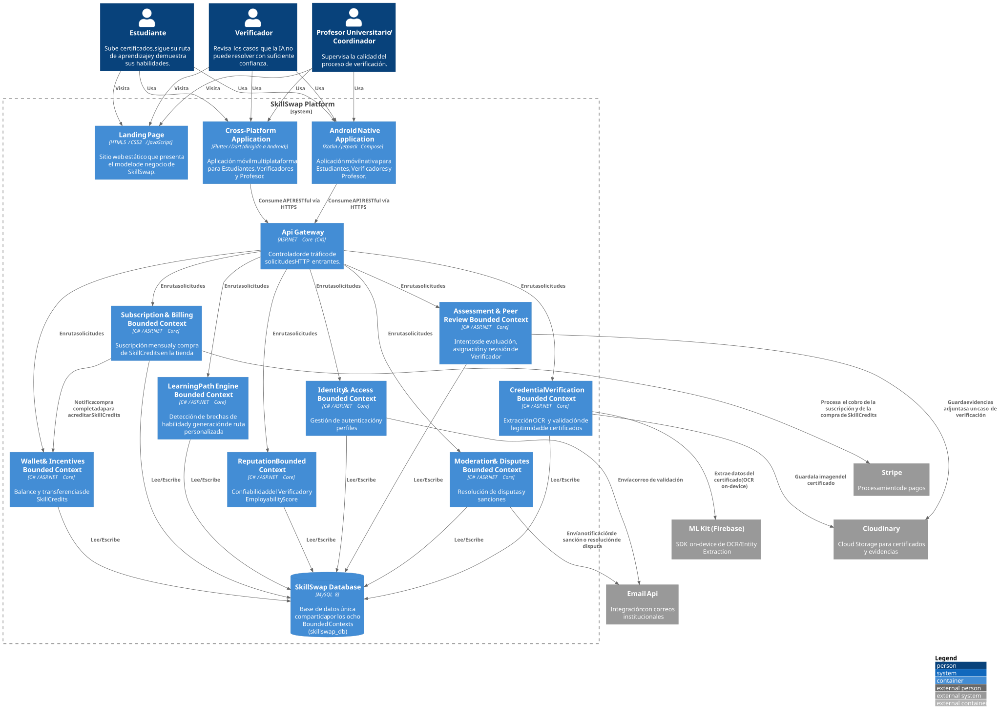
   
  <em>Figura XX. C4 Model: Container Diagram - Elaboración propia. Nota: Diagrama de contenedores que muestra el Landing Page, la Aplicación Android Nativa, la Aplicación Cross-Platform (Flutter), el backend de Web Services RESTful y la Base de Datos, junto con sus interacciones y los sistemas externos ML Kit y el servicio de almacenamiento en la nube.</em>

#### 2.5.3.3. Software Architecture Deployment Diagrams

El Deployment Diagram bajo el enfoque C4 Model muestra la distribución física de los contenedores de SkillSwap sobre la infraestructura de hardware y los entornos de ejecución, evidenciando cómo se despliega la solución en un ambiente real.

- **Dispositivos móviles de usuario final:** Los dispositivos Android de Estudiantes, Verificadores y el Profesor alojan localmente la Aplicación Android Nativa (Kotlin/Jetpack Compose) y la Aplicación Cross-Platform (Flutter, dirigida a Android), instaladas mediante distribución interna vía **Firebase App Distribution** durante el ciclo de pruebas, y descargables desde el dispositivo físico para la sustentación del curso. En estos dispositivos se ejecuta además **ML Kit** de forma on-device para la extracción de datos de los certificados, sin requerir una llamada a un servicio en la nube para dicho procesamiento.
- **Hosting estático:** Aloja el Landing Page, servido de forma estática desde un proveedor de hosting (Firebase Hosting / Vercel), accesible por los tres actores del sistema.
- **Servidor de aplicación (Cloud):** Aloja el backend de Web Services RESTful (C# / ASP.NET Core), desplegado en **Render**, donde se ejecuta la lógica de negocio de los siete Bounded Contexts a través de un único API Gateway, y se exponen los endpoints documentados con OpenAPI/Swagger, consumidos indistintamente por los tres clientes (Landing Page, Android Native App, Flutter App).
- **Servidor de base de datos (Cloud):** Aloja una única instancia administrada de MySQL desplegada en **Render**, compartida por los siete Bounded Contexts, comunicándose con el servidor de aplicación mediante una conexión segura.
- **Servicios externos en la nube:** Servicio de almacenamiento (Cloudinary) para las imágenes de certificados y evidencias adjuntas a un caso de verificación, y servicio de correo electrónico para el envío de notificaciones (validación institucional, resultados de evaluación, estado de un caso de revisión).

Cada uno de estos nodos se comunica mediante protocolos HTTPS, garantizando la seguridad en la transmisión de datos entre los dispositivos cliente (móviles y navegador) y los servidores desplegados en la nube.

  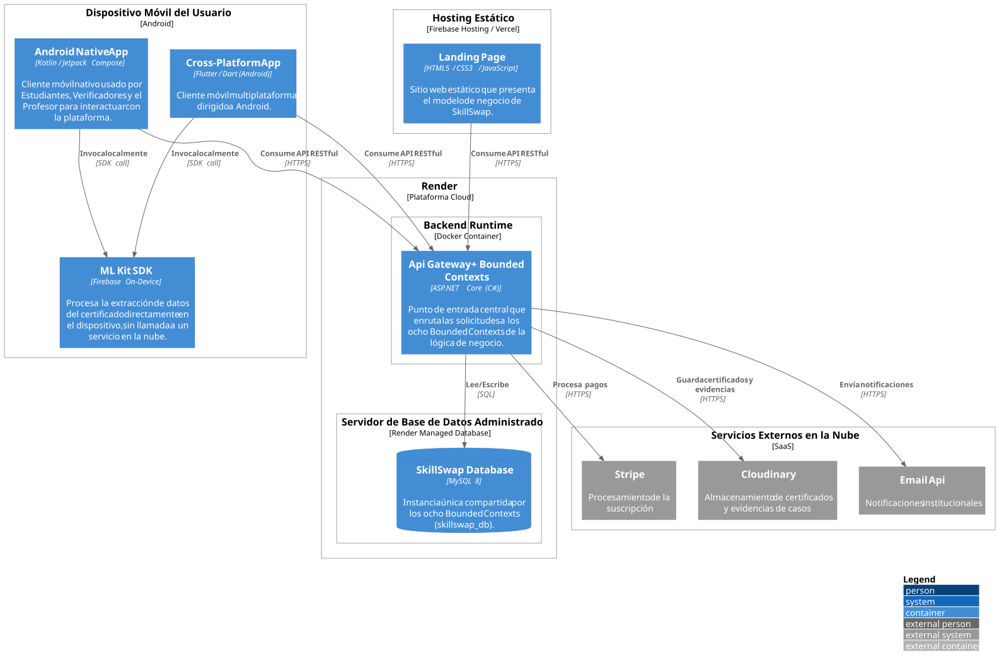
   
  <em>Figura XX. C4 Model: Deployment Diagram - Elaboración propia. Nota: Diagrama de despliegue que muestra la distribución física de la solución, incluyendo los dispositivos móviles de usuario final (Android/Flutter) con distribución vía Firebase App Distribution y ejecución on-device de ML Kit, el hosting estático del Landing Page, el servidor de aplicación en Render, la instancia única de MySQL en Render y el servicio externo de almacenamiento en la nube. Elaborado en PlantUML.</em>

## 2.6. Tactical-Level Domain-Driven Design

### 2.6.1. Bounded Context: Identity & Access

#### 2.6.1.1. Domain Layer

La capa de dominio de Identity & Access encapsula la lógica de negocio central para la gestión de identidades y seguridad, asegurando que las reglas de autenticación, autorización y verificación institucional sean independientes de las tecnologías externas.

**1. Aggregate Root: User**

Descripción: El agregado `User` actúa como la raíz del modelo y centraliza la información de la cuenta, garantizando que el registro y las credenciales se validen estrictamente antes de persistirse.

Atributos

| Atributo | Tipo | Descripción |
|---|---|---|
| id | int | Identificador único del usuario (autogenerado). |
| username | Username (VO) | Identificador de texto único utilizado para acceder al sistema. |
| email | Email (VO) | Correo electrónico validado contra el dominio institucional `.edu.pe`. |
| passwordHash | PasswordHash (VO) | Representación segura de la contraseña tras pasar por un algoritmo de encriptación. |
| role | Role (VO) | Rol de la cuenta: `Student` o `Coordinator`. |
| isVerified | boolean | Indica si la cuenta ha completado la validación institucional. |
| bio | string | Descripción libre del perfil del usuario. |
| deviceToken | DeviceToken (VO) | Identificador del dispositivo móvil, reservado para una futura integración de notificaciones — pendiente de definir el proveedor/tecnología específica. |

Métodos

- `User(username, email, password, role)` (Constructor): Inicializa las propiedades del usuario y valida que el correo pertenezca al dominio institucional antes de crear la instancia.
- `verify()`: Cambia `isVerified` a `true` una vez confirmada la validación institucional.
- `registerDeviceToken(String token)`: Asocia o actualiza el `deviceToken` del dispositivo móvil desde el cual el usuario inició sesión.

**2. Value Object: Email**

Descripción: Representa un correo electrónico validado, garantizando que solo se acepten direcciones pertenecientes a un dominio institucional autorizado.

Atributos

| Atributo | Tipo | Descripción |
|---|---|---|
| value | string | Dirección de correo electrónico completa. |

Métodos

- `Email(String value)` (Constructor): Valida el formato del correo y que su dominio corresponda a `.edu.pe`, lanzando una excepción de dominio en caso contrario.

**3. Value Object: Role**

Descripción: Enumeración que restringe los valores válidos para el rol de una cuenta.

Atributos

| Atributo | Tipo | Descripción |
|---|---|---|
| value | enum | Valor del rol: `Student` o `Coordinator`. Nota: el perfil de Verificador no es un valor de este enum — es un perfil adicional (`VerifierProfile`) que un usuario `Student` puede adquirir una vez completada su propia ruta de certificación, gestionado en el Bounded Context Assessment & Peer Review. |

**4. Value Object: PasswordHash**

Descripción: Encapsula la representación cifrada de la contraseña, evitando que el valor en texto plano circule fuera de la capa de infraestructura.

Atributos

| Atributo | Tipo | Descripción |
|---|---|---|
| value | string | Cadena cifrada (hash) de la contraseña. |

**5. Value Object: DeviceToken**

Descripción: Identificador opaco del dispositivo móvil del usuario, reservado como punto de extensión para una futura funcionalidad de notificaciones.

Atributos

| Atributo | Tipo | Descripción |
|---|---|---|
| value | string | Token del dispositivo, nulo hasta que se defina la tecnología de notificación a integrar. |

**6. Domain Service: PasswordHasher**

Descripción: Define el contrato para el cifrado y verificación de contraseñas, desacoplando el dominio del algoritmo criptográfico concreto.

Métodos

- `hashPassword(String plainPassword)`: Recibe la contraseña en texto plano y la transforma en un hash mediante un algoritmo criptográfico para su almacenamiento seguro.
- `verifyPassword(String plainPassword, PasswordHash hash)`: Compara una contraseña en texto claro contra un hash almacenado para verificar si coinciden.

**7. Domain Service: EmailDomainValidator**

Descripción: Define el contrato para validar que un correo electrónico pertenezca a un dominio institucional autorizado antes de crear o actualizar un `User`.

Métodos

- `isInstitutionalDomain(Email email)`: Retorna verdadero si el dominio del correo corresponde a `.edu.pe`.

**8. Repository: UserRepository**

Descripción: Interfaz para la persistencia y recuperación de datos del agregado `User`, sin exponer detalles de la tecnología de almacenamiento subyacente.

Métodos

- `findByUsername(String username)`: Recupera un usuario por su nombre de usuario único.
- `findByEmail(Email email)`: Recupera un usuario por su correo electrónico.
- `existsByEmail(Email email)`: Verifica la unicidad de un correo antes del registro.
- `save(User user)`: Persiste un usuario nuevo o actualizado.

En la Domain Layer de SkillSwap, específicamente dentro del Bounded Context de Identity & Access, se ha definido la gestión de identidades bajo un modelo de Domain-Driven Design (DDD). La clase `User` actúa como el Agregado raíz que centraliza la información de la cuenta y su asociación con el rol correspondiente (Student o Coordinator), garantizando que el acceso y las credenciales se validen estrictamente a través de servicios de dominio como `PasswordHasher` y `EmailDomainValidator`. Finalmente, la recuperación y persistencia de estas identidades se gestiona mediante el repositorio `UserRepository`.

#### 2.6.1.2. Interface Layer

En la Interface Layer de SkillSwap, específicamente para el contexto de Identity & Access, se definen los puntos de entrada para la comunicación externa. Esta capa utiliza controladores REST, recursos (DTOs) y ensambladores para desacoplar el modelo de dominio de las representaciones externas, facilitando el registro y la autenticación de los usuarios desde los clientes móviles.

**Resources**

| Nombre | Descripción |
|---|---|
| SignUpResource | DTO que encapsula los datos de entrada (username, email, password) para el registro de una nueva cuenta. |
| SignInResource | DTO que contiene las credenciales necesarias (username, password) para validar el acceso al sistema. |
| UserResource | DTO de salida que representa la información pública del usuario (id, username, email, role, isVerified) tras una consulta exitosa. |
| AuthenticatedUserResource | Recurso que devuelve el token JWT generado y la información básica del usuario tras un inicio de sesión correcto. |

**Controllers**

| Nombre | Método HTTP | Ruta / Resource | Descripción |
|---|---|---|---|
| AuthenticationController | POST | `/api/v1/authentication/sign-up` (SignUpResource) | Expone el endpoint para crear una nueva cuenta, validando previamente el dominio institucional del correo. |
| AuthenticationController | POST | `/api/v1/authentication/sign-in` (SignInResource) | Gestiona la autenticación, verificando las credenciales y devolviendo el token de acceso JWT. |

**Transformers / Assemblers**

| Nombre | Descripción |
|---|---|
| UserResourceFromEntityAssembler | Convierte la entidad de dominio `User` en un `UserResource` para su envío a través de la API. |
| SignUpCommandFromResourceAssembler | Transforma los datos recibidos en `SignUpResource` en un `SignUpCommand` procesable por la capa de aplicación. |
| SignInCommandFromResourceAssembler | Convierte el `SignInResource` en el `SignInCommand` correspondiente para la validación de credenciales. |

Los controladores presentados no contienen reglas de negocio: delegan el procesamiento a la capa de dominio y de aplicación, actuando como una interfaz uniforme entre los clientes móviles (Android Nativo, Flutter) y la lógica de autenticación del sistema.

#### 2.6.1.3. Application Layer

En la Application Layer de SkillSwap, para el contexto de Identity & Access, los handlers son los encargados de procesar los comandos, orquestando la lógica necesaria para cumplir con los casos de uso de registro y autenticación, actuando como mediadores entre la Interface Layer y el Domain Layer.

**Handlers**

| Nombre | Descripción | Resumen de Lógica |
|---|---|---|
| SignUpCommandHandler | Procesa la creación de nuevas cuentas de usuario. | Valida que el email pertenezca al dominio institucional y no esté en uso, cifra la contraseña mediante `PasswordHasher`, instancia el agregado `User` y lo persiste a través de `UserRepository`. |
| SignInCommandHandler | Gestiona el proceso de inicio de sesión y autenticación. | Busca al usuario por `username`, verifica la contraseña comparándola con el hash almacenado mediante `PasswordHasher`, y genera un token JWT para la sesión autenticada. |

**Internal DTOs**

| Nombre | Descripción |
|---|---|
| UserDto | Objeto que transporta la información pública y operativa del usuario, incluyendo su rol e indicador de verificación. |
| AuthenticationDto | DTO especializado que encapsula la información básica del usuario junto con el token JWT tras una autenticación exitosa. |

En la Application Layer de Identity & Access, los handlers orquestan el flujo de autenticación asegurando que cada registro sea validado contra el dominio institucional antes de persistirse, y que el inicio de sesión solo emita un token JWT cuando las credenciales sean correctas.

#### 2.6.1.4. Infrastructure Layer

En la Infrastructure Layer de SkillSwap, para el contexto de Identity & Access, se implementan los detalles técnicos y las integraciones necesarias para la persistencia y la seguridad de las identidades.

**Persistence (Repository Implementation)**

| Nombre | Descripción | Tecnologías / Herramientas |
|---|---|---|
| UserRepositoryAdapter | Implementación concreta de `UserRepository` que realiza las operaciones CRUD sobre la tabla `users`. | ORM del stack backend, instancia MySQL desplegada en Render. |

**Security Services Implementation**

| Nombre | Descripción | Resumen de Implementación |
|---|---|---|
| BCryptPasswordHasher | Implementación técnica de `PasswordHasher` encargada de proteger las contraseñas de los usuarios. | Utiliza el algoritmo BCrypt para generar hashes seguros y validar contraseñas durante el acceso. |
| JwtTokenGenerator | Servicio responsable de la generación de tokens de seguridad para sesiones autenticadas. | Implementa la generación de tokens JWT, codificando el `userId` y el `role` para la autorización de peticiones en los clientes móviles (Android Nativo, Flutter). |

Estos componentes aseguran que la lógica de negocio de Identity & Access se ejecute sobre una infraestructura robusta, con el campo `deviceToken` del agregado `User` quedando reservado como punto de extensión hasta definir la tecnología concreta de notificaciones a integrar.

#### 2.6.1.5. Bounded Context Software Architecture Component Level Diagrams

  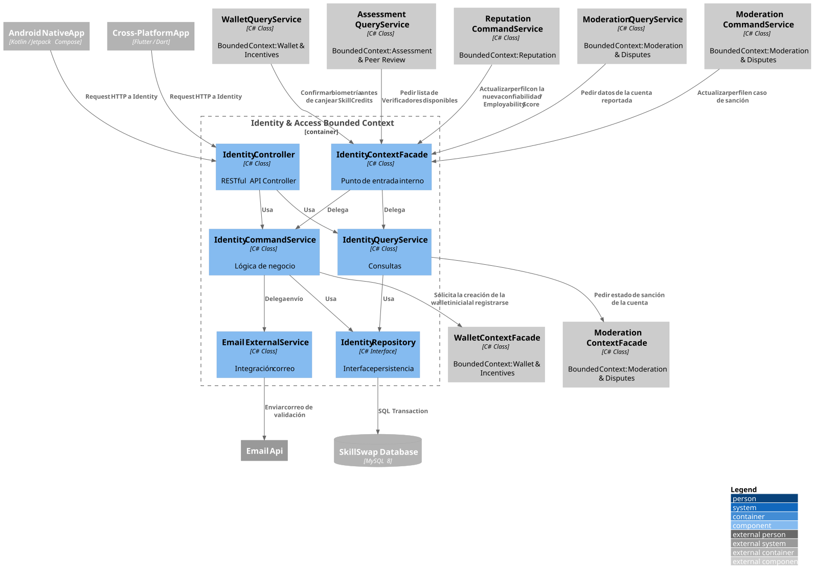
   
  <em>Figura XX. C4 Model: Component Diagram del Bounded Context Identity & Access - Elaboración propia. Nota: Se detalla la segregación entre el Controller, los Command/Query Services y los adaptadores de Persistencia y Seguridad (JWT), evidenciando las relaciones con los demás Bounded Contexts: la creación de la wallet inicial de SkillCredits en Wallet & Incentives al registrarse, la consulta de estado de sanción hacia Moderation & Disputes, y las solicitudes entrantes de Assessment & Peer Review (lista de Verificadores disponibles), Reputation (actualización de confiabilidad/Employability Score), Moderation & Disputes (datos de la cuenta reportada y actualización tras sanción) y Wallet & Incentives (confirmación de biometría antes de canjear SkillCredits).</em>

#### 2.6.1.6. Bounded Context Software Architecture Code Level Diagrams

##### 2.6.1.6.1. Bounded Context Domain Layer Class Diagrams

  
   
  <em>Figura XX. Diagrama de Clases UML del Domain Layer de Identity & Access - Elaboración propia. Nota: Recorte del diagrama de clases general correspondiente a este Bounded Context.</em>

El modelado de clases de Identity & Access pertenece al agregado raíz `User`, junto con sus Value Objects `Username`, `Email`, `PasswordHash` y `DeviceToken`, y la enumeración `Role`, debido a que estos elementos concentran de forma exclusiva la información de cuenta, credenciales y estado de verificación institucional de cada usuario de la plataforma. Se destaca el Value Object `DeviceToken`, incorporado sobre el agregado `User` como punto de extensión para una futura integración de notificaciones push en los clientes móviles nativo y cross-platform.

##### 2.6.1.6.2. Bounded Context Database Design Diagram

  
   
  <em>Figura XX. Diagrama de Base de Datos del Bounded Context Identity & Access - Elaboración propia. Nota: Recorte del diagrama relacional general correspondiente a este Bounded Context.</em>

El modelado de base de datos de Identity & Access pertenece a la tabla `users`, debido a que es la única tabla que persiste el agregado raíz `User` junto con sus Value Objects embebidos (`username`, `email`, `password_hash`, `role`, `device_token`), sin requerir tablas adicionales — a diferencia de otros Bounded Contexts del proyecto, `User` no compone ninguna entidad hija ni colección propia, por lo que un único registro por usuario es suficiente para representar el agregado completo. Se destaca el campo `device_token`, incorporado sobre la tabla `users` para el soporte de una futura integración de notificaciones push en los clientes móviles.

---

### 2.6.2. Bounded Context: Credential Verification

#### 2.6.2.1. Domain Layer

La capa de dominio de Credential Verification encapsula la lógica de negocio para el registro, extracción de datos y evaluación de riesgo de los certificados subidos por el Estudiante, manteniendo el modelo desacoplado de la tecnología concreta de OCR y de los mecanismos de verificación externos de cada emisor.

**1. Aggregate Root: Certificate**

Descripción: El agregado `Certificate` centraliza el documento subido por el Estudiante, los datos extraídos mediante OCR, y el estado de verificación resultante de la evaluación de riesgo. No conoce ni depende de la lógica específica de ningún emisor externo (SUNEDU, Coursera, etc.), dejando esa integración como un punto de extensión documentado pero fuera del alcance implementado del curso.

Atributos

| Atributo | Tipo | Descripción |
|---|---|---|
| id | int | Identificador único del certificado (autogenerado). |
| ownerId | int | Referencia al `User` (Estudiante) propietario del certificado, definido en Identity & Access. |
| holderName | string | Nombre del titular extraído del documento. |
| institutionName | string | Institución o emisor del certificado. |
| courseName | string | Nombre del curso, programa o certificación. |
| issueDate | date | Fecha de emisión del certificado. |
| durationHours | int (nullable) | Carga horaria, si el documento la incluye. |
| certificateNumber | string (nullable) | Número o código del certificado, si aparece. |
| verificationCode | string (nullable) | Código específico de validación, si aparece. |
| verificationUrl | string (nullable) | URL de verificación oficial, si aparece. |
| qrPayload | string (nullable) | Contenido decodificado del código QR, si existe. |
| ocrText | string | Texto completo extraído por OCR, conservado para auditoría y reprocesamiento. |
| fileHash | string | Hash criptográfico del archivo original, usado para detección de duplicados. |
| storageReference | string | Referencia al archivo almacenado en el servicio de almacenamiento en la nube. |
| status | VerificationStatus (VO) | Estado actual del certificado dentro del flujo de verificación. |
| verificationMethod | VerificationMethod (VO) | Mecanismo mediante el cual se intentó verificar el certificado. |
| riskAssessment | RiskAssessment (VO) | Resultado de la evaluación de riesgo aplicada al certificado. |
| createdAt | datetime | Fecha de registro del certificado en la plataforma. |
| verifiedAt | datetime (nullable) | Fecha en la que el certificado alcanzó un estado definitivo (`VERIFIED` o `REJECTED`). |

Métodos

- `Certificate(ownerId, fileHash, storageReference)` (Constructor): Registra el documento subido con estado inicial `PENDING`, antes de que se ejecute la extracción OCR.
- `applyExtractedData(holderName, institutionName, courseName, issueDate, durationHours, certificateNumber, verificationCode, verificationUrl, qrPayload, ocrText)`: Completa el agregado con los datos obtenidos por el servicio de extracción, una vez procesado el documento.
- `assessRisk(RiskAssessment riskAssessment)`: Asigna el resultado de la evaluación de riesgo y transiciona el estado del certificado: a `SUSPICIOUS` si el nivel es `HIGH_RISK`, o a `UNVERIFIED` si es `LOW_RISK` o `REVIEW` (a la espera de que el nivel `REVIEW` sea tratado manualmente en una futura iteración).
- `resolveDispute(boolean isAuthentic)`: Aplica la decisión del Coordinador tras la escalación a Moderation & Disputes, transicionando el certificado a `VERIFIED` o `REJECTED` y registrando `verifiedAt`.

**2. Value Object: RiskAssessment**

Descripción: Encapsula el resultado explicable (basado en reglas) de la evaluación de riesgo de un certificado, evitando que la lógica de scoring viva dispersa dentro del agregado.

Atributos

| Atributo | Tipo | Descripción |
|---|---|---|
| score | int | Puntaje acumulado según las reglas de riesgo aplicadas. |
| level | enum | Nivel derivado del score: `LOW_RISK` (0–19), `REVIEW` (20–49), `HIGH_RISK` (50+). |

Métodos

- `RiskAssessment(int score)` (Constructor): Calcula automáticamente el `level` correspondiente a partir del score recibido.

**3. Value Object: VerificationStatus**

Descripción: Enumeración que restringe los estados válidos del ciclo de vida de un certificado.

Atributos

| Atributo | Tipo | Descripción |
|---|---|---|
| value | enum | `PENDING`, `UNVERIFIED`, `SUSPICIOUS`, `VERIFIED`, `REJECTED`. |

**4. Value Object: VerificationMethod**

Descripción: Enumeración que documenta los mecanismos de verificación contemplados en el diseño. Para el alcance implementado en el curso solo se ejecutan `OCR_ONLY` y `MANUAL`; `QR`, `ISSUER_URL` y `OFFICIAL_REGISTRY` quedan documentados como extensión futura, sin lógica de integración activa.

Atributos

| Atributo | Tipo | Descripción |
|---|---|---|
| value | enum | `OCR_ONLY`, `QR`, `ISSUER_URL`, `OFFICIAL_REGISTRY`, `MANUAL`. |

**5. Domain Service: CertificateExtractionService**

Descripción: Define el contrato para extraer los datos estructurados de un documento de certificado, desacoplando el dominio de la tecnología concreta de OCR (ML Kit).

Métodos

- `extract(byte[] rawDocument)`: Recibe el documento crudo y retorna los campos extraídos (holderName, institutionName, courseName, issueDate, durationHours, certificateNumber, verificationCode, verificationUrl, qrPayload, ocrText) junto con el texto completo reconocido.

**6. Domain Service: CertificateRiskScorer**

Descripción: Define el contrato para calcular el `RiskAssessment` de un certificado a partir de un conjunto explicable de reglas, sin depender de fuentes de verificación externas.

Métodos

- `calculateRisk(boolean duplicateCertificateNumber, boolean duplicateVerificationCode, boolean duplicateFileHash, boolean ocrInconsistencies)`: Aplica las reglas de riesgo (+30 número de certificado duplicado, +30 código de verificación duplicado, +15 inconsistencias detectadas por OCR, +10 archivo idéntico a otro certificado) y retorna el `RiskAssessment` resultante.

**7. Repository: CertificateRepository**

Descripción: Interfaz para la persistencia y recuperación de datos del agregado `Certificate`, incluyendo las consultas necesarias para la detección de duplicados.

Métodos

- `findById(int id)`: Recupera un certificado por su identificador.
- `findByOwnerId(int ownerId)`: Recupera todos los certificados subidos por un Estudiante.
- `existsByCertificateNumber(String certificateNumber)`: Verifica si un número de certificado ya fue registrado por otro usuario.
- `existsByVerificationCode(String verificationCode)`: Verifica si un código de verificación ya fue registrado.
- `existsByFileHash(String fileHash)`: Verifica si el archivo ya fue registrado previamente.
- `save(Certificate certificate)`: Persiste un certificado nuevo o actualizado.

En la Domain Layer de SkillSwap, dentro del Bounded Context de Credential Verification, la clase `Certificate` actúa como Agregado raíz que centraliza el documento subido y su estado de verificación, apoyándose en los servicios de dominio `CertificateExtractionService` para la extracción de datos y `CertificateRiskScorer` para la evaluación explicable de riesgo. La separación conceptual entre "qué certificado presentó el usuario" (`Certificate`), "qué mecanismo se usó para intentar verificarlo" (`VerificationMethod`) y "qué señales de riesgo se detectaron" (`RiskAssessment`) permite incorporar en el futuro nuevos verificadores oficiales sin modificar el agregado principal.

#### 2.6.2.2. Interface Layer

En la Interface Layer de SkillSwap, para el contexto de Credential Verification, se definen los puntos de entrada REST que permiten al Estudiante subir certificados y consultar su estado de verificación desde los clientes móviles.

**Resources**

| Nombre | Descripción |
|---|---|
| UploadCertificateResource | DTO que encapsula el archivo del certificado (imagen/PDF) y el identificador del propietario para su registro inicial. |
| CertificateResource | DTO de salida que representa un certificado con sus datos extraídos, estado de verificación y nivel de riesgo. |
| CertificateListResource | Colección de `CertificateResource` correspondiente a los certificados de un Estudiante. |

**Controllers**

| Nombre | Método HTTP | Ruta / Resource | Descripción |
|---|---|---|---|
| CertificateController | POST | `/api/v1/certificates` (UploadCertificateResource) | Registra un nuevo certificado y dispara su procesamiento (extracción OCR y evaluación de riesgo). |
| CertificateController | GET | `/api/v1/certificates/{id}` | Consulta el detalle y estado actual de un certificado específico. |
| CertificateController | GET | `/api/v1/certificates?ownerId={ownerId}` | Lista los certificados subidos por un Estudiante. |

**Transformers / Assemblers**

| Nombre | Descripción |
|---|---|
| CertificateResourceFromEntityAssembler | Convierte la entidad de dominio `Certificate` en un `CertificateResource` para su envío a través de la API. |
| UploadCertificateCommandFromResourceAssembler | Transforma los datos recibidos en `UploadCertificateResource` en un `UploadCertificateCommand` procesable por la capa de aplicación. |

Los controladores no contienen reglas de negocio: delegan el procesamiento de extracción y evaluación de riesgo a la capa de aplicación, actuando como interfaz uniforme entre los clientes móviles (Android Nativo, Flutter) y la lógica de verificación de certificados.

#### 2.6.2.3. Application Layer

En la Application Layer de SkillSwap, para el contexto de Credential Verification, los handlers orquestan el flujo completo desde la subida del documento hasta la determinación del estado de verificación, coordinando el servicio de extracción, el repositorio y el motor de riesgo.

**Handlers**

| Nombre | Descripción | Resumen de Lógica |
|---|---|---|
| UploadCertificateCommandHandler | Procesa la subida de un nuevo certificado. | Almacena el archivo mediante el servicio de infraestructura de almacenamiento, calcula el `fileHash`, invoca `CertificateExtractionService` para obtener los datos del documento, consulta `CertificateRepository` para detectar duplicados (número de certificado, código de verificación, hash de archivo), invoca `CertificateRiskScorer` con dichos resultados, aplica `assessRisk` sobre el agregado y lo persiste. Si el estado resultante es `SUSPICIOUS`, notifica al Bounded Context Moderation & Disputes para su escalación. |
| ResolveCertificateDisputeCommandHandler | Aplica la resolución de un certificado escalado. | Recibido el resultado de la revisión del Coordinador desde Moderation & Disputes, invoca `resolveDispute` sobre el agregado y lo persiste con su estado definitivo (`VERIFIED` o `REJECTED`). |

**Internal DTOs**

| Nombre | Descripción |
|---|---|
| CertificateDto | Objeto que transporta los datos extraídos y el estado operativo del certificado entre capas. |
| RiskAssessmentDto | DTO que transporta el score y nivel de riesgo calculado, previo a su persistencia como Value Object. |

En la Application Layer de Credential Verification, `UploadCertificateCommandHandler` asegura que ningún certificado quede sin una evaluación de riesgo antes de estar disponible como evidencia de habilidad para Learning Path Engine, y que todo certificado clasificado como `SUSPICIOUS` sea escalado a Moderation & Disputes en lugar de resolverse dentro del propio Bounded Context.

#### 2.6.2.4. Infrastructure Layer

En la Infrastructure Layer de SkillSwap, para el contexto de Credential Verification, se implementan los adaptadores técnicos para la persistencia, la extracción OCR y el almacenamiento de archivos.

**Persistence (Repository Implementation)**

| Nombre | Descripción | Tecnologías / Herramientas |
|---|---|---|
| CertificateRepositoryAdapter | Implementación concreta de `CertificateRepository` que realiza las operaciones CRUD sobre la tabla `certificates`. | ORM del stack backend, instancia MySQL desplegada en Render. |

**OCR & Storage Services Implementation**

| Nombre | Descripción | Resumen de Implementación |
|---|---|---|
| MlKitCertificateExtractor | Implementación técnica de `CertificateExtractionService`. | Ejecuta el reconocimiento de texto (Text Recognition) y, cuando aplica, la decodificación de código QR (Barcode Scanning) de ML Kit, de forma on-device sobre el documento capturado desde la cámara del dispositivo. |
| CloudinaryStorageAdapter | Servicio responsable de almacenar el archivo original del certificado. | Sube la imagen/PDF a Cloudinary y retorna la referencia (`storageReference`) persistida en el agregado. |

Estos componentes aseguran que la lógica de negocio de Credential Verification permanezca independiente de ML Kit y de Cloudinary, de modo que ambos puedan sustituirse en el futuro sin modificar el Domain Layer ni la Application Layer.

#### 2.6.2.5. Bounded Context Software Architecture Component Level Diagrams

  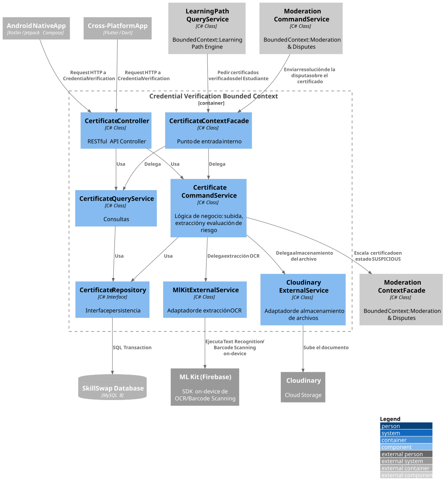
   
  <em>Figura XX. C4 Model: Component Diagram del Bounded Context Credential Verification - Elaboración propia. Nota: Se detalla la segregación entre el Controller, el Command/Query Service y los adaptadores de Persistencia, extracción OCR (ML Kit on-device) y almacenamiento de archivos (Cloudinary), evidenciando la escalación de certificados en estado SUSPICIOUS hacia Moderation & Disputes y la solicitud entrante de certificados verificados desde Learning Path Engine.</em>

##### 2.6.2.6.1. Bounded Context Domain Layer Class Diagrams

  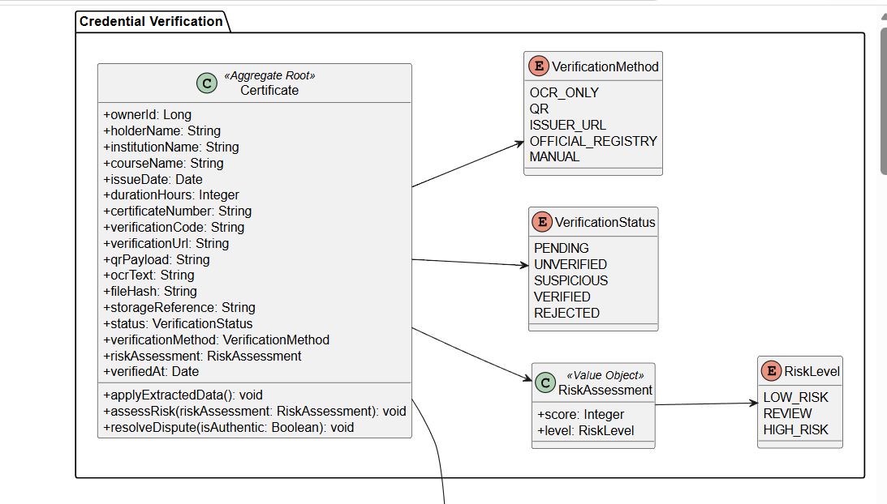
   
  <em>Figura XX. Diagrama de Clases UML del Domain Layer de Credential Verification - Elaboración propia. Nota: Recorte del diagrama de clases general correspondiente a este Bounded Context.</em>

El modelado de clases de Credential Verification pertenece al agregado raíz `Certificate`, junto con el Value Object `RiskAssessment` (y su enumeración asociada `RiskLevel`) y las enumeraciones `VerificationStatus` y `VerificationMethod`, debido a que estos elementos concentran de forma exclusiva el documento subido por el Estudiante, los datos extraídos mediante OCR, y el resultado explicable de la evaluación de riesgo — sin depender de la lógica específica de ningún emisor externo (SUNEDU, Coursera, etc.), la cual queda fuera del alcance implementado del curso y documentada únicamente a nivel de `VerificationMethod`.

##### 2.6.2.6.2. Bounded Context Database Design Diagram

  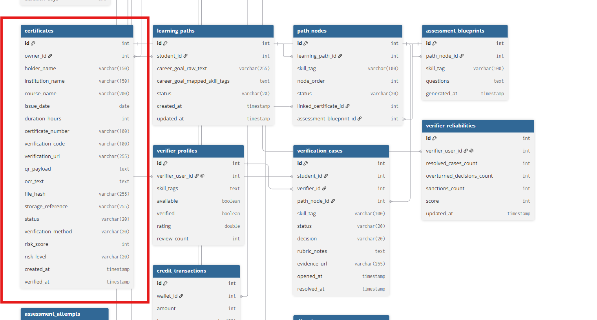
   
  <em>Figura XX. Diagrama de Base de Datos del Bounded Context Credential Verification - Elaboración propia. Nota: Recorte del diagrama relacional general correspondiente a este Bounded Context.</em>

El modelado de base de datos de Credential Verification pertenece a la tabla `certificates`, debido a que es la única tabla que persiste el agregado raíz `Certificate` junto con los datos extraídos por OCR, el hash del archivo y el resultado de la evaluación de riesgo — al igual que en Identity & Access, no existe ninguna entidad hija ni colección propia dentro de este agregado, por lo que un único registro por certificado es suficiente. Se destacan los campos `ocr_text`, `qr_payload`, `file_hash` y `storage_reference`, incorporados para el soporte de la captura desde cámara y el procesamiento on-device mediante ML Kit, feature de aprendizaje autónomo del proyecto.

---

### 2.6.3. Bounded Context: Learning Path Engine

#### 2.6.3.1. Domain Layer

La capa de dominio de Learning Path Engine concentra el núcleo de negocio de SkillSwap: interpretar la meta declarada por el Estudiante, comparar sus habilidades ya verificadas contra los requisitos de dicha meta, generar la ruta de aprendizaje personalizada, y producir dinámicamente la evaluación correspondiente a cada nodo de la ruta.

**1. Aggregate Root: LearningPath**

Descripción: El agregado `LearningPath` representa la ruta de aprendizaje personalizada de un Estudiante, compuesta por una secuencia ordenada de nodos (`PathNode`) que deben completarse progresivamente hacia la `CareerGoal` declarada.

Atributos

| Atributo | Tipo | Descripción |
|---|---|---|
| id | int | Identificador único de la ruta (autogenerado). |
| studentId | int | Usuario con rol `Student`, propietario de la ruta. |
| careerGoal | CareerGoal (VO) | Meta profesional/habilidad declarada por el estudiante. |
| nodes | List\<PathNode\> | Secuencia ordenada de nodos que componen la ruta. |
| status | PathStatus (VO) | Estado general de la ruta: `active` o `completed`. |
| createdAt | timestamp | Fecha de generación de la ruta. |
| updatedAt | timestamp | Fecha de la última recalculación de la ruta. |

Métodos

- `LearningPath(studentId, careerGoal, nodes)` (Constructor): Crea la ruta en estado `active` a partir del resultado de `LearningPathBuilder`.
- `recalculate(SkillGap updatedGap)`: Regenera la secuencia de nodos pendientes cuando el estudiante certifica una nueva habilidad (por ejemplo, al aprobar un `Certificate` en Credential Verification), sin alterar los nodos ya completados.
- `completeNode(int nodeId)`: Marca un `PathNode` como `completed` y, si era el último nodo pendiente, transiciona la ruta completa a `completed`.

**2. Entity: PathNode**

Descripción: Representa un paso individual dentro de la ruta, correspondiente a una habilidad específica que el estudiante debe demostrar.

Atributos

| Atributo | Tipo | Descripción |
|---|---|---|
| id | int | Identificador único del nodo. |
| skillTag | string | Habilidad asociada al nodo, referenciada contra la taxonomía interna de skills. |
| order | int | Posición del nodo dentro de la secuencia de la ruta. |
| status | NodeStatus (VO) | Estado del nodo: `locked`, `available`, `completed`. |
| linkedCertificateId | int (nullable) | Referencia al `Certificate` (Credential Verification) que ya satisface este nodo, si existía previamente. |
| assessmentBlueprintId | int (nullable) | Referencia al `AssessmentBlueprint` generado para demostrar este nodo, una vez solicitado. |

**3. Value Object: CareerGoal**

Descripción: Encapsula la meta declarada por el estudiante en texto libre junto con su traducción a la taxonomía interna de habilidades.

Atributos

| Atributo | Tipo | Descripción |
|---|---|---|
| rawText | string | Texto libre ingresado por el estudiante (ej. "quiero aprender APIs REST con autenticación JWT"). |
| mappedSkillTags | List\<String\> | Habilidades de la taxonomía interna resueltas a partir del texto libre. |

Métodos

- `CareerGoal(String rawText, List<String> mappedSkillTags)` (Constructor): Valida que exista al menos un `skillTag` resuelto; en caso contrario, lanza una excepción de dominio indicando que la meta no pudo interpretarse.

**4. Value Object: SkillGap**

Descripción: Representa la diferencia entre las habilidades ya verificadas del estudiante y las requeridas por su `CareerGoal`.

Atributos

| Atributo | Tipo | Descripción |
|---|---|---|
| verifiedSkillTags | List\<String\> | Habilidades que el estudiante ya demostró (vía certificado validado o nodo previamente completado). |
| missingSkillTags | List\<String\> | Habilidades pendientes de demostrar para alcanzar la `CareerGoal`. |

**5. Aggregate Root: AssessmentBlueprint**

Descripción: El agregado `AssessmentBlueprint` representa la especificación de la evaluación generada dinámicamente por IA para demostrar la habilidad de un `PathNode` específico. Es consumido como Downstream por Assessment & Peer Review para ejecutar el intento del estudiante y calificarlo, sin que dicho Bounded Context conozca cómo se generó el contenido.

Atributos

| Atributo | Tipo | Descripción |
|---|---|---|
| id | int | Identificador único del blueprint. |
| pathNodeId | int | Nodo de la ruta al que corresponde esta evaluación. |
| skillTag | string | Habilidad evaluada. |
| questions | List\<Question\> | Preguntas generadas dinámicamente por IA. |
| generatedAt | timestamp | Fecha de generación del blueprint. |

Métodos

- `AssessmentBlueprint(pathNodeId, skillTag, questions)` (Constructor): Registra el resultado producido por `QuestionGenerationService` para un nodo específico.

**6. Entity: Question**

Atributos

| Atributo | Tipo | Descripción |
|---|---|---|
| questionString | string | Enunciado de la pregunta generada. |
| answers | List\<String\> | Lista de 4 posibles respuestas. |
| correctAnswer | int | Índice (0 a 3) de la respuesta correcta. |

**7. Domain Service: SkillGapAnalyzer**

Descripción: Define el contrato para calcular el `SkillGap` de un estudiante comparando sus habilidades verificadas contra los requisitos de su `CareerGoal`.

Métodos

- `analyze(CareerGoal goal, List<String> verifiedSkillTags)`: Retorna el `SkillGap` resultante.

**8. Domain Service: LearningPathBuilder**

Descripción: Define el contrato para construir la secuencia ordenada de `PathNode` a partir de un `SkillGap`, respetando las dependencias/prerequisitos entre habilidades de la taxonomía interna.

Métodos

- `buildPath(SkillGap gap)`: Retorna la lista ordenada de `PathNode` en estado `locked`/`available` según sus dependencias.

**9. Domain Service: QuestionGenerationService**

Descripción: Define el contrato para generar dinámicamente las preguntas de un `AssessmentBlueprint` a partir de una habilidad declarada, desacoplando el dominio del proveedor concreto de IA generativa.

Métodos

- `generateQuestions(String skillTag)`: Retorna una lista de `Question` generadas para evaluar la habilidad indicada.

**10. Repository: LearningPathRepository, AssessmentBlueprintRepository**

Métodos

- `findByStudentId(int studentId)`, `save(LearningPath path)` (LearningPathRepository).
- `findByPathNodeId(int pathNodeId)`, `save(AssessmentBlueprint blueprint)` (AssessmentBlueprintRepository).

En la Domain Layer de SkillSwap, dentro del Bounded Context de Learning Path Engine, el agregado `LearningPath` centraliza la ruta personalizada del estudiante apoyándose en `SkillGapAnalyzer` y `LearningPathBuilder` para su construcción y recálculo, mientras que `AssessmentBlueprint` encapsula la generación de contenido evaluativo mediante `QuestionGenerationService`, manteniendo la separación entre "qué ruta necesita el estudiante" y "qué evaluación demuestra cada paso de esa ruta".

#### 2.6.3.2. Interface Layer

**Resources**

| Nombre | Descripción |
|---|---|
| DeclareGoalResource | DTO de entrada con el texto libre de la meta declarada por el estudiante. |
| LearningPathResource | DTO de salida que representa la ruta completa con sus nodos y estados. |
| PathNodeResource | DTO de salida que representa un nodo individual de la ruta. |
| AssessmentBlueprintResource | DTO de salida que representa las preguntas generadas para un nodo, sin exponer `correctAnswer`. |

**Controllers**

| Nombre | Método HTTP | Ruta / Resource | Descripción |
|---|---|---|---|
| LearningPathController | POST | `/api/v1/learning-paths` (DeclareGoalResource) | Recibe la meta del estudiante, genera el `SkillGap` inicial y construye la ruta. |
| LearningPathController | GET | `/api/v1/learning-paths/{studentId}` | Retorna la ruta activa del estudiante con el estado de cada nodo. |
| AssessmentBlueprintController | POST | `/api/v1/path-nodes/{nodeId}/assessment-blueprint` | Solicita la generación de la evaluación correspondiente a un nodo `available`. |

**Transformers / Assemblers**

| Nombre | Descripción |
|---|---|
| LearningPathResourceFromEntityAssembler | Convierte `LearningPath` en `LearningPathResource`. |
| AssessmentBlueprintResourceFromEntityAssembler | Convierte `AssessmentBlueprint` en `AssessmentBlueprintResource`, omitiendo `correctAnswer` de cada pregunta. |
| DeclareGoalCommandFromResourceAssembler | Transforma `DeclareGoalResource` en `DeclareGoalCommand`. |

#### 2.6.3.3. Application Layer

**Handlers**

| Nombre | Descripción | Resumen de Lógica |
|---|---|---|
| DeclareGoalCommandHandler | Procesa la declaración inicial de la meta del estudiante. | Interpreta el texto libre contra la taxonomía interna de skills, consulta a Credential Verification las habilidades ya respaldadas por certificados válidos, invoca `SkillGapAnalyzer` y `LearningPathBuilder`, instancia `LearningPath` y lo persiste. |
| RecalculatePathCommandHandler | Procesa la actualización de la ruta tras un evento de certificado verificado. | Recibe el evento desde Credential Verification, recalcula el `SkillGap` y ejecuta `recalculate()` sobre el `LearningPath` correspondiente. |
| GenerateAssessmentBlueprintCommandHandler | Procesa la solicitud de evaluación para un nodo. | Invoca `QuestionGenerationService` con el `skillTag` del nodo, instancia `AssessmentBlueprint` y lo persiste, dejándolo disponible para que Assessment & Peer Review lo consuma. |
| GetLearningPathQueryHandler | Recupera la ruta activa de un estudiante. | Consulta `LearningPathRepository.findByStudentId()`. |

**Internal DTOs**

| Nombre | Descripción |
|---|---|
| LearningPathDto | Objeto que transporta la ruta y sus nodos entre capas. |
| AssessmentBlueprintDto | Objeto que transporta el blueprint generado, incluyendo `correctAnswer` únicamente hacia Assessment & Peer Review (nunca hacia el cliente). |

#### 2.6.3.4. Infrastructure Layer

**Persistence (Repository Implementation)**

| Nombre | Descripción | Tecnologías / Herramientas |
|---|---|---|
| LearningPathRepositoryAdapter | Implementación concreta de `LearningPathRepository` sobre las tablas `learning_paths` y `path_nodes`. | ORM del stack backend, instancia MySQL desplegada en Render. |
| AssessmentBlueprintRepositoryAdapter | Implementación concreta de `AssessmentBlueprintRepository` sobre la tabla `assessment_blueprints`. | ORM del stack backend. La lista de preguntas se persiste mediante un converter JSON, siguiendo el mismo criterio que ya aplicaron en el `Quiz` del proyecto base. |

**AI Services Implementation**

| Nombre | Descripción | Resumen de Implementación |
|---|---|---|
| SkillTaxonomyMatcher | Implementación técnica de la resolución de `CareerGoal.mappedSkillTags`. | Compara el texto libre recibido contra un catálogo interno de skills mediante coincidencia de palabras clave, sin depender de un motor de embeddings/vector search externo. |
| LlmQuestionGenerator | Implementación técnica de `QuestionGenerationService`. | Invoca una API de IA generativa (LLM) con un prompt estructurado por `skillTag`, solicitando un formato de respuesta JSON con las preguntas, alternativas y respuesta correcta, para su conversión directa en objetos `Question`. |

Estos componentes garantizan que el algoritmo de matching de habilidades y el proveedor de IA generativa puedan sustituirse en el futuro (por ejemplo, migrando a un motor de embeddings) sin modificar el Domain Layer ni la Application Layer.

#### 2.6.3.5. Bounded Context Software Architecture Component Level Diagrams

  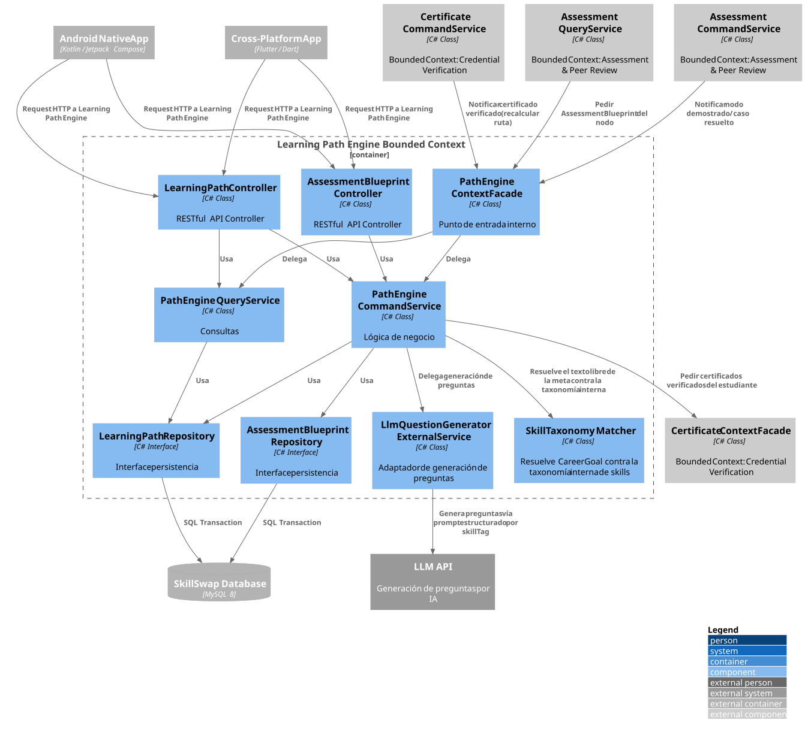
   
  <em>Figura XX. C4 Model: Component Diagram del Bounded Context Learning Path Engine - Elaboración propia. Nota: Se detalla la segregación entre los Controllers de `LearningPath` y `AssessmentBlueprint`, el Command/Query Service, el componente interno `SkillTaxonomy Matcher` y el adaptador de generación de preguntas mediante una API de IA generativa (LLM), evidenciando la solicitud de certificados verificados hacia Credential Verification, la notificación entrante de certificados verificados desde ese mismo Bounded Context, y las solicitudes entrantes de Assessment & Peer Review (blueprint del nodo y notificación de nodo demostrado).</em>

##### 2.6.3.6.1. Bounded Context Domain Layer Class Diagrams

  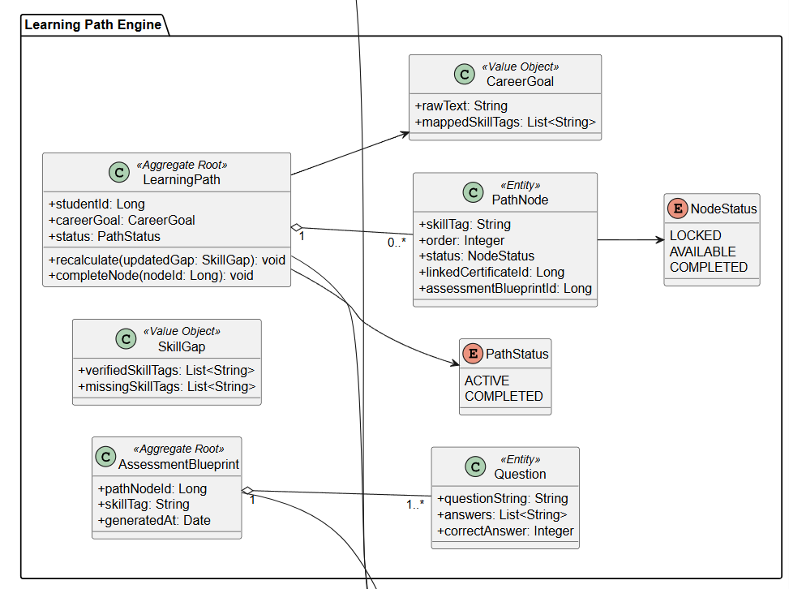
   
  <em>Figura XX. Diagrama de Clases UML del Domain Layer de Learning Path Engine - Elaboración propia. Nota: Recorte del diagrama de clases general correspondiente a este Bounded Context.</em>

El modelado de clases de Learning Path Engine pertenece a los agregados raíz `LearningPath` y `AssessmentBlueprint`, junto con la entidad `PathNode`, los Value Objects `CareerGoal` y `SkillGap`, y la entidad `Question` embebida en `AssessmentBlueprint`, debido a que estos elementos concentran de forma exclusiva el business core de la plataforma: la interpretación de la meta del estudiante, el cálculo de la brecha de habilidad, la secuencia de nodos de la ruta personalizada y el contenido evaluativo generado dinámicamente por IA para cada nodo.

##### 2.6.3.6.2. Bounded Context Database Design Diagram

  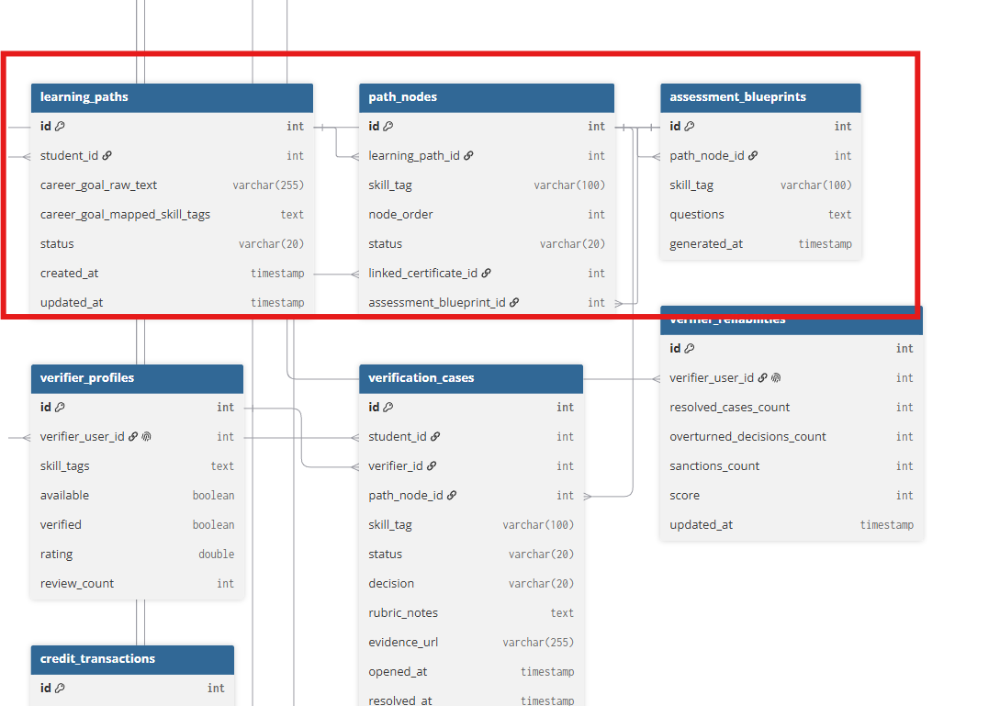
   
  <em>Figura XX. Diagrama de Base de Datos del Bounded Context Learning Path Engine - Elaboración propia. Nota: Recorte del diagrama relacional general correspondiente a este Bounded Context.</em>

El modelado de base de datos de Learning Path Engine pertenece a las tablas `learning_paths`, `path_nodes` y `assessment_blueprints`, debido a que estas tres tablas persisten de forma normalizada la ruta de aprendizaje del estudiante (`learning_paths`), cada paso individual de dicha ruta con su estado de avance (`path_nodes`), y la evaluación generada dinámicamente por IA para demostrar la habilidad de un nodo específico (`assessment_blueprints`) — una relación uno a muchos en ambos casos, ya que una ruta se compone de varios nodos y cada nodo puede requerir su propio blueprint de evaluación.

---

### 2.6.4. Bounded Context: Assessment & Peer Review

#### 2.6.4.1. Domain Layer

La capa de dominio de Assessment & Peer Review concentra las reglas de negocio de la ejecución de la evaluación generada por la IA, y la asignación y resolución de un Verificador cuando dicha evaluación no es aprobada, sin depender de ninguna sesión de comunicación en tiempo real entre los participantes.

**1. Aggregate Root: AssessmentAttempt**

Descripción: El agregado `AssessmentAttempt` representa el intento de un Estudiante al resolver el `AssessmentBlueprint` de un nodo de su ruta, calculando el puntaje de forma centralizada en el servidor para evitar manipulación desde el cliente.

Atributos

| Atributo | Tipo | Descripción |
|---|---|---|
| id | int | Identificador único del intento (autogenerado). |
| blueprintId | int | Referencia al `AssessmentBlueprint` (Learning Path Engine) resuelto. |
| studentId | int | Usuario `Student` que resuelve la evaluación. |
| selectedAnswers | List\<Integer\> | Índices seleccionados por el estudiante para cada pregunta. |
| score | Score (VO) | Puntaje obtenido. |
| passed | boolean | Indica si el puntaje alcanzó el umbral de aprobación automática. |
| completedAt | timestamp | Fecha y hora de finalización del intento. |

Métodos

- `AssessmentAttempt(blueprintId, studentId, selectedAnswers, blueprintQuestions)` (Constructor): Calcula el `score` comparando `selectedAnswers` contra `correctAnswer` de cada pregunta del blueprint (recibido desde Learning Path Engine), y determina `passed` según el umbral de aprobación definido para la habilidad.

**2. Value Object: Score**

Atributos

| Atributo | Tipo | Descripción |
|---|---|---|
| value | int | Puntaje obtenido. |
| total | int | Puntaje máximo posible. |

**3. Aggregate Root: VerifierProfile**

Descripción: El agregado `VerifierProfile` representa la elegibilidad de un usuario `Student` (que ya completó su propia ruta para una habilidad) para revisar casos de otros estudiantes en esa misma habilidad.

Atributos

| Atributo | Tipo | Descripción |
|---|---|---|
| id | int | Identificador único del perfil de Verificador (autogenerado). |
| verifierUserId | int | Referencia al usuario `Student` (Identity & Access) que posee este perfil. |
| skillTags | List\<String\> | Habilidades que el Verificador está habilitado para revisar. |
| available | boolean | Indica si el Verificador puede recibir nuevos casos asignados. |
| verified | boolean | Indica si el perfil se mantiene habilitado (puede ser revocado por Moderation & Disputes). |
| rating | double | Confiabilidad promedio, sincronizada desde Reputation. |
| reviewCount | int | Cantidad de casos resueltos, sincronizado desde Reputation. |

Métodos

- `VerifierProfile(verifierUserId, skillTags)` (Constructor): Crea el perfil en estado `available` y `verified`, habilitado apenas el estudiante certifica la primera habilidad que le permite revisar casos de otros.
- `updateAvailability(boolean available)`: Actualiza si el Verificador puede recibir nuevos casos.
- `addSkillTag(String skill)`: Amplía las habilidades que el Verificador puede revisar, al certificar una nueva habilidad en su propia ruta.
- `updateReputation(double rating, int reviewCount)`: Sincroniza la confiabilidad y el conteo de revisiones desde Reputation.

**4. Aggregate Root: VerificationCase**

Descripción: El agregado `VerificationCase` representa el caso abierto cuando un `AssessmentAttempt` no alcanza el umbral de aprobación, gobernando su asignación a un Verificador disponible y la resolución con rúbrica estructurada.

Atributos

| Atributo | Tipo | Descripción |
|---|---|---|
| id | int | Identificador único del caso (autogenerado). |
| studentId | int | Estudiante cuyo intento generó el caso. |
| verifierId | int (nullable) | Verificador asignado, nulo hasta la asignación. |
| pathNodeId | int | Nodo de la ruta (Learning Path Engine) al que corresponde el caso. |
| skillTag | string | Habilidad en evaluación. |
| status | CaseStatus (VO) | Estado actual del caso. |
| decision | ReviewDecision (VO, nullable) | Resultado de la revisión, nulo hasta resolverse. |
| rubricNotes | string (nullable) | Observaciones del Verificador siguiendo la rúbrica estructurada. |
| evidenceUrl | string (nullable) | Evidencia adicional (portafolio/proyecto) que el estudiante puede adjuntar para sustentar su caso. |
| openedAt | timestamp | Fecha de apertura del caso. |
| resolvedAt | timestamp (nullable) | Fecha de resolución del caso. |

Métodos

- `VerificationCase(studentId, pathNodeId, skillTag)` (Constructor): Crea el caso en estado `PENDING`, inmediatamente después de un `AssessmentAttempt` fallido.
- `assignVerifier(int verifierId)`: Asigna un Verificador disponible y transiciona el estado a `ASSIGNED`.
- `attachEvidence(String url)`: Registra evidencia adicional aportada por el estudiante antes o durante la revisión.
- `startReview()`: Transiciona el estado a `UNDER_REVIEW` cuando el Verificador inicia la evaluación del caso.
- `resolve(ReviewDecision decision, String rubricNotes)`: Registra la decisión final, transiciona el estado a `RESOLVED` y registra `resolvedAt`.

**5. Value Object: CaseStatus**

Atributos

| Atributo | Tipo | Descripción |
|---|---|---|
| value | enum | `PENDING`, `ASSIGNED`, `UNDER_REVIEW`, `RESOLVED`. |

**6. Value Object: ReviewDecision**

Atributos

| Atributo | Tipo | Descripción |
|---|---|---|
| value | enum | `APPROVED`, `REJECTED`. |

**7. Domain Service: VerifierMatcher**

Descripción: Encapsula el algoritmo de asignación de un Verificador disponible a un `VerificationCase`, reemplazando la búsqueda dirigida por el usuario que existía en el modelo de tutorías.

Métodos

- `findAvailableVerifier(String skillTag, List<VerifierProfile> candidates)`: Retorna el `VerifierProfile` disponible con la habilidad requerida y menor carga de casos asignados (`reviewCount`), o nulo si no hay ninguno disponible.

**8. Repository: AssessmentAttemptRepository, VerifierProfileRepository, VerificationCaseRepository**

Métodos

- `findById(int id)`, `save(AssessmentAttempt attempt)` (AssessmentAttemptRepository).
- `findAvailableBySkillTag(String skillTag)`, `findById(int id)`, `save(VerifierProfile profile)` (VerifierProfileRepository).
- `findById(int id)`, `findByVerifierId(int verifierId)`, `save(VerificationCase verificationCase)` (VerificationCaseRepository).

En la Domain Layer de SkillSwap, dentro del Bounded Context de Assessment & Peer Review, `AssessmentAttempt` centraliza el cálculo del puntaje sobre el blueprint generado por Learning Path Engine, mientras que `VerificationCase` gobierna el flujo de escalamiento hacia un humano cuando dicho intento no es aprobado, apoyándose en `VerifierMatcher` para la asignación algorítmica de un `VerifierProfile` disponible, sin recurrir a ninguna sesión de comunicación en tiempo real.

#### 2.6.4.2. Interface Layer

**Resources**

| Nombre | Descripción |
|---|---|
| SubmitAssessmentAttemptResource | DTO de entrada con las respuestas seleccionadas por el estudiante. |
| AssessmentAttemptResource | DTO de salida con el resultado del intento (score, total, passed). |
| VerificationCaseResource | DTO de salida que representa un caso con su estado, decisión y notas de rúbrica. |
| ResolveCaseResource | DTO de entrada con la decisión y las notas del Verificador. |
| AttachEvidenceResource | DTO de entrada con la URL de evidencia adjunta por el estudiante. |
| VerifierAvailabilityResource | DTO de entrada para actualizar la disponibilidad del Verificador. |

**Controllers**

| Nombre | Método HTTP | Ruta / Resource | Descripción |
|---|---|---|---|
| AssessmentAttemptController | POST | `/api/v1/assessment-attempts` (SubmitAssessmentAttemptResource) | Registra el intento, calcula el puntaje y, si no aprueba, dispara la apertura de un `VerificationCase`. |
| AssessmentAttemptController | GET | `/api/v1/assessment-attempts/{id}` | Retorna el resultado de un intento específico. |
| VerificationCaseController | GET | `/api/v1/verification-cases/{id}` | Retorna el detalle de un caso. |
| VerificationCaseController | GET | `/api/v1/verification-cases?verifierId={id}` | Lista los casos asignados a un Verificador. |
| VerificationCaseController | PATCH | `/api/v1/verification-cases/{id}/evidence` (AttachEvidenceResource) | Registra evidencia adicional aportada por el estudiante. |
| VerificationCaseController | PATCH | `/api/v1/verification-cases/{id}/decision` (ResolveCaseResource) | Registra la decisión del Verificador y resuelve el caso. |
| VerifierProfileController | PATCH | `/api/v1/verifier-profiles/{id}/availability` (VerifierAvailabilityResource) | Actualiza la disponibilidad del Verificador para recibir nuevos casos. |

**Transformers / Assemblers**

| Nombre | Descripción |
|---|---|
| AssessmentAttemptResourceFromEntityAssembler | Convierte `AssessmentAttempt` en `AssessmentAttemptResource`. |
| VerificationCaseResourceFromEntityAssembler | Convierte `VerificationCase` en `VerificationCaseResource`. |
| SubmitAssessmentAttemptCommandFromResourceAssembler | Transforma `SubmitAssessmentAttemptResource` en `SubmitAssessmentAttemptCommand`. |
| ResolveCaseCommandFromResourceAssembler | Transforma `ResolveCaseResource` en `ResolveCaseCommand`. |

#### 2.6.4.3. Application Layer

**Handlers**

| Nombre | Descripción | Resumen de Lógica |
|---|---|---|
| SubmitAssessmentAttemptCommandHandler | Procesa el envío de respuestas del estudiante. | Solicita a Learning Path Engine (vía Context Facade) el `AssessmentBlueprint` con `correctAnswer` incluido, instancia `AssessmentAttempt` (que calcula el resultado internamente) y lo persiste. Si `passed` es verdadero, notifica a Learning Path Engine para completar el nodo y a Reputation para actualizar el Employability Score del estudiante. Si es falso, delega en `OpenVerificationCaseCommandHandler`. |
| OpenVerificationCaseCommandHandler | Abre y asigna un nuevo caso tras un intento fallido. | Instancia `VerificationCase`, invoca `VerifierMatcher.findAvailableVerifier()` sobre los perfiles disponibles para el `skillTag`, ejecuta `assignVerifier()` y persiste el caso. |
| AttachEvidenceCommandHandler | Procesa la evidencia adicional del estudiante. | Recupera el `VerificationCase`, invoca `attachEvidence()` y lo persiste. |
| ResolveVerificationCaseCommandHandler | Procesa la decisión del Verificador. | Recupera el caso, invoca `resolve()`. Si la decisión es `APPROVED`, notifica a Learning Path Engine para completar el nodo, a Reputation para actualizar la confiabilidad del Verificador y el Employability Score del estudiante, y a Wallet & Incentives para acreditar SkillCredits al Verificador. Si es `REJECTED`, notifica solo a Reputation. |
| UpdateVerifierAvailabilityCommandHandler | Procesa el cambio de disponibilidad de un Verificador. | Recupera el `VerifierProfile`, invoca `updateAvailability()` y lo persiste. |
| GetVerificationCaseQueryHandler / GetAssessmentAttemptQueryHandler / ListCasesByVerifierQueryHandler | Recuperan el detalle o listado solicitado. | Consultan el repositorio correspondiente. |

**Internal DTOs**

| Nombre | Descripción |
|---|---|
| AssessmentAttemptDto | Objeto que transporta el resultado de un intento entre capas. |
| VerificationCaseDto | Objeto que transporta el estado y decisión de un caso entre capas. |

En la Application Layer de Assessment & Peer Review, `SubmitAssessmentAttemptCommandHandler` asegura que un estudiante nunca avance de nodo sin una evaluación real (automática o por Verificador), y `ResolveVerificationCaseCommandHandler` centraliza el único punto donde la aprobación de un caso dispara los tres eventos hacia Learning Path Engine, Reputation y Wallet & Incentives.

#### 2.6.4.4. Infrastructure Layer

**Persistence (Repository Implementation)**

| Nombre | Descripción | Tecnologías / Herramientas |
|---|---|---|
| AssessmentAttemptRepositoryAdapter | Implementación concreta de `AssessmentAttemptRepository` sobre la tabla `assessment_attempts`. | ORM del stack backend, instancia MySQL desplegada en Render. |
| VerifierProfileRepositoryAdapter | Implementación concreta de `VerifierProfileRepository` sobre la tabla `verifier_profiles`. | ORM del stack backend, instancia MySQL desplegada en Render. |
| VerificationCaseRepositoryAdapter | Implementación concreta de `VerificationCaseRepository` sobre la tabla `verification_cases`. | ORM del stack backend, instancia MySQL desplegada en Render. |

**Integration Services**

| Nombre | Descripción | Resumen de Implementación |
|---|---|---|
| CloudinaryEvidenceAdapter | Gestiona el almacenamiento del archivo de evidencia opcional adjuntado por el estudiante. | Reutiliza el mismo servicio Cloudinary ya integrado en Credential Verification, evitando duplicar la integración técnica. |

Estos componentes garantizan que ni la asignación de Verificador ni la calificación del intento dependan de infraestructura de comunicación en tiempo real, reduciendo la superficie técnica del Bounded Context frente al Workspace del modelo de tutorías original.

#### 2.6.4.5. Bounded Context Software Architecture Component Level Diagrams

  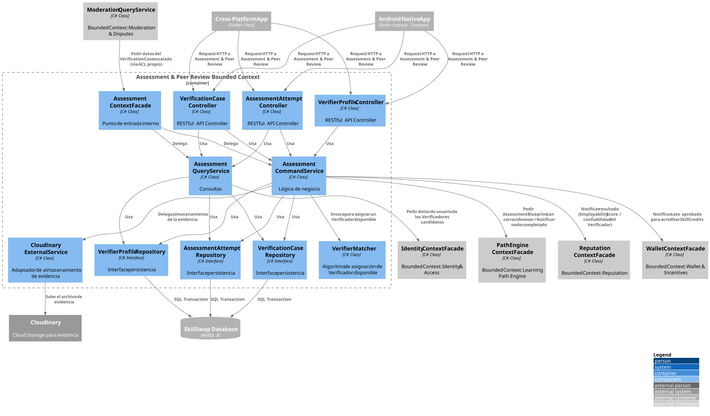
   
  <em>Figura XX. C4 Model: Component Diagram del Bounded Context Assessment & Peer Review - Elaboración propia. Nota: Se detalla la segregación entre los Controllers de `AssessmentAttempt`, `VerificationCase` y `VerifierProfile`, el Command/Query Service, el componente interno `VerifierMatcher` y el adaptador de almacenamiento de evidencia (Cloudinary), evidenciando la solicitud del blueprint hacia Learning Path Engine, las notificaciones hacia Reputation y Wallet & Incentives, la consulta de datos de usuario hacia Identity & Access, y la consulta entrante desde Moderation & Disputes sobre un caso escalado.</em>

##### 2.6.4.6.1. Bounded Context Domain Layer Class Diagrams

  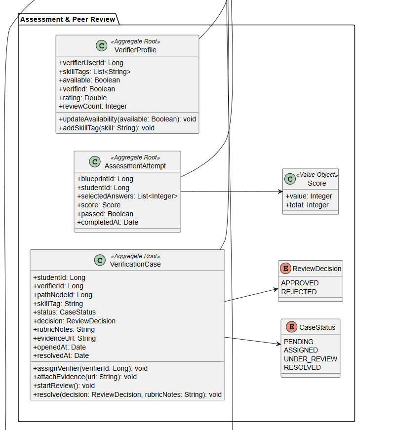
   
  <em>Figura XX. Diagrama de Clases UML del Domain Layer de Assessment & Peer Review - Elaboración propia. Nota: Recorte del diagrama de clases general correspondiente a este Bounded Context.</em>

El modelado de clases de Assessment & Peer Review pertenece a los agregados raíz `AssessmentAttempt`, `VerifierProfile` y `VerificationCase`, junto con el Value Object `Score`, debido a que estos elementos concentran de forma exclusiva la ejecución del intento del estudiante sobre la evaluación generada por la IA, la elegibilidad de un Estudiante como Verificador de otros, y el flujo de escalamiento hacia revisión humana cuando dicho intento no es aprobado — sin depender de ninguna sesión de comunicación en tiempo real, a diferencia del modelo de tutorías original.

##### 2.6.4.6.2. Bounded Context Database Design Diagram

  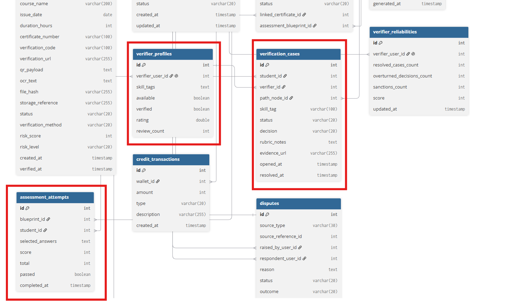
   
  <em>Figura XX. Diagrama de Base de Datos del Bounded Context Assessment & Peer Review - Elaboración propia. Nota: Recorte del diagrama relacional general correspondiente a este Bounded Context.</em>

El modelado de base de datos de Assessment & Peer Review pertenece a las tablas `assessment_attempts`, `verifier_profiles` y `verification_cases`, debido a que estas tres tablas persisten de forma independiente los tres agregados raíz del Bounded Context: el intento y resultado de una evaluación (`assessment_attempts`), la elegibilidad y disponibilidad de un Verificador (`verifier_profiles`), y el caso abierto cuando un intento no es aprobado, incluyendo su asignación y resolución con rúbrica estructurada (`verification_cases`). Se destaca el campo `evidence_url` en `verification_cases`, que reemplaza por completo la infraestructura de videollamada y chat en tiempo real del modelo de tutorías original.

---

### 2.6.5. Bounded Context: Reputation

#### 2.6.5.1. Domain Layer

La capa de dominio de Reputation concentra las reglas de negocio relacionadas con la confiabilidad del Verificador y el nivel de empleabilidad demostrado del Estudiante, calculadas ambas a partir de eventos internos del sistema — sin que ningún usuario califique directamente a otro, a diferencia del modelo de tutorías original.

**1. Aggregate Root: VerifierReliability**

Descripción: El agregado `VerifierReliability` representa la confiabilidad acumulada de un Verificador, calculada de forma explicable a partir de los casos que resolvió, las veces que su decisión fue revertida por Moderation & Disputes, y las sanciones aplicadas sobre su cuenta.

Atributos

| Atributo | Tipo | Descripción |
|---|---|---|
| id | int | Identificador único del registro de confiabilidad (autogenerado). |
| verifierUserId | int | Referencia al usuario `Student` (Identity & Access) con perfil de Verificador. |
| resolvedCasesCount | int | Cantidad total de `VerificationCase` resueltos por el Verificador. |
| overturnedDecisionsCount | int | Cantidad de decisiones revertidas por Moderation & Disputes tras una disputa. |
| sanctionsCount | int | Cantidad de sanciones aplicadas sobre la cuenta del Verificador. |
| score | ReliabilityScore (VO) | Puntaje de confiabilidad vigente. |
| updatedAt | timestamp | Fecha del último recálculo. |

Métodos

- `VerifierReliability(verifierUserId)` (Constructor): Inicializa los contadores en cero y el `score` en el valor base máximo.
- `recordResolution()`: Incrementa `resolvedCasesCount` y recalcula el `score` mediante `VerifierReliabilityCalculator`.
- `recordOverturn()`: Incrementa `overturnedDecisionsCount` y recalcula el `score`, aplicando la penalización correspondiente.
- `applySanction()`: Incrementa `sanctionsCount` y recalcula el `score`, aplicando la penalización más severa del modelo.

**2. Aggregate Root: StudentEmployabilityScore**

Descripción: El agregado `StudentEmployabilityScore` representa el nivel de empleabilidad demostrado de un Estudiante, calculado a partir de la cantidad de habilidades que ha logrado certificar (ya sea por aprobación automática de la IA o por revisión de un Verificador).

Atributos

| Atributo | Tipo | Descripción |
|---|---|---|
| id | int | Identificador único del registro (autogenerado). |
| studentId | int | Referencia al usuario `Student` (Identity & Access). |
| verifiedSkillsCount | int | Cantidad de habilidades certificadas hasta el momento. |
| score | EmployabilityScore (VO) | Puntaje de empleabilidad vigente. |
| updatedAt | timestamp | Fecha del último recálculo. |

Métodos

- `StudentEmployabilityScore(studentId)` (Constructor): Inicializa `verifiedSkillsCount` en cero y el `score` correspondiente.
- `recordSkillVerified()`: Incrementa `verifiedSkillsCount` y recalcula el `score` mediante `EmployabilityScoreCalculator`.

**3. Value Object: ReliabilityScore**

Atributos

| Atributo | Tipo | Descripción |
|---|---|---|
| value | int | Puntaje de confiabilidad, en el rango de 0 a 100. |

**4. Value Object: EmployabilityScore**

Atributos

| Atributo | Tipo | Descripción |
|---|---|---|
| value | int | Puntaje de empleabilidad, proporcional a la cantidad de habilidades certificadas. |

**5. Domain Service: VerifierReliabilityCalculator**

Descripción: Calcula el `ReliabilityScore` de un Verificador mediante un conjunto explicable de reglas, evitando una fórmula opaca difícil de sustentar.

Métodos

- `calculate(int resolvedCasesCount, int overturnedDecisionsCount, int sanctionsCount)`: Retorna el `ReliabilityScore` resultante, partiendo de un puntaje base de 100 y descontando 15 puntos por cada decisión revertida y 25 puntos por cada sanción, sin bajar de 0.

**6. Domain Service: EmployabilityScoreCalculator**

Descripción: Calcula el `EmployabilityScore` de un Estudiante a partir de la cantidad de habilidades certificadas.

Métodos

- `calculate(int verifiedSkillsCount)`: Retorna el `EmployabilityScore` resultante, proporcional a `verifiedSkillsCount`.

**7. Repository: VerifierReliabilityRepository, StudentEmployabilityScoreRepository**

Métodos

- `findByVerifierUserId(int verifierUserId)`, `save(VerifierReliability reliability)` (VerifierReliabilityRepository).
- `findByStudentId(int studentId)`, `save(StudentEmployabilityScore score)` (StudentEmployabilityScoreRepository).

En la Domain Layer de SkillSwap, dentro del Bounded Context de Reputation, `VerifierReliability` y `StudentEmployabilityScore` centralizan el recálculo explicable de sus respectivos puntajes mediante `VerifierReliabilityCalculator` y `EmployabilityScoreCalculator`, apoyándose exclusivamente en eventos internos generados por Assessment & Peer Review y Moderation & Disputes, sin exponer ningún endpoint donde un usuario califique directamente a otro.

#### 2.6.5.2. Interface Layer

**Resources**

| Nombre | Descripción |
|---|---|
| VerifierReliabilityResource | DTO de salida con el puntaje de confiabilidad y los contadores de un Verificador. |
| StudentEmployabilityResource | DTO de salida con el puntaje de empleabilidad y la cantidad de habilidades certificadas de un Estudiante. |

**Controllers**

| Nombre | Método HTTP | Ruta / Resource | Descripción |
|---|---|---|---|
| VerifierReliabilityController | GET | `/api/v1/verifier-reliability/{verifierUserId}` | Retorna el puntaje de confiabilidad vigente de un Verificador. |
| StudentEmployabilityController | GET | `/api/v1/student-employability/{studentId}` | Retorna el puntaje de empleabilidad vigente de un Estudiante. |

**Transformers / Assemblers**

| Nombre | Descripción |
|---|---|
| VerifierReliabilityResourceFromEntityAssembler | Convierte `VerifierReliability` en `VerifierReliabilityResource`. |
| StudentEmployabilityResourceFromEntityAssembler | Convierte `StudentEmployabilityScore` en `StudentEmployabilityResource`. |

A diferencia del BC de tutorías original, Reputation no expone ningún endpoint de creación consumido directamente por el cliente: ambos agregados se actualizan exclusivamente mediante los eventos descritos en la Application Layer.

#### 2.6.5.3. Application Layer

**Handlers**

| Nombre | Descripción | Resumen de Lógica |
|---|---|---|
| RecordCaseResolutionEventHandler | Procesa la resolución de un `VerificationCase` por un Verificador. | Recibe el evento desde Assessment & Peer Review, invoca `recordResolution()` sobre el `VerifierReliability` del Verificador; si la decisión fue `APPROVED`, invoca además `recordSkillVerified()` sobre el `StudentEmployabilityScore` del Estudiante. |
| RecordAutomaticApprovalEventHandler | Procesa la aprobación automática de un `AssessmentAttempt` sin intervención de un Verificador. | Recibe el evento desde Assessment & Peer Review, invoca `recordSkillVerified()` sobre el `StudentEmployabilityScore` del Estudiante. |
| RecordDisputeOverturnEventHandler | Procesa la reversión de una decisión de un Verificador. | Recibe el evento desde Moderation & Disputes, invoca `recordOverturn()` sobre el `VerifierReliability` correspondiente. |
| RecordSanctionEventHandler | Procesa una sanción aplicada sobre una cuenta. | Recibe el evento desde Moderation & Disputes; si la cuenta sancionada posee un `VerifierReliability`, invoca `applySanction()`. |
| GetVerifierReliabilityQueryHandler / GetStudentEmployabilityQueryHandler | Recuperan el puntaje vigente solicitado. | Consultan el repositorio correspondiente. |

**Internal DTOs**

| Nombre | Descripción |
|---|---|
| VerifierReliabilityDto | Objeto que transporta el puntaje de confiabilidad entre capas. |
| StudentEmployabilityDto | Objeto que transporta el puntaje de empleabilidad entre capas. |

En la Application Layer de Reputation, los cuatro event handlers aseguran que tanto la confiabilidad del Verificador como la empleabilidad del Estudiante permanezcan sincronizadas con cada evento relevante ocurrido en Assessment & Peer Review y Moderation & Disputes, sin que Reputation dependa de una acción explícita del usuario final.

#### 2.6.5.4. Infrastructure Layer

**Persistence (Repository Implementation)**

| Nombre | Descripción | Tecnologías / Herramientas |
|---|---|---|
| VerifierReliabilityRepositoryAdapter | Implementación concreta de `VerifierReliabilityRepository` sobre la tabla `verifier_reliabilities`. | ORM del stack backend, instancia MySQL desplegada en Render. |
| StudentEmployabilityScoreRepositoryAdapter | Implementación concreta de `StudentEmployabilityScoreRepository` sobre la tabla `student_employability_scores`. | ORM del stack backend, instancia MySQL desplegada en Render. |

**Integration Services**

| Nombre | Descripción | Resumen de Implementación |
|---|---|---|
| VerifierProfileNotifierAdapter | Comunica el `ReliabilityScore` actualizado hacia el Bounded Context Assessment & Peer Review. | Consumo HTTP interno hacia el endpoint de actualización de `VerifierProfile.rating` / `reviewCount` en Assessment & Peer Review, tras cada recálculo de `VerifierReliability`. |

Este adaptador permite que Assessment & Peer Review mantenga sincronizado el `rating` y `reviewCount` de cada `VerifierProfile` con el puntaje calculado en Reputation, sin acoplar directamente el modelo de persistencia de ambos Bounded Contexts.

#### 2.6.5.5. Bounded Context Software Architecture Component Level Diagrams

  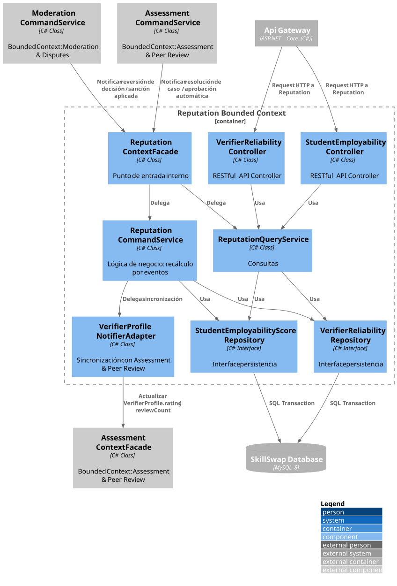
   
  <em>Figura XX. C4 Model: Component Diagram del Bounded Context Reputation - Elaboración propia. Nota: Se detalla la segregación entre los Controllers de solo lectura (`VerifierReliability`, `StudentEmployability`), el Command/Query Service y el adaptador de sincronización hacia Assessment & Peer Review, evidenciando que toda escritura ocurre exclusivamente mediante eventos entrantes de Assessment & Peer Review (resolución de caso/aprobación automática) y de Moderation & Disputes (reversión de decisión/sanción aplicada), sin ningún endpoint de creación consumido directamente por el cliente.</em>

##### 2.6.5.6.1. Bounded Context Domain Layer Class Diagrams

  
   
  <em>Figura XX. Diagrama de Clases UML del Domain Layer de Reputation - Elaboración propia. Nota: Recorte del diagrama de clases general correspondiente a este Bounded Context.</em>

El modelado de clases de Reputation pertenece a los agregados raíz `VerifierReliability` y `StudentEmployabilityScore`, junto con los Value Objects `ReliabilityScore` y `EmployabilityScore`, debido a que estos elementos concentran de forma exclusiva el recálculo explicable de la confiabilidad de un Verificador y del nivel de empleabilidad demostrado de un Estudiante, calculados ambos a partir de eventos internos del sistema — sin que ningún usuario califique directamente a otro, a diferencia del modelo de tutorías original.

##### 2.6.5.6.2. Bounded Context Database Design Diagram

  
   
  <em>Figura XX. Diagrama de Base de Datos del Bounded Context Reputation - Elaboración propia. Nota: Recorte del diagrama relacional general correspondiente a este Bounded Context.</em>

El modelado de base de datos de Reputation pertenece a las tablas `verifier_reliabilities` y `student_employability_scores`, debido a que estas dos tablas persisten de forma independiente los dos agregados raíz del Bounded Context, cada uno con su propio puntaje y contadores recalculados por evento — sin una tabla intermedia de reseñas o calificaciones directas, ya que ese concepto no existe en el nuevo modelo.

---

### 2.6.6. Bounded Context: Wallet & Incentives

#### 2.6.6.1. Domain Layer

La capa de dominio de Wallet & Incentives concentra las reglas de negocio de la billetera de SkillCredits — créditos internos no monetarios — que un Verificador acumula al resolver casos de verificación, y que cualquier usuario puede canjear por beneficios dentro de la plataforma. A diferencia del modelo de tutorías original, no existe transferencia de dinero real entre usuarios ni comisión de plataforma.

**1. Aggregate Root: Wallet**

Descripción: El agregado `Wallet` representa la billetera de SkillCredits de un usuario, manteniendo su saldo disponible.

Atributos

| Atributo | Tipo | Descripción |
|---|---|---|
| id | int | Identificador único de la billetera (autogenerado). |
| walletOwnerId | int | Usuario propietario de la billetera (único). |
| balance | int | Saldo actual disponible, en SkillCredits. |

Métodos

- `Wallet(walletOwnerId)` (Constructor): Crea la billetera con saldo inicial en cero, invocada al momento del registro del usuario en Identity & Access.
- `credit(Credits amount)`: Incrementa el saldo tras la acreditación de créditos ganados.
- `debit(Credits amount)`: Disminuye el saldo, validando que exista saldo suficiente antes del canje.

**2. Entity: CreditTransaction**

Descripción: Representa un movimiento realizado sobre una billetera, ya sea la acreditación de créditos ganados o el canje de créditos por un beneficio.

Atributos

| Atributo | Tipo | Descripción |
|---|---|---|
| id | int | Identificador único de la transacción. |
| walletId | int | Billetera involucrada en el movimiento. |
| amount | Credits (VO) | Cantidad de créditos del movimiento. |
| type | TransactionType (VO) | Tipo de movimiento: `EARNED` o `REDEEMED`. |
| description | string | Descripción del movimiento (ej. "Caso de verificación resuelto", "Canje: certificado de contribución"). |
| createdAt | timestamp | Fecha y hora de la transacción. |

Métodos

- `CreditTransaction(walletId, amount, type, description)` (Constructor): Valida que el monto sea positivo antes de crear el registro.

**3. Value Object: Credits**

Atributos

| Atributo | Tipo | Descripción |
|---|---|---|
| value | int | Cantidad de SkillCredits del movimiento, validada como no negativa. |

Métodos

- `Credits(int value)` (Constructor): Valida que el valor no sea negativo, lanzando una excepción de dominio en caso contrario.

**4. Value Object: TransactionType**

Atributos

| Atributo | Tipo | Descripción |
|---|---|---|
| value | enum | `EARNED` (créditos ganados por resolver un caso) o `REDEEMED` (créditos canjeados por un beneficio). |

**5. Value Object: RedemptionItem**

Descripción: Enumeración de los beneficios que un usuario puede canjear con sus SkillCredits.

Atributos

| Atributo | Tipo | Descripción |
|---|---|---|
| value | enum | `ADVANCED_PATH_UNLOCK` (desbloqueo de un nodo avanzado de la ruta), `CONTRIBUTION_CERTIFICATE` (certificado de contribución exportable, ej. para LinkedIn). |

**6. Domain Service: RedemptionPricing**

Descripción: Define el costo en SkillCredits de cada `RedemptionItem`, desacoplando el precio de canje del agregado `Wallet`.

Métodos

- `calculateCost(RedemptionItem item)`: Retorna la cantidad de `Credits` requerida para canjear el beneficio indicado.

**7. Repository: WalletRepository, CreditTransactionRepository**

Métodos

- `findByOwnerId(int userId)`, `save(Wallet wallet)` (WalletRepository).
- `save(CreditTransaction transaction)`, `findByWalletId(int walletId)` (CreditTransactionRepository).

En la Domain Layer de SkillSwap, dentro del Bounded Context de Wallet & Incentives, el agregado `Wallet` gestiona el saldo de SkillCredits de cada usuario, mientras que la entidad `CreditTransaction` registra cada movimiento validado por el Value Object `Credits`. El costo de cada beneficio canjeable se delega al Domain Service `RedemptionPricing`, manteniendo esta regla de negocio desacoplada del agregado — sin que exista, en ningún punto del dominio, un concepto de moneda real ni de comisión de plataforma.

#### 2.6.6.2. Interface Layer

**Resources**

| Nombre | Descripción |
|---|---|
| WalletResource | DTO de salida que representa el saldo actual de SkillCredits de una billetera. |
| CreditTransactionResource | DTO de salida que representa un movimiento (amount, type, description, createdAt). |
| RedeemResource | DTO de entrada con el `RedemptionItem` que el usuario desea canjear. |

**Controllers**

| Nombre | Método HTTP | Ruta / Resource | Descripción |
|---|---|---|---|
| WalletController | GET | `/api/v1/wallets/{userId}` | Retorna el saldo actual de SkillCredits de un usuario. |
| WalletController | GET | `/api/v1/wallets/{userId}/transactions` | Retorna el historial de movimientos de la billetera. |
| CreditTransactionController | POST | `/api/v1/credit-transactions/redeem` (RedeemResource) | Registra el canje de un `RedemptionItem`, descontando el costo correspondiente del saldo. |

**Transformers / Assemblers**

| Nombre | Descripción |
|---|---|
| WalletResourceFromEntityAssembler | Convierte `Wallet` en `WalletResource`. |
| CreditTransactionResourceFromEntityAssembler | Convierte `CreditTransaction` en `CreditTransactionResource`. |
| RedeemCommandFromResourceAssembler | Transforma `RedeemResource` en `RedeemCommand`. |

Del lado del cliente móvil, el endpoint de canje (`redeem`) requiere que el usuario complete la verificación mediante la API biométrica nativa del dispositivo (`BiometricPrompt` en Android, `local_auth` en Flutter) antes de que la aplicación invoque el endpoint; si el dispositivo no cuenta con lector de huella o no tiene huellas registradas, el propio sistema operativo ofrece automáticamente el PIN, patrón o contraseña del dispositivo como mecanismo alternativo de confirmación. A diferencia del modelo original, no existe endpoint de creación de billetera consumido por el cliente: `Wallet` se crea automáticamente al registrarse el usuario en Identity & Access.

#### 2.6.6.3. Application Layer

**Handlers**

| Nombre | Descripción | Resumen de Lógica |
|---|---|---|
| CreateWalletCommandHandler | Procesa la creación de la billetera inicial. | Recibe el evento desde Identity & Access tras el registro de un nuevo usuario, instancia `Wallet` con saldo en cero y lo persiste. |
| CreditVerifierCommandHandler | Procesa la acreditación de créditos ganados. | Recibe el evento desde Assessment & Peer Review tras la resolución `APPROVED` de un `VerificationCase`, ejecuta `credit()` sobre el `Wallet` del Verificador y registra la `CreditTransaction` de tipo `EARNED`. |
| RedeemCommandHandler | Procesa el canje de un beneficio. | Calcula el costo mediante `RedemptionPricing`, valida saldo suficiente, ejecuta `debit()` sobre el `Wallet` y registra la `CreditTransaction` de tipo `REDEEMED`. |
| GetWalletBalanceQueryHandler / GetWalletTransactionsQueryHandler | Recuperan el saldo o historial solicitado. | Consultan el repositorio correspondiente. |

**Internal DTOs**

| Nombre | Descripción |
|---|---|
| WalletDto | Objeto que transporta el saldo operativo de una billetera entre capas. |
| CreditTransactionDto | Objeto que transporta el detalle de un movimiento entre capas. |

En la Application Layer de Wallet & Incentives, `CreditVerifierCommandHandler` es el único punto donde se acreditan créditos, y depende exclusivamente de un evento de Assessment & Peer Review — nunca de una acción directa de otro usuario, eliminando así el flujo de donación P2P y su comisión asociada que existían en el modelo de tutorías.

#### 2.6.6.4. Infrastructure Layer

**Persistence (Repository Implementation)**

| Nombre | Descripción | Tecnologías / Herramientas |
|---|---|---|
| WalletRepositoryAdapter | Implementación concreta de `WalletRepository` sobre la tabla `wallets`. | ORM del stack backend, instancia MySQL desplegada en Render. |
| CreditTransactionRepositoryAdapter | Implementación concreta de `CreditTransactionRepository` sobre la tabla `credit_transactions`. | ORM del stack backend, instancia MySQL desplegada en Render. |

Este Bounded Context no incluye integraciones con pasarelas de pago externas ni siquiera como trabajo futuro: al ser SkillCredits un mecanismo puramente interno y no monetario, no existe punto de extensión hacia Stripe u otro proveedor equivalente, a diferencia de Credential Verification, donde sí se documentaron mecanismos de verificación oficial pendientes de integración.

#### 2.6.6.5. Bounded Context Software Architecture Component Level Diagrams

  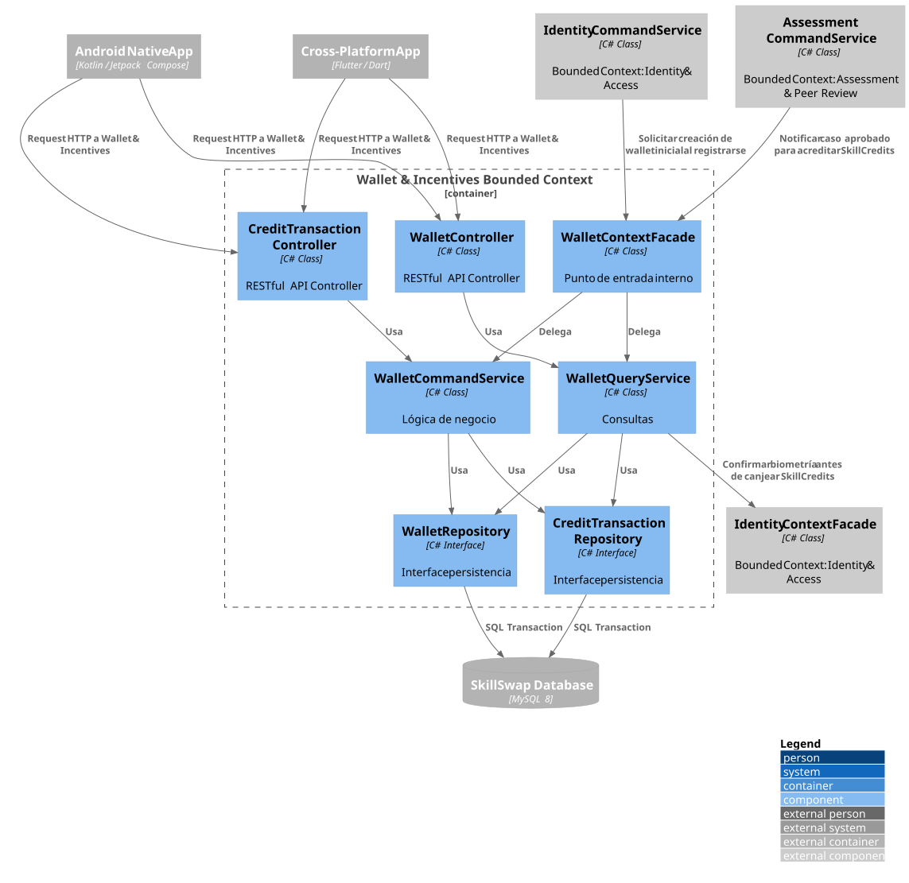
   
  <em>Figura XX. C4 Model: Component Diagram del Bounded Context Wallet & Incentives - Elaboración propia. Nota: Se detalla la segregación entre los Controllers de `Wallet` y `CreditTransaction`, el Command/Query Service y el Repository, evidenciando la creación de la billetera inicial solicitada por Identity & Access al registrarse, la acreditación de SkillCredits notificada por Assessment & Peer Review tras un caso aprobado, y la confirmación de biometría consultada hacia Identity & Access antes de un canje — sin ninguna integración con pasarelas de pago externas.</em>

##### 2.6.6.6.1. Bounded Context Domain Layer Class Diagrams

  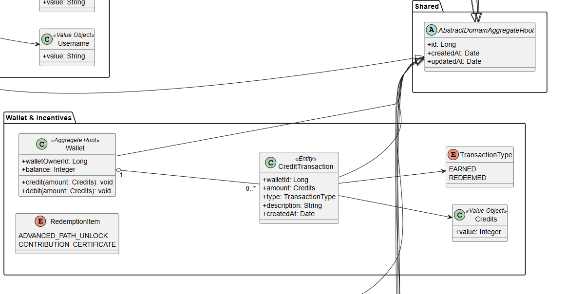
   
  <em>Figura XX. Diagrama de Clases UML del Domain Layer de Wallet & Incentives - Elaboración propia. Nota: Recorte del diagrama de clases general correspondiente a este Bounded Context.</em>

El modelado de clases de Wallet & Incentives pertenece al agregado raíz `Wallet`, junto con la entidad `CreditTransaction` y el Value Object `Credits`, debido a que estos elementos concentran de forma exclusiva el saldo de SkillCredits de cada usuario y el historial de movimientos — créditos ganados al resolver un caso de verificación, o canjeados por un beneficio — sin que exista, en ningún punto del dominio, un concepto de moneda real ni de comisión de plataforma.

##### 2.6.6.6.2. Bounded Context Database Design Diagram

  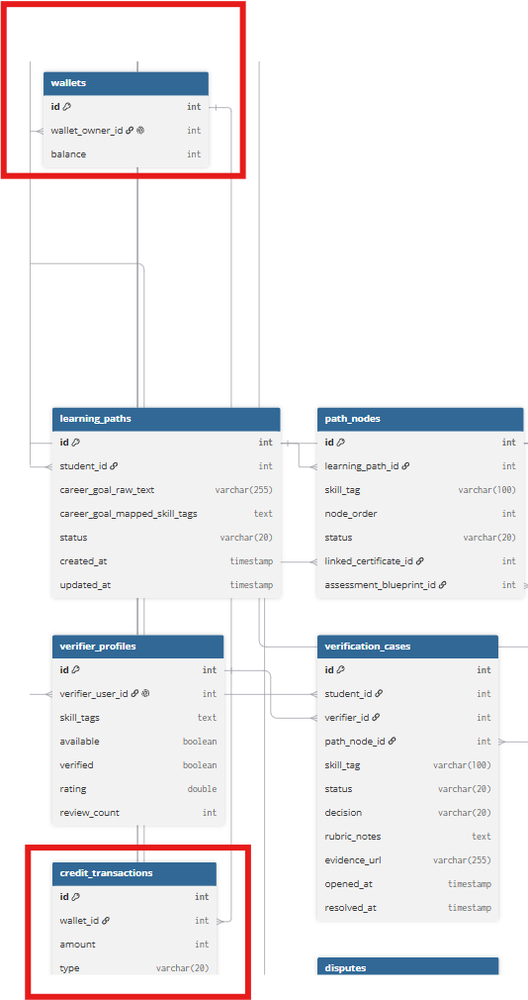
   
  <em>Figura XX. Diagrama de Base de Datos del Bounded Context Wallet & Incentives - Elaboración propia. Nota: Recorte del diagrama relacional general correspondiente a este Bounded Context.</em>

El modelado de base de datos de Wallet & Incentives pertenece a las tablas `wallets` y `credit_transactions`, debido a que la primera persiste el saldo vigente de SkillCredits de cada usuario y la segunda registra, en una relación uno a muchos, cada movimiento asociado a dicha billetera — sin ninguna tabla de credenciales de tarjeta ni de integración con una pasarela de pago externa, a diferencia del modelo de tutorías original.

---

### 2.6.7. Bounded Context: Moderation & Disputes

#### 2.6.7.1. Domain Layer

La capa de dominio de Moderation & Disputes concentra las reglas de negocio de la escalación final ante el Coordinador. A diferencia del modelo de tutorías original —donde solo existía un tipo de denuncia asociada a una sesión de chat—, este Bounded Context ahora generaliza **tres orígenes distintos de escalación**: un certificado marcado como `SUSPICIOUS` por Credential Verification, una apelación de un Estudiante sobre la decisión de un Verificador, y un reporte directo de mal comportamiento entre usuarios.

**1. Aggregate Root: Dispute**

Descripción: El agregado `Dispute` representa cualquier caso que requiere la decisión final del Coordinador, gobernando su ciclo de vida sin importar si fue originado por el sistema (escalación automática) o por un usuario (reporte o apelación).

Atributos

| Atributo | Tipo | Descripción |
|---|---|---|
| id | int | Identificador único del caso (autogenerado). |
| sourceType | DisputeSourceType (VO) | Origen de la escalación: `CERTIFICATE_REVIEW`, `VERIFIER_DECISION_APPEAL` o `USER_REPORT`. |
| sourceReferenceId | int | Identificador del `Certificate` o `VerificationCase` referenciado, según el `sourceType`. |
| raisedByUserId | int (nullable) | Usuario que originó el caso; nulo cuando la escalación es automática (`CERTIFICATE_REVIEW`). |
| respondentUserId | int (nullable) | Usuario cuya conducta, certificado o decisión está siendo cuestionada. |
| reason | string | Motivo detallado del caso. |
| status | DisputeStatus (VO) | Estado actual: `PENDING` o `RESOLVED`. |
| outcome | DisputeOutcome (VO, nullable) | Resultado de la resolución, nulo hasta que el Coordinador decide. |
| coordinatorNotes | string (nullable) | Observaciones del Coordinador al resolver. |
| raisedAt | timestamp | Fecha de apertura del caso. |
| resolvedAt | timestamp (nullable) | Fecha de resolución del caso. |

Métodos

- `Dispute(sourceType, sourceReferenceId, raisedByUserId, respondentUserId, reason)` (Constructor): Crea el caso en estado `PENDING`.
- `resolve(DisputeOutcome outcome, String coordinatorNotes)`: Valida mediante `DisputeResolutionValidator` que el `outcome` sea coherente con el `sourceType` del caso, transiciona el estado a `RESOLVED` y registra `resolvedAt`.

**2. Entity: Sanction**

Descripción: Representa la sanción aplicada a un usuario como resultado de un `Dispute` resuelto con `outcome = SANCTIONED`.

Atributos

| Atributo | Tipo | Descripción |
|---|---|---|
| id | int | Identificador único de la sanción. |
| disputeId | int | Caso que originó la sanción. |
| sanctionedUserId | int | Usuario sancionado. |
| type | SanctionType (VO) | Tipo de sanción: `WARNING`, `SUSPENSION` o `BAN`. |
| description | string | Motivo detallado de la sanción. |
| durationDays | int (nullable) | Duración de la sanción en días, si aplica. |

**3. Value Object: DisputeSourceType**

Atributos

| Atributo | Tipo | Descripción |
|---|---|---|
| value | enum | `CERTIFICATE_REVIEW`, `VERIFIER_DECISION_APPEAL`, `USER_REPORT`. |

**4. Value Object: DisputeStatus**

Atributos

| Atributo | Tipo | Descripción |
|---|---|---|
| value | enum | `PENDING`, `RESOLVED`. |

**5. Value Object: DisputeOutcome**

Atributos

| Atributo | Tipo | Descripción |
|---|---|---|
| value | enum | `UPHELD` (se confirma la decisión/certificado original), `OVERTURNED` (se revierte la decisión del Verificador), `DISMISSED` (el reporte no amerita sanción), `SANCTIONED` (el reporte amerita sanción). |

**6. Value Object: SanctionType**

Atributos

| Atributo | Tipo | Descripción |
|---|---|---|
| value | enum | `WARNING`, `SUSPENSION`, `BAN`. |

**7. Domain Service: DisputeResolutionValidator**

Descripción: Valida que un caso solo pueda resolverse estando en estado `PENDING`, y que el `outcome` aplicado sea coherente con su `sourceType` (por ejemplo, un `CERTIFICATE_REVIEW` no puede resolverse con `SANCTIONED`, ya que ese outcome es exclusivo de `USER_REPORT`).

Métodos

- `canResolve(Dispute dispute)`: Retorna verdadero si el caso se encuentra en estado `PENDING`.
- `isValidOutcome(DisputeSourceType sourceType, DisputeOutcome outcome)`: Retorna verdadero si la combinación es coherente según las reglas de negocio.

**8. Repository: DisputeRepository, SanctionRepository**

Métodos

- `findById(int id)`, `findByStatus(DisputeStatus status)`, `save(Dispute dispute)` (DisputeRepository).
- `save(Sanction sanction)`, `findByUserId(int userId)` (SanctionRepository).

En la Domain Layer de SkillSwap, dentro del Bounded Context de Moderation & Disputes, el agregado `Dispute` generaliza los tres orígenes de escalación posibles bajo un único modelo, evitando que Moderation dependa directamente de los modelos internos de `Certificate` o `VerificationCase` — exactamente el rol de Anticorruption Layer que se definió en el Context Mapping. Las transiciones se validan mediante `DisputeResolutionValidator`, y la entidad `Sanction` registra la consecuencia únicamente cuando el origen fue un reporte de usuario.

#### 2.6.7.2. Interface Layer

**Resources**

| Nombre | Descripción |
|---|---|
| DisputeResource | DTO de salida que representa un caso (sourceType, reason, status, outcome). |
| CreateUserReportResource | DTO de entrada para que un usuario reporte una conducta inapropiada. |
| ResolveDisputeResource | DTO de entrada con la decisión del Coordinador (`outcome`, `coordinatorNotes`). |

**Controllers**

| Nombre | Método HTTP | Ruta / Resource | Descripción |
|---|---|---|---|
| DisputeController | POST | `/api/v1/disputes/reports` (CreateUserReportResource) | Registra un nuevo reporte de usuario (`sourceType = USER_REPORT`). Los casos de `CERTIFICATE_REVIEW` y `VERIFIER_DECISION_APPEAL` se crean internamente vía eventos, no por este endpoint. |
| DisputeController | GET | `/api/v1/disputes?status=pending` | Retorna el listado de casos pendientes, consumido por el panel del Coordinador. |
| DisputeController | GET | `/api/v1/disputes/{disputeId}/evidence` | *(Ver Infrastructure Layer)* Retorna la evidencia asociada al caso: datos OCR/riesgo del certificado, o notas de rúbrica/evidencia del `VerificationCase`, según el `sourceType`. |
| DisputeController | PATCH | `/api/v1/disputes/{disputeId}/resolve` (ResolveDisputeResource) | Aplica la resolución del Coordinador sobre un caso. |

**Transformers / Assemblers**

| Nombre | Descripción |
|---|---|
| DisputeResourceFromEntityAssembler | Convierte `Dispute` en `DisputeResource`. |
| CreateUserReportCommandFromResourceAssembler | Transforma `CreateUserReportResource` en `CreateUserReportCommand`. |
| ResolveDisputeCommandFromResourceAssembler | Transforma `ResolveDisputeResource` en `ResolveDisputeCommand`. |

A diferencia del modelo original, ya no existe el endpoint `/api/v1/sessions/{sessionId}/messages` para revisar el historial de chat como evidencia — no hay sesión ni chat en el nuevo modelo. En su lugar, el endpoint de evidencia consulta directamente al Bounded Context de origen (Credential Verification o Assessment & Peer Review) según corresponda.

#### 2.6.7.3. Application Layer

**Handlers**

| Nombre | Descripción | Resumen de Lógica |
|---|---|---|
| CreateUserReportCommandHandler | Procesa un reporte directo de un usuario. | Instancia `Dispute` con `sourceType = USER_REPORT` y lo persiste mediante `DisputeRepository`. |
| EscalateCertificateReviewCommandHandler | Procesa la escalación automática de un certificado `SUSPICIOUS`. | Recibe el evento desde Credential Verification, instancia `Dispute` con `sourceType = CERTIFICATE_REVIEW` (`raisedByUserId = null`) y lo persiste. |
| EscalateVerifierDecisionAppealCommandHandler | Procesa la apelación de un Estudiante sobre una decisión `REJECTED` de un `VerificationCase`. | Instancia `Dispute` con `sourceType = VERIFIER_DECISION_APPEAL` y lo persiste. |
| ResolveDisputeCommandHandler | Procesa la resolución del Coordinador. | Valida con `DisputeResolutionValidator`, invoca `resolve()` sobre el agregado y despacha el efecto correspondiente según `sourceType`: si es `CERTIFICATE_REVIEW`, notifica a Credential Verification (`resolveDispute`); si es `VERIFIER_DECISION_APPEAL` con `outcome = OVERTURNED`, notifica a Reputation (reversión de decisión); si es `USER_REPORT` con `outcome = SANCTIONED`, crea la `Sanction` y notifica a Identity & Access (suspensión de cuenta) y a Reputation (sanción aplicada). |
| GetPendingDisputesQueryHandler | Recupera los casos pendientes para el panel del Coordinador. | Consulta `DisputeRepository.findByStatus(PENDING)`. |
| GetDisputeEvidenceQueryHandler | Recupera la evidencia asociada a un caso. | Según el `sourceType`, consulta a Credential Verification (datos del certificado) o a Assessment & Peer Review (rúbrica/evidencia del caso) mediante los adaptadores de integración. |

**Internal DTOs**

| Nombre | Descripción |
|---|---|
| DisputeDto | Objeto que transporta el detalle operativo de un caso entre capas. |
| DisputeEvidenceDto | Objeto que transporta la evidencia obtenida del Bounded Context de origen. |

En la Application Layer de Moderation & Disputes, `ResolveDisputeCommandHandler` es el único punto donde una decisión del Coordinador se traduce en efectos concretos sobre los demás Bounded Contexts, y lo hace de forma distinta según el origen del caso — evitando que Identity & Access, Reputation, Credential Verification o Assessment & Peer Review necesiten conocer la existencia de `Dispute` como concepto.

#### 2.6.7.4. Infrastructure Layer

**Persistence (Repository Implementation)**

| Nombre | Descripción | Tecnologías / Herramientas |
|---|---|---|
| DisputeRepositoryAdapter | Implementación concreta de `DisputeRepository` sobre la tabla `disputes`. | ORM del stack backend, instancia MySQL desplegada en Render. |
| SanctionRepositoryAdapter | Implementación concreta de `SanctionRepository` sobre la tabla `sanctions`. | ORM del stack backend, instancia MySQL desplegada en Render. |

**Integration Services**

| Nombre | Descripción |
|---|---|
| AccountSuspensionNotifierAdapter | Comunica la orden de sanción hacia Identity & Access para suspender la cuenta del usuario sancionado. |
| ReputationAdjustmentNotifierAdapter | Comunica hacia Reputation la reversión de una decisión de Verificador o la sanción aplicada, consumido por `RecordDisputeOverturnEventHandler` / `RecordSanctionEventHandler`. |
| CertificateQueryClient | Consulta hacia Credential Verification los datos OCR y el `RiskAssessment` del certificado en disputa, y envía la resolución final (`resolveDispute`) una vez decidida. |
| VerificationCaseQueryClient | Consulta hacia Assessment & Peer Review las notas de rúbrica y la evidencia adjuntada del `VerificationCase` apelado, como fuente de evidencia para el Coordinador. |

Estos adaptadores permiten que Moderation & Disputes coordine la resolución entre los cuatro Bounded Contexts afectados (Identity & Access, Reputation, Credential Verification y Assessment & Peer Review) sin duplicar en su propio modelo de persistencia la información de certificados, casos de verificación o cuentas.

#### 2.6.7.5. Bounded Context Software Architecture Component Level Diagrams

  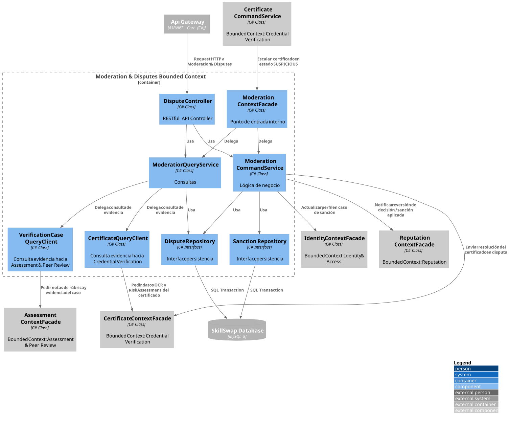
   
  <em>Figura XX. C4 Model: Component Diagram del Bounded Context Moderation & Disputes - Elaboración propia. Nota: Se detalla la segregación entre el Controller, el Command/Query Service y los adaptadores de consulta de evidencia hacia Credential Verification y Assessment & Peer Review, evidenciando la escalación automática de certificados en estado SUSPICIOUS, y las notificaciones salientes hacia Identity & Access (suspensión de cuenta) y Reputation (reversión de decisión/sanción aplicada) tras la resolución del Coordinador.</em>

##### 2.6.7.6.1. Bounded Context Domain Layer Class Diagrams

  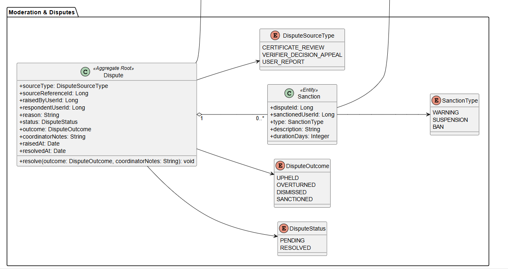
   
  <em>Figura XX. Diagrama de Clases UML del Domain Layer de Moderation & Disputes - Elaboración propia. Nota: Recorte del diagrama de clases general correspondiente a este Bounded Context.</em>

El modelado de clases de Moderation & Disputes pertenece al agregado raíz `Dispute`, junto con la entidad `Sanction`, debido a que estos elementos generalizan bajo un único modelo los tres orígenes de escalación posibles hacia el Coordinador (certificado sospechoso, apelación de una decisión de Verificador, o reporte directo de usuario), evitando que Moderation dependa directamente de los modelos internos de `Certificate` o `VerificationCase` — el rol de Anticorruption Layer definido en el Context Mapping.

##### 2.6.7.6.2. Bounded Context Database Design Diagram

  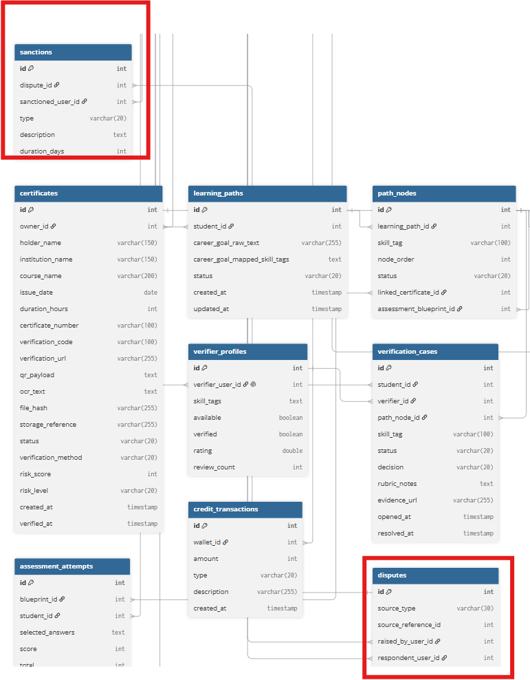
   
  <em>Figura XX. Diagrama de Base de Datos del Bounded Context Moderation & Disputes - Elaboración propia. Nota: Recorte del diagrama relacional general correspondiente a este Bounded Context.</em>

El modelado de base de datos de Moderation & Disputes pertenece a las tablas `disputes` y `sanctions`, debido a que la primera persiste, en un único modelo unificado, cualquier caso que requiera la decisión final del Coordinador —identificado mediante `source_type` y `source_reference_id`—, y la segunda registra, en una relación uno a muchos, la sanción aplicada únicamente cuando el origen del caso fue un reporte de usuario resuelto con el outcome `SANCTIONED`.

---

A continuación se presenta el diagrama relacional completo de SkillSwap, mostrando la totalidad de las tablas y sus relaciones entre los siete Bounded Contexts.

  
   
  <em>Figura XX. Diagrama de Base de Datos completo de SkillSwap - Elaboración propia. Nota: Se muestra la totalidad de las tablas correspondientes a los siete Bounded Contexts (Identity & Access, Credential Verification, Learning Path Engine, Assessment & Peer Review, Reputation, Wallet & Incentives, Moderation & Disputes), incluyendo el campo device_token sobre la tabla users para el soporte de notificaciones push, y los campos file_hash, storage_reference, ocr_text y qr_payload incorporados sobre la tabla certificates para el soporte de la captura desde cámara y la extracción on-device mediante ML Kit, feature de aprendizaje autónomo del proyecto. Elaborado en dbdiagram.io.</em>

En síntesis, el diagrama relacional evidencia una estructura de base de datos coherente, donde una única base de datos MySQL (`skillswap_db`) aloja de forma organizada las tablas de los siete Bounded Contexts, manteniendo alta cohesión dentro de cada contexto (por ejemplo, `assessment_attempts` y `verification_cases` en Assessment & Peer Review) y bajo acoplamiento entre ellos, referenciándose únicamente a través del identificador de usuario (`users.id`) como dato compartido. La incorporación del campo `device_token` y de los campos de extracción sobre `certificates` demuestra la extensión del modelo de datos original para soportar las funcionalidades propias de los clientes móviles nativo y cross-platform, sin alterar la estructura ni las relaciones ya validadas en la versión web de la plataforma.

A continuación se presenta el diagrama de clases UML completo de SkillSwap, mostrando la totalidad del modelo de dominio y su segmentación entre los siete Bounded Contexts.

  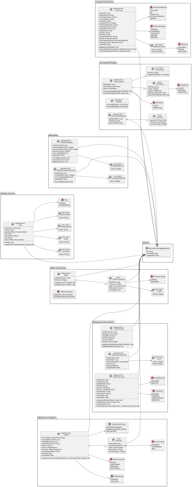
   
  <em>Figura XX. Diagrama de Clases UML completo de SkillSwap - Elaboración propia. Nota: Se presenta la totalidad del modelo de dominio, evidenciando cómo el modelo global ha sido segmentado en los siete Bounded Contexts (Identity & Access, Credential Verification, Learning Path Engine, Assessment & Peer Review, Reputation, Wallet & Incentives, Moderation & Disputes), incluyendo el Value Object `DeviceToken` en Identity & Access y los atributos de extracción OCR (`ocrText`, `qrPayload`, `fileHash`) en `Certificate` (Credential Verification), incorporados para el soporte de las funcionalidades propias de los clientes móviles. Elaborado en PlantUML.</em>

En síntesis, el diagrama de clases evidencia un modelo de dominio coherente, donde cada Bounded Context mantiene sus propios agregados raíz (`User`, `Certificate`, `LearningPath`, `AssessmentBlueprint`, `AssessmentAttempt`, `VerifierProfile`, `VerificationCase`, `VerifierReliability`, `StudentEmployabilityScore`, `Wallet`, `Dispute`) heredando de un `AbstractDomainAggregateRoot` compartido, manteniendo alta cohesión dentro de cada contexto y bajo acoplamiento entre ellos, sin referencias directas de clase a clase entre Bounded Contexts distintos — toda referencia cruzada se resuelve mediante un identificador simple (`Long`). La incorporación del Value Object `DeviceToken` en Identity & Access y de los atributos de extracción de `Certificate` en Credential Verification demuestra la extensión del modelo de dominio original para soportar las funcionalidades propias de los clientes móviles nativo y cross-platform, en particular la captura desde cámara y el procesamiento on-device mediante ML Kit que constituye el feature de aprendizaje autónomo del proyecto.

---

# Conclusiones
*   La adaptación del modelo de negocio de SkillSwap hacia una aplicación móvil nativa/multiplataforma responde directamente a la necesidad de inmediatez y accesibilidad de los estudiantes universitarios.
*   La investigación confirma que la integración de herramientas de videollamada y pasarelas de pago dentro de la misma aplicación, junto con el almacenamiento local, reducirá la fricción actual de usar herramientas fragmentadas.
*   La arquitectura basada en Domain-Driven Design provee una estructura robusta para integrar de manera segura los servicios RESTful internos y los SDKs de terceros requeridos para el aprendizaje sincrónico en dispositivos móviles.

# Bibliografía
* Davila, R. C., Aguero Corzo, E. del C., Portillo, H., & Quimbita, O. R. (2022). Deserción universitaria de los estudiantes de una universidad peruana. *Universidad y Sociedad, 14*(2), 421-427. [http://scielo.sld.cu/scielo.php?script=sci_arttext&pid=S2218-36202022000200421](http://scielo.sld.cu/scielo.php?script=sci_arttext&pid=S2218-36202022000200421)
* Escalante, J., Medina, C., & Vásquez, A. (2023). La deserción universitaria: un problema no resuelto en el Perú. *Hacedor - AIAPÆC, 7*(1), 60-72. [https://doi.org/10.26495/rch.v7i1.2421](https://doi.org/10.26495/rch.v7i1.2421)
* García-Ortiz, J., López de Castro Machado, C., & Rivero Frutos, L. (2021). Fracaso y abandono universitario: Percepción de los(as) estudiantes de Educación Social de la Universidad de Castilla-La Mancha. *Revista de Educación y Desarrollo Social, 8*(1), 54–73. [https://www.redalyc.org/journal/140/14070424012/html](https://www.redalyc.org/journal/140/14070424012/html)
* Gobierno del Perú. (2024). *Presupuesto público para el 2024 pone énfasis en educación, salud, atención de emergencias por desastres naturales y seguridad ciudadana*. [https://www.gob.pe/institucion/mef/noticias/868273](https://www.gob.pe/institucion/mef/noticias/868273)
* GoPeer. *Online tutoring made simple*. Recuperado de [https://gopeer.org/auth](https://gopeer.org/auth)
* Gutiérrez Pallares, J., Bernal Pérez, M. B., & Gutiérrez Pallares, E. (2024). Habilidades blandas: Pilares fundamentales para la empleabilidad en el siglo XXI. *RILCO DS: Revista de Desarrollo sustentable, Negocios, Emprendimiento y Educación, 6*(58), 65–76. [https://dialnet.unirioja.es/servlet/articulo?codigo=9789998](https://dialnet.unirioja.es/servlet/articulo?codigo=9789998)
* Instituto de Educación Superior Sabio Nacional Antúnez de Mayolo - TELESUP. (2019, junio). *Reglamento de Bienestar Estudiantil*. [https://isam.edu.pe/pdf/reglamento-de-bienestar-estudiantil.pdf](https://isam.edu.pe/pdf/reglamento-de-bienestar-estudiantil.pdf)
* Knack. *Peer tutoring for college students*. Recuperado de [https://www.joinknack.com/students](https://www.joinknack.com/students)
* Ministerio de Educación. (2021, 8 de noviembre). *Tasa de deserción en educación universitaria se redujo a 11.5 %*. Gob.pe. [https://www.gob.pe/institucion/minedu/noticias/552273](https://www.gob.pe/institucion/minedu/noticias/552273)
* uDocz. *Plataforma de estudio colaborativo*. Recuperado de [https://www.udocz.com/home](https://www.udocz.com/home)
* Universidad de Piura. (2020, 26 de octubre). *La importancia de las habilidades blandas en la educación*. [https://www.udep.edu.pe/admision/lima/la-importancia-de-las-habilidades-blandas-en-la-educacion](https://www.udep.edu.pe/admision/lima/la-importancia-de-las-habilidades-blandas-en-la-educacion)
* Villamizar-Loaiza, C. (2021). La legitimidad institucional como fuente de reputación corporativa. *Investigación y Desarrollo, 29*(2), 196–222. [https://www.redalyc.org/journal/268/26871326008/html](https://www.redalyc.org/journal/268/26871326008/html)

# Anexos

* **Wireframes (Figma):** [https://www.figma.com/design/l6Z6APfbLoci4YMSaZkILK/Wireframes-camino-feliz?node-id=121-1250&t=91cAQ4Kz2gcFrsPc-1](https://www.figma.com/design/l6Z6APfbLoci4YMSaZkILK/Wireframes-camino-feliz?node-id=121-1250&t=91cAQ4Kz2gcFrsPc-1)

* **Miro:** [https://miro.com/welcomeonboard/K0ozbG1wZXpCVmZ5NTN5NnJnekhrZEZJc3lIdDVqbEtYRWdBY1hhOW5uY1lyYUE3a05hbE9iU3JsNkhFZTVsNExoRXZZNkFvazROOTBSWTYrMVozTEczbHovZEd6MU1XUFNQdEZvWlVKUDBzL3VRTTJFT0p5OXhsaEcrR0dLOEJBS2NFMDFkcUNFSnM0d3FEN050ekl3PT0hdjE=?share_link_id=729861756205 ](https://miro.com/welcomeonboard/K0ozbG1wZXpCVmZ5NTN5NnJnekhrZEZJc3lIdDVqbEtYRWdBY1hhOW5uY1lyYUE3a05hbE9iU3JsNkhFZTVsNExoRXZZNkFvazROOTBSWTYrMVozTEczbHovZEd6MU1XUFNQdEZvWlVKUDBzL3VRTTJFT0p5OXhsaEcrR0dLOEJBS2NFMDFkcUNFSnM0d3FEN050ekl3PT0hdjE=?share_link_id=729861756205 )

* **Enlace del lucidchartd para los bounded context:** [https://lucid.app/lucidspark/5af3ee09-0b57-4a3a-9e9d-a0973c7463ae/edit?viewport_loc=-4867%2C-5483%2C15325%2C7900%2C0_0&invitationId=inv_0faec9a9-417f-47ae-8bde-c6aa100ce397](https://lucid.app/lucidspark/5af3ee09-0b57-4a3a-9e9d-a0973c7463ae/edit?viewport_loc=-4867%2C-5483%2C15325%2C7900%2C0_0&invitationId=inv_0faec9a9-417f-47ae-8bde-c6aa100ce397)

* **Landing Page (GitHub Pages):**
[https://github.com/Aplicaciones-Dispositivos-Moviles](https://github.com/Aplicaciones-Dispositivos-Moviles)

---

### Índice de Tablas

1. Perfiles integrantes de equipo
2. Lean UX Canvas
3. Análisis competitivo Landscape
4. Hallazgos entrevistas estudiantes universitarios
5. Hallazgos estudiantes tutores
6. Hallazgos coordinadores académicos
7. Actividades de aprendizaje y valoración
8. Actividades y motivaciones de estudiantes-tutores
9. Funciones y prioridades de coordinadores académicos
10. Ubiquitous Languages
11. Epics del proyecto
12. User Stories del proyecto
13. Product Backlog
14. Sistemas de búsqueda de la plataforma
15. Configuración del entorno de desarrollo de software
16. Sprint 1
17. Sprint Planning 1
18. Aspect Leaders and Collaborators
19. Sprint Backlog 1
20. Development Evidence for Sprint Review

---

###  Índice de Figuras

1. Entrevista 1: Estudiante-Aprendiz
2. Entrevista 2: Estudiante-Aprendiz
3. Entrevista 3: Estudiante-Aprendiz
4. Entrevista 1: Estudiante-Tutor
5. Entrevista 2: Estudiante-Tutor
6. Entrevista 3: Estudiante-Tutor
7. Entrevista 2: Coordinador Institucional (Parte 1)
8. Entrevista 2: Coordinador Institucional (Parte 2)
9. Entrevista 3: Coordinador Institucional
10. Entrevista 4: Coordinador Institucional
11. User Persona - Estudiantes que quieren aprender
12. User Persona - Estudiantes que quieren enseñar
13. User Persona - Coordinador Institucional
14. User Journey Mapping - Estudiantes que quieren aprender
15. User Journey Mapping - Estudiantes que quieren enseñar
16. User Journey Mapping - Coordinador Institucional
17. Empathy Mapping - Estudiantes aprendices
18. Empathy Mapping - Estudiantes tutores
19. Empathy Mapping - Coordinador Institucional
20. Derivación de requisitos (Event Storming)
21. Requerimientos de comunicación síncrona
22. Flujo financiero y KPIs
23. Gestión de identidad y perfiles
24. Búsqueda y selección de tutores
25. Interacción en tiempo real
26. Procesos de aprendizaje y retroalimentación
27. Módulos de soporte y administración
28. Flujo de gestión de usuarios
29. Flujo de búsqueda de tutores
30. Espacio de trabajo colaborativo
31. Ciclo de vida de cuestionarios
32. Sistema de reputación del tutor
33. Flujo financiero de la plataforma
34. Resolución de conflictos
35. Impact Mapping - Registro de estudiantes
36. Impact Mapping - Tutorías exitosas
37. Impact Mapping - Retención y participación
38. Logo Innovify
39. Landing page - Página inicio
40. Paleta de colores
41. Paleta de colores iOS Mobile
42. Tipografía iOS Mobile
43. Campos de texto iOS Mobile
44. Botones iOS Mobile
45. Pickers y alertas iOS Mobile
46. Enlace a redes sociales iOS Mobile
47. Paleta de colores Android Mobile
48. Tipografía Android Mobile
49. Campos de texto Android Mobile
50. Botones Android Mobile
51. Pickers y alertas Android Mobile
52. Enlace a redes sociales Android Mobile
53. Diagrama de flujo Estudiante aprendiz
54. Diagrama de flujo Estudiante tutor
55. Diagrama de flujo Coordinador institucional
56. Sistema de etiquetado en navegación móvil
57. Wireframe sección principal Landing Page
58. Wireframe estructura Landing Page
59. Wireframe página principal web
60. Mock-up sección principal Landing Page
61. Mock-up cuerpo Landing Page
62. Mock-up Landing Page móvil
63. Arquitectura de la Landing Page
64. Colección de wireframes Web
65. Colección de wireframes Web
66. Wireflow de búsqueda y solicitud de tutoría
67. Wireflow de recepción y aceptación de solicitud
68. Wireflow de calificación de sesión y gestión de favoritos
69. Wireflow de configuración de perfil y disponibilidad del tutor
70. Wireflow de búsqueda avanzada con filtros
71. Wireflow de realización de sesión de tutoría
72. Wireflow de dashboard y reputación del tutor
73. Wireflow de monitoreo del coordinador
74. Wireflow de personalización de la experiencia
75. Mock-ups de alta fidelidad aplicación móvil
76. Diseño de componentes Payments & Wallet
77. Diseño físico Identity & Profile Context
78. (omitida en fuente original)
79. Diseño físico Academic & Assessment Context
80. Diseño físico Monetization Context
81. Diseño físico Shared Kernel & Infrastructure
82. Diseño físico Reputation & Gamification
83. Diseño físico Communication & Notifications
84. Wireflow búsqueda y solicitud (mobile)
85. Wireflow recepción y aceptación (tutor)
86. Wireflow verificación de estudiantes
87. Wireflow calificación y favoritos
88. Wireflow configuración de perfil
89. Wireflow búsqueda avanzada (mobile)
90. Wireflow sesión de tutoría (mobile)
91. Wireflow moderación y disputas
92. C4 Model - Container Diagram
93. Componentes Workplace Context
94. Componentes Reputation System Context
95. Componentes Payments & Wallet
96. Moderation & Disputes Context
97. Componentes Learning & Assessment
98. Estructura Learning & Assessment (repositorio)
99. Discovery Bounded Context
100. C4 Model - Component Diagram
101. Diagrama de clases UML del dominio
102. Arquitectura DDD (Bounded Contexts)
103. Base de datos relacional por contextos
104. Organización del proyecto en GitHub
105. Gráfico de commits del proyecto
106. Network graph (Gitflow)
107. Seguimiento Sprint 1 en Trello
108. Historial de commits
109. Página de inicio (landing estática)
110. Sección “Sobre nosotros”
111. Formulario de autenticación
112. Formulario de registro
113. Sección de equipo
114. Código fuente index.html
115. Hoja de estilos CSS
116. Configuración GitHub Pages
117. Landing page publicada
118. Gráfico commits over time
119. Estadísticas de colaboradores
120. Listado de commits recientes
121. Pull Request estructurado
122. Pull Request con conflictos
 

## Anexo A. Enlaces de Acceso a la Solución

| Producto | Descripción | Enlace |
| :--- | :--- | :--- |
| **Landing Page** | Sitio web estático de presentación del modelo de negocio Innovify (SkillSwap). | [https://github.com/Aplicaciones-Dispositivos-Moviles/SkillSwap-LandingPage.git](https://github.com/Aplicaciones-Dispositivos-Moviles/SkillSwap-LandingPage.git) |
| **Android Native Application** | Aplicación móvil nativa (Kotlin / Jetpack Compose) donde interactúan Aprendices, Tutores y el Profesor, distribuida vía Firebase App Distribution. | [https://github.com/Aplicaciones-Dispositivos-Moviles/SkillSwap-MobileApp.git](https://github.com/Aplicaciones-Dispositivos-Moviles/SkillSwap-MobileApp.git) |
| **Cross-Platform Application (Flutter)** | Aplicación móvil multiplataforma (Flutter / Dart, dirigida a Android), distribuida vía Firebase App Distribution. | [https://github.com/Aplicaciones-Dispositivos-Moviles/SkillSwap-MobileApp-Flutter.git](https://github.com/Aplicaciones-Dispositivos-Moviles/SkillSwap-MobileApp-Flutter.git) |
| **Backend — Swagger UI** | Documentación interactiva de los Web Services RESTful (ASP.NET Core / C#). | [PENDIENTE] |
| **Backend — Repositorio** | Código fuente de los Web Services RESTful, organizados por los siete Bounded Contexts. | [https://github.com/Aplicaciones-Dispositivos-Moviles/SkillSwap-WebServices.git](https://github.com/Aplicaciones-Dispositivos-Moviles/SkillSwap-WebServices.git) |
| **Base de Datos** | Diagrama de base de datos relacional único, compartido por los siete Bounded Contexts (MySQL administrado en Render). Ver detalle en la sección. | [PENDIENTE] |
| **Video About-the-Team** | Video que resume el proceso de trabajo del equipo a lo largo del ciclo de vida del proyecto. | [PENDIENTE] |
| **Video About-the-Product** | Video promocional dirigido a visitantes de la Landing Page y usuarios de la plataforma. | [PENDIENTE] |

---

## Anexo B. Videos de Exposiciones

| Entrega | Características del video | Enlace del video |
| :--- | :--- | :--- |
| **AV1** | **Nombre del archivo:** upc-pre-202610-1asi0730-12190-Innovify-expo-av1   **Duración:**  |  |
| **AV2** | **Nombre del archivo:** upc-pre-202610-1asi0730-12190-Innovify-expo-av2   **Duración:**  |  |
| **TB2** | **Nombre del archivo:** upc-pre-202610-1asi0730-12190-Innovify-expo-tb2   **Duración:** |  |

---

## Anexo C. Videos de la documentación 

| Sección | Características del video | Sobre el contenido | Integración y entrega |
| :--- | :--- | :--- | :--- |
| **Validation Interviews** | Cantidad de videos: 1  Nomenclatura: upc-pre-202610-1asi0730---validation-sprint-  Formato: .mp4  Duración: En función a cantidad de entrevistas (considerar edición de 3 a 5 minutos por entrevista). | Consolida sesiones y entrevistas de validación en las que usuarios de los segmentos objetivo interactúen con el landing page y con los prototipos de experiencias web y mobile, manifestando sus observaciones. Para cada entrevista se debe incluir títulos con información del entrevistado, el segmento objetivo y la fecha de la entrevista. | |
| **About the Product** | Cantidad de videos: 1  Nomenclatura: upc-pre-202610-1asi0730---aboutthe-product-sprint-  Formato: .mp4  Duración: De 1 a 3 minutos. | Orientación promocional, resumiendo el modelo de negocio, las características y beneficios del producto, incluyendo algunas escenas de interacción con el producto y al menos una opinión por cada segmento objetivo. | **Video de Microsoft Stream:** |
| **About the Team** | Cantidad de videos: 1  Nomenclatura: upc-pre-202610-1asi0730---aboutthe-team-sprint-  Formato: .mp4  Duración: En función al contenido (considerar 5 minutos para la sección de retrospectiva del grupo y 1 minuto por cada testimonio de miembro del equipo). | Video que resume el proceso de trabajo realizado, incluyendo escenas de sesiones de trabajo real del equipo, complementando con narración (voz en off) del proceso. Incluye además el testimonio ante cámara de cada participante describiendo actividades realizadas, logro de outcomes y desarrollo de competencias alcanzados. | **Video de Microsoft Stream:** | |

