

  

<h3 align="center">Universidad Peruana de Ciencias Aplicadas</h3>

<h3 align="center">Carrera de Ingeniería de Software</h3>

 

<strong>1ACC0238</strong> 
<strong>Aplicaciones para Dispositivos Móviles</strong>

<h2 align="center">Informe de Trabajo Final</h2>

<strong>Equipo</strong> 
Innovify

<strong>Proyecto</strong> 
SkillSwap

<h3 align="center">Integrantes</h3>

| Código | Apellidos y nombres |
| :--- | :--- |
| U201924127 | Alberca Saavedra, Víctor Manuel |
| U20231C792 | Becerra Ninahuanca, Luis Angel |
| U20241D958 | Lopez Montalvo, Kevin Edu |
| U201724692 | Komatsu Dueñas, David |

<strong>Período 202620</strong>

Septiembre 2026

---

## Registro de Versiones del Informe

| Versión | Fecha | Autor | Descripción de modificación |
| :--- | :--- | :--- | :--- |
| **v.01.Avn1** | 10/09/2026 | Alberca, V., Becerra, L., Lopez, K., Komatsu, D. | Creación del documento para el curso de Aplicaciones para Dispositivos Móviles (Avance 1). Se incluyeron las secciones de Presentación (Startup Profile, Lean UX), Requirements Development and Software Solution Design, Conclusiones y Bibliografía. Se adaptaron los requerimientos hacia una arquitectura móvil nativa/cross-platform. |

---

## Project Report Collaboration Insights

En esta sección se indica el URL del repositorio utilizado para la elaboración colaborativa del Informe de Trabajo Final, así como las evidencias de participación de cada integrante del equipo durante el desarrollo de la entrega AV1.

**URL del repositorio del Project Report (GitHub):**
[ https://github.com/orgs/Aplicaciones-Moviles-SkillSwap/repositories ]( https://github.com/orgs/Aplicaciones-Moviles-SkillSwap/repositories )

### AV1

Durante el desarrollo de la entrega AV1, el equipo distribuyó la elaboración del informe asignando capítulos y secciones específicas a cada integrante según sus áreas de responsabilidad. Cada miembro realizó sus aportes directamente en el repositorio de GitHub mediante commits en ramas individuales, siguiendo la convención de Conventional Commits y GitFlow. Todos los integrantes participaron activamente en la redacción de secciones del informe en formato Markdown, asegurando coherencia y calidad en el contenido entregado.

*(Nota: Insertar aquí las capturas de los analíticos de colaboración, branches y commits de GitHub correspondientes al avance 1).*

---

## Student Outcome

El curso contribuye al cumplimiento del Student Outcome ABET:
**ABET EAC - Student Outcome 7:** La capacidad de adquirir y aplicar nuevos conocimientos según sea necesario, utilizando estrategias de aprendizaje apropiadas.

| Criterio específico | Acciones realizadas | Conclusiones |
| :--- | :--- | :--- |
| **La capacidad de adquirir y aplicar nuevos conocimientos...** | **Alberca Saavedra Víctor Manuel (AV1):** Lideré la investigación de la tecnología externa (SDK de videollamadas) a integrar en el proyecto móvil, evaluando sus requisitos técnicos y adaptándolos a la arquitectura móvil nativa. Participé en el diseño estratégico de los Bounded Contexts. | El equipo reconoce la necesidad del aprendizaje permanente al investigar e integrar de manera autónoma tecnologías no vistas en clase, como SDKs externos y persistencia local en dispositivos, aplicando conceptos de Domain-Driven Design al entorno móvil. |
| | **Becerra Ninahuanca Luis Angel (AV1):** Investigué patrones de diseño UI/UX específicos para aplicaciones móviles multiplataforma y colaboré en el análisis competitivo y el diseño de entrevistas enfocadas en la experiencia de movilidad de los estudiantes. | El equipo actualiza sus conocimientos sobre buenas prácticas de desarrollo móvil y requerimientos de usuarios para construir soluciones funcionales y pertinentes en dispositivos móviles. |
| | **Lopez Montalvo Kevin Edu (AV1):** Documenté el proceso Lean UX y apliqué el aprendizaje sobre persistencia de datos locales en dispositivos para el diseño de los requisitos, estructurando las User Stories bajo un enfoque Mobile-First. | El equipo aplica estrategias de aprendizaje eficaces para incorporar nuevos requerimientos técnicos a la solución de software, demostrando capacidad de adaptación. |
| | **Komatsu Dueñas, David (AV1):** Evalué diferentes estrategias de integración de servicios RESTful y modelé el flujo de mensajes entre los Bounded Contexts aplicando Domain Storytelling adaptado al consumo de APIs desde aplicaciones móviles. | Se evidencia la capacidad de asimilar nuevos paradigmas de comunicación y arquitectura de software, esenciales para el desarrollo profesional. |

## Objetivos SMART

*   **Alberca Saavedra Víctor Manuel:** Completar un curso de especialización en arquitecturas móviles (Kotlin/Swift) para diciembre de 2026, logrando aplicar al menos 3 patrones de diseño avanzados en proyectos personales.
*   **Becerra Ninahuanca Luis Angel:** Obtener una certificación en integración de servicios Cloud para aplicaciones móviles en los próximos 6 meses, mejorando la seguridad y reduciendo la latencia en el consumo de APIs.
*   **Lopez Montalvo Kevin Edu:** Dominar herramientas de testing automatizado para aplicaciones multiplataforma (ej. Appium) antes de culminar la carrera, logrando automatizar el 80% de los flujos críticos de la aplicación.
*   **Komatsu Dueñas, David:** Desarrollar habilidades de liderazgo técnico gestionando al menos 2 proyectos de software open source orientados a móviles en GitHub durante el próximo año, implementando GitFlow y CI/CD de forma efectiva.

---

# Capítulo I: Presentación

## 1.1. Startup Profile

### 1.1.1. Descripción de la Startup
**Innovify** es una startup cuyo propósito es reducir la deserción académica conectando a estudiantes universitarios para que compartan conocimientos a través de sesiones de tutoría en una aplicación móvil. La plataforma facilita un aprendizaje sincrónico (videollamadas nativas) y asincrónico (recursos locales e integración en la nube), bajo un modelo B2C (donaciones voluntarias) y B2B (Dashboard Analítico institucional). 

El sistema asegura la identidad mediante correos institucionales (`.edu.pe`) e integra **almacenamiento local** para preferencias de estudio y caché de mensajes, acceso a un **recurso interno del dispositivo** (cámara/micrófono para tutorías en vivo), integración con nuestro **servicio RESTful** de desarrollo interno, y acceso a un **servicio externo de terceros** (SDK para videollamadas o pasarela de pagos). Todo fundamentado bajo una arquitectura orientada al dominio (Domain-Driven Design).

### 1.1.2. Perfiles de integrantes del equipo

| Foto | Integrante | Carrera | Descripción |
| :---: | :--- | :--- | :--- |
| *(Foto)* | **Alberca Saavedra, Víctor Manuel** (U201924127) | Ingeniería de Software | Aporta conocimientos sólidos en arquitectura de software, backend y bases de datos. Contribuye con liderazgo técnico y organización del equipo para la transición al desarrollo móvil. |
| *(Foto)* | **Becerra Ninahuanca, Luis Angel** (U20231C792) | Ingeniería de Software | Especialista en lógica de negocio, integración de servicios y diseño de interfaces limpias. Aportará al diseño de la aplicación móvil y la Landing Page del modelo de negocio. |
| *(Foto)* | **Lopez Montalvo, Kevin Edu** (U20241D958) | Ingeniería de Software | Aporta conocimientos en diseño móvil, UX/UI y metodologías ágiles. Se enfocará en la investigación aplicada y la creación de prototipos técnicos móviles. |
| *(Foto)* | **Komatsu Dueñas, David** (U201724692) | Ingeniería de Software | Enfocado en investigación tecnológica, análisis de datos y control de calidad. Aportará con habilidades de comunicación asertiva y experiencia en levantamiento de requerimientos. |

 

## 1.2. Solution Profile

### 1.2.1. Antecedentes y problemática
En el Perú, el fracaso académico y la deserción universitaria afectan a miles de estudiantes. Según el MINEDU (2021), la tasa de interrupción de estudios en universidades licenciadas llegó a 11.5% en el ciclo 2021-1, siendo Lima una de las regiones más afectadas con 12.4%.

Un problema subyacente y desatendido es el **aislamiento del conocimiento**. Cada universidad funciona como una isla académica. Actualmente, no existe una aplicación móvil formal, segura y multiplataforma que conecte de manera inmediata y verificada a un estudiante que necesita ayuda con un par que domina esa área. Los alumnos se ven limitados a su círculo cercano o a grupos informales en redes sociales que carecen de seguridad institucional, lo que genera fricción al momento de coordinar desde sus smartphones.

*(Nota: En el documento final se expandirá la técnica de las 5W y 2H enfocada en el uso de dispositivos móviles).*

### 1.2.2. Lean UX Process

#### 1.2.2.1. Lean UX Problem Statements
* The current state of **la educación colaborativa universitaria en Perú** has focused mainly on **estudiantes compartiendo documentos de forma aislada en plataformas web, o coordinando informalmente por WhatsApp sin garantías de calidad ni validación académica**.
* What existing products/services fail to address is **la necesidad de una conexión inmediata, segura y validada institucionalmente directamente desde los dispositivos móviles, que ofrezca tutorías en tiempo real y recompense económicamente el esfuerzo del tutor**.
* Our product/service will address this gap by **ofreciendo una aplicación móvil nativa/multiplataforma basada en Domain-Driven Design, que integre videollamadas, chat asíncrono y donaciones, asegurando la identidad mediante correos institucionales (.edu.pe)**.
* Our initial focus will be **estudiantes universitarios de pregrado de Lima y provincias clave, tanto los que buscan mejorar sus notas (Aprendices) como los que desean monetizar sus conocimientos (Tutores) mediante su teléfono**.
* We'll know we are successful when we see **una adopción continua de la app móvil, evidenciada por un aumento del 40% mensual en tutorías completadas y donaciones procesadas dentro del entorno móvil durante los primeros 6 meses**.

#### 1.2.2.2. Lean UX Assumptions
*   **Business Assumptions:** Creemos que el cobro del 5% de comisión por donación mediante pasarelas de pago integradas en la app hará que el modelo sea financieramente sostenible.
*   **Business Outcome Assumptions:** El éxito se medirá por la cantidad de sesiones de videollamada completadas íntegramente en la aplicación móvil, reduciendo la dependencia de enlaces externos.
*   **User Assumptions:** Nuestros usuarios son "móviles-nativos"; prefieren buscar tutores, coordinar, estudiar y realizar transferencias directamente desde sus smartphones por conveniencia y rapidez.
*   **User Outcome Assumptions:** Los aprendices mejorarán su rendimiento académico al tener ayuda en su bolsillo; los tutores generarán ingresos y desarrollarán habilidades pedagógicas.
*   **Feature Assumptions:** El soporte de notificaciones *push*, el acceso a la cámara/micrófono del dispositivo y el almacenamiento local de sesiones recientes son características críticas para la retención del usuario.

#### 1.2.2.3. Lean UX Hypothesis Statements
* We believe we will achieve **alta adopción, retención y confianza por parte de los usuarios**
* If **estudiantes universitarios (Aprendices y Tutores)**
* Attain **una experiencia fluida, rápida y segura para coordinar y realizar clases desde cualquier lugar**
* With **una aplicación móvil nativa/multiplataforma que integre notificaciones push, videollamadas utilizando APIs de terceros, almacenamiento local para acceso offline parcial y validación automática de identidad (.edu.pe)**.

#### 1.2.2.4. Lean UX Canvas
*(Nota: Insertar imagen del Lean UX Canvas adaptado a la solución móvil de SkillSwap).*

## 1.3. Segmentos objetivo

1.  **Estudiantes que quieran aprender (Aprendices):** Universitarios (18-25 años) que enfrentan dificultades académicas. Son altamente dependientes de sus dispositivos móviles para consumir contenido rápido. Buscan ayuda inmediata y verificada sin tener que encender una computadora.
2.  **Estudiantes que quieran enseñar (Tutores):** Universitarios en ciclos intermedios/avanzados con alto dominio de materias. Buscan monetizar sus conocimientos y valoran la flexibilidad de gestionar sus solicitudes de tutoría, horarios y billetera virtual directamente desde su celular mediante notificaciones en tiempo real.
3.  **Coordinador Institucional:** Personal universitario (30-55 años) interesado en acceder a un Dashboard (Web) con métricas de rendimiento y prevención de deserción, garantizando la integridad de la red.

---

# Capítulo II: Requirements Development and Software Solution Design

## 2.1. Competidores

### 2.1.1. Análisis competitivo
*   **uDocz (Competidor Directo):** Plataforma web masiva centrada en el intercambio asíncrono de documentos (resúmenes, apuntes). No ofrece tutorías síncronas integradas en aplicaciones móviles.
*   **Knack (Competidor Directo):** Red de tutoría intra-universitaria. Aunque robusta, a menudo se limita a una sola universidad y sus procesos pueden ser burocráticos.
*   **GoPeer (Competidor Indirecto):** Universitarios enseñando a escolares. Su modelo y segmento de mercado (K-12) difiere del enfoque peer-to-peer universitario de Innovify.

### 2.1.2. Estrategias y tácticas frente a competidores
*   **Fuerte enfoque "Mobile-First":** A diferencia de uDocz que es principalmente web-based para lectura de PDFs, SkillSwap se enfocará en la inmediatez de la aplicación móvil, permitiendo coordinar y ejecutar la videollamada desde el smartphone.
*   **Networking Interuniversitario Valido:** Frente a modelos cerrados, Innovify utilizará validación automática por dominios `.edu.pe` para crear una red confiable a nivel nacional.
*   **Recompensa Económica Ágil:** Integración de SDKs de pago directamente en el dispositivo móvil para facilitar donaciones de un solo toque al finalizar la sesión.

## 2.2. Entrevistas
*(Nota: Documentar el diseño de las entrevistas, el registro en video y los análisis de características objetivas/subjetivas, enfocando las preguntas en el uso de smartphones, la comodidad de estudiar desde el celular y la disposición a usar pasarelas de pago móviles).*

## 2.3. Needfinding
*(Nota: Incluir en esta sección los User Personas actualizados, el User Task Matrix priorizando tareas móviles, el User Journey Mapping As-Is, el Empathy Mapping, el reporte del Big Picture EventStorming y el Ubiquitous Language en inglés).*

## 2.4. Requirements specification

### 2.4.1. User Stories
*(Nota: Adaptar la tabla de User Stories previa para incluir los requisitos del curso: persistencia local, acceso a hardware, consumo de API propia y SDK externo).*

**Ejemplos de User Stories clave para el entorno móvil:**
*   **US_Mobile01 (Permisos de Dispositivo):** *As a user, I want the app to request camera and microphone permissions before joining a session, so that I can securely broadcast my video and audio during the live tutoring.*
*   **US_Mobile02 (Almacenamiento Local):** *As a Learner, I want the app to locally store my search preferences and recent chat history using SQLite/Room/CoreData, so that the app loads faster and I can review messages even with a poor internet connection.*
*   **US_Mobile03 (Consumo SDK Externo):** *As a Tutor, I want to initiate a live video call directly within the app using an integrated third-party SDK (e.g., Agora or Jitsi), so that I don't have to share external links with the learner.*
*   **Spike Story (Investigación):** *Investigate and prototype the integration of the external Video SDK into the native mobile architecture, evaluating performance, battery consumption, and necessary device permissions.*

### 2.4.2. Impact Mapping
*(Nota: Insertar los diagramas de Impact Mapping conectando los Business Goals con los User Personas y las funcionalidades móviles).*

### 2.4.3. Product Backlog
*(Nota: Insertar la tabla del Product Backlog priorizado, estimando los Story Points de las historias adaptadas al desarrollo móvil).*

## 2.5. Strategic-Level Domain-Driven Design

### 2.5.1. EventStorming
*(Nota: Documentar las fases de Candidate Context Discovery y Domain Message Flows Modeling realizadas por el equipo).*

### 2.5.2. Context Mapping

El Context Mapping de Innovify (SkillSwap) evidencia las relaciones estructurales entre los siete Bounded Contexts que conforman la solución, aplicando los patrones de relación establecidos en Domain-Driven Design para gestionar las dependencias entre equipos y modelos de dominio.

**Identity & Access** actúa como **Upstream** de todo el sistema bajo el patrón **Conformist**: dado que su agregado `User` parte de una base entregada por el docente y expone únicamente `userId` y `role` como datos públicos, el resto de los Bounded Contexts (Discovery, Workspace, Learning & Assessment, Reputation, Payments & Wallet y Moderation & Disputes) se conforman a ese modelo sin negociar cambios, referenciando el identificador de usuario como un dato externo dentro de su propio esquema de persistencia.

**Discovery** mantiene una relación **Customer/Supplier** con **Identity & Access** (consume el directorio de usuarios/tutores) y con **Workspace** (le entrega el perfil del tutor seleccionado para iniciar una sesión).

**Workspace**, como núcleo operativo de la plataforma, es **Supplier** de **Learning & Assessment** (la finalización de una sesión habilita el quiz de evaluación) y de **Reputation** (el cierre de sesión dispara la solicitud de calificación al tutor), ambas bajo el patrón **Customer/Supplier**.

**Moderation & Disputes** se relaciona como **Customer/Supplier** hacia **Identity & Access** (emite órdenes de sanción sobre la cuenta) y hacia **Reputation** (ajusta la reputación del usuario sancionado tras una disputa resuelta).

Finalmente, **Workspace** y **Payments & Wallet** mantienen una relación de **Anticorruption Layer (ACL)** hacia los sistemas externos de terceros (WebRTC/almacenamiento en la nube para videollamadas, y la futura pasarela de pagos Stripe respectivamente), aislando el modelo de dominio interno de los contratos y formatos propios de dichos servicios externos.

  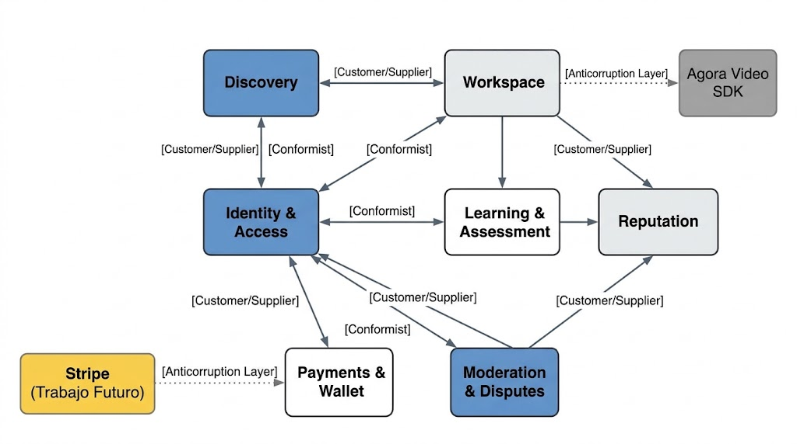
   
  <em>Figura XX. Context Mapping de Innovify - Elaboración propia. Nota: Se muestran las relaciones Conformist, Customer/Supplier y Anticorruption Layer entre los Bounded Contexts Identity & Access, Discovery, Workspace, Learning & Assessment, Reputation, Payments & Wallet y Moderation & Disputes.</em>

### 2.5.3. Software Architecture
**Software Architecture Context Level Diagram:**
Muestra la interacción de los usuarios (Aprendiz, Tutor, Coordinador) con el sistema central de SkillSwap y los servicios externos de terceros (SDK de videollamadas, Pasarela de Pagos, Servicio de Correos).

**Software Architecture Container Level Diagram:**
Detalla la estructura de contenedores:
1.  **Mobile Application (Native/Cross-Platform):** La interfaz principal para estudiantes, desarrollada con soporte de almacenamiento local y acceso a hardware.
2.  **Web Application (Landing Page & Admin Dashboard):** Sitio web estático para la presentación del negocio y panel SPA para los coordinadores.
3.  **API Gateway / RESTful Web Services:** El backend desarrollado internamente que orquesta la lógica de negocio.
4.  **Database:** Repositorio central de información.

**Software Architecture Deployment Diagram:**
Muestra cómo la aplicación móvil se despliega en los dispositivos físicos de los usuarios (iOS/Android), el Landing Page en un servicio de hosting estático, y el backend junto con la base de datos en una infraestructura Cloud.

#### 2.5.3.1. Software Architecture Context Level Diagrams

El diagrama de contexto (Context Diagram) bajo el enfoque C4 Model presenta al sistema Innovify (SkillSwap) como una caja central única, mostrando sus interacciones de alto nivel con los actores principales y los sistemas externos de terceros, sin exponer aún detalles de implementación.

El sistema es utilizado por tres actores principales: el **Estudiante Aprendiz** y el **Tutor**, quienes interactúan principalmente a través de la **aplicación móvil nativa (Android) y cross-platform (Flutter)** desarrollada en este curso, así como a través de la Web Application; y el **Coordinador Institucional**, quien supervisa la plataforma principalmente desde el panel administrativo web.

A nivel de sistemas externos, Innovify se integra con: la **pasarela de pagos Stripe** (documentada como trabajo futuro para el procesamiento real de comisiones), el **servicio de videollamadas WebRTC** (utilizado durante las sesiones de tutoría dentro del Workspace), y el **servicio de correo electrónico** para el envío de notificaciones institucionales (validación de dominio `.edu.pe`, confirmaciones de sesión, entre otros).

  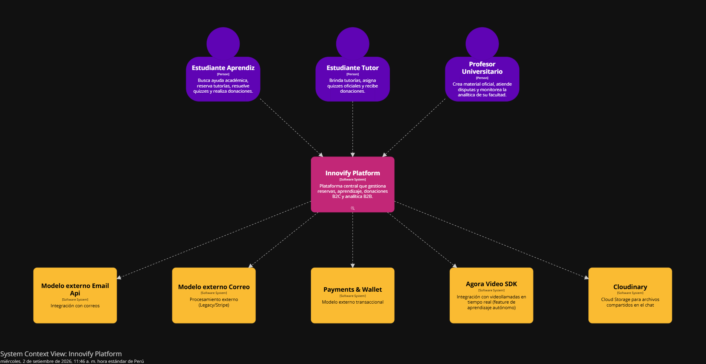
   
  <em>Figura XX. C4 Model: Context Diagram - Elaboración propia. Nota: Diagrama de contexto que muestra el sistema Innovify en el centro y sus interacciones directas con los actores principales (Estudiante Aprendiz, Tutor, Coordinador) a través de la aplicación móvil nativa, la aplicación cross-platform y la Web Application, así como con los sistemas externos de terceros (Pasarela de Pagos Stripe, servicio de videollamadas WebRTC, servicio de correo electrónico).</em>

#### 2.5.3.2. Software Architecture Container Level Diagrams

El diagrama de contenedores (Container Diagram) descompone el sistema Innovify en los bloques de alto nivel que lo conforman, mostrando las principales decisiones tecnológicas y cómo se comunican entre sí. A diferencia del Context Diagram, aquí se detalla la estructura interna del sistema como un conjunto de aplicaciones y almacenes de datos desplegables de forma independiente.

Los contenedores identificados son los siguientes:

- **Landing Page (Sitio Web Estático):** Presenta el modelo de negocio de Innovify al público general, implementado con HTML5, CSS3 y JavaScript.
- **Web Application (SPA):** Aplicación de escritorio dirigida principalmente al Coordinador Institucional para la supervisión de la plataforma, desarrollada en Vue 3.
- **Android Native Application:** Aplicación móvil nativa dirigida a Estudiantes Aprendices y Tutores, desarrollada en Kotlin con Jetpack Compose, que consume los mismos Web Services RESTful que la Web Application.
- **Cross-Platform Application (Flutter):** Aplicación móvil multiplataforma (Android e iOS) que replica las funcionalidades core para Estudiantes Aprendices y Tutores, desarrollada en Flutter con Dart, consumiendo igualmente los Web Services RESTful expuestos por el backend.
- **API / RESTful Web Services:** Backend desarrollado bajo arquitectura RESTful, actuando como Published Language único para los cuatro clientes (Landing Page, Web Application, Android Native App y Flutter App), orquestando la lógica de negocio de los siete Bounded Contexts.
- **Database:** Repositorio central de persistencia, donde cada Bounded Context mantiene sus propias tablas siguiendo los principios de Domain-Driven Design.

Es importante resaltar que tanto la aplicación Android nativa como la aplicación Flutter cross-platform consumen el **mismo contrato de API RESTful** documentado con OpenAPI/Swagger, sin requerir endpoints adicionales ni lógica de backend duplicada, evidenciando así el desacoplamiento entre la capa de presentación y la capa de dominio/aplicación del sistema.

  
   
  <em>Figura XX. C4 Model: Container Diagram - Elaboración propia. Nota: Diagrama de contenedores que muestra la Landing Page, la Web Application, la Aplicación Android Nativa, la Aplicación Cross-Platform (Flutter), el backend de Web Services RESTful y la Base de Datos, junto con sus interacciones y el sistema externo Cloudinary utilizado para almacenamiento de archivos.</em>

#### 2.5.3.3. Software Architecture Deployment Diagrams

El Deployment Diagram bajo el enfoque C4 Model muestra la distribución física de los contenedores de Innovify sobre la infraestructura de hardware y los entornos de ejecución, evidenciando cómo se despliega la solución en un ambiente real.

- **Dispositivos móviles de usuario final:** Los dispositivos Android de Estudiantes Aprendices y Tutores alojan localmente la Aplicación Android Nativa (Kotlin/Jetpack Compose) y/o la Aplicación Cross-Platform (Flutter), instaladas mediante distribución interna vía **Firebase App Distribution** durante el ciclo de pruebas, y descargables desde el dispositivo físico para la sustentación del curso.
- **Navegador web del usuario:** Aloja la Landing Page y la Web Application (SPA), servidas de forma estática desde el proveedor de hosting correspondiente (Firebase Hosting / Vercel).
- **Servidor de aplicación (Cloud):** Aloja el backend de Web Services RESTful, desplegado en **Render**, donde se ejecuta la lógica de negocio de los siete Bounded Contexts y se exponen los endpoints documentados con OpenAPI/Swagger, consumidos indistintamente por los cuatro clientes (Landing Page, Web Application, Android Native App, Flutter App).
- **Servidor de base de datos (Cloud):** Aloja la base de datos relacional en **Render**, separado del servidor de aplicación, comunicándose con este último mediante una conexión segura.
- **Servicios externos en la nube:** Cloudinary para el almacenamiento de archivos compartidos en el chat del Workspace, y los servicios de terceros documentados como trabajo futuro (Stripe para pagos, WebRTC para videollamadas).

Cada uno de estos nodos se comunica mediante protocolos HTTPS, garantizando la seguridad en la transmisión de datos entre los dispositivos cliente (móvil y web) y los servidores desplegados en la nube.

  
   
  <em>Figura XX. C4 Model: Deployment Diagram - Elaboración propia. Nota: Diagrama de despliegue que muestra la distribución física de la solución, incluyendo los dispositivos móviles de usuario final (Android/Flutter) con distribución vía Firebase App Distribution, el navegador web, el servidor de aplicación en Render, el servidor de base de datos y los servicios externos (Cloudinary, Stripe, WebRTC).</em>

## 2.6. Tactical-Level Domain-Driven Design

### 2.6.1. Bounded Context: Identity & Access

#### 2.6.1.1. Domain Layer

El Domain Layer de Identity & Access concentra las reglas de negocio relacionadas con la autenticación, autorización y verificación institucional de los usuarios de la plataforma.

- **Aggregate Root:** `User` — id, username, passwordHash, email, role, isVerified, deviceToken, bio. Encapsula las reglas de validación de dominio institucional (`.edu.pe`) y el control de unicidad de username/email.
- **Value Objects:** `Email` (valida formato y dominio institucional), `Role` (enumeración: Student, Coordinator — el rol de Tutor no es un valor de este enum, sino un perfil adicional (`TutorProfile`) que un usuario Student puede poseer, gestionado en el Bounded Context Discovery), `PasswordHash` (encapsula el hash generado, nunca expone el valor plano), `DeviceToken` (identificador del dispositivo móvil, reservado para una futura integración de notificaciones — pendiente de definir el proveedor/tecnología específica).
- **Domain Services:** `PasswordHasher` (abstracción para el hashing de contraseñas), `EmailDomainValidator` (valida que el correo pertenezca a un dominio institucional autorizado).
- **Repository (interface):** `UserRepository` — define los contratos `findByUsername`, `findByEmail`, `existsByEmail`, `save`, sin exponer detalles de persistencia.

#### 2.6.1.2. Interface Layer

Expone los puntos de entrada del Bounded Context hacia los clientes (Web, Android Nativo, Flutter):

- **Controllers:** `AuthenticationController` — expone los endpoints `POST /api/v1/authentication/sign-up` y `POST /api/v1/authentication/sign-in`, consumidos de forma idéntica por los tres clientes.
- **Resources (DTOs):** `SignUpResource`, `SignInResource` (request), `AuthenticatedUserResource` (response, incluye el token JWT).

#### 2.6.1.3. Application Layer

Orquesta los casos de uso del Bounded Context sin contener lógica de negocio propia del dominio:

- **Command Services:** `UserCommandService` — implementa `handle(SignUpCommand)` y `handle(SignInCommand)`, coordinando la validación de dominio, la generación de hash de contraseña y la emisión del token JWT.
- **Command Handlers:** `SignUpCommandHandler`, `SignInCommandHandler`.

#### 2.6.1.4. Infrastructure Layer

Contiene las implementaciones concretas de acceso a servicios externos:

- **Persistence:** `UserRepositoryAdapter` (implementación de `UserRepository` sobre la base de datos relacional desplegada en Render).
- **Security:** `JwtTokenGenerator` (generación y validación de tokens JWT), `BCryptPasswordHasher` (implementación concreta de `PasswordHasher`).
- **Extensión móvil (pendiente):** El campo `deviceToken` en el agregado `User` queda reservado como punto de extensión para una futura funcionalidad de notificaciones dirigida a los clientes móviles (Android Nativo y Flutter); su implementación concreta (proveedor y mecanismo de entrega) se definirá en una iteración posterior del proyecto.

#### 2.6.1.5. Bounded Context Software Architecture Component Level Diagrams

  
   
  <em>Figura XX. C4 Model: Component Diagram del Bounded Context Identity & Access - Elaboración propia. Nota: Se detalla la segregación entre Controllers, Command Services y los adaptadores de Persistencia, Seguridad (JWT) y Notificaciones Push (Firebase Cloud Messaging), este último como componente de infraestructura adicional requerido para el soporte de clientes móviles.</em>

#### 2.6.1.6. Bounded Context Software Architecture Code Level Diagrams

##### 2.6.1.6.1. Bounded Context Domain Layer Class Diagrams

  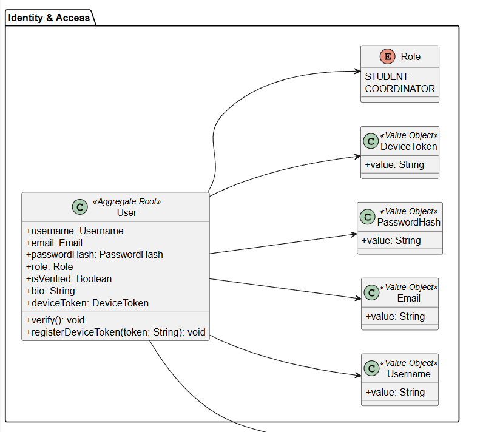
   
  <em>Figura XX. Diagrama de Clases UML del Domain Layer de Identity & Access - Elaboración propia. Nota: Se detalla el agregado User con sus atributos, incluyendo el Value Object DeviceToken agregado para el soporte de notificaciones push en los clientes móviles.</em>

##### 2.6.1.6.2. Bounded Context Database Design Diagram

  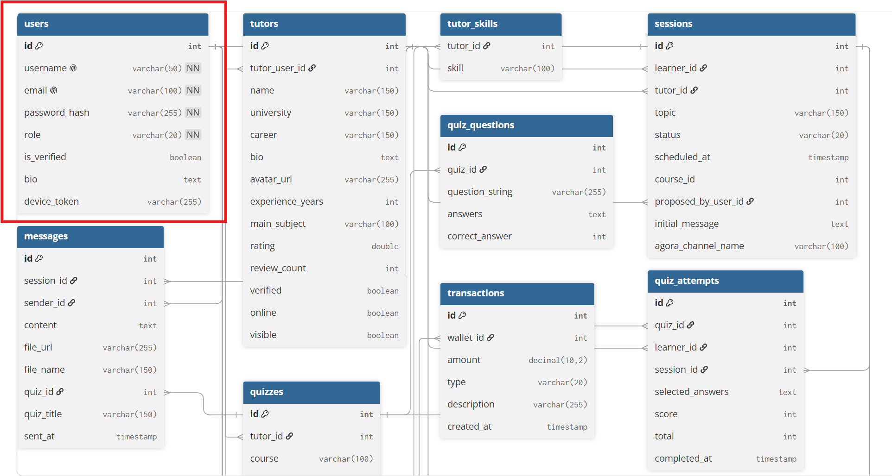
   
  <em>Figura XX. Diagrama de Base de Datos del Bounded Context Identity & Access - Elaboración propia. Nota: Se destaca en el esquema el campo device_token, agregado sobre la tabla users para el registro de dispositivos móviles.</em>

---

### 2.6.2. Bounded Context: Discovery

#### 2.6.2.1. Domain Layer

El Domain Layer de Discovery concentra las reglas de negocio relacionadas con la búsqueda y filtrado de tutores disponibles en la plataforma.

- **Aggregate Root:** `TutorProfile` — id, userId (referencia externa a Identity & Access), university, career, subjects, availability, averageRating (dato derivado, sincronizado desde Reputation).
- **Value Objects:** `University`, `Career`, `SubjectList` (encapsula la lista de materias que el tutor puede enseñar).
- **Domain Services:** `TutorSearchCriteria` — encapsula y valida la combinación de filtros de búsqueda (universidad, carrera, materia) aplicados sobre el listado de tutores.
- **Repository (interface):** `TutorProfileRepository` — define los contratos `findByFilters`, `findById`, `save`, sin exponer detalles de persistencia.

#### 2.6.2.2. Interface Layer

- **Controllers:** `DiscoveryController` — expone el endpoint `GET /api/v1/tutors` con soporte de query params para los filtros de universidad, carrera y materia, consumido de forma idéntica por los clientes Web, Android Nativo y Flutter.
- **Resources (DTOs):** `TutorProfileResource` (response), `TutorSearchFilterResource` (request con los parámetros de búsqueda).

#### 2.6.2.3. Application Layer

- **Query Services:** `TutorQueryService` — implementa `handle(SearchTutorsQuery)` y `handle(GetTutorByIdQuery)`, orquestando la consulta al repositorio según los criterios de búsqueda recibidos.
- **Query Handlers:** `SearchTutorsQueryHandler`, `GetTutorByIdQueryHandler`.

#### 2.6.2.4. Infrastructure Layer

- **Persistence:** `TutorProfileRepositoryAdapter` (implementación de `TutorProfileRepository` sobre la base de datos relacional desplegada en Render).
- **Integración con Identity & Access:** `IdentityServiceClient` — cliente HTTP que solicita al Bounded Context Identity & Access el directorio de usuarios con rol Tutor, necesario para poblar el listado inicial de perfiles disponibles en Discovery.

#### 2.6.2.5. Bounded Context Software Architecture Component Level Diagrams

  
   
  <em>Figura XX. C4 Model: Component Diagram del Bounded Context Discovery - Elaboración propia. Nota: Se detalla la segregación entre el Controller, el Query Service y los adaptadores de Persistencia e integración con Identity & Access, evidenciando cómo Discovery solicita el listado de usuarios con rol Tutor para poblar los perfiles de búsqueda.</em>

#### 2.6.2.6. Bounded Context Software Architecture Code Level Diagrams

##### 2.6.2.6.1. Bounded Context Domain Layer Class Diagrams

  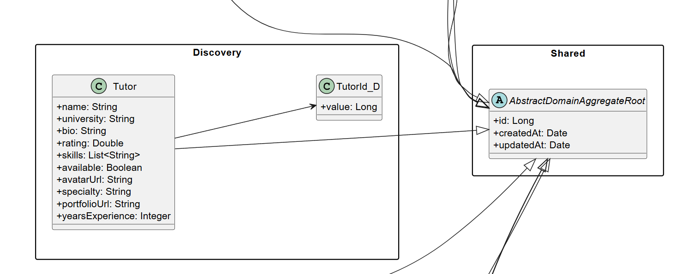
   
  <em>Figura XX. Diagrama de Clases UML del Domain Layer de Discovery - Elaboración propia. Nota: Se detalla el agregado TutorProfile con sus atributos, Value Objects (University, Career, SubjectList) y sus relaciones.</em>

##### 2.6.2.6.2. Bounded Context Database Design Diagram

  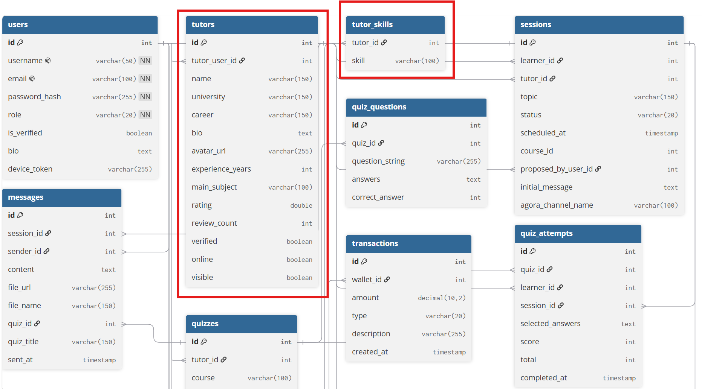
   
  <em>Figura XX. Diagrama de Base de Datos del Bounded Context Discovery - Elaboración propia.</em>

---

### 2.6.3. Bounded Context: Workspace

#### 2.6.3.1. Domain Layer

El Domain Layer de Workspace concentra las reglas de negocio del núcleo operativo de la plataforma: la gestión de sesiones de tutoría, la mensajería entre participantes y la coordinación de la videollamada.

- **Aggregate Root:** `TutoringSession` — id, learnerId, tutorId, status (Requested, Accepted, InProgress, Completed, Cancelled), scheduledAt, agoraChannelName (canal de videollamada asociado a la sesión).
- **Entities:** `Message` (id, sessionId, senderId, content, attachmentUrl, sentAt).
- **Value Objects:** `SessionStatus` (enumeración de estados válidos y transiciones permitidas), `AgoraChannelName` (identificador único y determinístico del canal de videollamada, generado a partir del id de la sesión).
- **Domain Services:** `SessionStateTransitionValidator` — valida que las transiciones de estado de una sesión (por ejemplo, de Accepted a InProgress) cumplan las reglas de negocio establecidas.
- **Repository (interface):** `TutoringSessionRepository`, `MessageRepository`.

#### 2.6.3.2. Interface Layer

- **Controllers:** `TutoringSessionController` — expone los endpoints `POST /api/v1/sessions`, `PATCH /api/v1/sessions/{sessionId}/status`, `GET /api/v1/sessions/{sessionId}/messages`, `POST /api/v1/sessions/{sessionId}/messages`.
- **Resources (DTOs):** `TutoringSessionResource`, `MessageResource`, `AgoraTokenResource` (respuesta con el token temporal de acceso al canal de videollamada).

#### 2.6.3.3. Application Layer

- **Command Services:** `TutoringSessionCommandService` — implementa `handle(RequestSessionCommand)`, `handle(UpdateSessionStatusCommand)`, `handle(SendMessageCommand)`.
- **Command Handlers:** `RequestSessionCommandHandler`, `UpdateSessionStatusCommandHandler`, `SendMessageCommandHandler`.
- **Event Handlers:** `SessionCompletedEventHandler` — al completarse una sesión, publica el evento de dominio que habilita la evaluación en Learning & Assessment y la solicitud de calificación en Reputation.

#### 2.6.3.4. Infrastructure Layer

- **Persistence:** `TutoringSessionRepositoryAdapter`, `MessageRepositoryAdapter` (sobre la base de datos relacional desplegada en Render).
- **File Storage:** `CloudinaryFileStorageAdapter` — gestiona la carga y obtención de archivos adjuntos compartidos en el chat de la sesión.
- **Videollamada (Agora):** `AgoraVideoCallAdapter` — encapsula la integración con el SDK de **Agora** (Video Call SDK), generando el token temporal de acceso al canal (`agoraChannelName`) que consumen los clientes Android Nativo (Agora Android SDK) y Flutter (Agora Flutter SDK) para establecer la videollamada en tiempo real entre tutor y aprendiz. Esta integración constituye el **feature de aprendizaje autónomo** del proyecto, al tratarse de un SDK de terceros no abordado en las sesiones del curso, seleccionado por ofrecer una capa gratuita adecuada para el alcance académico y soporte oficial multiplataforma (Android/Flutter/Web).
- **Almacenamiento Local (recurso interno del dispositivo):** `LocalChatCacheAdapter` — del lado del cliente móvil, cada mensaje recibido (`Message`) y sus archivos adjuntos ya descargados se persisten en una base de datos local embebida (Room en Android Nativo, sqflite/Drift en Flutter, conforme al sílabo del curso), permitiendo que el estudiante o tutor pueda revisar el historial de chat de una sesión, incluyendo los archivos previamente vistos, aun sin conexión a internet. Al recuperar la conectividad, el cliente sincroniza los mensajes pendientes contra el backend.

#### 2.6.3.5. Bounded Context Software Architecture Component Level Diagrams

  
   
  <em>Figura XX. C4 Model: Component Diagram del Bounded Context Workspace - Elaboración propia. Nota: Se detalla la segregación entre Controllers, Command/Event Services, y los adaptadores de Persistencia, Cloudinary (almacenamiento de archivos), Agora (videollamada en tiempo real, feature de aprendizaje autónomo) y el caché local de chat (Room/sqflite), este último habilitando la lectura del historial de mensajes y archivos ya descargados sin conexión a internet.</em>

#### 2.6.3.6. Bounded Context Software Architecture Code Level Diagrams

##### 2.6.3.6.1. Bounded Context Domain Layer Class Diagrams

  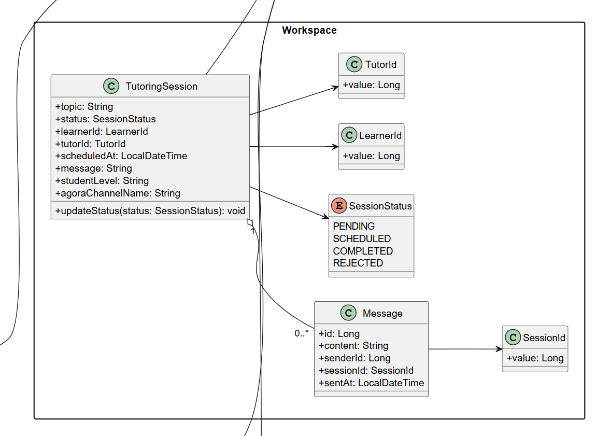
   
  <em>Figura XX. Diagrama de Clases UML del Domain Layer de Workspace - Elaboración propia. Nota: Se detalla el agregado TutoringSession, la entidad Message y el Value Object AgoraChannelName incorporado para la integración con el SDK de videollamadas.</em>

##### 2.6.3.6.2. Bounded Context Database Design Diagram

  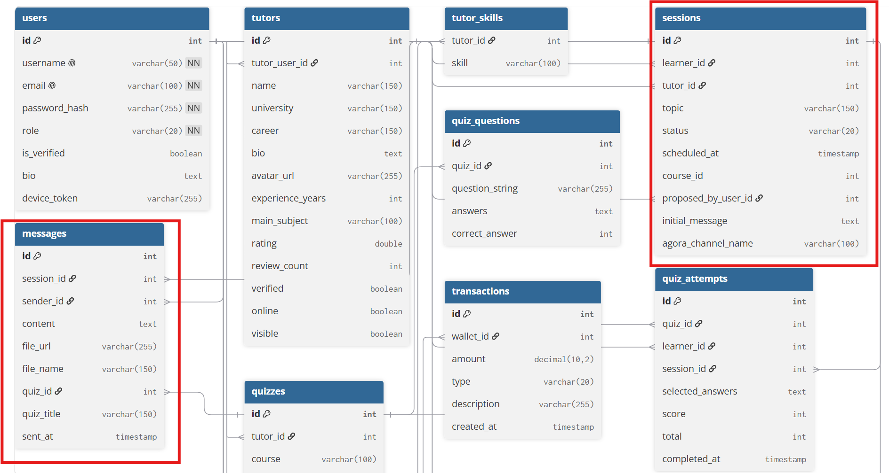
   
  <em>Figura XX. Diagrama de Base de Datos del Bounded Context Workspace - Elaboración propia. Nota: Se destaca en el esquema el campo agora_channel_name, agregado sobre la tabla tutoring_sessions para el soporte de videollamadas reales.</em>

---

### 2.6.4. Bounded Context: Learning & Assessment

#### 2.6.4.1. Domain Layer

El Domain Layer de Learning & Assessment concentra las reglas de negocio relacionadas con la creación de cuestionarios (quizzes) y el registro de resultados de evaluación de los estudiantes.

- **Aggregate Root:** `Quiz` — id, tutorId, sessionId, title, questions (lista de preguntas embebidas).
- **Aggregate Root:** `QuizAttempt` — id, quizId, learnerId, answers, score, completedAt. El cálculo del puntaje (`score`) se ejecuta como regla de negocio del propio agregado a partir de las respuestas recibidas, garantizando que la calificación no pueda ser manipulada por el cliente.
- **Entities:** `Question` (id, text, options, correctOptionIndex).
- **Value Objects:** `Score` (encapsula el puntaje obtenido y su validación de rango 0-100).
- **Repository (interface):** `QuizRepository`, `QuizAttemptRepository`.

#### 2.6.4.2. Interface Layer

- **Controllers:** `QuizController` — expone los endpoints `POST /api/v1/quizzes`, `GET /api/v1/quizzes/{quizId}`, `POST /api/v1/quiz-attempts`, `GET /api/v1/quiz-attempts/{attemptId}`.
- **Resources (DTOs):** `QuizResource`, `QuizAttemptResource`, `SubmitQuizAttemptResource` (request con las respuestas del estudiante).

#### 2.6.4.3. Application Layer

- **Command Services:** `QuizCommandService` — implementa `handle(CreateQuizCommand)`, `handle(SubmitQuizAttemptCommand)`.
- **Command Handlers:** `CreateQuizCommandHandler`, `SubmitQuizAttemptCommandHandler` — este último invoca la lógica de cálculo de puntaje del agregado `QuizAttempt` de forma centralizada en el servidor, evitando la duplicación de esta regla de negocio entre los clientes Web, Android Nativo y Flutter.
- **Query Services:** `QuizQueryService` — implementa `handle(GetQuizByIdQuery)`, `handle(GetAttemptResultQuery)`.

#### 2.6.4.4. Infrastructure Layer

- **Persistence:** `QuizRepositoryAdapter`, `QuizAttemptRepositoryAdapter` (sobre la base de datos relacional desplegada en Render). La lista de preguntas (`questions`) del agregado `Quiz` se persiste mediante un converter JSON, evitando una tabla relacional adicional para una estructura de solo lectura desde el dominio.

#### 2.6.4.5. Bounded Context Software Architecture Component Level Diagrams

  
   
  <em>Figura XX. C4 Model: Component Diagram del Bounded Context Learning & Assessment - Elaboración propia. Nota: Se detalla la segregación entre Controllers, Command/Query Services y el adaptador de Persistencia, evidenciando que el cálculo del puntaje se centraliza en el servidor para garantizar consistencia entre los distintos clientes.</em>

#### 2.6.4.6. Bounded Context Software Architecture Code Level Diagrams

##### 2.6.4.6.1. Bounded Context Domain Layer Class Diagrams

  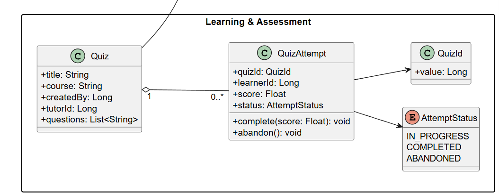
   
  <em>Figura XX. Diagrama de Clases UML del Domain Layer de Learning & Assessment - Elaboración propia. Nota: Se detalla el agregado Quiz con su entidad Question embebida, y el agregado QuizAttempt con el Value Object Score.</em>

##### 2.6.4.6.2. Bounded Context Database Design Diagram

  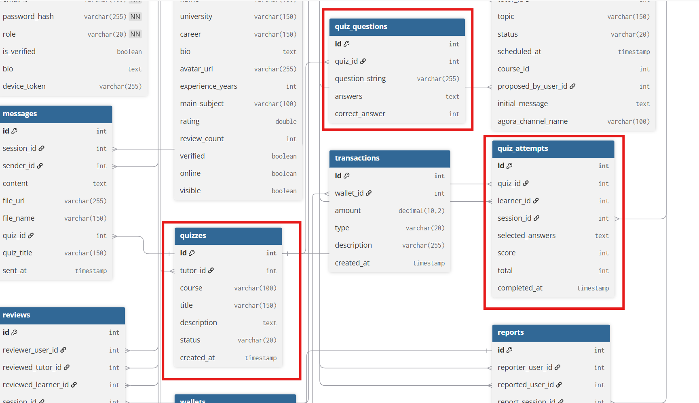
   
  <em>Figura XX. Diagrama de Base de Datos del Bounded Context Learning & Assessment - Elaboración propia.</em>

---

### 2.6.5. Bounded Context: Reputation

#### 2.6.5.1. Domain Layer

El Domain Layer de Reputation concentra las reglas de negocio relacionadas con la calificación de tutores tras la finalización de una sesión de tutoría.

- **Aggregate Root:** `Review` — id, sessionId, learnerId, tutorId, rating, comment, createdAt.
- **Value Objects:** `Rating` (encapsula el valor numérico y valida su rango permitido, por ejemplo 1 a 5).
- **Domain Services:** `TutorReputationCalculator` — calcula el promedio de calificaciones de un tutor a partir del conjunto de reviews recibidas.
- **Repository (interface):** `ReviewRepository` — define los contratos `findByTutorId`, `existsBySessionId` (evita que una misma sesión sea calificada más de una vez), `save`.

#### 2.6.5.2. Interface Layer

- **Controllers:** `ReviewController` — expone los endpoints `POST /api/v1/reviews` y `GET /api/v1/reviews/tutor/{tutorId}`, consumidos de forma idéntica por los clientes Web, Android Nativo y Flutter.
- **Resources (DTOs):** `ReviewResource`, `CreateReviewResource` (request).

#### 2.6.5.3. Application Layer

- **Command Services:** `ReviewCommandService` — implementa `handle(CreateReviewCommand)`, validando que la sesión referenciada exista y esté en estado Completed antes de aceptar la calificación.
- **Command Handlers:** `CreateReviewCommandHandler`.
- **Query Services:** `ReviewQueryService` — implementa `handle(GetTutorReviewsQuery)`, exponiendo el promedio calculado y el listado de reviews de un tutor.

#### 2.6.5.4. Infrastructure Layer

- **Persistence:** `ReviewRepositoryAdapter` (implementación de `ReviewRepository` sobre la base de datos relacional desplegada en Render).
- **Integración con Discovery:** `TutorProfileNotifierAdapter` — comunica el promedio de calificación actualizado hacia el Bounded Context Discovery, para mantener sincronizado el campo `averageRating` del perfil de tutor mostrado en la búsqueda.

#### 2.6.5.5. Bounded Context Software Architecture Component Level Diagrams

  
   
  <em>Figura XX. C4 Model: Component Diagram del Bounded Context Reputation - Elaboración propia. Nota: Se detalla la segregación entre Controllers, Command/Query Services y los adaptadores de Persistencia e integración con Discovery para la sincronización del promedio de calificación del tutor.</em>

#### 2.6.5.6. Bounded Context Software Architecture Code Level Diagrams

##### 2.6.5.6.1. Bounded Context Domain Layer Class Diagrams

  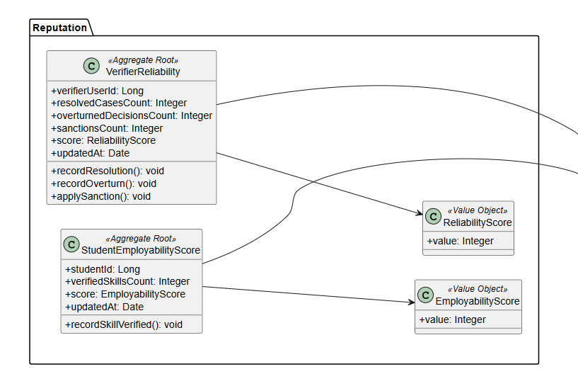
   
  <em>Figura XX. Diagrama de Clases UML del Domain Layer de Reputation - Elaboración propia. Nota: Se detalla el agregado Review y el Value Object Rating con sus reglas de validación.</em>

##### 2.6.5.6.2. Bounded Context Database Design Diagram

  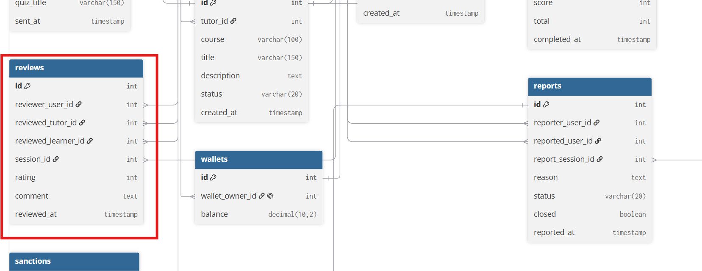
   
  <em>Figura XX. Diagrama de Base de Datos del Bounded Context Reputation - Elaboración propia.</em>

---

### 2.6.6. Bounded Context: Payments & Wallet

#### 2.6.6.1. Domain Layer

El Domain Layer de Payments & Wallet concentra las reglas de negocio relacionadas con la billetera virtual de cada usuario y el flujo de donaciones entre estudiantes y tutores.

- **Aggregate Root:** `Wallet` — id, userId, balance.
- **Aggregate Root:** `Transaction` — id, fromWalletId, toWalletId, amount, commissionAmount, type (Donation, Withdrawal), status, createdAt. El cálculo de la comisión del 5% se ejecuta como regla de negocio del propio agregado al momento de crear la transacción.
- **Value Objects:** `Money` (encapsula el monto y la validación de que sea positivo), `CommissionRate` (porcentaje de comisión aplicado, actualmente fijo en 5%).
- **Repository (interface):** `WalletRepository`, `TransactionRepository`.

#### 2.6.6.2. Interface Layer

- **Controllers:** `WalletController` — expone los endpoints `GET /api/v1/wallets/{userId}`, `POST /api/v1/transactions/donate`, `POST /api/v1/transactions/withdraw`.
- **Resources (DTOs):** `WalletResource`, `TransactionResource`, `DonateRequestResource`, `WithdrawRequestResource`.

#### 2.6.6.3. Application Layer

- **Command Services:** `WalletCommandService` — implementa `handle(DonateCommand)`, `handle(WithdrawCommand)`, calculando el desglose de comisión y actualizando los saldos de las wallets involucradas de forma transaccional.
- **Command Handlers:** `DonateCommandHandler`, `WithdrawCommandHandler`.
- **Query Services:** `WalletQueryService` — implementa `handle(GetWalletBalanceQuery)`.

#### 2.6.6.4. Infrastructure Layer

- **Persistence:** `WalletRepositoryAdapter`, `TransactionRepositoryAdapter` (sobre la base de datos relacional desplegada en Render).
- **Pasarela de pagos externa (trabajo futuro):** Punto de extensión documentado bajo el patrón Anticorruption Layer hacia Stripe, aún no implementado en el alcance funcional del ciclo actual.
- **Autenticación Biométrica (recurso interno del dispositivo):** La confirmación de una operación de retiro o donación de fondos requiere, del lado del cliente móvil, la verificación mediante la API biométrica nativa del dispositivo (`BiometricPrompt` en Android, `local_auth` en Flutter) antes de invocar el endpoint correspondiente. Esta verificación recae íntegramente sobre el sistema operativo del dispositivo: si no existe hardware de huella digital disponible o no hay huellas registradas, el propio sistema ofrece automáticamente el PIN, patrón o contraseña del dispositivo como mecanismo alternativo de confirmación, sin requerir lógica adicional en el Bounded Context.

#### 2.6.6.5. Bounded Context Software Architecture Component Level Diagrams

  
   
  <em>Figura XX. C4 Model: Component Diagram del Bounded Context Payments & Wallet - Elaboración propia. Nota: Se detalla la segregación entre Controllers, Command/Query Services y los adaptadores de Persistencia, evidenciando que la confirmación biométrica (recurso interno del dispositivo) ocurre en el cliente móvil antes de invocar los endpoints de transacción, y que la integración con Stripe queda documentada como Anticorruption Layer para una futura extensión.</em>

#### 2.6.6.6. Bounded Context Software Architecture Code Level Diagrams

##### 2.6.6.6.1. Bounded Context Domain Layer Class Diagrams

  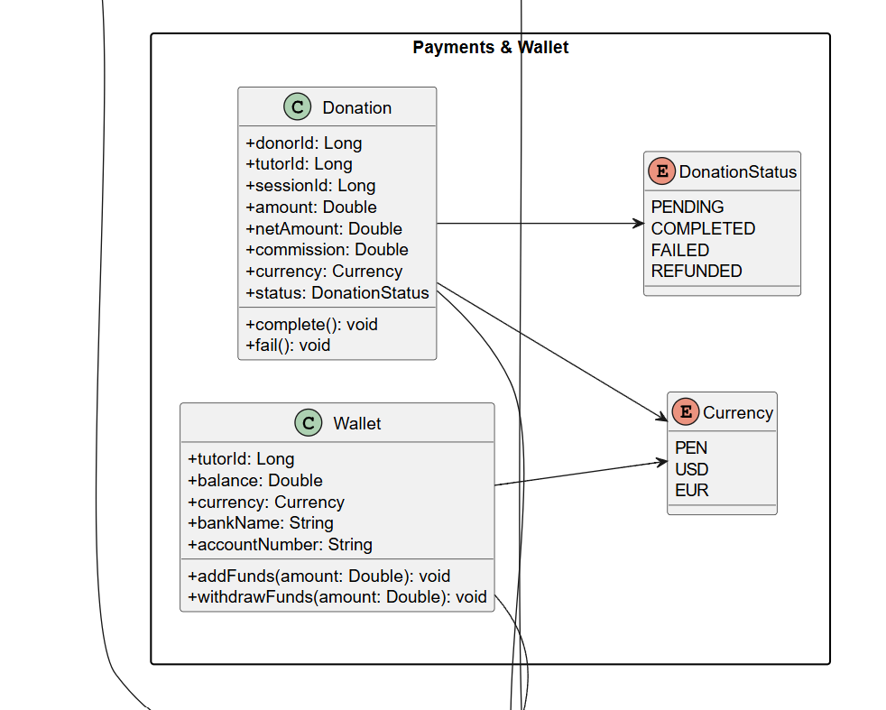
   
  <em>Figura XX. Diagrama de Clases UML del Domain Layer de Payments & Wallet - Elaboración propia. Nota: Se detalla el agregado Wallet, el agregado Transaction y los Value Objects Money y CommissionRate.</em>

##### 2.6.6.6.2. Bounded Context Database Design Diagram

  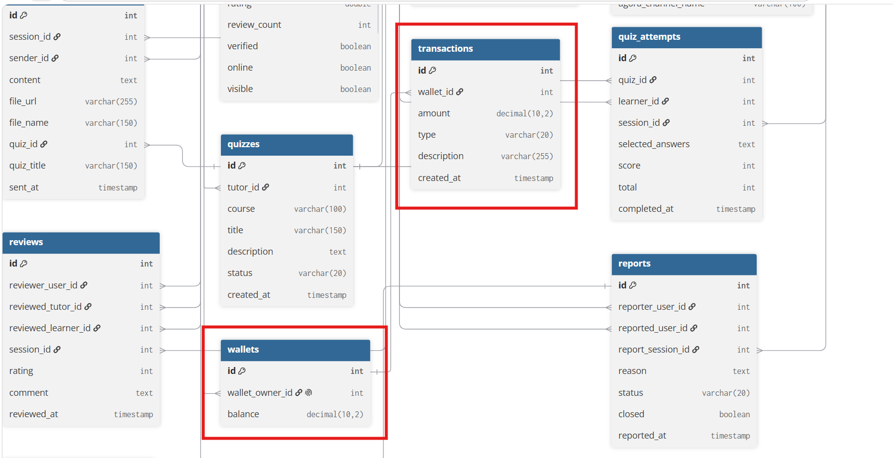
   
  <em>Figura XX. Diagrama de Base de Datos del Bounded Context Payments & Wallet - Elaboración propia.</em>

---

### 2.6.7. Bounded Context: Moderation & Disputes

#### 2.6.7.1. Domain Layer

El Domain Layer de Moderation & Disputes concentra las reglas de negocio relacionadas con el reporte de comportamientos inapropiados y la resolución de disputas por parte del Coordinador Institucional.

- **Aggregate Root:** `Report` — id, sessionId, reportedByUserId, reportedUserId, reason, status (Pending, UnderReview, Resolved, Dismissed), resolution, createdAt, resolvedAt.
- **Value Objects:** `ReportReason` (enumeración de motivos de reporte válidos), `ReportStatus` (estados y transiciones permitidas).
- **Domain Services:** `ReportResolutionValidator` — valida que una resolución (por ejemplo, sanción o desestimación) solo pueda aplicarse sobre un reporte en estado UnderReview.
- **Repository (interface):** `ReportRepository` — define los contratos `findBySessionId`, `findByStatus`, `save`.

#### 2.6.7.2. Interface Layer

- **Controllers:** `ReportController` — expone los endpoints `POST /api/v1/reports`, `GET /api/v1/reports`, `PATCH /api/v1/reports/{reportId}/resolve`, consumidos de forma idéntica por los clientes Web, Android Nativo y Flutter.
- **Resources (DTOs):** `ReportResource`, `CreateReportResource` (request), `ResolveReportResource` (request con la decisión del coordinador).

#### 2.6.7.3. Application Layer

- **Command Services:** `ReportCommandService` — implementa `handle(CreateReportCommand)`, `handle(ResolveReportCommand)`.
- **Command Handlers:** `CreateReportCommandHandler`, `ResolveReportCommandHandler` — este último, al aplicar una sanción, dispara los eventos de dominio consumidos por Identity & Access (suspensión de cuenta) y Reputation (ajuste de reputación del usuario sancionado).
- **Query Services:** `ReportQueryService` — implementa `handle(GetPendingReportsQuery)`, utilizada por el panel del Coordinador para revisar los reportes junto con el historial de chat de la sesión referenciada (obtenido desde Workspace) como evidencia.

#### 2.6.7.4. Infrastructure Layer

- **Persistence:** `ReportRepositoryAdapter` (implementación de `ReportRepository` sobre la base de datos relacional desplegada en Render).
- **Integración con Identity & Access:** `AccountSuspensionNotifierAdapter` — comunica la orden de sanción hacia Identity & Access para suspender la cuenta del usuario reportado.
- **Integración con Reputation:** `ReputationAdjustmentNotifierAdapter` — comunica el ajuste correspondiente en la reputación del usuario sancionado.
- **Integración con Workspace:** `SessionMessagesQueryClient` — consulta el historial de mensajes de la sesión reportada, permitiendo al Coordinador revisar el chat como evidencia directa dentro del panel de moderación, sin requerir que el usuario adjunte capturas manuales.

#### 2.6.7.5. Bounded Context Software Architecture Component Level Diagrams

  
   
  <em>Figura XX. C4 Model: Component Diagram del Bounded Context Moderation & Disputes - Elaboración propia. Nota: Se detalla la segregación entre Controllers, Command/Query Services y los adaptadores de Persistencia e integración con Identity & Access, Reputation y Workspace, evidenciando cómo el Coordinador accede al historial de chat de la sesión reportada como evidencia para la resolución de la disputa.</em>

#### 2.6.7.6. Bounded Context Software Architecture Code Level Diagrams

##### 2.6.7.6.1. Bounded Context Domain Layer Class Diagrams

  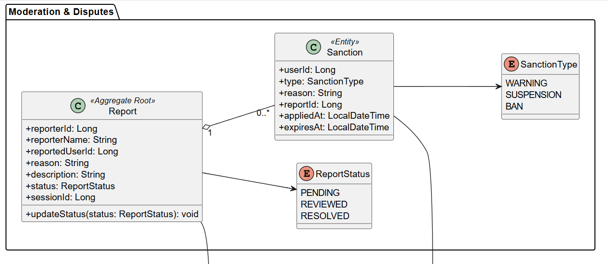
   
  <em>Figura XX. Diagrama de Clases UML del Domain Layer de Moderation & Disputes - Elaboración propia. Nota: Se detalla el agregado Report y los Value Objects ReportReason y ReportStatus.</em>

##### 2.6.7.6.2. Bounded Context Database Design Diagram

  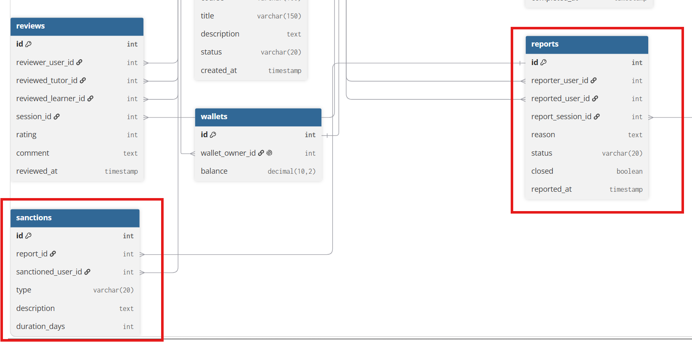
   
  <em>Figura XX. Diagrama de Base de Datos del Bounded Context Moderation & Disputes - Elaboración propia.</em>

---

A continuación se presenta el diagrama relacional completo de Innovify (SkillSwap), mostrando la totalidad de las tablas y sus relaciones entre los siete Bounded Contexts.

  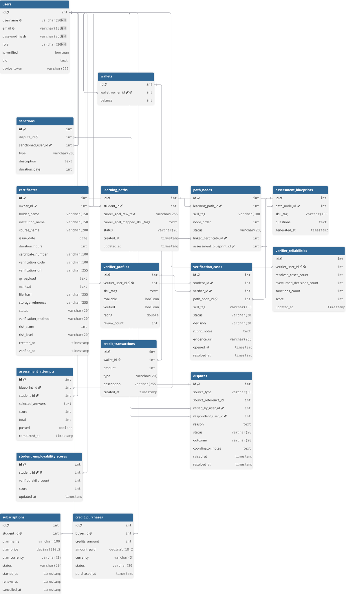
   
  <em>Figura XX. Diagrama de Base de Datos completo de Innovify - Elaboración propia. Nota: Se muestra la totalidad de las tablas correspondientes a los siete Bounded Contexts (Identity & Access, Discovery, Workspace, Learning & Assessment, Reputation, Payments & Wallet, Moderation & Disputes), incluyendo los campos device_token y agora_channel_name incorporados sobre las tablas users y sessions respectivamente para el soporte de las funcionalidades móviles. Elaborado en dbdiagram.io.</em>

En síntesis, el diagrama relacional evidencia una estructura de base de datos coherente, donde una única base de datos MySQL (`skillswap_db`) aloja de forma organizada las tablas de los siete Bounded Contexts, manteniendo alta cohesión dentro de cada contexto (por ejemplo, `sessions` y `messages` en Workspace) y bajo acoplamiento entre ellos, referenciándose únicamente a través del identificador de usuario (`users.id`) como dato compartido. La incorporación de los campos `device_token` y `agora_channel_name` demuestra la extensión del modelo de datos original para soportar las funcionalidades propias de los clientes móviles nativo y cross-platform, sin alterar la estructura ni las relaciones ya validadas en la versión web de la plataforma.

---

# Conclusiones
*   La adaptación del modelo de negocio de SkillSwap hacia una aplicación móvil nativa/multiplataforma responde directamente a la necesidad de inmediatez y accesibilidad de los estudiantes universitarios.
*   La investigación confirma que la integración de herramientas de videollamada y pasarelas de pago dentro de la misma aplicación, junto con el almacenamiento local, reducirá la fricción actual de usar herramientas fragmentadas.
*   La arquitectura basada en Domain-Driven Design provee una estructura robusta para integrar de manera segura los servicios RESTful internos y los SDKs de terceros requeridos para el aprendizaje sincrónico en dispositivos móviles.

# Bibliografía
*(Nota: Insertar referencias en formato APA 7, asegurando incluir un mínimo de 4 papers académicos Q1/Q2 de los últimos dos años relacionados con educación y desarrollo de aplicaciones móviles).*

# Anexos
*(Nota: Insertar cuadros, matrices extensas de entrevistas o diagramas adicionales requeridos).*
**probando a er**