

  

<h3 align="center">Universidad Peruana de Ciencias Aplicadas</h3>

<h3 align="center">Carrera de Ingeniería de Software</h3>

 

<strong>1ACC0238</strong> 
<strong>Aplicaciones para Dispositivos Móviles</strong>

<h2 align="center">Informe de Trabajo Final</h2>

<strong>Equipo</strong> 
Innovify

<strong>Proyecto</strong> 
SkillSwap

<h3 align="center">Integrantes</h3>

| Código | Apellidos y nombres |
| :--- | :--- |
| U201924127 | Alberca Saavedra, Víctor Manuel |
| U20231C792 | Becerra Ninahuanca, Luis Angel |
| U20241D958 | Lopez Montalvo, Kevin Edu |
| U201724692 | Komatsu Dueñas, David |

<strong>Período 202620</strong>

Septiembre 2026

---

## Registro de Versiones del Informe

| Versión | Fecha | Autor | Descripción de modificación |
| :--- | :--- | :--- | :--- |
| **v.01.Avn1** | 10/09/2026 | Alberca, V., Becerra, L., Lopez, K., Komatsu, D. | Creación del documento para el curso de Aplicaciones para Dispositivos Móviles (Avance 1). Se incluyeron las secciones de Presentación (Startup Profile, Lean UX), Requirements Development and Software Solution Design, Conclusiones y Bibliografía. Se adaptaron los requerimientos hacia una arquitectura móvil nativa/cross-platform. |

---

## Project Report Collaboration Insights

En esta sección se indica el URL del repositorio utilizado para la elaboración colaborativa del Informe de Trabajo Final, así como las evidencias de participación de cada integrante del equipo durante el desarrollo de la entrega AV1.

**URL del repositorio del Project Report (GitHub):**
[ https://github.com/orgs/Aplicaciones-Moviles-SkillSwap/repositories ]( https://github.com/orgs/Aplicaciones-Moviles-SkillSwap/repositories )

### AV1

Durante el desarrollo de la entrega AV1, el equipo distribuyó la elaboración del informe asignando capítulos y secciones específicas a cada integrante según sus áreas de responsabilidad. Cada miembro realizó sus aportes directamente en el repositorio de GitHub mediante commits en ramas individuales, siguiendo la convención de Conventional Commits y GitFlow. Todos los integrantes participaron activamente en la redacción de secciones del informe en formato Markdown, asegurando coherencia y calidad en el contenido entregado.

*(Nota: Insertar aquí las capturas de los analíticos de colaboración, branches y commits de GitHub correspondientes al avance 1).*

---

## Student Outcome

El curso contribuye al cumplimiento del Student Outcome ABET:
**ABET EAC - Student Outcome 7:** La capacidad de adquirir y aplicar nuevos conocimientos según sea necesario, utilizando estrategias de aprendizaje apropiadas.

| Criterio específico | Acciones realizadas | Conclusiones |
| :--- | :--- | :--- |
| **La capacidad de adquirir y aplicar nuevos conocimientos...** | **Alberca Saavedra Víctor Manuel (AV1):** Lideré la investigación de la tecnología externa (SDK de videollamadas) a integrar en el proyecto móvil, evaluando sus requisitos técnicos y adaptándolos a la arquitectura móvil nativa. Participé en el diseño estratégico de los Bounded Contexts. | El equipo reconoce la necesidad del aprendizaje permanente al investigar e integrar de manera autónoma tecnologías no vistas en clase, como SDKs externos y persistencia local en dispositivos, aplicando conceptos de Domain-Driven Design al entorno móvil. |
| | **Becerra Ninahuanca Luis Angel (AV1):** Investigué patrones de diseño UI/UX específicos para aplicaciones móviles multiplataforma y colaboré en el análisis competitivo y el diseño de entrevistas enfocadas en la experiencia de movilidad de los estudiantes. | El equipo actualiza sus conocimientos sobre buenas prácticas de desarrollo móvil y requerimientos de usuarios para construir soluciones funcionales y pertinentes en dispositivos móviles. |
| | **Lopez Montalvo Kevin Edu (AV1):** Documenté el proceso Lean UX y apliqué el aprendizaje sobre persistencia de datos locales en dispositivos para el diseño de los requisitos, estructurando las User Stories bajo un enfoque Mobile-First. | El equipo aplica estrategias de aprendizaje eficaces para incorporar nuevos requerimientos técnicos a la solución de software, demostrando capacidad de adaptación. |
| | **Komatsu Dueñas, David (AV1):** Evalué diferentes estrategias de integración de servicios RESTful y modelé el flujo de mensajes entre los Bounded Contexts aplicando Domain Storytelling adaptado al consumo de APIs desde aplicaciones móviles. | Se evidencia la capacidad de asimilar nuevos paradigmas de comunicación y arquitectura de software, esenciales para el desarrollo profesional. |

## Objetivos SMART

*   **Alberca Saavedra Víctor Manuel:** Completar un curso de especialización en arquitecturas móviles (Kotlin/Swift) para diciembre de 2026, logrando aplicar al menos 3 patrones de diseño avanzados en proyectos personales.
*   **Becerra Ninahuanca Luis Angel:** Obtener una certificación en integración de servicios Cloud para aplicaciones móviles en los próximos 6 meses, mejorando la seguridad y reduciendo la latencia en el consumo de APIs.
*   **Lopez Montalvo Kevin Edu:** Dominar herramientas de testing automatizado para aplicaciones multiplataforma (ej. Appium) antes de culminar la carrera, logrando automatizar el 80% de los flujos críticos de la aplicación.
*   **Komatsu Dueñas, David:** Desarrollar habilidades de liderazgo técnico gestionando al menos 2 proyectos de software open source orientados a móviles en GitHub durante el próximo año, implementando GitFlow y CI/CD de forma efectiva.

---

# Capítulo I: Presentación

## 1.1. Startup Profile

### 1.1.1. Descripción de la Startup
**Innovify** es una startup cuyo propósito es reducir la deserción académica conectando a estudiantes universitarios para que compartan conocimientos a través de sesiones de tutoría en una aplicación móvil. La plataforma facilita un aprendizaje sincrónico (videollamadas nativas) y asincrónico (recursos locales e integración en la nube), bajo un modelo B2C (donaciones voluntarias) y B2B (Dashboard Analítico institucional). 

El sistema asegura la identidad mediante correos institucionales (`.edu.pe`) e integra **almacenamiento local** para preferencias de estudio y caché de mensajes, acceso a un **recurso interno del dispositivo** (cámara/micrófono para tutorías en vivo), integración con nuestro **servicio RESTful** de desarrollo interno, y acceso a un **servicio externo de terceros** (SDK para videollamadas o pasarela de pagos). Todo fundamentado bajo una arquitectura orientada al dominio (Domain-Driven Design).

### 1.1.2. Perfiles de integrantes del equipo

| Foto | Integrante | Carrera | Descripción |
| :---: | :--- | :--- | :--- |
| *(Foto)* | **Alberca Saavedra, Víctor Manuel** (U201924127) | Ingeniería de Software | Aporta conocimientos sólidos en arquitectura de software, backend y bases de datos. Contribuye con liderazgo técnico y organización del equipo para la transición al desarrollo móvil. |
| *(Foto)* | **Becerra Ninahuanca, Luis Angel** (U20231C792) | Ingeniería de Software | Especialista en lógica de negocio, integración de servicios y diseño de interfaces limpias. Aportará al diseño de la aplicación móvil y la Landing Page del modelo de negocio. |
| *(Foto)* | **Lopez Montalvo, Kevin Edu** (U20241D958) | Ingeniería de Software | Aporta conocimientos en diseño móvil, UX/UI y metodologías ágiles. Se enfocará en la investigación aplicada y la creación de prototipos técnicos móviles. |
| *(Foto)* | **Komatsu Dueñas, David** (U201724692) | Ingeniería de Software | Enfocado en investigación tecnológica, análisis de datos y control de calidad. Aportará con habilidades de comunicación asertiva y experiencia en levantamiento de requerimientos. |

 

## 1.2. Solution Profile

### 1.2.1. Antecedentes y problemática
En el Perú, el fracaso académico y la deserción universitaria afectan a miles de estudiantes. Según el MINEDU (2021), la tasa de interrupción de estudios en universidades licenciadas llegó a 11.5% en el ciclo 2021-1, siendo Lima una de las regiones más afectadas con 12.4%.

Un problema subyacente y desatendido es el **aislamiento del conocimiento**. Cada universidad funciona como una isla académica. Actualmente, no existe una aplicación móvil formal, segura y multiplataforma que conecte de manera inmediata y verificada a un estudiante que necesita ayuda con un par que domina esa área. Los alumnos se ven limitados a su círculo cercano o a grupos informales en redes sociales que carecen de seguridad institucional, lo que genera fricción al momento de coordinar desde sus smartphones.

*(Nota: En el documento final se expandirá la técnica de las 5W y 2H enfocada en el uso de dispositivos móviles).*

### 1.2.2. Lean UX Process

#### 1.2.2.1. Lean UX Problem Statements
* The current state of **la educación colaborativa universitaria en Perú** has focused mainly on **estudiantes compartiendo documentos de forma aislada en plataformas web, o coordinando informalmente por WhatsApp sin garantías de calidad ni validación académica**.
* What existing products/services fail to address is **la necesidad de una conexión inmediata, segura y validada institucionalmente directamente desde los dispositivos móviles, que ofrezca tutorías en tiempo real y recompense económicamente el esfuerzo del tutor**.
* Our product/service will address this gap by **ofreciendo una aplicación móvil nativa/multiplataforma basada en Domain-Driven Design, que integre videollamadas, chat asíncrono y donaciones, asegurando la identidad mediante correos institucionales (.edu.pe)**.
* Our initial focus will be **estudiantes universitarios de pregrado de Lima y provincias clave, tanto los que buscan mejorar sus notas (Aprendices) como los que desean monetizar sus conocimientos (Tutores) mediante su teléfono**.
* We'll know we are successful when we see **una adopción continua de la app móvil, evidenciada por un aumento del 40% mensual en tutorías completadas y donaciones procesadas dentro del entorno móvil durante los primeros 6 meses**.

#### 1.2.2.2. Lean UX Assumptions
*   **Business Assumptions:** Creemos que el cobro del 5% de comisión por donación mediante pasarelas de pago integradas en la app hará que el modelo sea financieramente sostenible.
*   **Business Outcome Assumptions:** El éxito se medirá por la cantidad de sesiones de videollamada completadas íntegramente en la aplicación móvil, reduciendo la dependencia de enlaces externos.
*   **User Assumptions:** Nuestros usuarios son "móviles-nativos"; prefieren buscar tutores, coordinar, estudiar y realizar transferencias directamente desde sus smartphones por conveniencia y rapidez.
*   **User Outcome Assumptions:** Los aprendices mejorarán su rendimiento académico al tener ayuda en su bolsillo; los tutores generarán ingresos y desarrollarán habilidades pedagógicas.
*   **Feature Assumptions:** El soporte de notificaciones *push*, el acceso a la cámara/micrófono del dispositivo y el almacenamiento local de sesiones recientes son características críticas para la retención del usuario.

#### 1.2.2.3. Lean UX Hypothesis Statements
* We believe we will achieve **alta adopción, retención y confianza por parte de los usuarios**
* If **estudiantes universitarios (Aprendices y Tutores)**
* Attain **una experiencia fluida, rápida y segura para coordinar y realizar clases desde cualquier lugar**
* With **una aplicación móvil nativa/multiplataforma que integre notificaciones push, videollamadas utilizando APIs de terceros, almacenamiento local para acceso offline parcial y validación automática de identidad (.edu.pe)**.

#### 1.2.2.4. Lean UX Canvas
*(Nota: Insertar imagen del Lean UX Canvas adaptado a la solución móvil de SkillSwap).*

## 1.3. Segmentos objetivo

1.  **Estudiantes que quieran aprender (Aprendices):** Universitarios (18-25 años) que enfrentan dificultades académicas. Son altamente dependientes de sus dispositivos móviles para consumir contenido rápido. Buscan ayuda inmediata y verificada sin tener que encender una computadora.
2.  **Estudiantes que quieran enseñar (Tutores):** Universitarios en ciclos intermedios/avanzados con alto dominio de materias. Buscan monetizar sus conocimientos y valoran la flexibilidad de gestionar sus solicitudes de tutoría, horarios y billetera virtual directamente desde su celular mediante notificaciones en tiempo real.
3.  **Coordinador Institucional:** Personal universitario (30-55 años) interesado en acceder a un Dashboard (Web) con métricas de rendimiento y prevención de deserción, garantizando la integridad de la red.

---

# Capítulo II: Requirements Development and Software Solution Design

## 2.1. Competidores

**uDocz (Competidor Directo)**
uDocz es una plataforma de origen peruano que se ha expandido por toda Latinoamérica, posicionándose como una de las comunidades de estudio más grandes para universitarios de habla hispana, con fuerte presencia en su **app móvil** (iOS y Android) además de la web. Su modelo se centra en que los estudiantes compartan y encuentren material de estudio, como apuntes de clase, resúmenes, guías y solucionarios, específicos para su universidad y carrera, todo accesible desde el celular con lectura offline. Aunque su fuerte es el intercambio de documentos, también ha incorporado un "Doc Tutor AI", flashcards y quizzes dentro de la misma app.

**Knack (Competidor Directo)**
Knack es una red de tutoría universitaria norteamericana que conecta, a través de su **app móvil**, a estudiantes con tutores pares que han sobresalido en cursos específicos. La plataforma se asocia directamente con las universidades, las cuales a menudo subsidian el costo, haciendo que las tutorías sean gratuitas para los estudiantes. Desde el celular, el alumno solicita un tutor, coordina la sesión y realiza el pago sin salir de la app.

**StudyTree (Competidor Directo)**
StudyTree es una **app móvil** (iOS y Android) que conecta a estudiantes universitarios entre sí para tutorías bajo demanda ("on-demand"), creando un marketplace donde unos ganan dinero enseñando y otros ahorran dinero aprendiendo. Su modelo, muy cercano al de Innovify, es mixto: la app es gratuita para el estudiante (B2C) y se comercializa como servicio SaaS a las universidades (B2B), quienes pagan por licencia y acceden a datos analíticos sobre el uso de tutorías por parte de sus alumnos.

**Tutor Campus (Competidor Directo)**
Tutor Campus es una **app móvil** (disponible en Google Play) enfocada en conectar estudiantes universitarios y egresados para el intercambio de conocimientos mediante tutorías y comunidad. Bajo la premisa de que "todos somos tutores y tutelados", permite formar pequeños grupos de interés y establecer contacto entre estudiantes de distintas universidades y carreras directamente desde el celular, sin depender de un canal web.

---

### 2.1.1. Análisis competitivo

<table>
  <tr>
    <th colspan="2">¿Por qué llevar a cabo este análisis?</th>
    <td colspan="5">¿Cómo se posiciona nuestra app móvil de tutorías interuniversitarias frente a otras soluciones móviles de apoyo académico entre estudiantes?</td>
  </tr>
  <tr>
    <th colspan="2">(En la cabecera colocar por cada competidor nombre y logo)</th>
    <td align="center"><b>Su startup</b>  <b>SkillSwap (App móvil)</b></td>
    <td align="center"><b>Competidor 1</b>  <b>uDocz</b></td>
    <td align="center"><b>Competidor 2</b> 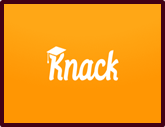 <b>Knack</b></td>
    <td align="center"><b>Competidor 3</b>  <b>StudyTree</b></td>
    <td align="center"><b>Competidor 4</b>  <b>Tutor Campus</b></td>
  </tr>
  <tr>
    <td rowspan="2">Perfil</td>
    <td>Overview</td>
    <td>App móvil de aprendizaje colaborativo con videollamadas incrustadas (vía API), donación voluntaria B2C, validación automática con correo <code>.edu.pe</code> y dashboard analítico B2B para universidades.</td>
    <td>App móvil de intercambio masivo de material de estudio (apuntes, resúmenes) con herramientas de IA (Doc Tutor AI, flashcards, quizzes) y lectura offline.</td>
    <td>App móvil de tutoría <i>peer-to-peer</i> dentro de una misma universidad, con pago dentro de la app, a menudo subsidiada por la institución.</td>
    <td>App móvil "on-demand" que conecta tutores y aprendices universitarios en tiempo real, con licenciamiento B2B a universidades.</td>
    <td>App móvil de comunidad e intercambio de conocimientos entre universitarios y egresados, con formación de grupos por interés.</td>
  </tr>
  <tr>
    <td>Ventaja competitiva <i>¿Qué valor ofrece a los clientes?</i></td>
    <td>Recompensa económica vía donaciones; calidad validada por quizzes de profesores; data estratégica (dashboard B2B) accesible desde el celular.</td>
    <td>Repositorio masivo accesible desde el móvil; fuerte efecto de red.</td>
    <td>Alta confianza (tutor de la misma universidad); gratuito para el alumno gracias al subsidio institucional.</td>
    <td>Modelo de negocio mixto (B2C/B2B) muy similar al nuestro, con analítica para universidades directamente desde la app.</td>
    <td>Comunidad activa entre universidades distintas; enfoque en networking académico.</td>
  </tr>
  <tr>
    <td rowspan="2">Perfil de Marketing</td>
    <td>Mercado objetivo</td>
    <td>Estudiantes universitarios de pregrado (B2C) y universidades/profesores que buscan analítica de rendimiento (B2B), vía app móvil.</td>
    <td>Estudiantes universitarios de habla hispana que buscan material de apoyo, principalmente desde el celular.</td>
    <td><b>Primario:</b> estudiantes de universidades asociadas (vía app). <b>Secundario (paga):</b> universidades.</td>
    <td><b>Primario:</b> estudiantes universitarios que enseñan o piden ayuda desde el móvil. <b>Secundario (paga):</b> universidades vía licencia SaaS.</td>
    <td>Estudiantes y egresados universitarios interesados en compartir conocimiento entre distintas casas de estudio.</td>
  </tr>
  <tr>
    <td>Estrategias de marketing</td>
    <td>Venta directa B2B a universidades; marketing digital en redes sociales; programa de embajadores por campus, con foco en descarga de la app.</td>
    <td>Marketing de contenidos y SEO; modelo viral ("sube un documento para descargar otro") dentro de la app.</td>
    <td>Venta directa B2B a administraciones universitarias; promoción por canales internos de la universidad.</td>
    <td>Marketing de campus (pitch competitions, alianzas con facultades) y licenciamiento directo a universidades.</td>
    <td>Crecimiento orgánico vía comunidad y boca a boca entre estudiantes de distintas universidades.</td>
  </tr>
  <tr>
    <td rowspan="3">Perfil de Producto</td>
    <td>Productos &amp; Servicios</td>
    <td>Emparejamiento de estudiantes, roles flexibles (tutor/aprendiz), videollamadas integradas (API), chat, banco de quizzes y dashboard analítico, todo desde la app móvil.</td>
    <td>Repositorio de documentos, Doc Tutor AI, flashcards, quizzes automáticos y descarga offline.</td>
    <td>Agendamiento, chat, pago dentro de la app y analítica para la universidad.</td>
    <td>Marketplace de tutorías bajo demanda, mensajería y panel analítico institucional (University Platform).</td>
    <td>Perfiles de tutor/tutelado, formación de grupos de interés y mensajería comunitaria.</td>
  </tr>
  <tr>
    <td>Precios &amp; Costos</td>
    <td>Plan gratuito con monetización vía retención del 5% de donaciones; licencia B2B a universidades por el dashboard.</td>
    <td>Freemium: acceso básico gratuito con límites; premium por suscripción o subiendo documentos.</td>
    <td>Suscripción/licencia anual pagada por la universidad; gratuito para el estudiante; tutores cobran por hora.</td>
    <td>Gratuito para el estudiante; licencia SaaS a la universidad en escala según número de usuarios.</td>
    <td>Gratuito, con monetización aún poco clara para el usuario final.</td>
  </tr>
  <tr>
    <td>Canales de distribución (Web y/o Móvil)</td>
    <td>Móvil (enfoque principal)</td>
    <td>Móvil</td>
    <td>Móvil</td>
    <td>Móvil</td>
    <td>Móvil</td>
  </tr>
  <tr>
    <td rowspan="5">Análisis SWOT</td>
    <td colspan="6"><i>Realice esto para su startup y sus competidores. Sus fortalezas deberían apoyar sus oportunidades y contribuir a lo que ustedes definen como su posible ventaja competitiva.</i></td>
  </tr>
  <tr>
    <td>Fortalezas</td>
    <td>Registro sin fricción (<code>.edu.pe</code>); donaciones incentivan calidad; validación académica por profesores; modelo B2C y B2B sostenible desde el móvil.</td>
    <td>Enorme base de usuarios (+30 millones) y contenido; fuerte reconocimiento de marca; app madura y estable.</td>
    <td>Modelo B2B estable; alta confianza garantizada por la universidad; app con buena reputación.</td>
    <td>Modelo de negocio casi idéntico al nuestro, ya validado en varias universidades de EE. UU.</td>
    <td>Alcance interuniversitario ya construido; comunidad activa.</td>
  </tr>
  <tr>
    <td>Debilidades</td>
    <td>Requiere masa crítica inicial de usuarios; depende de la cooperación universitaria; dependencia de APIs externas de video.</td>
    <td>Calidad de contenido sin verificar; no ofrece tutoría en vivo dentro de la app; riesgo de uso antiético (fraude).</td>
    <td>Crecimiento lento (ciclos de venta largos); modelo cerrado, sin networking interuniversitario.</td>
    <td>Enfocado en el mercado norteamericano; sin componente de validación académica tipo quiz.</td>
    <td>Modelo de monetización poco claro; funcionalidades de videollamada o pago menos desarrolladas.</td>
  </tr>
  <tr>
    <td>Oportunidades</td>
    <td>Aumento del aprendizaje móvil; desarrollo de habilidades blandas; escalable a Latinoamérica; universidades invierten en retención.</td>
    <td>Expandirse a tutorías en vivo desde la app; alianzas con creadores de contenido.</td>
    <td>Expandirse a mercados internacionales; ofrecer mentoría profesional.</td>
    <td>Expandirse a Latinoamérica; sumar validación académica.</td>
    <td>Sumar videollamadas y pagos integrados; expandirse a más países.</td>
  </tr>
  <tr>
    <td>Amenazas</td>
    <td>Grupos de WhatsApp/Discord; burocracia universitaria y lentitud de adopción; reto de rentabilidad en modelo gratuito.</td>
    <td>Políticas universitarias estrictas; nuevos competidores con IA.</td>
    <td>Recortes presupuestarios en universidades; burocracia para adopción; soluciones más flexibles.</td>
    <td>Nuevos entrantes con modelo similar; dependencia de contratos universitarios.</td>
    <td>Baja retención si no hay incentivo económico claro.</td>
  </tr>
</table>

*(Tabla 3. Análisis competitivo-Landscape (enfoque móvil) - Elaboración propia. Nota: esta tabla presenta una comparación detallada entre SkillSwap, en su versión app móvil, y otras plataformas que también operan como aplicaciones móviles, para consolidar su propuesta única).*

---

### 2.1.2. Estrategias y tácticas frente a competidores

A continuación, se presentan las estrategias y tácticas que Innovify / SkillSwap puede implementar, como **app móvil**, para destacarse frente a competidores que también operan en el canal móvil, capitalizando su modelo único de colaboración interuniversitaria, su sostenibilidad financiera y su rigor académico.

#### Estrategias

* **Diferenciación por Exclusividad y Networking:** A diferencia de Knack (limitado a un solo campus) y de uDocz (intercambio impersonal de documentos), la app de Innovify se posiciona como una red nacional de talento universitario validado, accesible desde cualquier dispositivo móvil. El diferencial no es solo conectar estudiantes, sino garantizar que la enseñanza sea de alta calidad mediante el uso del Banco Oficial de Quizzes creado exclusivamente por Profesores Universitarios.
* **Construcción de Confianza a través de la Verificación:** A diferencia de la anonimidad de uDocz o de comunidades abiertas como Tutor Campus, la app garantizará la identidad de cada usuario mediante un sistema de validación automática con correos institucionales (`.edu.pe`), directamente en el proceso de registro móvil. Esto nos posicionará como la opción más segura del mercado.
* **Sostenibilidad mediante un Modelo Mixto:** Al igual que StudyTree, buscaremos un ecosistema económicamente viable desde el primer día. Fomentaremos la retención recompensando a los tutores mediante un sistema de donaciones voluntarias (B2C, reteniendo un 5%) gestionadas desde la app. Por el lado institucional (B2B), comercializaremos el acceso a nuestro Dashboard Analítico.
* **Modelo de Adopción Enfocado y Escalable:** Para atraer una masa crítica de usuarios de la app, la estrategia será evitar un lanzamiento masivo y, en su lugar, concentrarse en crear un ecosistema denso y funcional en un grupo reducido de universidades para luego escalar.
* **Accesibilidad y Experiencia de Usuario Móvil Superior:** La app será diseñada para ser radicalmente fácil de usar desde el celular, con una interfaz que permita encontrar ayuda, acceder a videollamadas y realizar pagos/donaciones en la misma pantalla, sin depender de aplicaciones de terceros como Zoom o Meet.

#### Tácticas

* **Alianzas Estratégicas con Universidades:** Establecer convenios formales con las administraciones universitarias ofreciéndoles acceso a nuestro Dashboard Analítico ("Termómetro Académico") desde un panel web complementario a la app móvil, convirtiéndolas en socias estratégicas.
* **Lanzamiento por Clústeres Estratégicos:** Iniciar operaciones móviles en un grupo selecto de 3-4 universidades con fortalezas académicas complementarias, asegurando oferta y demanda real de conocimiento diverso desde el primer día.
* **Programa de Miembros Fundadores:** Ofrecer incentivos potentes y exclusivos, como 0% de retención de comisión durante los primeros 3 meses a los primeros 200 tutores validados que se registren desde la app en el clúster inicial.
* **Implementación del Sistema de Donaciones y Monetización Directa:** Integrar una pasarela de pagos móvil fluida (como Stripe o MercadoPago) que permita a los aprendices donar con un solo toque al finalizar la sesión, haciendo el proceso transparente y sin fricciones.
* **Marketing de Nicho y Contenido de Valor:** Realizar campañas en TikTok e Instagram mostrando la experiencia de uso de la app y enfocadas en la monetización y cursos de alta dificultad (ej: *"Genera ingresos enseñando Cálculo desde tu celular"* o *"Aprende diseño con un experto de la PUCP, todo desde tu app"*).
* **Énfasis en el Rigor Académico (Sello de Calidad):** Hacer que el uso de los Quizzes creados por profesores otorgue a los tutores una "Insignia de Calidad" visible en su perfil dentro de la app, complementado con un sistema de calificaciones de 1 a 5 estrellas para construir reputación basada en el mérito.
## 2.2. Entrevistas

### 2.2.1. Diseño de entrevistas

**Segmento objetivo #1: Estudiantes que quieran aprender**
1. Para empezar, cuéntame un poco sobre ti. ¿Qué carrera estudias, en qué ciclo y en qué universidad?
2. ¿Cómo describirías tu último ciclo académico? ¿Hubo algún curso que te resultara particularmente desafiante?
3. Fuera de las clases, ¿cómo organizas normalmente tu tiempo de estudio? ¿Prefieres estudiar solo o en grupo?
4. Cuando te encuentras atascado en un tema o un problema, ¿qué es lo primero que sueles hacer? ¿A quién o a qué recurres?
5. Piensa en la mejor ayuda que has recibido para un curso. ¿Qué hizo que esa ayuda fuera tan buena? ¿Qué características tenía la persona que te ayudó?
6. ¿Qué te parecería la idea de recibir ayuda de un estudiante de otra universidad que sea experto en el tema? ¿Qué ventajas crees que podría tener?
7. Cuéntame sobre alguna vez que necesitaste ayuda urgente para un examen o trabajo y te fue difícil encontrarla. ¿Qué pasó y cómo te sentiste?
8. ¿Qué es lo más complicado de pedir ayuda a tus propios compañeros de clase? ¿Y a tus profesores?
9. ¿Has usado herramientas como uDocz, WhatsApp o enlaces de Zoom/Meet para resolver dudas con otros? ¿Qué es lo que más te frustra de tener que usar tantas aplicaciones distintas para coordinar y recibir ayuda?
10. Actualmente las tutorías particulares suelen tener tarifas fijas altas. ¿Qué opinas de un sistema donde recibas ayuda de un compañero experto y, al finalizar, tengas la opción de enviarle una donación económica voluntaria (con tarjeta) como agradecimiento por su tiempo?
11. Imagina que tienes dos opciones: recibir ayuda inmediata de alguien que "sabe más o menos" o esperar un poco para coordinar con alguien que "realmente domina" el tema. ¿Cuál prefieres y por qué?
12. Si existiera una aplicación exclusiva para universitarios (registrados con su correo `.edu.pe`), ¿qué información necesitarías ver en el perfil de un tutor para animarte a contactarlo y confiar en él?
13. En lugar de que te envíen un enlace externo de Google Meet o Zoom, ¿qué te parecería si la videollamada se realiza directamente dentro de la misma plataforma? ¿Te generaría mayor comodidad o seguridad?
14. ¿Qué tan útil te resultaría tener un espacio (chat) previo a la videollamada donde puedas adjuntarle tus PDFs, fotos o ejercicios al tutor para que los revise antes de la sesión en vivo?

**Segmento objetivo #2: Estudiantes que quieran enseñar**
1. Para comenzar, cuéntame un poco sobre ti: ¿qué estudias, en qué ciclo estás y en qué universidad?
2. ¿En qué cursos o temas sientes que tienes un dominio sólido? ¿Cómo llegaste a desarrollar esa habilidad?
3. Cuéntame sobre una vez que ayudaste a alguien a entender un tema difícil. ¿Cómo fue esa experiencia?
4. ¿Qué te motiva a querer enseñar a otros estudiantes, más allá de una compensación económica?
5. ¿Cómo sueles adaptar tu forma de explicar según el ritmo o estilo de aprendizaje de quien te está escuchando?
6. ¿Qué herramientas usas actualmente cuando ayudas a otros a distancia? Por ejemplo, WhatsApp, Zoom, Drive u otras.
7. Imagina que tuvieras que ayudar a un compañero de otra universidad a través de una videollamada integrada directamente en una plataforma. ¿Cómo te sentirías con eso?
8. ¿Con qué dispositivos accedes normalmente a plataformas digitales para estudiar o comunicarte? ¿Hay alguno que prefieras y por qué?
9. ¿Qué es lo que más te frustra cuando intentas ayudar a alguien a entender un tema, ya sea en persona o de forma virtual?
10. ¿Has tenido alguna experiencia negativa al interactuar con personas que no conocías en plataformas digitales o grupos de estudio?
11. Si alguien te ofreciera una donación voluntaria a cambio de una tutoría, ¿cómo te sentirías al respecto? ¿Te parecería justo, incómodo o motivador?
12. ¿Qué importancia tiene para ti generar ingresos extra mientras estudias? ¿Tienes alguna experiencia previa haciendo algo así?
13. ¿Qué tan dispuesto estarías a conectarte con estudiantes de otras universidades que no conoces a través de una plataforma digital?
14. Si pudieras diseñar la plataforma ideal para enseñar a otros estudiantes universitarios, ¿cómo sería? ¿Qué no podría faltarle?

**Segmento objetivo #3: Coordinador Institucional**
1. Para comenzar, ¿podría describir brevemente su rol en la universidad y sus principales responsabilidades relacionadas con el alumnado?
2. Desde su posición, ¿cuáles considera que son los mayores desafíos que enfrentan los estudiantes para tener éxito académico hoy en día?
3. ¿De qué maneras fomenta actualmente la universidad la colaboración académica entre sus estudiantes?
4. ¿Qué beneficios u oportunidades cree que podría traer para sus estudiantes una plataforma que les permita colaborar con alumnos verificados de otras universidades del país?
5. ¿Qué características o políticas debería tener una herramienta de este tipo para que la universidad se sintiera cómoda apoyándola?
6. ¿Cuál es la principal preocupación de la universidad respecto al uso que los alumnos dan a las herramientas de estudio en línea existentes, como grupos de WhatsApp o repositorios de documentos? (ej. plagio, fraude, seguridad).
7. Nuestra plataforma propone un sistema donde un coordinador de la universidad valida que el usuario es un alumno activo. ¿Qué dificultades operativas o burocráticas anticipa para implementar un proceso así en su día a día?
8. ¿Qué riesgos para la reputación de la universidad o la seguridad de los estudiantes le preocuparían más en un sistema que conecta a sus alumnos con "externos", aunque sean de otras universidades?
9. Actualmente, ¿qué tan simple o complejo es para su equipo verificar el estatus de un alumno (si está matriculado, activo, etc.) para un trámite administrativo común?
10. ¿Utilizan algún software o plataforma específica para la gestión de la identidad y los datos de los estudiantes?
11. Imaginemos que le damos acceso a un "Panel de Coordinador". Para que su labor de validación fuera eficiente y segura, ¿qué funciones serían indispensables? (ej. búsqueda por código/DNI, un solo clic para aprobar, historial de validaciones, etc.).
12. Más allá de solo validar la identidad, ¿qué otro tipo de información o control (anonimizado, por supuesto) le gustaría tener para asegurar que la participación de sus estudiantes es positiva y segura?

---

### 2.2.2. Registro de entrevistas

#### Segmento objetivo 1: Estudiantes que quieran aprender

**Entrevista 1**
* **Nombres:** Boris
* **Apellidos:** Alvarado Milan
* **Edad:** 26 años
* **Distrito:** Cercado de Lima

  
   
  <em>Figura 4. YouTube: Entrevista 1: Estudiante-Aprendiz | SkillSwap. Nota: En esta figura se aprecia la entrevista a una persona de segmento estudiante-aprendiz.</em>

* **URL:** [https://youtu.be/7ffbEWaAAts](https://youtu.be/7ffbEWaAAts)
* **Inicio:** 0:03
* **Duración:** 10 minutos con 10 segundos

**Resumen descriptivo:**
En esta entrevista, Boris es estudiante de la Universidad Nacional Mayor de San Marcos y comenta que su último ciclo académico (quinto ciclo) fue más exigente en comparación con los anteriores, debido al aumento en la dificultad de los cursos, la presión de los profesores y cierta indiferencia en la enseñanza. Prefiere estudiar en grupo, ya que considera que el aprendizaje se fortalece cuando el conocimiento se comparte entre todos. Cuando se encuentra atascado en algún tema, recurre principalmente a recursos en línea como YouTube o busca materiales relacionados para apoyarse. Valora mucho la ayuda de otros estudiantes, especialmente de aquellos que son dedicados, exigentes consigo mismos y a la vez sociables y empáticos, ya que esto facilita tanto el aprendizaje como la confianza. Respecto a recibir ayuda de estudiantes de otras universidades, considera que podría ser beneficioso si existen similitudes en los contenidos, aunque no siempre está garantizado. Señala que una de las principales dificultades al pedir ayuda es dar el primer paso y luego coordinar horarios con la otra persona. En cuanto a herramientas digitales, menciona que utiliza principalmente WhatsApp, pero le resulta incómodo tener que adaptarse a nuevas plataformas como Discord. Sobre el modelo de tutorías con donación voluntaria, opina que puede funcionar, especialmente en situaciones donde el estudiante necesita ayuda con urgencia. Frente a la elección entre ayuda inmediata o esperar por alguien más capacitado, reconoce ventajas en ambas, aunque valora la tranquilidad de saber que recibirá una ayuda más adecuada, incluso si debe esperar. Finalmente, considera importante que una plataforma de apoyo académico muestre información clara sobre la especialidad y nivel de conocimiento del tutor, y que integre funciones como videollamadas dentro de la misma aplicación y un chat previo para compartir materiales.

**Entrevista 2**
* **Nombres:** Adrian Moises
* **Apellidos:** Guevara Romero
* **Edad:** 20 años
* **Distrito:** Miraflores

  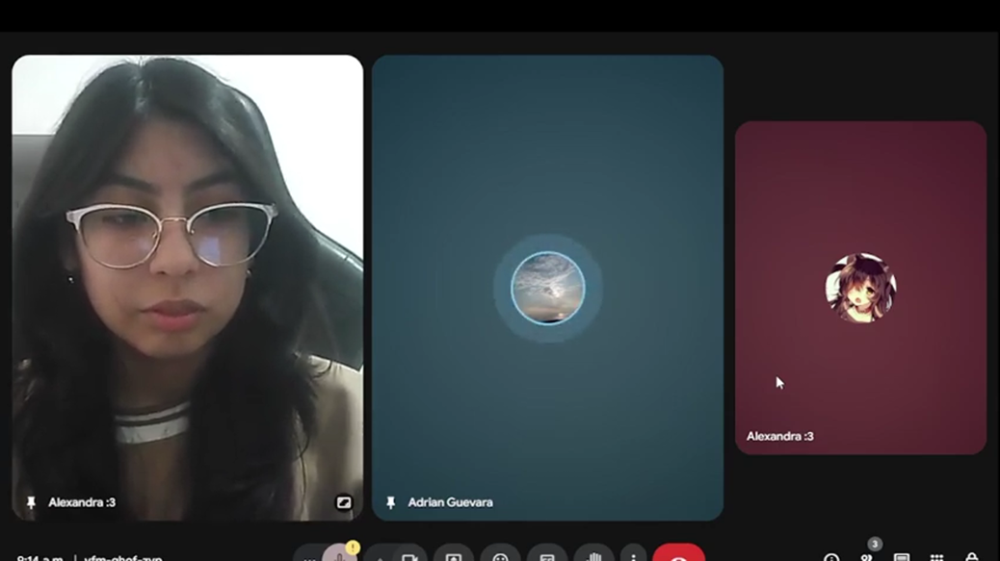
   
  <em>Figura 5. YouTube: Entrevista 2: Estudiante-Aprendiz | SkillSwap. Nota: En esta figura se aprecia la segunda entrevista al segmento estudiante-aprendiz.</em>

* **URL:** [https://www.youtube.com/watch?v=Ci4k50FULHE](https://www.youtube.com/watch?v=Ci4k50FULHE)

* **Inicio:** 0:10
* **Duración:** 9 minutos con 25 segundos

**Resumen descriptivo:**
En esta segunda entrevista, Adrián es estudiante de Ingeniería de Sistemas en la Universidad de Lima, actualmente en su tercer ciclo, y ha experimentado dificultades de coordinación en cursos como Matemática Discreta. Prefiere estudiar solo por las noches, ya que estudiar en grupo suele generar problemas de organización y comunicación. Cuando se encuentra con dificultades académicas, primero repasa el tema y, si persiste el problema, recurre a tutores particulares; valora especialmente la paciencia y claridad del tutor. Está abierto a recibir ayuda de estudiantes de otras universidades, destacando la ventaja de obtener distintos enfoques y perspectivas sobre un problema. Señala que la disponibilidad horaria de compañeros y profesores es un obstáculo frecuente. Respecto a herramientas digitales, utiliza plataformas como Meet y WhatsApp para sesiones grupales y considera útiles funciones como chat, pizarra virtual y grabación para tutorías. Prefiere la ayuda inmediata en casos urgentes, aunque valora la experiencia del tutor cuando puede planificar con antelación.

**Entrevista 3**
* **Nombres:** Stephanie
* **Apellidos:** Romero
* **Edad:** 19 años
* **Distrito:** San Miguel

  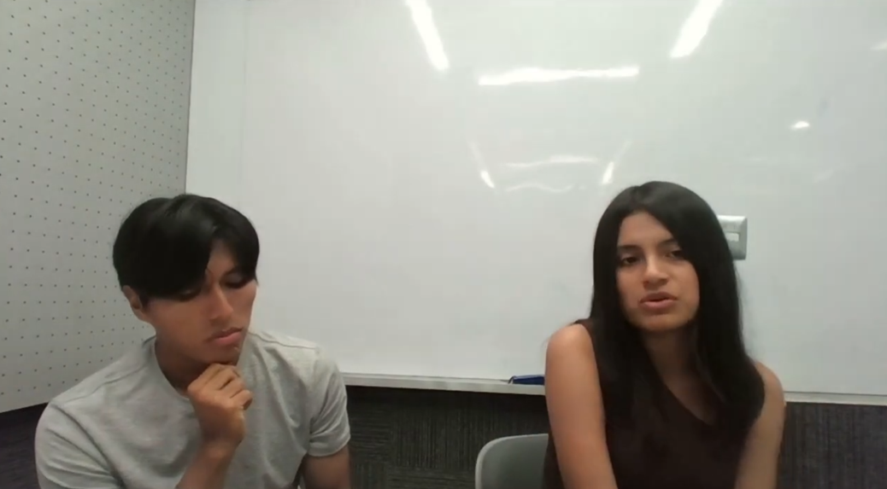
   
  <em>Figura 6. YouTube: Entrevista 3: Estudiante-Aprendiz | SkillSwap. 
   
  Nota: En esta figura se aprecia a la tercera persona siendo entrevistada de nuestro segmento estudiante-aprendiz.</em>

* **URL:**[https://www.youtube.com/watch?v=RvON7FjKH8g](https://www.youtube.com/watch?v=RvON7FjKH8g)

* **Inicio:** 0:10
* **Duración:** 9 minutos con 17 segundos

**Resumen descriptivo:**
En esta tercera entrevista Stefanie estudia Negocios Internacionales en la Universidad de Lima y se encuentra en el sexto ciclo. Considera su último ciclo académico muy demandante, destacando el curso de Inteligencia de Negocios de Big Data como especialmente difícil por la programación involucrada. Prefiere estudiar sola para comprender los temas a su ritmo antes de colaborar en grupo. Cuando enfrenta dificultades, recurre primero a recursos en línea, luego a familiares y, si es necesario, a compañeros que dominen el tema. Valora recibir ayuda de estudiantes de otras universidades, ya que permite contrastar perspectivas y métodos distintos. Señala que el miedo a ser juzgada es un obstáculo al pedir ayuda a compañeros o profesores. Ha utilizado herramientas digitales como Script para complementar sus estudios y considera útiles tutorías pagadas cuando no puede resolver dudas por sí misma. Destaca que prefiere esperar para recibir ayuda de alguien que realmente domine el tema, priorizando la calidad del aprendizaje sobre la inmediatez. Sugiere que una aplicación de tutorías incluya perfiles con especialidades, cursos previos y mini-ejercicios para reforzar lo aprendido.

#### Segmento objetivo #2: Estudiantes que quieran enseñar

**Entrevista 1**
* **Nombres:** Lucero Tatiana
* **Apellidos:** Campos
* **Edad:** 28 años
* **Distrito:** Tarapoto

  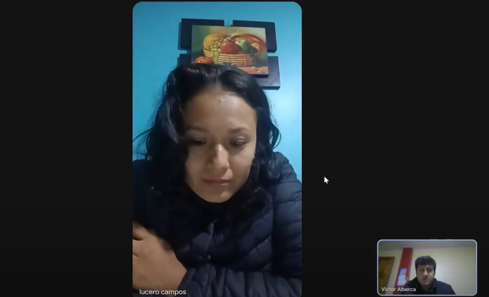
   
  <em>Figura 7. YouTube: Entrevista 1: Estudiante-Tutor | SkillSwap. 
   
  Nota: En esta figura se aprecia a la primera persona entrevista de nuestro segmento estudiante-tutor.</em>

* **URL:** [https://www.youtube.com/watch?v=fMeHUnvO4rA](https://www.youtube.com/watch?v=fMeHUnvO4rA)

* **Inicio:** 0:00
* **Duración:** 6 minutos con 32 segundos

**Resumen descriptivo:**
En esta entrevista, Lucero Campos cursa el octavo ciclo en la Universidad César Vallejo de Tarapoto y muestra especial interés en el área de atención al desarrollo de la primera infancia. Sus compañeros suelen buscarla antes de los exámenes para que les explique temas, lo cual disfruta porque le permite compartir ideas y reforzar su aprendizaje. Se siente motivada a enseñar con el fin de adquirir experiencia y valora que su tiempo sea reconocido. Considera positiva la posibilidad de ayudar a estudiantes de otras universidades, ya que le permitiría ampliar sus ideas y experiencias, aunque reconoce que la falta de interés de los aprendices o no sentirse valorada serían factores desmotivadores. No esperaría una recompensa material por sus tutorías, sino simplemente gratitud. Como apoyo, sugiere herramientas como pizarra virtual, borrador interactivo y un sistema de reputación que permita generar confianza en la plataforma. También resalta la importancia de expresar emociones en las clases para evitar la monotonía y fomentar una interacción más dinámica.

**Entrevista 2**
* **Nombres:** Abigail
* **Apellidos:** Carbajal
* **Edad:** 18 años
* **Distrito:** Pueblo Libre

  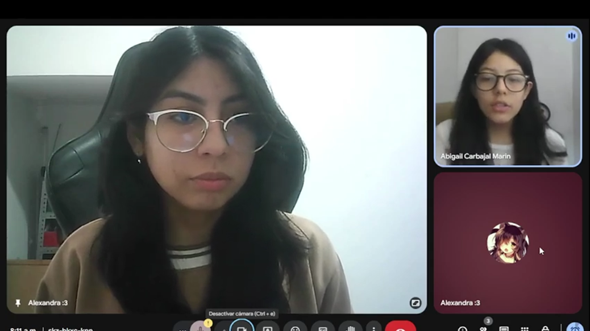
   
  <em>Figura 8. YouTube: Entrevista 2: Estudiante-Tutor | SkillSwap. Nota: En esta figura se aprecia la segunda entrevista de nuestro segundo segmento estudiante-tutor.</em>

* **URL:**[https://www.youtube.com/watch?v=zFAWYnoZSzU]( https://www.youtube.com/watch?v=zFAWYnoZSzU)
* **Inicio:** 0:12
* **Duración:** 10 minutos con 28 segundos

**Resumen descriptivo:**
En esta segunda entrevista, Abigail estudia Psicología en la Universidad Peruana Cayetano Heredia y cursa el cuarto ciclo. Se siente especialmente interesada en psicopatología y destaca en este curso, aunque ha brindado apoyo a compañeros principalmente en estadística, usando apuntes y explicaciones adaptadas a sus necesidades. Su motivación principal para enseñar es reforzar su conocimiento, aunque no descarta recibir un pago. Señala que lo más difícil de ser tutor es encontrar la estrategia de enseñanza adecuada para cada persona y que la falta de disposición o interés del aprendiz, la distancia o el tiempo limitado pueden desanimarla. Considera útiles herramientas como pizarras virtuales, agendas, Canvas, Notion o Kahoot para organizar y hacer más didáctica la enseñanza, y resalta que la disposición del estudiante es clave para generar confianza al enseñar a personas de otras universidades.

**Entrevista 3**
* **Nombres:** Katherine
* **Apellidos:** Isuiza
* **Edad:** 20 años
* **Distrito:** Cercado de Lima

  
   
  <em>Figura 9. YouTube: Entrevista 3 Segmento Estudiante-Tutor | SkillSwap. Nota: En esta figura se aprecia a la tercera persona entrevistada de nuestro segundo segmento estudiante-tutor.</em>

* **URL:** [https://www.youtube.com/watch?v=Otu_waadCj4](https://www.youtube.com/watch?v=Otu_waadCj4)
* **Inicio:** 0:00
* **Duración:** 10 minutos con 21 segundos

**Resumen descriptivo:**
Katherine Tatiana Isuiza Vela es estudiante de Ingeniería Civil en la Universidad Privada del Norte, actualmente cursando el tercer ciclo. Se siente especialmente apasionada y cómoda con los cursos de Topografía y Dibujo Topográfico. Frecuentemente ayuda a sus compañeros, motivada por el deseo de reforzar sus propios conocimientos y practicar lo que ha aprendido. Disfruta la satisfacción de ver que otra persona comprende un tema complejo y valora la oportunidad de intercambiar diferentes métodos de aprendizaje con estudiantes de otras universidades. Considera que lo más difícil de ser tutora es la falta de tiempo y disposición del aprendiz, y se desanima ante la falta de compromiso y la mala organización de horarios. Propone que un sistema de créditos o beneficios universitarios sería una recompensa atractiva, y señala que herramientas como pizarras virtuales y calendarios facilitarían la enseñanza. La confianza para enseñar a un estudiante desconocido dependería de una buena comunicación y de percibir un interés genuino por aprender.

#### Segmento objetivo #3: Coordinador Institucional

**Entrevista 1**
* **Nombres:** Armando
* **Apellidos:** Novoa
* **Edad:** 49 años
* **Distrito:** San Miguel

---

  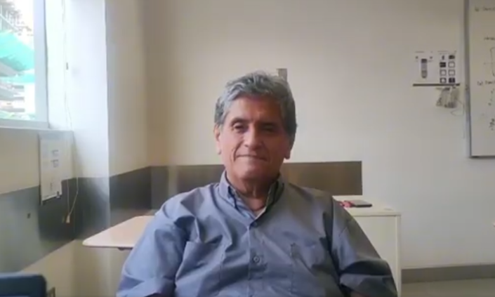

   
  <em>Figura 10. YouTube: Entrevista 3 Segmento Coordinador institucional | Innovify: En esta figura se aprecia la cuarta persona entrevistada de nuestro tercer segmento: coordinador institucional.</em>

* **URL:** [https://youtu.be/YDpJ_S8Ik2g](https://youtu.be/YDpJ_S8Ik2g)

* **Inicio:** 0:00
* **Duración:** 13 minutos con 54 segundos

---

### Resumen descriptivo

Esta entrevista fue realizada a un docente de Cálculo 2 de la Universidad Peruana de Ciencias Aplicadas (UPC).

De acuerdo con lo conversado, el profesor considera que la propuesta es una muy buena idea y la percibe como fundamental para el desarrollo profesional de los estudiantes. Destaca la importancia de que los alumnos colaboren e intercambien conocimientos, incluso entre diferentes universidades, con el fin de adaptarse a un mercado laboral cada vez más exigente.

Asimismo, mostró cautela en sus declaraciones para no vulnerar su contrato con la universidad, pero enfatizó que las plataformas tecnológicas tienen un gran potencial siempre que se utilicen bajo un marco de ética y respeto a las normas institucionales. Señaló que la educación en valores debe prevalecer sobre la simple restricción del uso de la tecnología.

Finalmente, evidenció interés en la funcionalidad operativa de la propuesta, sugiriendo que la validación y el acceso a la información se gestionen por niveles académicos, con el objetivo de asegurar que el contenido sea adecuado y pertinente para cada etapa del estudiante.

**Entrevista 2 (Parte 1 y 2)**
* **Nombres:** Jesús
* **Apellidos:** Hernández
* **Edad:** 29 años
* **Distrito:** Cercado de Lima

  
   
  <em>Figura 11 y 12. YouTube: Entrevista 2 Segmento Coordinador Institucional | SkillSwap. Nota: Entrevista dividida en dos partes.</em>

* **URL Parte 1:** [https://youtu.be/oRoAbwVAjxI](https://youtu.be/oRoAbwVAjxI) | **Inicio:** 0:00 | **Duración:** 10m 12s
* **URL Parte 2:** [https://youtu.be/tWd_sJHLAak](https://youtu.be/tWd_sJHLAak) | **Inicio:** 0:00 | **Duración:** 11m 50s

**Resumen descriptivo:**
Jesús Hernández, jefe de prácticas, señala que los principales desafíos de los alumnos son la gestión del tiempo, el acceso a información confiable y la dificultad en el trabajo en equipo. Sobre una plataforma interuniversitaria, considera esencial la verificación de alumnos, políticas claras de integridad académica y un sistema de trazabilidad. Destacó que la universidad se preocupa por evitar plagio, fraude académico y suplantación de identidad. Advirtió que la implementación de una plataforma con validación manual podría generar carga laboral y costos, sugiriendo procesos automatizados como reconocimiento facial. Propuso que el panel del coordinador permita buscar y aprobar alumnos fácilmente, acceder a su historial y monitorear interacciones para asegurar una participación segura.

**Entrevista 3**
* **Nombres:** Raúl
* **Apellidos:** Pardo
* **Edad:** 34 años
* **Distrito:** San Borja

  
   
  <em>Figura 13. YouTube: Entrevista 3 Segmento Coordinador Institucional | SkillSwap. Nota: En esta figura se aprecia la tercera persona entrevistada de nuestro tercer segmento coordinador institucional.</em>

* **URL:** [https://youtu.be/cP_YiYr2VD8](https://youtu.be/cP_YiYr2VD8)
* **Inicio:** 0:00
* **Duración:** 10 minutos con 40 segundos

**Resumen descriptivo:**
El profesor Raúl Pardo, docente en la Universidad de Lima, considera una muy buena idea y parte fundamental del estudio universitario que los alumnos compartan opiniones y se ayuden mutuamente. Destacó que las herramientas tecnológicas son productivas para la colaboración siempre que se les dé un buen uso, priorizando el aprendizaje sobre ventajas deshonestas. También mostró cierta preocupación por la carga de los alumnos tutores, ya que siente que brindar ayuda constante podría impactar negativamente en su propio tiempo y productividad, especialmente en alumnos con muchas responsabilidades académicas.

### 2.2.3. Análisis de entrevistas

#### Segmento objetivo #1: Estudiantes que quieran aprender

**1. Características objetivas**
* **Edad:** Estudiantes universitarios, generalmente entre 18 y 24 años (100%).
* **Carrera:** Diversas carreras universitarias (Enfermería, Ingeniería, Negocios Internacionales) (100%).
* **Ciclo:** 3° a 6° ciclo (100%).
* **Experiencia con plataformas:**
  * Poca experiencia con tutorías online formales (2 de 3).
  * Uso de herramientas digitales para estudio (Meet, WhatsApp, Script) (100%).
  * Estudio individual: Prefieren estudiar solos la mayor parte del tiempo (100%).

**2. Características subjetivas**
* **Preferencias de estudio:**
  * Estudio individual para concentración y calma ante estrés (100%).
  * Estudio en horarios específicos: tardes o noches (66%).
  * Prefieren un lugar sin distracciones (33%).
* **Dificultades académicas:**
  * Obstáculos para pedir ayuda a compañeros o profesores: demora de respuestas, falta de disponibilidad, miedo a ser juzgado (100%).
  * Problemas de coordinación en grupos y comunicación (33%).
  * Cursos demandantes y prácticos aumentan estrés (66%).
* **Uso de recursos externos:**
  * Buscan apoyo en internet y familiares (100%).
  * Valoran recibir ayuda de estudiantes expertos de otras universidades (100%).
  * Prioridad en la calidad de aprendizaje sobre la inmediatez de la ayuda (33%).
* **Herramientas digitales y funcionalidades deseadas:**
  * Chat, pizarra virtual y grabación de sesiones (100%).
  * Perfiles con reseñas, especialidades y mini-ejercicios (66%).
  * Tutorías pagadas si no pueden resolver dudas por sí mismos (33%).

| Característica | % Entrevistados | Fuente / Frase de entrevista |
| :--- | :--- | :--- |
| Prefiere estudiar solo | 100% | Prefiere estudiar sola por las tardes/noches. |
| Valoración ayuda de otros estudiantes | 100% | Valora recibir apoyo de estudiantes expertos de otras universidades. |
| Obstáculos pedir ayuda | 100% | Demora de respuestas / falta de disponibilidad / miedo a ser juzgada. |
| Uso de herramientas digitales | 100% | Utiliza plataformas como Meet, WhatsApp, Script. |
| Funciones deseadas en aplicación | 66% | Perfiles con reseñas, chat, pizarra virtual, mini-ejercicios. |
| Tutorías pagadas | 33% | Considera útiles tutorías pagadas cuando no puede resolver dudas por sí misma. |
| Ciclo universitario | 100% | 3° a 6° ciclo de diversas carreras. |

*(Tabla 4. Principales hallazgos de entrevistas a estudiantes universitarios - Elaboración propia. Nota: La tabla resume los comportamientos, percepciones y preferencias identificadas en las entrevistas).*

---

#### Segmento objetivo #2: Estudiantes que quieran enseñar

**1. Características objetivas**
* **Edad y ciclo:** Estudiantes universitarios de diversos ciclos (100%).
* **Carrera:** Diversas carreras (Psicología, Educación, Ingeniería Civil) (100%).
* **Experiencia:** Participan en grupos de estudio y ayudan a compañeros de manera informal antes de los exámenes (100%).
* **Habilidades digitales:** Mencionan y sugieren el uso de herramientas digitales para tutorías (agenda, pizarra virtual, Canvas, Notion, Kahoot, sistemas de reputación) (100%).

**2. Características subjetivas**
* **Motivaciones para enseñar:**
  * Reforzar el propio conocimiento (100%).
  * Incentivos o recompensas tangibles (pago, créditos universitarios) (67%).
  * Compartir ideas y adquirir experiencia (67%).
* **Dificultades percibidas:**
  * Falta de interés o compromiso del aprendiz (100%).
  * Encontrar la estrategia de enseñanza adecuada para cada persona (67%).
  * Tiempo limitado, distancia y mala organización de horarios (67%).
* **Preferencias y necesidades en la tutoría:**
  * Necesidad de conocer al estudiante para generar confianza (100%).
  * Herramientas digitales para organizar y hacer didáctica la enseñanza (100%).
  * Sistema de recompensas (créditos canjeables o pago) para incentivar la participación (67%).

| Característica | % Entrevistados | Fuente / Frase de entrevista |
| :--- | :--- | :--- |
| Motivo principal: reforzar conocimiento | 100% | Su motivación principal para enseñar es reforzar su conocimiento. |
| Participa en tutorías | 100% | Todos tienen experiencia ayudando a sus compañeros de manera ocasional o regular. |
| Uso de herramientas digitales | 100% | Herramientas como agenda, pizarra virtual, Canvas, Notion, Kahoot. |
| Necesidad de generar confianza | 100% | Todas necesitan percibir interés o tener un sistema que valide al otro usuario. |
| Motivación económica/recompensas | 67% | Sugiere un sistema de recompensas / no descarta recibir un pago. |
| Dificultad: tiempo y organización | 67% | La mala gestión de horarios, el tiempo limitado y la distancia son barreras importantes. |
| Dificultad: estrategia de enseñanza | 67% | Consideran un reto encontrar la metodología de enseñanza adecuada para cada alumno. |

*(Tabla 5. Principales hallazgos de entrevistas a estudiantes tutores - Elaboración propia. Nota: La tabla sintetiza las motivaciones, desafíos y necesidades expresadas por los estudiantes que ofrecen tutorías).*

---

#### Segmento objetivo #3: Coordinador Institucional

**1. Características objetivas**
* **Edad y rol:**
  * Profesionales entre 29 y 53 años (100%).
  * Docentes, coordinadores o jefes de práctica (100%).
* **Ámbito laboral:**
  * Universidades (100%).
* **Responsabilidades:**
  * Supervisión del aprendizaje (100%).
  * Garantizar integridad académica (100%).
  * Evaluación del desempeño (100%).
* **Relación con tecnología:**
  * Uso de herramientas digitales educativas (100%).
  * Sistemas de control académico (100%).

**2. Características subjetivas**
* **Percepción del aprendizaje colaborativo:**
  * Considerado fundamental (100%).
  * Positiva colaboración interuniversitaria (100%).
  * Mejora la preparación profesional (66%).
* **Preocupaciones:**
  * Plagio, fraude y suplantación (100%).
  * Uso indebido de tecnología (100%).
  * Información poco confiable (100%).
  * Riesgo reputacional (66%).
* **Barreras:**
  * Validación de estudiantes (100%).
  * Carga operativa (67%).
  * Costos (67%).
  * Necesidad de automatización (33%).
* **Limitaciones del estudiante:**
  * Falta de tiempo (100%).
  * Mala gestión del tiempo (100%).
  * Problemas de trabajo en equipo (66%).
* **Requisitos de la plataforma:**
  * Verificación de identidad (100%).
  * Validación académica (100%).
  * Políticas claras (100%).
  * Trazabilidad de interacciones (100%).
  * Panel de monitoreo (100%).
* **Condiciones de aceptación:**
  * Enfoque en aprendizaje (100%).
  * Marco ético claro (100%).
  * No afectar rendimiento (66%).
  * No sobrecargar usuarios (66%).

| Característica | % entrevistados | Insight clave |
| :--- | :--- | :--- |
| Aprendizaje colaborativo | 100% | Fundamental |
| Colaboración interuniversitaria | 100% | Positiva si se controla |
| Preocupación por fraude | 100% | Riesgo principal |
| Validación de identidad | 100% | Requisito crítico |
| Uso responsable de tecnología | 100% | Condición base |
| Riesgo reputacional | 66% | Preocupación relevante |
| Problemas de tiempo | 100% | Limita uso |
| Sistema de monitoreo | 100% | Necesario |
| Carga operativa | 67% | Barrera |
| Segmentación académica | 33% | Mejora pertinencia |

*(Tabla 6. Principales hallazgos de entrevistas a coordinadores académicos - Elaboración propia. Nota: Resultados obtenidos en las entrevistas con coordinadores o jefes de práctica).*

---

## 2.3. Needfinding

Para el proceso de needfinding, se ha planificado la realización de entrevistas a los tres arquetipos de usuarios identificificados: "Estudiantes que quieran aprender", "Estudiantes que quieran enseñar" y el "Coordinador Institucional". El objetivo principal de esta investigación es indagar en las motivaciones, frustraciones y necesidades de los estudiantes universitarios peruanos cuando buscan o desean ofrecer apoyo académico más allá de las fronteras de su propia institución.

A través de este proceso, se busca validar las hipótesis iniciales del proyecto, como la existencia de una demanda latente de colaboración interuniversitaria y la importancia crítica de la seguridad y la confianza en un entorno digital de este tipo. Los hallazgos derivados de las entrevistas permitirán comprender a fondo los problemas que la plataforma debe resolver, como el aislamiento académico y la desconfianza inicial entre pares desconocidos.

### 2.3.1. User Personas

Para iniciar esta sección del documento, el equipo seleccionó las características más relevantes de todas las que ofrece la plataforma UXPressia, diferenciando entre aquellas de carácter global (comunes a los tres segmentos) y las específicas que resultaban más pertinentes para determinados perfiles. Cada integrante compartió sus aportes en los apartados correspondientes, respondiendo preguntas puntuales sobre la persona creada, siempre a partir de los resultados obtenidos y analizados en las entrevistas previas. Finalmente, consensuamos la opción que consideramos más adecuada, adaptándola para que fuese más precisa y representativa del perfil que buscamos. Este proceso no solo permitió refinar la definición de cada segmento, sino también alinear la visión del equipo respecto al usuario objetivo.

**User Persona: Estudiantes que quieran aprender**

  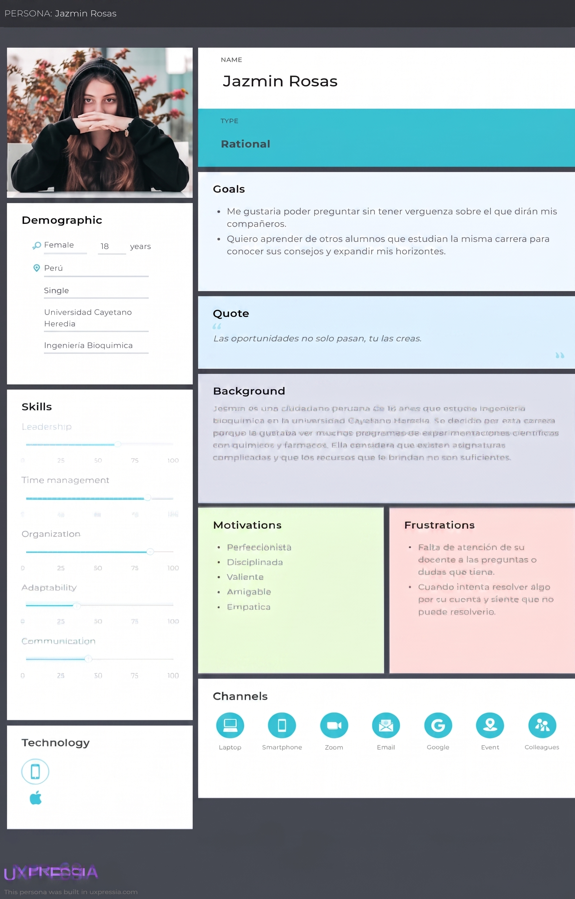
   
  <em>Figura 12. User Persona - Estudiantes que quieran aprender - Elaboración propia.</em>

En esta figura se observa el arquetipo de usuario correspondiente al segmento de estudiantes o "Learners". El perfil de Jazmin Rosas detalla las metas, motivaciones y frustraciones de una estudiante de ingeniería, proporcionando una base clara para orientar el desarrollo hacia soluciones de aprendizaje colaborativo y soporte académico entre pares.
  

**User Persona: Estudiantes que quieran enseñar**

  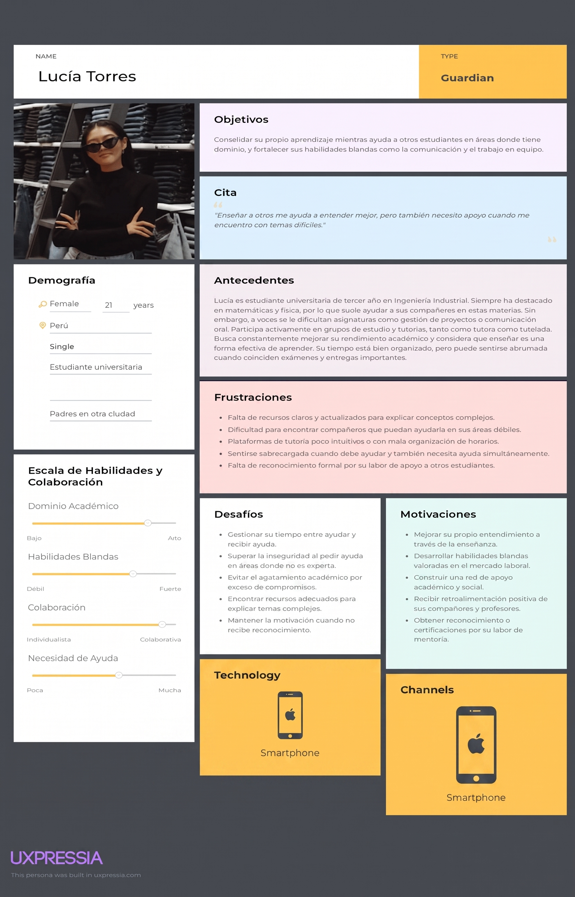
   
  <em>Figura 14. User Persona - Estudiantes que quieran enseñar - Elaboración propia.</em>

En esta figura se presenta el arquetipo de usuario "Lucía Torres", el cual personifica el segmento de estudiantes con un rol híbrido que actúan simultáneamente como tutores y aprendices. El perfil describe sus antecedentes académicos en ingeniería y sus objetivos de fortalecer habilidades blandas mediante la enseñanza, proporcionando información valiosa sobre los desafíos de gestión del tiempo y la necesidad de herramientas intuitivas para la organización de las sesiones de tutoría.
 
 

**User Persona: Coordinador Institucional**

  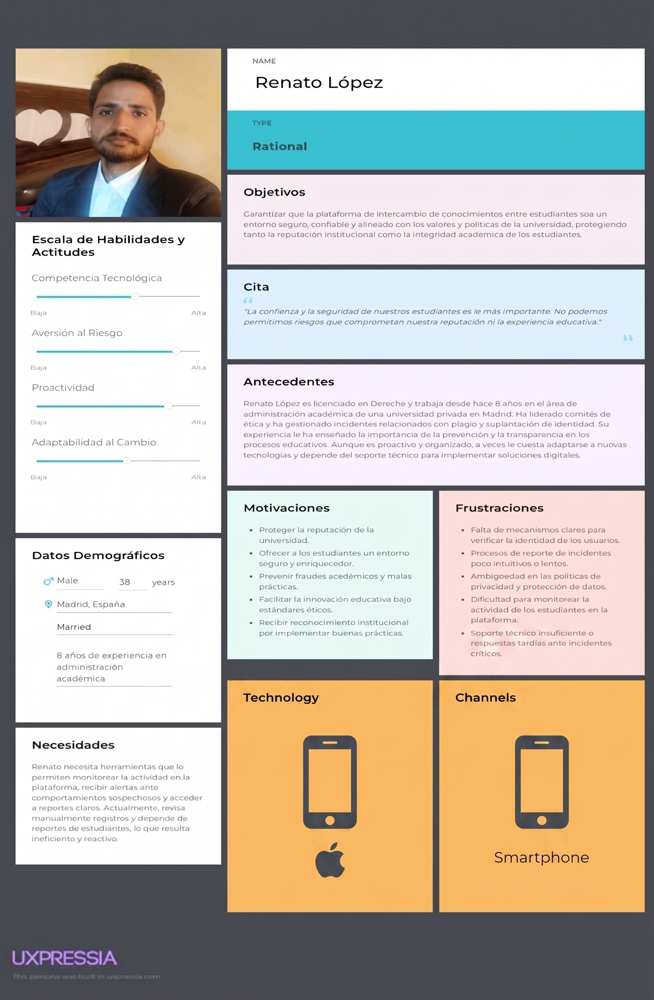
   
  <em>Figura 15. User Persona - Coordinador Institucional - Elaboración propia.</em>

En la imagen tenemos la caracterización de Renato López, quien representa el segmento administrativo y de moderación del sistema. Su perfil resalta objetivos enfocados en la seguridad, la integridad académica y el monitoreo de comportamientos, definiendo los requerimientos necesarios para las herramientas de gestión institucional de la plataforma.
 
 
 

**En conjunto**, los arquetipos de usuario presentados permiten comprender de manera clara las necesidades, motivaciones y desafíos de los principales actores dentro del sistema. El perfil de los estudiantes o “Learners” orienta el diseño hacia experiencias de aprendizaje colaborativo y soporte académico efectivo, mientras que el arquetipo del usuario administrativo establece los lineamientos necesarios para garantizar la seguridad, la integridad académica y una adecuada supervisión del comportamiento dentro de la plataforma.

Por otro lado, el perfil híbrido de usuarios que cumplen simultáneamente roles de estudiante y tutor aporta una visión más dinámica del ecosistema, evidenciando la necesidad de herramientas flexibles que faciliten la gestión del tiempo y la organización de sesiones de enseñanza. En conjunto, estos arquetipos permiten alinear el desarrollo del sistema con usuarios reales y diversos, asegurando una solución más centrada en la experiencia, la eficiencia operativa y el equilibrio entre aprendizaje, enseñanza y administración.

 

---

### 2.3.2. User Task Matrix

En el User Task Matrix se considera a los tres segmentos evaluando sus tareas clave según frecuencia e importancia. Los aprendices priorizan estudiar independientemente y acceder a recursos de apoyo; los tutores, reforzar su conocimiento y participar en grupos de estudio; y los coordinadores, orientar casos prácticos, gestionar el tiempo y verificar la integridad académica. Todos coinciden en usar herramientas digitales y favorecer la colaboración, aunque cada segmento aplica estas tareas con objetivos distintos.

#### Segmento objetivo #1: Estudiantes que quieran aprender

| Tareas | Boris | Adrian | Stephanie |
| :--- | :--- | :--- | :--- |
| **Buscar información de Internet** | Frec: Alta Imp: Alta | Frec: Alta Imp: Alta | Frec: Alta Imp: Alta |
| **Consultar a familiares o compañeros con experiencia** | Frec: Media Imp: Media-Alta | Frec: Media Imp: Alta | Frec: Media Imp: Media-Alta |
| **Estudiar independientemente en horarios tranquilos** | Frec: Muy alta Imp: Muy alta | Frec: Muy alta Imp: Muy alta | Frec: Muy alta Imp: Muy alta |
| **Coordinar con compañeros** | Frec: Media Imp: Alta | Frec: Media Imp: Alta | Frec: Media Imp: Alta |
| **Acceder a plataformas de tutorías, videos grabados o chats** | Frec: Muy alta Imp: Muy alta | Frec: Alta Imp: Alta | Frec: Muy alta Imp: Muy alta |
| **Contratar un tutor particular** | Frec: Media Imp: Muy alta | Frec: Media Imp: Muy alta | Frec: Media Imp: Muy alta |

*(Tabla 7. Actividades de aprendizaje y su valoración por los usuarios - Elaboración propia).*

#### Segmento objetivo #2: Estudiantes que quieran enseñar

| Tareas | Lucero | Abigail | Katherine |
| :--- | :--- | :--- | :--- |
| **Estudiar y reforzar su conocimiento antes de enseñar** | Frec: Muy alta Imp: Muy alta | Frec: Muy alta Imp: Muy alta | Frec: Muy alta Imp: Muy alta |
| **Participar en grupos de estudio y colaborar con compañeros** | Frec: Alta Imp: Alta | Frec: Muy alta Imp: Muy alta | Frec: - Imp: Muy alta |
| **Ayudar a estudiantes de otras universidades** | Frec: Media Imp: Alta | Frec: Alta Imp: Alta | Frec: Media Imp: Alta |
| **Conocer al estudiante antes de brindar ayuda para generar confianza** | Frec: Media Imp: Alta | Frec: Media Imp: Muy alta | Frec: Media Imp: Alta |
| **Utilizar herramientas digitales para tutoría** | Frec: Media Imp: Alta | Frec: Alta Imp: Alta | Frec: Media Imp: Alta |
| **Gestionar motivación y recompensas de la tutoría** | Frec: Baja-Media Imp: Media-Alta | Frec: Baja-Media Imp: Media | Frec: Baja Imp: Media |

*(Tabla 8. Actividades y motivaciones de los estudiantes-tutores – Elaboración propia).*

#### Segmento objetivo #3: Coordinador Institucional

| Tareas | Armando | Jesús | Raúl |
| :--- | :--- | :--- | :--- |
| **Guiar a los estudiantes en la aplicación práctica de conceptos mediante casos...** | Frec: Muy alta Imp: Muy alta | Frec: Muy alta Imp: Muy alta | Frec: Alta Imp: Muy alta |
| **Enseñar a los estudiantes a gestionar el tiempo y organizarse...** | Frec: Media Imp: Alta | Frec: Muy alta Imp: Alta | Frec: Media-Alta Imp: Alta |
| **Fomentar el trabajo en equipo y habilidades de comunicación** | Frec: Media Imp: Alta | Frec: Alta Imp: Alta | Frec: Alta Imp: Alta |
| **Garantizar acceso a información confiable y enseñar a evaluarla...** | Frec: Media Imp: Muy alta | Frec: Alta Imp: Muy alta | Frec: Media Imp: Alta |
| **Verificar alumnos y asegurar integridad académica en la plataforma...** | Frec: Baja-Media Imp: Alta | Frec: Media Imp: Alta | Frec: Alta Imp: Alta |
| **Implementar herramientas digitales y plazos que faciliten la organización...** | Frec: Media Imp: Alta | Frec: Alta Imp: Alta | Frec: Alta Imp: Muy alta |

*(Tabla 9. Funciones y prioridades de los coordinadores académicos – Elaboración propia).*

**Conclusión:**
Las tareas más frecuentes e importantes son estudiar de forma independiente y acceder a recursos de apoyo para los aprendices; reforzar conocimiento y participar en grupos de estudio para los tutores; y orientar casos prácticos y verificar integridad académica para los coordinadores. Todos los segmentos coinciden en usar herramientas digitales y favorecer la colaboración, aunque cada grupo las aplica con un enfoque distinto según sus objetivos.

### 2.3.3. User Journey Mapping

En esta sección se presentan los User Journey Maps As-Is de cada User Persona, mostrando el recorrido completo (end-to-end) de los usuarios en la situación actual, sin intervención de la nueva solución, lo que incluye procesos, puntos de dolor y oportunidades.

* **Segmento 1: Estudiantes que quieran aprender.** Inicia con la necesidad de comprender un tema, pasando por dudas, búsquedas de ayuda frustrantes y coordinación complicada, hasta la evaluación del aprendizaje, evidenciando problemas de disponibilidad y confiabilidad de recursos.
* **Segmento 2: Estudiantes que quieran enseñar.** Comienza con motivación por reforzar su conocimiento y ayudar, pero enfrenta obstáculos en la preparación de material, coordinación con el aprendiz y falta de retroalimentación para mejorar su enseñanza.
* **Segmento 3: Coordinadores Institucionales.** Inician su recorrido al identificar la necesidad de mantener la calidad académica y fomentar la colaboración. Continúan con la planeación y preparación de estrategias, pero enfrentan complejidades al anticipar errores operativos. Durante la implementación y coordinación, sufren de sobrecarga operativa y riesgos de plagio o fraude, para finalmente en la etapa de supervisión y evaluación, lidiar con limitaciones operativas y la dificultad de medir el impacto real de sus esfuerzos.

#### Segmento #1: Estudiantes que quieran aprender

  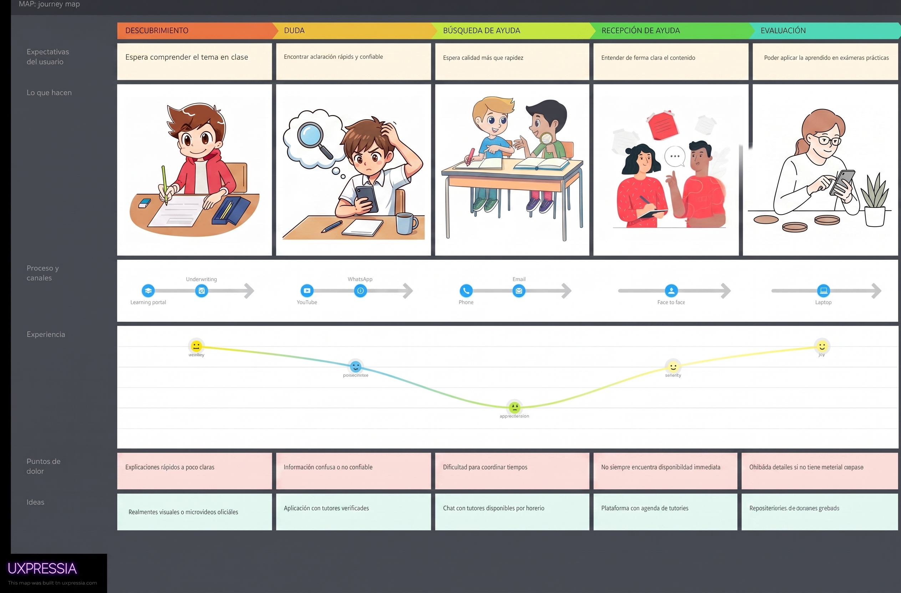
   
  <em>Figura 16. User Journey Mapping – Estudiantes que quieran aprender - Elaboración propia. Nota: En esta figura se aprecia nuestro primer Journey Mapping de nuestro primer segmento estudiante aprendiz.</em>

 
En esta figura se observa el recorrido del estudiante o aprendiz a través de cinco etapas críticas: descubrimiento, duda, búsqueda, recepción de ayuda y evaluación. El diagrama detalla la curva emocional del usuario, identificando puntos de dolor como la dificultad para coordinar horarios y la falta de claridad en explicaciones, proponiendo soluciones como el uso de tutores verificados y repositorios de sesiones grabadas.
 

#### Segmento #2: Estudiantes que quieran enseñar

  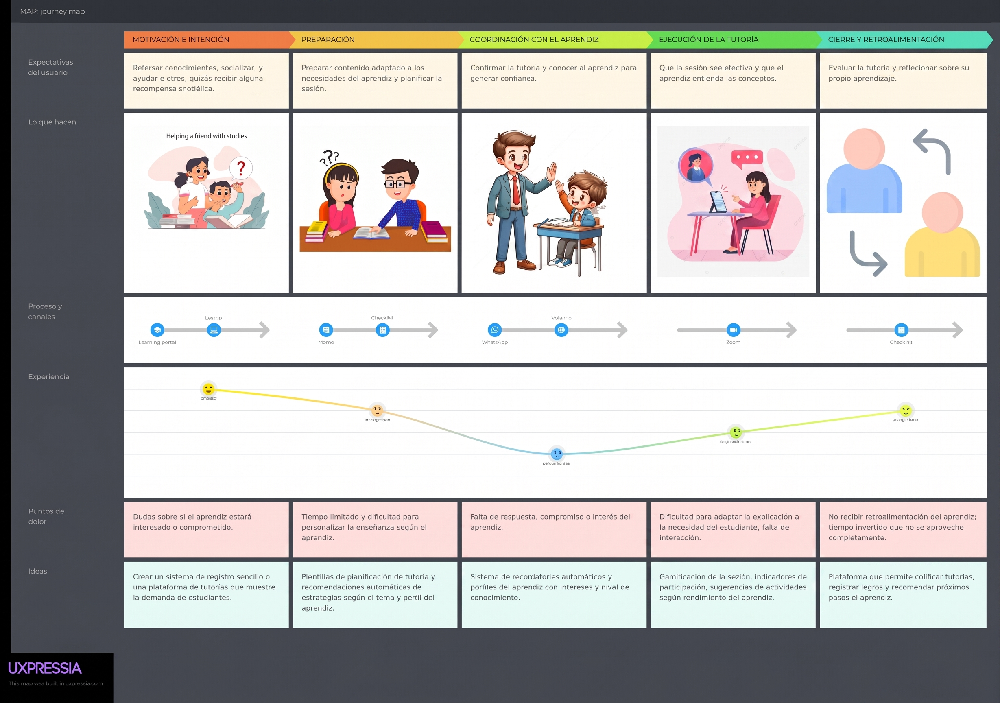
   
  <em>Figura 17. User Journey Mapping – Estudiantes que quieran enseñar - Elaboración propia. Nota: En esta figura se aprecia nuestro segundo Journey Mapping de nuestro segundo segmento estudiante tutor.</em>

 
En la imagen tenemos la visualización de la experiencia desde la perspectiva del tutor. El mapa describe el proceso desde la motivación inicial y la preparación del material hasta el cierre y retroalimentación de la sesión. Se resalta la fluctuación de la experiencia según el compromiso del aprendiz y se proponen ideas de mejora como la gamificación de las sesiones y sistemas de recordatorios automáticos para optimizar la gestión del tiempo.
 

#### Segmento #3: Coordinador Institucional

  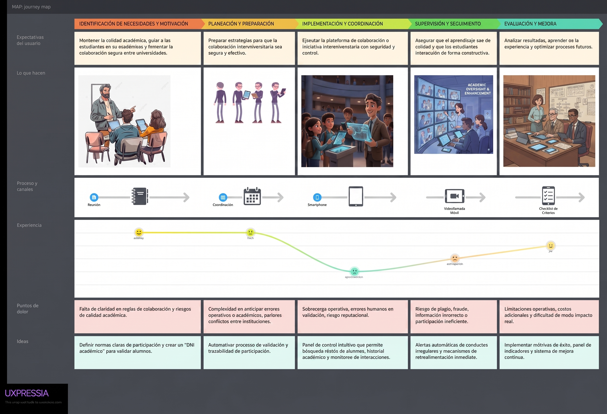
   
  <em>Figura 18. User Journey Mapping - Coordinador Institucional - Elaboración propia. Nota: En esta figura se aprecia nuestro tercer Journey Mapping de nuestro segmento coordinador institucional.</em>

En esta figura se detalla el flujo de gestión desde el ángulo administrativo y de calidad académica. El mapa abarca la planeación, implementación y supervisión de las tutorías interuniversitarias, poniendo énfasis en la mitigación de riesgos operativos como el plagio o el fraude. Se proponen herramientas técnicas de control, tales como un "DNI académico" para la validación de alumnos y paneles de control intuitivos para el monitoreo de interacciones.
 
 
 

**Entonces**, los mapas de experiencia presentados permiten comprender de manera integral cómo interactúan los distintos actores con la plataforma a lo largo de sus procesos clave. Desde la perspectiva del estudiante, se evidencia un recorrido marcado por necesidades emocionales y operativas que van desde la incertidumbre inicial hasta la evaluación final, identificando puntos críticos que pueden ser mitigados mediante herramientas de apoyo como tutores verificados y recursos grabados.

Desde el lado del tutor, la experiencia se centra en la preparación, ejecución y retroalimentación de las sesiones, donde la calidad de la interacción depende del nivel de compromiso del aprendiz, proponiéndose mejoras orientadas a la motivación y la optimización del tiempo mediante gamificación y automatización de recordatorios.

Finalmente, la visión administrativa incorpora una capa de control y supervisión orientada a garantizar la calidad académica y la seguridad del sistema, abordando riesgos como el fraude o el plagio mediante mecanismos de validación y paneles de monitoreo. En conjunto, estas perspectivas permiten diseñar una experiencia equilibrada, eficiente y segura para todos los participantes del ecosistema educativo.

 

---

### 2.3.4. Empathy Mapping

Para profundizar en el entendimiento de nuestros usuarios finales y diseñar una solución que responda a sus necesidades reales, se desarrollaron mapas de empatía para cada segmento identificado. Esta herramienta permite visualizar el entorno, las percepciones y las motivaciones de los actores clave (aprendiz, tutor y administrador), facilitando la identificación de puntos críticos y oportunidades de valor dentro del ecosistema de SkillSwap.
 

#### Segmento #1: Estudiantes que quieran aprender

  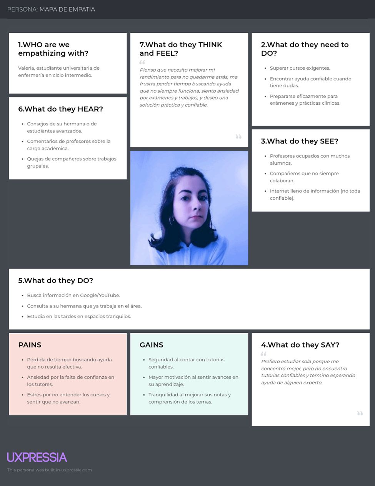
   
  <em>Figura 19. Empathy Mapping - Estudiantes aprendices - Elaboración propia. Nota: En esta figura se aprecia nuestro Empathy Mapping de nuestro primer segmento estudiante aprendiz.</em>

 
Se observa el mapa de empatía de Valeria, estudiante universitaria que representa al segmento de aprendices. El diagrama detalla su necesidad de encontrar apoyo académico confiable ante una carga académica exigente, identificando como puntos de dolor la ansiedad generada por la falta de confianza en los tutores actuales y la frustración de perder tiempo buscando ayuda poco efectiva.

 

#### Segmento #2: Estudiantes que quieran enseñar

  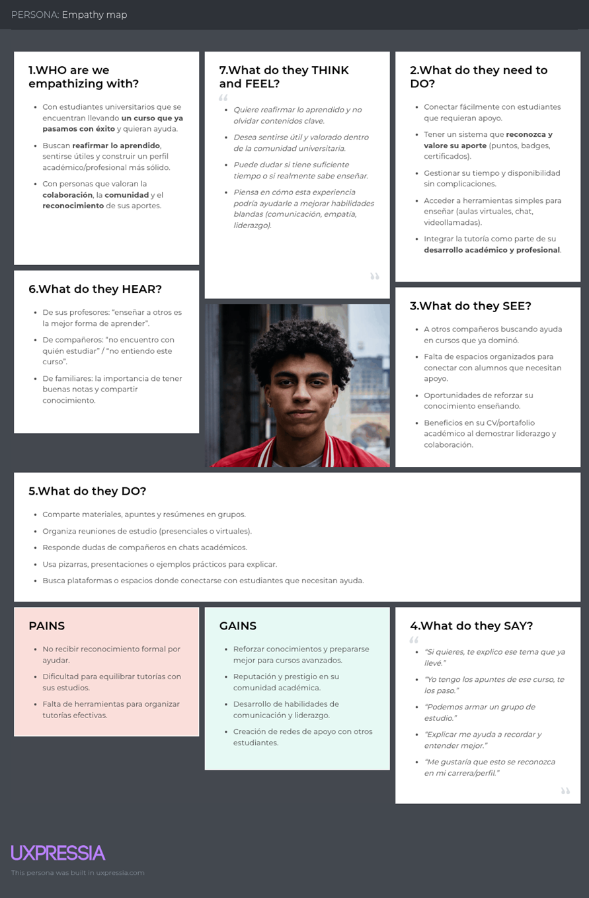
   
  <em>Figura 20. Empathy Mapping - Estudiantes tutores - Elaboración propia. Nota: En esta figura se aprecia nuestro segundo Empathy Mapping de nuestro segmento estudiantes tutores.</em>

 
En esta figura se detalla el mapa de empatía orientado al estudiante con rol de tutor. El análisis subraya su deseo de reafirmar conocimientos mediante la enseñanza y construir un perfil académico/profesional sólido. Se identifican como principales desafíos la falta de reconocimiento formal por su labor de apoyo y la dificultad para equilibrar las tutorías con sus propias responsabilidades de estudio.
 

#### Segmento #3: Coordinador Institucional

  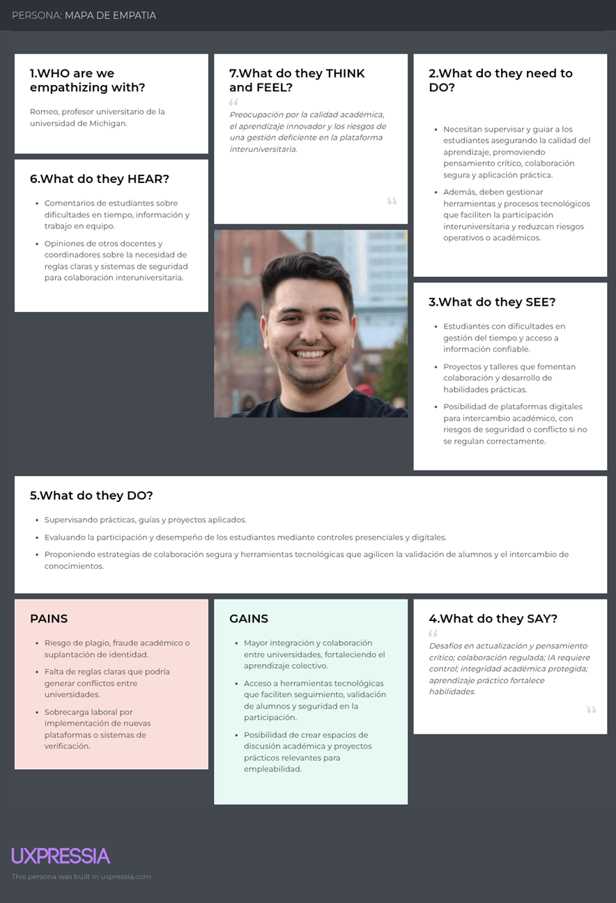
   
  <em>Figura 21. Empathy Mapping - Coordinador Institucional - Elaboración propia. Nota: En esta figura se aprecia nuestro tercer Empathy Mapping de nuestro segmento coordinador institucional.</em>

En la imagen tenemos la caracterización empática de Romeo, representante del segmento institucional y administrativo. El mapa resalta su preocupación por mantener la calidad académica y la integridad institucional, señalando como riesgos principales el fraude o suplantación de identidad, y visualizando como ganancia el acceso a herramientas tecnológicas que agilicen la validación de los participantes.
  
**Entonces**, los mapas de empatía permiten profundizar en las necesidades emocionales, motivaciones y dificultades de los distintos actores del sistema, enriqueciendo la comprensión del diseño centrado en el usuario. En el caso del estudiante con rol de tutor, se evidencia una motivación orientada al refuerzo de conocimientos y al desarrollo de su perfil profesional, aunque enfrenta desafíos relacionados con el reconocimiento de su labor y la gestión del tiempo entre sus responsabilidades académicas y las tutorías.

Por su parte, el perfil institucional destaca una fuerte preocupación por la calidad académica y la seguridad del sistema, priorizando la prevención de riesgos como el fraude y la suplantación, y valorando el uso de herramientas tecnológicas que optimicen los procesos de validación. Finalmente, el estudiante aprendiz refleja una necesidad urgente de apoyo académico confiable, enfrentando emociones como la ansiedad y la frustración debido a experiencias poco efectivas en la búsqueda de ayuda. En conjunto, estos mapas evidencian la importancia de diseñar una plataforma equilibrada que atienda tanto aspectos funcionales como emocionales, asegurando confianza, eficiencia y valor para todos los usuarios.

---

## 2.4. Requirements specification

### 2.4.1. User Stories
*(Nota: Adaptar la tabla de User Stories previa para incluir los requisitos del curso: persistencia local, acceso a hardware, consumo de API propia y SDK externo).*

**Ejemplos de User Stories clave para el entorno móvil:**
*   **US_Mobile01 (Permisos de Dispositivo):** *As a user, I want the app to request camera and microphone permissions before joining a session, so that I can securely broadcast my video and audio during the live tutoring.*
*   **US_Mobile02 (Almacenamiento Local):** *As a Learner, I want the app to locally store my search preferences and recent chat history using SQLite/Room/CoreData, so that the app loads faster and I can review messages even with a poor internet connection.*
*   **US_Mobile03 (Consumo SDK Externo):** *As a Tutor, I want to initiate a live video call directly within the app using an integrated third-party SDK (e.g., Agora or Jitsi), so that I don't have to share external links with the learner.*
*   **Spike Story (Investigación):** *Investigate and prototype the integration of the external Video SDK into the native mobile architecture, evaluating performance, battery consumption, and necessary device permissions.*

### 2.4.2. Impact Mapping
*(Nota: Insertar los diagramas de Impact Mapping conectando los Business Goals con los User Personas y las funcionalidades móviles).*

### 2.4.3. Product Backlog
*(Nota: Insertar la tabla del Product Backlog priorizado, estimando los Story Points de las historias adaptadas al desarrollo móvil).*

## 2.5. Strategic-Level Domain-Driven Design

### 2.5.1. EventStorming
*(Nota: Documentar las fases de Candidate Context Discovery y Domain Message Flows Modeling realizadas por el equipo).*

### 2.5.2. Context Mapping

El Context Mapping de Innovify (SkillSwap) evidencia las relaciones estructurales entre los siete Bounded Contexts que conforman la solución, aplicando los patrones de relación establecidos en Domain-Driven Design para gestionar las dependencias entre equipos y modelos de dominio.

**Identity & Access** actúa como **Upstream** de todo el sistema bajo el patrón **Conformist**: dado que su agregado `User` parte de una base entregada por el docente y expone únicamente `userId` y `role` como datos públicos, el resto de los Bounded Contexts (Discovery, Workspace, Learning & Assessment, Reputation, Payments & Wallet y Moderation & Disputes) se conforman a ese modelo sin negociar cambios, referenciando el identificador de usuario como un dato externo dentro de su propio esquema de persistencia.

**Discovery** mantiene una relación **Customer/Supplier** con **Identity & Access** (consume el directorio de usuarios/tutores) y con **Workspace** (le entrega el perfil del tutor seleccionado para iniciar una sesión).

**Workspace**, como núcleo operativo de la plataforma, es **Supplier** de **Learning & Assessment** (la finalización de una sesión habilita el quiz de evaluación) y de **Reputation** (el cierre de sesión dispara la solicitud de calificación al tutor), ambas bajo el patrón **Customer/Supplier**.

**Moderation & Disputes** se relaciona como **Customer/Supplier** hacia **Identity & Access** (emite órdenes de sanción sobre la cuenta) y hacia **Reputation** (ajusta la reputación del usuario sancionado tras una disputa resuelta).

Finalmente, **Workspace** y **Payments & Wallet** mantienen una relación de **Anticorruption Layer (ACL)** hacia los sistemas externos de terceros (WebRTC/almacenamiento en la nube para videollamadas, y la futura pasarela de pagos Stripe respectivamente), aislando el modelo de dominio interno de los contratos y formatos propios de dichos servicios externos.

  
   
  <em>Figura XX. Context Mapping de Innovify - Elaboración propia. Nota: Se muestran las relaciones Conformist, Customer/Supplier y Anticorruption Layer entre los Bounded Contexts Identity & Access, Discovery, Workspace, Learning & Assessment, Reputation, Payments & Wallet y Moderation & Disputes.</em>

### 2.5.3. Software Architecture
**Software Architecture Context Level Diagram:**
Muestra la interacción de los usuarios (Aprendiz, Tutor, Coordinador) con el sistema central de SkillSwap y los servicios externos de terceros (SDK de videollamadas, Pasarela de Pagos, Servicio de Correos).

**Software Architecture Container Level Diagram:**
Detalla la estructura de contenedores:
1.  **Mobile Application (Native/Cross-Platform):** La interfaz principal para estudiantes, desarrollada con soporte de almacenamiento local y acceso a hardware.
2.  **Web Application (Landing Page & Admin Dashboard):** Sitio web estático para la presentación del negocio y panel SPA para los coordinadores.
3.  **API Gateway / RESTful Web Services:** El backend desarrollado internamente que orquesta la lógica de negocio.
4.  **Database:** Repositorio central de información.

**Software Architecture Deployment Diagram:**
Muestra cómo la aplicación móvil se despliega en los dispositivos físicos de los usuarios (iOS/Android), el Landing Page en un servicio de hosting estático, y el backend junto con la base de datos en una infraestructura Cloud.

#### 2.5.3.1. Software Architecture Context Level Diagrams

El diagrama de contexto (Context Diagram) bajo el enfoque C4 Model presenta al sistema Innovify (SkillSwap) como una caja central única, mostrando sus interacciones de alto nivel con los actores principales y los sistemas externos de terceros, sin exponer aún detalles de implementación.

El sistema es utilizado por tres actores principales: el **Estudiante Aprendiz** y el **Tutor**, quienes interactúan principalmente a través de la **aplicación móvil nativa (Android) y cross-platform (Flutter)** desarrollada en este curso, así como a través de la Web Application; y el **Coordinador Institucional**, quien supervisa la plataforma principalmente desde el panel administrativo web.

A nivel de sistemas externos, Innovify se integra con: la **pasarela de pagos Stripe** (documentada como trabajo futuro para el procesamiento real de comisiones), el **servicio de videollamadas WebRTC** (utilizado durante las sesiones de tutoría dentro del Workspace), y el **servicio de correo electrónico** para el envío de notificaciones institucionales (validación de dominio `.edu.pe`, confirmaciones de sesión, entre otros).

  
   
  <em>Figura XX. C4 Model: Context Diagram - Elaboración propia. Nota: Diagrama de contexto que muestra el sistema Innovify en el centro y sus interacciones directas con los actores principales (Estudiante Aprendiz, Tutor, Coordinador) a través de la aplicación móvil nativa, la aplicación cross-platform y la Web Application, así como con los sistemas externos de terceros (Pasarela de Pagos Stripe, servicio de videollamadas WebRTC, servicio de correo electrónico).</em>

#### 2.5.3.2. Software Architecture Container Level Diagrams

El diagrama de contenedores (Container Diagram) descompone el sistema Innovify en los bloques de alto nivel que lo conforman, mostrando las principales decisiones tecnológicas y cómo se comunican entre sí. A diferencia del Context Diagram, aquí se detalla la estructura interna del sistema como un conjunto de aplicaciones y almacenes de datos desplegables de forma independiente.

Los contenedores identificados son los siguientes:

- **Landing Page (Sitio Web Estático):** Presenta el modelo de negocio de Innovify al público general, implementado con HTML5, CSS3 y JavaScript.
- **Web Application (SPA):** Aplicación de escritorio dirigida principalmente al Coordinador Institucional para la supervisión de la plataforma, desarrollada en Vue 3.
- **Android Native Application:** Aplicación móvil nativa dirigida a Estudiantes Aprendices y Tutores, desarrollada en Kotlin con Jetpack Compose, que consume los mismos Web Services RESTful que la Web Application.
- **Cross-Platform Application (Flutter):** Aplicación móvil multiplataforma (Android e iOS) que replica las funcionalidades core para Estudiantes Aprendices y Tutores, desarrollada en Flutter con Dart, consumiendo igualmente los Web Services RESTful expuestos por el backend.
- **API / RESTful Web Services:** Backend desarrollado bajo arquitectura RESTful, actuando como Published Language único para los cuatro clientes (Landing Page, Web Application, Android Native App y Flutter App), orquestando la lógica de negocio de los siete Bounded Contexts.
- **Database:** Repositorio central de persistencia, donde cada Bounded Context mantiene sus propias tablas siguiendo los principios de Domain-Driven Design.

Es importante resaltar que tanto la aplicación Android nativa como la aplicación Flutter cross-platform consumen el **mismo contrato de API RESTful** documentado con OpenAPI/Swagger, sin requerir endpoints adicionales ni lógica de backend duplicada, evidenciando así el desacoplamiento entre la capa de presentación y la capa de dominio/aplicación del sistema.

  
   
  <em>Figura XX. C4 Model: Container Diagram - Elaboración propia. Nota: Diagrama de contenedores que muestra la Landing Page, la Web Application, la Aplicación Android Nativa, la Aplicación Cross-Platform (Flutter), el backend de Web Services RESTful y la Base de Datos, junto con sus interacciones y el sistema externo Cloudinary utilizado para almacenamiento de archivos.</em>

#### 2.5.3.3. Software Architecture Deployment Diagrams

El Deployment Diagram bajo el enfoque C4 Model muestra la distribución física de los contenedores de Innovify sobre la infraestructura de hardware y los entornos de ejecución, evidenciando cómo se despliega la solución en un ambiente real.

- **Dispositivos móviles de usuario final:** Los dispositivos Android de Estudiantes Aprendices y Tutores alojan localmente la Aplicación Android Nativa (Kotlin/Jetpack Compose) y/o la Aplicación Cross-Platform (Flutter), instaladas mediante distribución interna vía **Firebase App Distribution** durante el ciclo de pruebas, y descargables desde el dispositivo físico para la sustentación del curso.
- **Navegador web del usuario:** Aloja la Landing Page y la Web Application (SPA), servidas de forma estática desde el proveedor de hosting correspondiente (Firebase Hosting / Vercel).
- **Servidor de aplicación (Cloud):** Aloja el backend de Web Services RESTful, desplegado en **Render**, donde se ejecuta la lógica de negocio de los siete Bounded Contexts y se exponen los endpoints documentados con OpenAPI/Swagger, consumidos indistintamente por los cuatro clientes (Landing Page, Web Application, Android Native App, Flutter App).
- **Servidor de base de datos (Cloud):** Aloja la base de datos relacional en **Render**, separado del servidor de aplicación, comunicándose con este último mediante una conexión segura.
- **Servicios externos en la nube:** Cloudinary para el almacenamiento de archivos compartidos en el chat del Workspace, y los servicios de terceros documentados como trabajo futuro (Stripe para pagos, WebRTC para videollamadas).

Cada uno de estos nodos se comunica mediante protocolos HTTPS, garantizando la seguridad en la transmisión de datos entre los dispositivos cliente (móvil y web) y los servidores desplegados en la nube.

  
   
  <em>Figura XX. C4 Model: Deployment Diagram - Elaboración propia. Nota: Diagrama de despliegue que muestra la distribución física de la solución, incluyendo los dispositivos móviles de usuario final (Android/Flutter) con distribución vía Firebase App Distribution, el navegador web, el servidor de aplicación en Render, el servidor de base de datos y los servicios externos (Cloudinary, Stripe, WebRTC).</em>

## 2.6. Tactical-Level Domain-Driven Design

### 2.6.1. Bounded Context: Identity & Access

#### 2.6.1.1. Domain Layer

El Domain Layer de Identity & Access concentra las reglas de negocio relacionadas con la autenticación, autorización y verificación institucional de los usuarios de la plataforma.

- **Aggregate Root:** `User` — id, username, passwordHash, email, role, isVerified, deviceToken, bio. Encapsula las reglas de validación de dominio institucional (`.edu.pe`) y el control de unicidad de username/email.
- **Value Objects:** `Email` (valida formato y dominio institucional), `Role` (enumeración: Student, Coordinator — el rol de Tutor no es un valor de este enum, sino un perfil adicional (`TutorProfile`) que un usuario Student puede poseer, gestionado en el Bounded Context Discovery), `PasswordHash` (encapsula el hash generado, nunca expone el valor plano), `DeviceToken` (identificador del dispositivo móvil, reservado para una futura integración de notificaciones — pendiente de definir el proveedor/tecnología específica).
- **Domain Services:** `PasswordHasher` (abstracción para el hashing de contraseñas), `EmailDomainValidator` (valida que el correo pertenezca a un dominio institucional autorizado).
- **Repository (interface):** `UserRepository` — define los contratos `findByUsername`, `findByEmail`, `existsByEmail`, `save`, sin exponer detalles de persistencia.

#### 2.6.1.2. Interface Layer

Expone los puntos de entrada del Bounded Context hacia los clientes (Web, Android Nativo, Flutter):

- **Controllers:** `AuthenticationController` — expone los endpoints `POST /api/v1/authentication/sign-up` y `POST /api/v1/authentication/sign-in`, consumidos de forma idéntica por los tres clientes.
- **Resources (DTOs):** `SignUpResource`, `SignInResource` (request), `AuthenticatedUserResource` (response, incluye el token JWT).

#### 2.6.1.3. Application Layer

Orquesta los casos de uso del Bounded Context sin contener lógica de negocio propia del dominio:

- **Command Services:** `UserCommandService` — implementa `handle(SignUpCommand)` y `handle(SignInCommand)`, coordinando la validación de dominio, la generación de hash de contraseña y la emisión del token JWT.
- **Command Handlers:** `SignUpCommandHandler`, `SignInCommandHandler`.

#### 2.6.1.4. Infrastructure Layer

Contiene las implementaciones concretas de acceso a servicios externos:

- **Persistence:** `UserRepositoryAdapter` (implementación de `UserRepository` sobre la base de datos relacional desplegada en Render).
- **Security:** `JwtTokenGenerator` (generación y validación de tokens JWT), `BCryptPasswordHasher` (implementación concreta de `PasswordHasher`).
- **Extensión móvil (pendiente):** El campo `deviceToken` en el agregado `User` queda reservado como punto de extensión para una futura funcionalidad de notificaciones dirigida a los clientes móviles (Android Nativo y Flutter); su implementación concreta (proveedor y mecanismo de entrega) se definirá en una iteración posterior del proyecto.

#### 2.6.1.5. Bounded Context Software Architecture Component Level Diagrams

  
   
  <em>Figura XX. C4 Model: Component Diagram del Bounded Context Identity & Access - Elaboración propia. Nota: Se detalla la segregación entre Controllers, Command Services y los adaptadores de Persistencia, Seguridad (JWT) y Notificaciones Push (Firebase Cloud Messaging), este último como componente de infraestructura adicional requerido para el soporte de clientes móviles.</em>

#### 2.6.1.6. Bounded Context Software Architecture Code Level Diagrams

##### 2.6.1.6.1. Bounded Context Domain Layer Class Diagrams

  
   
  <em>Figura XX. Diagrama de Clases UML del Domain Layer de Identity & Access - Elaboración propia. Nota: Se detalla el agregado User con sus atributos, incluyendo el Value Object DeviceToken agregado para el soporte de notificaciones push en los clientes móviles.</em>

##### 2.6.1.6.2. Bounded Context Database Design Diagram

  
   
  <em>Figura XX. Diagrama de Base de Datos del Bounded Context Identity & Access - Elaboración propia. Nota: Se destaca en el esquema el campo device_token, agregado sobre la tabla users para el registro de dispositivos móviles.</em>

---

### 2.6.2. Bounded Context: Discovery

#### 2.6.2.1. Domain Layer

El Domain Layer de Discovery concentra las reglas de negocio relacionadas con la búsqueda y filtrado de tutores disponibles en la plataforma.

- **Aggregate Root:** `TutorProfile` — id, userId (referencia externa a Identity & Access), university, career, subjects, availability, averageRating (dato derivado, sincronizado desde Reputation).
- **Value Objects:** `University`, `Career`, `SubjectList` (encapsula la lista de materias que el tutor puede enseñar).
- **Domain Services:** `TutorSearchCriteria` — encapsula y valida la combinación de filtros de búsqueda (universidad, carrera, materia) aplicados sobre el listado de tutores.
- **Repository (interface):** `TutorProfileRepository` — define los contratos `findByFilters`, `findById`, `save`, sin exponer detalles de persistencia.

#### 2.6.2.2. Interface Layer

- **Controllers:** `DiscoveryController` — expone el endpoint `GET /api/v1/tutors` con soporte de query params para los filtros de universidad, carrera y materia, consumido de forma idéntica por los clientes Web, Android Nativo y Flutter.
- **Resources (DTOs):** `TutorProfileResource` (response), `TutorSearchFilterResource` (request con los parámetros de búsqueda).

#### 2.6.2.3. Application Layer

- **Query Services:** `TutorQueryService` — implementa `handle(SearchTutorsQuery)` y `handle(GetTutorByIdQuery)`, orquestando la consulta al repositorio según los criterios de búsqueda recibidos.
- **Query Handlers:** `SearchTutorsQueryHandler`, `GetTutorByIdQueryHandler`.

#### 2.6.2.4. Infrastructure Layer

- **Persistence:** `TutorProfileRepositoryAdapter` (implementación de `TutorProfileRepository` sobre la base de datos relacional desplegada en Render).
- **Integración con Identity & Access:** `IdentityServiceClient` — cliente HTTP que solicita al Bounded Context Identity & Access el directorio de usuarios con rol Tutor, necesario para poblar el listado inicial de perfiles disponibles en Discovery.

#### 2.6.2.5. Bounded Context Software Architecture Component Level Diagrams

  
   
  <em>Figura XX. C4 Model: Component Diagram del Bounded Context Discovery - Elaboración propia. Nota: Se detalla la segregación entre el Controller, el Query Service y los adaptadores de Persistencia e integración con Identity & Access, evidenciando cómo Discovery solicita el listado de usuarios con rol Tutor para poblar los perfiles de búsqueda.</em>

#### 2.6.2.6. Bounded Context Software Architecture Code Level Diagrams

##### 2.6.2.6.1. Bounded Context Domain Layer Class Diagrams

  
   
  <em>Figura XX. Diagrama de Clases UML del Domain Layer de Discovery - Elaboración propia. Nota: Se detalla el agregado TutorProfile con sus atributos, Value Objects (University, Career, SubjectList) y sus relaciones.</em>

##### 2.6.2.6.2. Bounded Context Database Design Diagram

  
   
  <em>Figura XX. Diagrama de Base de Datos del Bounded Context Discovery - Elaboración propia.</em>

---

### 2.6.3. Bounded Context: Workspace

#### 2.6.3.1. Domain Layer

El Domain Layer de Workspace concentra las reglas de negocio del núcleo operativo de la plataforma: la gestión de sesiones de tutoría, la mensajería entre participantes y la coordinación de la videollamada.

- **Aggregate Root:** `TutoringSession` — id, learnerId, tutorId, status (Requested, Accepted, InProgress, Completed, Cancelled), scheduledAt, agoraChannelName (canal de videollamada asociado a la sesión).
- **Entities:** `Message` (id, sessionId, senderId, content, attachmentUrl, sentAt).
- **Value Objects:** `SessionStatus` (enumeración de estados válidos y transiciones permitidas), `AgoraChannelName` (identificador único y determinístico del canal de videollamada, generado a partir del id de la sesión).
- **Domain Services:** `SessionStateTransitionValidator` — valida que las transiciones de estado de una sesión (por ejemplo, de Accepted a InProgress) cumplan las reglas de negocio establecidas.
- **Repository (interface):** `TutoringSessionRepository`, `MessageRepository`.

#### 2.6.3.2. Interface Layer

- **Controllers:** `TutoringSessionController` — expone los endpoints `POST /api/v1/sessions`, `PATCH /api/v1/sessions/{sessionId}/status`, `GET /api/v1/sessions/{sessionId}/messages`, `POST /api/v1/sessions/{sessionId}/messages`.
- **Resources (DTOs):** `TutoringSessionResource`, `MessageResource`, `AgoraTokenResource` (respuesta con el token temporal de acceso al canal de videollamada).

#### 2.6.3.3. Application Layer

- **Command Services:** `TutoringSessionCommandService` — implementa `handle(RequestSessionCommand)`, `handle(UpdateSessionStatusCommand)`, `handle(SendMessageCommand)`.
- **Command Handlers:** `RequestSessionCommandHandler`, `UpdateSessionStatusCommandHandler`, `SendMessageCommandHandler`.
- **Event Handlers:** `SessionCompletedEventHandler` — al completarse una sesión, publica el evento de dominio que habilita la evaluación en Learning & Assessment y la solicitud de calificación en Reputation.

#### 2.6.3.4. Infrastructure Layer

- **Persistence:** `TutoringSessionRepositoryAdapter`, `MessageRepositoryAdapter` (sobre la base de datos relacional desplegada en Render).
- **File Storage:** `CloudinaryFileStorageAdapter` — gestiona la carga y obtención de archivos adjuntos compartidos en el chat de la sesión.
- **Videollamada (Agora):** `AgoraVideoCallAdapter` — encapsula la integración con el SDK de **Agora** (Video Call SDK), generando el token temporal de acceso al canal (`agoraChannelName`) que consumen los clientes Android Nativo (Agora Android SDK) y Flutter (Agora Flutter SDK) para establecer la videollamada en tiempo real entre tutor y aprendiz. Esta integración constituye el **feature de aprendizaje autónomo** del proyecto, al tratarse de un SDK de terceros no abordado en las sesiones del curso, seleccionado por ofrecer una capa gratuita adecuada para el alcance académico y soporte oficial multiplataforma (Android/Flutter/Web).
- **Almacenamiento Local (recurso interno del dispositivo):** `LocalChatCacheAdapter` — del lado del cliente móvil, cada mensaje recibido (`Message`) y sus archivos adjuntos ya descargados se persisten en una base de datos local embebida (Room en Android Nativo, sqflite/Drift en Flutter, conforme al sílabo del curso), permitiendo que el estudiante o tutor pueda revisar el historial de chat de una sesión, incluyendo los archivos previamente vistos, aun sin conexión a internet. Al recuperar la conectividad, el cliente sincroniza los mensajes pendientes contra el backend.

#### 2.6.3.5. Bounded Context Software Architecture Component Level Diagrams

  
   
  <em>Figura XX. C4 Model: Component Diagram del Bounded Context Workspace - Elaboración propia. Nota: Se detalla la segregación entre Controllers, Command/Event Services, y los adaptadores de Persistencia, Cloudinary (almacenamiento de archivos), Agora (videollamada en tiempo real, feature de aprendizaje autónomo) y el caché local de chat (Room/sqflite), este último habilitando la lectura del historial de mensajes y archivos ya descargados sin conexión a internet.</em>

#### 2.6.3.6. Bounded Context Software Architecture Code Level Diagrams

##### 2.6.3.6.1. Bounded Context Domain Layer Class Diagrams

  
   
  <em>Figura XX. Diagrama de Clases UML del Domain Layer de Workspace - Elaboración propia. Nota: Se detalla el agregado TutoringSession, la entidad Message y el Value Object AgoraChannelName incorporado para la integración con el SDK de videollamadas.</em>

##### 2.6.3.6.2. Bounded Context Database Design Diagram

  
   
  <em>Figura XX. Diagrama de Base de Datos del Bounded Context Workspace - Elaboración propia. Nota: Se destaca en el esquema el campo agora_channel_name, agregado sobre la tabla tutoring_sessions para el soporte de videollamadas reales.</em>

---

### 2.6.4. Bounded Context: Learning & Assessment

#### 2.6.4.1. Domain Layer

El Domain Layer de Learning & Assessment concentra las reglas de negocio relacionadas con la creación de cuestionarios (quizzes) y el registro de resultados de evaluación de los estudiantes.

- **Aggregate Root:** `Quiz` — id, tutorId, sessionId, title, questions (lista de preguntas embebidas).
- **Aggregate Root:** `QuizAttempt` — id, quizId, learnerId, answers, score, completedAt. El cálculo del puntaje (`score`) se ejecuta como regla de negocio del propio agregado a partir de las respuestas recibidas, garantizando que la calificación no pueda ser manipulada por el cliente.
- **Entities:** `Question` (id, text, options, correctOptionIndex).
- **Value Objects:** `Score` (encapsula el puntaje obtenido y su validación de rango 0-100).
- **Repository (interface):** `QuizRepository`, `QuizAttemptRepository`.

#### 2.6.4.2. Interface Layer

- **Controllers:** `QuizController` — expone los endpoints `POST /api/v1/quizzes`, `GET /api/v1/quizzes/{quizId}`, `POST /api/v1/quiz-attempts`, `GET /api/v1/quiz-attempts/{attemptId}`.
- **Resources (DTOs):** `QuizResource`, `QuizAttemptResource`, `SubmitQuizAttemptResource` (request con las respuestas del estudiante).

#### 2.6.4.3. Application Layer

- **Command Services:** `QuizCommandService` — implementa `handle(CreateQuizCommand)`, `handle(SubmitQuizAttemptCommand)`.
- **Command Handlers:** `CreateQuizCommandHandler`, `SubmitQuizAttemptCommandHandler` — este último invoca la lógica de cálculo de puntaje del agregado `QuizAttempt` de forma centralizada en el servidor, evitando la duplicación de esta regla de negocio entre los clientes Web, Android Nativo y Flutter.
- **Query Services:** `QuizQueryService` — implementa `handle(GetQuizByIdQuery)`, `handle(GetAttemptResultQuery)`.

#### 2.6.4.4. Infrastructure Layer

- **Persistence:** `QuizRepositoryAdapter`, `QuizAttemptRepositoryAdapter` (sobre la base de datos relacional desplegada en Render). La lista de preguntas (`questions`) del agregado `Quiz` se persiste mediante un converter JSON, evitando una tabla relacional adicional para una estructura de solo lectura desde el dominio.

#### 2.6.4.5. Bounded Context Software Architecture Component Level Diagrams

  
   
  <em>Figura XX. C4 Model: Component Diagram del Bounded Context Learning & Assessment - Elaboración propia. Nota: Se detalla la segregación entre Controllers, Command/Query Services y el adaptador de Persistencia, evidenciando que el cálculo del puntaje se centraliza en el servidor para garantizar consistencia entre los distintos clientes.</em>

#### 2.6.4.6. Bounded Context Software Architecture Code Level Diagrams

##### 2.6.4.6.1. Bounded Context Domain Layer Class Diagrams

  
   
  <em>Figura XX. Diagrama de Clases UML del Domain Layer de Learning & Assessment - Elaboración propia. Nota: Se detalla el agregado Quiz con su entidad Question embebida, y el agregado QuizAttempt con el Value Object Score.</em>

##### 2.6.4.6.2. Bounded Context Database Design Diagram

  
   
  <em>Figura XX. Diagrama de Base de Datos del Bounded Context Learning & Assessment - Elaboración propia.</em>

---

### 2.6.5. Bounded Context: Reputation

#### 2.6.5.1. Domain Layer

El Domain Layer de Reputation concentra las reglas de negocio relacionadas con la calificación de tutores tras la finalización de una sesión de tutoría.

- **Aggregate Root:** `Review` — id, sessionId, learnerId, tutorId, rating, comment, createdAt.
- **Value Objects:** `Rating` (encapsula el valor numérico y valida su rango permitido, por ejemplo 1 a 5).
- **Domain Services:** `TutorReputationCalculator` — calcula el promedio de calificaciones de un tutor a partir del conjunto de reviews recibidas.
- **Repository (interface):** `ReviewRepository` — define los contratos `findByTutorId`, `existsBySessionId` (evita que una misma sesión sea calificada más de una vez), `save`.

#### 2.6.5.2. Interface Layer

- **Controllers:** `ReviewController` — expone los endpoints `POST /api/v1/reviews` y `GET /api/v1/reviews/tutor/{tutorId}`, consumidos de forma idéntica por los clientes Web, Android Nativo y Flutter.
- **Resources (DTOs):** `ReviewResource`, `CreateReviewResource` (request).

#### 2.6.5.3. Application Layer

- **Command Services:** `ReviewCommandService` — implementa `handle(CreateReviewCommand)`, validando que la sesión referenciada exista y esté en estado Completed antes de aceptar la calificación.
- **Command Handlers:** `CreateReviewCommandHandler`.
- **Query Services:** `ReviewQueryService` — implementa `handle(GetTutorReviewsQuery)`, exponiendo el promedio calculado y el listado de reviews de un tutor.

#### 2.6.5.4. Infrastructure Layer

- **Persistence:** `ReviewRepositoryAdapter` (implementación de `ReviewRepository` sobre la base de datos relacional desplegada en Render).
- **Integración con Discovery:** `TutorProfileNotifierAdapter` — comunica el promedio de calificación actualizado hacia el Bounded Context Discovery, para mantener sincronizado el campo `averageRating` del perfil de tutor mostrado en la búsqueda.

#### 2.6.5.5. Bounded Context Software Architecture Component Level Diagrams

  
   
  <em>Figura XX. C4 Model: Component Diagram del Bounded Context Reputation - Elaboración propia. Nota: Se detalla la segregación entre Controllers, Command/Query Services y los adaptadores de Persistencia e integración con Discovery para la sincronización del promedio de calificación del tutor.</em>

#### 2.6.5.6. Bounded Context Software Architecture Code Level Diagrams

##### 2.6.5.6.1. Bounded Context Domain Layer Class Diagrams

  
   
  <em>Figura XX. Diagrama de Clases UML del Domain Layer de Reputation - Elaboración propia. Nota: Se detalla el agregado Review y el Value Object Rating con sus reglas de validación.</em>

##### 2.6.5.6.2. Bounded Context Database Design Diagram

  
   
  <em>Figura XX. Diagrama de Base de Datos del Bounded Context Reputation - Elaboración propia.</em>

---

### 2.6.6. Bounded Context: Payments & Wallet

#### 2.6.6.1. Domain Layer

El Domain Layer de Payments & Wallet concentra las reglas de negocio relacionadas con la billetera virtual de cada usuario y el flujo de donaciones entre estudiantes y tutores.

- **Aggregate Root:** `Wallet` — id, userId, balance.
- **Aggregate Root:** `Transaction` — id, fromWalletId, toWalletId, amount, commissionAmount, type (Donation, Withdrawal), status, createdAt. El cálculo de la comisión del 5% se ejecuta como regla de negocio del propio agregado al momento de crear la transacción.
- **Value Objects:** `Money` (encapsula el monto y la validación de que sea positivo), `CommissionRate` (porcentaje de comisión aplicado, actualmente fijo en 5%).
- **Repository (interface):** `WalletRepository`, `TransactionRepository`.

#### 2.6.6.2. Interface Layer

- **Controllers:** `WalletController` — expone los endpoints `GET /api/v1/wallets/{userId}`, `POST /api/v1/transactions/donate`, `POST /api/v1/transactions/withdraw`.
- **Resources (DTOs):** `WalletResource`, `TransactionResource`, `DonateRequestResource`, `WithdrawRequestResource`.

#### 2.6.6.3. Application Layer

- **Command Services:** `WalletCommandService` — implementa `handle(DonateCommand)`, `handle(WithdrawCommand)`, calculando el desglose de comisión y actualizando los saldos de las wallets involucradas de forma transaccional.
- **Command Handlers:** `DonateCommandHandler`, `WithdrawCommandHandler`.
- **Query Services:** `WalletQueryService` — implementa `handle(GetWalletBalanceQuery)`.

#### 2.6.6.4. Infrastructure Layer

- **Persistence:** `WalletRepositoryAdapter`, `TransactionRepositoryAdapter` (sobre la base de datos relacional desplegada en Render).
- **Pasarela de pagos externa (trabajo futuro):** Punto de extensión documentado bajo el patrón Anticorruption Layer hacia Stripe, aún no implementado en el alcance funcional del ciclo actual.
- **Autenticación Biométrica (recurso interno del dispositivo):** La confirmación de una operación de retiro o donación de fondos requiere, del lado del cliente móvil, la verificación mediante la API biométrica nativa del dispositivo (`BiometricPrompt` en Android, `local_auth` en Flutter) antes de invocar el endpoint correspondiente. Esta verificación recae íntegramente sobre el sistema operativo del dispositivo: si no existe hardware de huella digital disponible o no hay huellas registradas, el propio sistema ofrece automáticamente el PIN, patrón o contraseña del dispositivo como mecanismo alternativo de confirmación, sin requerir lógica adicional en el Bounded Context.

#### 2.6.6.5. Bounded Context Software Architecture Component Level Diagrams

  
   
  <em>Figura XX. C4 Model: Component Diagram del Bounded Context Payments & Wallet - Elaboración propia. Nota: Se detalla la segregación entre Controllers, Command/Query Services y los adaptadores de Persistencia, evidenciando que la confirmación biométrica (recurso interno del dispositivo) ocurre en el cliente móvil antes de invocar los endpoints de transacción, y que la integración con Stripe queda documentada como Anticorruption Layer para una futura extensión.</em>

#### 2.6.6.6. Bounded Context Software Architecture Code Level Diagrams

##### 2.6.6.6.1. Bounded Context Domain Layer Class Diagrams

  
   
  <em>Figura XX. Diagrama de Clases UML del Domain Layer de Payments & Wallet - Elaboración propia. Nota: Se detalla el agregado Wallet, el agregado Transaction y los Value Objects Money y CommissionRate.</em>

##### 2.6.6.6.2. Bounded Context Database Design Diagram

  
   
  <em>Figura XX. Diagrama de Base de Datos del Bounded Context Payments & Wallet - Elaboración propia.</em>

---

### 2.6.7. Bounded Context: Moderation & Disputes

#### 2.6.7.1. Domain Layer

El Domain Layer de Moderation & Disputes concentra las reglas de negocio relacionadas con el reporte de comportamientos inapropiados y la resolución de disputas por parte del Coordinador Institucional.

- **Aggregate Root:** `Report` — id, sessionId, reportedByUserId, reportedUserId, reason, status (Pending, UnderReview, Resolved, Dismissed), resolution, createdAt, resolvedAt.
- **Value Objects:** `ReportReason` (enumeración de motivos de reporte válidos), `ReportStatus` (estados y transiciones permitidas).
- **Domain Services:** `ReportResolutionValidator` — valida que una resolución (por ejemplo, sanción o desestimación) solo pueda aplicarse sobre un reporte en estado UnderReview.
- **Repository (interface):** `ReportRepository` — define los contratos `findBySessionId`, `findByStatus`, `save`.

#### 2.6.7.2. Interface Layer

- **Controllers:** `ReportController` — expone los endpoints `POST /api/v1/reports`, `GET /api/v1/reports`, `PATCH /api/v1/reports/{reportId}/resolve`, consumidos de forma idéntica por los clientes Web, Android Nativo y Flutter.
- **Resources (DTOs):** `ReportResource`, `CreateReportResource` (request), `ResolveReportResource` (request con la decisión del coordinador).

#### 2.6.7.3. Application Layer

- **Command Services:** `ReportCommandService` — implementa `handle(CreateReportCommand)`, `handle(ResolveReportCommand)`.
- **Command Handlers:** `CreateReportCommandHandler`, `ResolveReportCommandHandler` — este último, al aplicar una sanción, dispara los eventos de dominio consumidos por Identity & Access (suspensión de cuenta) y Reputation (ajuste de reputación del usuario sancionado).
- **Query Services:** `ReportQueryService` — implementa `handle(GetPendingReportsQuery)`, utilizada por el panel del Coordinador para revisar los reportes junto con el historial de chat de la sesión referenciada (obtenido desde Workspace) como evidencia.

#### 2.6.7.4. Infrastructure Layer

- **Persistence:** `ReportRepositoryAdapter` (implementación de `ReportRepository` sobre la base de datos relacional desplegada en Render).
- **Integración con Identity & Access:** `AccountSuspensionNotifierAdapter` — comunica la orden de sanción hacia Identity & Access para suspender la cuenta del usuario reportado.
- **Integración con Reputation:** `ReputationAdjustmentNotifierAdapter` — comunica el ajuste correspondiente en la reputación del usuario sancionado.
- **Integración con Workspace:** `SessionMessagesQueryClient` — consulta el historial de mensajes de la sesión reportada, permitiendo al Coordinador revisar el chat como evidencia directa dentro del panel de moderación, sin requerir que el usuario adjunte capturas manuales.

#### 2.6.7.5. Bounded Context Software Architecture Component Level Diagrams

  
   
  <em>Figura XX. C4 Model: Component Diagram del Bounded Context Moderation & Disputes - Elaboración propia. Nota: Se detalla la segregación entre Controllers, Command/Query Services y los adaptadores de Persistencia e integración con Identity & Access, Reputation y Workspace, evidenciando cómo el Coordinador accede al historial de chat de la sesión reportada como evidencia para la resolución de la disputa.</em>

#### 2.6.7.6. Bounded Context Software Architecture Code Level Diagrams

##### 2.6.7.6.1. Bounded Context Domain Layer Class Diagrams

  
   
  <em>Figura XX. Diagrama de Clases UML del Domain Layer de Moderation & Disputes - Elaboración propia. Nota: Se detalla el agregado Report y los Value Objects ReportReason y ReportStatus.</em>

##### 2.6.7.6.2. Bounded Context Database Design Diagram

  
   
  <em>Figura XX. Diagrama de Base de Datos del Bounded Context Moderation & Disputes - Elaboración propia.</em>

---

A continuación se presenta el diagrama relacional completo de Innovify (SkillSwap), mostrando la totalidad de las tablas y sus relaciones entre los siete Bounded Contexts.

  
   
  <em>Figura XX. Diagrama de Base de Datos completo de Innovify - Elaboración propia. Nota: Se muestra la totalidad de las tablas correspondientes a los siete Bounded Contexts (Identity & Access, Discovery, Workspace, Learning & Assessment, Reputation, Payments & Wallet, Moderation & Disputes), incluyendo los campos device_token y agora_channel_name incorporados sobre las tablas users y sessions respectivamente para el soporte de las funcionalidades móviles. Elaborado en dbdiagram.io.</em>

En síntesis, el diagrama relacional evidencia una estructura de base de datos coherente, donde una única base de datos MySQL (`skillswap_db`) aloja de forma organizada las tablas de los siete Bounded Contexts, manteniendo alta cohesión dentro de cada contexto (por ejemplo, `sessions` y `messages` en Workspace) y bajo acoplamiento entre ellos, referenciándose únicamente a través del identificador de usuario (`users.id`) como dato compartido. La incorporación de los campos `device_token` y `agora_channel_name` demuestra la extensión del modelo de datos original para soportar las funcionalidades propias de los clientes móviles nativo y cross-platform, sin alterar la estructura ni las relaciones ya validadas en la versión web de la plataforma.

---

# Conclusiones
*   La adaptación del modelo de negocio de SkillSwap hacia una aplicación móvil nativa/multiplataforma responde directamente a la necesidad de inmediatez y accesibilidad de los estudiantes universitarios.
*   La investigación confirma que la integración de herramientas de videollamada y pasarelas de pago dentro de la misma aplicación, junto con el almacenamiento local, reducirá la fricción actual de usar herramientas fragmentadas.
*   La arquitectura basada en Domain-Driven Design provee una estructura robusta para integrar de manera segura los servicios RESTful internos y los SDKs de terceros requeridos para el aprendizaje sincrónico en dispositivos móviles.

# Bibliografía
*(Nota: Insertar referencias en formato APA 7, asegurando incluir un mínimo de 4 papers académicos Q1/Q2 de los últimos dos años relacionados con educación y desarrollo de aplicaciones móviles).*

# Anexos
*(Nota: Insertar cuadros, matrices extensas de entrevistas o diagramas adicionales requeridos).*
**probando a er**